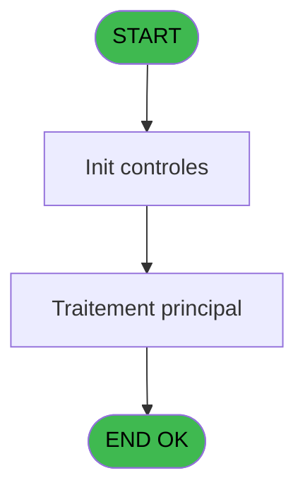
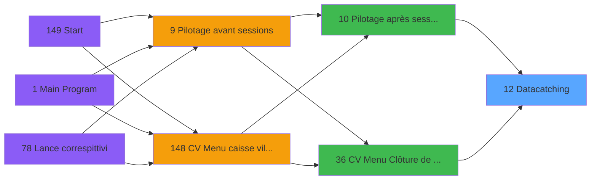

# VIL IDE 12 - Datacatching

> **Analyse**: Phases 1-4 2026-02-03 00:58 -> 00:59 (37s) | Assemblage 00:59
> **Pipeline**: V7.2 Enrichi
> **Structure**: 4 onglets (Resume | Ecrans | Donnees | Connexions)

<!-- TAB:Resume -->

## 1. FICHE D'IDENTITE

| Attribut | Valeur |
|----------|--------|
| Projet | VIL |
| IDE Position | 12 |
| Nom Programme | Datacatching |
| Fichier source | `Prg_12.xml` |
| Domaine metier | General |
| Taches | 3 (0 ecrans visibles) |
| Tables modifiees | 0 |
| Programmes appeles | 1 |

## 2. DESCRIPTION FONCTIONNELLE

**Datacatching** assure la gestion complete de ce processus, accessible depuis [Pilotage après sessions (IDE 10)](VIL-IDE-10.md), [CV  Menu Clôture de caisse (IDE 36)](VIL-IDE-36.md).

Le flux de traitement s'organise en **1 blocs fonctionnels** :

- **Traitement** (3 taches) : traitements metier divers

## 3. BLOCS FONCTIONNELS

### 3.1 Traitement (3 taches)

Traitements internes.

---

#### 12 - Datacatching

**Role** : Traitement : Datacatching.
**Delegue a** : [Export email (IDE 23)](VIL-IDE-23.md)

---

#### 12.1 - test export email

**Role** : Verification : test export email.
**Variables liees** : B (W0 export deja fait), C (W0 Email existe), D (W0 Email existe kiosque)
**Delegue a** : [Export email (IDE 23)](VIL-IDE-23.md)

---

#### 12.2 - Email Existe ?

**Role** : Traitement : Email Existe ?.
**Variables liees** : C (W0 Email existe), D (W0 Email existe kiosque)
**Delegue a** : [Export email (IDE 23)](VIL-IDE-23.md)

## 5. REGLES METIER

*(Aucune regle metier identifiee)*

## 6. CONTEXTE

- **Appele par**: [Pilotage après sessions (IDE 10)](VIL-IDE-10.md), [CV  Menu Clôture de caisse (IDE 36)](VIL-IDE-36.md)
- **Appelle**: 1 programmes | **Tables**: 3 (W:0 R:2 L:1) | **Taches**: 3 | **Expressions**: 2

<!-- TAB:Ecrans -->

## 8. ECRANS

*(Programme sans ecran visible)*

## 9. NAVIGATION

### 9.3 Structure hierarchique (3 taches)

| Position | Tache | Type | Dimensions | Bloc |
|----------|-------|------|------------|------|
| **12.1** | [**Datacatching** (12)](#t1) | MDI | - | Traitement |
| 12.1.1 | [test export email (12.1)](#t2) | MDI | - | |
| 12.1.2 | [Email Existe ? (12.2)](#t3) | MDI | - | |

### 9.4 Algorigramme

> **Legende**: Vert = START/END OK | Rouge = END KO | Bleu = Decisions
> *Algorigramme auto-genere. Utiliser `/algorigramme` pour une synthese metier detaillee.*

<!-- TAB:Donnees -->

## 10. TABLES

### Tables utilisees (3)

| ID | Nom | Description | Type | R | W | L | Usages |
|----|-----|-------------|------|---|---|---|--------|
| 22 | address_data_catching |  | DB |   |   | L | 1 |
| 285 | email |  | DB | R |   |   | 1 |
| 287 | email_exports |  | DB | R |   |   | 1 |

### Colonnes par table (2 / 2 tables avec colonnes identifiees)

Table 285 - email (R) - 1 usages

| Lettre | Variable | Acces | Type |
|--------|----------|-------|------|
| C | W0 Email existe | R | Logical |
| D | W0 Email existe kiosque | R | Logical |

Table 287 - email_exports (R) - 1 usages

| Lettre | Variable | Acces | Type |
|--------|----------|-------|------|
| C | W0 Email existe | R | Logical |
| D | W0 Email existe kiosque | R | Logical |

## 11. VARIABLES

### 11.1 Parametres entrants (1)

Variables recues du programme appelant ([Pilotage après sessions (IDE 10)](VIL-IDE-10.md)).

| Lettre | Nom | Type | Usage dans |
|--------|-----|------|-----------|
| A | p.Cloture Auto | Logical | 1x parametre entrant |

### 11.2 Variables de travail (3)

Variables internes au programme.

| Lettre | Nom | Type | Usage dans |
|--------|-----|------|-----------|
| B | W0 export deja fait | Logical | [12.1](#t2) |
| C | W0 Email existe | Logical | [12.1](#t2), [12.2](#t3) |
| D | W0 Email existe kiosque | Logical | - |

## 12. EXPRESSIONS

**2 / 2 expressions decodees (100%)**

### 12.1 Repartition par type

| Type | Expressions | Regles |
|------|-------------|--------|
| NEGATION | 1 | 0 |
| OTHER | 1 | 0 |

### 12.2 Expressions cles par type

#### NEGATION (1 expressions)

| Type | IDE | Expression | Regle |
|------|-----|------------|-------|
| NEGATION | 1 | `NOT (p.Cloture Auto [A])` | - |

#### OTHER (1 expressions)

| Type | IDE | Expression | Regle |
|------|-----|------------|-------|
| OTHER | 2 | `W0 export deja fait [B] OR W0 Email existe [C]` | - |

<!-- TAB:Connexions -->

## 13. GRAPHE D'APPELS

### 13.1 Chaine depuis Main (Callers)

Main -> ... -> [Pilotage après sessions (IDE 10)](VIL-IDE-10.md) -> **Datacatching (IDE 12)**

Main -> ... -> [CV  Menu Clôture de caisse (IDE 36)](VIL-IDE-36.md) -> **Datacatching (IDE 12)**

### 13.2 Callers

| IDE | Nom Programme | Nb Appels |
|-----|---------------|-----------|
| [10](VIL-IDE-10.md) | Pilotage après sessions | 1 |
| [36](VIL-IDE-36.md) | CV  Menu Clôture de caisse | 1 |

### 13.3 Callees (programmes appeles)

### 13.4 Detail Callees avec contexte

| IDE | Nom Programme | Appels | Contexte |
|-----|---------------|--------|----------|
| [23](VIL-IDE-23.md) | Export email | 1 | Sous-programme |

## 14. RECOMMANDATIONS MIGRATION

### 14.1 Profil du programme

| Metrique | Valeur | Impact migration |
|----------|--------|-----------------|
| Lignes de logique | 25 | Programme compact |
| Expressions | 2 | Peu de logique |
| Tables WRITE | 0 | Impact faible |
| Sous-programmes | 1 | Peu de dependances |
| Ecrans visibles | 0 | Ecran unique ou traitement batch |
| Code desactive | 0% (0 / 25) | Code sain |
| Regles metier | 0 | Pas de regle identifiee |

### 14.2 Plan de migration par bloc

#### Traitement (3 taches: 0 ecran, 3 traitements)

- **Strategie** : 3 service(s) backend injectable(s) (Domain Services).
- 1 sous-programme(s) a migrer ou a reutiliser depuis les services existants.
- Decomposer les taches en services unitaires testables.

### 14.3 Dependances critiques

| Dependance | Type | Appels | Impact |
|------------|------|--------|--------|
| [Export email (IDE 23)](VIL-IDE-23.md) | Sous-programme | 1x | Normale - Sous-programme |

---
*Spec DETAILED generee par Pipeline V7.2 - 2026-02-03 00:59*
