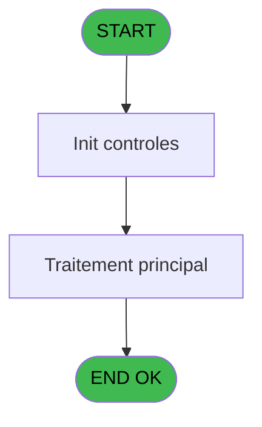
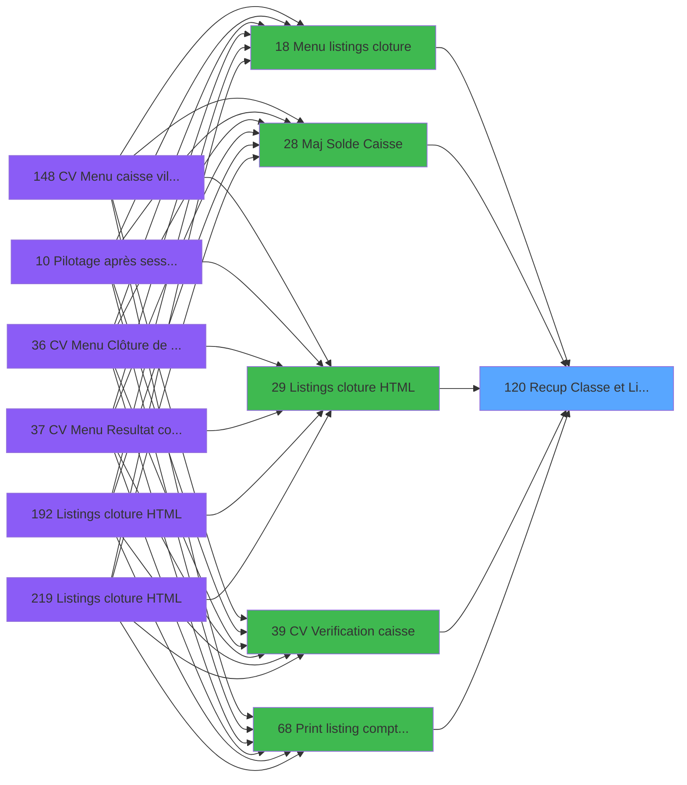

# VIL IDE 120 - Recup Classe et Lib du MOP

> **Analyse**: Phases 1-4 2026-02-03 09:31 -> 09:31 (17s) | Assemblage 09:31
> **Pipeline**: V7.2 Enrichi
> **Structure**: 4 onglets (Resume | Ecrans | Donnees | Connexions)

<!-- TAB:Resume -->

## 1. FICHE D'IDENTITE

| Attribut | Valeur |
|----------|--------|
| Projet | VIL |
| IDE Position | 120 |
| Nom Programme | Recup Classe et Lib du MOP |
| Fichier source | `Prg_120.xml` |
| Domaine metier | General |
| Taches | 3 (0 ecrans visibles) |
| Tables modifiees | 0 |
| Programmes appeles | 0 |

## 2. DESCRIPTION FONCTIONNELLE

**Recup Classe et Lib du MOP** assure la gestion complete de ce processus, accessible depuis [Menu listings cloture (IDE 18)](VIL-IDE-18.md), [    Maj Solde Caisse (IDE 215)](VIL-IDE-215.md), [CV  Verification caisse (IDE 216)](VIL-IDE-216.md), [    Listings cloture HTML (IDE 219)](VIL-IDE-219.md), [    Maj Solde Caisse (IDE 28)](VIL-IDE-28.md), [    Listings cloture HTML (IDE 29)](VIL-IDE-29.md), [CV  Verification caisse (IDE 39)](VIL-IDE-39.md), [Print listing comptable (IDE 68)](VIL-IDE-68.md), [Contrôle caisse avec (IDE 97)](VIL-IDE-97.md), [Generation pièces de caisse (IDE 99)](VIL-IDE-99.md), [Calcul coffre auto avec (IDE 116)](VIL-IDE-116.md), [    Listings cloture HTML (IDE 192)](VIL-IDE-192.md).

Le flux de traitement s'organise en **1 blocs fonctionnels** :

- **Traitement** (3 taches) : traitements metier divers

## 3. BLOCS FONCTIONNELS

### 3.1 Traitement (3 taches)

Traitements internes.

---

#### 120 - (sans nom)

**Role** : Traitement interne.

---

#### 120.1 - UNI

**Role** : Traitement interne.

---

#### 120.2 - BI

**Role** : Traitement interne.

## 5. REGLES METIER

*(Aucune regle metier identifiee)*

## 6. CONTEXTE

- **Appele par**: [Menu listings cloture (IDE 18)](VIL-IDE-18.md), [    Maj Solde Caisse (IDE 215)](VIL-IDE-215.md), [CV  Verification caisse (IDE 216)](VIL-IDE-216.md), [    Listings cloture HTML (IDE 219)](VIL-IDE-219.md), [    Maj Solde Caisse (IDE 28)](VIL-IDE-28.md), [    Listings cloture HTML (IDE 29)](VIL-IDE-29.md), [CV  Verification caisse (IDE 39)](VIL-IDE-39.md), [Print listing comptable (IDE 68)](VIL-IDE-68.md), [Contrôle caisse avec (IDE 97)](VIL-IDE-97.md), [Generation pièces de caisse (IDE 99)](VIL-IDE-99.md), [Calcul coffre auto avec (IDE 116)](VIL-IDE-116.md), [    Listings cloture HTML (IDE 192)](VIL-IDE-192.md)
- **Appelle**: 0 programmes | **Tables**: 2 (W:0 R:2 L:0) | **Taches**: 3 | **Expressions**: 2

<!-- TAB:Ecrans -->

## 8. ECRANS

*(Programme sans ecran visible)*

## 9. NAVIGATION

### 9.3 Structure hierarchique (3 taches)

| Position | Tache | Type | Dimensions | Bloc |
|----------|-------|------|------------|------|
| **120.1** | [**(sans nom)** (120)](#t1) | MDI | - | Traitement |
| 120.1.1 | [UNI (120.1)](#t2) | MDI | - | |
| 120.1.2 | [BI (120.2)](#t3) | MDI | - | |

### 9.4 Algorigramme

> **Legende**: Vert = START/END OK | Rouge = END KO | Bleu = Decisions
> *Algorigramme auto-genere. Utiliser `/algorigramme` pour une synthese metier detaillee.*

<!-- TAB:Donnees -->

## 10. TABLES

### Tables utilisees (2)

| ID | Nom | Description | Type | R | W | L | Usages |
|----|-----|-------------|------|---|---|---|--------|
| 89 | moyen_paiement___mop |  | DB | R |   |   | 1 |
| 140 | moyen_paiement___mop |  | DB | R |   |   | 1 |

### Colonnes par table (0 / 2 tables avec colonnes identifiees)

Table 89 - moyen_paiement___mop (R) - 1 usages

*Table utilisee uniquement en Link ou aucune colonne Real identifiee dans le DataView.*

Table 140 - moyen_paiement___mop (R) - 1 usages

*Table utilisee uniquement en Link ou aucune colonne Real identifiee dans le DataView.*

## 11. VARIABLES

### 11.1 Autres (6)

Variables diverses.

| Lettre | Nom | Type | Usage dans |
|--------|-----|------|-----------|
| A | Param societe | Alpha | - |
| B | Param MOP | Alpha | - |
| C | Param Classe MOP | Alpha | - |
| D | Param UNI/BI | Alpha | 2x refs |
| E | Param Libelle MOP | Alpha | - |
| F | Param existence MOP | Logical | - |

## 12. EXPRESSIONS

**2 / 2 expressions decodees (100%)**

### 12.1 Repartition par type

| Type | Expressions | Regles |
|------|-------------|--------|
| CONDITION | 2 | 0 |

### 12.2 Expressions cles par type

#### CONDITION (2 expressions)

| Type | IDE | Expression | Regle |
|------|-----|------------|-------|
| CONDITION | 2 | `Param UNI/BI [D]='B'` | - |
| CONDITION | 1 | `Param UNI/BI [D]<>'B'` | - |

<!-- TAB:Connexions -->

## 13. GRAPHE D'APPELS

### 13.1 Chaine depuis Main (Callers)

Main -> ... -> [Menu listings cloture (IDE 18)](VIL-IDE-18.md) -> **Recup Classe et Lib du MOP (IDE 120)**

Main -> ... -> [    Maj Solde Caisse (IDE 215)](VIL-IDE-215.md) -> **Recup Classe et Lib du MOP (IDE 120)**

Main -> ... -> [CV  Verification caisse (IDE 216)](VIL-IDE-216.md) -> **Recup Classe et Lib du MOP (IDE 120)**

Main -> ... -> [    Listings cloture HTML (IDE 219)](VIL-IDE-219.md) -> **Recup Classe et Lib du MOP (IDE 120)**

Main -> ... -> [    Maj Solde Caisse (IDE 28)](VIL-IDE-28.md) -> **Recup Classe et Lib du MOP (IDE 120)**

Main -> ... -> [    Listings cloture HTML (IDE 29)](VIL-IDE-29.md) -> **Recup Classe et Lib du MOP (IDE 120)**

Main -> ... -> [CV  Verification caisse (IDE 39)](VIL-IDE-39.md) -> **Recup Classe et Lib du MOP (IDE 120)**

Main -> ... -> [Print listing comptable (IDE 68)](VIL-IDE-68.md) -> **Recup Classe et Lib du MOP (IDE 120)**

Main -> ... -> [Contrôle caisse avec (IDE 97)](VIL-IDE-97.md) -> **Recup Classe et Lib du MOP (IDE 120)**

Main -> ... -> [Generation pièces de caisse (IDE 99)](VIL-IDE-99.md) -> **Recup Classe et Lib du MOP (IDE 120)**

Main -> ... -> [Calcul coffre auto avec (IDE 116)](VIL-IDE-116.md) -> **Recup Classe et Lib du MOP (IDE 120)**

Main -> ... -> [    Listings cloture HTML (IDE 192)](VIL-IDE-192.md) -> **Recup Classe et Lib du MOP (IDE 120)**

### 13.2 Callers

| IDE | Nom Programme | Nb Appels |
|-----|---------------|-----------|
| [18](VIL-IDE-18.md) | Menu listings cloture | 2 |
| [215](VIL-IDE-215.md) |     Maj Solde Caisse | 2 |
| [216](VIL-IDE-216.md) | CV  Verification caisse | 2 |
| [219](VIL-IDE-219.md) |     Listings cloture HTML | 2 |
| [28](VIL-IDE-28.md) |     Maj Solde Caisse | 1 |
| [29](VIL-IDE-29.md) |     Listings cloture HTML | 1 |
| [39](VIL-IDE-39.md) | CV  Verification caisse | 1 |
| [68](VIL-IDE-68.md) | Print listing comptable | 1 |
| [97](VIL-IDE-97.md) | Contrôle caisse avec | 1 |
| [99](VIL-IDE-99.md) | Generation pièces de caisse | 1 |
| [116](VIL-IDE-116.md) | Calcul coffre auto avec | 1 |
| [192](VIL-IDE-192.md) |     Listings cloture HTML | 1 |

### 13.3 Callees (programmes appeles)

### 13.4 Detail Callees avec contexte

| IDE | Nom Programme | Appels | Contexte |
|-----|---------------|--------|----------|
| - | (aucun) | - | - |

## 14. RECOMMANDATIONS MIGRATION

### 14.1 Profil du programme

| Metrique | Valeur | Impact migration |
|----------|--------|-----------------|
| Lignes de logique | 27 | Programme compact |
| Expressions | 2 | Peu de logique |
| Tables WRITE | 0 | Impact faible |
| Sous-programmes | 0 | Peu de dependances |
| Ecrans visibles | 0 | Ecran unique ou traitement batch |
| Code desactive | 0% (0 / 27) | Code sain |
| Regles metier | 0 | Pas de regle identifiee |

### 14.2 Plan de migration par bloc

#### Traitement (3 taches: 0 ecran, 3 traitements)

- **Strategie** : 3 service(s) backend injectable(s) (Domain Services).
- Decomposer les taches en services unitaires testables.

### 14.3 Dependances critiques

| Dependance | Type | Appels | Impact |
|------------|------|--------|--------|

---
*Spec DETAILED generee par Pipeline V7.2 - 2026-02-03 09:31*
