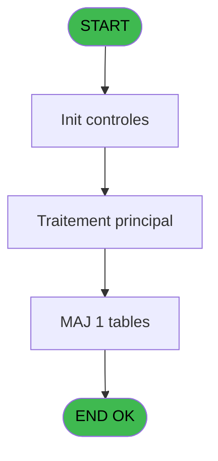
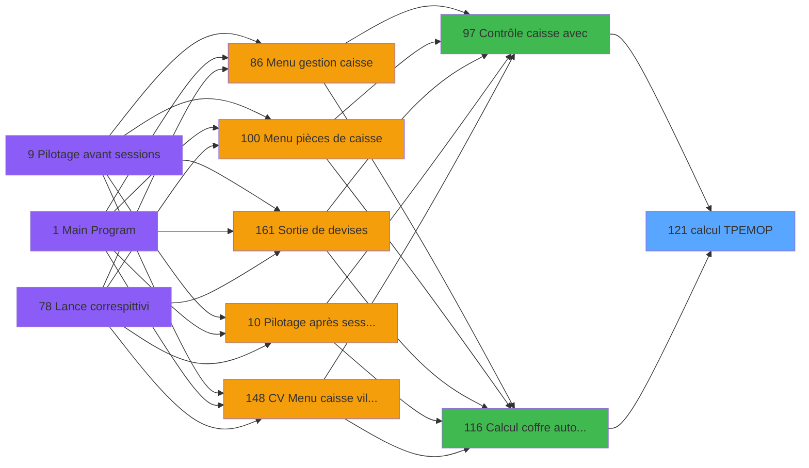

# VIL IDE 121 - calcul TPE/MOP

> **Analyse**: Phases 1-4 2026-02-03 09:31 -> 09:32 (18s) | Assemblage 09:32
> **Pipeline**: V7.2 Enrichi
> **Structure**: 4 onglets (Resume | Ecrans | Donnees | Connexions)

<!-- TAB:Resume -->

## 1. FICHE D'IDENTITE

| Attribut | Valeur |
|----------|--------|
| Projet | VIL |
| IDE Position | 121 |
| Nom Programme | calcul TPE/MOP |
| Fichier source | `Prg_121.xml` |
| Domaine metier | General |
| Taches | 4 (0 ecrans visibles) |
| Tables modifiees | 1 |
| Programmes appeles | 0 |

## 2. DESCRIPTION FONCTIONNELLE

**calcul TPE/MOP** assure la gestion complete de ce processus, accessible depuis [Contrôle caisse avec (IDE 97)](VIL-IDE-97.md), [Calcul coffre auto avec (IDE 116)](VIL-IDE-116.md).

Le flux de traitement s'organise en **3 blocs fonctionnels** :

- **Saisie** (2 taches) : ecrans de saisie utilisateur (formulaires, champs, donnees)
- **Traitement** (1 tache) : traitements metier divers
- **Initialisation** (1 tache) : reinitialisation d'etats et de variables de travail

**Donnees modifiees** : 1 tables en ecriture (total_ventes_par_mop).

Detail : phases du traitement

#### Phase 1 : Traitement (1 tache)

- **121** - (sans nom)

#### Phase 2 : Initialisation (1 tache)

- **121.1** - RAZ

#### Phase 3 : Saisie (2 taches)

- **121.2** - SAISIE v1
- **121.3** - SAISIE v1

#### Tables impactees

| Table | Operations | Role metier |
|-------|-----------|-------------|
| total_ventes_par_mop | **W**/L (3 usages) | Donnees de ventes |

## 3. BLOCS FONCTIONNELS

### 3.1 Traitement (1 tache)

Traitements internes.

---

#### 121 - (sans nom)

**Role** : Traitement interne.

### 3.2 Initialisation (1 tache)

Reinitialisation d'etats et variables de travail.

---

#### 121.1 - RAZ

**Role** : Reinitialisation des variables de travail.

### 3.3 Saisie (2 taches)

Ce bloc traite la saisie des donnees de la transaction.

---

#### 121.2 - SAISIE v1

**Role** : Saisie des donnees : SAISIE v1.

---

#### 121.3 - SAISIE v1

**Role** : Saisie des donnees : SAISIE v1.

## 5. REGLES METIER

*(Aucune regle metier identifiee)*

## 6. CONTEXTE

- **Appele par**: [Contrôle caisse avec (IDE 97)](VIL-IDE-97.md), [Calcul coffre auto avec (IDE 116)](VIL-IDE-116.md)
- **Appelle**: 0 programmes | **Tables**: 5 (W:1 R:1 L:4) | **Taches**: 4 | **Expressions**: 2

<!-- TAB:Ecrans -->

## 8. ECRANS

*(Programme sans ecran visible)*

## 9. NAVIGATION

### 9.3 Structure hierarchique (4 taches)

| Position | Tache | Type | Dimensions | Bloc |
|----------|-------|------|------------|------|
| **121.1** | [**(sans nom)** (121)](#t1) | MDI | - | Traitement |
| **121.2** | [**RAZ** (121.1)](#t2) | MDI | - | Initialisation |
| **121.3** | [**SAISIE v1** (121.2)](#t3) | MDI | - | Saisie |
| 121.3.1 | [SAISIE v1 (121.3)](#t6) | MDI | - | |

### 9.4 Algorigramme

> **Legende**: Vert = START/END OK | Rouge = END KO | Bleu = Decisions
> *Algorigramme auto-genere. Utiliser `/algorigramme` pour une synthese metier detaillee.*

<!-- TAB:Donnees -->

## 10. TABLES

### Tables utilisees (5)

| ID | Nom | Description | Type | R | W | L | Usages |
|----|-----|-------------|------|---|---|---|--------|
| 259 | tpe_par_service | Services / filieres | DB |   |   | L | 1 |
| 260 | tickets_tpe |  | DB | R |   |   | 2 |
| 265 | total_ventes_par_mop | Donnees de ventes | DB |   | **W** | L | 3 |
| 734 | arc_pv_cust_packages |  | DB |   |   | L | 1 |
| 876 | log_express_co |  | DB |   |   | L | 1 |

### Colonnes par table (0 / 2 tables avec colonnes identifiees)

Table 260 - tickets_tpe (R) - 2 usages

*Table utilisee uniquement en Link ou aucune colonne Real identifiee dans le DataView.*

Table 265 - total_ventes_par_mop (**W**/L) - 3 usages

*Table utilisee uniquement en Link ou aucune colonne Real identifiee dans le DataView.*

## 11. VARIABLES

### 11.1 Autres (2)

Variables diverses.

| Lettre | Nom | Type | Usage dans |
|--------|-----|------|-----------|
| A | param societe | Alpha | - |
| B | param date comptable | Date | - |

## 12. EXPRESSIONS

**2 / 2 expressions decodees (100%)**

### 12.1 Repartition par type

| Type | Expressions | Regles |
|------|-------------|--------|
| NEGATION | 1 | 0 |
| REFERENCE_VG | 1 | 0 |

### 12.2 Expressions cles par type

#### NEGATION (1 expressions)

| Type | IDE | Expression | Regle |
|------|-----|------------|-------|
| NEGATION | 1 | `NOT VG39` | - |

#### REFERENCE_VG (1 expressions)

| Type | IDE | Expression | Regle |
|------|-----|------------|-------|
| REFERENCE_VG | 2 | `VG39` | - |

<!-- TAB:Connexions -->

## 13. GRAPHE D'APPELS

### 13.1 Chaine depuis Main (Callers)

Main -> ... -> [Contrôle caisse avec (IDE 97)](VIL-IDE-97.md) -> **calcul TPE/MOP (IDE 121)**

Main -> ... -> [Calcul coffre auto avec (IDE 116)](VIL-IDE-116.md) -> **calcul TPE/MOP (IDE 121)**

### 13.2 Callers

| IDE | Nom Programme | Nb Appels |
|-----|---------------|-----------|
| [97](VIL-IDE-97.md) | Contrôle caisse avec | 1 |
| [116](VIL-IDE-116.md) | Calcul coffre auto avec | 1 |

### 13.3 Callees (programmes appeles)

### 13.4 Detail Callees avec contexte

| IDE | Nom Programme | Appels | Contexte |
|-----|---------------|--------|----------|
| - | (aucun) | - | - |

## 14. RECOMMANDATIONS MIGRATION

### 14.1 Profil du programme

| Metrique | Valeur | Impact migration |
|----------|--------|-----------------|
| Lignes de logique | 75 | Programme compact |
| Expressions | 2 | Peu de logique |
| Tables WRITE | 1 | Impact faible |
| Sous-programmes | 0 | Peu de dependances |
| Ecrans visibles | 0 | Ecran unique ou traitement batch |
| Code desactive | 0% (0 / 75) | Code sain |
| Regles metier | 0 | Pas de regle identifiee |

### 14.2 Plan de migration par bloc

#### Traitement (1 tache: 0 ecran, 1 traitement)

- **Strategie** : 1 service(s) backend injectable(s) (Domain Services).
- Decomposer les taches en services unitaires testables.

#### Initialisation (1 tache: 0 ecran, 1 traitement)

- **Strategie** : Constructeur/methode `InitAsync()` dans l'orchestrateur.

#### Saisie (2 taches: 0 ecran, 2 traitements)

- **Strategie** : Formulaire React/Blazor avec validation Zod/FluentValidation.
- Validation temps reel cote client + serveur

### 14.3 Dependances critiques

| Dependance | Type | Appels | Impact |
|------------|------|--------|--------|
| total_ventes_par_mop | Table WRITE (Database) | 1x | Schema + repository |

---
*Spec DETAILED generee par Pipeline V7.2 - 2026-02-03 09:32*
