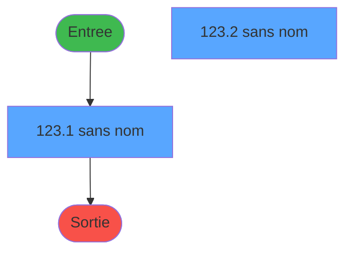
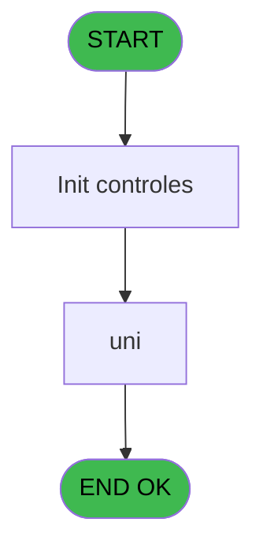
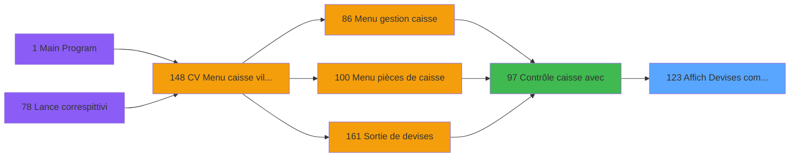
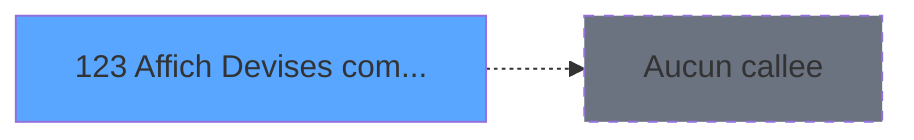

# VIL IDE 123 - Affich Devises comptees

> **Analyse**: Phases 1-4 2026-02-03 09:32 -> 09:33 (19s) | Assemblage 09:33
> **Pipeline**: V7.2 Enrichi
> **Structure**: 4 onglets (Resume | Ecrans | Donnees | Connexions)

<!-- TAB:Resume -->

## 1. FICHE D'IDENTITE

| Attribut | Valeur |
|----------|--------|
| Projet | VIL |
| IDE Position | 123 |
| Nom Programme | Affich Devises comptees |
| Fichier source | `Prg_123.xml` |
| Domaine metier | Change |
| Taches | 3 (2 ecrans visibles) |
| Tables modifiees | 0 |
| Programmes appeles | 0 |

## 2. DESCRIPTION FONCTIONNELLE

**Affich Devises comptees** assure la gestion complete de ce processus, accessible depuis [Contrôle caisse avec (IDE 97)](VIL-IDE-97.md).

Le flux de traitement s'organise en **2 blocs fonctionnels** :

- **Traitement** (2 taches) : traitements metier divers
- **Calcul** (1 tache) : calculs de montants, stocks ou compteurs

Detail : phases du traitement

#### Phase 1 : Calcul (1 tache)

- **123** - Affich Devises comptees **[[ECRAN]](#ecran-t1)**

#### Phase 2 : Traitement (2 taches)

- **123.1** - (sans nom) **[[ECRAN]](#ecran-t2)**
- **123.2** - (sans nom) **[[ECRAN]](#ecran-t3)**

## 3. BLOCS FONCTIONNELS

### 3.1 Calcul (1 tache)

Calculs metier : montants, stocks, compteurs.

---

#### 123 - Affich Devises comptees [[ECRAN]](#ecran-t1)

**Role** : Reinitialisation : Affich Devises comptees.
**Ecran** : 232 x 72 DLU (MDI) | [Voir mockup](#ecran-t1)

### 3.2 Traitement (2 taches)

Traitements internes.

---

#### 123.1 - (sans nom) [[ECRAN]](#ecran-t2)

**Role** : Traitement interne.
**Ecran** : 232 x 72 DLU (MDI) | [Voir mockup](#ecran-t2)

---

#### 123.2 - (sans nom) [[ECRAN]](#ecran-t3)

**Role** : Traitement interne.
**Ecran** : 232 x 72 DLU (MDI) | [Voir mockup](#ecran-t3)

## 5. REGLES METIER

*(Aucune regle metier identifiee)*

## 6. CONTEXTE

- **Appele par**: [Contrôle caisse avec (IDE 97)](VIL-IDE-97.md)
- **Appelle**: 0 programmes | **Tables**: 3 (W:0 R:2 L:1) | **Taches**: 3 | **Expressions**: 2

<!-- TAB:Ecrans -->

## 8. ECRANS

### 8.1 Forms visibles (2 / 3)

| # | Position | Tache | Nom | Type | Largeur | Hauteur | Bloc |
|---|----------|-------|-----|------|---------|---------|------|
| 1 | 123.1 | 123.1 | (sans nom) | MDI | 232 | 72 | Traitement |
| 2 | 123.2 | 123.2 | (sans nom) | MDI | 232 | 72 | Traitement |

### 8.2 Mockups Ecrans

---

#### 123.1 - (sans nom)
**Tache** : [123.1](#t2) | **Type** : MDI | **Dimensions** : 232 x 72 DLU
**Bloc** : Traitement | **Titre IDE** : (sans nom)

<!-- FORM-DATA:
{
    "width":  232,
    "vFactor":  8,
    "type":  "MDI",
    "hFactor":  8,
    "controls":  [
                     {
                         "x":  9,
                         "type":  "label",
                         "var":  "",
                         "y":  3,
                         "w":  217,
                         "fmt":  "",
                         "name":  "",
                         "h":  8,
                         "color":  "143",
                         "text":  "Devises comptees",
                         "parent":  null
                     },
                     {
                         "x":  9,
                         "type":  "table",
                         "var":  "",
                         "name":  "",
                         "titleH":  10,
                         "color":  "110",
                         "w":  222,
                         "y":  15,
                         "fmt":  "",
                         "parent":  null,
                         "text":  "",
                         "rowH":  9,
                         "h":  56,
                         "cols":  [
                                      {
                                          "title":  "Code",
                                          "layer":  1,
                                          "w":  48
                                      },
                                      {
                                          "title":  "MOP",
                                          "layer":  2,
                                          "w":  51
                                      },
                                      {
                                          "title":  "Solde",
                                          "layer":  3,
                                          "w":  91
                                      }
                                  ],
                         "rows":  3
                     },
                     {
                         "x":  15,
                         "type":  "edit",
                         "var":  "",
                         "y":  26,
                         "w":  40,
                         "fmt":  "",
                         "name":  "",
                         "h":  6,
                         "color":  "110",
                         "text":  "",
                         "parent":  2
                     },
                     {
                         "x":  67,
                         "type":  "edit",
                         "var":  "",
                         "y":  26,
                         "w":  40,
                         "fmt":  "",
                         "name":  "",
                         "h":  6,
                         "color":  "110",
                         "text":  "",
                         "parent":  2
                     },
                     {
                         "x":  115,
                         "type":  "edit",
                         "var":  "",
                         "y":  26,
                         "w":  80,
                         "fmt":  "",
                         "name":  "",
                         "h":  6,
                         "color":  "110",
                         "text":  "",
                         "parent":  2
                     }
                 ],
    "taskId":  "123.1",
    "height":  72
}
-->

<strong>Champs : 3 champs</strong>

| Pos (x,y) | Nom | Variable | Type |
|-----------|-----|----------|------|
| 15,26 | (sans nom) | - | edit |
| 67,26 | (sans nom) | - | edit |
| 115,26 | (sans nom) | - | edit |

---

#### 123.2 - (sans nom)
**Tache** : [123.2](#t3) | **Type** : MDI | **Dimensions** : 232 x 72 DLU
**Bloc** : Traitement | **Titre IDE** : (sans nom)

<!-- FORM-DATA:
{
    "width":  232,
    "vFactor":  8,
    "type":  "MDI",
    "hFactor":  8,
    "controls":  [
                     {
                         "x":  9,
                         "type":  "label",
                         "var":  "",
                         "y":  3,
                         "w":  217,
                         "fmt":  "",
                         "name":  "",
                         "h":  8,
                         "color":  "143",
                         "text":  "Devises comptées",
                         "parent":  null
                     },
                     {
                         "x":  9,
                         "type":  "table",
                         "var":  "",
                         "name":  "",
                         "titleH":  10,
                         "color":  "110",
                         "w":  222,
                         "y":  15,
                         "fmt":  "",
                         "parent":  null,
                         "text":  "",
                         "rowH":  9,
                         "h":  56,
                         "cols":  [
                                      {
                                          "title":  "Code",
                                          "layer":  1,
                                          "w":  48
                                      },
                                      {
                                          "title":  "MOP",
                                          "layer":  2,
                                          "w":  51
                                      },
                                      {
                                          "title":  "Solde",
                                          "layer":  3,
                                          "w":  91
                                      }
                                  ],
                         "rows":  3
                     },
                     {
                         "x":  15,
                         "type":  "edit",
                         "var":  "",
                         "y":  26,
                         "w":  40,
                         "fmt":  "",
                         "name":  "",
                         "h":  6,
                         "color":  "110",
                         "text":  "",
                         "parent":  2
                     },
                     {
                         "x":  67,
                         "type":  "edit",
                         "var":  "",
                         "y":  26,
                         "w":  40,
                         "fmt":  "",
                         "name":  "",
                         "h":  6,
                         "color":  "110",
                         "text":  "",
                         "parent":  2
                     },
                     {
                         "x":  115,
                         "type":  "edit",
                         "var":  "",
                         "y":  26,
                         "w":  80,
                         "fmt":  "",
                         "name":  "",
                         "h":  6,
                         "color":  "110",
                         "text":  "",
                         "parent":  2
                     }
                 ],
    "taskId":  "123.2",
    "height":  72
}
-->

<strong>Champs : 3 champs</strong>

| Pos (x,y) | Nom | Variable | Type |
|-----------|-----|----------|------|
| 15,26 | (sans nom) | - | edit |
| 67,26 | (sans nom) | - | edit |
| 115,26 | (sans nom) | - | edit |

## 9. NAVIGATION

### 9.1 Enchainement des ecrans

**Detail par enchainement :**

| Depuis | Action | Vers | Retour |
|--------|--------|------|--------|

### 9.3 Structure hierarchique (3 taches)

| Position | Tache | Type | Dimensions | Bloc |
|----------|-------|------|------------|------|
| **123.1** | [**Affich Devises comptees** (123)](#t1) [mockup](#ecran-t1) | MDI | 232x72 | Calcul |
| **123.2** | [**(sans nom)** (123.1)](#t2) [mockup](#ecran-t2) | MDI | 232x72 | Traitement |
| 123.2.1 | [(sans nom) (123.2)](#t3) [mockup](#ecran-t3) | MDI | 232x72 | |

### 9.4 Algorigramme

> **Legende**: Vert = START/END OK | Rouge = END KO | Bleu = Decisions
> *Algorigramme auto-genere. Utiliser `/algorigramme` pour une synthese metier detaillee.*

<!-- TAB:Donnees -->

## 10. TABLES

### Tables utilisees (3)

| ID | Nom | Description | Type | R | W | L | Usages |
|----|-----|-------------|------|---|---|---|--------|
| 90 | devises__________dev | Devises / taux de change | DB | R |   |   | 1 |
| 141 | devises__________dev | Devises / taux de change | DB | R |   |   | 1 |
| 229 | detail_coffre_devise | Etat du coffre | DB |   |   | L | 2 |

### Colonnes par table (1 / 2 tables avec colonnes identifiees)

Table 90 - devises__________dev (R) - 1 usages

*Table utilisee uniquement en Link ou aucune colonne Real identifiee dans le DataView.*

Table 141 - devises__________dev (R) - 1 usages

*Table utilisee uniquement en Link ou aucune colonne Real identifiee dans le DataView.*

## 11. VARIABLES

### 11.1 Parametres entrants (4)

Variables recues du programme appelant ([Contrôle caisse avec (IDE 97)](VIL-IDE-97.md)).

| Lettre | Nom | Type | Usage dans |
|--------|-----|------|-----------|
| A | P.Societe | Alpha | - |
| B | P.Uni/Bi | Alpha | 2x parametre entrant |
| C | P.Date comptable | Date | - |
| D | P.Devise comptee ? | Logical | - |

## 12. EXPRESSIONS

**2 / 2 expressions decodees (100%)**

### 12.1 Repartition par type

| Type | Expressions | Regles |
|------|-------------|--------|
| CONDITION | 2 | 0 |

### 12.2 Expressions cles par type

#### CONDITION (2 expressions)

| Type | IDE | Expression | Regle |
|------|-----|------------|-------|
| CONDITION | 2 | `P.Uni/Bi [B]='B'` | - |
| CONDITION | 1 | `P.Uni/Bi [B]<>'B'` | - |

<!-- TAB:Connexions -->

## 13. GRAPHE D'APPELS

### 13.1 Chaine depuis Main (Callers)

Main -> ... -> [Contrôle caisse avec (IDE 97)](VIL-IDE-97.md) -> **Affich Devises comptees (IDE 123)**

### 13.2 Callers

| IDE | Nom Programme | Nb Appels |
|-----|---------------|-----------|
| [97](VIL-IDE-97.md) | Contrôle caisse avec | 2 |

### 13.3 Callees (programmes appeles)

### 13.4 Detail Callees avec contexte

| IDE | Nom Programme | Appels | Contexte |
|-----|---------------|--------|----------|
| - | (aucun) | - | - |

## 14. RECOMMANDATIONS MIGRATION

### 14.1 Profil du programme

| Metrique | Valeur | Impact migration |
|----------|--------|-----------------|
| Lignes de logique | 35 | Programme compact |
| Expressions | 2 | Peu de logique |
| Tables WRITE | 0 | Impact faible |
| Sous-programmes | 0 | Peu de dependances |
| Ecrans visibles | 2 | Quelques ecrans |
| Code desactive | 0% (0 / 35) | Code sain |
| Regles metier | 0 | Pas de regle identifiee |

### 14.2 Plan de migration par bloc

#### Calcul (1 tache: 1 ecran, 0 traitement)

- **Strategie** : Services de calcul purs (Domain Services).
- Migrer la logique de calcul (stock, compteurs, montants)

#### Traitement (2 taches: 2 ecrans, 0 traitement)

- **Strategie** : 2 composant(s) UI (Razor/React) avec formulaires et validation.
- Decomposer les taches en services unitaires testables.

### 14.3 Dependances critiques

| Dependance | Type | Appels | Impact |
|------------|------|--------|--------|

---
*Spec DETAILED generee par Pipeline V7.2 - 2026-02-03 09:33*
