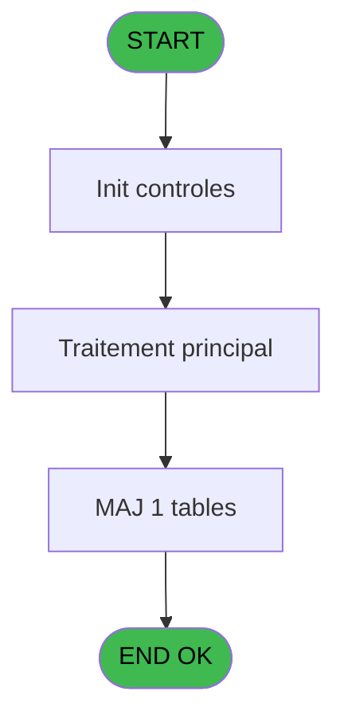
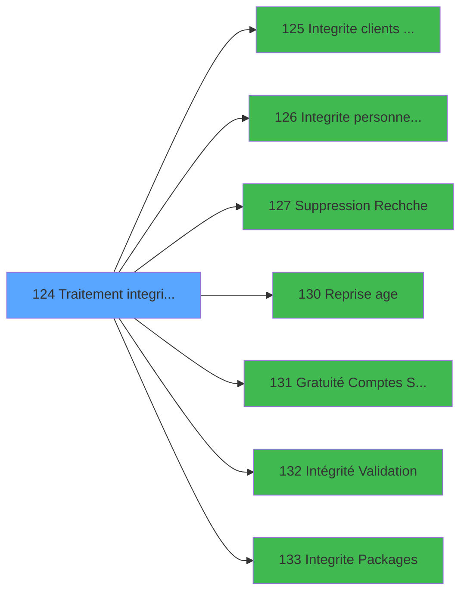

# VIL IDE 124 - Traitement integrite base

> **Analyse**: Phases 1-4 2026-02-03 09:33 -> 09:33 (18s) | Assemblage 09:33
> **Pipeline**: V7.2 Enrichi
> **Structure**: 4 onglets (Resume | Ecrans | Donnees | Connexions)

<!-- TAB:Resume -->

## 1. FICHE D'IDENTITE

| Attribut | Valeur |
|----------|--------|
| Projet | VIL |
| IDE Position | 124 |
| Nom Programme | Traitement integrite base |
| Fichier source | `Prg_124.xml` |
| Domaine metier | General |
| Taches | 27 (0 ecrans visibles) |
| Tables modifiees | 1 |
| Programmes appeles | 7 |

## 2. DESCRIPTION FONCTIONNELLE

**Traitement integrite base** assure la gestion complete de ce processus, accessible depuis [Pilotage avant sessions (IDE 9)](VIL-IDE-9.md).

Le flux de traitement s'organise en **2 blocs fonctionnels** :

- **Traitement** (26 taches) : traitements metier divers
- **Saisie** (1 tache) : ecrans de saisie utilisateur (formulaires, champs, donnees)

**Donnees modifiees** : 1 tables en ecriture (compteurs________cpt).

Detail : phases du traitement

#### Phase 1 : Traitement (26 taches)

- **124** - Traitement integrite base
- **124.1** - Suppression gmc orphelin
- **124.2** - Suppression heb orphelin
- **124.3** - Suppression Lignes Vides
- **124.4** - Suppresion mails sans adresse
- **124.5** - Suppresion mails sans adresse
- **124.6** - Suppression Logs WS + 3 mois
- **124.7** - Suppression Logs TPE + 3 mois
- **124.8** - Suppression Logs WS + 3 mois
- **124.9** - Suppression Logs TPE + 3 mois
- **124.10** - Numéro pièce de caisse **[[ECRAN]](#ecran-t19)**
- **124.11** - Suppression Logs TPE + 3 mois
- **124.12** - Suppression Logs WS + 3 mois
- **124.13** - Suppression Lignes Vides
- **124.14** - Suppression gmc orphelin
- **124.15** - Suppression Logs WS + 3 mois
- **124.16** - (sans nom)
- **124.17** - Suppression gmc orphelin
- **124.18** - Suppression gmc orphelin
- **124.19** - Suppression gmc orphelin
- **124.20** - Suppression gmc orphelin
- **124.21** - Suppression gmc orphelin
- **124.22** - Suppression gmc orphelin
- **124.23** - Suppression gmc orphelin
- **124.24** - Suppression gmc orphelin
- **124.25** - Suppression gmc orphelin

Delegue a : [   Integrite clients Identite (IDE 125)](VIL-IDE-125.md), [ Integrite personnel identites (IDE 126)](VIL-IDE-126.md), [Reprise age (IDE 130)](VIL-IDE-130.md), [Integrite Packages (IDE 133)](VIL-IDE-133.md)

#### Phase 2 : Saisie (1 tache)

- **124.26** - Ventes en attente ODY

#### Tables impactees

| Table | Operations | Role metier |
|-------|-----------|-------------|
| compteurs________cpt | **W** (1 usages) | Comptes GM (generaux) |

## 3. BLOCS FONCTIONNELS

### 3.1 Traitement (26 taches)

Traitements internes.

---

#### 124 - Traitement integrite base

**Role** : Tache d'orchestration : point d'entree du programme (26 sous-taches). Coordonne l'enchainement des traitements.

25 sous-taches directes

| Tache | Nom | Bloc |
|-------|-----|------|
| [124.1](#t2) | Suppression gmc orphelin | Traitement |
| [124.2](#t3) | Suppression heb orphelin | Traitement |
| [124.3](#t4) | Suppression Lignes Vides | Traitement |
| [124.4](#t5) | Suppresion mails sans adresse | Traitement |
| [124.5](#t8) | Suppresion mails sans adresse | Traitement |
| [124.6](#t9) | Suppression Logs WS + 3 mois | Traitement |
| [124.7](#t12) | Suppression Logs TPE + 3 mois | Traitement |
| [124.8](#t15) | Suppression Logs WS + 3 mois | Traitement |
| [124.9](#t18) | Suppression Logs TPE + 3 mois | Traitement |
| [124.10](#t19) | Numéro pièce de caisse **[[ECRAN]](#ecran-t19)** | Traitement |
| [124.11](#t22) | Suppression Logs TPE + 3 mois | Traitement |
| [124.12](#t25) | Suppression Logs WS + 3 mois | Traitement |
| [124.13](#t28) | Suppression Lignes Vides | Traitement |
| [124.14](#t31) | Suppression gmc orphelin | Traitement |
| [124.15](#t35) | Suppression Logs WS + 3 mois | Traitement |
| [124.16](#t36) | (sans nom) | Traitement |
| [124.17](#t40) | Suppression gmc orphelin | Traitement |
| [124.18](#t43) | Suppression gmc orphelin | Traitement |
| [124.19](#t46) | Suppression gmc orphelin | Traitement |
| [124.20](#t53) | Suppression gmc orphelin | Traitement |
| [124.21](#t56) | Suppression gmc orphelin | Traitement |
| [124.22](#t59) | Suppression gmc orphelin | Traitement |
| [124.23](#t62) | Suppression gmc orphelin | Traitement |
| [124.24](#t65) | Suppression gmc orphelin | Traitement |
| [124.25](#t71) | Suppression gmc orphelin | Traitement |

---

#### 124.1 - Suppression gmc orphelin

**Role** : Traitement : Suppression gmc orphelin.

---

#### 124.2 - Suppression heb orphelin

**Role** : Traitement : Suppression heb orphelin.

---

#### 124.3 - Suppression Lignes Vides

**Role** : Traitement : Suppression Lignes Vides.

---

#### 124.4 - Suppresion mails sans adresse

**Role** : Traitement : Suppresion mails sans adresse.

---

#### 124.5 - Suppresion mails sans adresse

**Role** : Traitement : Suppresion mails sans adresse.

---

#### 124.6 - Suppression Logs WS + 3 mois

**Role** : Traitement : Suppression Logs WS + 3 mois.

---

#### 124.7 - Suppression Logs TPE + 3 mois

**Role** : Traitement : Suppression Logs TPE + 3 mois.

---

#### 124.8 - Suppression Logs WS + 3 mois

**Role** : Traitement : Suppression Logs WS + 3 mois.

---

#### 124.9 - Suppression Logs TPE + 3 mois

**Role** : Traitement : Suppression Logs TPE + 3 mois.

---

#### 124.10 - Numéro pièce de caisse [[ECRAN]](#ecran-t19)

**Role** : Traitement : Numéro pièce de caisse.
**Ecran** : 175 x 195 DLU | [Voir mockup](#ecran-t19)
**Variables liees** : A (piece_de_caisse_max)

---

#### 124.11 - Suppression Logs TPE + 3 mois

**Role** : Traitement : Suppression Logs TPE + 3 mois.

---

#### 124.12 - Suppression Logs WS + 3 mois

**Role** : Traitement : Suppression Logs WS + 3 mois.

---

#### 124.13 - Suppression Lignes Vides

**Role** : Traitement : Suppression Lignes Vides.

---

#### 124.14 - Suppression gmc orphelin

**Role** : Traitement : Suppression gmc orphelin.

---

#### 124.15 - Suppression Logs WS + 3 mois

**Role** : Traitement : Suppression Logs WS + 3 mois.

---

#### 124.16 - (sans nom)

**Role** : Traitement interne.

---

#### 124.17 - Suppression gmc orphelin

**Role** : Traitement : Suppression gmc orphelin.

---

#### 124.18 - Suppression gmc orphelin

**Role** : Traitement : Suppression gmc orphelin.

---

#### 124.19 - Suppression gmc orphelin

**Role** : Traitement : Suppression gmc orphelin.

---

#### 124.20 - Suppression gmc orphelin

**Role** : Traitement : Suppression gmc orphelin.

---

#### 124.21 - Suppression gmc orphelin

**Role** : Traitement : Suppression gmc orphelin.

---

#### 124.22 - Suppression gmc orphelin

**Role** : Traitement : Suppression gmc orphelin.

---

#### 124.23 - Suppression gmc orphelin

**Role** : Traitement : Suppression gmc orphelin.

---

#### 124.24 - Suppression gmc orphelin

**Role** : Traitement : Suppression gmc orphelin.

---

#### 124.25 - Suppression gmc orphelin

**Role** : Traitement : Suppression gmc orphelin.

### 3.2 Saisie (1 tache)

Ce bloc traite la saisie des donnees de la transaction.

---

#### 124.26 - Ventes en attente ODY

**Role** : Saisie des donnees : Ventes en attente ODY.

## 5. REGLES METIER

*(Aucune regle metier identifiee)*

## 6. CONTEXTE

- **Appele par**: [Pilotage avant sessions (IDE 9)](VIL-IDE-9.md)
- **Appelle**: 7 programmes | **Tables**: 2 (W:1 R:1 L:0) | **Taches**: 27 | **Expressions**: 8

<!-- TAB:Ecrans -->

## 8. ECRANS

*(Programme sans ecran visible)*

## 9. NAVIGATION

### 9.3 Structure hierarchique (27 taches)

| Position | Tache | Type | Dimensions | Bloc |
|----------|-------|------|------------|------|
| **124.1** | [**Traitement integrite base** (124)](#t1) | MDI | - | Traitement |
| 124.1.1 | [Suppression gmc orphelin (124.1)](#t2) | - | - | |
| 124.1.2 | [Suppression heb orphelin (124.2)](#t3) | - | - | |
| 124.1.3 | [Suppression Lignes Vides (124.3)](#t4) | - | - | |
| 124.1.4 | [Suppresion mails sans adresse (124.4)](#t5) | - | - | |
| 124.1.5 | [Suppresion mails sans adresse (124.5)](#t8) | - | - | |
| 124.1.6 | [Suppression Logs WS + 3 mois (124.6)](#t9) | - | - | |
| 124.1.7 | [Suppression Logs TPE + 3 mois (124.7)](#t12) | - | - | |
| 124.1.8 | [Suppression Logs WS + 3 mois (124.8)](#t15) | - | - | |
| 124.1.9 | [Suppression Logs TPE + 3 mois (124.9)](#t18) | - | - | |
| 124.1.10 | [Numéro pièce de caisse (124.10)](#t19) [mockup](#ecran-t19) | - | 175x195 | |
| 124.1.11 | [Suppression Logs TPE + 3 mois (124.11)](#t22) | - | - | |
| 124.1.12 | [Suppression Logs WS + 3 mois (124.12)](#t25) | - | - | |
| 124.1.13 | [Suppression Lignes Vides (124.13)](#t28) | - | - | |
| 124.1.14 | [Suppression gmc orphelin (124.14)](#t31) | - | - | |
| 124.1.15 | [Suppression Logs WS + 3 mois (124.15)](#t35) | - | - | |
| 124.1.16 | [(sans nom) (124.16)](#t36) | - | - | |
| 124.1.17 | [Suppression gmc orphelin (124.17)](#t40) | - | - | |
| 124.1.18 | [Suppression gmc orphelin (124.18)](#t43) | - | - | |
| 124.1.19 | [Suppression gmc orphelin (124.19)](#t46) | - | - | |
| 124.1.20 | [Suppression gmc orphelin (124.20)](#t53) | - | - | |
| 124.1.21 | [Suppression gmc orphelin (124.21)](#t56) | - | - | |
| 124.1.22 | [Suppression gmc orphelin (124.22)](#t59) | - | - | |
| 124.1.23 | [Suppression gmc orphelin (124.23)](#t62) | - | - | |
| 124.1.24 | [Suppression gmc orphelin (124.24)](#t65) | - | - | |
| 124.1.25 | [Suppression gmc orphelin (124.25)](#t71) | - | - | |
| **124.2** | [**Ventes en attente ODY** (124.26)](#t72) | - | - | Saisie |

### 9.4 Algorigramme

> **Legende**: Vert = START/END OK | Rouge = END KO | Bleu = Decisions
> *Algorigramme auto-genere. Utiliser `/algorigramme` pour une synthese metier detaillee.*

<!-- TAB:Donnees -->

## 10. TABLES

### Tables utilisees (2)

| ID | Nom | Description | Type | R | W | L | Usages |
|----|-----|-------------|------|---|---|---|--------|
| 68 | compteurs________cpt | Comptes GM (generaux) | DB |   | **W** |   | 1 |
| 728 | arc_cc_total |  | DB | R |   |   | 1 |

### Colonnes par table (0 / 2 tables avec colonnes identifiees)

Table 68 - compteurs________cpt (**W**) - 1 usages

*Table utilisee uniquement en Link ou aucune colonne Real identifiee dans le DataView.*

Table 728 - arc_cc_total (R) - 1 usages

*Table utilisee uniquement en Link ou aucune colonne Real identifiee dans le DataView.*

## 11. VARIABLES

*(Programme sans variables locales mappees)*

## 12. EXPRESSIONS

**8 / 8 expressions decodees (100%)**

### 12.1 Repartition par type

| Type | Expressions | Regles |
|------|-------------|--------|
| CONSTANTE | 1 | 0 |
| OTHER | 4 | 0 |
| REFERENCE_VG | 2 | 0 |
| NEGATION | 1 | 0 |

### 12.2 Expressions cles par type

#### CONSTANTE (1 expressions)

| Type | IDE | Expression | Regle |
|------|-----|------------|-------|
| CONSTANTE | 3 | `'C'` | - |

#### OTHER (4 expressions)

| Type | IDE | Expression | Regle |
|------|-----|------------|-------|
| OTHER | 4 | `SetParam ('FISCALITEGREC',IF ([B],'O','N'))` | - |
| OTHER | 7 | `VG48 OR VG49 OR VG50` | - |
| OTHER | 1 | `SetCrsr (2)` | - |
| OTHER | 2 | `SetCrsr (1)` | - |

#### REFERENCE_VG (2 expressions)

| Type | IDE | Expression | Regle |
|------|-----|------------|-------|
| REFERENCE_VG | 8 | `VG52` | - |
| REFERENCE_VG | 5 | `VG38` | - |

#### NEGATION (1 expressions)

| Type | IDE | Expression | Regle |
|------|-----|------------|-------|
| NEGATION | 6 | `NOT VG43` | - |

<!-- TAB:Connexions -->

## 13. GRAPHE D'APPELS

### 13.1 Chaine depuis Main (Callers)

Main -> ... -> [Pilotage avant sessions (IDE 9)](VIL-IDE-9.md) -> **Traitement integrite base (IDE 124)**

### 13.2 Callers

| IDE | Nom Programme | Nb Appels |
|-----|---------------|-----------|
| [9](VIL-IDE-9.md) | Pilotage avant sessions | 1 |

### 13.3 Callees (programmes appeles)

### 13.4 Detail Callees avec contexte

| IDE | Nom Programme | Appels | Contexte |
|-----|---------------|--------|----------|
| [125](VIL-IDE-125.md) |    Integrite clients Identite | 1 | Sous-programme |
| [126](VIL-IDE-126.md) |  Integrite personnel identites | 1 | Sous-programme |
| [127](VIL-IDE-127.md) |    Suppression Rechche | 1 | Sous-programme |
| [130](VIL-IDE-130.md) | Reprise age | 1 | Sous-programme |
| [131](VIL-IDE-131.md) | Gratuité Comptes Spéciaux | 1 | Sous-programme |
| [132](VIL-IDE-132.md) | Intégrité Validation | 1 | Sous-programme |
| [133](VIL-IDE-133.md) | Integrite Packages | 1 | Sous-programme |

## 14. RECOMMANDATIONS MIGRATION

### 14.1 Profil du programme

| Metrique | Valeur | Impact migration |
|----------|--------|-----------------|
| Lignes de logique | 94 | Programme compact |
| Expressions | 8 | Peu de logique |
| Tables WRITE | 1 | Impact faible |
| Sous-programmes | 7 | Dependances moderees |
| Ecrans visibles | 0 | Ecran unique ou traitement batch |
| Code desactive | 0% (0 / 94) | Code sain |
| Regles metier | 0 | Pas de regle identifiee |

### 14.2 Plan de migration par bloc

#### Traitement (26 taches: 1 ecran, 25 traitements)

- **Strategie** : Orchestrateur avec 1 ecrans (Razor/React) et 25 traitements backend (services).
- Les ecrans deviennent des composants UI, les traitements invisibles deviennent des services injectables.
- 7 sous-programme(s) a migrer ou a reutiliser depuis les services existants.
- Decomposer les taches en services unitaires testables.

#### Saisie (1 tache: 0 ecran, 1 traitement)

- **Strategie** : Formulaire React/Blazor avec validation Zod/FluentValidation.
- Validation temps reel cote client + serveur

### 14.3 Dependances critiques

| Dependance | Type | Appels | Impact |
|------------|------|--------|--------|
| compteurs________cpt | Table WRITE (Database) | 1x | Schema + repository |
| [Gratuité Comptes Spéciaux (IDE 131)](VIL-IDE-131.md) | Sous-programme | 1x | Normale - Sous-programme |
| [Intégrité Validation (IDE 132)](VIL-IDE-132.md) | Sous-programme | 1x | Normale - Sous-programme |
| [Integrite Packages (IDE 133)](VIL-IDE-133.md) | Sous-programme | 1x | Normale - Sous-programme |
| [Reprise age (IDE 130)](VIL-IDE-130.md) | Sous-programme | 1x | Normale - Sous-programme |
| [   Integrite clients Identite (IDE 125)](VIL-IDE-125.md) | Sous-programme | 1x | Normale - Sous-programme |
| [ Integrite personnel identites (IDE 126)](VIL-IDE-126.md) | Sous-programme | 1x | Normale - Sous-programme |
| [   Suppression Rechche (IDE 127)](VIL-IDE-127.md) | Sous-programme | 1x | Normale - Sous-programme |

---
*Spec DETAILED generee par Pipeline V7.2 - 2026-02-03 09:33*
