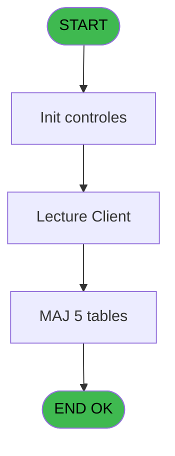
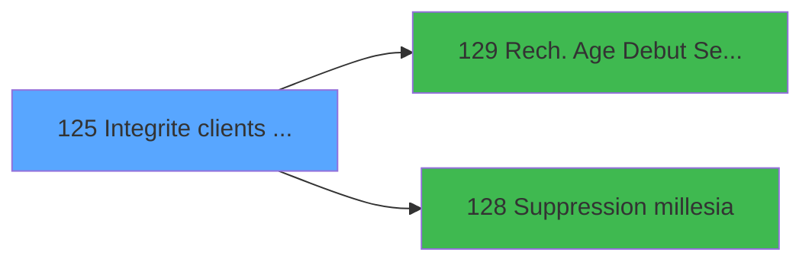

# VIL IDE 125 - Integrite clients Identite

> **Analyse**: Phases 1-4 2026-02-03 09:33 -> 09:33 (19s) | Assemblage 09:33
> **Pipeline**: V7.2 Enrichi
> **Structure**: 4 onglets (Resume | Ecrans | Donnees | Connexions)

<!-- TAB:Resume -->

## 1. FICHE D'IDENTITE

| Attribut | Valeur |
|----------|--------|
| Projet | VIL |
| IDE Position | 125 |
| Nom Programme | Integrite clients Identite |
| Fichier source | `Prg_125.xml` |
| Domaine metier | General |
| Taches | 11 (1 ecrans visibles) |
| Tables modifiees | 5 |
| Programmes appeles | 2 |

## 2. DESCRIPTION FONCTIONNELLE

**Integrite clients Identite** assure la gestion complete de ce processus, accessible depuis [Traitement integrite base (IDE 124)](VIL-IDE-124.md).

Le flux de traitement s'organise en **2 blocs fonctionnels** :

- **Traitement** (10 taches) : traitements metier divers
- **Consultation** (1 tache) : ecrans de recherche, selection et consultation

**Donnees modifiees** : 5 tables en ecriture (gm-recherche_____gmr, gm-complet_______gmc, compte_gm________cgm, heb_circuit______hci, fi_complet_______gm_go).

Detail : phases du traitement

#### Phase 1 : Traitement (10 taches)

- **125** - Module des Clients
- **125.1** - Determination Age Bebe
- **125.2** - Veuillez patienter ... **[[ECRAN]](#ecran-t3)**
- **125.2.1** - Modification Hebergement
- **125.2.2** - Modification Hebergement
- **125.2.3** - Clients **[[ECRAN]](#ecran-t6)**
- **125.2.5** - Clients **[[ECRAN]](#ecran-t8)**
- **125.2.6** - Veuillez patienter ... **[[ECRAN]](#ecran-t9)**
- **125.3** - Telephone Grec
- **125.3.1** - Upd Histo Tel

Delegue a : [   Suppression millesia (IDE 128)](VIL-IDE-128.md)

#### Phase 2 : Consultation (1 tache)

- **125.2.4** - Modif recherche

Delegue a : [   Rech. Age Debut Sejour (IDE 129)](VIL-IDE-129.md)

#### Tables impactees

| Table | Operations | Role metier |
|-------|-----------|-------------|
| gm-recherche_____gmr | R/**W** (3 usages) | Index de recherche |
| gm-complet_______gmc | **W** (2 usages) |  |
| compte_gm________cgm | **W** (1 usages) | Comptes GM (generaux) |
| heb_circuit______hci | **W** (1 usages) | Hebergement (chambres) |
| fi_complet_______gm_go | **W** (1 usages) |  |

## 3. BLOCS FONCTIONNELS

### 3.1 Traitement (10 taches)

Traitements internes.

---

#### 125 - Module des Clients

**Role** : Tache d'orchestration : point d'entree du programme (10 sous-taches). Coordonne l'enchainement des traitements.

9 sous-taches directes

| Tache | Nom | Bloc |
|-------|-----|------|
| [125.1](#t2) | Determination Age Bebe | Traitement |
| [125.2](#t3) | Veuillez patienter ... **[[ECRAN]](#ecran-t3)** | Traitement |
| [125.2.1](#t4) | Modification Hebergement | Traitement |
| [125.2.2](#t5) | Modification Hebergement | Traitement |
| [125.2.3](#t6) | Clients **[[ECRAN]](#ecran-t6)** | Traitement |
| [125.2.5](#t8) | Clients **[[ECRAN]](#ecran-t8)** | Traitement |
| [125.2.6](#t9) | Veuillez patienter ... **[[ECRAN]](#ecran-t9)** | Traitement |
| [125.3](#t10) | Telephone Grec | Traitement |
| [125.3.1](#t11) | Upd Histo Tel | Traitement |

**Delegue a** : [   Suppression millesia (IDE 128)](VIL-IDE-128.md)

---

#### 125.1 - Determination Age Bebe

**Role** : Traitement : Determination Age Bebe.
**Variables liees** : A (W0-Age Bebe)
**Delegue a** : [   Suppression millesia (IDE 128)](VIL-IDE-128.md)

---

#### 125.2 - Veuillez patienter ... [[ECRAN]](#ecran-t3)

**Role** : Traitement : Veuillez patienter ....
**Ecran** : 424 x 57 DLU (MDI) | [Voir mockup](#ecran-t3)
**Delegue a** : [   Suppression millesia (IDE 128)](VIL-IDE-128.md)

---

#### 125.2.1 - Modification Hebergement

**Role** : Traitement : Modification Hebergement.
**Delegue a** : [   Suppression millesia (IDE 128)](VIL-IDE-128.md)

---

#### 125.2.2 - Modification Hebergement

**Role** : Traitement : Modification Hebergement.
**Delegue a** : [   Suppression millesia (IDE 128)](VIL-IDE-128.md)

---

#### 125.2.3 - Clients [[ECRAN]](#ecran-t6)

**Role** : Traitement : Clients.
**Ecran** : 216 x 52 DLU (MDI) | [Voir mockup](#ecran-t6)
**Delegue a** : [   Suppression millesia (IDE 128)](VIL-IDE-128.md)

---

#### 125.2.5 - Clients [[ECRAN]](#ecran-t8)

**Role** : Traitement : Clients.
**Ecran** : 216 x 52 DLU (MDI) | [Voir mockup](#ecran-t8)
**Delegue a** : [   Suppression millesia (IDE 128)](VIL-IDE-128.md)

---

#### 125.2.6 - Veuillez patienter ... [[ECRAN]](#ecran-t9)

**Role** : Traitement : Veuillez patienter ....
**Ecran** : 424 x 57 DLU (MDI) | [Voir mockup](#ecran-t9)
**Delegue a** : [   Suppression millesia (IDE 128)](VIL-IDE-128.md)

---

#### 125.3 - Telephone Grec

**Role** : Traitement : Telephone Grec.
**Delegue a** : [   Suppression millesia (IDE 128)](VIL-IDE-128.md)

---

#### 125.3.1 - Upd Histo Tel

**Role** : Traitement : Upd Histo Tel.
**Delegue a** : [   Suppression millesia (IDE 128)](VIL-IDE-128.md)

### 3.2 Consultation (1 tache)

Ecrans de recherche et consultation.

---

#### 125.2.4 - Modif recherche

**Role** : Traitement : Modif recherche.
**Delegue a** : [   Rech. Age Debut Sejour (IDE 129)](VIL-IDE-129.md)

## 5. REGLES METIER

*(Aucune regle metier identifiee)*

## 6. CONTEXTE

- **Appele par**: [Traitement integrite base (IDE 124)](VIL-IDE-124.md)
- **Appelle**: 2 programmes | **Tables**: 16 (W:5 R:3 L:10) | **Taches**: 11 | **Expressions**: 3

<!-- TAB:Ecrans -->

## 8. ECRANS

### 8.1 Forms visibles (1 / 11)

| # | Position | Tache | Nom | Type | Largeur | Hauteur | Bloc |
|---|----------|-------|-----|------|---------|---------|------|
| 1 | 125.2 | 125.2 | Veuillez patienter ... | MDI | 424 | 57 | Traitement |

### 8.2 Mockups Ecrans

---

#### 125.2 - Veuillez patienter ...
**Tache** : [125.2](#t3) | **Type** : MDI | **Dimensions** : 424 x 57 DLU
**Bloc** : Traitement | **Titre IDE** : Veuillez patienter ...

<!-- FORM-DATA:
{
    "width":  424,
    "vFactor":  8,
    "type":  "MDI",
    "hFactor":  8,
    "controls":  [
                     {
                         "x":  0,
                         "type":  "label",
                         "var":  "",
                         "y":  0,
                         "w":  423,
                         "fmt":  "",
                         "name":  "",
                         "h":  29,
                         "color":  "",
                         "text":  "",
                         "parent":  null
                     },
                     {
                         "x":  117,
                         "type":  "label",
                         "var":  "",
                         "y":  10,
                         "w":  275,
                         "fmt":  "",
                         "name":  "",
                         "h":  8,
                         "color":  "7",
                         "text":  "Integrite de la base",
                         "parent":  null
                     },
                     {
                         "x":  0,
                         "type":  "label",
                         "var":  "",
                         "y":  29,
                         "w":  423,
                         "fmt":  "",
                         "name":  "",
                         "h":  27,
                         "color":  "",
                         "text":  "",
                         "parent":  null
                     },
                     {
                         "x":  38,
                         "type":  "label",
                         "var":  "",
                         "y":  39,
                         "w":  347,
                         "fmt":  "",
                         "name":  "",
                         "h":  8,
                         "color":  "",
                         "text":  "Verification des GM",
                         "parent":  null
                     },
                     {
                         "x":  1,
                         "type":  "image",
                         "var":  "",
                         "y":  2,
                         "w":  72,
                         "fmt":  "",
                         "name":  "",
                         "h":  25,
                         "color":  "",
                         "text":  "",
                         "parent":  null
                     }
                 ],
    "taskId":  "125.2",
    "height":  57
}
-->

## 9. NAVIGATION

Ecran unique: **Veuillez patienter ...**

### 9.3 Structure hierarchique (11 taches)

| Position | Tache | Type | Dimensions | Bloc |
|----------|-------|------|------------|------|
| **125.1** | [**Module des Clients** (125)](#t1) | MDI | - | Traitement |
| 125.1.1 | [Determination Age Bebe (125.1)](#t2) | MDI | - | |
| 125.1.2 | [Veuillez patienter ... (125.2)](#t3) [mockup](#ecran-t3) | MDI | 424x57 | |
| 125.1.3 | [Modification Hebergement (125.2.1)](#t4) | MDI | - | |
| 125.1.4 | [Modification Hebergement (125.2.2)](#t5) | MDI | - | |
| 125.1.5 | [Clients (125.2.3)](#t6) [mockup](#ecran-t6) | MDI | 216x52 | |
| 125.1.6 | [Clients (125.2.5)](#t8) [mockup](#ecran-t8) | MDI | 216x52 | |
| 125.1.7 | [Veuillez patienter ... (125.2.6)](#t9) [mockup](#ecran-t9) | MDI | 424x57 | |
| 125.1.8 | [Telephone Grec (125.3)](#t10) | MDI | - | |
| 125.1.9 | [Upd Histo Tel (125.3.1)](#t11) | MDI | - | |
| **125.2** | [**Modif recherche** (125.2.4)](#t7) | MDI | - | Consultation |

### 9.4 Algorigramme

> **Legende**: Vert = START/END OK | Rouge = END KO | Bleu = Decisions
> *Algorigramme auto-genere. Utiliser `/algorigramme` pour une synthese metier detaillee.*

<!-- TAB:Donnees -->

## 10. TABLES

### Tables utilisees (16)

| ID | Nom | Description | Type | R | W | L | Usages |
|----|-----|-------------|------|---|---|---|--------|
| 30 | gm-recherche_____gmr | Index de recherche | DB | R | **W** |   | 3 |
| 31 | gm-complet_______gmc |  | DB |   | **W** |   | 2 |
| 34 | hebergement______heb | Hebergement (chambres) | DB |   |   | L | 1 |
| 36 | client_gm |  | DB |   |   | L | 1 |
| 47 | compte_gm________cgm | Comptes GM (generaux) | DB |   | **W** |   | 1 |
| 60 | table_code_acces_tca |  | DB | R |   |   | 1 |
| 79 | gratuites________gra |  | DB |   |   | L | 1 |
| 80 | codes_autocom____aut |  | DB |   |   | L | 1 |
| 113 | tables_village |  | DB | R |   | L | 2 |
| 131 | fichier_validation |  | DB |   |   | L | 2 |
| 137 | fichier_histotel | Historique / journal | DB |   |   | L | 1 |
| 138 | fichier_taxetel |  | DB |   |   | L | 1 |
| 155 | historique_pabx | Historique / journal | DB |   |   | L | 1 |
| 157 | coef__telephone__coe |  | DB |   |   | L | 1 |
| 168 | heb_circuit______hci | Hebergement (chambres) | DB |   | **W** |   | 1 |
| 315 | fi_complet_______gm_go |  | DB |   | **W** |   | 1 |

### Colonnes par table (5 / 7 tables avec colonnes identifiees)

Table 30 - gm-recherche_____gmr (R/**W**) - 3 usages

*Table utilisee uniquement en Link ou aucune colonne Real identifiee dans le DataView.*

Table 31 - gm-complet_______gmc (**W**) - 2 usages

| Lettre | Variable | Acces | Type |
|--------|----------|-------|------|
| A | W1-autorisation | W | Alpha |
| B | W1-fin tache | W | Logical |
| C | W1-age codifie | W | Alpha |
| D | W1-Nb mois | W | Numeric |
| E | W1-fin compte | W | Date |
| F | W1-Numero compte memo | W | Numeric |
| G | W1-Filliation | W | Numeric |
| H | v cdr dgm complet | W | Logical |
| I | W1-select fleurs | W | Alpha |
| J | W1-select honey moon | W | Alpha |
| K | W1-select millesia | W | Alpha |
| L | W1-retour vol retour | W | Logical |
| M | W1-accord filiation | W | Logical |
| N | W1-select fumeur | W | Alpha |
| O | W1 N° Piece | W | Alpha |
| P | W1 Date de delivrance | W | Date |
| Q | W1 Ville delivrance | W | Alpha |
| R | W1 pays delivrance piece | W | Alpha |
| S | W1 n dans la rue | W | Alpha |
| T | W1 Nom de la rue | W | Alpha |
| U | W1 Commune | W | Alpha |
| V | W1 Code postal | W | Alpha |
| W | W1 Ville | W | Alpha |
| X | W1 Proffession | W | Alpha |
| Y | v.retour gratuités | W | Logical |

Table 47 - compte_gm________cgm (**W**) - 1 usages

| Lettre | Variable | Acces | Type |
|--------|----------|-------|------|
| E | W1-fin compte | W | Date |
| F | W1-Numero compte memo | W | Numeric |

Table 60 - table_code_acces_tca (R) - 1 usages

| Lettre | Variable | Acces | Type |
|--------|----------|-------|------|
| A | V.existe code autocom ? | R | Logical |
| V | W1 Code postal | R | Alpha |

Table 113 - tables_village (R/L) - 2 usages

*Table utilisee uniquement en Link ou aucune colonne Real identifiee dans le DataView.*

Table 168 - heb_circuit______hci (**W**) - 1 usages

*Table utilisee uniquement en Link ou aucune colonne Real identifiee dans le DataView.*

Table 315 - fi_complet_______gm_go (**W**) - 1 usages

| Lettre | Variable | Acces | Type |
|--------|----------|-------|------|
| H | v cdr dgm complet | W | Logical |

## 11. VARIABLES

### 11.1 Variables de session (2)

Variables persistantes pendant toute la session.

| Lettre | Nom | Type | Usage dans |
|--------|-----|------|-----------|
| H | v cdr dgm complet | Logical | - |
| Y | v.retour gratuités | Logical | - |

### 11.2 Autres (23)

Variables diverses.

| Lettre | Nom | Type | Usage dans |
|--------|-----|------|-----------|
| A | W0-Age Bebe | Numeric | - |
| B | W1-fin tache | Logical | - |
| C | W1-age codifie | Alpha | - |
| D | W1-Nb mois | Numeric | - |
| E | W1-fin compte | Date | - |
| F | W1-Numero compte memo | Numeric | - |
| G | W1-Filliation | Numeric | - |
| I | W1-select fleurs | Alpha | - |
| J | W1-select honey moon | Alpha | - |
| K | W1-select millesia | Alpha | - |
| L | W1-retour vol retour | Logical | - |
| M | W1-accord filiation | Logical | - |
| N | W1-select fumeur | Alpha | - |
| O | W1 N° Piece | Alpha | - |
| P | W1 Date de delivrance | Date | - |
| Q | W1 Ville delivrance | Alpha | - |
| R | W1 pays delivrance piece | Alpha | - |
| S | W1 n dans la rue | Alpha | - |
| T | W1 Nom de la rue | Alpha | - |
| U | W1 Commune | Alpha | - |
| V | W1 Code postal | Alpha | - |
| W | W1 Ville | Alpha | - |
| X | W1 Proffession | Alpha | - |

Toutes les 25 variables (liste complete)

| Cat | Lettre | Nom Variable | Type |
|-----|--------|--------------|------|
| V. | **H** | v cdr dgm complet | Logical |
| V. | **Y** | v.retour gratuités | Logical |
| Autre | **A** | W0-Age Bebe | Numeric |
| Autre | **B** | W1-fin tache | Logical |
| Autre | **C** | W1-age codifie | Alpha |
| Autre | **D** | W1-Nb mois | Numeric |
| Autre | **E** | W1-fin compte | Date |
| Autre | **F** | W1-Numero compte memo | Numeric |
| Autre | **G** | W1-Filliation | Numeric |
| Autre | **I** | W1-select fleurs | Alpha |
| Autre | **J** | W1-select honey moon | Alpha |
| Autre | **K** | W1-select millesia | Alpha |
| Autre | **L** | W1-retour vol retour | Logical |
| Autre | **M** | W1-accord filiation | Logical |
| Autre | **N** | W1-select fumeur | Alpha |
| Autre | **O** | W1 N° Piece | Alpha |
| Autre | **P** | W1 Date de delivrance | Date |
| Autre | **Q** | W1 Ville delivrance | Alpha |
| Autre | **R** | W1 pays delivrance piece | Alpha |
| Autre | **S** | W1 n dans la rue | Alpha |
| Autre | **T** | W1 Nom de la rue | Alpha |
| Autre | **U** | W1 Commune | Alpha |
| Autre | **V** | W1 Code postal | Alpha |
| Autre | **W** | W1 Ville | Alpha |
| Autre | **X** | W1 Proffession | Alpha |

## 12. EXPRESSIONS

**3 / 3 expressions decodees (100%)**

### 12.1 Repartition par type

| Type | Expressions | Regles |
|------|-------------|--------|
| CONSTANTE | 1 | 0 |
| OTHER | 1 | 0 |
| CONDITION | 1 | 0 |

### 12.2 Expressions cles par type

#### CONSTANTE (1 expressions)

| Type | IDE | Expression | Regle |
|------|-----|------------|-------|
| CONSTANTE | 3 | `'VBEBE'` | - |

#### OTHER (1 expressions)

| Type | IDE | Expression | Regle |
|------|-----|------------|-------|
| OTHER | 2 | `GetParam ('SOCIETE')` | - |

#### CONDITION (1 expressions)

| Type | IDE | Expression | Regle |
|------|-----|------------|-------|
| CONDITION | 1 | `Trim (GetParam ('FISCALITEGREC'))='O'` | - |

<!-- TAB:Connexions -->

## 13. GRAPHE D'APPELS

### 13.1 Chaine depuis Main (Callers)

Main -> ... -> [Traitement integrite base (IDE 124)](VIL-IDE-124.md) -> **Integrite clients Identite (IDE 125)**

### 13.2 Callers

| IDE | Nom Programme | Nb Appels |
|-----|---------------|-----------|
| [124](VIL-IDE-124.md) | Traitement integrite base | 1 |

### 13.3 Callees (programmes appeles)

### 13.4 Detail Callees avec contexte

| IDE | Nom Programme | Appels | Contexte |
|-----|---------------|--------|----------|
| [129](VIL-IDE-129.md) |    Rech. Age Debut Sejour | 2 | Sous-programme |
| [128](VIL-IDE-128.md) |    Suppression millesia | 1 | Sous-programme |

## 14. RECOMMANDATIONS MIGRATION

### 14.1 Profil du programme

| Metrique | Valeur | Impact migration |
|----------|--------|-----------------|
| Lignes de logique | 530 | Programme volumineux |
| Expressions | 3 | Peu de logique |
| Tables WRITE | 5 | Impact modere |
| Sous-programmes | 2 | Peu de dependances |
| Ecrans visibles | 1 | Ecran unique ou traitement batch |
| Code desactive | 0.2% (1 / 530) | Code sain |
| Regles metier | 0 | Pas de regle identifiee |

### 14.2 Plan de migration par bloc

#### Traitement (10 taches: 4 ecrans, 6 traitements)

- **Strategie** : Orchestrateur avec 4 ecrans (Razor/React) et 6 traitements backend (services).
- Les ecrans deviennent des composants UI, les traitements invisibles deviennent des services injectables.
- 2 sous-programme(s) a migrer ou a reutiliser depuis les services existants.
- Decomposer les taches en services unitaires testables.

#### Consultation (1 tache: 0 ecran, 1 traitement)

- **Strategie** : Composants de recherche/selection en modales.

### 14.3 Dependances critiques

| Dependance | Type | Appels | Impact |
|------------|------|--------|--------|
| gm-recherche_____gmr | Table WRITE (Database) | 2x | Schema + repository |
| gm-complet_______gmc | Table WRITE (Database) | 2x | Schema + repository |
| compte_gm________cgm | Table WRITE (Database) | 1x | Schema + repository |
| heb_circuit______hci | Table WRITE (Database) | 1x | Schema + repository |
| fi_complet_______gm_go | Table WRITE (Database) | 1x | Schema + repository |
| [   Rech. Age Debut Sejour (IDE 129)](VIL-IDE-129.md) | Sous-programme | 2x | Haute - Sous-programme |
| [   Suppression millesia (IDE 128)](VIL-IDE-128.md) | Sous-programme | 1x | Normale - Sous-programme |

---
*Spec DETAILED generee par Pipeline V7.2 - 2026-02-03 09:34*
