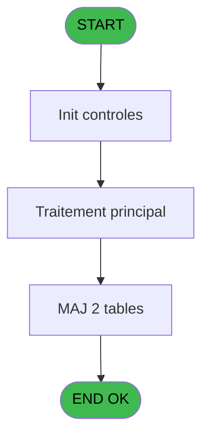
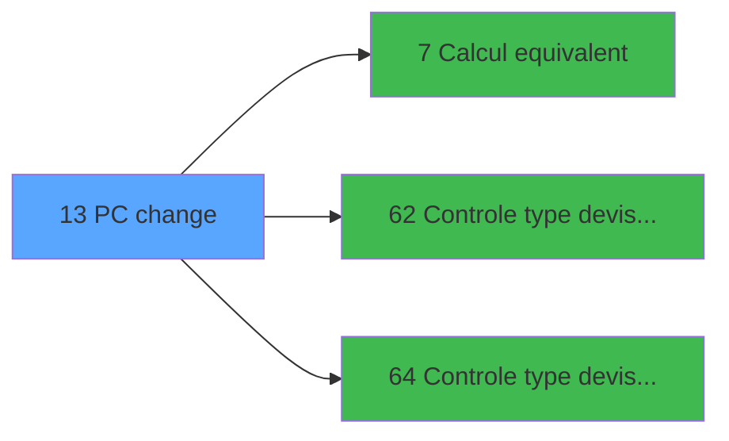

# VIL IDE 13 - PC change

> **Analyse**: Phases 1-4 2026-02-03 00:59 -> 01:00 (39s) | Assemblage 01:00
> **Pipeline**: V7.2 Enrichi
> **Structure**: 4 onglets (Resume | Ecrans | Donnees | Connexions)

<!-- TAB:Resume -->

## 1. FICHE D'IDENTITE

| Attribut | Valeur |
|----------|--------|
| Projet | VIL |
| IDE Position | 13 |
| Nom Programme | PC change |
| Fichier source | `Prg_13.xml` |
| Domaine metier | Change |
| Taches | 11 (0 ecrans visibles) |
| Tables modifiees | 2 |
| Programmes appeles | 3 |

## 2. DESCRIPTION FONCTIONNELLE

**PC change** assure la gestion complete de ce processus, accessible depuis [Pilotage après sessions (IDE 10)](VIL-IDE-10.md).

Le flux de traitement s'organise en **4 blocs fonctionnels** :

- **Traitement** (8 taches) : traitements metier divers
- **Calcul** (1 tache) : calculs de montants, stocks ou compteurs
- **Creation** (1 tache) : insertion d'enregistrements en base (mouvements, prestations)
- **Initialisation** (1 tache) : reinitialisation d'etats et de variables de travail

**Donnees modifiees** : 2 tables en ecriture (devises_caisse___ddk, compteurs________cpt).

Detail : phases du traitement

#### Phase 1 : Traitement (8 taches)

- **13** - AC  Recapitulatif change **[[ECRAN]](#ecran-t1)**
- **13.1** - Cumul des montants
- **13.1.1** - MAJ total de la journee
- **13.3** - Cumul des montants
- **13.3.1** - MAJ total de la journee
- **13.4** - Cumul des montants
- **13.5** - Cumul des montants
- **13.5.1** - MAJ total de la journee

#### Phase 2 : Initialisation (1 tache)

- **13.2** - Raz du change du jour

#### Phase 3 : Creation (1 tache)

- **13.6** - Creation pièce de caisse

#### Phase 4 : Calcul (1 tache)

- **13.6.1** - recup compteur PKES

Delegue a : [Calcul equivalent (IDE 7)](VIL-IDE-7.md)

#### Tables impactees

| Table | Operations | Role metier |
|-------|-----------|-------------|
| devises_caisse___ddk | **W** (4 usages) | Sessions de caisse |
| compteurs________cpt | **W** (1 usages) | Comptes GM (generaux) |

## 3. BLOCS FONCTIONNELS

### 3.1 Traitement (8 taches)

Traitements internes.

---

#### 13 - AC  Recapitulatif change [[ECRAN]](#ecran-t1)

**Role** : Tache d'orchestration : point d'entree du programme (8 sous-taches). Coordonne l'enchainement des traitements.
**Ecran** : 196 x 67 DLU (MDI) | [Voir mockup](#ecran-t1)

7 sous-taches directes

| Tache | Nom | Bloc |
|-------|-----|------|
| [13.1](#t2) | Cumul des montants | Traitement |
| [13.1.1](#t3) | MAJ total de la journee | Traitement |
| [13.3](#t5) | Cumul des montants | Traitement |
| [13.3.1](#t6) | MAJ total de la journee | Traitement |
| [13.4](#t7) | Cumul des montants | Traitement |
| [13.5](#t8) | Cumul des montants | Traitement |
| [13.5.1](#t9) | MAJ total de la journee | Traitement |

**Variables liees** : F (W0 N° pkes change), G (W0 total change Acha), H (W0 total change Vent), K (W0 top modif change), L (W0 total frais change)

---

#### 13.1 - Cumul des montants

**Role** : Traitement : Cumul des montants.

---

#### 13.1.1 - MAJ total de la journee

**Role** : Traitement : MAJ total de la journee.
**Variables liees** : G (W0 total change Acha), H (W0 total change Vent), L (W0 total frais change)

---

#### 13.3 - Cumul des montants

**Role** : Traitement : Cumul des montants.

---

#### 13.3.1 - MAJ total de la journee

**Role** : Traitement : MAJ total de la journee.
**Variables liees** : G (W0 total change Acha), H (W0 total change Vent), L (W0 total frais change)

---

#### 13.4 - Cumul des montants

**Role** : Traitement : Cumul des montants.

---

#### 13.5 - Cumul des montants

**Role** : Traitement : Cumul des montants.

---

#### 13.5.1 - MAJ total de la journee

**Role** : Traitement : MAJ total de la journee.
**Variables liees** : G (W0 total change Acha), H (W0 total change Vent), L (W0 total frais change)

### 3.2 Initialisation (1 tache)

Reinitialisation d'etats et variables de travail.

---

#### 13.2 - Raz du change du jour

**Role** : Reinitialisation : Raz du change du jour.
**Variables liees** : F (W0 N° pkes change), G (W0 total change Acha), H (W0 total change Vent), K (W0 top modif change), L (W0 total frais change)

### 3.3 Creation (1 tache)

Insertion de nouveaux enregistrements en base.

---

#### 13.6 - Creation pièce de caisse

**Role** : Creation d'enregistrement : Creation pièce de caisse.

### 3.4 Calcul (1 tache)

Calculs metier : montants, stocks, compteurs.

---

#### 13.6.1 - recup compteur PKES

**Role** : Calcul : recup compteur PKES.
**Variables liees** : F (W0 N° pkes change)
**Delegue a** : [Calcul equivalent (IDE 7)](VIL-IDE-7.md)

## 5. REGLES METIER

*(Aucune regle metier identifiee)*

## 6. CONTEXTE

- **Appele par**: [Pilotage après sessions (IDE 10)](VIL-IDE-10.md)
- **Appelle**: 3 programmes | **Tables**: 10 (W:2 R:4 L:4) | **Taches**: 11 | **Expressions**: 2

<!-- TAB:Ecrans -->

## 8. ECRANS

*(Programme sans ecran visible)*

## 9. NAVIGATION

### 9.3 Structure hierarchique (11 taches)

| Position | Tache | Type | Dimensions | Bloc |
|----------|-------|------|------------|------|
| **13.1** | [**AC  Recapitulatif change** (13)](#t1) [mockup](#ecran-t1) | MDI | 196x67 | Traitement |
| 13.1.1 | [Cumul des montants (13.1)](#t2) | MDI | - | |
| 13.1.2 | [MAJ total de la journee (13.1.1)](#t3) | MDI | - | |
| 13.1.3 | [Cumul des montants (13.3)](#t5) | MDI | - | |
| 13.1.4 | [MAJ total de la journee (13.3.1)](#t6) | MDI | - | |
| 13.1.5 | [Cumul des montants (13.4)](#t7) | MDI | - | |
| 13.1.6 | [Cumul des montants (13.5)](#t8) | MDI | - | |
| 13.1.7 | [MAJ total de la journee (13.5.1)](#t9) | MDI | - | |
| **13.2** | [**Raz du change du jour** (13.2)](#t4) | MDI | - | Initialisation |
| **13.3** | [**Creation pièce de caisse** (13.6)](#t10) | MDI | - | Creation |
| **13.4** | [**recup compteur PKES** (13.6.1)](#t11) | MDI | - | Calcul |

### 9.4 Algorigramme

> **Legende**: Vert = START/END OK | Rouge = END KO | Bleu = Decisions
> *Algorigramme auto-genere. Utiliser `/algorigramme` pour une synthese metier detaillee.*

<!-- TAB:Donnees -->

## 10. TABLES

### Tables utilisees (10)

| ID | Nom | Description | Type | R | W | L | Usages |
|----|-----|-------------|------|---|---|---|--------|
| 44 | change___________chg |  | DB | R |   |   | 2 |
| 54 | pieces_caisse____pks | Sessions de caisse | DB |   |   | L | 1 |
| 57 | devises_caisse___ddk | Sessions de caisse | DB |   | **W** |   | 4 |
| 66 | imputations______imp |  | DB | R |   |   | 1 |
| 68 | compteurs________cpt | Comptes GM (generaux) | DB |   | **W** |   | 1 |
| 90 | devises__________dev | Devises / taux de change | DB |   |   | L | 1 |
| 141 | devises__________dev | Devises / taux de change | DB |   |   | L | 2 |
| 147 | change_vente_____chg | Donnees de ventes | DB | R |   |   | 1 |
| 324 | frais_change___fchg |  | DB | R |   |   | 1 |
| 474 | comptage_caisse_devise | Sessions de caisse | TMP |   |   | L | 1 |

### Colonnes par table (4 / 6 tables avec colonnes identifiees)

Table 44 - change___________chg (R) - 2 usages

| Lettre | Variable | Acces | Type |
|--------|----------|-------|------|
| A | W1 cumul devise/mop | R | Numeric |
| B | W1 equivalent | R | Numeric |

Table 57 - devises_caisse___ddk (**W**) - 4 usages

*Table utilisee uniquement en Link ou aucune colonne Real identifiee dans le DataView.*

Table 66 - imputations______imp (R) - 1 usages

*Table utilisee uniquement en Link ou aucune colonne Real identifiee dans le DataView.*

Table 68 - compteurs________cpt (**W**) - 1 usages

*Table utilisee uniquement en Link ou aucune colonne Real identifiee dans le DataView.*

Table 147 - change_vente_____chg (R) - 1 usages

| Lettre | Variable | Acces | Type |
|--------|----------|-------|------|
| A | W1 cumul Devise Cash | R | Numeric |
| B | W1 equivalent | R | Numeric |

Table 324 - frais_change___fchg (R) - 1 usages

| Lettre | Variable | Acces | Type |
|--------|----------|-------|------|
| F | W0 N° pkes change | R | Numeric |
| G | W0 total change Acha | R | Numeric |
| H | W0 total change Vent | R | Numeric |
| K | W0 top modif change | R | Alpha |
| L | W0 total frais change | R | Numeric |

## 11. VARIABLES

### 11.1 Parametres entrants (5)

Variables recues du programme appelant ([Pilotage après sessions (IDE 10)](VIL-IDE-10.md)).

| Lettre | Nom | Type | Usage dans |
|--------|-----|------|-----------|
| A | P0 societe | Alpha | - |
| B | P0 date comptable | Date | - |
| C | P0 devise locale | Alpha | - |
| D | P0 nbre decimales | Numeric | - |
| E | P0 Uni/Bilateral | Alpha | 2x parametre entrant |

### 11.2 Variables de travail (7)

Variables internes au programme.

| Lettre | Nom | Type | Usage dans |
|--------|-----|------|-----------|
| F | W0 N° pkes change | Numeric | - |
| G | W0 total change Acha | Numeric | - |
| H | W0 total change Vent | Numeric | - |
| I | W0 top exec consolid | Alpha | - |
| J | W0 top exec listing | Alpha | - |
| K | W0 top modif change | Alpha | - |
| L | W0 total frais change | Numeric | - |

## 12. EXPRESSIONS

**2 / 2 expressions decodees (100%)**

### 12.1 Repartition par type

| Type | Expressions | Regles |
|------|-------------|--------|
| CONDITION | 2 | 0 |

### 12.2 Expressions cles par type

#### CONDITION (2 expressions)

| Type | IDE | Expression | Regle |
|------|-----|------------|-------|
| CONDITION | 2 | `P0 Uni/Bilateral [E]='B'` | - |
| CONDITION | 1 | `P0 Uni/Bilateral [E]<>'B'` | - |

<!-- TAB:Connexions -->

## 13. GRAPHE D'APPELS

### 13.1 Chaine depuis Main (Callers)

Main -> ... -> [Pilotage après sessions (IDE 10)](VIL-IDE-10.md) -> **PC change (IDE 13)**

### 13.2 Callers

| IDE | Nom Programme | Nb Appels |
|-----|---------------|-----------|
| [10](VIL-IDE-10.md) | Pilotage après sessions | 1 |

### 13.3 Callees (programmes appeles)

### 13.4 Detail Callees avec contexte

| IDE | Nom Programme | Appels | Contexte |
|-----|---------------|--------|----------|
| [7](VIL-IDE-7.md) | Calcul equivalent | 3 | Calcul de donnees |
| [62](VIL-IDE-62.md) |   Controle type devise Achat | 1 | Controle/validation |
| [64](VIL-IDE-64.md) |   Controle type devise Vente | 1 | Controle/validation |

## 14. RECOMMANDATIONS MIGRATION

### 14.1 Profil du programme

| Metrique | Valeur | Impact migration |
|----------|--------|-----------------|
| Lignes de logique | 205 | Taille moyenne |
| Expressions | 2 | Peu de logique |
| Tables WRITE | 2 | Impact faible |
| Sous-programmes | 3 | Peu de dependances |
| Ecrans visibles | 0 | Ecran unique ou traitement batch |
| Code desactive | 0% (0 / 205) | Code sain |
| Regles metier | 0 | Pas de regle identifiee |

### 14.2 Plan de migration par bloc

#### Traitement (8 taches: 1 ecran, 7 traitements)

- **Strategie** : Orchestrateur avec 1 ecrans (Razor/React) et 7 traitements backend (services).
- Les ecrans deviennent des composants UI, les traitements invisibles deviennent des services injectables.
- 3 sous-programme(s) a migrer ou a reutiliser depuis les services existants.
- Decomposer les taches en services unitaires testables.

#### Initialisation (1 tache: 0 ecran, 1 traitement)

- **Strategie** : Constructeur/methode `InitAsync()` dans l'orchestrateur.

#### Creation (1 tache: 0 ecran, 1 traitement)

- **Strategie** : Repository pattern avec Entity Framework Core.
- Insertion via `IRepository<T>.CreateAsync()`

#### Calcul (1 tache: 0 ecran, 1 traitement)

- **Strategie** : Services de calcul purs (Domain Services).
- Migrer la logique de calcul (stock, compteurs, montants)

### 14.3 Dependances critiques

| Dependance | Type | Appels | Impact |
|------------|------|--------|--------|
| devises_caisse___ddk | Table WRITE (Database) | 4x | Schema + repository |
| compteurs________cpt | Table WRITE (Database) | 1x | Schema + repository |
| [Calcul equivalent (IDE 7)](VIL-IDE-7.md) | Sous-programme | 3x | **CRITIQUE** - Calcul de donnees |
| [  Controle type devise Vente (IDE 64)](VIL-IDE-64.md) | Sous-programme | 1x | Normale - Controle/validation |
| [  Controle type devise Achat (IDE 62)](VIL-IDE-62.md) | Sous-programme | 1x | Normale - Controle/validation |

---
*Spec DETAILED generee par Pipeline V7.2 - 2026-02-03 01:00*
