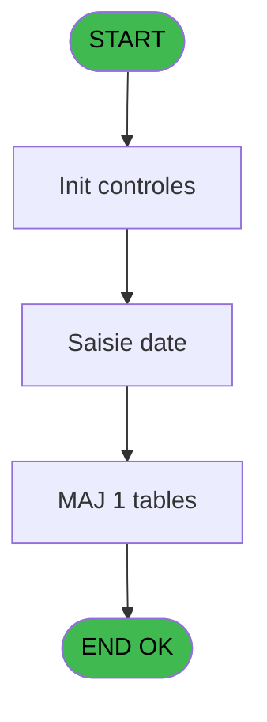
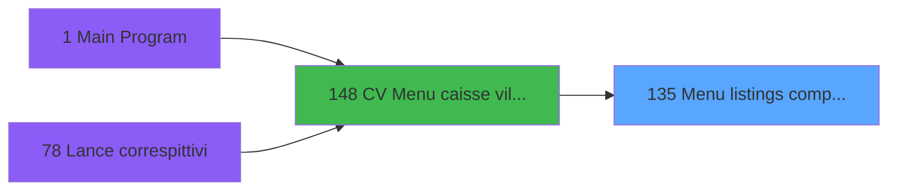
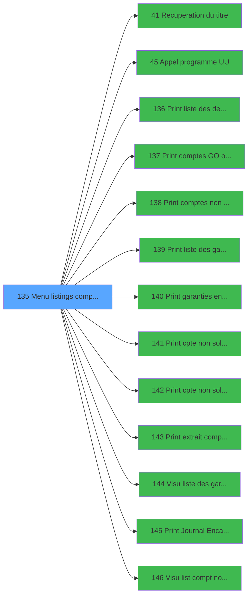

# VIL IDE 135 - Menu listings complement.

> **Analyse**: Phases 1-4 2026-02-03 09:37 -> 09:38 (17s) | Assemblage 09:38
> **Pipeline**: V7.2 Enrichi
> **Structure**: 4 onglets (Resume | Ecrans | Donnees | Connexions)

<!-- TAB:Resume -->

## 1. FICHE D'IDENTITE

| Attribut | Valeur |
|----------|--------|
| Projet | VIL |
| IDE Position | 135 |
| Nom Programme | Menu listings complement. |
| Fichier source | `Prg_135.xml` |
| Domaine metier | Navigation |
| Taches | 9 (3 ecrans visibles) |
| Tables modifiees | 1 |
| Programmes appeles | 13 |

## 2. DESCRIPTION FONCTIONNELLE

**Menu listings complement.** assure la gestion complete de ce processus, accessible depuis [CV  Menu caisse village (IDE 148)](VIL-IDE-148.md).

Le flux de traitement s'organise en **4 blocs fonctionnels** :

- **Traitement** (6 taches) : traitements metier divers
- **Consultation** (1 tache) : ecrans de recherche, selection et consultation
- **Saisie** (1 tache) : ecrans de saisie utilisateur (formulaires, champs, donnees)
- **Calcul** (1 tache) : calculs de montants, stocks ou compteurs

**Donnees modifiees** : 1 tables en ecriture (reseau_cloture___rec).

Detail : phases du traitement

#### Phase 1 : Traitement (6 taches)

- **135** - CV  Menu listings complement. **[[ECRAN]](#ecran-t1)**
- **135.1** - Test si cloture en cours
- **135.1.1** - Blocage cloture
- **135.3** - Deblocage cloture
- **135.1.2** - Blocage cloture
- **135.6** - Deblocage cloture

Delegue a : [Recuperation du titre (IDE 41)](VIL-IDE-41.md), [Appel programme UU (IDE 45)](VIL-IDE-45.md), [  Visu liste des garanties (IDE 144)](VIL-IDE-144.md)

#### Phase 2 : Calcul (1 tache)

- **135.2** - Lecture date comptable

Delegue a : [  Visu list compt non garantis (IDE 146)](VIL-IDE-146.md)

#### Phase 3 : Saisie (1 tache)

- **135.4** - Saisie date **[[ECRAN]](#ecran-t6)**

#### Phase 4 : Consultation (1 tache)

- **135.5** - Choix Type de sortie **[[ECRAN]](#ecran-t9)**

Delegue a : [Recuperation du titre (IDE 41)](VIL-IDE-41.md)

#### Tables impactees

| Table | Operations | Role metier |
|-------|-----------|-------------|
| reseau_cloture___rec | R/**W** (5 usages) | Donnees reseau/cloture |

## 3. BLOCS FONCTIONNELS

### 3.1 Traitement (6 taches)

Traitements internes.

---

#### 135 - CV  Menu listings complement. [[ECRAN]](#ecran-t1)

**Role** : Tache d'orchestration : point d'entree du programme (6 sous-taches). Coordonne l'enchainement des traitements.
**Ecran** : 1051 x 235 DLU (MDI) | [Voir mockup](#ecran-t1)

5 sous-taches directes

| Tache | Nom | Bloc |
|-------|-----|------|
| [135.1](#t2) | Test si cloture en cours | Traitement |
| [135.1.1](#t3) | Blocage cloture | Traitement |
| [135.3](#t5) | Deblocage cloture | Traitement |
| [135.1.2](#t12) | Blocage cloture | Traitement |
| [135.6](#t15) | Deblocage cloture | Traitement |

**Delegue a** : [Recuperation du titre (IDE 41)](VIL-IDE-41.md), [Appel programme UU (IDE 45)](VIL-IDE-45.md), [  Visu liste des garanties (IDE 144)](VIL-IDE-144.md)

---

#### 135.1 - Test si cloture en cours

**Role** : Verification : Test si cloture en cours.
**Delegue a** : [Recuperation du titre (IDE 41)](VIL-IDE-41.md), [Appel programme UU (IDE 45)](VIL-IDE-45.md), [  Visu liste des garanties (IDE 144)](VIL-IDE-144.md)

---

#### 135.1.1 - Blocage cloture

**Role** : Traitement : Blocage cloture.
**Delegue a** : [Recuperation du titre (IDE 41)](VIL-IDE-41.md), [Appel programme UU (IDE 45)](VIL-IDE-45.md), [  Visu liste des garanties (IDE 144)](VIL-IDE-144.md)

---

#### 135.3 - Deblocage cloture

**Role** : Traitement : Deblocage cloture.
**Delegue a** : [Recuperation du titre (IDE 41)](VIL-IDE-41.md), [Appel programme UU (IDE 45)](VIL-IDE-45.md), [  Visu liste des garanties (IDE 144)](VIL-IDE-144.md)

---

#### 135.1.2 - Blocage cloture

**Role** : Traitement : Blocage cloture.
**Delegue a** : [Recuperation du titre (IDE 41)](VIL-IDE-41.md), [Appel programme UU (IDE 45)](VIL-IDE-45.md), [  Visu liste des garanties (IDE 144)](VIL-IDE-144.md)

---

#### 135.6 - Deblocage cloture

**Role** : Traitement : Deblocage cloture.
**Delegue a** : [Recuperation du titre (IDE 41)](VIL-IDE-41.md), [Appel programme UU (IDE 45)](VIL-IDE-45.md), [  Visu liste des garanties (IDE 144)](VIL-IDE-144.md)

### 3.2 Calcul (1 tache)

Calculs metier : montants, stocks, compteurs.

---

#### 135.2 - Lecture date comptable

**Role** : Traitement : Lecture date comptable.
**Variables liees** : D (P0 date comptable), J (W0 Date enregistrement), K (W0 Abandon date enreg)
**Delegue a** : [  Visu list compt non garantis (IDE 146)](VIL-IDE-146.md)

### 3.3 Saisie (1 tache)

L'operateur saisit les donnees de la transaction via 1 ecran (Saisie date).

---

#### 135.4 - Saisie date [[ECRAN]](#ecran-t6)

**Role** : Saisie des donnees : Saisie date.
**Ecran** : 314 x 145 DLU (MDI) | [Voir mockup](#ecran-t6)
**Variables liees** : D (P0 date comptable), J (W0 Date enregistrement), K (W0 Abandon date enreg)

### 3.4 Consultation (1 tache)

Ecrans de recherche et consultation.

---

#### 135.5 - Choix Type de sortie [[ECRAN]](#ecran-t9)

**Role** : Selection par l'operateur : Choix Type de sortie.
**Ecran** : 314 x 145 DLU (MDI) | [Voir mockup](#ecran-t9)
**Variables liees** : H (W0 choix action)

## 5. REGLES METIER

*(Aucune regle metier identifiee)*

## 6. CONTEXTE

- **Appele par**: [CV  Menu caisse village (IDE 148)](VIL-IDE-148.md)
- **Appelle**: 13 programmes | **Tables**: 2 (W:1 R:2 L:0) | **Taches**: 9 | **Expressions**: 36

<!-- TAB:Ecrans -->

## 8. ECRANS

### 8.1 Forms visibles (3 / 9)

| # | Position | Tache | Nom | Type | Largeur | Hauteur | Bloc |
|---|----------|-------|-----|------|---------|---------|------|
| 1 | 135 | 135 | CV  Menu listings complement. | MDI | 1051 | 235 | Traitement |
| 2 | 135.6 | 135.4 | Saisie date | MDI | 314 | 145 | Saisie |
| 3 | 135.1 | 135.5 | Choix Type de sortie | MDI | 314 | 145 | Consultation |

### 8.2 Mockups Ecrans

---

#### 135 - CV  Menu listings complement.
**Tache** : [135](#t1) | **Type** : MDI | **Dimensions** : 1051 x 235 DLU
**Bloc** : Traitement | **Titre IDE** : CV  Menu listings complement.

<!-- FORM-DATA:
{
    "width":  1051,
    "vFactor":  8,
    "type":  "MDI",
    "hFactor":  8,
    "controls":  [
                     {
                         "x":  0,
                         "type":  "label",
                         "var":  "",
                         "y":  1,
                         "w":  1036,
                         "fmt":  "",
                         "name":  "",
                         "h":  17,
                         "color":  "",
                         "text":  "",
                         "parent":  null
                     },
                     {
                         "x":  0,
                         "type":  "label",
                         "var":  "",
                         "y":  29,
                         "w":  1038,
                         "fmt":  "",
                         "name":  "",
                         "h":  158,
                         "color":  "",
                         "text":  "",
                         "parent":  null
                     },
                     {
                         "x":  3,
                         "type":  "label",
                         "var":  "",
                         "y":  30,
                         "w":  1036,
                         "fmt":  "",
                         "name":  "",
                         "h":  170,
                         "color":  "",
                         "text":  "",
                         "parent":  null
                     },
                     {
                         "x":  179,
                         "type":  "label",
                         "var":  "",
                         "y":  39,
                         "w":  398,
                         "fmt":  "",
                         "name":  "",
                         "h":  122,
                         "color":  "",
                         "text":  "",
                         "parent":  null
                     },
                     {
                         "x":  590,
                         "type":  "label",
                         "var":  "",
                         "y":  39,
                         "w":  398,
                         "fmt":  "",
                         "name":  "",
                         "h":  122,
                         "color":  "",
                         "text":  "",
                         "parent":  null
                     },
                     {
                         "x":  182,
                         "type":  "label",
                         "var":  "",
                         "y":  40,
                         "w":  50,
                         "fmt":  "",
                         "name":  "",
                         "h":  120,
                         "color":  "",
                         "text":  "",
                         "parent":  null
                     },
                     {
                         "x":  593,
                         "type":  "label",
                         "var":  "",
                         "y":  40,
                         "w":  50,
                         "fmt":  "",
                         "name":  "",
                         "h":  120,
                         "color":  "",
                         "text":  "",
                         "parent":  null
                     },
                     {
                         "x":  651,
                         "type":  "label",
                         "var":  "",
                         "y":  45,
                         "w":  320,
                         "fmt":  "",
                         "name":  "",
                         "h":  9,
                         "color":  "7",
                         "text":  "Liste des dépôts",
                         "parent":  8
                     },
                     {
                         "x":  240,
                         "type":  "label",
                         "var":  "",
                         "y":  59,
                         "w":  320,
                         "fmt":  "",
                         "name":  "",
                         "h":  9,
                         "color":  "7",
                         "text":  "Comptes débiteurs G.O.",
                         "parent":  7
                     },
                     {
                         "x":  651,
                         "type":  "label",
                         "var":  "",
                         "y":  59,
                         "w":  320,
                         "fmt":  "",
                         "name":  "",
                         "h":  9,
                         "color":  "7",
                         "text":  "Liste des garanties",
                         "parent":  8
                     },
                     {
                         "x":  240,
                         "type":  "label",
                         "var":  "",
                         "y":  73,
                         "w":  320,
                         "fmt":  "",
                         "name":  "",
                         "h":  9,
                         "color":  "7",
                         "text":  "Comptes débiteurs G.M.",
                         "parent":  7
                     },
                     {
                         "x":  651,
                         "type":  "label",
                         "var":  "",
                         "y":  73,
                         "w":  320,
                         "fmt":  "",
                         "name":  "",
                         "h":  9,
                         "color":  "7",
                         "text":  "Garanties enregistrées / date",
                         "parent":  8
                     },
                     {
                         "x":  240,
                         "type":  "label",
                         "var":  "",
                         "y":  87,
                         "w":  320,
                         "fmt":  "",
                         "name":  "",
                         "h":  9,
                         "color":  "7",
                         "text":  "Comptes G.O.",
                         "parent":  7
                     },
                     {
                         "x":  651,
                         "type":  "label",
                         "var":  "",
                         "y":  87,
                         "w":  320,
                         "fmt":  "",
                         "name":  "",
                         "h":  9,
                         "color":  "7",
                         "text":  "Comptes non soldés par séminaire",
                         "parent":  8
                     },
                     {
                         "x":  240,
                         "type":  "label",
                         "var":  "",
                         "y":  101,
                         "w":  320,
                         "fmt":  "",
                         "name":  "",
                         "h":  9,
                         "color":  "7",
                         "text":  "Comptes G.M.",
                         "parent":  7
                     },
                     {
                         "x":  651,
                         "type":  "label",
                         "var":  "",
                         "y":  101,
                         "w":  320,
                         "fmt":  "",
                         "name":  "",
                         "h":  9,
                         "color":  "7",
                         "text":  "Comptes non soldés / date",
                         "parent":  8
                     },
                     {
                         "x":  391,
                         "type":  "label",
                         "var":  "",
                         "y":  180,
                         "w":  195,
                         "fmt":  "",
                         "name":  "",
                         "h":  8,
                         "color":  "",
                         "text":  "Choix de l\u0027action",
                         "parent":  null
                     },
                     {
                         "x":  0,
                         "type":  "label",
                         "var":  "",
                         "y":  206,
                         "w":  1036,
                         "fmt":  "",
                         "name":  "",
                         "h":  23,
                         "color":  "",
                         "text":  "",
                         "parent":  null
                     },
                     {
                         "x":  242,
                         "type":  "label",
                         "var":  "",
                         "y":  115,
                         "w":  320,
                         "fmt":  "",
                         "name":  "",
                         "h":  9,
                         "color":  "7",
                         "text":  "Extrait de compte pour une date",
                         "parent":  null
                     },
                     {
                         "x":  651,
                         "type":  "label",
                         "var":  "",
                         "y":  115,
                         "w":  320,
                         "fmt":  "",
                         "name":  "",
                         "h":  9,
                         "color":  "7",
                         "text":  "Journal des encaissements / date",
                         "parent":  8
                     },
                     {
                         "x":  651,
                         "type":  "label",
                         "var":  "",
                         "y":  129,
                         "w":  320,
                         "fmt":  "",
                         "name":  "",
                         "h":  9,
                         "color":  "7",
                         "text":  "Comptes non garantis / date",
                         "parent":  8
                     },
                     {
                         "x":  587,
                         "type":  "edit",
                         "var":  "",
                         "y":  179,
                         "w":  43,
                         "fmt":  "",
                         "name":  "",
                         "h":  10,
                         "color":  "6",
                         "text":  "",
                         "parent":  null
                     },
                     {
                         "x":  11,
                         "type":  "edit",
                         "var":  "",
                         "y":  5,
                         "w":  395,
                         "fmt":  "30",
                         "name":  "",
                         "h":  8,
                         "color":  "",
                         "text":  "",
                         "parent":  1
                     },
                     {
                         "x":  723,
                         "type":  "edit",
                         "var":  "",
                         "y":  5,
                         "w":  264,
                         "fmt":  "WWW DD MMM YYYYZ",
                         "name":  "",
                         "h":  8,
                         "color":  "",
                         "text":  "",
                         "parent":  1
                     },
                     {
                         "x":  19,
                         "type":  "image",
                         "var":  "",
                         "y":  38,
                         "w":  144,
                         "fmt":  "",
                         "name":  "",
                         "h":  62,
                         "color":  "",
                         "text":  "",
                         "parent":  null
                     },
                     {
                         "x":  603,
                         "type":  "button",
                         "var":  "",
                         "y":  45,
                         "w":  26,
                         "fmt":  "9",
                         "name":  "9",
                         "h":  9,
                         "color":  "",
                         "text":  "",
                         "parent":  null
                     },
                     {
                         "x":  192,
                         "type":  "button",
                         "var":  "",
                         "y":  59,
                         "w":  26,
                         "fmt":  "2",
                         "name":  "2",
                         "h":  9,
                         "color":  "",
                         "text":  "",
                         "parent":  null
                     },
                     {
                         "x":  603,
                         "type":  "button",
                         "var":  "",
                         "y":  59,
                         "w":  26,
                         "fmt":  "10",
                         "name":  "10",
                         "h":  9,
                         "color":  "",
                         "text":  "",
                         "parent":  null
                     },
                     {
                         "x":  192,
                         "type":  "button",
                         "var":  "",
                         "y":  73,
                         "w":  26,
                         "fmt":  "3",
                         "name":  "3",
                         "h":  9,
                         "color":  "",
                         "text":  "",
                         "parent":  null
                     },
                     {
                         "x":  603,
                         "type":  "button",
                         "var":  "",
                         "y":  73,
                         "w":  26,
                         "fmt":  "11",
                         "name":  "11",
                         "h":  9,
                         "color":  "",
                         "text":  "",
                         "parent":  null
                     },
                     {
                         "x":  192,
                         "type":  "button",
                         "var":  "",
                         "y":  87,
                         "w":  26,
                         "fmt":  "4",
                         "name":  "4",
                         "h":  9,
                         "color":  "",
                         "text":  "",
                         "parent":  null
                     },
                     {
                         "x":  603,
                         "type":  "button",
                         "var":  "",
                         "y":  87,
                         "w":  26,
                         "fmt":  "12",
                         "name":  "12",
                         "h":  9,
                         "color":  "",
                         "text":  "",
                         "parent":  null
                     },
                     {
                         "x":  192,
                         "type":  "button",
                         "var":  "",
                         "y":  101,
                         "w":  26,
                         "fmt":  "5",
                         "name":  "5",
                         "h":  9,
                         "color":  "",
                         "text":  "",
                         "parent":  null
                     },
                     {
                         "x":  603,
                         "type":  "button",
                         "var":  "",
                         "y":  101,
                         "w":  26,
                         "fmt":  "13",
                         "name":  "13",
                         "h":  9,
                         "color":  "",
                         "text":  "",
                         "parent":  null
                     },
                     {
                         "x":  603,
                         "type":  "button",
                         "var":  "",
                         "y":  115,
                         "w":  26,
                         "fmt":  "14",
                         "name":  "14",
                         "h":  9,
                         "color":  "",
                         "text":  "",
                         "parent":  null
                     },
                     {
                         "x":  603,
                         "type":  "button",
                         "var":  "",
                         "y":  129,
                         "w":  26,
                         "fmt":  "15",
                         "name":  "15",
                         "h":  9,
                         "color":  "",
                         "text":  "",
                         "parent":  null
                     },
                     {
                         "x":  603,
                         "type":  "button",
                         "var":  "",
                         "y":  144,
                         "w":  26,
                         "fmt":  "16",
                         "name":  "",
                         "h":  9,
                         "color":  "",
                         "text":  "",
                         "parent":  null
                     },
                     {
                         "x":  9,
                         "type":  "button",
                         "var":  "",
                         "y":  209,
                         "w":  160,
                         "fmt":  "\u0026Quitter",
                         "name":  "",
                         "h":  18,
                         "color":  "",
                         "text":  "",
                         "parent":  null
                     },
                     {
                         "x":  192,
                         "type":  "button",
                         "var":  "",
                         "y":  115,
                         "w":  26,
                         "fmt":  "6",
                         "name":  "6",
                         "h":  9,
                         "color":  "",
                         "text":  "",
                         "parent":  null
                     }
                 ],
    "taskId":  "135",
    "height":  235
}
-->

<strong>Champs : 3 champs</strong>

| Pos (x,y) | Nom | Variable | Type |
|-----------|-----|----------|------|
| 587,179 | (sans nom) | - | edit |
| 11,5 | 30 | - | edit |
| 723,5 | WWW DD MMM YYYYZ | - | edit |

<strong>Boutons : 14 boutons</strong>

| Bouton | Pos (x,y) | Action |
|--------|-----------|--------|
| 9 | 603,45 | Bouton fonctionnel |
| 2 | 192,59 | Bouton fonctionnel |
| 10 | 603,59 | Bouton fonctionnel |
| 3 | 192,73 | Bouton fonctionnel |
| 11 | 603,73 | Bouton fonctionnel |
| 4 | 192,87 | Bouton fonctionnel |
| 12 | 603,87 | Bouton fonctionnel |
| 5 | 192,101 | Bouton fonctionnel |
| 13 | 603,101 | Bouton fonctionnel |
| 14 | 603,115 | Bouton fonctionnel |
| 15 | 603,129 | Bouton fonctionnel |
| 16 | 603,144 | Bouton fonctionnel |
| Quitter | 9,209 | Quitte le programme |
| 6 | 192,115 | Bouton fonctionnel |

---

#### 135.6 - Saisie date
**Tache** : [135.4](#t6) | **Type** : MDI | **Dimensions** : 314 x 145 DLU
**Bloc** : Saisie | **Titre IDE** : Saisie date

<!-- FORM-DATA:
{
    "width":  314,
    "vFactor":  8,
    "type":  "MDI",
    "hFactor":  4,
    "controls":  [
                     {
                         "x":  4,
                         "type":  "label",
                         "var":  "",
                         "y":  2,
                         "w":  306,
                         "fmt":  "",
                         "name":  "",
                         "h":  24,
                         "color":  "",
                         "text":  "",
                         "parent":  null
                     },
                     {
                         "x":  2,
                         "type":  "label",
                         "var":  "",
                         "y":  84,
                         "w":  306,
                         "fmt":  "",
                         "name":  "",
                         "h":  26,
                         "color":  "",
                         "text":  "",
                         "parent":  null
                     },
                     {
                         "x":  56,
                         "type":  "label",
                         "var":  "",
                         "y":  92,
                         "w":  106,
                         "fmt":  "",
                         "name":  "",
                         "h":  8,
                         "color":  "",
                         "text":  "Date enregistrement",
                         "parent":  5
                     },
                     {
                         "x":  3,
                         "type":  "label",
                         "var":  "",
                         "y":  116,
                         "w":  306,
                         "fmt":  "",
                         "name":  "",
                         "h":  24,
                         "color":  "",
                         "text":  "",
                         "parent":  null
                     },
                     {
                         "x":  222,
                         "type":  "button",
                         "var":  "",
                         "y":  122,
                         "w":  77,
                         "fmt":  "",
                         "name":  "Bouton abandon",
                         "h":  14,
                         "color":  "",
                         "text":  "",
                         "parent":  8
                     },
                     {
                         "x":  166,
                         "type":  "edit",
                         "var":  "",
                         "y":  92,
                         "w":  63,
                         "fmt":  "",
                         "name":  "W1 Date enregistrement",
                         "h":  10,
                         "color":  "6",
                         "text":  "",
                         "parent":  5
                     },
                     {
                         "x":  10,
                         "type":  "button",
                         "var":  "",
                         "y":  122,
                         "w":  77,
                         "fmt":  "",
                         "name":  "Bouton Validation",
                         "h":  14,
                         "color":  "",
                         "text":  "",
                         "parent":  8
                     },
                     {
                         "x":  13,
                         "type":  "edit",
                         "var":  "",
                         "y":  9,
                         "w":  100,
                         "fmt":  "30",
                         "name":  "",
                         "h":  8,
                         "color":  "",
                         "text":  "",
                         "parent":  1
                     },
                     {
                         "x":  176,
                         "type":  "edit",
                         "var":  "",
                         "y":  9,
                         "w":  124,
                         "fmt":  "WWW DD MMM YYYYZ",
                         "name":  "",
                         "h":  8,
                         "color":  "",
                         "text":  "",
                         "parent":  1
                     },
                     {
                         "x":  117,
                         "type":  "image",
                         "var":  "",
                         "y":  36,
                         "w":  80,
                         "fmt":  "",
                         "name":  "",
                         "h":  38,
                         "color":  "",
                         "text":  "",
                         "parent":  null
                     }
                 ],
    "taskId":  "135.6",
    "height":  145
}
-->

<strong>Champs : 3 champs</strong>

| Pos (x,y) | Nom | Variable | Type |
|-----------|-----|----------|------|
| 166,92 | W1 Date enregistrement | - | edit |
| 13,9 | 30 | - | edit |
| 176,9 | WWW DD MMM YYYYZ | - | edit |

<strong>Boutons : 2 boutons</strong>

| Bouton | Pos (x,y) | Action |
|--------|-----------|--------|
| abandon | 222,122 | Annule et retour au menu |
| Validation | 10,122 | Valide la saisie et enregistre |

---

#### 135.1 - Choix Type de sortie
**Tache** : [135.5](#t9) | **Type** : MDI | **Dimensions** : 314 x 145 DLU
**Bloc** : Consultation | **Titre IDE** : Choix Type de sortie

<!-- FORM-DATA:
{
    "width":  314,
    "vFactor":  8,
    "type":  "MDI",
    "hFactor":  4,
    "controls":  [
                     {
                         "x":  4,
                         "type":  "label",
                         "var":  "",
                         "y":  2,
                         "w":  306,
                         "fmt":  "",
                         "name":  "",
                         "h":  24,
                         "color":  "",
                         "text":  "",
                         "parent":  null
                     },
                     {
                         "x":  2,
                         "type":  "label",
                         "var":  "",
                         "y":  84,
                         "w":  306,
                         "fmt":  "",
                         "name":  "",
                         "h":  26,
                         "color":  "",
                         "text":  "",
                         "parent":  null
                     },
                     {
                         "x":  106,
                         "type":  "label",
                         "var":  "",
                         "y":  92,
                         "w":  34,
                         "fmt":  "",
                         "name":  "",
                         "h":  12,
                         "color":  "",
                         "text":  "Sortie",
                         "parent":  5
                     },
                     {
                         "x":  3,
                         "type":  "label",
                         "var":  "",
                         "y":  116,
                         "w":  306,
                         "fmt":  "",
                         "name":  "",
                         "h":  24,
                         "color":  "",
                         "text":  "",
                         "parent":  null
                     },
                     {
                         "x":  222,
                         "type":  "button",
                         "var":  "",
                         "y":  122,
                         "w":  77,
                         "fmt":  "",
                         "name":  "Bouton abandon",
                         "h":  14,
                         "color":  "",
                         "text":  "",
                         "parent":  8
                     },
                     {
                         "x":  10,
                         "type":  "button",
                         "var":  "",
                         "y":  122,
                         "w":  77,
                         "fmt":  "",
                         "name":  "Bouton Validation",
                         "h":  14,
                         "color":  "",
                         "text":  "",
                         "parent":  8
                     },
                     {
                         "x":  13,
                         "type":  "edit",
                         "var":  "",
                         "y":  9,
                         "w":  100,
                         "fmt":  "30",
                         "name":  "",
                         "h":  8,
                         "color":  "",
                         "text":  "",
                         "parent":  1
                     },
                     {
                         "x":  176,
                         "type":  "edit",
                         "var":  "",
                         "y":  9,
                         "w":  124,
                         "fmt":  "WWW DD MMM YYYYZ",
                         "name":  "",
                         "h":  8,
                         "color":  "",
                         "text":  "",
                         "parent":  1
                     },
                     {
                         "x":  117,
                         "type":  "image",
                         "var":  "",
                         "y":  36,
                         "w":  80,
                         "fmt":  "",
                         "name":  "",
                         "h":  38,
                         "color":  "",
                         "text":  "",
                         "parent":  null
                     },
                     {
                         "x":  140,
                         "type":  "combobox",
                         "var":  "",
                         "y":  92,
                         "w":  68,
                         "fmt":  "",
                         "name":  "W1 Ecran/Imprimante",
                         "h":  12,
                         "color":  "6",
                         "text":  "E,I",
                         "parent":  null
                     }
                 ],
    "taskId":  "135.1",
    "height":  145
}
-->

<strong>Champs : 3 champs</strong>

| Pos (x,y) | Nom | Variable | Type |
|-----------|-----|----------|------|
| 13,9 | 30 | - | edit |
| 176,9 | WWW DD MMM YYYYZ | - | edit |
| 140,92 | W1 Ecran/Imprimante | - | combobox |

<strong>Boutons : 2 boutons</strong>

| Bouton | Pos (x,y) | Action |
|--------|-----------|--------|
| abandon | 222,122 | Annule et retour au menu |
| Validation | 10,122 | Valide la saisie et enregistre |

## 9. NAVIGATION

### 9.1 Enchainement des ecrans

```mermaid
flowchart TD
    START([Entree])
    style START fill:#3fb950
    VF1[135 CV Menu listings co...]
    style VF1 fill:#58a6ff
    VF6[135.4 Saisie date]
    style VF6 fill:#58a6ff
    VF9[135.5 Choix Type de sortie]
    style VF9 fill:#58a6ff
    EXT41[IDE 41 Recuperation du...]
    style EXT41 fill:#3fb950
    EXT45[IDE 45 Appel programme UU]
    style EXT45 fill:#3fb950
    EXT136[IDE 136 Print liste de...]
    style EXT136 fill:#3fb950
    EXT137[IDE 137 Print comptes ...]
    style EXT137 fill:#3fb950
    EXT138[IDE 138 Print comptes ...]
    style EXT138 fill:#3fb950
    EXT139[IDE 139 Print liste de...]
    style EXT139 fill:#3fb950
    EXT140[IDE 140 Print garantie...]
    style EXT140 fill:#3fb950
    EXT141[IDE 141 Print cpte non...]
    style EXT141 fill:#3fb950
    EXT142[IDE 142 Print cpte non...]
    style EXT142 fill:#3fb950
    EXT143[IDE 143 Print extrait ...]
    style EXT143 fill:#3fb950
    EXT144[IDE 144 Visu liste des...]
    style EXT144 fill:#3fb950
    EXT145[IDE 145 Print Journal ...]
    style EXT145 fill:#3fb950
    EXT146[IDE 146 Visu list comp...]
    style EXT146 fill:#3fb950
    FIN([Sortie])
    style FIN fill:#f85149
    START --> VF1
    VF1 -->|Recuperation donnees| EXT41
    VF1 -->|Sous-programme| EXT45
    VF1 -->|Impression ticket/document| EXT136
    VF1 -->|Impression ticket/document| EXT137
    VF1 -->|Impression ticket/document| EXT138
    VF1 -->|Impression ticket/document| EXT139
    VF1 -->|Impression ticket/document| EXT140
    VF1 -->|Impression ticket/document| EXT141
    EXT146 --> FIN
```

**Detail par enchainement :**

| Depuis | Action | Vers | Retour |
|--------|--------|------|--------|
| CV  Menu listings complement. | Recuperation donnees | [Recuperation du titre (IDE 41)](VIL-IDE-41.md) | Retour ecran |
| CV  Menu listings complement. | Sous-programme | [Appel programme UU (IDE 45)](VIL-IDE-45.md) | Retour ecran |
| CV  Menu listings complement. | Impression ticket/document | [  Print liste des depôts (IDE 136)](VIL-IDE-136.md) | Retour ecran |
| CV  Menu listings complement. | Impression ticket/document | [  Print comptes GO ou GM (IDE 137)](VIL-IDE-137.md) | Retour ecran |
| CV  Menu listings complement. | Impression ticket/document | [  Print comptes non soldes (IDE 138)](VIL-IDE-138.md) | Retour ecran |
| CV  Menu listings complement. | Impression ticket/document | [  Print liste des garanties (IDE 139)](VIL-IDE-139.md) | Retour ecran |
| CV  Menu listings complement. | Impression ticket/document | [  Print garanties enregistrees (IDE 140)](VIL-IDE-140.md) | Retour ecran |
| CV  Menu listings complement. | Impression ticket/document | [  Print cpte non soldes/semin. (IDE 141)](VIL-IDE-141.md) | Retour ecran |
| CV  Menu listings complement. | Impression ticket/document | [  Print cpte non soldes/date (IDE 142)](VIL-IDE-142.md) | Retour ecran |
| CV  Menu listings complement. | Impression ticket/document | [  Print extrait compte date (IDE 143)](VIL-IDE-143.md) | Retour ecran |
| CV  Menu listings complement. | Configuration impression | [  Visu liste des garanties (IDE 144)](VIL-IDE-144.md) | Retour ecran |
| CV  Menu listings complement. | Impression ticket/document | [  Print Journal Encaissements (IDE 145)](VIL-IDE-145.md) | Retour ecran |
| CV  Menu listings complement. | Configuration impression | [  Visu list compt non garantis (IDE 146)](VIL-IDE-146.md) | Retour ecran |

### 9.3 Structure hierarchique (9 taches)

| Position | Tache | Type | Dimensions | Bloc |
|----------|-------|------|------------|------|
| **135.1** | [**CV  Menu listings complement.** (135)](#t1) [mockup](#ecran-t1) | MDI | 1051x235 | Traitement |
| 135.1.1 | [Test si cloture en cours (135.1)](#t2) | MDI | - | |
| 135.1.2 | [Blocage cloture (135.1.1)](#t3) | MDI | - | |
| 135.1.3 | [Deblocage cloture (135.3)](#t5) | MDI | - | |
| 135.1.4 | [Blocage cloture (135.1.2)](#t12) | MDI | - | |
| 135.1.5 | [Deblocage cloture (135.6)](#t15) | MDI | - | |
| **135.2** | [**Lecture date comptable** (135.2)](#t4) | MDI | - | Calcul |
| **135.3** | [**Saisie date** (135.4)](#t6) [mockup](#ecran-t6) | MDI | 314x145 | Saisie |
| **135.4** | [**Choix Type de sortie** (135.5)](#t9) [mockup](#ecran-t9) | MDI | 314x145 | Consultation |

### 9.4 Algorigramme

> **Legende**: Vert = START/END OK | Rouge = END KO | Bleu = Decisions
> *Algorigramme auto-genere. Utiliser `/algorigramme` pour une synthese metier detaillee.*

<!-- TAB:Donnees -->

## 10. TABLES

### Tables utilisees (2)

| ID | Nom | Description | Type | R | W | L | Usages |
|----|-----|-------------|------|---|---|---|--------|
| 23 | reseau_cloture___rec | Donnees reseau/cloture | DB | R | **W** |   | 5 |
| 70 | date_comptable___dat |  | DB | R |   |   | 1 |

### Colonnes par table (2 / 2 tables avec colonnes identifiees)

Table 23 - reseau_cloture___rec (R/**W**) - 5 usages

| Lettre | Variable | Acces | Type |
|--------|----------|-------|------|
| A | W1 fin tache | W | Alpha |
| B | W1 cloture en cours | W | Numeric |

Table 70 - date_comptable___dat (R) - 1 usages

| Lettre | Variable | Acces | Type |
|--------|----------|-------|------|
| B | W1 Date enregistrement | R | Date |
| D | P0 date comptable | R | Date |
| J | W0 Date enregistrement | R | Date |
| K | W0 Abandon date enreg | R | Logical |

## 11. VARIABLES

### 11.1 Parametres entrants (5)

Variables recues du programme appelant ([CV  Menu caisse village (IDE 148)](VIL-IDE-148.md)).

| Lettre | Nom | Type | Usage dans |
|--------|-----|------|-----------|
| A | P0 societe | Alpha | 1x parametre entrant |
| B | P0 picture montant | Alpha | - |
| C | P0 nbre decimales | Numeric | 1x parametre entrant |
| D | P0 date comptable | Date | - |
| E | P0 nom village | Alpha | - |

### 11.2 Variables de travail (5)

Variables internes au programme.

| Lettre | Nom | Type | Usage dans |
|--------|-----|------|-----------|
| G | W0 param bidon | Numeric | - |
| H | W0 choix action | Alpha | - |
| I | W0 fin tache | Alpha | 10x calcul interne |
| J | W0 Date enregistrement | Date | [135.2](#t4), [135.4](#t6) |
| K | W0 Abandon date enreg | Logical | - |

### 11.3 Autres (2)

Variables diverses.

| Lettre | Nom | Type | Usage dans |
|--------|-----|------|-----------|
| F | WP0 masque cumul | Alpha | - |
| L | >v.titre | Alpha | 1x refs |

## 12. EXPRESSIONS

**36 / 36 expressions decodees (100%)**

### 12.1 Repartition par type

| Type | Expressions | Regles |
|------|-------------|--------|
| CONSTANTE | 13 | 0 |
| DATE | 2 | 0 |
| REFERENCE_VG | 2 | 0 |
| CONDITION | 13 | 0 |
| OTHER | 1 | 0 |
| CONCATENATION | 1 | 0 |
| NEGATION | 2 | 0 |
| CAST_LOGIQUE | 1 | 0 |
| STRING | 1 | 0 |

### 12.2 Expressions cles par type

#### CONSTANTE (13 expressions)

| Type | IDE | Expression | Regle |
|------|-----|------------|-------|
| CONSTANTE | 32 | `'Unsettled accounts / date'` | - |
| CONSTANTE | 31 | `'Unsettled account by seminar'` | - |
| CONSTANTE | 30 | `'Security deposit registered / date'` | - |
| CONSTANTE | 35 | `'Unsecured accounts / date'` | - |
| CONSTANTE | 34 | `'Journal of payments by date'` | - |
| ... | | *+8 autres* | |

#### DATE (2 expressions)

| Type | IDE | Expression | Regle |
|------|-----|------------|-------|
| DATE | 22 | `Date ()` | - |
| DATE | 1 | `Date ()` | - |

#### REFERENCE_VG (2 expressions)

| Type | IDE | Expression | Regle |
|------|-----|------------|-------|
| REFERENCE_VG | 25 | `VG39` | - |
| REFERENCE_VG | 2 | `VG2` | - |

#### CONDITION (13 expressions)

| Type | IDE | Expression | Regle |
|------|-----|------------|-------|
| CONDITION | 15 | `W0 fin tache [I]='14'` | - |
| CONDITION | 14 | `W0 fin tache [I]='13'` | - |
| CONDITION | 13 | `W0 fin tache [I]='12'` | - |
| CONDITION | 20 | `W0 Date enregistrement [J]<>'F'` | - |
| CONDITION | 19 | `W0 Date enregistrement [J]='F'` | - |
| ... | | *+8 autres* | |

#### OTHER (1 expressions)

| Type | IDE | Expression | Regle |
|------|-----|------------|-------|
| OTHER | 17 | `DbDel ('{541,2}'DSOURCE,'')` | - |

#### CONCATENATION (1 expressions)

| Type | IDE | Expression | Regle |
|------|-----|------------|-------|
| CONCATENATION | 18 | `'N'&Right (' ### ### ### ###'&Left ('.',P0 nbre decimales [C])&Left ('###',P0 nbre decimales [C]),16)&'Z'` | - |

#### NEGATION (2 expressions)

| Type | IDE | Expression | Regle |
|------|-----|------------|-------|
| NEGATION | 24 | `NOT VG39` | - |
| NEGATION | 23 | `NOT (>v.titre [L])` | - |

#### CAST_LOGIQUE (1 expressions)

| Type | IDE | Expression | Regle |
|------|-----|------------|-------|
| CAST_LOGIQUE | 36 | `'FALSE'LOG` | - |

#### STRING (1 expressions)

| Type | IDE | Expression | Regle |
|------|-----|------------|-------|
| STRING | 3 | `Trim ([M])` | - |

### 12.3 Toutes les expressions (36)

Voir les 36 expressions

#### CONSTANTE (13)

| IDE | Expression Decodee |
|-----|-------------------|
| 4 | `134` |
| 5 | `'C'` |
| 21 | `''` |
| 26 | `'Debit GO Account'` |
| 27 | `'GO Accounts'` |
| 28 | `'Deposit listing'` |
| 29 | `'Security deposit listing'` |
| 30 | `'Security deposit registered / date'` |
| 31 | `'Unsettled account by seminar'` |
| 32 | `'Unsettled accounts / date'` |
| 33 | `'Account statement for a date'` |
| 34 | `'Journal of payments by date'` |
| 35 | `'Unsecured accounts / date'` |

#### DATE (2)

| IDE | Expression Decodee |
|-----|-------------------|
| 1 | `Date ()` |
| 22 | `Date ()` |

#### REFERENCE_VG (2)

| IDE | Expression Decodee |
|-----|-------------------|
| 2 | `VG2` |
| 25 | `VG39` |

#### CONDITION (13)

| IDE | Expression Decodee |
|-----|-------------------|
| 6 | `P0 societe [A]=''` |
| 7 | `W0 fin tache [I]='2' OR W0 fin tache [I]='3'` |
| 8 | `W0 fin tache [I]='4' OR W0 fin tache [I]='5'` |
| 9 | `W0 fin tache [I]='6'` |
| 10 | `W0 fin tache [I]='9'` |
| 11 | `W0 fin tache [I]='10'` |
| 12 | `W0 fin tache [I]='11'` |
| 13 | `W0 fin tache [I]='12'` |
| 14 | `W0 fin tache [I]='13'` |
| 15 | `W0 fin tache [I]='14'` |
| 16 | `W0 fin tache [I]='15'` |
| 19 | `W0 Date enregistrement [J]='F'` |
| 20 | `W0 Date enregistrement [J]<>'F'` |

#### OTHER (1)

| IDE | Expression Decodee |
|-----|-------------------|
| 17 | `DbDel ('{541,2}'DSOURCE,'')` |

#### CONCATENATION (1)

| IDE | Expression Decodee |
|-----|-------------------|
| 18 | `'N'&Right (' ### ### ### ###'&Left ('.',P0 nbre decimales [C])&Left ('###',P0 nbre decimales [C]),16)&'Z'` |

#### NEGATION (2)

| IDE | Expression Decodee |
|-----|-------------------|
| 23 | `NOT (>v.titre [L])` |
| 24 | `NOT VG39` |

#### CAST_LOGIQUE (1)

| IDE | Expression Decodee |
|-----|-------------------|
| 36 | `'FALSE'LOG` |

#### STRING (1)

| IDE | Expression Decodee |
|-----|-------------------|
| 3 | `Trim ([M])` |

<!-- TAB:Connexions -->

## 13. GRAPHE D'APPELS

### 13.1 Chaine depuis Main (Callers)

Main -> ... -> [CV  Menu caisse village (IDE 148)](VIL-IDE-148.md) -> **Menu listings complement. (IDE 135)**

### 13.2 Callers

| IDE | Nom Programme | Nb Appels |
|-----|---------------|-----------|
| [148](VIL-IDE-148.md) | CV  Menu caisse village | 1 |

### 13.3 Callees (programmes appeles)

### 13.4 Detail Callees avec contexte

| IDE | Nom Programme | Appels | Contexte |
|-----|---------------|--------|----------|
| [41](VIL-IDE-41.md) | Recuperation du titre | 2 | Recuperation donnees |
| [45](VIL-IDE-45.md) | Appel programme UU | 1 | Sous-programme |
| [136](VIL-IDE-136.md) |   Print liste des depôts | 1 | Impression ticket/document |
| [137](VIL-IDE-137.md) |   Print comptes GO ou GM | 1 | Impression ticket/document |
| [138](VIL-IDE-138.md) |   Print comptes non soldes | 1 | Impression ticket/document |
| [139](VIL-IDE-139.md) |   Print liste des garanties | 1 | Impression ticket/document |
| [140](VIL-IDE-140.md) |   Print garanties enregistrees | 1 | Impression ticket/document |
| [141](VIL-IDE-141.md) |   Print cpte non soldes/semin. | 1 | Impression ticket/document |
| [142](VIL-IDE-142.md) |   Print cpte non soldes/date | 1 | Impression ticket/document |
| [143](VIL-IDE-143.md) |   Print extrait compte date | 1 | Impression ticket/document |
| [144](VIL-IDE-144.md) |   Visu liste des garanties | 1 | Configuration impression |
| [145](VIL-IDE-145.md) |   Print Journal Encaissements | 1 | Impression ticket/document |
| [146](VIL-IDE-146.md) |   Visu list compt non garantis | 1 | Configuration impression |

## 14. RECOMMANDATIONS MIGRATION

### 14.1 Profil du programme

| Metrique | Valeur | Impact migration |
|----------|--------|-----------------|
| Lignes de logique | 140 | Programme compact |
| Expressions | 36 | Peu de logique |
| Tables WRITE | 1 | Impact faible |
| Sous-programmes | 13 | Forte dependance |
| Ecrans visibles | 3 | Quelques ecrans |
| Code desactive | 0% (0 / 140) | Code sain |
| Regles metier | 0 | Pas de regle identifiee |

### 14.2 Plan de migration par bloc

#### Traitement (6 taches: 1 ecran, 5 traitements)

- **Strategie** : Orchestrateur avec 1 ecrans (Razor/React) et 5 traitements backend (services).
- Les ecrans deviennent des composants UI, les traitements invisibles deviennent des services injectables.
- 13 sous-programme(s) a migrer ou a reutiliser depuis les services existants.
- Decomposer les taches en services unitaires testables.

#### Calcul (1 tache: 0 ecran, 1 traitement)

- **Strategie** : Services de calcul purs (Domain Services).
- Migrer la logique de calcul (stock, compteurs, montants)

#### Saisie (1 tache: 1 ecran, 0 traitement)

- **Strategie** : Formulaire React/Blazor avec validation Zod/FluentValidation.
- Reproduire 1 ecran : Saisie date
- Validation temps reel cote client + serveur

#### Consultation (1 tache: 1 ecran, 0 traitement)

- **Strategie** : Composants de recherche/selection en modales.
- 1 ecran : Choix Type de sortie

### 14.3 Dependances critiques

| Dependance | Type | Appels | Impact |
|------------|------|--------|--------|
| reseau_cloture___rec | Table WRITE (Database) | 4x | Schema + repository |
| [Recuperation du titre (IDE 41)](VIL-IDE-41.md) | Sous-programme | 2x | Haute - Recuperation donnees |
| [  Print extrait compte date (IDE 143)](VIL-IDE-143.md) | Sous-programme | 1x | Normale - Impression ticket/document |
| [  Print cpte non soldes/date (IDE 142)](VIL-IDE-142.md) | Sous-programme | 1x | Normale - Impression ticket/document |
| [  Print cpte non soldes/semin. (IDE 141)](VIL-IDE-141.md) | Sous-programme | 1x | Normale - Impression ticket/document |
| [  Visu list compt non garantis (IDE 146)](VIL-IDE-146.md) | Sous-programme | 1x | Normale - Configuration impression |
| [  Print Journal Encaissements (IDE 145)](VIL-IDE-145.md) | Sous-programme | 1x | Normale - Impression ticket/document |
| [  Visu liste des garanties (IDE 144)](VIL-IDE-144.md) | Sous-programme | 1x | Normale - Configuration impression |
| [  Print comptes GO ou GM (IDE 137)](VIL-IDE-137.md) | Sous-programme | 1x | Normale - Impression ticket/document |
| [  Print liste des depôts (IDE 136)](VIL-IDE-136.md) | Sous-programme | 1x | Normale - Impression ticket/document |
| [Appel programme UU (IDE 45)](VIL-IDE-45.md) | Sous-programme | 1x | Normale - Sous-programme |

---
*Spec DETAILED generee par Pipeline V7.2 - 2026-02-03 09:38*
