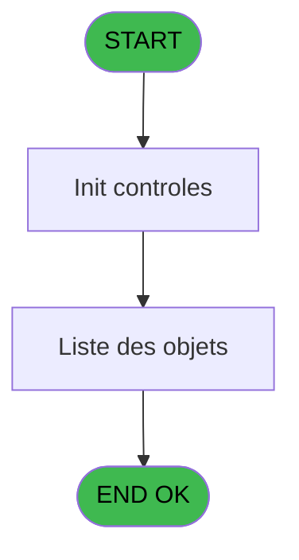
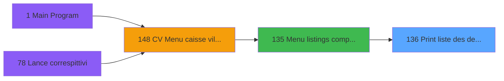

# VIL IDE 136 - Print liste des depôts

> **Analyse**: Phases 1-4 2026-02-03 09:38 -> 09:38 (17s) | Assemblage 09:38
> **Pipeline**: V7.2 Enrichi
> **Structure**: 4 onglets (Resume | Ecrans | Donnees | Connexions)

<!-- TAB:Resume -->

## 1. FICHE D'IDENTITE

| Attribut | Valeur |
|----------|--------|
| Projet | VIL |
| IDE Position | 136 |
| Nom Programme | Print liste des depôts |
| Fichier source | `Prg_136.xml` |
| Domaine metier | Impression |
| Taches | 4 (1 ecrans visibles) |
| Tables modifiees | 0 |
| Programmes appeles | 0 |

## 2. DESCRIPTION FONCTIONNELLE

**Print liste des depôts** assure la gestion complete de ce processus, accessible depuis [Menu listings complement. (IDE 135)](VIL-IDE-135.md).

Le flux de traitement s'organise en **1 blocs fonctionnels** :

- **Traitement** (4 taches) : traitements metier divers

Detail : phases du traitement

#### Phase 1 : Traitement (4 taches)

- **136** - Veuillez patienter... **[[ECRAN]](#ecran-t1)**
- **136.1** - Liste des objets
- **136.2** - Liste des devises
- **136.3** - Liste des scelles

## 3. BLOCS FONCTIONNELS

### 3.1 Traitement (4 taches)

Traitements internes.

---

#### 136 - Veuillez patienter... [[ECRAN]](#ecran-t1)

**Role** : Traitement : Veuillez patienter....
**Ecran** : 424 x 55 DLU (MDI) | [Voir mockup](#ecran-t1)

3 sous-taches directes

| Tache | Nom | Bloc |
|-------|-----|------|
| [136.1](#t2) | Liste des objets | Traitement |
| [136.2](#t3) | Liste des devises | Traitement |
| [136.3](#t4) | Liste des scelles | Traitement |

---

#### 136.1 - Liste des objets

**Role** : Traitement : Liste des objets.
**Variables liees** : F (W0 nbre avec objets)

---

#### 136.2 - Liste des devises

**Role** : Traitement : Liste des devises.
**Variables liees** : G (W0 nbre avec devises)

---

#### 136.3 - Liste des scelles

**Role** : Traitement : Liste des scelles.
**Variables liees** : H (W0 nbre avec scelles)

## 5. REGLES METIER

*(Aucune regle metier identifiee)*

## 6. CONTEXTE

- **Appele par**: [Menu listings complement. (IDE 135)](VIL-IDE-135.md)
- **Appelle**: 0 programmes | **Tables**: 7 (W:0 R:1 L:6) | **Taches**: 4 | **Expressions**: 8

<!-- TAB:Ecrans -->

## 8. ECRANS

### 8.1 Forms visibles (1 / 4)

| # | Position | Tache | Nom | Type | Largeur | Hauteur | Bloc |
|---|----------|-------|-----|------|---------|---------|------|
| 1 | 136 | 136 | Veuillez patienter... | MDI | 424 | 55 | Traitement |

### 8.2 Mockups Ecrans

---

#### 136 - Veuillez patienter...
**Tache** : [136](#t1) | **Type** : MDI | **Dimensions** : 424 x 55 DLU
**Bloc** : Traitement | **Titre IDE** : Veuillez patienter...

<!-- FORM-DATA:
{
    "width":  424,
    "vFactor":  8,
    "type":  "MDI",
    "hFactor":  8,
    "controls":  [
                     {
                         "x":  117,
                         "type":  "label",
                         "var":  "",
                         "y":  9,
                         "w":  275,
                         "fmt":  "",
                         "name":  "",
                         "h":  8,
                         "color":  "7",
                         "text":  "Impression en cours",
                         "parent":  null
                     },
                     {
                         "x":  0,
                         "type":  "label",
                         "var":  "",
                         "y":  28,
                         "w":  423,
                         "fmt":  "",
                         "name":  "",
                         "h":  27,
                         "color":  "",
                         "text":  "",
                         "parent":  null
                     },
                     {
                         "x":  31,
                         "type":  "label",
                         "var":  "",
                         "y":  38,
                         "w":  363,
                         "fmt":  "",
                         "name":  "",
                         "h":  8,
                         "color":  "",
                         "text":  "Impression clients avec depôts",
                         "parent":  null
                     },
                     {
                         "x":  1,
                         "type":  "image",
                         "var":  "",
                         "y":  1,
                         "w":  72,
                         "fmt":  "",
                         "name":  "",
                         "h":  25,
                         "color":  "",
                         "text":  "",
                         "parent":  null
                     }
                 ],
    "taskId":  "136",
    "height":  55
}
-->

## 9. NAVIGATION

Ecran unique: **Veuillez patienter...**

### 9.3 Structure hierarchique (4 taches)

| Position | Tache | Type | Dimensions | Bloc |
|----------|-------|------|------------|------|
| **136.1** | [**Veuillez patienter...** (136)](#t1) [mockup](#ecran-t1) | MDI | 424x55 | Traitement |
| 136.1.1 | [Liste des objets (136.1)](#t2) | MDI | - | |
| 136.1.2 | [Liste des devises (136.2)](#t3) | MDI | - | |
| 136.1.3 | [Liste des scelles (136.3)](#t4) | MDI | - | |

### 9.4 Algorigramme

> **Legende**: Vert = START/END OK | Rouge = END KO | Bleu = Decisions
> *Algorigramme auto-genere. Utiliser `/algorigramme` pour une synthese metier detaillee.*

<!-- TAB:Donnees -->

## 10. TABLES

### Tables utilisees (7)

| ID | Nom | Description | Type | R | W | L | Usages |
|----|-----|-------------|------|---|---|---|--------|
| 30 | gm-recherche_____gmr | Index de recherche | DB | R |   |   | 3 |
| 34 | hebergement______heb | Hebergement (chambres) | DB |   |   | L | 1 |
| 41 | depot_objets_____doa | Depots et garanties | DB |   |   | L | 1 |
| 42 | depot_devises____dda | Depots et garanties | DB |   |   | L | 1 |
| 43 | solde_devises____sda | Devises / taux de change | DB |   |   | L | 1 |
| 47 | compte_gm________cgm | Comptes GM (generaux) | DB |   |   | L | 3 |
| 456 | tai_demarrage |  | DB |   |   | L | 1 |

### Colonnes par table (4 / 1 tables avec colonnes identifiees)

Table 30 - gm-recherche_____gmr (R) - 3 usages

| Lettre | Variable | Acces | Type |
|--------|----------|-------|------|
| A | EXISTE SOLDE | R | Logical |
| B | RUPTURE | R | Alpha |

## 11. VARIABLES

### 11.1 Parametres entrants (4)

Variables recues du programme appelant ([Menu listings complement. (IDE 135)](VIL-IDE-135.md)).

| Lettre | Nom | Type | Usage dans |
|--------|-----|------|-----------|
| A | P0 societe | Alpha | 1x parametre entrant |
| B | P0 date traitement | Date | - |
| C | P0 nom village | Alpha | - |
| D | P0 masque montant | Alpha | - |

### 11.2 Variables de travail (4)

Variables internes au programme.

| Lettre | Nom | Type | Usage dans |
|--------|-----|------|-----------|
| E | W0 config imp | Alpha | - |
| F | W0 nbre avec objets | Numeric | - |
| G | W0 nbre avec devises | Numeric | - |
| H | W0 nbre avec scelles | Numeric | - |

## 12. EXPRESSIONS

**8 / 8 expressions decodees (100%)**

### 12.1 Repartition par type

| Type | Expressions | Regles |
|------|-------------|--------|
| CONCATENATION | 1 | 0 |
| CONSTANTE | 1 | 0 |
| DATE | 1 | 0 |
| OTHER | 3 | 0 |
| CONDITION | 2 | 0 |

### 12.2 Expressions cles par type

#### CONCATENATION (1 expressions)

| Type | IDE | Expression | Regle |
|------|-----|------------|-------|
| CONCATENATION | 6 | `'- '&Str (Page (0,1),'3P0Z0')&' -'` | - |

#### CONSTANTE (1 expressions)

| Type | IDE | Expression | Regle |
|------|-----|------------|-------|
| CONSTANTE | 7 | `'C'` | - |

#### DATE (1 expressions)

| Type | IDE | Expression | Regle |
|------|-----|------------|-------|
| DATE | 3 | `Date ()` | - |

#### OTHER (3 expressions)

| Type | IDE | Expression | Regle |
|------|-----|------------|-------|
| OTHER | 4 | `Time ()` | - |
| OTHER | 2 | `SetCrsr (2)` | - |
| OTHER | 1 | `SetCrsr (1)` | - |

#### CONDITION (2 expressions)

| Type | IDE | Expression | Regle |
|------|-----|------------|-------|
| CONDITION | 8 | `P0 societe [A]=''` | - |
| CONDITION | 5 | `INIGet ('[MAGIC_LOGICAL_NAMES]preview')='O'` | - |

<!-- TAB:Connexions -->

## 13. GRAPHE D'APPELS

### 13.1 Chaine depuis Main (Callers)

Main -> ... -> [Menu listings complement. (IDE 135)](VIL-IDE-135.md) -> **Print liste des depôts (IDE 136)**

### 13.2 Callers

| IDE | Nom Programme | Nb Appels |
|-----|---------------|-----------|
| [135](VIL-IDE-135.md) | Menu listings complement. | 1 |

### 13.3 Callees (programmes appeles)

### 13.4 Detail Callees avec contexte

| IDE | Nom Programme | Appels | Contexte |
|-----|---------------|--------|----------|
| - | (aucun) | - | - |

## 14. RECOMMANDATIONS MIGRATION

### 14.1 Profil du programme

| Metrique | Valeur | Impact migration |
|----------|--------|-----------------|
| Lignes de logique | 122 | Programme compact |
| Expressions | 8 | Peu de logique |
| Tables WRITE | 0 | Impact faible |
| Sous-programmes | 0 | Peu de dependances |
| Ecrans visibles | 1 | Ecran unique ou traitement batch |
| Code desactive | 0% (0 / 122) | Code sain |
| Regles metier | 0 | Pas de regle identifiee |

### 14.2 Plan de migration par bloc

#### Traitement (4 taches: 1 ecran, 3 traitements)

- **Strategie** : Orchestrateur avec 1 ecrans (Razor/React) et 3 traitements backend (services).
- Les ecrans deviennent des composants UI, les traitements invisibles deviennent des services injectables.
- Decomposer les taches en services unitaires testables.

### 14.3 Dependances critiques

| Dependance | Type | Appels | Impact |
|------------|------|--------|--------|

---
*Spec DETAILED generee par Pipeline V7.2 - 2026-02-03 09:38*
