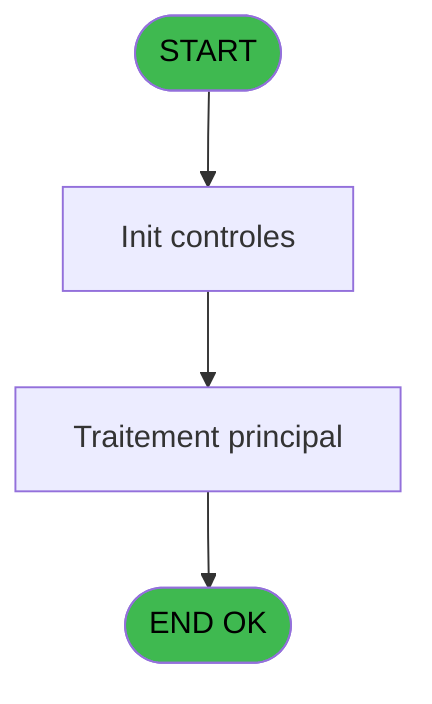
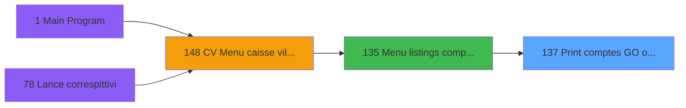

# VIL IDE 137 - Print comptes GO ou GM

> **Analyse**: Phases 1-4 2026-02-03 09:38 -> 09:39 (18s) | Assemblage 09:39
> **Pipeline**: V7.2 Enrichi
> **Structure**: 4 onglets (Resume | Ecrans | Donnees | Connexions)

<!-- TAB:Resume -->

## 1. FICHE D'IDENTITE

| Attribut | Valeur |
|----------|--------|
| Projet | VIL |
| IDE Position | 137 |
| Nom Programme | Print comptes GO ou GM |
| Fichier source | `Prg_137.xml` |
| Domaine metier | Comptabilite |
| Taches | 1 (1 ecrans visibles) |
| Tables modifiees | 0 |
| Programmes appeles | 1 |

## 2. DESCRIPTION FONCTIONNELLE

**Print comptes GO ou GM** assure la gestion complete de ce processus, accessible depuis [Menu listings complement. (IDE 135)](VIL-IDE-135.md).

Le flux de traitement s'organise en **1 blocs fonctionnels** :

- **Traitement** (1 tache) : traitements metier divers

**Logique metier** : 5 regles identifiees couvrant conditions metier.

## 3. BLOCS FONCTIONNELS

### 3.1 Traitement (1 tache)

Traitements internes.

---

#### 137 - Veuillez patienter.... [[ECRAN]](#ecran-t1)

**Role** : Traitement : Veuillez patienter.....
**Ecran** : 426 x 55 DLU (MDI) | [Voir mockup](#ecran-t1)
**Delegue a** : [Recupere devise local (IDE 6)](VIL-IDE-6.md)

## 5. REGLES METIER

5 regles identifiees:

### Autres (5 regles)

#### [RM-001] Si P0 GM ou GO [E]='4' alors 'GO' sinon 'GM')

| Element | Detail |
|---------|--------|
| **Condition** | `P0 GM ou GO [E]='4'` |
| **Si vrai** | 'GO' |
| **Si faux** | 'GM') |
| **Variables** | E (P0 GM ou GO) |
| **Expression source** | Expression 6 : `IF (P0 GM ou GO [E]='4','GO','GM')` |
| **Exemple** | Si P0 GM ou GO [E]='4' → 'GO'. Sinon → 'GM') |

#### [RM-002] Si [P]<0 alors Str (- ([P]) sinon P0 masque cumul [B]),Fill (' ',17)&Str ([P],Left (P0 masque cumul [B],17)))

| Element | Detail |
|---------|--------|
| **Condition** | `[P]<0` |
| **Si vrai** | Str (- ([P]) |
| **Si faux** | P0 masque cumul [B]),Fill (' ',17)&Str ([P],Left (P0 masque cumul [B],17))) |
| **Variables** | B (P0 masque cumul) |
| **Expression source** | Expression 16 : `IF ([P]<0,Str (- ([P]),P0 masque cumul [B]),Fill (' ',17)&St` |
| **Exemple** | Si [P]<0 → Str (- ([P]) |

#### [RM-003] Si W0 cumul credit [G]+W0 cumul debit [F]<0 alors Str (- (W0 cumul credit [G]+W0 cumul debit [F]) sinon P0 masque cumul [B]),Fill (' ',17)&Str (W0 cumul credit [G]+W0 cumul debit [F],Left (P0 masque cumul [B],17)))

| Element | Detail |
|---------|--------|
| **Condition** | `W0 cumul credit [G]+W0 cumul debit [F]<0` |
| **Si vrai** | Str (- (W0 cumul credit [G]+W0 cumul debit [F]) |
| **Si faux** | P0 masque cumul [B]),Fill (' ',17)&Str (W0 cumul credit [G]+W0 cumul debit [F],Left (P0 masque cumul [B],17))) |
| **Variables** | B (P0 masque cumul), F (W0 cumul debit), G (W0 cumul credit) |
| **Expression source** | Expression 17 : `IF (W0 cumul credit [G]+W0 cumul debit [F]<0,Str (- (W0 cumu` |
| **Exemple** | Si W0 cumul credit [G]+W0 cumul debit [F]<0 → Str (- (W0 cumul credit [G]+W0 cumul debit [F]) |

#### [RM-004] Si W0 cumul debit [F]+W0 cumul credit [G]<0 alors 'debiteur en EURO ' sinon 'crediteur en EURO ')

| Element | Detail |
|---------|--------|
| **Condition** | `W0 cumul debit [F]+W0 cumul credit [G]<0` |
| **Si vrai** | 'debiteur en EURO ' |
| **Si faux** | 'crediteur en EURO ') |
| **Variables** | F (W0 cumul debit), G (W0 cumul credit) |
| **Expression source** | Expression 21 : `IF (W0 cumul debit [F]+W0 cumul credit [G]<0,'debiteur en EU` |
| **Exemple** | Si W0 cumul debit [F]+W0 cumul credit [G]<0 → 'debiteur en EURO '. Sinon → 'crediteur en EURO ') |

#### [RM-005] Si Trim([O])='O' alors '('&[AO]&')' sinon '')

| Element | Detail |
|---------|--------|
| **Condition** | `Trim([O])='O'` |
| **Si vrai** | '('&[AO]&')' |
| **Si faux** | '') |
| **Expression source** | Expression 29 : `IF(Trim([O])='O', '('&[AO]&')','')` |
| **Exemple** | Si Trim([O])='O' → '('&[AO]&')'. Sinon → '') |

## 6. CONTEXTE

- **Appele par**: [Menu listings complement. (IDE 135)](VIL-IDE-135.md)
- **Appelle**: 1 programmes | **Tables**: 3 (W:0 R:1 L:2) | **Taches**: 1 | **Expressions**: 29

<!-- TAB:Ecrans -->

## 8. ECRANS

### 8.1 Forms visibles (1 / 1)

| # | Position | Tache | Nom | Type | Largeur | Hauteur | Bloc |
|---|----------|-------|-----|------|---------|---------|------|
| 1 | 137 | 137 | Veuillez patienter.... | MDI | 426 | 55 | Traitement |

### 8.2 Mockups Ecrans

---

#### 137 - Veuillez patienter....
**Tache** : [137](#t1) | **Type** : MDI | **Dimensions** : 426 x 55 DLU
**Bloc** : Traitement | **Titre IDE** : Veuillez patienter....

<!-- FORM-DATA:
{
    "width":  426,
    "vFactor":  8,
    "type":  "MDI",
    "hFactor":  8,
    "controls":  [
                     {
                         "x":  119,
                         "type":  "label",
                         "var":  "",
                         "y":  9,
                         "w":  275,
                         "fmt":  "",
                         "name":  "",
                         "h":  8,
                         "color":  "7",
                         "text":  "Impression en cours",
                         "parent":  null
                     },
                     {
                         "x":  2,
                         "type":  "label",
                         "var":  "",
                         "y":  28,
                         "w":  423,
                         "fmt":  "",
                         "name":  "",
                         "h":  27,
                         "color":  "",
                         "text":  "",
                         "parent":  null
                     },
                     {
                         "x":  71,
                         "type":  "label",
                         "var":  "",
                         "y":  38,
                         "w":  283,
                         "fmt":  "",
                         "name":  "",
                         "h":  8,
                         "color":  "",
                         "text":  "Impression  comptes  GM",
                         "parent":  null
                     },
                     {
                         "x":  71,
                         "type":  "label",
                         "var":  "",
                         "y":  38,
                         "w":  283,
                         "fmt":  "",
                         "name":  "",
                         "h":  8,
                         "color":  "",
                         "text":  "Impression  comptes  GO",
                         "parent":  null
                     },
                     {
                         "x":  3,
                         "type":  "image",
                         "var":  "",
                         "y":  1,
                         "w":  72,
                         "fmt":  "",
                         "name":  "",
                         "h":  25,
                         "color":  "",
                         "text":  "",
                         "parent":  null
                     }
                 ],
    "taskId":  "137",
    "height":  55
}
-->

## 9. NAVIGATION

Ecran unique: **Veuillez patienter....**

### 9.3 Structure hierarchique (1 tache)

| Position | Tache | Type | Dimensions | Bloc |
|----------|-------|------|------------|------|
| **137.1** | [**Veuillez patienter....** (137)](#t1) [mockup](#ecran-t1) | MDI | 426x55 | Traitement |

### 9.4 Algorigramme

> **Legende**: Vert = START/END OK | Rouge = END KO | Bleu = Decisions
> *Algorigramme auto-genere. Utiliser `/algorigramme` pour une synthese metier detaillee.*

<!-- TAB:Donnees -->

## 10. TABLES

### Tables utilisees (3)

| ID | Nom | Description | Type | R | W | L | Usages |
|----|-----|-------------|------|---|---|---|--------|
| 34 | hebergement______heb | Hebergement (chambres) | DB | R |   |   | 1 |
| 39 | depot_garantie___dga | Depots et garanties | DB |   |   | L | 1 |
| 47 | compte_gm________cgm | Comptes GM (generaux) | DB |   |   | L | 1 |

### Colonnes par table (1 / 1 tables avec colonnes identifiees)

Table 34 - hebergement______heb (R) - 1 usages

| Lettre | Variable | Acces | Type |
|--------|----------|-------|------|
| A | P0 societe | R | Alpha |
| B | P0 masque cumul | R | Alpha |
| C | P0 date comptable | R | Date |
| D | P0 nom village | R | Alpha |
| E | P0 GM ou GO | R | Alpha |
| F | W0 cumul debit | R | Numeric |
| G | W0 cumul credit | R | Numeric |
| H | W0 string-solde | R | Alpha |
| I | W0 config imp | R | Alpha |
| J | W0 devise local | R | Alpha |

## 11. VARIABLES

### 11.1 Parametres entrants (5)

Variables recues du programme appelant ([Menu listings complement. (IDE 135)](VIL-IDE-135.md)).

| Lettre | Nom | Type | Usage dans |
|--------|-----|------|-----------|
| A | P0 societe | Alpha | 1x parametre entrant |
| B | P0 masque cumul | Alpha | 3x parametre entrant |
| C | P0 date comptable | Date | - |
| D | P0 nom village | Alpha | - |
| E | P0 GM ou GO | Alpha | 3x parametre entrant |

### 11.2 Variables de travail (5)

Variables internes au programme.

| Lettre | Nom | Type | Usage dans |
|--------|-----|------|-----------|
| F | W0 cumul debit | Numeric | 6x calcul interne |
| G | W0 cumul credit | Numeric | 6x calcul interne |
| H | W0 string-solde | Alpha | - |
| I | W0 config imp | Alpha | - |
| J | W0 devise local | Alpha | - |

## 12. EXPRESSIONS

**29 / 29 expressions decodees (100%)**

### 12.1 Repartition par type

| Type | Expressions | Regles |
|------|-------------|--------|
| CALCULATION | 3 | 0 |
| CONDITION | 15 | 5 |
| CONCATENATION | 1 | 0 |
| CONSTANTE | 2 | 0 |
| DATE | 1 | 0 |
| OTHER | 7 | 0 |

### 12.2 Expressions cles par type

#### CALCULATION (3 expressions)

| Type | IDE | Expression | Regle |
|------|-----|------------|-------|
| CALCULATION | 23 | `W0 cumul credit [G]+[P]` | - |
| CALCULATION | 22 | `W0 cumul debit [F]+[P]` | - |
| CALCULATION | 18 | `W0 cumul credit [G]+W0 cumul debit [F]` | - |

#### CONDITION (15 expressions)

| Type | IDE | Expression | Regle |
|------|-----|------------|-------|
| CONDITION | 16 | `IF ([P]<0,Str (- ([P]),P0 masque cumul [B]),Fill (' ',17)&Str ([P],Left (P0 masque cumul [B],17)))` | [RM-002](#rm-RM-002) |
| CONDITION | 21 | `IF (W0 cumul debit [F]+W0 cumul credit [G]<0,'debiteur en EURO ','crediteur en EURO ')` | [RM-004](#rm-RM-004) |
| CONDITION | 29 | `IF(Trim([O])='O', '('&[AO]&')','')` | [RM-005](#rm-RM-005) |
| CONDITION | 17 | `IF (W0 cumul credit [G]+W0 cumul debit [F]<0,Str (- (W0 cumul credit [G]+W0 cumul debit [F]),P0 masque cumul [B]),Fill (' ',17)&Str (W0 cumul credit [G]+W0 cumul debit [F],Left (P0 masque cumul [B],17)))` | [RM-003](#rm-RM-003) |
| CONDITION | 6 | `IF (P0 GM ou GO [E]='4','GO','GM')` | [RM-001](#rm-RM-001) |
| ... | | *+10 autres* | |

#### CONCATENATION (1 expressions)

| Type | IDE | Expression | Regle |
|------|-----|------------|-------|
| CONCATENATION | 28 | `'- '&Str (Page (0,1),'2P0Z0')&' -'` | - |

#### CONSTANTE (2 expressions)

| Type | IDE | Expression | Regle |
|------|-----|------------|-------|
| CONSTANTE | 9 | `'H'` | - |
| CONSTANTE | 8 | `0` | - |

#### DATE (1 expressions)

| Type | IDE | Expression | Regle |
|------|-----|------------|-------|
| DATE | 11 | `Date ()` | - |

#### OTHER (7 expressions)

| Type | IDE | Expression | Regle |
|------|-----|------------|-------|
| OTHER | 10 | `Left (Right (P0 masque cumul [B],17),16)` | - |
| OTHER | 12 | `Time ()` | - |
| OTHER | 24 | `[P]` | - |
| OTHER | 7 | `[L]` | - |
| OTHER | 3 | `SetCrsr (1)` | - |
| ... | | *+2 autres* | |

### 12.3 Toutes les expressions (29)

Voir les 29 expressions

#### CALCULATION (3)

| IDE | Expression Decodee |
|-----|-------------------|
| 18 | `W0 cumul credit [G]+W0 cumul debit [F]` |
| 22 | `W0 cumul debit [F]+[P]` |
| 23 | `W0 cumul credit [G]+[P]` |

#### CONDITION (15)

| IDE | Expression Decodee |
|-----|-------------------|
| 19 | `W0 cumul credit [G]+W0 cumul debit [F]<0` |
| 20 | `W0 cumul credit [G]+W0 cumul debit [F]>=0` |
| 6 | `IF (P0 GM ou GO [E]='4','GO','GM')` |
| 16 | `IF ([P]<0,Str (- ([P]),P0 masque cumul [B]),Fill (' ',17)&Str ([P],Left (P0 masque cumul [B],17)))` |
| 17 | `IF (W0 cumul credit [G]+W0 cumul debit [F]<0,Str (- (W0 cumul credit [G]+W0 cumul debit [F]),P0 masque cumul [B]),Fill (' ',17)&Str (W0 cumul credit [G]+W0 cumul debit [F],Left (P0 masque cumul [B],17)))` |
| 21 | `IF (W0 cumul debit [F]+W0 cumul credit [G]<0,'debiteur en EURO ','crediteur en EURO ')` |
| 29 | `IF(Trim([O])='O', '('&[AO]&')','')` |
| 1 | `P0 GM ou GO [E]='GM'` |
| 2 | `P0 GM ou GO [E]='GO'` |
| 13 | `[P]<>0` |
| 14 | `[P]<0` |
| 15 | `[P]>0` |
| 25 | `[P]<0` |
| 26 | `[P]>=0` |
| 27 | `INIGet ('[MAGIC_LOGICAL_NAMES]preview')='O'` |

#### CONCATENATION (1)

| IDE | Expression Decodee |
|-----|-------------------|
| 28 | `'- '&Str (Page (0,1),'2P0Z0')&' -'` |

#### CONSTANTE (2)

| IDE | Expression Decodee |
|-----|-------------------|
| 8 | `0` |
| 9 | `'H'` |

#### DATE (1)

| IDE | Expression Decodee |
|-----|-------------------|
| 11 | `Date ()` |

#### OTHER (7)

| IDE | Expression Decodee |
|-----|-------------------|
| 3 | `SetCrsr (1)` |
| 4 | `SetCrsr (2)` |
| 5 | `P0 societe [A]` |
| 7 | `[L]` |
| 10 | `Left (Right (P0 masque cumul [B],17),16)` |
| 12 | `Time ()` |
| 24 | `[P]` |

<!-- TAB:Connexions -->

## 13. GRAPHE D'APPELS

### 13.1 Chaine depuis Main (Callers)

Main -> ... -> [Menu listings complement. (IDE 135)](VIL-IDE-135.md) -> **Print comptes GO ou GM (IDE 137)**

### 13.2 Callers

| IDE | Nom Programme | Nb Appels |
|-----|---------------|-----------|
| [135](VIL-IDE-135.md) | Menu listings complement. | 1 |

### 13.3 Callees (programmes appeles)

### 13.4 Detail Callees avec contexte

| IDE | Nom Programme | Appels | Contexte |
|-----|---------------|--------|----------|
| [6](VIL-IDE-6.md) | Recupere devise local | 1 | Recuperation donnees |

## 14. RECOMMANDATIONS MIGRATION

### 14.1 Profil du programme

| Metrique | Valeur | Impact migration |
|----------|--------|-----------------|
| Lignes de logique | 53 | Programme compact |
| Expressions | 29 | Peu de logique |
| Tables WRITE | 0 | Impact faible |
| Sous-programmes | 1 | Peu de dependances |
| Ecrans visibles | 1 | Ecran unique ou traitement batch |
| Code desactive | 0% (0 / 53) | Code sain |
| Regles metier | 5 | Quelques regles a preserver |

### 14.2 Plan de migration par bloc

#### Traitement (1 tache: 1 ecran, 0 traitement)

- **Strategie** : 1 composant(s) UI (Razor/React) avec formulaires et validation.
- 1 sous-programme(s) a migrer ou a reutiliser depuis les services existants.
- Decomposer les taches en services unitaires testables.

### 14.3 Dependances critiques

| Dependance | Type | Appels | Impact |
|------------|------|--------|--------|
| [Recupere devise local (IDE 6)](VIL-IDE-6.md) | Sous-programme | 1x | Normale - Recuperation donnees |

---
*Spec DETAILED generee par Pipeline V7.2 - 2026-02-03 09:39*
