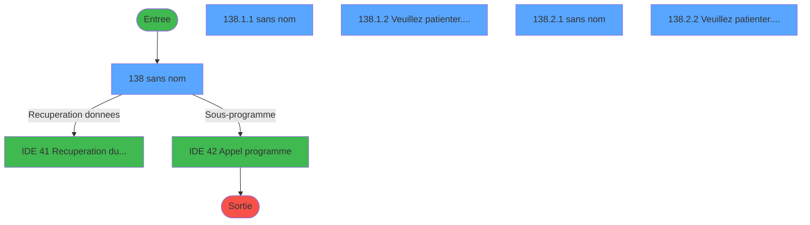
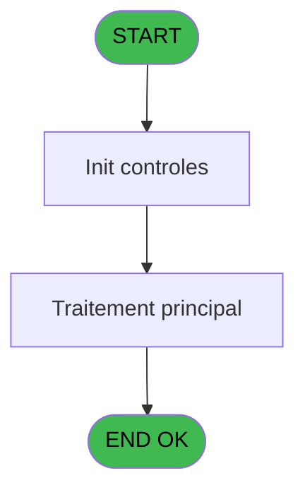
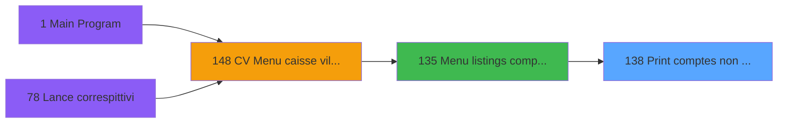
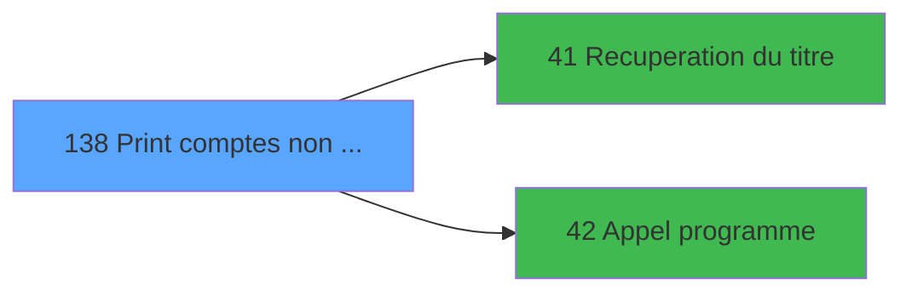

# VIL IDE 138 - Print comptes non soldes

> **Analyse**: Phases 1-4 2026-02-03 09:39 -> 09:39 (17s) | Assemblage 09:39
> **Pipeline**: V7.2 Enrichi
> **Structure**: 4 onglets (Resume | Ecrans | Donnees | Connexions)

<!-- TAB:Resume -->

## 1. FICHE D'IDENTITE

| Attribut | Valeur |
|----------|--------|
| Projet | VIL |
| IDE Position | 138 |
| Nom Programme | Print comptes non soldes |
| Fichier source | `Prg_138.xml` |
| Domaine metier | Comptabilite |
| Taches | 9 (5 ecrans visibles) |
| Tables modifiees | 0 |
| Programmes appeles | 2 |

## 2. DESCRIPTION FONCTIONNELLE

**Print comptes non soldes** assure la gestion complete de ce processus, accessible depuis [Menu listings complement. (IDE 135)](VIL-IDE-135.md).

Le flux de traitement s'organise en **2 blocs fonctionnels** :

- **Traitement** (7 taches) : traitements metier divers
- **Impression** (2 taches) : generation de tickets et documents

**Logique metier** : 1 regles identifiees couvrant conditions metier.

Detail : phases du traitement

#### Phase 1 : Traitement (7 taches)

- **138** - (sans nom) **[[ECRAN]](#ecran-t1)**
- **138.1.1** - (sans nom) **[[ECRAN]](#ecran-t3)**
- **138.1.2** - Veuillez patienter..... **[[ECRAN]](#ecran-t4)**
- **138.1.2.1** - Lecture GMR
- **138.2.1** - (sans nom) **[[ECRAN]](#ecran-t7)**
- **138.2.2** - Veuillez patienter...... **[[ECRAN]](#ecran-t8)**
- **138.2.2.1** - Lecture GMR

Delegue a : [Recuperation du titre (IDE 41)](VIL-IDE-41.md), [Appel programme (IDE 42)](VIL-IDE-42.md)

#### Phase 2 : Impression (2 taches)

- **138.1** - CV  Print comptes non soldes **[[ECRAN]](#ecran-t2)**
- **138.2** - CV  Print comptes non soldes **[[ECRAN]](#ecran-t6)**

## 3. BLOCS FONCTIONNELS

### 3.1 Traitement (7 taches)

Traitements internes.

---

#### 138 - (sans nom) [[ECRAN]](#ecran-t1)

**Role** : Tache d'orchestration : point d'entree du programme (7 sous-taches). Coordonne l'enchainement des traitements.
**Ecran** : 699 x 171 DLU (MDI) | [Voir mockup](#ecran-t1)

6 sous-taches directes

| Tache | Nom | Bloc |
|-------|-----|------|
| [138.1.1](#t3) | (sans nom) **[[ECRAN]](#ecran-t3)** | Traitement |
| [138.1.2](#t4) | Veuillez patienter..... **[[ECRAN]](#ecran-t4)** | Traitement |
| [138.1.2.1](#t5) | Lecture GMR | Traitement |
| [138.2.1](#t7) | (sans nom) **[[ECRAN]](#ecran-t7)** | Traitement |
| [138.2.2](#t8) | Veuillez patienter...... **[[ECRAN]](#ecran-t8)** | Traitement |
| [138.2.2.1](#t9) | Lecture GMR | Traitement |

**Delegue a** : [Recuperation du titre (IDE 41)](VIL-IDE-41.md), [Appel programme (IDE 42)](VIL-IDE-42.md)

---

#### 138.1.1 - (sans nom) [[ECRAN]](#ecran-t3)

**Role** : Traitement interne.
**Ecran** : 426 x 69 DLU (MDI) | [Voir mockup](#ecran-t3)
**Delegue a** : [Recuperation du titre (IDE 41)](VIL-IDE-41.md), [Appel programme (IDE 42)](VIL-IDE-42.md)

---

#### 138.1.2 - Veuillez patienter..... [[ECRAN]](#ecran-t4)

**Role** : Traitement : Veuillez patienter......
**Ecran** : 429 x 56 DLU (MDI) | [Voir mockup](#ecran-t4)
**Delegue a** : [Recuperation du titre (IDE 41)](VIL-IDE-41.md), [Appel programme (IDE 42)](VIL-IDE-42.md)

---

#### 138.1.2.1 - Lecture GMR

**Role** : Traitement : Lecture GMR.
**Delegue a** : [Recuperation du titre (IDE 41)](VIL-IDE-41.md), [Appel programme (IDE 42)](VIL-IDE-42.md)

---

#### 138.2.1 - (sans nom) [[ECRAN]](#ecran-t7)

**Role** : Traitement interne.
**Ecran** : 427 x 73 DLU (MDI) | [Voir mockup](#ecran-t7)
**Delegue a** : [Recuperation du titre (IDE 41)](VIL-IDE-41.md), [Appel programme (IDE 42)](VIL-IDE-42.md)

---

#### 138.2.2 - Veuillez patienter...... [[ECRAN]](#ecran-t8)

**Role** : Traitement : Veuillez patienter.......
**Ecran** : 426 x 56 DLU (MDI) | [Voir mockup](#ecran-t8)
**Delegue a** : [Recuperation du titre (IDE 41)](VIL-IDE-41.md), [Appel programme (IDE 42)](VIL-IDE-42.md)

---

#### 138.2.2.1 - Lecture GMR

**Role** : Traitement : Lecture GMR.
**Delegue a** : [Recuperation du titre (IDE 41)](VIL-IDE-41.md), [Appel programme (IDE 42)](VIL-IDE-42.md)

### 3.2 Impression (2 taches)

Generation des documents et tickets.

---

#### 138.1 - CV  Print comptes non soldes [[ECRAN]](#ecran-t2)

**Role** : Generation du document : CV  Print comptes non soldes.
**Ecran** : 426 x 58 DLU (MDI) | [Voir mockup](#ecran-t2)

---

#### 138.2 - CV  Print comptes non soldes [[ECRAN]](#ecran-t6)

**Role** : Generation du document : CV  Print comptes non soldes.
**Ecran** : 97 x 42 DLU (MDI) | [Voir mockup](#ecran-t6)

## 5. REGLES METIER

1 regles identifiees:

### Autres (1 regles)

#### [RM-001] Si P0 GM ou GO [D]='2' alors 'GO' sinon 'GM')

| Element | Detail |
|---------|--------|
| **Condition** | `P0 GM ou GO [D]='2'` |
| **Si vrai** | 'GO' |
| **Si faux** | 'GM') |
| **Variables** | D (P0 GM ou GO) |
| **Expression source** | Expression 5 : `IF (P0 GM ou GO [D]='2','GO','GM')` |
| **Exemple** | Si P0 GM ou GO [D]='2' → 'GO'. Sinon → 'GM') |

## 6. CONTEXTE

- **Appele par**: [Menu listings complement. (IDE 135)](VIL-IDE-135.md)
- **Appelle**: 2 programmes | **Tables**: 4 (W:0 R:2 L:2) | **Taches**: 9 | **Expressions**: 7

<!-- TAB:Ecrans -->

## 8. ECRANS

### 8.1 Forms visibles (5 / 9)

| # | Position | Tache | Nom | Type | Largeur | Hauteur | Bloc |
|---|----------|-------|-----|------|---------|---------|------|
| 1 | 138 | 138 | (sans nom) | MDI | 699 | 171 | Traitement |
| 2 | 138.1.1 | 138.1.1 | (sans nom) | MDI | 426 | 69 | Traitement |
| 3 | 138.1.2 | 138.1.2 | Veuillez patienter..... | MDI | 429 | 56 | Traitement |
| 4 | 138.2.1 | 138.2.1 | (sans nom) | MDI | 427 | 73 | Traitement |
| 5 | 138.2.2 | 138.2.2 | Veuillez patienter...... | MDI | 426 | 56 | Traitement |

### 8.2 Mockups Ecrans

---

#### 138 - (sans nom)
**Tache** : [138](#t1) | **Type** : MDI | **Dimensions** : 699 x 171 DLU
**Bloc** : Traitement | **Titre IDE** : (sans nom)

<!-- FORM-DATA:
{
    "width":  699,
    "vFactor":  8,
    "type":  "MDI",
    "hFactor":  8,
    "controls":  [
                     {
                         "x":  0,
                         "type":  "label",
                         "var":  "",
                         "y":  0,
                         "w":  699,
                         "fmt":  "",
                         "name":  "",
                         "h":  17,
                         "color":  "",
                         "text":  "",
                         "parent":  null
                     },
                     {
                         "x":  29,
                         "type":  "label",
                         "var":  "",
                         "y":  24,
                         "w":  641,
                         "fmt":  "",
                         "name":  "",
                         "h":  117,
                         "color":  "",
                         "text":  "",
                         "parent":  null
                     },
                     {
                         "x":  227,
                         "type":  "label",
                         "var":  "",
                         "y":  50,
                         "w":  407,
                         "fmt":  "",
                         "name":  "",
                         "h":  74,
                         "color":  "",
                         "text":  "",
                         "parent":  null
                     },
                     {
                         "x":  228,
                         "type":  "label",
                         "var":  "",
                         "y":  51,
                         "w":  404,
                         "fmt":  "",
                         "name":  "",
                         "h":  72,
                         "color":  "",
                         "text":  "",
                         "parent":  null
                     },
                     {
                         "x":  304,
                         "type":  "label",
                         "var":  "",
                         "y":  60,
                         "w":  253,
                         "fmt":  "",
                         "name":  "",
                         "h":  37,
                         "color":  "",
                         "text":  "",
                         "parent":  null
                     },
                     {
                         "x":  305,
                         "type":  "label",
                         "var":  "",
                         "y":  61,
                         "w":  50,
                         "fmt":  "",
                         "name":  "",
                         "h":  35,
                         "color":  "",
                         "text":  "",
                         "parent":  null
                     },
                     {
                         "x":  363,
                         "type":  "label",
                         "var":  "",
                         "y":  67,
                         "w":  182,
                         "fmt":  "",
                         "name":  "",
                         "h":  8,
                         "color":  "7",
                         "text":  "Jusqu\u0027à une date",
                         "parent":  null
                     },
                     {
                         "x":  363,
                         "type":  "label",
                         "var":  "",
                         "y":  81,
                         "w":  149,
                         "fmt":  "",
                         "name":  "",
                         "h":  8,
                         "color":  "7",
                         "text":  "Pour une date",
                         "parent":  null
                     },
                     {
                         "x":  325,
                         "type":  "label",
                         "var":  "",
                         "y":  108,
                         "w":  192,
                         "fmt":  "",
                         "name":  "",
                         "h":  8,
                         "color":  "",
                         "text":  "Choix de l\u0027action",
                         "parent":  null
                     },
                     {
                         "x":  0,
                         "type":  "label",
                         "var":  "",
                         "y":  148,
                         "w":  698,
                         "fmt":  "",
                         "name":  "",
                         "h":  23,
                         "color":  "",
                         "text":  "",
                         "parent":  null
                     },
                     {
                         "x":  528,
                         "type":  "edit",
                         "var":  "",
                         "y":  107,
                         "w":  26,
                         "fmt":  "",
                         "name":  "",
                         "h":  10,
                         "color":  "6",
                         "text":  "",
                         "parent":  null
                     },
                     {
                         "x":  485,
                         "type":  "edit",
                         "var":  "",
                         "y":  4,
                         "w":  203,
                         "fmt":  "WWW DD MMM YYYYZ",
                         "name":  "",
                         "h":  8,
                         "color":  "",
                         "text":  "",
                         "parent":  1
                     },
                     {
                         "x":  326,
                         "type":  "edit",
                         "var":  "",
                         "y":  32,
                         "w":  46,
                         "fmt":  "2",
                         "name":  "",
                         "h":  8,
                         "color":  "7",
                         "text":  "",
                         "parent":  null
                     },
                     {
                         "x":  50,
                         "type":  "image",
                         "var":  "",
                         "y":  59,
                         "w":  160,
                         "fmt":  "",
                         "name":  "",
                         "h":  54,
                         "color":  "",
                         "text":  "",
                         "parent":  4
                     },
                     {
                         "x":  316,
                         "type":  "button",
                         "var":  "",
                         "y":  66,
                         "w":  26,
                         "fmt":  "1",
                         "name":  "1",
                         "h":  9,
                         "color":  "",
                         "text":  "",
                         "parent":  null
                     },
                     {
                         "x":  316,
                         "type":  "button",
                         "var":  "",
                         "y":  80,
                         "w":  26,
                         "fmt":  "2",
                         "name":  "2",
                         "h":  9,
                         "color":  "",
                         "text":  "",
                         "parent":  null
                     },
                     {
                         "x":  6,
                         "type":  "button",
                         "var":  "",
                         "y":  151,
                         "w":  160,
                         "fmt":  "\u0026Quitter",
                         "name":  "",
                         "h":  18,
                         "color":  "",
                         "text":  "",
                         "parent":  null
                     },
                     {
                         "x":  11,
                         "type":  "edit",
                         "var":  "",
                         "y":  4,
                         "w":  395,
                         "fmt":  "30",
                         "name":  "",
                         "h":  8,
                         "color":  "",
                         "text":  "",
                         "parent":  1
                     }
                 ],
    "taskId":  "138",
    "height":  171
}
-->

<strong>Champs : 4 champs</strong>

| Pos (x,y) | Nom | Variable | Type |
|-----------|-----|----------|------|
| 528,107 | (sans nom) | - | edit |
| 485,4 | WWW DD MMM YYYYZ | - | edit |
| 326,32 | 2 | - | edit |
| 11,4 | 30 | - | edit |

<strong>Boutons : 3 boutons</strong>

| Bouton | Pos (x,y) | Action |
|--------|-----------|--------|
| 1 | 316,66 | Bouton fonctionnel |
| 2 | 316,80 | Bouton fonctionnel |
| Quitter | 6,151 | Quitte le programme |

---

#### 138.1.1 - (sans nom)
**Tache** : [138.1.1](#t3) | **Type** : MDI | **Dimensions** : 426 x 69 DLU
**Bloc** : Traitement | **Titre IDE** : (sans nom)

<!-- FORM-DATA:
{
    "width":  426,
    "vFactor":  8,
    "type":  "MDI",
    "hFactor":  8,
    "controls":  [
                     {
                         "x":  119,
                         "type":  "label",
                         "var":  "",
                         "y":  7,
                         "w":  288,
                         "fmt":  "",
                         "name":  "",
                         "h":  28,
                         "color":  "",
                         "text":  "",
                         "parent":  null
                     },
                     {
                         "x":  121,
                         "type":  "label",
                         "var":  "",
                         "y":  8,
                         "w":  284,
                         "fmt":  "",
                         "name":  "",
                         "h":  26,
                         "color":  "",
                         "text":  "",
                         "parent":  null
                     },
                     {
                         "x":  129,
                         "type":  "label",
                         "var":  "",
                         "y":  17,
                         "w":  133,
                         "fmt":  "",
                         "name":  "",
                         "h":  8,
                         "color":  "",
                         "text":  "Date départ",
                         "parent":  null
                     },
                     {
                         "x":  0,
                         "type":  "label",
                         "var":  "",
                         "y":  46,
                         "w":  425,
                         "fmt":  "",
                         "name":  "",
                         "h":  23,
                         "color":  "",
                         "text":  "",
                         "parent":  null
                     },
                     {
                         "x":  271,
                         "type":  "edit",
                         "var":  "",
                         "y":  17,
                         "w":  126,
                         "fmt":  "DD/MM/YYYY",
                         "name":  "",
                         "h":  10,
                         "color":  "6",
                         "text":  "",
                         "parent":  null
                     },
                     {
                         "x":  6,
                         "type":  "button",
                         "var":  "",
                         "y":  49,
                         "w":  160,
                         "fmt":  "\u0026Ok",
                         "name":  "",
                         "h":  18,
                         "color":  "",
                         "text":  "",
                         "parent":  null
                     },
                     {
                         "x":  176,
                         "type":  "button",
                         "var":  "",
                         "y":  49,
                         "w":  160,
                         "fmt":  "\u0026Abandonner",
                         "name":  "",
                         "h":  18,
                         "color":  "",
                         "text":  "",
                         "parent":  null
                     },
                     {
                         "x":  0,
                         "type":  "image",
                         "var":  "",
                         "y":  0,
                         "w":  109,
                         "fmt":  "",
                         "name":  "",
                         "h":  42,
                         "color":  "",
                         "text":  "",
                         "parent":  null
                     }
                 ],
    "taskId":  "138.1.1",
    "height":  69
}
-->

<strong>Champs : 1 champs</strong>

| Pos (x,y) | Nom | Variable | Type |
|-----------|-----|----------|------|
| 271,17 | DD/MM/YYYY | - | edit |

<strong>Boutons : 2 boutons</strong>

| Bouton | Pos (x,y) | Action |
|--------|-----------|--------|
| Ok | 6,49 | Valide la saisie et enregistre |
| Abandonner | 176,49 | Annule et retour au menu |

---

#### 138.1.2 - Veuillez patienter.....
**Tache** : [138.1.2](#t4) | **Type** : MDI | **Dimensions** : 429 x 56 DLU
**Bloc** : Traitement | **Titre IDE** : Veuillez patienter.....

<!-- FORM-DATA:
{
    "width":  429,
    "vFactor":  8,
    "type":  "MDI",
    "hFactor":  8,
    "controls":  [
                     {
                         "x":  119,
                         "type":  "label",
                         "var":  "",
                         "y":  9,
                         "w":  275,
                         "fmt":  "",
                         "name":  "",
                         "h":  8,
                         "color":  "7",
                         "text":  "Impression en cours",
                         "parent":  null
                     },
                     {
                         "x":  2,
                         "type":  "label",
                         "var":  "",
                         "y":  28,
                         "w":  423,
                         "fmt":  "",
                         "name":  "",
                         "h":  27,
                         "color":  "",
                         "text":  "",
                         "parent":  null
                     },
                     {
                         "x":  60,
                         "type":  "label",
                         "var":  "",
                         "y":  38,
                         "w":  309,
                         "fmt":  "",
                         "name":  "",
                         "h":  8,
                         "color":  "",
                         "text":  "Impression  comptes non soldes",
                         "parent":  null
                     },
                     {
                         "x":  3,
                         "type":  "image",
                         "var":  "",
                         "y":  1,
                         "w":  72,
                         "fmt":  "",
                         "name":  "",
                         "h":  25,
                         "color":  "",
                         "text":  "",
                         "parent":  null
                     }
                 ],
    "taskId":  "138.1.2",
    "height":  56
}
-->

---

#### 138.2.1 - (sans nom)
**Tache** : [138.2.1](#t7) | **Type** : MDI | **Dimensions** : 427 x 73 DLU
**Bloc** : Traitement | **Titre IDE** : (sans nom)

<!-- FORM-DATA:
{
    "width":  427,
    "vFactor":  8,
    "type":  "MDI",
    "hFactor":  8,
    "controls":  [
                     {
                         "x":  132,
                         "type":  "label",
                         "var":  "",
                         "y":  11,
                         "w":  284,
                         "fmt":  "",
                         "name":  "",
                         "h":  27,
                         "color":  "",
                         "text":  "",
                         "parent":  null
                     },
                     {
                         "x":  135,
                         "type":  "label",
                         "var":  "",
                         "y":  12,
                         "w":  278,
                         "fmt":  "",
                         "name":  "",
                         "h":  25,
                         "color":  "",
                         "text":  "",
                         "parent":  null
                     },
                     {
                         "x":  142,
                         "type":  "label",
                         "var":  "",
                         "y":  20,
                         "w":  135,
                         "fmt":  "",
                         "name":  "",
                         "h":  8,
                         "color":  "",
                         "text":  "Date départ",
                         "parent":  3
                     },
                     {
                         "x":  0,
                         "type":  "label",
                         "var":  "",
                         "y":  50,
                         "w":  425,
                         "fmt":  "",
                         "name":  "",
                         "h":  23,
                         "color":  "",
                         "text":  "",
                         "parent":  null
                     },
                     {
                         "x":  281,
                         "type":  "edit",
                         "var":  "",
                         "y":  20,
                         "w":  126,
                         "fmt":  "DD/MM/YYYY",
                         "name":  "",
                         "h":  10,
                         "color":  "6",
                         "text":  "",
                         "parent":  3
                     },
                     {
                         "x":  8,
                         "type":  "button",
                         "var":  "",
                         "y":  53,
                         "w":  160,
                         "fmt":  "\u0026Ok",
                         "name":  "",
                         "h":  18,
                         "color":  "",
                         "text":  "",
                         "parent":  null
                     },
                     {
                         "x":  174,
                         "type":  "button",
                         "var":  "",
                         "y":  53,
                         "w":  160,
                         "fmt":  "\u0026Abandonner",
                         "name":  "",
                         "h":  18,
                         "color":  "",
                         "text":  "",
                         "parent":  null
                     },
                     {
                         "x":  5,
                         "type":  "image",
                         "var":  "",
                         "y":  4,
                         "w":  109,
                         "fmt":  "",
                         "name":  "",
                         "h":  42,
                         "color":  "",
                         "text":  "",
                         "parent":  null
                     }
                 ],
    "taskId":  "138.2.1",
    "height":  73
}
-->

<strong>Champs : 1 champs</strong>

| Pos (x,y) | Nom | Variable | Type |
|-----------|-----|----------|------|
| 281,20 | DD/MM/YYYY | - | edit |

<strong>Boutons : 2 boutons</strong>

| Bouton | Pos (x,y) | Action |
|--------|-----------|--------|
| Ok | 8,53 | Valide la saisie et enregistre |
| Abandonner | 174,53 | Annule et retour au menu |

---

#### 138.2.2 - Veuillez patienter......
**Tache** : [138.2.2](#t8) | **Type** : MDI | **Dimensions** : 426 x 56 DLU
**Bloc** : Traitement | **Titre IDE** : Veuillez patienter......

<!-- FORM-DATA:
{
    "width":  426,
    "vFactor":  8,
    "type":  "MDI",
    "hFactor":  8,
    "controls":  [
                     {
                         "x":  120,
                         "type":  "label",
                         "var":  "",
                         "y":  10,
                         "w":  275,
                         "fmt":  "",
                         "name":  "",
                         "h":  8,
                         "color":  "7",
                         "text":  "Impression en cours",
                         "parent":  null
                     },
                     {
                         "x":  3,
                         "type":  "label",
                         "var":  "",
                         "y":  29,
                         "w":  423,
                         "fmt":  "",
                         "name":  "",
                         "h":  27,
                         "color":  "",
                         "text":  "",
                         "parent":  null
                     },
                     {
                         "x":  58,
                         "type":  "label",
                         "var":  "",
                         "y":  39,
                         "w":  309,
                         "fmt":  "",
                         "name":  "",
                         "h":  8,
                         "color":  "",
                         "text":  "Impression  comptes non soldes",
                         "parent":  null
                     },
                     {
                         "x":  4,
                         "type":  "image",
                         "var":  "",
                         "y":  2,
                         "w":  72,
                         "fmt":  "",
                         "name":  "",
                         "h":  25,
                         "color":  "",
                         "text":  "",
                         "parent":  null
                     }
                 ],
    "taskId":  "138.2.2",
    "height":  56
}
-->

## 9. NAVIGATION

### 9.1 Enchainement des ecrans

**Detail par enchainement :**

| Depuis | Action | Vers | Retour |
|--------|--------|------|--------|
|  | Recuperation donnees | [Recuperation du titre (IDE 41)](VIL-IDE-41.md) | Retour ecran |
|  | Sous-programme | [Appel programme (IDE 42)](VIL-IDE-42.md) | Retour ecran |

### 9.3 Structure hierarchique (9 taches)

| Position | Tache | Type | Dimensions | Bloc |
|----------|-------|------|------------|------|
| **138.1** | [**(sans nom)** (138)](#t1) [mockup](#ecran-t1) | MDI | 699x171 | Traitement |
| 138.1.1 | [(sans nom) (138.1.1)](#t3) [mockup](#ecran-t3) | MDI | 426x69 | |
| 138.1.2 | [Veuillez patienter..... (138.1.2)](#t4) [mockup](#ecran-t4) | MDI | 429x56 | |
| 138.1.3 | [Lecture GMR (138.1.2.1)](#t5) | MDI | - | |
| 138.1.4 | [(sans nom) (138.2.1)](#t7) [mockup](#ecran-t7) | MDI | 427x73 | |
| 138.1.5 | [Veuillez patienter...... (138.2.2)](#t8) [mockup](#ecran-t8) | MDI | 426x56 | |
| 138.1.6 | [Lecture GMR (138.2.2.1)](#t9) | MDI | - | |
| **138.2** | [**CV  Print comptes non soldes** (138.1)](#t2) [mockup](#ecran-t2) | MDI | 426x58 | Impression |
| 138.2.1 | [CV  Print comptes non soldes (138.2)](#t6) [mockup](#ecran-t6) | MDI | 97x42 | |

### 9.4 Algorigramme

> **Legende**: Vert = START/END OK | Rouge = END KO | Bleu = Decisions
> *Algorigramme auto-genere. Utiliser `/algorigramme` pour une synthese metier detaillee.*

<!-- TAB:Donnees -->

## 10. TABLES

### Tables utilisees (4)

| ID | Nom | Description | Type | R | W | L | Usages |
|----|-----|-------------|------|---|---|---|--------|
| 30 | gm-recherche_____gmr | Index de recherche | DB | R |   |   | 2 |
| 31 | gm-complet_______gmc |  | DB | R |   |   | 2 |
| 34 | hebergement______heb | Hebergement (chambres) | DB |   |   | L | 2 |
| 47 | compte_gm________cgm | Comptes GM (generaux) | DB |   |   | L | 2 |

### Colonnes par table (0 / 2 tables avec colonnes identifiees)

Table 30 - gm-recherche_____gmr (R) - 2 usages

*Table utilisee uniquement en Link ou aucune colonne Real identifiee dans le DataView.*

Table 31 - gm-complet_______gmc (R) - 2 usages

*Table utilisee uniquement en Link ou aucune colonne Real identifiee dans le DataView.*

## 11. VARIABLES

### 11.1 Parametres entrants (4)

Variables recues du programme appelant ([Menu listings complement. (IDE 135)](VIL-IDE-135.md)).

| Lettre | Nom | Type | Usage dans |
|--------|-----|------|-----------|
| A | P0 societe | Alpha | - |
| B | P0 masque montant | Alpha | - |
| C | P0 nom village | Alpha | - |
| D | P0 GM ou GO | Alpha | 1x parametre entrant |

### 11.2 Variables de travail (1)

Variables internes au programme.

| Lettre | Nom | Type | Usage dans |
|--------|-----|------|-----------|
| E | W0 choix action | Alpha | 2x calcul interne |

### 11.3 Autres (1)

Variables diverses.

| Lettre | Nom | Type | Usage dans |
|--------|-----|------|-----------|
| F | > titre | Alpha | 1x refs |

## 12. EXPRESSIONS

**7 / 7 expressions decodees (100%)**

### 12.1 Repartition par type

| Type | Expressions | Regles |
|------|-------------|--------|
| CONDITION | 4 | 5 |
| CONSTANTE | 1 | 0 |
| DATE | 1 | 0 |
| REFERENCE_VG | 1 | 0 |

### 12.2 Expressions cles par type

#### CONDITION (4 expressions)

| Type | IDE | Expression | Regle |
|------|-----|------------|-------|
| CONDITION | 5 | `IF (P0 GM ou GO [D]='2','GO','GM')` | [RM-001](#rm-RM-001) |
| CONDITION | 3 | `Trim (> titre [F])` | - |
| CONDITION | 7 | `W0 choix action [E]='2'` | - |
| CONDITION | 6 | `W0 choix action [E]='1'` | - |

#### CONSTANTE (1 expressions)

| Type | IDE | Expression | Regle |
|------|-----|------------|-------|
| CONSTANTE | 4 | `131` | - |

#### DATE (1 expressions)

| Type | IDE | Expression | Regle |
|------|-----|------------|-------|
| DATE | 1 | `Date ()` | - |

#### REFERENCE_VG (1 expressions)

| Type | IDE | Expression | Regle |
|------|-----|------------|-------|
| REFERENCE_VG | 2 | `VG2` | - |

<!-- TAB:Connexions -->

## 13. GRAPHE D'APPELS

### 13.1 Chaine depuis Main (Callers)

Main -> ... -> [Menu listings complement. (IDE 135)](VIL-IDE-135.md) -> **Print comptes non soldes (IDE 138)**

### 13.2 Callers

| IDE | Nom Programme | Nb Appels |
|-----|---------------|-----------|
| [135](VIL-IDE-135.md) | Menu listings complement. | 1 |

### 13.3 Callees (programmes appeles)

### 13.4 Detail Callees avec contexte

| IDE | Nom Programme | Appels | Contexte |
|-----|---------------|--------|----------|
| [41](VIL-IDE-41.md) | Recuperation du titre | 1 | Recuperation donnees |
| [42](VIL-IDE-42.md) | Appel programme | 1 | Sous-programme |

## 14. RECOMMANDATIONS MIGRATION

### 14.1 Profil du programme

| Metrique | Valeur | Impact migration |
|----------|--------|-----------------|
| Lignes de logique | 116 | Programme compact |
| Expressions | 7 | Peu de logique |
| Tables WRITE | 0 | Impact faible |
| Sous-programmes | 2 | Peu de dependances |
| Ecrans visibles | 5 | Quelques ecrans |
| Code desactive | 0% (0 / 116) | Code sain |
| Regles metier | 1 | Quelques regles a preserver |

### 14.2 Plan de migration par bloc

#### Traitement (7 taches: 5 ecrans, 2 traitements)

- **Strategie** : Orchestrateur avec 5 ecrans (Razor/React) et 2 traitements backend (services).
- Les ecrans deviennent des composants UI, les traitements invisibles deviennent des services injectables.
- 2 sous-programme(s) a migrer ou a reutiliser depuis les services existants.
- Decomposer les taches en services unitaires testables.

#### Impression (2 taches: 2 ecrans, 0 traitement)

- **Strategie** : Templates HTML -> PDF via wkhtmltopdf ou Puppeteer.
- `PrintService` injectable avec choix imprimante

### 14.3 Dependances critiques

| Dependance | Type | Appels | Impact |
|------------|------|--------|--------|
| [Appel programme (IDE 42)](VIL-IDE-42.md) | Sous-programme | 1x | Normale - Sous-programme |
| [Recuperation du titre (IDE 41)](VIL-IDE-41.md) | Sous-programme | 1x | Normale - Recuperation donnees |

---
*Spec DETAILED generee par Pipeline V7.2 - 2026-02-03 09:39*
