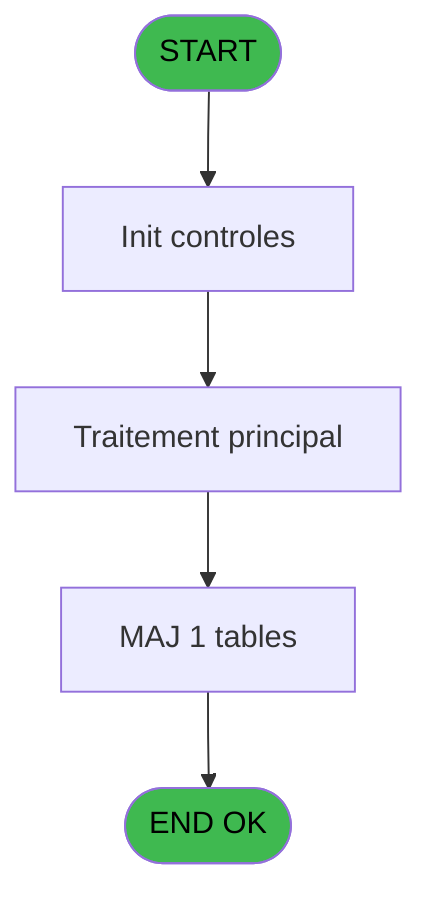
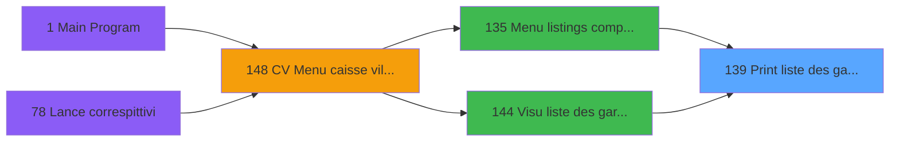

# VIL IDE 139 - Print liste des garanties

> **Analyse**: Phases 1-4 2026-02-03 09:39 -> 09:39 (18s) | Assemblage 09:39
> **Pipeline**: V7.2 Enrichi
> **Structure**: 4 onglets (Resume | Ecrans | Donnees | Connexions)

<!-- TAB:Resume -->

## 1. FICHE D'IDENTITE

| Attribut | Valeur |
|----------|--------|
| Projet | VIL |
| IDE Position | 139 |
| Nom Programme | Print liste des garanties |
| Fichier source | `Prg_139.xml` |
| Domaine metier | Garanties |
| Taches | 4 (1 ecrans visibles) |
| Tables modifiees | 1 |
| Programmes appeles | 0 |

## 2. DESCRIPTION FONCTIONNELLE

**Print liste des garanties** assure la gestion complete de ce processus, accessible depuis [Menu listings complement. (IDE 135)](VIL-IDE-135.md), [  Visu liste des garanties (IDE 144)](VIL-IDE-144.md).

Le flux de traitement s'organise en **3 blocs fonctionnels** :

- **Traitement** (2 taches) : traitements metier divers
- **Impression** (1 tache) : generation de tickets et documents
- **Calcul** (1 tache) : calculs de montants, stocks ou compteurs

**Donnees modifiees** : 1 tables en ecriture (cr_trait_arrivant).

**Logique metier** : 2 regles identifiees couvrant conditions metier, valeurs par defaut.

Detail : phases du traitement

#### Phase 1 : Traitement (2 taches)

- **139** - Veuillez patienter... **[[ECRAN]](#ecran-t1)**
- **139.1** - Write Temp

#### Phase 2 : Calcul (1 tache)

- **139.2** - Comptage sans garantie

#### Phase 3 : Impression (1 tache)

- **139.2.1** - Edition Synthese

#### Tables impactees

| Table | Operations | Role metier |
|-------|-----------|-------------|
| cr_trait_arrivant | **W** (2 usages) |  |

## 3. BLOCS FONCTIONNELS

### 3.1 Traitement (2 taches)

Traitements internes.

---

#### 139 - Veuillez patienter... [[ECRAN]](#ecran-t1)

**Role** : Traitement : Veuillez patienter....
**Ecran** : 424 x 55 DLU (MDI) | [Voir mockup](#ecran-t1)

---

#### 139.1 - Write Temp

**Role** : Traitement : Write Temp.

### 3.2 Calcul (1 tache)

Calculs metier : montants, stocks, compteurs.

---

#### 139.2 - Comptage sans garantie

**Role** : Traitement : Comptage sans garantie.

### 3.3 Impression (1 tache)

Generation des documents et tickets.

---

#### 139.2.1 - Edition Synthese

**Role** : Generation du document : Edition Synthese.

## 5. REGLES METIER

2 regles identifiees:

### Autres (2 regles)

#### [RM-001] Valeur par defaut si PO masque montant [D] est vide

| Element | Detail |
|---------|--------|
| **Condition** | `PO masque montant [D]=''` |
| **Si vrai** | 'N12.2Z' |
| **Si faux** | PO masque montant [D]) |
| **Variables** | D (PO masque montant) |
| **Expression source** | Expression 13 : `IF (PO masque montant [D]='','N12.2Z',PO masque montant [D])` |
| **Exemple** | Si PO masque montant [D]='' → 'N12.2Z'. Sinon → PO masque montant [D]) |

#### [RM-002] Traitement si [BB] est renseigne

| Element | Detail |
|---------|--------|
| **Condition** | `[BB]<>''` |
| **Si vrai** | [BB] |
| **Si faux** | [BA]) |
| **Expression source** | Expression 19 : `IF([BB]<>'',[BB],[BA])` |
| **Exemple** | Si [BB]<>'' → [BB]. Sinon → [BA]) |

## 6. CONTEXTE

- **Appele par**: [Menu listings complement. (IDE 135)](VIL-IDE-135.md), [  Visu liste des garanties (IDE 144)](VIL-IDE-144.md)
- **Appelle**: 0 programmes | **Tables**: 4 (W:1 R:1 L:2) | **Taches**: 4 | **Expressions**: 22

<!-- TAB:Ecrans -->

## 8. ECRANS

### 8.1 Forms visibles (1 / 4)

| # | Position | Tache | Nom | Type | Largeur | Hauteur | Bloc |
|---|----------|-------|-----|------|---------|---------|------|
| 1 | 139 | 139 | Veuillez patienter... | MDI | 424 | 55 | Traitement |

### 8.2 Mockups Ecrans

---

#### 139 - Veuillez patienter...
**Tache** : [139](#t1) | **Type** : MDI | **Dimensions** : 424 x 55 DLU
**Bloc** : Traitement | **Titre IDE** : Veuillez patienter...

<!-- FORM-DATA:
{
    "width":  424,
    "vFactor":  8,
    "type":  "MDI",
    "hFactor":  8,
    "controls":  [
                     {
                         "x":  117,
                         "type":  "label",
                         "var":  "",
                         "y":  9,
                         "w":  275,
                         "fmt":  "",
                         "name":  "",
                         "h":  8,
                         "color":  "7",
                         "text":  "Impression en cours",
                         "parent":  null
                     },
                     {
                         "x":  0,
                         "type":  "label",
                         "var":  "",
                         "y":  28,
                         "w":  423,
                         "fmt":  "",
                         "name":  "",
                         "h":  27,
                         "color":  "",
                         "text":  "",
                         "parent":  null
                     },
                     {
                         "x":  16,
                         "type":  "label",
                         "var":  "",
                         "y":  38,
                         "w":  387,
                         "fmt":  "",
                         "name":  "",
                         "h":  8,
                         "color":  "",
                         "text":  "Impression clients avec garanties",
                         "parent":  null
                     },
                     {
                         "x":  1,
                         "type":  "image",
                         "var":  "",
                         "y":  1,
                         "w":  72,
                         "fmt":  "",
                         "name":  "",
                         "h":  25,
                         "color":  "",
                         "text":  "",
                         "parent":  null
                     }
                 ],
    "taskId":  "139",
    "height":  55
}
-->

## 9. NAVIGATION

Ecran unique: **Veuillez patienter...**

### 9.3 Structure hierarchique (4 taches)

| Position | Tache | Type | Dimensions | Bloc |
|----------|-------|------|------------|------|
| **139.1** | [**Veuillez patienter...** (139)](#t1) [mockup](#ecran-t1) | MDI | 424x55 | Traitement |
| 139.1.1 | [Write Temp (139.1)](#t2) | MDI | - | |
| **139.2** | [**Comptage sans garantie** (139.2)](#t3) | MDI | - | Calcul |
| **139.3** | [**Edition Synthese** (139.2.1)](#t4) | MDI | - | Impression |

### 9.4 Algorigramme

> **Legende**: Vert = START/END OK | Rouge = END KO | Bleu = Decisions
> *Algorigramme auto-genere. Utiliser `/algorigramme` pour une synthese metier detaillee.*

<!-- TAB:Donnees -->

## 10. TABLES

### Tables utilisees (4)

| ID | Nom | Description | Type | R | W | L | Usages |
|----|-----|-------------|------|---|---|---|--------|
| 30 | gm-recherche_____gmr | Index de recherche | DB | R |   |   | 2 |
| 39 | depot_garantie___dga | Depots et garanties | DB |   |   | L | 1 |
| 47 | compte_gm________cgm | Comptes GM (generaux) | DB |   |   | L | 1 |
| 541 | cr_trait_arrivant |  | DB |   | **W** |   | 2 |

### Colonnes par table (2 / 2 tables avec colonnes identifiees)

Table 30 - gm-recherche_____gmr (R) - 2 usages

| Lettre | Variable | Acces | Type |
|--------|----------|-------|------|
| A | P0 societe | R | Alpha |
| B | P0 date traitement | R | Date |
| C | P0 nom village | R | Alpha |
| D | PO masque montant | R | Alpha |
| E | W0 config imp | R | Alpha |
| F | v. retour gmr | R | Logical |
| G | v.nb GM | R | Numeric |
| H | v.nb GO | R | Numeric |

Table 541 - cr_trait_arrivant (**W**) - 2 usages

| Lettre | Variable | Acces | Type |
|--------|----------|-------|------|
| B | P0 date traitement | W | Date |

## 11. VARIABLES

### 11.1 Parametres entrants (4)

Variables recues du programme appelant ([Menu listings complement. (IDE 135)](VIL-IDE-135.md)).

| Lettre | Nom | Type | Usage dans |
|--------|-----|------|-----------|
| A | P0 societe | Alpha | 1x parametre entrant |
| B | P0 date traitement | Date | - |
| C | P0 nom village | Alpha | - |
| D | PO masque montant | Alpha | 1x parametre entrant |

### 11.2 Variables de session (3)

Variables persistantes pendant toute la session.

| Lettre | Nom | Type | Usage dans |
|--------|-----|------|-----------|
| F | v. retour gmr | Logical | 1x session |
| G | v.nb GM | Numeric | 1x session |
| H | v.nb GO | Numeric | 1x session |

### 11.3 Variables de travail (1)

Variables internes au programme.

| Lettre | Nom | Type | Usage dans |
|--------|-----|------|-----------|
| E | W0 config imp | Alpha | - |

## 12. EXPRESSIONS

**22 / 22 expressions decodees (100%)**

### 12.1 Repartition par type

| Type | Expressions | Regles |
|------|-------------|--------|
| CONCATENATION | 2 | 0 |
| CONDITION | 6 | 2 |
| CALCULATION | 2 | 0 |
| CONSTANTE | 1 | 0 |
| DATE | 1 | 0 |
| OTHER | 8 | 0 |
| REFERENCE_VG | 1 | 0 |
| NEGATION | 1 | 0 |

### 12.2 Expressions cles par type

#### CONCATENATION (2 expressions)

| Type | IDE | Expression | Regle |
|------|-----|------------|-------|
| CONCATENATION | 12 | `Trim ([U])&' '&Trim ([V])` | - |
| CONCATENATION | 7 | `'- '&Str (Page (0,1),'3P0Z0')&' -'` | - |

#### CONDITION (6 expressions)

| Type | IDE | Expression | Regle |
|------|-----|------------|-------|
| CONDITION | 13 | `IF (PO masque montant [D]='','N12.2Z',PO masque montant [D])` | [RM-001](#rm-RM-001) |
| CONDITION | 19 | `IF([BB]<>'',[BB],[BA])` | [RM-002](#rm-RM-002) |
| CONDITION | 16 | `[W]='GM'` | - |
| CONDITION | 18 | `[W]='GO'` | - |
| CONDITION | 8 | `[K]='00/00/0000'DATE` | - |
| ... | | *+1 autres* | |

#### CALCULATION (2 expressions)

| Type | IDE | Expression | Regle |
|------|-----|------------|-------|
| CALCULATION | 17 | `[Z]+1` | - |
| CALCULATION | 15 | `[Y]+1` | - |

#### CONSTANTE (1 expressions)

| Type | IDE | Expression | Regle |
|------|-----|------------|-------|
| CONSTANTE | 14 | `0` | - |

#### DATE (1 expressions)

| Type | IDE | Expression | Regle |
|------|-----|------------|-------|
| DATE | 4 | `Date ()` | - |

#### OTHER (8 expressions)

| Type | IDE | Expression | Regle |
|------|-----|------------|-------|
| OTHER | 10 | `v.nb GM [G]` | - |
| OTHER | 9 | `v. retour gmr [F]` | - |
| OTHER | 22 | `[BC]` | - |
| OTHER | 11 | `v.nb GO [H]` | - |
| OTHER | 2 | `SetCrsr (2)` | - |
| ... | | *+3 autres* | |

#### REFERENCE_VG (1 expressions)

| Type | IDE | Expression | Regle |
|------|-----|------------|-------|
| REFERENCE_VG | 20 | `VG21` | - |

#### NEGATION (1 expressions)

| Type | IDE | Expression | Regle |
|------|-----|------------|-------|
| NEGATION | 21 | `NOT VG21` | - |

### 12.3 Toutes les expressions (22)

Voir les 22 expressions

#### CONCATENATION (2)

| IDE | Expression Decodee |
|-----|-------------------|
| 7 | `'- '&Str (Page (0,1),'3P0Z0')&' -'` |
| 12 | `Trim ([U])&' '&Trim ([V])` |

#### CONDITION (6)

| IDE | Expression Decodee |
|-----|-------------------|
| 8 | `[K]='00/00/0000'DATE` |
| 13 | `IF (PO masque montant [D]='','N12.2Z',PO masque montant [D])` |
| 19 | `IF([BB]<>'',[BB],[BA])` |
| 6 | `INIGet ('[MAGIC_LOGICAL_NAMES]preview')='O'` |
| 16 | `[W]='GM'` |
| 18 | `[W]='GO'` |

#### CALCULATION (2)

| IDE | Expression Decodee |
|-----|-------------------|
| 15 | `[Y]+1` |
| 17 | `[Z]+1` |

#### CONSTANTE (1)

| IDE | Expression Decodee |
|-----|-------------------|
| 14 | `0` |

#### DATE (1)

| IDE | Expression Decodee |
|-----|-------------------|
| 4 | `Date ()` |

#### OTHER (8)

| IDE | Expression Decodee |
|-----|-------------------|
| 1 | `SetCrsr (1)` |
| 2 | `SetCrsr (2)` |
| 3 | `P0 societe [A]` |
| 5 | `Time ()` |
| 9 | `v. retour gmr [F]` |
| 10 | `v.nb GM [G]` |
| 11 | `v.nb GO [H]` |
| 22 | `[BC]` |

#### REFERENCE_VG (1)

| IDE | Expression Decodee |
|-----|-------------------|
| 20 | `VG21` |

#### NEGATION (1)

| IDE | Expression Decodee |
|-----|-------------------|
| 21 | `NOT VG21` |

<!-- TAB:Connexions -->

## 13. GRAPHE D'APPELS

### 13.1 Chaine depuis Main (Callers)

Main -> ... -> [Menu listings complement. (IDE 135)](VIL-IDE-135.md) -> **Print liste des garanties (IDE 139)**

Main -> ... -> [  Visu liste des garanties (IDE 144)](VIL-IDE-144.md) -> **Print liste des garanties (IDE 139)**

### 13.2 Callers

| IDE | Nom Programme | Nb Appels |
|-----|---------------|-----------|
| [135](VIL-IDE-135.md) | Menu listings complement. | 1 |
| [144](VIL-IDE-144.md) |   Visu liste des garanties | 1 |

### 13.3 Callees (programmes appeles)

### 13.4 Detail Callees avec contexte

| IDE | Nom Programme | Appels | Contexte |
|-----|---------------|--------|----------|
| - | (aucun) | - | - |

## 14. RECOMMANDATIONS MIGRATION

### 14.1 Profil du programme

| Metrique | Valeur | Impact migration |
|----------|--------|-----------------|
| Lignes de logique | 82 | Programme compact |
| Expressions | 22 | Peu de logique |
| Tables WRITE | 1 | Impact faible |
| Sous-programmes | 0 | Peu de dependances |
| Ecrans visibles | 1 | Ecran unique ou traitement batch |
| Code desactive | 0% (0 / 82) | Code sain |
| Regles metier | 2 | Quelques regles a preserver |

### 14.2 Plan de migration par bloc

#### Traitement (2 taches: 1 ecran, 1 traitement)

- **Strategie** : Orchestrateur avec 1 ecrans (Razor/React) et 1 traitements backend (services).
- Les ecrans deviennent des composants UI, les traitements invisibles deviennent des services injectables.
- Decomposer les taches en services unitaires testables.

#### Calcul (1 tache: 0 ecran, 1 traitement)

- **Strategie** : Services de calcul purs (Domain Services).
- Migrer la logique de calcul (stock, compteurs, montants)

#### Impression (1 tache: 0 ecran, 1 traitement)

- **Strategie** : Templates HTML -> PDF via wkhtmltopdf ou Puppeteer.
- `PrintService` injectable avec choix imprimante

### 14.3 Dependances critiques

| Dependance | Type | Appels | Impact |
|------------|------|--------|--------|
| cr_trait_arrivant | Table WRITE (Database) | 2x | Schema + repository |

---
*Spec DETAILED generee par Pipeline V7.2 - 2026-02-03 09:40*
