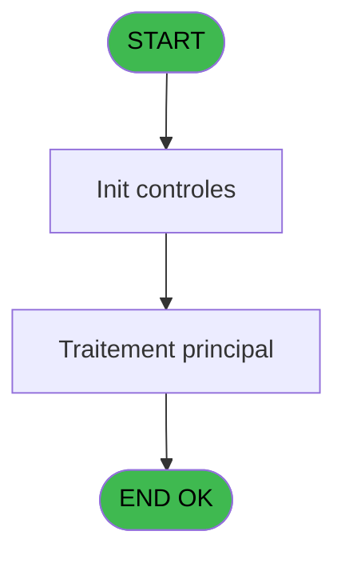
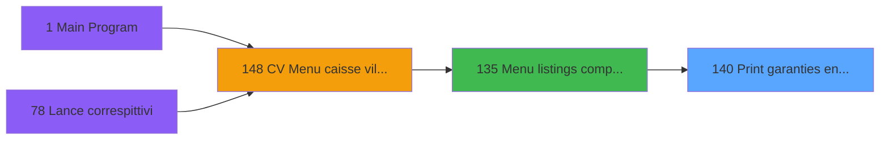

# VIL IDE 140 - Print garanties enregistrees

> **Analyse**: Phases 1-4 2026-02-03 09:40 -> 09:40 (17s) | Assemblage 09:40
> **Pipeline**: V7.2 Enrichi
> **Structure**: 4 onglets (Resume | Ecrans | Donnees | Connexions)

<!-- TAB:Resume -->

## 1. FICHE D'IDENTITE

| Attribut | Valeur |
|----------|--------|
| Projet | VIL |
| IDE Position | 140 |
| Nom Programme | Print garanties enregistrees |
| Fichier source | `Prg_140.xml` |
| Domaine metier | Garanties |
| Taches | 1 (1 ecrans visibles) |
| Tables modifiees | 0 |
| Programmes appeles | 0 |

## 2. DESCRIPTION FONCTIONNELLE

**Print garanties enregistrees** assure la gestion complete de ce processus, accessible depuis [Menu listings complement. (IDE 135)](VIL-IDE-135.md).

Le flux de traitement s'organise en **1 blocs fonctionnels** :

- **Traitement** (1 tache) : traitements metier divers

**Logique metier** : 3 regles identifiees couvrant conditions metier, valeurs par defaut.

## 3. BLOCS FONCTIONNELS

### 3.1 Traitement (1 tache)

Traitements internes.

---

#### 140 - Veuillez patienter... [[ECRAN]](#ecran-t1)

**Role** : Traitement : Veuillez patienter....
**Ecran** : 424 x 55 DLU (MDI) | [Voir mockup](#ecran-t1)

## 5. REGLES METIER

3 regles identifiees:

### Autres (3 regles)

#### [RM-001] Si [H]='CGAR' alors 'Cree le' sinon IF ([H]='AGAR','Annule le',''))

| Element | Detail |
|---------|--------|
| **Condition** | `[H]='CGAR'` |
| **Si vrai** | 'Cree le' |
| **Si faux** | IF ([H]='AGAR','Annule le','')) |
| **Expression source** | Expression 18 : `IF ([H]='CGAR','Cree le',IF ([H]='AGAR','Annule le',''))` |
| **Exemple** | Si [H]='CGAR' → 'Cree le'. Sinon → IF ([H]='AGAR','Annule le','')) |

#### [RM-002] Si [I]*10^5+[J]=[O]*10^5+[P] alors [U] sinon 0)

| Element | Detail |
|---------|--------|
| **Condition** | `[I]*10^5+[J]=[O]*10^5+[P]` |
| **Si vrai** | [U] |
| **Si faux** | 0) |
| **Expression source** | Expression 19 : `IF ([I]*10^5+[J]=[O]*10^5+[P],[U],0)` |
| **Exemple** | Si [I]*10^5+[J]=[O]*10^5+[P] → [U]. Sinon → 0) |

#### [RM-003] Valeur par defaut si P0 masque montant [D] est vide

| Element | Detail |
|---------|--------|
| **Condition** | `P0 masque montant [D]=''` |
| **Si vrai** | 'N12.2Z' |
| **Si faux** | P0 masque montant [D]) |
| **Variables** | D (P0 masque montant) |
| **Expression source** | Expression 22 : `IF (P0 masque montant [D]='','N12.2Z',P0 masque montant [D])` |
| **Exemple** | Si P0 masque montant [D]='' → 'N12.2Z'. Sinon → P0 masque montant [D]) |

## 6. CONTEXTE

- **Appele par**: [Menu listings complement. (IDE 135)](VIL-IDE-135.md)
- **Appelle**: 0 programmes | **Tables**: 3 (W:0 R:1 L:2) | **Taches**: 1 | **Expressions**: 22

<!-- TAB:Ecrans -->

## 8. ECRANS

### 8.1 Forms visibles (1 / 1)

| # | Position | Tache | Nom | Type | Largeur | Hauteur | Bloc |
|---|----------|-------|-----|------|---------|---------|------|
| 1 | 140 | 140 | Veuillez patienter... | MDI | 424 | 55 | Traitement |

### 8.2 Mockups Ecrans

---

#### 140 - Veuillez patienter...
**Tache** : [140](#t1) | **Type** : MDI | **Dimensions** : 424 x 55 DLU
**Bloc** : Traitement | **Titre IDE** : Veuillez patienter...

<!-- FORM-DATA:
{
    "width":  424,
    "vFactor":  8,
    "type":  "MDI",
    "hFactor":  8,
    "controls":  [
                     {
                         "x":  117,
                         "type":  "label",
                         "var":  "",
                         "y":  9,
                         "w":  275,
                         "fmt":  "",
                         "name":  "",
                         "h":  8,
                         "color":  "7",
                         "text":  "Impression en cours",
                         "parent":  null
                     },
                     {
                         "x":  0,
                         "type":  "label",
                         "var":  "",
                         "y":  28,
                         "w":  423,
                         "fmt":  "",
                         "name":  "",
                         "h":  27,
                         "color":  "",
                         "text":  "",
                         "parent":  null
                     },
                     {
                         "x":  19,
                         "type":  "label",
                         "var":  "",
                         "y":  38,
                         "w":  384,
                         "fmt":  "",
                         "name":  "",
                         "h":  8,
                         "color":  "",
                         "text":  "Impression garanties enregistrees",
                         "parent":  null
                     },
                     {
                         "x":  1,
                         "type":  "image",
                         "var":  "",
                         "y":  1,
                         "w":  72,
                         "fmt":  "",
                         "name":  "",
                         "h":  25,
                         "color":  "",
                         "text":  "",
                         "parent":  null
                     }
                 ],
    "taskId":  "140",
    "height":  55
}
-->

## 9. NAVIGATION

Ecran unique: **Veuillez patienter...**

### 9.3 Structure hierarchique (1 tache)

| Position | Tache | Type | Dimensions | Bloc |
|----------|-------|------|------------|------|
| **140.1** | [**Veuillez patienter...** (140)](#t1) [mockup](#ecran-t1) | MDI | 424x55 | Traitement |

### 9.4 Algorigramme

> **Legende**: Vert = START/END OK | Rouge = END KO | Bleu = Decisions
> *Algorigramme auto-genere. Utiliser `/algorigramme` pour une synthese metier detaillee.*

<!-- TAB:Donnees -->

## 10. TABLES

### Tables utilisees (3)

| ID | Nom | Description | Type | R | W | L | Usages |
|----|-----|-------------|------|---|---|---|--------|
| 30 | gm-recherche_____gmr | Index de recherche | DB | R |   |   | 1 |
| 39 | depot_garantie___dga | Depots et garanties | DB |   |   | L | 1 |
| 88 | historik_station | Historique / journal | DB |   |   | L | 1 |

### Colonnes par table (1 / 1 tables avec colonnes identifiees)

Table 30 - gm-recherche_____gmr (R) - 1 usages

| Lettre | Variable | Acces | Type |
|--------|----------|-------|------|
| A | P0 societe | R | Alpha |
| B | P0 date demandee | R | Date |
| C | P0 nom village | R | Alpha |
| D | P0 masque montant | R | Alpha |
| E | W0 config imp | R | Alpha |
| F | V Lignes editees | R | Numeric |

## 11. VARIABLES

### 11.1 Parametres entrants (4)

Variables recues du programme appelant ([Menu listings complement. (IDE 135)](VIL-IDE-135.md)).

| Lettre | Nom | Type | Usage dans |
|--------|-----|------|-----------|
| A | P0 societe | Alpha | 1x parametre entrant |
| B | P0 date demandee | Date | 2x parametre entrant |
| C | P0 nom village | Alpha | - |
| D | P0 masque montant | Alpha | 1x parametre entrant |

### 11.2 Variables de session (1)

Variables persistantes pendant toute la session.

| Lettre | Nom | Type | Usage dans |
|--------|-----|------|-----------|
| F | V Lignes editees | Numeric | - |

### 11.3 Variables de travail (1)

Variables internes au programme.

| Lettre | Nom | Type | Usage dans |
|--------|-----|------|-----------|
| E | W0 config imp | Alpha | - |

## 12. EXPRESSIONS

**22 / 22 expressions decodees (100%)**

### 12.1 Repartition par type

| Type | Expressions | Regles |
|------|-------------|--------|
| CONCATENATION | 2 | 0 |
| CALCULATION | 1 | 0 |
| CONDITION | 9 | 3 |
| DATE | 1 | 0 |
| OTHER | 8 | 0 |
| STRING | 1 | 0 |

### 12.2 Expressions cles par type

#### CONCATENATION (2 expressions)

| Type | IDE | Expression | Regle |
|------|-----|------------|-------|
| CONCATENATION | 14 | `Trim ([AA])&' '&Trim ([AB])` | - |
| CONCATENATION | 9 | `'- '&Str (Page (0,1),'3P0Z0')&' -'` | - |

#### CALCULATION (1 expressions)

| Type | IDE | Expression | Regle |
|------|-----|------------|-------|
| CALCULATION | 15 | `[AE]+1` | - |

#### CONDITION (9 expressions)

| Type | IDE | Expression | Regle |
|------|-----|------------|-------|
| CONDITION | 22 | `IF (P0 masque montant [D]='','N12.2Z',P0 masque montant [D])` | [RM-003](#rm-RM-003) |
| CONDITION | 19 | `IF ([I]*10^5+[J]=[O]*10^5+[P],[U],0)` | [RM-002](#rm-RM-002) |
| CONDITION | 18 | `IF ([H]='CGAR','Cree le',IF ([H]='AGAR','Annule le',''))` | [RM-001](#rm-RM-001) |
| CONDITION | 10 | `[O]=P0 date demandee [B]` | - |
| CONDITION | 17 | `[H]='CGAR' OR [H]='AGAR'` | - |
| ... | | *+4 autres* | |

#### DATE (1 expressions)

| Type | IDE | Expression | Regle |
|------|-----|------------|-------|
| DATE | 6 | `Date ()` | - |

#### OTHER (8 expressions)

| Type | IDE | Expression | Regle |
|------|-----|------------|-------|
| OTHER | 11 | `[L]` | - |
| OTHER | 7 | `Time ()` | - |
| OTHER | 13 | `[N]` | - |
| OTHER | 12 | `[M]` | - |
| OTHER | 2 | `SetCrsr (2)` | - |
| ... | | *+3 autres* | |

#### STRING (1 expressions)

| Type | IDE | Expression | Regle |
|------|-----|------------|-------|
| STRING | 5 | `Val (MID ([K],2,8),'8P0')` | - |

### 12.3 Toutes les expressions (22)

Voir les 22 expressions

#### CONCATENATION (2)

| IDE | Expression Decodee |
|-----|-------------------|
| 9 | `'- '&Str (Page (0,1),'3P0Z0')&' -'` |
| 14 | `Trim ([AA])&' '&Trim ([AB])` |

#### CALCULATION (1)

| IDE | Expression Decodee |
|-----|-------------------|
| 15 | `[AE]+1` |

#### CONDITION (9)

| IDE | Expression Decodee |
|-----|-------------------|
| 18 | `IF ([H]='CGAR','Cree le',IF ([H]='AGAR','Annule le',''))` |
| 19 | `IF ([I]*10^5+[J]=[O]*10^5+[P],[U],0)` |
| 20 | `IF ([I]*10^5+[J]=[O]*10^5+[P],[T],'')` |
| 21 | `IF ([I]*10^5+[J]=[O]*10^5+[P],[S],'')` |
| 22 | `IF (P0 masque montant [D]='','N12.2Z',P0 masque montant [D])` |
| 8 | `INIGet ('[MAGIC_LOGICAL_NAMES]preview')='O'` |
| 10 | `[O]=P0 date demandee [B]` |
| 16 | `[AE]=0` |
| 17 | `[H]='CGAR' OR [H]='AGAR'` |

#### DATE (1)

| IDE | Expression Decodee |
|-----|-------------------|
| 6 | `Date ()` |

#### OTHER (8)

| IDE | Expression Decodee |
|-----|-------------------|
| 1 | `SetCrsr (1)` |
| 2 | `SetCrsr (2)` |
| 3 | `P0 societe [A]` |
| 4 | `P0 date demandee [B]` |
| 7 | `Time ()` |
| 11 | `[L]` |
| 12 | `[M]` |
| 13 | `[N]` |

#### STRING (1)

| IDE | Expression Decodee |
|-----|-------------------|
| 5 | `Val (MID ([K],2,8),'8P0')` |

<!-- TAB:Connexions -->

## 13. GRAPHE D'APPELS

### 13.1 Chaine depuis Main (Callers)

Main -> ... -> [Menu listings complement. (IDE 135)](VIL-IDE-135.md) -> **Print garanties enregistrees (IDE 140)**

### 13.2 Callers

| IDE | Nom Programme | Nb Appels |
|-----|---------------|-----------|
| [135](VIL-IDE-135.md) | Menu listings complement. | 1 |

### 13.3 Callees (programmes appeles)

### 13.4 Detail Callees avec contexte

| IDE | Nom Programme | Appels | Contexte |
|-----|---------------|--------|----------|
| - | (aucun) | - | - |

## 14. RECOMMANDATIONS MIGRATION

### 14.1 Profil du programme

| Metrique | Valeur | Impact migration |
|----------|--------|-----------------|
| Lignes de logique | 50 | Programme compact |
| Expressions | 22 | Peu de logique |
| Tables WRITE | 0 | Impact faible |
| Sous-programmes | 0 | Peu de dependances |
| Ecrans visibles | 1 | Ecran unique ou traitement batch |
| Code desactive | 0% (0 / 50) | Code sain |
| Regles metier | 3 | Quelques regles a preserver |

### 14.2 Plan de migration par bloc

#### Traitement (1 tache: 1 ecran, 0 traitement)

- **Strategie** : 1 composant(s) UI (Razor/React) avec formulaires et validation.
- Decomposer les taches en services unitaires testables.

### 14.3 Dependances critiques

| Dependance | Type | Appels | Impact |
|------------|------|--------|--------|

---
*Spec DETAILED generee par Pipeline V7.2 - 2026-02-03 09:40*
