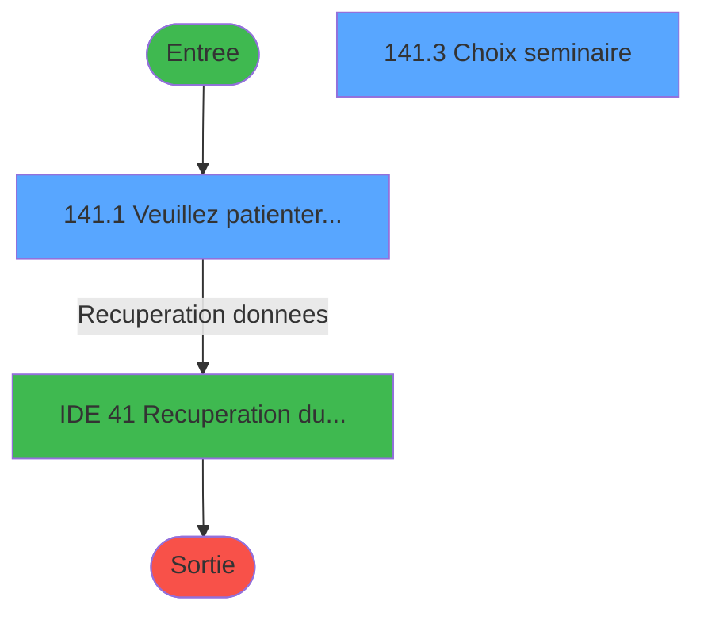
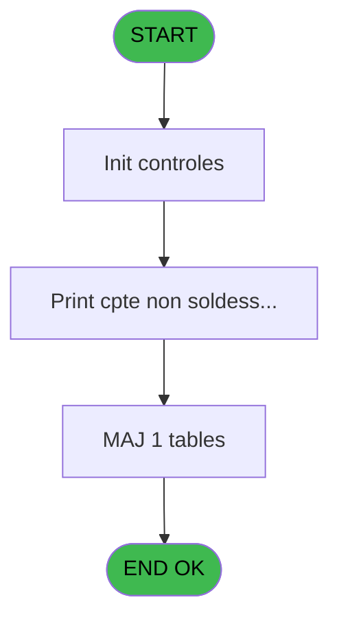
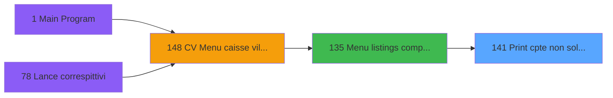
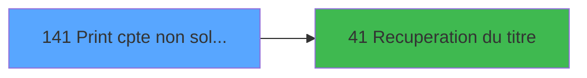

# VIL IDE 141 - Print cpte non soldes/semin.

> **Analyse**: Phases 1-4 2026-02-03 09:40 -> 09:40 (18s) | Assemblage 09:40
> **Pipeline**: V7.2 Enrichi
> **Structure**: 4 onglets (Resume | Ecrans | Donnees | Connexions)

<!-- TAB:Resume -->

## 1. FICHE D'IDENTITE

| Attribut | Valeur |
|----------|--------|
| Projet | VIL |
| IDE Position | 141 |
| Nom Programme | Print cpte non soldes/semin. |
| Fichier source | `Prg_141.xml` |
| Domaine metier | Comptabilite |
| Taches | 5 (2 ecrans visibles) |
| Tables modifiees | 1 |
| Programmes appeles | 1 |

## 2. DESCRIPTION FONCTIONNELLE

**Print cpte non soldes/semin.** assure la gestion complete de ce processus, accessible depuis [Menu listings complement. (IDE 135)](VIL-IDE-135.md).

Le flux de traitement s'organise en **4 blocs fonctionnels** :

- **Traitement** (2 taches) : traitements metier divers
- **Consultation** (1 tache) : ecrans de recherche, selection et consultation
- **Creation** (1 tache) : insertion d'enregistrements en base (mouvements, prestations)
- **Impression** (1 tache) : generation de tickets et documents

**Donnees modifiees** : 1 tables en ecriture (tempo_ecr_previsions).

Detail : phases du traitement

#### Phase 1 : Impression (1 tache)

- **141** - Print cpte non soldes/semin. **[[ECRAN]](#ecran-t1)**

#### Phase 2 : Traitement (2 taches)

- **141.1** - Veuillez patienter... **[[ECRAN]](#ecran-t2)**
- **141.2** - generation des seminaires

Delegue a : [Recuperation du titre (IDE 41)](VIL-IDE-41.md)

#### Phase 3 : Creation (1 tache)

- **141.2.1** - Creation temp

#### Phase 4 : Consultation (1 tache)

- **141.3** - Choix seminaire **[[ECRAN]](#ecran-t5)**

Delegue a : [Recuperation du titre (IDE 41)](VIL-IDE-41.md)

#### Tables impactees

| Table | Operations | Role metier |
|-------|-----------|-------------|
| tempo_ecr_previsions | **W** (2 usages) | Table temporaire ecran |

## 3. BLOCS FONCTIONNELS

### 3.1 Impression (1 tache)

Generation des documents et tickets.

---

#### 141 - Print cpte non soldes/semin. [[ECRAN]](#ecran-t1)

**Role** : Generation du document : Print cpte non soldes/semin..
**Ecran** : 424 x 55 DLU (MDI) | [Voir mockup](#ecran-t1)

### 3.2 Traitement (2 taches)

Traitements internes.

---

#### 141.1 - Veuillez patienter... [[ECRAN]](#ecran-t2)

**Role** : Traitement : Veuillez patienter....
**Ecran** : 424 x 55 DLU (MDI) | [Voir mockup](#ecran-t2)
**Delegue a** : [Recuperation du titre (IDE 41)](VIL-IDE-41.md)

---

#### 141.2 - generation des seminaires

**Role** : Traitement : generation des seminaires.
**Delegue a** : [Recuperation du titre (IDE 41)](VIL-IDE-41.md)

### 3.3 Creation (1 tache)

Insertion de nouveaux enregistrements en base.

---

#### 141.2.1 - Creation temp

**Role** : Creation d'enregistrement : Creation temp.

### 3.4 Consultation (1 tache)

Ecrans de recherche et consultation.

---

#### 141.3 - Choix seminaire [[ECRAN]](#ecran-t5)

**Role** : Selection par l'operateur : Choix seminaire.
**Ecran** : 447 x 214 DLU (MDI) | [Voir mockup](#ecran-t5)
**Variables liees** : F (V SEMINAIRE)

## 5. REGLES METIER

*(Aucune regle metier identifiee)*

## 6. CONTEXTE

- **Appele par**: [Menu listings complement. (IDE 135)](VIL-IDE-135.md)
- **Appelle**: 1 programmes | **Tables**: 4 (W:1 R:1 L:2) | **Taches**: 5 | **Expressions**: 4

<!-- TAB:Ecrans -->

## 8. ECRANS

### 8.1 Forms visibles (2 / 5)

| # | Position | Tache | Nom | Type | Largeur | Hauteur | Bloc |
|---|----------|-------|-----|------|---------|---------|------|
| 1 | 141.1 | 141.1 | Veuillez patienter... | MDI | 424 | 55 | Traitement |
| 2 | 141.3 | 141.3 | Choix seminaire | MDI | 447 | 214 | Consultation |

### 8.2 Mockups Ecrans

---

#### 141.1 - Veuillez patienter...
**Tache** : [141.1](#t2) | **Type** : MDI | **Dimensions** : 424 x 55 DLU
**Bloc** : Traitement | **Titre IDE** : Veuillez patienter...

<!-- FORM-DATA:
{
    "width":  424,
    "vFactor":  8,
    "type":  "MDI",
    "hFactor":  8,
    "controls":  [
                     {
                         "x":  117,
                         "type":  "label",
                         "var":  "",
                         "y":  9,
                         "w":  275,
                         "fmt":  "",
                         "name":  "",
                         "h":  8,
                         "color":  "7",
                         "text":  "Impression en cours",
                         "parent":  null
                     },
                     {
                         "x":  0,
                         "type":  "label",
                         "var":  "",
                         "y":  28,
                         "w":  423,
                         "fmt":  "",
                         "name":  "",
                         "h":  27,
                         "color":  "",
                         "text":  "",
                         "parent":  null
                     },
                     {
                         "x":  9,
                         "type":  "label",
                         "var":  "",
                         "y":  38,
                         "w":  405,
                         "fmt":  "",
                         "name":  "",
                         "h":  8,
                         "color":  "",
                         "text":  "Impression comptes non soldes / seminaire",
                         "parent":  null
                     },
                     {
                         "x":  1,
                         "type":  "image",
                         "var":  "",
                         "y":  1,
                         "w":  72,
                         "fmt":  "",
                         "name":  "",
                         "h":  25,
                         "color":  "",
                         "text":  "",
                         "parent":  null
                     }
                 ],
    "taskId":  "141.1",
    "height":  55
}
-->

---

#### 141.3 - Choix seminaire
**Tache** : [141.3](#t5) | **Type** : MDI | **Dimensions** : 447 x 214 DLU
**Bloc** : Consultation | **Titre IDE** : Choix seminaire

<!-- FORM-DATA:
{
    "width":  447,
    "vFactor":  8,
    "type":  "MDI",
    "hFactor":  4,
    "controls":  [
                     {
                         "x":  2,
                         "type":  "label",
                         "var":  "",
                         "y":  2,
                         "w":  436,
                         "fmt":  "",
                         "name":  "",
                         "h":  17,
                         "color":  "",
                         "text":  "",
                         "parent":  null
                     },
                     {
                         "x":  37,
                         "type":  "table",
                         "var":  "",
                         "name":  "",
                         "titleH":  12,
                         "color":  "110",
                         "w":  286,
                         "y":  28,
                         "fmt":  "",
                         "parent":  null,
                         "text":  "",
                         "rowH":  14,
                         "h":  144,
                         "cols":  [
                                      {
                                          "title":  "Séminaire",
                                          "layer":  1,
                                          "w":  125
                                      },
                                      {
                                          "title":  "Date début",
                                          "layer":  2,
                                          "w":  73
                                      },
                                      {
                                          "title":  "Date fin",
                                          "layer":  3,
                                          "w":  68
                                      }
                                  ],
                         "rows":  3
                     },
                     {
                         "x":  2,
                         "type":  "label",
                         "var":  "",
                         "y":  186,
                         "w":  436,
                         "fmt":  "",
                         "name":  "",
                         "h":  24,
                         "color":  "",
                         "text":  "",
                         "parent":  null
                     },
                     {
                         "x":  40,
                         "type":  "edit",
                         "var":  "",
                         "y":  44,
                         "w":  119,
                         "fmt":  "",
                         "name":  "SEM Seminaire",
                         "h":  10,
                         "color":  "110",
                         "text":  "",
                         "parent":  4
                     },
                     {
                         "x":  170,
                         "type":  "edit",
                         "var":  "",
                         "y":  44,
                         "w":  63,
                         "fmt":  "",
                         "name":  "SEM date Debut",
                         "h":  10,
                         "color":  "110",
                         "text":  "",
                         "parent":  4
                     },
                     {
                         "x":  238,
                         "type":  "edit",
                         "var":  "",
                         "y":  44,
                         "w":  63,
                         "fmt":  "",
                         "name":  "SEM date fin",
                         "h":  10,
                         "color":  "110",
                         "text":  "",
                         "parent":  4
                     },
                     {
                         "x":  344,
                         "type":  "button",
                         "var":  "",
                         "y":  189,
                         "w":  80,
                         "fmt":  "\u0026Edition",
                         "name":  "Bouton Edition",
                         "h":  18,
                         "color":  "",
                         "text":  "",
                         "parent":  null
                     },
                     {
                         "x":  13,
                         "type":  "edit",
                         "var":  "",
                         "y":  6,
                         "w":  114,
                         "fmt":  "30",
                         "name":  "",
                         "h":  8,
                         "color":  "",
                         "text":  "",
                         "parent":  1
                     },
                     {
                         "x":  318,
                         "type":  "edit",
                         "var":  "",
                         "y":  6,
                         "w":  114,
                         "fmt":  "WWW DD MMM YYYYZ",
                         "name":  "",
                         "h":  8,
                         "color":  "",
                         "text":  "",
                         "parent":  1
                     },
                     {
                         "x":  340,
                         "type":  "image",
                         "var":  "",
                         "y":  73,
                         "w":  80,
                         "fmt":  "",
                         "name":  "",
                         "h":  54,
                         "color":  "",
                         "text":  "",
                         "parent":  null
                     },
                     {
                         "x":  11,
                         "type":  "button",
                         "var":  "",
                         "y":  189,
                         "w":  80,
                         "fmt":  "\u0026Abandon",
                         "name":  "",
                         "h":  18,
                         "color":  "",
                         "text":  "",
                         "parent":  null
                     }
                 ],
    "taskId":  "141.3",
    "height":  214
}
-->

<strong>Champs : 5 champs</strong>

| Pos (x,y) | Nom | Variable | Type |
|-----------|-----|----------|------|
| 40,44 | SEM Seminaire | - | edit |
| 170,44 | SEM date Debut | - | edit |
| 238,44 | SEM date fin | - | edit |
| 13,6 | 30 | - | edit |
| 318,6 | WWW DD MMM YYYYZ | - | edit |

<strong>Boutons : 2 boutons</strong>

| Bouton | Pos (x,y) | Action |
|--------|-----------|--------|
| Edition | 344,189 | Lance l'impression Modifie l'element |
| Abandon | 11,189 | Annule et retour au menu |

## 9. NAVIGATION

### 9.1 Enchainement des ecrans

**Detail par enchainement :**

| Depuis | Action | Vers | Retour |
|--------|--------|------|--------|
| Veuillez patienter... | Recuperation donnees | [Recuperation du titre (IDE 41)](VIL-IDE-41.md) | Retour ecran |

### 9.3 Structure hierarchique (5 taches)

| Position | Tache | Type | Dimensions | Bloc |
|----------|-------|------|------------|------|
| **141.1** | [**Print cpte non soldes/semin.** (141)](#t1) [mockup](#ecran-t1) | MDI | 424x55 | Impression |
| **141.2** | [**Veuillez patienter...** (141.1)](#t2) [mockup](#ecran-t2) | MDI | 424x55 | Traitement |
| 141.2.1 | [generation des seminaires (141.2)](#t3) | MDI | - | |
| **141.3** | [**Creation temp** (141.2.1)](#t4) | MDI | - | Creation |
| **141.4** | [**Choix seminaire** (141.3)](#t5) [mockup](#ecran-t5) | MDI | 447x214 | Consultation |

### 9.4 Algorigramme

> **Legende**: Vert = START/END OK | Rouge = END KO | Bleu = Decisions
> *Algorigramme auto-genere. Utiliser `/algorigramme` pour une synthese metier detaillee.*

<!-- TAB:Donnees -->

## 10. TABLES

### Tables utilisees (4)

| ID | Nom | Description | Type | R | W | L | Usages |
|----|-----|-------------|------|---|---|---|--------|
| 36 | client_gm |  | DB | R |   |   | 2 |
| 39 | depot_garantie___dga | Depots et garanties | DB |   |   | L | 1 |
| 47 | compte_gm________cgm | Comptes GM (generaux) | DB |   |   | L | 1 |
| 597 | tempo_ecr_previsions | Table temporaire ecran | TMP |   | **W** |   | 2 |

### Colonnes par table (3 / 2 tables avec colonnes identifiees)

Table 36 - client_gm (R) - 2 usages

| Lettre | Variable | Acces | Type |
|--------|----------|-------|------|
| A | P1 societe | R | Alpha |
| B | P1 date traitement | R | Date |
| C | P1 nom village | R | Alpha |
| D | W0 config imp | R | Alpha |
| E | compte | R | Alpha |

Table 597 - tempo_ecr_previsions (**W**) - 2 usages

| Lettre | Variable | Acces | Type |
|--------|----------|-------|------|
| A | Bouton Edition | W | Alpha |
| B | V TITRE235 | W | Alpha |

## 11. VARIABLES

### 11.1 Parametres entrants (4)

Variables recues du programme appelant ([Menu listings complement. (IDE 135)](VIL-IDE-135.md)).

| Lettre | Nom | Type | Usage dans |
|--------|-----|------|-----------|
| A | P0 Societe | Alpha | - |
| B | PO Date Traitement | Date | - |
| C | PO Nom Village | Alpha | - |
| D | P0 masque montant | Alpha | - |

### 11.2 Variables de session (4)

Variables persistantes pendant toute la session.

| Lettre | Nom | Type | Usage dans |
|--------|-----|------|-----------|
| E | V ACTION | Alpha | 1x session |
| F | V SEMINAIRE | Alpha | - |
| G | V DATE DEB | Date | - |
| H | V TOTAL | Numeric | - |

## 12. EXPRESSIONS

**4 / 4 expressions decodees (100%)**

### 12.1 Repartition par type

| Type | Expressions | Regles |
|------|-------------|--------|
| CONSTANTE | 2 | 0 |
| OTHER | 1 | 0 |
| CONDITION | 1 | 0 |

### 12.2 Expressions cles par type

#### CONSTANTE (2 expressions)

| Type | IDE | Expression | Regle |
|------|-----|------------|-------|
| CONSTANTE | 4 | `0` | - |
| CONSTANTE | 3 | `''` | - |

#### OTHER (1 expressions)

| Type | IDE | Expression | Regle |
|------|-----|------------|-------|
| OTHER | 1 | `DbDel ('{597,2}'DSOURCE,'')` | - |

#### CONDITION (1 expressions)

| Type | IDE | Expression | Regle |
|------|-----|------------|-------|
| CONDITION | 2 | `V ACTION [E]='E'` | - |

<!-- TAB:Connexions -->

## 13. GRAPHE D'APPELS

### 13.1 Chaine depuis Main (Callers)

Main -> ... -> [Menu listings complement. (IDE 135)](VIL-IDE-135.md) -> **Print cpte non soldes/semin. (IDE 141)**

### 13.2 Callers

| IDE | Nom Programme | Nb Appels |
|-----|---------------|-----------|
| [135](VIL-IDE-135.md) | Menu listings complement. | 1 |

### 13.3 Callees (programmes appeles)

### 13.4 Detail Callees avec contexte

| IDE | Nom Programme | Appels | Contexte |
|-----|---------------|--------|----------|
| [41](VIL-IDE-41.md) | Recuperation du titre | 2 | Recuperation donnees |

## 14. RECOMMANDATIONS MIGRATION

### 14.1 Profil du programme

| Metrique | Valeur | Impact migration |
|----------|--------|-----------------|
| Lignes de logique | 89 | Programme compact |
| Expressions | 4 | Peu de logique |
| Tables WRITE | 1 | Impact faible |
| Sous-programmes | 1 | Peu de dependances |
| Ecrans visibles | 2 | Quelques ecrans |
| Code desactive | 0% (0 / 89) | Code sain |
| Regles metier | 0 | Pas de regle identifiee |

### 14.2 Plan de migration par bloc

#### Impression (1 tache: 1 ecran, 0 traitement)

- **Strategie** : Templates HTML -> PDF via wkhtmltopdf ou Puppeteer.
- `PrintService` injectable avec choix imprimante

#### Traitement (2 taches: 1 ecran, 1 traitement)

- **Strategie** : Orchestrateur avec 1 ecrans (Razor/React) et 1 traitements backend (services).
- Les ecrans deviennent des composants UI, les traitements invisibles deviennent des services injectables.
- 1 sous-programme(s) a migrer ou a reutiliser depuis les services existants.
- Decomposer les taches en services unitaires testables.

#### Creation (1 tache: 0 ecran, 1 traitement)

- **Strategie** : Repository pattern avec Entity Framework Core.
- Insertion via `IRepository<T>.CreateAsync()`

#### Consultation (1 tache: 1 ecran, 0 traitement)

- **Strategie** : Composants de recherche/selection en modales.
- 1 ecran : Choix seminaire

### 14.3 Dependances critiques

| Dependance | Type | Appels | Impact |
|------------|------|--------|--------|
| tempo_ecr_previsions | Table WRITE (Temp) | 2x | Schema + repository |
| [Recuperation du titre (IDE 41)](VIL-IDE-41.md) | Sous-programme | 2x | Haute - Recuperation donnees |

---
*Spec DETAILED generee par Pipeline V7.2 - 2026-02-03 09:40*
