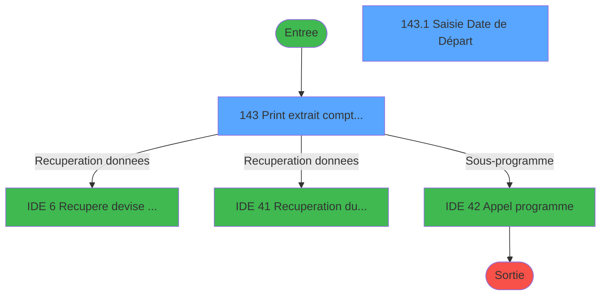
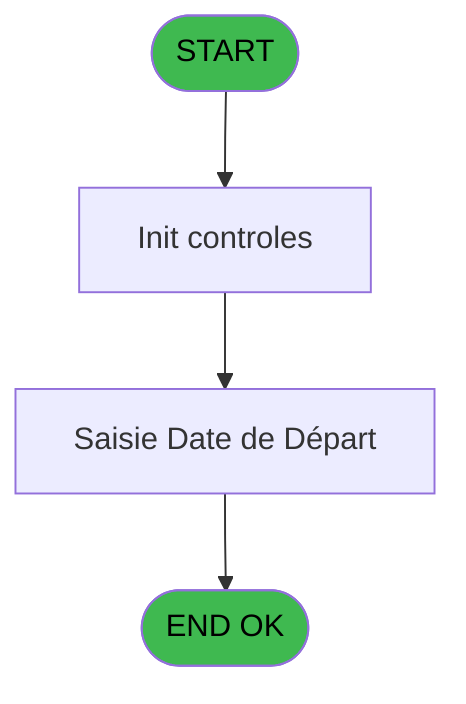
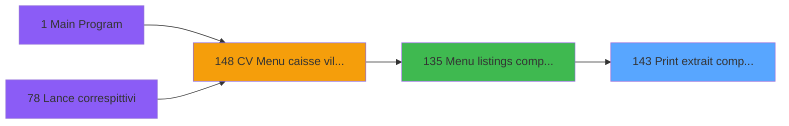
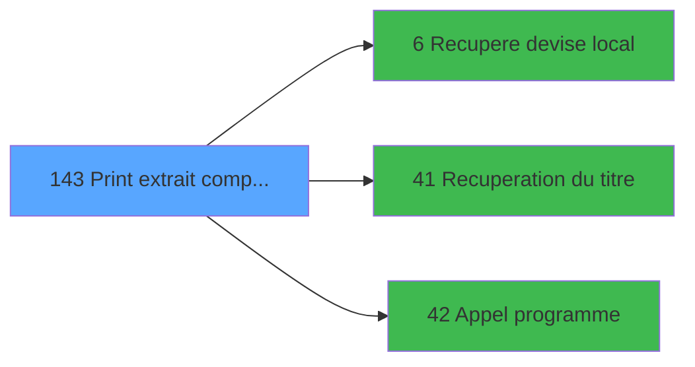

# VIL IDE 143 - Print extrait compte date

> **Analyse**: Phases 1-4 2026-02-03 09:41 -> 09:41 (17s) | Assemblage 09:41
> **Pipeline**: V7.2 Enrichi
> **Structure**: 4 onglets (Resume | Ecrans | Donnees | Connexions)

<!-- TAB:Resume -->

## 1. FICHE D'IDENTITE

| Attribut | Valeur |
|----------|--------|
| Projet | VIL |
| IDE Position | 143 |
| Nom Programme | Print extrait compte date |
| Fichier source | `Prg_143.xml` |
| Domaine metier | Comptabilite |
| Taches | 6 (2 ecrans visibles) |
| Tables modifiees | 0 |
| Programmes appeles | 3 |

## 2. DESCRIPTION FONCTIONNELLE

**Print extrait compte date** assure la gestion complete de ce processus, accessible depuis [Menu listings complement. (IDE 135)](VIL-IDE-135.md).

Le flux de traitement s'organise en **3 blocs fonctionnels** :

- **Impression** (3 taches) : generation de tickets et documents
- **Traitement** (2 taches) : traitements metier divers
- **Saisie** (1 tache) : ecrans de saisie utilisateur (formulaires, champs, donnees)

Detail : phases du traitement

#### Phase 1 : Impression (3 taches)

- **143** - Print extrait compte date **[[ECRAN]](#ecran-t1)**
- **143.1.1** - Edition **[[ECRAN]](#ecran-t3)**
- **143.1.2** - Edition **[[ECRAN]](#ecran-t16)**

#### Phase 2 : Saisie (1 tache)

- **143.1** - Saisie Date de Départ **[[ECRAN]](#ecran-t2)**

#### Phase 3 : Traitement (2 taches)

- **143.1.1.1** - Veuillez patienter.... **[[ECRAN]](#ecran-t4)**
- **143.1.2.1** - Veuillez patienter.... **[[ECRAN]](#ecran-t17)**

Delegue a : [Recupere devise local (IDE 6)](VIL-IDE-6.md), [Recuperation du titre (IDE 41)](VIL-IDE-41.md), [Appel programme (IDE 42)](VIL-IDE-42.md)

## 3. BLOCS FONCTIONNELS

### 3.1 Impression (3 taches)

Generation des documents et tickets.

---

#### 143 - Print extrait compte date [[ECRAN]](#ecran-t1)

**Role** : Generation du document : Print extrait compte date.
**Ecran** : 626 x 111 DLU | [Voir mockup](#ecran-t1)

---

#### 143.1.1 - Edition [[ECRAN]](#ecran-t3)

**Role** : Generation du document : Edition.
**Ecran** : 594 x 512 DLU | [Voir mockup](#ecran-t3)

---

#### 143.1.2 - Edition [[ECRAN]](#ecran-t16)

**Role** : Generation du document : Edition.
**Ecran** : 594 x 512 DLU | [Voir mockup](#ecran-t16)

### 3.2 Saisie (1 tache)

L'operateur saisit les donnees de la transaction via 1 ecran (Saisie Date de Départ).

---

#### 143.1 - Saisie Date de Départ [[ECRAN]](#ecran-t2)

**Role** : Saisie des donnees : Saisie Date de Départ.
**Ecran** : 624 x 142 DLU | [Voir mockup](#ecran-t2)

### 3.3 Traitement (2 taches)

Traitements internes.

---

#### 143.1.1.1 - Veuillez patienter.... [[ECRAN]](#ecran-t4)

**Role** : Traitement : Veuillez patienter.....
**Ecran** : 163 x 66 DLU | [Voir mockup](#ecran-t4)
**Delegue a** : [Recupere devise local (IDE 6)](VIL-IDE-6.md), [Recuperation du titre (IDE 41)](VIL-IDE-41.md), [Appel programme (IDE 42)](VIL-IDE-42.md)

---

#### 143.1.2.1 - Veuillez patienter.... [[ECRAN]](#ecran-t17)

**Role** : Traitement : Veuillez patienter.....
**Ecran** : 163 x 66 DLU | [Voir mockup](#ecran-t17)
**Delegue a** : [Recupere devise local (IDE 6)](VIL-IDE-6.md), [Recuperation du titre (IDE 41)](VIL-IDE-41.md), [Appel programme (IDE 42)](VIL-IDE-42.md)

## 5. REGLES METIER

*(Aucune regle metier identifiee)*

## 6. CONTEXTE

- **Appele par**: [Menu listings complement. (IDE 135)](VIL-IDE-135.md)
- **Appelle**: 3 programmes | **Tables**: 5 (W:0 R:2 L:4) | **Taches**: 6 | **Expressions**: 4

<!-- TAB:Ecrans -->

## 8. ECRANS

### 8.1 Forms visibles (2 / 6)

| # | Position | Tache | Nom | Type | Largeur | Hauteur | Bloc |
|---|----------|-------|-----|------|---------|---------|------|
| 1 | 143 | 143 | Print extrait compte date | Type0 | 626 | 111 | Impression |
| 2 | 143.1 | 143.1 | Saisie Date de Départ | Type0 | 624 | 142 | Saisie |

### 8.2 Mockups Ecrans

---

#### 143 - Print extrait compte date
**Tache** : [143](#t1) | **Type** : Type0 | **Dimensions** : 626 x 111 DLU
**Bloc** : Impression | **Titre IDE** : Print extrait compte date

<!-- FORM-DATA:
{
    "width":  626,
    "vFactor":  8,
    "type":  "Type0",
    "hFactor":  8,
    "controls":  [
                     {
                         "x":  10,
                         "type":  "label",
                         "var":  "",
                         "y":  4,
                         "w":  612,
                         "fmt":  "",
                         "name":  "",
                         "h":  24,
                         "color":  "",
                         "text":  "",
                         "parent":  null
                     },
                     {
                         "x":  182,
                         "type":  "label",
                         "var":  "",
                         "y":  35,
                         "w":  50,
                         "fmt":  "",
                         "name":  "",
                         "h":  37,
                         "color":  "",
                         "text":  "",
                         "parent":  null
                     },
                     {
                         "x":  179,
                         "type":  "label",
                         "var":  "",
                         "y":  33,
                         "w":  267,
                         "fmt":  "",
                         "name":  "",
                         "h":  54,
                         "color":  "",
                         "text":  "",
                         "parent":  null
                     },
                     {
                         "x":  240,
                         "type":  "label",
                         "var":  "",
                         "y":  43,
                         "w":  158,
                         "fmt":  "",
                         "name":  "",
                         "h":  9,
                         "color":  "7",
                         "text":  "Edition GM",
                         "parent":  7
                     },
                     {
                         "x":  240,
                         "type":  "label",
                         "var":  "",
                         "y":  57,
                         "w":  158,
                         "fmt":  "",
                         "name":  "",
                         "h":  9,
                         "color":  "7",
                         "text":  "Edition GO",
                         "parent":  null
                     },
                     {
                         "x":  189,
                         "type":  "label",
                         "var":  "",
                         "y":  74,
                         "w":  195,
                         "fmt":  "",
                         "name":  "",
                         "h":  8,
                         "color":  "",
                         "text":  "Choix de l\u0027action",
                         "parent":  null
                     },
                     {
                         "x":  19,
                         "type":  "edit",
                         "var":  "",
                         "y":  11,
                         "w":  200,
                         "fmt":  "30",
                         "name":  "",
                         "h":  8,
                         "color":  "",
                         "text":  "",
                         "parent":  3
                     },
                     {
                         "x":  386,
                         "type":  "edit",
                         "var":  "",
                         "y":  11,
                         "w":  219,
                         "fmt":  "WWW DD MMM YYYYZ",
                         "name":  "",
                         "h":  8,
                         "color":  "",
                         "text":  "",
                         "parent":  3
                     },
                     {
                         "x":  12,
                         "type":  "image",
                         "var":  "",
                         "y":  32,
                         "w":  160,
                         "fmt":  "",
                         "name":  "",
                         "h":  53,
                         "color":  "",
                         "text":  "",
                         "parent":  null
                     },
                     {
                         "x":  192,
                         "type":  "button",
                         "var":  "",
                         "y":  43,
                         "w":  26,
                         "fmt":  "1",
                         "name":  "1",
                         "h":  9,
                         "color":  "",
                         "text":  "",
                         "parent":  null
                     },
                     {
                         "x":  192,
                         "type":  "button",
                         "var":  "",
                         "y":  57,
                         "w":  26,
                         "fmt":  "2",
                         "name":  "2",
                         "h":  9,
                         "color":  "",
                         "text":  "",
                         "parent":  null
                     },
                     {
                         "x":  385,
                         "type":  "edit",
                         "var":  "",
                         "y":  73,
                         "w":  43,
                         "fmt":  "",
                         "name":  "W0 choix action",
                         "h":  10,
                         "color":  "6",
                         "text":  "",
                         "parent":  null
                     },
                     {
                         "x":  14,
                         "type":  "button",
                         "var":  "",
                         "y":  91,
                         "w":  160,
                         "fmt":  "\u0026Quitter",
                         "name":  "",
                         "h":  18,
                         "color":  "",
                         "text":  "",
                         "parent":  null
                     }
                 ],
    "taskId":  "143",
    "height":  111
}
-->

<strong>Champs : 3 champs</strong>

| Pos (x,y) | Nom | Variable | Type |
|-----------|-----|----------|------|
| 19,11 | 30 | - | edit |
| 386,11 | WWW DD MMM YYYYZ | - | edit |
| 385,73 | W0 choix action | - | edit |

<strong>Boutons : 3 boutons</strong>

| Bouton | Pos (x,y) | Action |
|--------|-----------|--------|
| 1 | 192,43 | Bouton fonctionnel |
| 2 | 192,57 | Bouton fonctionnel |
| Quitter | 14,91 | Quitte le programme |

---

#### 143.1 - Saisie Date de Départ
**Tache** : [143.1](#t2) | **Type** : Type0 | **Dimensions** : 624 x 142 DLU
**Bloc** : Saisie | **Titre IDE** : Saisie Date de Départ

<!-- FORM-DATA:
{
    "width":  624,
    "vFactor":  8,
    "type":  "Type0",
    "hFactor":  8,
    "controls":  [
                     {
                         "x":  5,
                         "type":  "label",
                         "var":  "",
                         "y":  2,
                         "w":  612,
                         "fmt":  "",
                         "name":  "",
                         "h":  24,
                         "color":  "",
                         "text":  "",
                         "parent":  null
                     },
                     {
                         "x":  3,
                         "type":  "label",
                         "var":  "",
                         "y":  84,
                         "w":  612,
                         "fmt":  "",
                         "name":  "",
                         "h":  26,
                         "color":  "",
                         "text":  "",
                         "parent":  null
                     },
                     {
                         "x":  4,
                         "type":  "label",
                         "var":  "",
                         "y":  116,
                         "w":  612,
                         "fmt":  "",
                         "name":  "",
                         "h":  24,
                         "color":  "",
                         "text":  "",
                         "parent":  null
                     },
                     {
                         "x":  413,
                         "type":  "label",
                         "var":  "",
                         "y":  93,
                         "w":  45,
                         "fmt":  "",
                         "name":  "",
                         "h":  12,
                         "color":  "",
                         "text":  "Date",
                         "parent":  12
                     },
                     {
                         "x":  14,
                         "type":  "label",
                         "var":  "",
                         "y":  92,
                         "w":  138,
                         "fmt":  "",
                         "name":  "",
                         "h":  12,
                         "color":  "",
                         "text":  "Type de sortie :",
                         "parent":  12
                     },
                     {
                         "x":  14,
                         "type":  "edit",
                         "var":  "",
                         "y":  9,
                         "w":  200,
                         "fmt":  "30",
                         "name":  "",
                         "h":  8,
                         "color":  "",
                         "text":  "",
                         "parent":  9
                     },
                     {
                         "x":  355,
                         "type":  "edit",
                         "var":  "",
                         "y":  9,
                         "w":  248,
                         "fmt":  "WWW DD MMM YYYYZ",
                         "name":  "",
                         "h":  8,
                         "color":  "",
                         "text":  "",
                         "parent":  9
                     },
                     {
                         "x":  231,
                         "type":  "image",
                         "var":  "",
                         "y":  32,
                         "w":  160,
                         "fmt":  "",
                         "name":  "",
                         "h":  43,
                         "color":  "",
                         "text":  "",
                         "parent":  null
                     },
                     {
                         "x":  176,
                         "type":  "combobox",
                         "var":  "",
                         "y":  92,
                         "w":  139,
                         "fmt":  "",
                         "name":  "W1 type d\u0027edition",
                         "h":  12,
                         "color":  "",
                         "text":  "I,E",
                         "parent":  12
                     },
                     {
                         "x":  467,
                         "type":  "edit",
                         "var":  "",
                         "y":  92,
                         "w":  124,
                         "fmt":  "DD/MM/YYYY",
                         "name":  "W1 date",
                         "h":  12,
                         "color":  "28",
                         "text":  "",
                         "parent":  12
                     },
                     {
                         "x":  11,
                         "type":  "button",
                         "var":  "",
                         "y":  122,
                         "w":  152,
                         "fmt":  "\u0026Ok",
                         "name":  "Bouton Validation",
                         "h":  14,
                         "color":  "",
                         "text":  "",
                         "parent":  15
                     },
                     {
                         "x":  452,
                         "type":  "button",
                         "var":  "",
                         "y":  123,
                         "w":  152,
                         "fmt":  "A\u0026bandonner",
                         "name":  "Bouton abandon",
                         "h":  14,
                         "color":  "",
                         "text":  "",
                         "parent":  15
                     }
                 ],
    "taskId":  "143.1",
    "height":  142
}
-->

<strong>Champs : 4 champs</strong>

| Pos (x,y) | Nom | Variable | Type |
|-----------|-----|----------|------|
| 14,9 | 30 | - | edit |
| 355,9 | WWW DD MMM YYYYZ | - | edit |
| 176,92 | W1 type d'edition | - | combobox |
| 467,92 | W1 date | - | edit |

<strong>Boutons : 2 boutons</strong>

| Bouton | Pos (x,y) | Action |
|--------|-----------|--------|
| Ok | 11,122 | Valide la saisie et enregistre |
| Abandonner | 452,123 | Annule et retour au menu |

## 9. NAVIGATION

### 9.1 Enchainement des ecrans

**Detail par enchainement :**

| Depuis | Action | Vers | Retour |
|--------|--------|------|--------|
|   Print extrait compte date | Recuperation donnees | [Recupere devise local (IDE 6)](VIL-IDE-6.md) | Retour ecran |
|   Print extrait compte date | Recuperation donnees | [Recuperation du titre (IDE 41)](VIL-IDE-41.md) | Retour ecran |
|   Print extrait compte date | Sous-programme | [Appel programme (IDE 42)](VIL-IDE-42.md) | Retour ecran |

### 9.3 Structure hierarchique (6 taches)

| Position | Tache | Type | Dimensions | Bloc |
|----------|-------|------|------------|------|
| **143.1** | [**Print extrait compte date** (143)](#t1) [mockup](#ecran-t1) | - | 626x111 | Impression |
| 143.1.1 | [Edition (143.1.1)](#t3) [mockup](#ecran-t3) | - | 594x512 | |
| 143.1.2 | [Edition (143.1.2)](#t16) [mockup](#ecran-t16) | - | 594x512 | |
| **143.2** | [**Saisie Date de Départ** (143.1)](#t2) [mockup](#ecran-t2) | - | 624x142 | Saisie |
| **143.3** | [**Veuillez patienter....** (143.1.1.1)](#t4) [mockup](#ecran-t4) | - | 163x66 | Traitement |
| 143.3.1 | [Veuillez patienter.... (143.1.2.1)](#t17) [mockup](#ecran-t17) | - | 163x66 | |

### 9.4 Algorigramme

> **Legende**: Vert = START/END OK | Rouge = END KO | Bleu = Decisions
> *Algorigramme auto-genere. Utiliser `/algorigramme` pour une synthese metier detaillee.*

<!-- TAB:Donnees -->

## 10. TABLES

### Tables utilisees (5)

| ID | Nom | Description | Type | R | W | L | Usages |
|----|-----|-------------|------|---|---|---|--------|
| 30 | gm-recherche_____gmr | Index de recherche | DB | R |   |   | 2 |
| 40 | comptable________cte |  | DB | R |   | L | 4 |
| 47 | compte_gm________cgm | Comptes GM (generaux) | DB |   |   | L | 2 |
| 65 | comptes_recette__cre | Comptes GM (generaux) | DB |   |   | L | 2 |
| 67 | tables___________tab |  | DB |   |   | L | 2 |

### Colonnes par table (3 / 2 tables avec colonnes identifiees)

Table 30 - gm-recherche_____gmr (R) - 2 usages

| Lettre | Variable | Acces | Type |
|--------|----------|-------|------|
| A | W2 solde compte | R | Numeric |
| B | W2 libellé listing | R | Alpha |

Table 40 - comptable________cte (R/L) - 4 usages

| Lettre | Variable | Acces | Type |
|--------|----------|-------|------|
| A | W1 ret.lien CTE | R | Logical |
| B | v Solde | R | Numeric |

## 11. VARIABLES

### 11.1 Parametres entrants (3)

Variables recues du programme appelant ([Menu listings complement. (IDE 135)](VIL-IDE-135.md)).

| Lettre | Nom | Type | Usage dans |
|--------|-----|------|-----------|
| A | P0 société | Unicode | - |
| B | P0 masque montant | Unicode | - |
| C | P0 nom village | Unicode | - |

### 11.2 Variables de travail (4)

Variables internes au programme.

| Lettre | Nom | Type | Usage dans |
|--------|-----|------|-----------|
| D | W0 config imprimante | Unicode | - |
| E | W0 choix action | Unicode | 1x calcul interne |
| F | W0 fin tâche | Logical | - |
| G | W0 devise local | Unicode | - |

### 11.3 Autres (1)

Variables diverses.

| Lettre | Nom | Type | Usage dans |
|--------|-----|------|-----------|
| H | >v.titre | Unicode | - |

## 12. EXPRESSIONS

**4 / 4 expressions decodees (100%)**

### 12.1 Repartition par type

| Type | Expressions | Regles |
|------|-------------|--------|
| CONSTANTE | 1 | 0 |
| DATE | 1 | 0 |
| CONDITION | 1 | 0 |
| REFERENCE_VG | 1 | 0 |

### 12.2 Expressions cles par type

#### CONSTANTE (1 expressions)

| Type | IDE | Expression | Regle |
|------|-----|------------|-------|
| CONSTANTE | 2 | `133` | - |

#### DATE (1 expressions)

| Type | IDE | Expression | Regle |
|------|-----|------------|-------|
| DATE | 4 | `Date()` | - |

#### CONDITION (1 expressions)

| Type | IDE | Expression | Regle |
|------|-----|------------|-------|
| CONDITION | 1 | `W0 choix action [E]='1' OR W0 choix action [E]='2'` | - |

#### REFERENCE_VG (1 expressions)

| Type | IDE | Expression | Regle |
|------|-----|------------|-------|
| REFERENCE_VG | 3 | `VG2` | - |

<!-- TAB:Connexions -->

## 13. GRAPHE D'APPELS

### 13.1 Chaine depuis Main (Callers)

Main -> ... -> [Menu listings complement. (IDE 135)](VIL-IDE-135.md) -> **Print extrait compte date (IDE 143)**

### 13.2 Callers

| IDE | Nom Programme | Nb Appels |
|-----|---------------|-----------|
| [135](VIL-IDE-135.md) | Menu listings complement. | 1 |

### 13.3 Callees (programmes appeles)

### 13.4 Detail Callees avec contexte

| IDE | Nom Programme | Appels | Contexte |
|-----|---------------|--------|----------|
| [6](VIL-IDE-6.md) | Recupere devise local | 1 | Recuperation donnees |
| [41](VIL-IDE-41.md) | Recuperation du titre | 1 | Recuperation donnees |
| [42](VIL-IDE-42.md) | Appel programme | 1 | Sous-programme |

## 14. RECOMMANDATIONS MIGRATION

### 14.1 Profil du programme

| Metrique | Valeur | Impact migration |
|----------|--------|-----------------|
| Lignes de logique | 134 | Programme compact |
| Expressions | 4 | Peu de logique |
| Tables WRITE | 0 | Impact faible |
| Sous-programmes | 3 | Peu de dependances |
| Ecrans visibles | 2 | Quelques ecrans |
| Code desactive | 0.7% (1 / 134) | Code sain |
| Regles metier | 0 | Pas de regle identifiee |

### 14.2 Plan de migration par bloc

#### Impression (3 taches: 3 ecrans, 0 traitement)

- **Strategie** : Templates HTML -> PDF via wkhtmltopdf ou Puppeteer.
- `PrintService` injectable avec choix imprimante

#### Saisie (1 tache: 1 ecran, 0 traitement)

- **Strategie** : Formulaire React/Blazor avec validation Zod/FluentValidation.
- Reproduire 1 ecran : Saisie Date de Départ
- Validation temps reel cote client + serveur

#### Traitement (2 taches: 2 ecrans, 0 traitement)

- **Strategie** : 2 composant(s) UI (Razor/React) avec formulaires et validation.
- 3 sous-programme(s) a migrer ou a reutiliser depuis les services existants.
- Decomposer les taches en services unitaires testables.

### 14.3 Dependances critiques

| Dependance | Type | Appels | Impact |
|------------|------|--------|--------|
| [Appel programme (IDE 42)](VIL-IDE-42.md) | Sous-programme | 1x | Normale - Sous-programme |
| [Recuperation du titre (IDE 41)](VIL-IDE-41.md) | Sous-programme | 1x | Normale - Recuperation donnees |
| [Recupere devise local (IDE 6)](VIL-IDE-6.md) | Sous-programme | 1x | Normale - Recuperation donnees |

---
*Spec DETAILED generee par Pipeline V7.2 - 2026-02-03 09:41*
