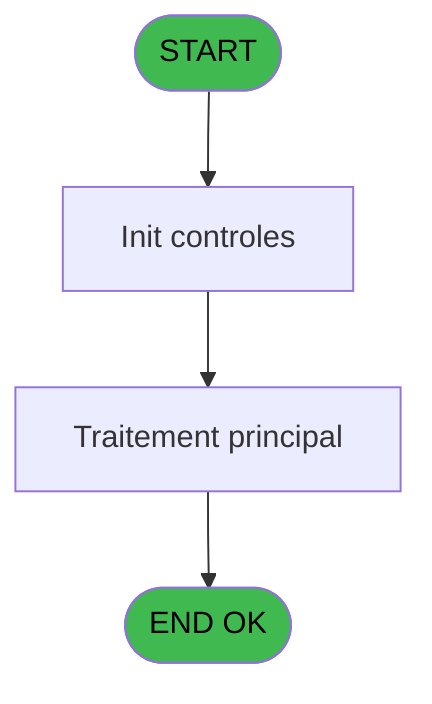

# VIL IDE 144 - Visu liste des garanties

> **Analyse**: Phases 1-4 2026-02-03 09:41 -> 09:42 (18s) | Assemblage 09:42
> **Pipeline**: V7.2 Enrichi
> **Structure**: 4 onglets (Resume | Ecrans | Donnees | Connexions)

<!-- TAB:Resume -->

## 1. FICHE D'IDENTITE

| Attribut | Valeur |
|----------|--------|
| Projet | VIL |
| IDE Position | 144 |
| Nom Programme | Visu liste des garanties |
| Fichier source | `Prg_144.xml` |
| Domaine metier | Garanties |
| Taches | 1 (1 ecrans visibles) |
| Tables modifiees | 0 |
| Programmes appeles | 1 |

## 2. DESCRIPTION FONCTIONNELLE

**Visu liste des garanties** assure la gestion complete de ce processus, accessible depuis [Menu listings complement. (IDE 135)](VIL-IDE-135.md).

Le flux de traitement s'organise en **1 blocs fonctionnels** :

- **Traitement** (1 tache) : traitements metier divers

**Logique metier** : 2 regles identifiees couvrant conditions metier.

## 3. BLOCS FONCTIONNELS

### 3.1 Traitement (1 tache)

Traitements internes.

---

#### 144 - Liste des garanties TPE [[ECRAN]](#ecran-t1)

**Role** : Traitement : Liste des garanties TPE.
**Ecran** : 1558 x 415 DLU (MDI) | [Voir mockup](#ecran-t1)
**Delegue a** : [  Print liste des garanties (IDE 139)](VIL-IDE-139.md)

## 5. REGLES METIER

2 regles identifiees:

### Autres (2 regles)

#### [RM-001] Traitement si [BB] est renseigne

| Element | Detail |
|---------|--------|
| **Condition** | `[BB]<>''` |
| **Si vrai** | [BB] |
| **Si faux** | [BA]) |
| **Expression source** | Expression 8 : `IF([BB]<>'',[BB],[BA])` |
| **Exemple** | Si [BB]<>'' → [BB]. Sinon → [BA]) |

#### [RM-002] Si VG21 alors 'P0 date traitement [B]'FORM sinon 'P0 nom village [C]'FORM)

| Element | Detail |
|---------|--------|
| **Condition** | `VG21` |
| **Si vrai** | 'P0 date traitement [B]'FORM |
| **Si faux** | 'P0 nom village [C]'FORM) |
| **Variables** | B (P0 date traitement), C (P0 nom village) |
| **Expression source** | Expression 13 : `IF(VG21,'P0 date traitement [B]'FORM,'P0 nom village [C]'FOR` |
| **Exemple** | Si VG21 → 'P0 date traitement [B]'FORM. Sinon → 'P0 nom village [C]'FORM) |

## 6. CONTEXTE

- **Appele par**: [Menu listings complement. (IDE 135)](VIL-IDE-135.md)
- **Appelle**: 1 programmes | **Tables**: 2 (W:0 R:1 L:1) | **Taches**: 1 | **Expressions**: 14

<!-- TAB:Ecrans -->

## 8. ECRANS

### 8.1 Forms visibles (1 / 1)

| # | Position | Tache | Nom | Type | Largeur | Hauteur | Bloc |
|---|----------|-------|-----|------|---------|---------|------|
| 1 | 144 | 144 | Liste des garanties TPE | MDI | 1558 | 415 | Traitement |

### 8.2 Mockups Ecrans

---

#### 144 - Liste des garanties TPE
**Tache** : [144](#t1) | **Type** : MDI | **Dimensions** : 1558 x 415 DLU
**Bloc** : Traitement | **Titre IDE** : Liste des garanties TPE

<!-- FORM-DATA:
{
    "width":  1558,
    "vFactor":  8,
    "type":  "MDI",
    "hFactor":  8,
    "controls":  [
                     {
                         "x":  16,
                         "type":  "table",
                         "var":  "",
                         "name":  "",
                         "titleH":  12,
                         "color":  "110",
                         "w":  1528,
                         "y":  39,
                         "fmt":  "",
                         "parent":  null,
                         "text":  "",
                         "rowH":  13,
                         "h":  343,
                         "cols":  [
                                      {
                                          "title":  "Nom / Prénom",
                                          "layer":  1,
                                          "w":  354
                                      },
                                      {
                                          "title":  "Qualité",
                                          "layer":  2,
                                          "w":  93
                                      },
                                      {
                                          "title":  "Date fin sejour",
                                          "layer":  3,
                                          "w":  134
                                      },
                                      {
                                          "title":  "Dépôt le",
                                          "layer":  4,
                                          "w":  248
                                      },
                                      {
                                          "title":  "Paiement",
                                          "layer":  5,
                                          "w":  82
                                      },
                                      {
                                          "title":  "Devise",
                                          "layer":  6,
                                          "w":  94
                                      },
                                      {
                                          "title":  "Montant",
                                          "layer":  7,
                                          "w":  191
                                      },
                                      {
                                          "title":  "Opérateur",
                                          "layer":  8,
                                          "w":  117
                                      },
                                      {
                                          "title":  "Dossier",
                                          "layer":  9,
                                          "w":  181
                                      }
                                  ],
                         "rows":  9
                     },
                     {
                         "x":  10,
                         "type":  "label",
                         "var":  "",
                         "y":  2,
                         "w":  1531,
                         "fmt":  "",
                         "name":  "",
                         "h":  24,
                         "color":  "",
                         "text":  "",
                         "parent":  null
                     },
                     {
                         "x":  10,
                         "type":  "label",
                         "var":  "",
                         "y":  387,
                         "w":  1534,
                         "fmt":  "",
                         "name":  "",
                         "h":  24,
                         "color":  "",
                         "text":  "",
                         "parent":  null
                     },
                     {
                         "x":  18,
                         "type":  "edit",
                         "var":  "",
                         "y":  10,
                         "w":  262,
                         "fmt":  "30",
                         "name":  "",
                         "h":  8,
                         "color":  "",
                         "text":  "",
                         "parent":  null
                     },
                     {
                         "x":  1244,
                         "type":  "edit",
                         "var":  "",
                         "y":  10,
                         "w":  280,
                         "fmt":  "WWW DD MMM YYYYT",
                         "name":  "",
                         "h":  8,
                         "color":  "",
                         "text":  "",
                         "parent":  null
                     },
                     {
                         "x":  21,
                         "type":  "edit",
                         "var":  "",
                         "y":  54,
                         "w":  342,
                         "fmt":  "30",
                         "name":  "gmr_nom__30_",
                         "h":  10,
                         "color":  "110",
                         "text":  "",
                         "parent":  9
                     },
                     {
                         "x":  376,
                         "type":  "edit",
                         "var":  "",
                         "y":  54,
                         "w":  29,
                         "fmt":  "",
                         "name":  "gmr_qualite",
                         "h":  10,
                         "color":  "110",
                         "text":  "",
                         "parent":  9
                     },
                     {
                         "x":  469,
                         "type":  "edit",
                         "var":  "",
                         "y":  54,
                         "w":  122,
                         "fmt":  "",
                         "name":  "gmr_fin_sejour",
                         "h":  10,
                         "color":  "110",
                         "text":  "",
                         "parent":  9
                     },
                     {
                         "x":  603,
                         "type":  "edit",
                         "var":  "",
                         "y":  54,
                         "w":  122,
                         "fmt":  "",
                         "name":  "dga_date_depot",
                         "h":  10,
                         "color":  "110",
                         "text":  "",
                         "parent":  9
                     },
                     {
                         "x":  738,
                         "type":  "edit",
                         "var":  "",
                         "y":  54,
                         "w":  106,
                         "fmt":  "",
                         "name":  "dga_heure_depot",
                         "h":  10,
                         "color":  "110",
                         "text":  "",
                         "parent":  9
                     },
                     {
                         "x":  851,
                         "type":  "edit",
                         "var":  "",
                         "y":  54,
                         "w":  51,
                         "fmt":  "",
                         "name":  "dga_type_depot",
                         "h":  10,
                         "color":  "110",
                         "text":  "",
                         "parent":  9
                     },
                     {
                         "x":  933,
                         "type":  "edit",
                         "var":  "",
                         "y":  54,
                         "w":  40,
                         "fmt":  "",
                         "name":  "dga_devise",
                         "h":  10,
                         "color":  "110",
                         "text":  "",
                         "parent":  9
                     },
                     {
                         "x":  1027,
                         "type":  "edit",
                         "var":  "",
                         "y":  54,
                         "w":  179,
                         "fmt":  "## ### ### ###.###Z",
                         "name":  "dga_montant",
                         "h":  10,
                         "color":  "110",
                         "text":  "",
                         "parent":  9
                     },
                     {
                         "x":  1218,
                         "type":  "edit",
                         "var":  "",
                         "y":  54,
                         "w":  96,
                         "fmt":  "",
                         "name":  "dga_operateur",
                         "h":  10,
                         "color":  "110",
                         "text":  "",
                         "parent":  9
                     },
                     {
                         "x":  1334,
                         "type":  "edit",
                         "var":  "",
                         "y":  54,
                         "w":  168,
                         "fmt":  "30",
                         "name":  "dga_num_dossier_na",
                         "h":  10,
                         "color":  "110",
                         "text":  "",
                         "parent":  9
                     },
                     {
                         "x":  1215,
                         "type":  "button",
                         "var":  "",
                         "y":  392,
                         "w":  154,
                         "fmt":  "\u0026Imprimer",
                         "name":  "",
                         "h":  14,
                         "color":  "",
                         "text":  "",
                         "parent":  null
                     },
                     {
                         "x":  1376,
                         "type":  "button",
                         "var":  "",
                         "y":  392,
                         "w":  154,
                         "fmt":  "\u0026Quitter",
                         "name":  "",
                         "h":  14,
                         "color":  "",
                         "text":  "",
                         "parent":  null
                     }
                 ],
    "taskId":  "144",
    "height":  415
}
-->

<strong>Champs : 12 champs</strong>

| Pos (x,y) | Nom | Variable | Type |
|-----------|-----|----------|------|
| 18,10 | 30 | - | edit |
| 1244,10 | WWW DD MMM YYYYT | - | edit |
| 21,54 | gmr_nom__30_ | - | edit |
| 376,54 | gmr_qualite | - | edit |
| 469,54 | gmr_fin_sejour | - | edit |
| 603,54 | dga_date_depot | - | edit |
| 738,54 | dga_heure_depot | - | edit |
| 851,54 | dga_type_depot | - | edit |
| 933,54 | dga_devise | - | edit |
| 1027,54 | dga_montant | - | edit |
| 1218,54 | dga_operateur | - | edit |
| 1334,54 | dga_num_dossier_na | - | edit |

<strong>Boutons : 2 boutons</strong>

| Bouton | Pos (x,y) | Action |
|--------|-----------|--------|
| Imprimer | 1215,392 | Lance l'impression |
| Quitter | 1376,392 | Quitte le programme |

## 9. NAVIGATION

Ecran unique: **Liste des garanties TPE**

### 9.3 Structure hierarchique (1 tache)

| Position | Tache | Type | Dimensions | Bloc |
|----------|-------|------|------------|------|
| **144.1** | [**Liste des garanties TPE** (144)](#t1) [mockup](#ecran-t1) | MDI | 1558x415 | Traitement |

### 9.4 Algorigramme

> **Legende**: Vert = START/END OK | Rouge = END KO | Bleu = Decisions
> *Algorigramme auto-genere. Utiliser `/algorigramme` pour une synthese metier detaillee.*

<!-- TAB:Donnees -->

## 10. TABLES

### Tables utilisees (2)

| ID | Nom | Description | Type | R | W | L | Usages |
|----|-----|-------------|------|---|---|---|--------|
| 30 | gm-recherche_____gmr | Index de recherche | DB | R |   |   | 1 |
| 39 | depot_garantie___dga | Depots et garanties | DB |   |   | L | 1 |

### Colonnes par table (1 / 1 tables avec colonnes identifiees)

Table 30 - gm-recherche_____gmr (R) - 1 usages

| Lettre | Variable | Acces | Type |
|--------|----------|-------|------|
| A | P0 societe | R | Alpha |
| B | P0 date traitement | R | Date |
| C | P0 nom village | R | Alpha |
| D | PO masque montant | R | Alpha |
| E | W0 config imp | R | Alpha |
| F | v. retour gmr | R | Logical |
| G | v.nb GM | R | Numeric |
| H | v.nb GO | R | Numeric |

## 11. VARIABLES

### 11.1 Parametres entrants (4)

Variables recues du programme appelant ([Menu listings complement. (IDE 135)](VIL-IDE-135.md)).

| Lettre | Nom | Type | Usage dans |
|--------|-----|------|-----------|
| A | P0 societe | Alpha | 1x parametre entrant |
| B | P0 date traitement | Date | 2x parametre entrant |
| C | P0 nom village | Alpha | 1x parametre entrant |
| D | PO masque montant | Alpha | 1x parametre entrant |

### 11.2 Variables de session (3)

Variables persistantes pendant toute la session.

| Lettre | Nom | Type | Usage dans |
|--------|-----|------|-----------|
| F | v. retour gmr | Logical | 1x session |
| G | v.nb GM | Numeric | 1x session |
| H | v.nb GO | Numeric | 1x session |

### 11.3 Variables de travail (1)

Variables internes au programme.

| Lettre | Nom | Type | Usage dans |
|--------|-----|------|-----------|
| E | W0 config imp | Alpha | - |

## 12. EXPRESSIONS

**14 / 14 expressions decodees (100%)**

### 12.1 Repartition par type

| Type | Expressions | Regles |
|------|-------------|--------|
| CONDITION | 3 | 2 |
| CONSTANTE | 1 | 0 |
| FORMAT | 1 | 0 |
| DATE | 1 | 0 |
| OTHER | 6 | 0 |
| REFERENCE_VG | 1 | 0 |
| CONCATENATION | 1 | 0 |

### 12.2 Expressions cles par type

#### CONDITION (3 expressions)

| Type | IDE | Expression | Regle |
|------|-----|------------|-------|
| CONDITION | 13 | `IF(VG21,'P0 date traitement [B]'FORM,'P0 nom village [C]'FORM)` | [RM-002](#rm-RM-002) |
| CONDITION | 8 | `IF([BB]<>'',[BB],[BA])` | [RM-001](#rm-RM-001) |
| CONDITION | 2 | `INIGet ('[MAGIC_LOGICAL_NAMES]preview')='O'` | - |

#### CONSTANTE (1 expressions)

| Type | IDE | Expression | Regle |
|------|-----|------------|-------|
| CONSTANTE | 6 | `0` | - |

#### FORMAT (1 expressions)

| Type | IDE | Expression | Regle |
|------|-----|------------|-------|
| FORMAT | 10 | `MlsTrans('Liste des garanties au ')&DStr(P0 date traitement [B],'DD/MM/YYYY')` | - |

#### DATE (1 expressions)

| Type | IDE | Expression | Regle |
|------|-----|------------|-------|
| DATE | 12 | `Date()` | - |

#### OTHER (6 expressions)

| Type | IDE | Expression | Regle |
|------|-----|------------|-------|
| OTHER | 5 | `v.nb GO [H]` | - |
| OTHER | 9 | `PO masque montant [D]` | - |
| OTHER | 14 | `[BC]` | - |
| OTHER | 1 | `P0 societe [A]` | - |
| OTHER | 3 | `v. retour gmr [F]` | - |
| ... | | *+1 autres* | |

#### REFERENCE_VG (1 expressions)

| Type | IDE | Expression | Regle |
|------|-----|------------|-------|
| REFERENCE_VG | 11 | `VG1` | - |

#### CONCATENATION (1 expressions)

| Type | IDE | Expression | Regle |
|------|-----|------------|-------|
| CONCATENATION | 7 | `Trim([U])&' '&Trim([V])` | - |

<!-- TAB:Connexions -->

## 13. GRAPHE D'APPELS

### 13.1 Chaine depuis Main (Callers)

Main -> ... -> [Menu listings complement. (IDE 135)](VIL-IDE-135.md) -> **Visu liste des garanties (IDE 144)**

### 13.2 Callers

| IDE | Nom Programme | Nb Appels |
|-----|---------------|-----------|
| [135](VIL-IDE-135.md) | Menu listings complement. | 1 |

### 13.3 Callees (programmes appeles)

### 13.4 Detail Callees avec contexte

| IDE | Nom Programme | Appels | Contexte |
|-----|---------------|--------|----------|
| [139](VIL-IDE-139.md) |   Print liste des garanties | 1 | Impression ticket/document |

## 14. RECOMMANDATIONS MIGRATION

### 14.1 Profil du programme

| Metrique | Valeur | Impact migration |
|----------|--------|-----------------|
| Lignes de logique | 37 | Programme compact |
| Expressions | 14 | Peu de logique |
| Tables WRITE | 0 | Impact faible |
| Sous-programmes | 1 | Peu de dependances |
| Ecrans visibles | 1 | Ecran unique ou traitement batch |
| Code desactive | 0% (0 / 37) | Code sain |
| Regles metier | 2 | Quelques regles a preserver |

### 14.2 Plan de migration par bloc

#### Traitement (1 tache: 1 ecran, 0 traitement)

- **Strategie** : 1 composant(s) UI (Razor/React) avec formulaires et validation.
- 1 sous-programme(s) a migrer ou a reutiliser depuis les services existants.
- Decomposer les taches en services unitaires testables.

### 14.3 Dependances critiques

| Dependance | Type | Appels | Impact |
|------------|------|--------|--------|
| [  Print liste des garanties (IDE 139)](VIL-IDE-139.md) | Sous-programme | 1x | Normale - Impression ticket/document |

---
*Spec DETAILED generee par Pipeline V7.2 - 2026-02-03 09:42*
