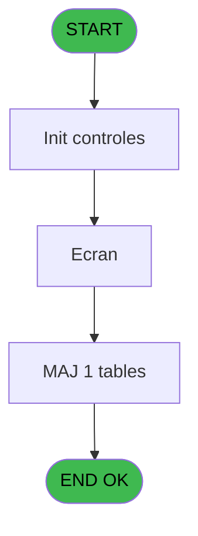
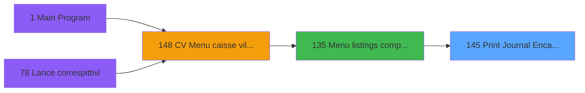

# VIL IDE 145 - Print Journal Encaissements

> **Analyse**: Phases 1-4 2026-02-03 09:42 -> 09:42 (17s) | Assemblage 09:42
> **Pipeline**: V7.2 Enrichi
> **Structure**: 4 onglets (Resume | Ecrans | Donnees | Connexions)

<!-- TAB:Resume -->

## 1. FICHE D'IDENTITE

| Attribut | Valeur |
|----------|--------|
| Projet | VIL |
| IDE Position | 145 |
| Nom Programme | Print Journal Encaissements |
| Fichier source | `Prg_145.xml` |
| Domaine metier | Caisse |
| Taches | 3 (1 ecrans visibles) |
| Tables modifiees | 1 |
| Programmes appeles | 0 |

## 2. DESCRIPTION FONCTIONNELLE

**Print Journal Encaissements** assure la gestion complete de ce processus, accessible depuis [Menu listings complement. (IDE 135)](VIL-IDE-135.md).

Le flux de traitement s'organise en **2 blocs fonctionnels** :

- **Impression** (2 taches) : generation de tickets et documents
- **Traitement** (1 tache) : traitements metier divers

**Donnees modifiees** : 1 tables en ecriture (Table_972).

Detail : phases du traitement

#### Phase 1 : Impression (2 taches)

- **145** - Print Journal Encaissements **[[ECRAN]](#ecran-t1)**
- **145.1.1** - Edition **[[ECRAN]](#ecran-t3)**

#### Phase 2 : Traitement (1 tache)

- **145.1** - Journal des Encaissements **[[ECRAN]](#ecran-t2)**

#### Tables impactees

| Table | Operations | Role metier |
|-------|-----------|-------------|
| Table_972 | **W** (1 usages) |  |

## 3. BLOCS FONCTIONNELS

### 3.1 Impression (2 taches)

Generation des documents et tickets.

---

#### 145 - Print Journal Encaissements [[ECRAN]](#ecran-t1)

**Role** : Generation du document : Print Journal Encaissements.
**Ecran** : 626 x 111 DLU | [Voir mockup](#ecran-t1)

---

#### 145.1.1 - Edition [[ECRAN]](#ecran-t3)

**Role** : Generation du document : Edition.
**Ecran** : 594 x 512 DLU | [Voir mockup](#ecran-t3)

### 3.2 Traitement (1 tache)

Traitements internes.

---

#### 145.1 - Journal des Encaissements [[ECRAN]](#ecran-t2)

**Role** : Traitement : Journal des Encaissements.
**Ecran** : 624 x 195 DLU | [Voir mockup](#ecran-t2)

## 5. REGLES METIER

*(Aucune regle metier identifiee)*

## 6. CONTEXTE

- **Appele par**: [Menu listings complement. (IDE 135)](VIL-IDE-135.md)
- **Appelle**: 0 programmes | **Tables**: 1 (W:1 R:0 L:0) | **Taches**: 3 | **Expressions**: 4

<!-- TAB:Ecrans -->

## 8. ECRANS

### 8.1 Forms visibles (1 / 3)

| # | Position | Tache | Nom | Type | Largeur | Hauteur | Bloc |
|---|----------|-------|-----|------|---------|---------|------|
| 1 | 145.1 | 145.1 | Journal des Encaissements | Type0 | 624 | 195 | Traitement |

### 8.2 Mockups Ecrans

---

#### 145.1 - Journal des Encaissements
**Tache** : [145.1](#t2) | **Type** : Type0 | **Dimensions** : 624 x 195 DLU
**Bloc** : Traitement | **Titre IDE** : Journal des Encaissements

<!-- FORM-DATA:
{
    "width":  624,
    "vFactor":  8,
    "type":  "Type0",
    "hFactor":  8,
    "controls":  [
                     {
                         "x":  5,
                         "type":  "label",
                         "var":  "",
                         "y":  2,
                         "w":  612,
                         "fmt":  "",
                         "name":  "",
                         "h":  19,
                         "color":  "",
                         "text":  "",
                         "parent":  null
                     },
                     {
                         "x":  17,
                         "type":  "label",
                         "var":  "",
                         "y":  81,
                         "w":  591,
                         "fmt":  "",
                         "name":  "",
                         "h":  76,
                         "color":  "",
                         "text":  "",
                         "parent":  null
                     },
                     {
                         "x":  4,
                         "type":  "label",
                         "var":  "",
                         "y":  167,
                         "w":  612,
                         "fmt":  "",
                         "name":  "",
                         "h":  24,
                         "color":  "",
                         "text":  "",
                         "parent":  null
                     },
                     {
                         "x":  137,
                         "type":  "label",
                         "var":  "",
                         "y":  95,
                         "w":  37,
                         "fmt":  "",
                         "name":  "",
                         "h":  12,
                         "color":  "",
                         "text":  "Du",
                         "parent":  null
                     },
                     {
                         "x":  309,
                         "type":  "label",
                         "var":  "",
                         "y":  95,
                         "w":  37,
                         "fmt":  "",
                         "name":  "",
                         "h":  12,
                         "color":  "",
                         "text":  "au",
                         "parent":  null
                     },
                     {
                         "x":  22,
                         "type":  "label",
                         "var":  "",
                         "y":  82,
                         "w":  578,
                         "fmt":  "",
                         "name":  "",
                         "h":  36,
                         "color":  "",
                         "text":  "",
                         "parent":  null
                     },
                     {
                         "x":  222,
                         "type":  "label",
                         "var":  "",
                         "y":  76,
                         "w":  168,
                         "fmt":  "",
                         "name":  "",
                         "h":  13,
                         "color":  "",
                         "text":  "   Dates comptables",
                         "parent":  null
                     },
                     {
                         "x":  22,
                         "type":  "label",
                         "var":  "",
                         "y":  118,
                         "w":  578,
                         "fmt":  "",
                         "name":  "",
                         "h":  36,
                         "color":  "",
                         "text":  "",
                         "parent":  null
                     },
                     {
                         "x":  282,
                         "type":  "label",
                         "var":  "",
                         "y":  112,
                         "w":  61,
                         "fmt":  "",
                         "name":  "",
                         "h":  13,
                         "color":  "",
                         "text":  " Sortie",
                         "parent":  null
                     },
                     {
                         "x":  14,
                         "type":  "edit",
                         "var":  "",
                         "y":  7,
                         "w":  200,
                         "fmt":  "30",
                         "name":  "",
                         "h":  8,
                         "color":  "",
                         "text":  "",
                         "parent":  9
                     },
                     {
                         "x":  355,
                         "type":  "edit",
                         "var":  "",
                         "y":  7,
                         "w":  248,
                         "fmt":  "WWW DD MMM YYYYZ",
                         "name":  "",
                         "h":  8,
                         "color":  "",
                         "text":  "",
                         "parent":  9
                     },
                     {
                         "x":  231,
                         "type":  "image",
                         "var":  "",
                         "y":  23,
                         "w":  160,
                         "fmt":  "",
                         "name":  "",
                         "h":  43,
                         "color":  "",
                         "text":  "",
                         "parent":  null
                     },
                     {
                         "x":  167,
                         "type":  "edit",
                         "var":  "",
                         "y":  95,
                         "w":  124,
                         "fmt":  "DD/MM/YYYYA",
                         "name":  "W1 date",
                         "h":  12,
                         "color":  "28",
                         "text":  "",
                         "parent":  null
                     },
                     {
                         "x":  364,
                         "type":  "edit",
                         "var":  "",
                         "y":  95,
                         "w":  124,
                         "fmt":  "DD/MM/YYYYA",
                         "name":  "V.date Fin_0001",
                         "h":  12,
                         "color":  "28",
                         "text":  "",
                         "parent":  null
                     },
                     {
                         "x":  237,
                         "type":  "combobox",
                         "var":  "",
                         "y":  133,
                         "w":  139,
                         "fmt":  "",
                         "name":  "W1 type d\u0027edition",
                         "h":  12,
                         "color":  "",
                         "text":  "I,E",
                         "parent":  null
                     },
                     {
                         "x":  11,
                         "type":  "button",
                         "var":  "",
                         "y":  173,
                         "w":  152,
                         "fmt":  "\u0026Ok",
                         "name":  "Bouton Validation",
                         "h":  14,
                         "color":  "",
                         "text":  "",
                         "parent":  15
                     },
                     {
                         "x":  452,
                         "type":  "button",
                         "var":  "",
                         "y":  174,
                         "w":  152,
                         "fmt":  "A\u0026bandonner",
                         "name":  "Bouton abandon",
                         "h":  14,
                         "color":  "",
                         "text":  "",
                         "parent":  15
                     }
                 ],
    "taskId":  "145.1",
    "height":  195
}
-->

<strong>Champs : 5 champs</strong>

| Pos (x,y) | Nom | Variable | Type |
|-----------|-----|----------|------|
| 14,7 | 30 | - | edit |
| 355,7 | WWW DD MMM YYYYZ | - | edit |
| 167,95 | W1 date | - | edit |
| 364,95 | V.date Fin_0001 | - | edit |
| 237,133 | W1 type d'edition | - | combobox |

<strong>Boutons : 2 boutons</strong>

| Bouton | Pos (x,y) | Action |
|--------|-----------|--------|
| Ok | 11,173 | Valide la saisie et enregistre |
| Abandonner | 452,174 | Annule et retour au menu |

## 9. NAVIGATION

Ecran unique: **Journal des Encaissements**

### 9.3 Structure hierarchique (3 taches)

| Position | Tache | Type | Dimensions | Bloc |
|----------|-------|------|------------|------|
| **145.1** | [**Print Journal Encaissements** (145)](#t1) [mockup](#ecran-t1) | - | 626x111 | Impression |
| 145.1.1 | [Edition (145.1.1)](#t3) [mockup](#ecran-t3) | - | 594x512 | |
| **145.2** | [**Journal des Encaissements** (145.1)](#t2) [mockup](#ecran-t2) | - | 624x195 | Traitement |

### 9.4 Algorigramme

> **Legende**: Vert = START/END OK | Rouge = END KO | Bleu = Decisions
> *Algorigramme auto-genere. Utiliser `/algorigramme` pour une synthese metier detaillee.*

<!-- TAB:Donnees -->

## 10. TABLES

### Tables utilisees (1)

| ID | Nom | Description | Type | R | W | L | Usages |
|----|-----|-------------|------|---|---|---|--------|
| 972 | Table_972 |  | MEM |   | **W** |   | 1 |

### Colonnes par table (1 / 1 tables avec colonnes identifiees)

Table 972 - Table_972 (**W**) - 1 usages

| Lettre | Variable | Acces | Type |
|--------|----------|-------|------|
| A | V.Cumul HT_Mode de paiement | W | Numeric |
| B | V.Cumul TTC_Mode de paiement | W | Numeric |
| C | V.Cumul HT_Total hors OD | W | Numeric |
| D | V.Cumul TTC_Total hors OD | W | Numeric |
| E | V.Groupe Début | W | Logical |

## 11. VARIABLES

### 11.1 Parametres entrants (3)

Variables recues du programme appelant ([Menu listings complement. (IDE 135)](VIL-IDE-135.md)).

| Lettre | Nom | Type | Usage dans |
|--------|-----|------|-----------|
| A | P0 société | Unicode | - |
| B | P0 masque montant | Unicode | - |
| C | P0 nom village | Unicode | - |

### 11.2 Variables de session (2)

Variables persistantes pendant toute la session.

| Lettre | Nom | Type | Usage dans |
|--------|-----|------|-----------|
| E | V.Nom Fichier PDF | Blob | - |
| F | V.Nom Fichier CSV | Blob | - |

### 11.3 Variables de travail (1)

Variables internes au programme.

| Lettre | Nom | Type | Usage dans |
|--------|-----|------|-----------|
| D | W0 choix action | Unicode | - |

## 12. EXPRESSIONS

**4 / 4 expressions decodees (100%)**

### 12.1 Repartition par type

| Type | Expressions | Regles |
|------|-------------|--------|
| DATE | 1 | 0 |
| FORMAT | 2 | 0 |
| REFERENCE_VG | 1 | 0 |

### 12.2 Expressions cles par type

#### DATE (1 expressions)

| Type | IDE | Expression | Regle |
|------|-----|------------|-------|
| DATE | 2 | `Date()` | - |

#### FORMAT (2 expressions)

| Type | IDE | Expression | Regle |
|------|-----|------------|-------|
| FORMAT | 4 | `Translate('%club_exportdata%')&'Journal_des_encaissements_'&DStr(Date(),'YYYYMMDD')&'.csv'` | - |
| FORMAT | 3 | `Translate('%club_exportdata%')&'Journal_des_encaissements_'&DStr(Date(),'YYYYMMDD')&'.pdf'` | - |

#### REFERENCE_VG (1 expressions)

| Type | IDE | Expression | Regle |
|------|-----|------------|-------|
| REFERENCE_VG | 1 | `VG2` | - |

<!-- TAB:Connexions -->

## 13. GRAPHE D'APPELS

### 13.1 Chaine depuis Main (Callers)

Main -> ... -> [Menu listings complement. (IDE 135)](VIL-IDE-135.md) -> **Print Journal Encaissements (IDE 145)**

### 13.2 Callers

| IDE | Nom Programme | Nb Appels |
|-----|---------------|-----------|
| [135](VIL-IDE-135.md) | Menu listings complement. | 1 |

### 13.3 Callees (programmes appeles)

### 13.4 Detail Callees avec contexte

| IDE | Nom Programme | Appels | Contexte |
|-----|---------------|--------|----------|
| - | (aucun) | - | - |

## 14. RECOMMANDATIONS MIGRATION

### 14.1 Profil du programme

| Metrique | Valeur | Impact migration |
|----------|--------|-----------------|
| Lignes de logique | 78 | Programme compact |
| Expressions | 4 | Peu de logique |
| Tables WRITE | 1 | Impact faible |
| Sous-programmes | 0 | Peu de dependances |
| Ecrans visibles | 1 | Ecran unique ou traitement batch |
| Code desactive | 0% (0 / 78) | Code sain |
| Regles metier | 0 | Pas de regle identifiee |

### 14.2 Plan de migration par bloc

#### Impression (2 taches: 2 ecrans, 0 traitement)

- **Strategie** : Templates HTML -> PDF via wkhtmltopdf ou Puppeteer.
- `PrintService` injectable avec choix imprimante

#### Traitement (1 tache: 1 ecran, 0 traitement)

- **Strategie** : 1 composant(s) UI (Razor/React) avec formulaires et validation.
- Decomposer les taches en services unitaires testables.

### 14.3 Dependances critiques

| Dependance | Type | Appels | Impact |
|------------|------|--------|--------|
| Table_972 | Table WRITE (Memory) | 1x | Schema + repository |

---
*Spec DETAILED generee par Pipeline V7.2 - 2026-02-03 09:42*
