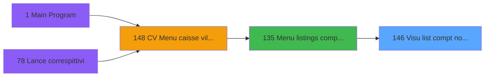

# VIL IDE 146 - Visu list compt non garantis

> **Analyse**: Phases 1-4 2026-02-03 09:42 -> 09:42 (18s) | Assemblage 09:42
> **Pipeline**: V7.2 Enrichi
> **Structure**: 4 onglets (Resume | Ecrans | Donnees | Connexions)

<!-- TAB:Resume -->

## 1. FICHE D'IDENTITE

| Attribut | Valeur |
|----------|--------|
| Projet | VIL |
| IDE Position | 146 |
| Nom Programme | Visu list compt non garantis |
| Fichier source | `Prg_146.xml` |
| Domaine metier | General |
| Taches | 1 (1 ecrans visibles) |
| Tables modifiees | 1 |
| Programmes appeles | 1 |

## 2. DESCRIPTION FONCTIONNELLE

**Visu list compt non garantis** assure la gestion complete de ce processus, accessible depuis [Menu listings complement. (IDE 135)](VIL-IDE-135.md).

Le flux de traitement s'organise en **1 blocs fonctionnels** :

- **Calcul** (1 tache) : calculs de montants, stocks ou compteurs

**Donnees modifiees** : 1 tables en ecriture (Table_1113).

**Logique metier** : 1 regles identifiees couvrant conditions metier.

## 3. BLOCS FONCTIONNELS

### 3.1 Calcul (1 tache)

Calculs metier : montants, stocks, compteurs.

---

#### 146 - Liste comptes non garantis [[ECRAN]](#ecran-t1)

**Role** : Traitement : Liste comptes non garantis.
**Ecran** : 1277 x 415 DLU (MDI) | [Voir mockup](#ecran-t1)

## 5. REGLES METIER

1 regles identifiees:

### Autres (1 regles)

#### [RM-001] Traitement si PO masque montant [D] est renseigne

| Element | Detail |
|---------|--------|
| **Condition** | `PO masque montant [D]<>''` |
| **Si vrai** | PO masque montant [D] |
| **Si faux** | 'NC12.3Z') |
| **Variables** | D (PO masque montant) |
| **Expression source** | Expression 4 : `IF(PO masque montant [D]<>'',PO masque montant [D],'NC12.3Z'` |
| **Exemple** | Si PO masque montant [D]<>'' → PO masque montant [D]. Sinon → 'NC12.3Z') |

## 6. CONTEXTE

- **Appele par**: [Menu listings complement. (IDE 135)](VIL-IDE-135.md)
- **Appelle**: 1 programmes | **Tables**: 1 (W:1 R:0 L:0) | **Taches**: 1 | **Expressions**: 15

<!-- TAB:Ecrans -->

## 8. ECRANS

### 8.1 Forms visibles (1 / 1)

| # | Position | Tache | Nom | Type | Largeur | Hauteur | Bloc |
|---|----------|-------|-----|------|---------|---------|------|
| 1 | 146 | 146 | Liste comptes non garantis | MDI | 1277 | 415 | Calcul |

### 8.2 Mockups Ecrans

---

#### 146 - Liste comptes non garantis
**Tache** : [146](#t1) | **Type** : MDI | **Dimensions** : 1277 x 415 DLU
**Bloc** : Calcul | **Titre IDE** : Liste comptes non garantis

<!-- FORM-DATA:
{
    "width":  1277,
    "vFactor":  8,
    "type":  "MDI",
    "hFactor":  8,
    "controls":  [
                     {
                         "x":  16,
                         "type":  "table",
                         "var":  "",
                         "name":  "",
                         "titleH":  12,
                         "color":  "110",
                         "w":  1247,
                         "y":  39,
                         "fmt":  "",
                         "parent":  null,
                         "text":  "",
                         "rowH":  13,
                         "h":  343,
                         "cols":  [
                                      {
                                          "title":  "Nom / Prénom",
                                          "layer":  1,
                                          "w":  354
                                      },
                                      {
                                          "title":  "Qualité",
                                          "layer":  2,
                                          "w":  93
                                      },
                                      {
                                          "title":  "Début séjour",
                                          "layer":  3,
                                          "w":  134
                                      },
                                      {
                                          "title":  "Fin séjour",
                                          "layer":  4,
                                          "w":  134
                                      },
                                      {
                                          "title":  "Montant",
                                          "layer":  5,
                                          "w":  191
                                      },
                                      {
                                          "title":  "Devise",
                                          "layer":  6,
                                          "w":  94
                                      },
                                      {
                                          "title":  "Statut garantie",
                                          "layer":  7,
                                          "w":  213
                                      }
                                  ],
                         "rows":  7
                     },
                     {
                         "x":  10,
                         "type":  "label",
                         "var":  "",
                         "y":  2,
                         "w":  1255,
                         "fmt":  "",
                         "name":  "",
                         "h":  24,
                         "color":  "",
                         "text":  "",
                         "parent":  null
                     },
                     {
                         "x":  10,
                         "type":  "label",
                         "var":  "",
                         "y":  387,
                         "w":  1255,
                         "fmt":  "",
                         "name":  "",
                         "h":  24,
                         "color":  "",
                         "text":  "",
                         "parent":  null
                     },
                     {
                         "x":  431,
                         "type":  "label",
                         "var":  "",
                         "y":  6,
                         "w":  415,
                         "fmt":  "",
                         "name":  "",
                         "h":  16,
                         "color":  "43",
                         "text":  "Aucun enregistrement",
                         "parent":  null
                     },
                     {
                         "x":  18,
                         "type":  "edit",
                         "var":  "",
                         "y":  10,
                         "w":  262,
                         "fmt":  "30",
                         "name":  "",
                         "h":  8,
                         "color":  "",
                         "text":  "",
                         "parent":  null
                     },
                     {
                         "x":  967,
                         "type":  "edit",
                         "var":  "",
                         "y":  10,
                         "w":  280,
                         "fmt":  "WWW DD MMM YYYYT",
                         "name":  "",
                         "h":  8,
                         "color":  "",
                         "text":  "",
                         "parent":  null
                     },
                     {
                         "x":  21,
                         "type":  "edit",
                         "var":  "",
                         "y":  54,
                         "w":  342,
                         "fmt":  "60",
                         "name":  "gmr_nom__30_",
                         "h":  10,
                         "color":  "110",
                         "text":  "",
                         "parent":  9
                     },
                     {
                         "x":  376,
                         "type":  "edit",
                         "var":  "",
                         "y":  54,
                         "w":  29,
                         "fmt":  "",
                         "name":  "gmr_qualite",
                         "h":  10,
                         "color":  "110",
                         "text":  "",
                         "parent":  9
                     },
                     {
                         "x":  469,
                         "type":  "edit",
                         "var":  "",
                         "y":  54,
                         "w":  122,
                         "fmt":  "",
                         "name":  "Debut_sejour_0001",
                         "h":  10,
                         "color":  "110",
                         "text":  "",
                         "parent":  9
                     },
                     {
                         "x":  603,
                         "type":  "edit",
                         "var":  "",
                         "y":  54,
                         "w":  122,
                         "fmt":  "",
                         "name":  "gmr_fin_sejour",
                         "h":  10,
                         "color":  "110",
                         "text":  "",
                         "parent":  9
                     },
                     {
                         "x":  737,
                         "type":  "edit",
                         "var":  "",
                         "y":  54,
                         "w":  179,
                         "fmt":  "## ### ### ###.###Z",
                         "name":  "dga_montant",
                         "h":  10,
                         "color":  "110",
                         "text":  "",
                         "parent":  9
                     },
                     {
                         "x":  927,
                         "type":  "edit",
                         "var":  "",
                         "y":  54,
                         "w":  40,
                         "fmt":  "",
                         "name":  "",
                         "h":  10,
                         "color":  "110",
                         "text":  "",
                         "parent":  9
                     },
                     {
                         "x":  1022,
                         "type":  "edit",
                         "var":  "",
                         "y":  54,
                         "w":  207,
                         "fmt":  "30",
                         "name":  "Statut_garantie",
                         "h":  10,
                         "color":  "110",
                         "text":  "",
                         "parent":  9
                     },
                     {
                         "x":  771,
                         "type":  "button",
                         "var":  "",
                         "y":  392,
                         "w":  154,
                         "fmt":  "\u0026Imprimer",
                         "name":  "",
                         "h":  14,
                         "color":  "",
                         "text":  "",
                         "parent":  null
                     },
                     {
                         "x":  933,
                         "type":  "button",
                         "var":  "",
                         "y":  392,
                         "w":  154,
                         "fmt":  "\u0026Exporter",
                         "name":  "",
                         "h":  14,
                         "color":  "",
                         "text":  "",
                         "parent":  null
                     },
                     {
                         "x":  1093,
                         "type":  "button",
                         "var":  "",
                         "y":  392,
                         "w":  154,
                         "fmt":  "\u0026Quitter",
                         "name":  "",
                         "h":  14,
                         "color":  "",
                         "text":  "",
                         "parent":  null
                     }
                 ],
    "taskId":  "146",
    "height":  415
}
-->

<strong>Champs : 9 champs</strong>

| Pos (x,y) | Nom | Variable | Type |
|-----------|-----|----------|------|
| 18,10 | 30 | - | edit |
| 967,10 | WWW DD MMM YYYYT | - | edit |
| 21,54 | gmr_nom__30_ | - | edit |
| 376,54 | gmr_qualite | - | edit |
| 469,54 | Debut_sejour_0001 | - | edit |
| 603,54 | gmr_fin_sejour | - | edit |
| 737,54 | dga_montant | - | edit |
| 927,54 | (sans nom) | - | edit |
| 1022,54 | Statut_garantie | - | edit |

<strong>Boutons : 3 boutons</strong>

| Bouton | Pos (x,y) | Action |
|--------|-----------|--------|
| Imprimer | 771,392 | Lance l'impression |
| Exporter | 933,392 | Bouton fonctionnel |
| Quitter | 1093,392 | Quitte le programme |

## 9. NAVIGATION

Ecran unique: **Liste comptes non garantis**

### 9.3 Structure hierarchique (1 tache)

| Position | Tache | Type | Dimensions | Bloc |
|----------|-------|------|------------|------|
| **146.1** | [**Liste comptes non garantis** (146)](#t1) [mockup](#ecran-t1) | MDI | 1277x415 | Calcul |

### 9.4 Algorigramme

> **Legende**: Vert = START/END OK | Rouge = END KO | Bleu = Decisions
> *Algorigramme auto-genere. Utiliser `/algorigramme` pour une synthese metier detaillee.*

<!-- TAB:Donnees -->

## 10. TABLES

### Tables utilisees (1)

| ID | Nom | Description | Type | R | W | L | Usages |
|----|-----|-------------|------|---|---|---|--------|
| 1113 | Table_1113 |  | MEM |   | **W** |   | 1 |

### Colonnes par table (1 / 1 tables avec colonnes identifiees)

Table 1113 - Table_1113 (**W**) - 1 usages

| Lettre | Variable | Acces | Type |
|--------|----------|-------|------|
| A | P0 societe | W | Alpha |
| B | P0 date traitement | W | Date |
| C | P0 nom village | W | Alpha |
| D | PO masque montant | W | Alpha |
| E | V.Chemin Export | W | Unicode |

## 11. VARIABLES

### 11.1 Parametres entrants (4)

Variables recues du programme appelant ([Menu listings complement. (IDE 135)](VIL-IDE-135.md)).

| Lettre | Nom | Type | Usage dans |
|--------|-----|------|-----------|
| A | P0 societe | Alpha | 1x parametre entrant |
| B | P0 date traitement | Date | 2x parametre entrant |
| C | P0 nom village | Alpha | - |
| D | PO masque montant | Alpha | 1x parametre entrant |

### 11.2 Variables de session (1)

Variables persistantes pendant toute la session.

| Lettre | Nom | Type | Usage dans |
|--------|-----|------|-----------|
| E | V.Chemin Export | Unicode | - |

## 12. EXPRESSIONS

**15 / 15 expressions decodees (100%)**

### 12.1 Repartition par type

| Type | Expressions | Regles |
|------|-------------|--------|
| CONDITION | 4 | 5 |
| FORMAT | 1 | 0 |
| DATE | 1 | 0 |
| REFERENCE_VG | 1 | 0 |
| CAST_LOGIQUE | 2 | 0 |
| OTHER | 4 | 0 |
| CONCATENATION | 1 | 0 |
| STRING | 1 | 0 |

### 12.2 Expressions cles par type

#### CONDITION (4 expressions)

| Type | IDE | Expression | Regle |
|------|-----|------------|-------|
| CONDITION | 4 | `IF(PO masque montant [D]<>'',PO masque montant [D],'NC12.3Z')` | [RM-001](#rm-RM-001) |
| CONDITION | 2 | `CndRange(P0 societe [A]<>'',P0 societe [A])` | - |
| CONDITION | 1 | `INIGet ('[MAGIC_LOGICAL_NAMES]preview')='O'` | - |
| CONDITION | 8 | `CndRange(P0 date traitement [B]<>'01/01/1901'DATE,P0 date traitement [B])` | - |

#### FORMAT (1 expressions)

| Type | IDE | Expression | Regle |
|------|-----|------------|-------|
| FORMAT | 5 | `MlsTrans('Liste des comptes non garanties au ')&DStr(P0 date traitement [B],'DD/MM/YYYY')` | - |

#### DATE (1 expressions)

| Type | IDE | Expression | Regle |
|------|-----|------------|-------|
| DATE | 7 | `Date()` | - |

#### REFERENCE_VG (1 expressions)

| Type | IDE | Expression | Regle |
|------|-----|------------|-------|
| REFERENCE_VG | 6 | `VG1` | - |

#### CAST_LOGIQUE (2 expressions)

| Type | IDE | Expression | Regle |
|------|-----|------------|-------|
| CAST_LOGIQUE | 10 | `'FALSE'LOG` | - |
| CAST_LOGIQUE | 9 | `'TRUE'LOG` | - |

#### OTHER (4 expressions)

| Type | IDE | Expression | Regle |
|------|-----|------------|-------|
| OTHER | 14 | `EmptyDataview(0)` | - |
| OTHER | 15 | `MlsTrans('Aucun enregistrement')` | - |
| OTHER | 12 | `MlsTrans([BN])` | - |
| OTHER | 13 | `NOT(EmptyDataview(0))` | - |

#### CONCATENATION (1 expressions)

| Type | IDE | Expression | Regle |
|------|-----|------------|-------|
| CONCATENATION | 3 | `Trim([T])&' '&Trim([U])` | - |

#### STRING (1 expressions)

| Type | IDE | Expression | Regle |
|------|-----|------------|-------|
| STRING | 11 | `Trim([BR])` | - |

<!-- TAB:Connexions -->

## 13. GRAPHE D'APPELS

### 13.1 Chaine depuis Main (Callers)

Main -> ... -> [Menu listings complement. (IDE 135)](VIL-IDE-135.md) -> **Visu list compt non garantis (IDE 146)**

### 13.2 Callers

| IDE | Nom Programme | Nb Appels |
|-----|---------------|-----------|
| [135](VIL-IDE-135.md) | Menu listings complement. | 1 |

### 13.3 Callees (programmes appeles)

### 13.4 Detail Callees avec contexte

| IDE | Nom Programme | Appels | Contexte |
|-----|---------------|--------|----------|
| [147](VIL-IDE-147.md) |   Print cpte non garantis/date | 2 | Impression ticket/document |

## 14. RECOMMANDATIONS MIGRATION

### 14.1 Profil du programme

| Metrique | Valeur | Impact migration |
|----------|--------|-----------------|
| Lignes de logique | 23 | Programme compact |
| Expressions | 15 | Peu de logique |
| Tables WRITE | 1 | Impact faible |
| Sous-programmes | 1 | Peu de dependances |
| Ecrans visibles | 1 | Ecran unique ou traitement batch |
| Code desactive | 0% (0 / 23) | Code sain |
| Regles metier | 1 | Quelques regles a preserver |

### 14.2 Plan de migration par bloc

#### Calcul (1 tache: 1 ecran, 0 traitement)

- **Strategie** : Services de calcul purs (Domain Services).
- Migrer la logique de calcul (stock, compteurs, montants)

### 14.3 Dependances critiques

| Dependance | Type | Appels | Impact |
|------------|------|--------|--------|
| Table_1113 | Table WRITE (Memory) | 1x | Schema + repository |
| [  Print cpte non garantis/date (IDE 147)](VIL-IDE-147.md) | Sous-programme | 2x | Haute - Impression ticket/document |

---
*Spec DETAILED generee par Pipeline V7.2 - 2026-02-03 09:43*
