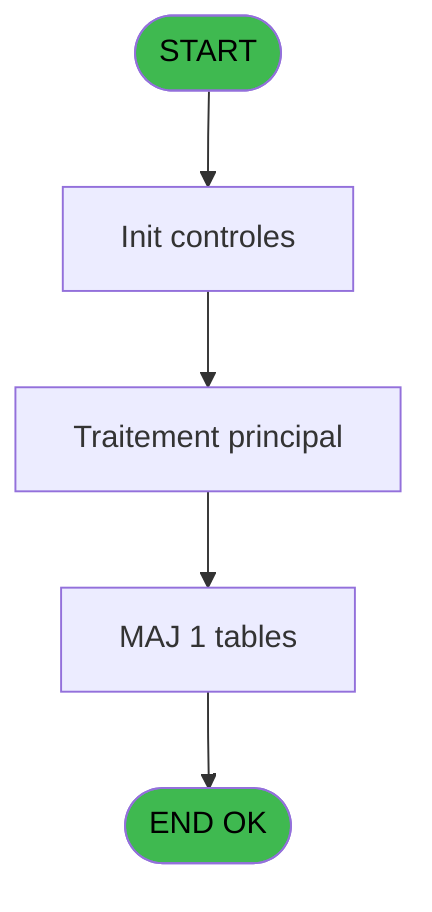
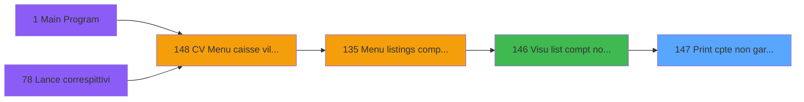

# VIL IDE 147 - Print cpte non garantis/date

> **Analyse**: Phases 1-4 2026-02-03 09:43 -> 09:43 (17s) | Assemblage 09:43
> **Pipeline**: V7.2 Enrichi
> **Structure**: 4 onglets (Resume | Ecrans | Donnees | Connexions)

<!-- TAB:Resume -->

## 1. FICHE D'IDENTITE

| Attribut | Valeur |
|----------|--------|
| Projet | VIL |
| IDE Position | 147 |
| Nom Programme | Print cpte non garantis/date |
| Fichier source | `Prg_147.xml` |
| Domaine metier | Impression |
| Taches | 3 (0 ecrans visibles) |
| Tables modifiees | 1 |
| Programmes appeles | 0 |

## 2. DESCRIPTION FONCTIONNELLE

**Print cpte non garantis/date** assure la gestion complete de ce processus, accessible depuis [  Visu list compt non garantis (IDE 146)](VIL-IDE-146.md).

Le flux de traitement s'organise en **1 blocs fonctionnels** :

- **Impression** (3 taches) : generation de tickets et documents

**Donnees modifiees** : 1 tables en ecriture (Table_1113).

**Logique metier** : 1 regles identifiees couvrant conditions metier.

## 3. BLOCS FONCTIONNELS

### 3.1 Impression (3 taches)

Generation des documents et tickets.

---

#### 147 - Print cpte non garantie/date

**Role** : Generation du document : Print cpte non garantie/date.

---

#### 147.1 - Print cpte non garantie/date

**Role** : Generation du document : Print cpte non garantie/date.

---

#### 147.2 - Print cpte non garantie/date

**Role** : Generation du document : Print cpte non garantie/date.

## 5. REGLES METIER

1 regles identifiees:

### Autres (1 regles)

#### [RM-001] Traitement si Trim(p.masque [D]) est renseigne

| Element | Detail |
|---------|--------|
| **Condition** | `Trim(p.masque [D])<>''` |
| **Si vrai** | p.masque [D] |
| **Si faux** | 'NC10.3Z') |
| **Variables** | D (p.masque) |
| **Expression source** | Expression 9 : `IF(Trim(p.masque [D])<>'',p.masque [D],'NC10.3Z')` |
| **Exemple** | Si Trim(p.masque [D])<>'' → p.masque [D]. Sinon → 'NC10.3Z') |

## 6. CONTEXTE

- **Appele par**: [  Visu list compt non garantis (IDE 146)](VIL-IDE-146.md)
- **Appelle**: 0 programmes | **Tables**: 1 (W:1 R:0 L:0) | **Taches**: 3 | **Expressions**: 11

<!-- TAB:Ecrans -->

## 8. ECRANS

*(Programme sans ecran visible)*

## 9. NAVIGATION

### 9.3 Structure hierarchique (3 taches)

| Position | Tache | Type | Dimensions | Bloc |
|----------|-------|------|------------|------|
| **147.1** | [**Print cpte non garantie/date** (147)](#t1) | MDI | - | Impression |
| 147.1.1 | [Print cpte non garantie/date (147.1)](#t4) | MDI | - | |
| 147.1.2 | [Print cpte non garantie/date (147.2)](#t7) | MDI | - | |

### 9.4 Algorigramme

> **Legende**: Vert = START/END OK | Rouge = END KO | Bleu = Decisions
> *Algorigramme auto-genere. Utiliser `/algorigramme` pour une synthese metier detaillee.*

<!-- TAB:Donnees -->

## 10. TABLES

### Tables utilisees (1)

| ID | Nom | Description | Type | R | W | L | Usages |
|----|-----|-------------|------|---|---|---|--------|
| 1113 | Table_1113 |  | MEM |   | **W** |   | 2 |

### Colonnes par table (1 / 1 tables avec colonnes identifiees)

Table 1113 - Table_1113 (**W**) - 2 usages

| Lettre | Variable | Acces | Type |
|--------|----------|-------|------|
| A | p.societe | W | Alpha |
| B | p.date | W | Date |
| C | p.village | W | Alpha |
| D | p.masque | W | Alpha |
| E | v.total compte non garantie | W | Numeric |
| F | v.Separator | W | Unicode |
| G | v.Ligne export | W | Unicode |

## 11. VARIABLES

### 11.1 Parametres entrants (6)

Variables recues du programme appelant ([  Visu list compt non garantis (IDE 146)](VIL-IDE-146.md)).

| Lettre | Nom | Type | Usage dans |
|--------|-----|------|-----------|
| A | p.societe | Alpha | 1x parametre entrant |
| B | p.date | Date | 3x parametre entrant |
| C | p.village | Alpha | - |
| D | p.masque | Alpha | 1x parametre entrant |
| E | p.Edit? (Export) | Logical | - |
| F | p.o.Chemin Export | Unicode | - |

### 11.2 Variables de session (1)

Variables persistantes pendant toute la session.

| Lettre | Nom | Type | Usage dans |
|--------|-----|------|-----------|
| G | v.Ligne export | Unicode | 1x session |

## 12. EXPRESSIONS

**11 / 11 expressions decodees (100%)**

### 12.1 Repartition par type

| Type | Expressions | Regles |
|------|-------------|--------|
| CONDITION | 3 | 5 |
| CALCULATION | 1 | 0 |
| CONCATENATION | 4 | 0 |
| DATE | 1 | 0 |
| OTHER | 2 | 0 |

### 12.2 Expressions cles par type

#### CONDITION (3 expressions)

| Type | IDE | Expression | Regle |
|------|-----|------------|-------|
| CONDITION | 9 | `IF(Trim(p.masque [D])<>'',p.masque [D],'NC10.3Z')` | [RM-001](#rm-RM-001) |
| CONDITION | 3 | `CndRange(p.societe [A]<>'',p.societe [A])` | - |
| CONDITION | 4 | `CndRange(p.date [B]<>'01/01/1901'DATE,p.date [B])` | - |

#### CALCULATION (1 expressions)

| Type | IDE | Expression | Regle |
|------|-----|------------|-------|
| CALCULATION | 5 | `[R]+[AR]` | - |

#### CONCATENATION (4 expressions)

| Type | IDE | Expression | Regle |
|------|-----|------------|-------|
| CONCATENATION | 8 | `MlsTrans ('Comptes non garantis au')&' '&DStr (p.date [B],'DD/MM/YYYY')` | - |
| CONCATENATION | 11 | `Trim(v.Ligne export [G])&' '&Trim([H])` | - |
| CONCATENATION | 10 | `'- '&Str (Page (0,1),'3P0Z0')&' -'` | - |
| CONCATENATION | 1 | `Trim (INIGet ('[MAGIC_LOGICAL_NAMES]club_exportdata')&'Cloture\Editions\Export_Comptes_Non_Garanties'&IF(p.date [B]<>'01/01/1901'DATE,'_'&DStr (p.date [B],'YYYYMMDD'),'')&'.csv')` | - |

#### DATE (1 expressions)

| Type | IDE | Expression | Regle |
|------|-----|------------|-------|
| DATE | 6 | `Date ()` | - |

#### OTHER (2 expressions)

| Type | IDE | Expression | Regle |
|------|-----|------------|-------|
| OTHER | 7 | `Time ()` | - |
| OTHER | 2 | `[AS]` | - |

<!-- TAB:Connexions -->

## 13. GRAPHE D'APPELS

### 13.1 Chaine depuis Main (Callers)

Main -> ... -> [  Visu list compt non garantis (IDE 146)](VIL-IDE-146.md) -> **Print cpte non garantis/date (IDE 147)**

### 13.2 Callers

| IDE | Nom Programme | Nb Appels |
|-----|---------------|-----------|
| [146](VIL-IDE-146.md) |   Visu list compt non garantis | 2 |

### 13.3 Callees (programmes appeles)

### 13.4 Detail Callees avec contexte

| IDE | Nom Programme | Appels | Contexte |
|-----|---------------|--------|----------|
| - | (aucun) | - | - |

## 14. RECOMMANDATIONS MIGRATION

### 14.1 Profil du programme

| Metrique | Valeur | Impact migration |
|----------|--------|-----------------|
| Lignes de logique | 64 | Programme compact |
| Expressions | 11 | Peu de logique |
| Tables WRITE | 1 | Impact faible |
| Sous-programmes | 0 | Peu de dependances |
| Ecrans visibles | 0 | Ecran unique ou traitement batch |
| Code desactive | 0% (0 / 64) | Code sain |
| Regles metier | 1 | Quelques regles a preserver |

### 14.2 Plan de migration par bloc

#### Impression (3 taches: 0 ecran, 3 traitements)

- **Strategie** : Templates HTML -> PDF via wkhtmltopdf ou Puppeteer.
- `PrintService` injectable avec choix imprimante

### 14.3 Dependances critiques

| Dependance | Type | Appels | Impact |
|------------|------|--------|--------|
| Table_1113 | Table WRITE (Memory) | 2x | Schema + repository |

---
*Spec DETAILED generee par Pipeline V7.2 - 2026-02-03 09:43*
