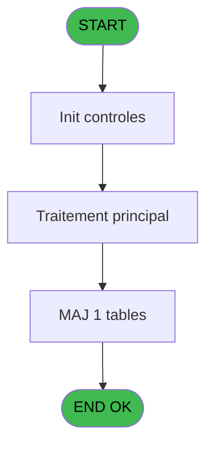
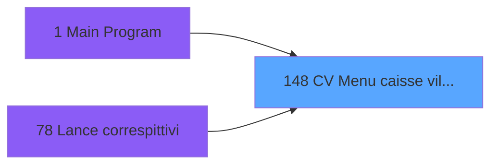
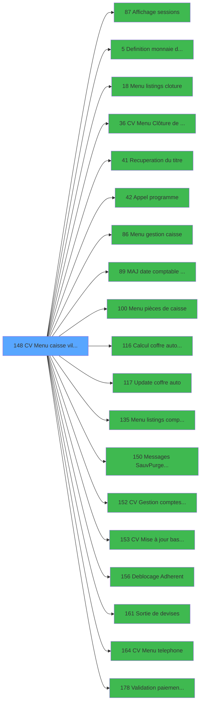

# VIL IDE 148 - CV  Menu caisse village

> **Analyse**: Phases 1-4 2026-02-03 09:43 -> 09:43 (18s) | Assemblage 09:43
> **Pipeline**: V7.2 Enrichi
> **Structure**: 4 onglets (Resume | Ecrans | Donnees | Connexions)

<!-- TAB:Resume -->

## 1. FICHE D'IDENTITE

| Attribut | Valeur |
|----------|--------|
| Projet | VIL |
| IDE Position | 148 |
| Nom Programme | CV  Menu caisse village |
| Fichier source | `Prg_148.xml` |
| Domaine metier | Caisse |
| Taches | 11 (1 ecrans visibles) |
| Tables modifiees | 1 |
| Programmes appeles | 19 |

## 2. DESCRIPTION FONCTIONNELLE

**CV  Menu caisse village** assure la gestion complete de ce processus, accessible depuis [Main Program (IDE 1)](VIL-IDE-1.md), [Lance correspittivi (IDE 78)](VIL-IDE-78.md).

Le flux de traitement s'organise en **4 blocs fonctionnels** :

- **Traitement** (8 taches) : traitements metier divers
- **Validation** (1 tache) : controles et verifications de coherence
- **Initialisation** (1 tache) : reinitialisation d'etats et de variables de travail
- **Calcul** (1 tache) : calculs de montants, stocks ou compteurs

**Donnees modifiees** : 1 tables en ecriture (reseau_cloture___rec).

**Logique metier** : 3 regles identifiees couvrant conditions metier.

Detail : phases du traitement

#### Phase 1 : Traitement (8 taches)

- **148** - CV  Menu **[[ECRAN]](#ecran-t1)**
- **148.1** - Station eteinte erreur v1
- **148.4** - Lecture paramètres PAR
- **148.5** - Lecture Parametre Change
- **148.6** - Lecture suivi PDC
- **148.8** - N° term coffre2 v1
- **148.9** - Station eteinte erreur v1
- **148.10** - N° term coffre2 v1

Delegue a : [Menu listings cloture (IDE 18)](VIL-IDE-18.md), [CV  Menu Clôture de caisse (IDE 36)](VIL-IDE-36.md), [Recuperation du titre (IDE 41)](VIL-IDE-41.md), [Appel programme (IDE 42)](VIL-IDE-42.md), [Menu gestion caisse (IDE 86)](VIL-IDE-86.md), [Menu pièces de caisse (IDE 100)](VIL-IDE-100.md), [Update coffre auto (IDE 117)](VIL-IDE-117.md), [Menu listings complement. (IDE 135)](VIL-IDE-135.md), [Messages Sauv/Purge/Teleph (IDE 150)](VIL-IDE-150.md), [CV  Mise à jour base articles (IDE 153)](VIL-IDE-153.md), [Deblocage Adherent (IDE 156)](VIL-IDE-156.md), [Sortie de devises (IDE 161)](VIL-IDE-161.md), [CV  Menu telephone (IDE 164)](VIL-IDE-164.md)

#### Phase 2 : Calcul (1 tache)

- **148.2** - Date comptable

Delegue a : [MAJ date comptable sessions (IDE 89)](VIL-IDE-89.md), [Calcul coffre auto avec (IDE 116)](VIL-IDE-116.md), [CV  Gestion comptes recette (IDE 152)](VIL-IDE-152.md)

#### Phase 3 : Initialisation (1 tache)

- **148.3** - Initialisation paramètres

Delegue a : [Definition monnaie de'enregist (IDE 5)](VIL-IDE-5.md)

#### Phase 4 : Validation (1 tache)

- **148.7** - Controle monnaie produit

#### Tables impactees

| Table | Operations | Role metier |
|-------|-----------|-------------|
| reseau_cloture___rec | **W** (2 usages) | Donnees reseau/cloture |

## 3. BLOCS FONCTIONNELS

### 3.1 Traitement (8 taches)

Traitements internes.

---

#### 148 - CV  Menu [[ECRAN]](#ecran-t1)

**Role** : Tache d'orchestration : point d'entree du programme (8 sous-taches). Coordonne l'enchainement des traitements.
**Ecran** : 1014 x 262 DLU (MDI) | [Voir mockup](#ecran-t1)

7 sous-taches directes

| Tache | Nom | Bloc |
|-------|-----|------|
| [148.1](#t2) | Station eteinte erreur v1 | Traitement |
| [148.4](#t5) | Lecture paramètres PAR | Traitement |
| [148.5](#t6) | Lecture Parametre Change | Traitement |
| [148.6](#t8) | Lecture suivi PDC | Traitement |
| [148.8](#t13) | N° term coffre2 v1 | Traitement |
| [148.9](#t16) | Station eteinte erreur v1 | Traitement |
| [148.10](#t19) | N° term coffre2 v1 | Traitement |

**Delegue a** : [Menu listings cloture (IDE 18)](VIL-IDE-18.md), [CV  Menu Clôture de caisse (IDE 36)](VIL-IDE-36.md), [Recuperation du titre (IDE 41)](VIL-IDE-41.md)

---

#### 148.1 - Station eteinte erreur v1

**Role** : Traitement : Station eteinte erreur v1.
**Delegue a** : [Menu listings cloture (IDE 18)](VIL-IDE-18.md), [CV  Menu Clôture de caisse (IDE 36)](VIL-IDE-36.md), [Recuperation du titre (IDE 41)](VIL-IDE-41.md)

---

#### 148.4 - Lecture paramètres PAR

**Role** : Traitement : Lecture paramètres PAR.
**Delegue a** : [Menu listings cloture (IDE 18)](VIL-IDE-18.md), [CV  Menu Clôture de caisse (IDE 36)](VIL-IDE-36.md), [Recuperation du titre (IDE 41)](VIL-IDE-41.md)

---

#### 148.5 - Lecture Parametre Change

**Role** : Traitement : Lecture Parametre Change.
**Delegue a** : [Menu listings cloture (IDE 18)](VIL-IDE-18.md), [CV  Menu Clôture de caisse (IDE 36)](VIL-IDE-36.md), [Recuperation du titre (IDE 41)](VIL-IDE-41.md)

---

#### 148.6 - Lecture suivi PDC

**Role** : Traitement : Lecture suivi PDC.
**Delegue a** : [Menu listings cloture (IDE 18)](VIL-IDE-18.md), [CV  Menu Clôture de caisse (IDE 36)](VIL-IDE-36.md), [Recuperation du titre (IDE 41)](VIL-IDE-41.md)

---

#### 148.8 - N° term coffre2 v1

**Role** : Traitement : N° term coffre2 v1.
**Variables liees** : CD (W0 N° Terminal coffre2), CE (W0 N° Hostname coffre2)
**Delegue a** : [Menu listings cloture (IDE 18)](VIL-IDE-18.md), [CV  Menu Clôture de caisse (IDE 36)](VIL-IDE-36.md), [Recuperation du titre (IDE 41)](VIL-IDE-41.md)

---

#### 148.9 - Station eteinte erreur v1

**Role** : Traitement : Station eteinte erreur v1.
**Delegue a** : [Menu listings cloture (IDE 18)](VIL-IDE-18.md), [CV  Menu Clôture de caisse (IDE 36)](VIL-IDE-36.md), [Recuperation du titre (IDE 41)](VIL-IDE-41.md)

---

#### 148.10 - N° term coffre2 v1

**Role** : Traitement : N° term coffre2 v1.
**Variables liees** : CD (W0 N° Terminal coffre2), CE (W0 N° Hostname coffre2)
**Delegue a** : [Menu listings cloture (IDE 18)](VIL-IDE-18.md), [CV  Menu Clôture de caisse (IDE 36)](VIL-IDE-36.md), [Recuperation du titre (IDE 41)](VIL-IDE-41.md)

### 3.2 Calcul (1 tache)

Calculs metier : montants, stocks, compteurs.

---

#### 148.2 - Date comptable

**Role** : Traitement : Date comptable.
**Variables liees** : B (P0 date comptable), C (P0 date jour), Z (W0 date comptable initiale), BG (W0 date validation), BQ (W0 Abandon update)
**Delegue a** : [MAJ date comptable sessions (IDE 89)](VIL-IDE-89.md), [Calcul coffre auto avec (IDE 116)](VIL-IDE-116.md), [CV  Gestion comptes recette (IDE 152)](VIL-IDE-152.md)

### 3.3 Initialisation (1 tache)

Reinitialisation d'etats et variables de travail.

---

#### 148.3 - Initialisation paramètres

**Role** : Reinitialisation : Initialisation paramètres.
**Delegue a** : [Definition monnaie de'enregist (IDE 5)](VIL-IDE-5.md)

### 3.4 Validation (1 tache)

Controles de coherence : 1 tache verifie les donnees et conditions.

---

#### 148.7 - Controle monnaie produit

**Role** : Verification : Controle monnaie produit.
**Variables liees** : BJ (W0 total monnaie), BK (W0 total produits), BR (W0 controle gen pdc fait), BS (W0 controle caisse fait), BT (W0 existe monnaie Produit)

## 5. REGLES METIER

3 regles identifiees:

### Autres (3 regles)

#### [RM-001] Si P0 village CAM [G]='O' alors 'M' sinon '.')

| Element | Detail |
|---------|--------|
| **Condition** | `P0 village CAM [G]='O'` |
| **Si vrai** | 'M' |
| **Si faux** | '.') |
| **Variables** | G (P0 village CAM) |
| **Expression source** | Expression 28 : `IF (P0 village CAM [G]='O','M','.')` |
| **Exemple** | Si P0 village CAM [G]='O' → 'M'. Sinon → '.') |

#### [RM-002] Si P0 village tel [J]='O' alors 'N' sinon '.')

| Element | Detail |
|---------|--------|
| **Condition** | `P0 village tel [J]='O'` |
| **Si vrai** | 'N' |
| **Si faux** | '.') |
| **Variables** | J (P0 village tel) |
| **Expression source** | Expression 30 : `IF (P0 village tel [J]='O','N','.')` |
| **Exemple** | Si P0 village tel [J]='O' → 'N'. Sinon → '.') |

#### [RM-003] Si P0 Cloture Automatique [Q]='O' alors MlsTrans ('Editions de la clôture') sinon MlsTrans ('Clôture de la journee'))

| Element | Detail |
|---------|--------|
| **Condition** | `P0 Cloture Automatique [Q]='O'` |
| **Si vrai** | MlsTrans ('Editions de la clôture') |
| **Si faux** | MlsTrans ('Clôture de la journee')) |
| **Variables** | Q (P0 Cloture Automatique) |
| **Expression source** | Expression 43 : `IF (P0 Cloture Automatique [Q]='O',MlsTrans ('Editions de la` |
| **Exemple** | Si P0 Cloture Automatique [Q]='O' → MlsTrans ('Editions de la clôture'). Sinon → MlsTrans ('Clôture de la journee')) |

## 6. CONTEXTE

- **Appele par**: [Main Program (IDE 1)](VIL-IDE-1.md), [Lance correspittivi (IDE 78)](VIL-IDE-78.md)
- **Appelle**: 19 programmes | **Tables**: 11 (W:1 R:7 L:3) | **Taches**: 11 | **Expressions**: 49

<!-- TAB:Ecrans -->

## 8. ECRANS

### 8.1 Forms visibles (1 / 11)

| # | Position | Tache | Nom | Type | Largeur | Hauteur | Bloc |
|---|----------|-------|-----|------|---------|---------|------|
| 1 | 148 | 148 | CV  Menu | MDI | 1014 | 262 | Traitement |

### 8.2 Mockups Ecrans

---

#### 148 - CV  Menu
**Tache** : [148](#t1) | **Type** : MDI | **Dimensions** : 1014 x 262 DLU
**Bloc** : Traitement | **Titre IDE** : CV  Menu

<!-- FORM-DATA:
{
    "width":  1014,
    "vFactor":  8,
    "type":  "MDI",
    "hFactor":  8,
    "controls":  [
                     {
                         "x":  2,
                         "type":  "label",
                         "var":  "",
                         "y":  0,
                         "w":  1013,
                         "fmt":  "",
                         "name":  "",
                         "h":  21,
                         "color":  "",
                         "text":  "",
                         "parent":  null
                     },
                     {
                         "x":  12,
                         "type":  "label",
                         "var":  "",
                         "y":  26,
                         "w":  1001,
                         "fmt":  "",
                         "name":  "",
                         "h":  187,
                         "color":  "",
                         "text":  "",
                         "parent":  null
                     },
                     {
                         "x":  586,
                         "type":  "label",
                         "var":  "",
                         "y":  29,
                         "w":  421,
                         "fmt":  "",
                         "name":  "",
                         "h":  25,
                         "color":  "",
                         "text":  "",
                         "parent":  null
                     },
                     {
                         "x":  616,
                         "type":  "label",
                         "var":  "",
                         "y":  38,
                         "w":  190,
                         "fmt":  "",
                         "name":  "",
                         "h":  10,
                         "color":  "7",
                         "text":  "Date comptable",
                         "parent":  7
                     },
                     {
                         "x":  99,
                         "type":  "label",
                         "var":  "",
                         "y":  76,
                         "w":  350,
                         "fmt":  "",
                         "name":  "",
                         "h":  98,
                         "color":  "",
                         "text":  "",
                         "parent":  20
                     },
                     {
                         "x":  140,
                         "type":  "label",
                         "var":  "",
                         "y":  76,
                         "w":  310,
                         "fmt":  "",
                         "name":  "",
                         "h":  97,
                         "color":  "6",
                         "text":  "",
                         "parent":  null
                     },
                     {
                         "x":  451,
                         "type":  "label",
                         "var":  "",
                         "y":  76,
                         "w":  464,
                         "fmt":  "",
                         "name":  "",
                         "h":  98,
                         "color":  "",
                         "text":  "",
                         "parent":  null
                     },
                     {
                         "x":  491,
                         "type":  "label",
                         "var":  "",
                         "y":  76,
                         "w":  422,
                         "fmt":  "",
                         "name":  "",
                         "h":  97,
                         "color":  "6",
                         "text":  "",
                         "parent":  null
                     },
                     {
                         "x":  101,
                         "type":  "label",
                         "var":  "",
                         "y":  77,
                         "w":  39,
                         "fmt":  "",
                         "name":  "",
                         "h":  96,
                         "color":  "",
                         "text":  "",
                         "parent":  null
                     },
                     {
                         "x":  452,
                         "type":  "label",
                         "var":  "",
                         "y":  77,
                         "w":  39,
                         "fmt":  "",
                         "name":  "",
                         "h":  96,
                         "color":  "",
                         "text":  "",
                         "parent":  null
                     },
                     {
                         "x":  153,
                         "type":  "label",
                         "var":  "",
                         "y":  80,
                         "w":  285,
                         "fmt":  "",
                         "name":  "",
                         "h":  8,
                         "color":  "146",
                         "text":  "Change non Gm",
                         "parent":  null
                     },
                     {
                         "x":  504,
                         "type":  "label",
                         "var":  "",
                         "y":  80,
                         "w":  405,
                         "fmt":  "",
                         "name":  "",
                         "h":  8,
                         "color":  "146",
                         "text":  "Nouvelle gestion caisse",
                         "parent":  null
                     },
                     {
                         "x":  153,
                         "type":  "label",
                         "var":  "",
                         "y":  91,
                         "w":  285,
                         "fmt":  "",
                         "name":  "",
                         "h":  8,
                         "color":  "146",
                         "text":  "Pièces de caisse",
                         "parent":  null
                     },
                     {
                         "x":  504,
                         "type":  "label",
                         "var":  "",
                         "y":  91,
                         "w":  405,
                         "fmt":  "",
                         "name":  "",
                         "h":  8,
                         "color":  "146",
                         "text":  "Listings complémentaires",
                         "parent":  null
                     },
                     {
                         "x":  153,
                         "type":  "label",
                         "var":  "",
                         "y":  102,
                         "w":  285,
                         "fmt":  "",
                         "name":  "",
                         "h":  8,
                         "color":  "146",
                         "text":  "Sortie de devises",
                         "parent":  null
                     },
                     {
                         "x":  504,
                         "type":  "label",
                         "var":  "",
                         "y":  103,
                         "w":  405,
                         "fmt":  "",
                         "name":  "",
                         "h":  8,
                         "color":  "146",
                         "text":  "Consultation taux de change",
                         "parent":  null
                     },
                     {
                         "x":  504,
                         "type":  "label",
                         "var":  "",
                         "y":  114,
                         "w":  405,
                         "fmt":  "",
                         "name":  "",
                         "h":  8,
                         "color":  "146",
                         "text":  "Déblocage adhérent",
                         "parent":  null
                     },
                     {
                         "x":  153,
                         "type":  "label",
                         "var":  "",
                         "y":  146,
                         "w":  285,
                         "fmt":  "",
                         "name":  "",
                         "h":  8,
                         "color":  "146",
                         "text":  "Comptes de recette",
                         "parent":  null
                     },
                     {
                         "x":  153,
                         "type":  "label",
                         "var":  "",
                         "y":  158,
                         "w":  285,
                         "fmt":  "",
                         "name":  "",
                         "h":  8,
                         "color":  "146",
                         "text":  "Articles",
                         "parent":  null
                     },
                     {
                         "x":  425,
                         "type":  "label",
                         "var":  "",
                         "y":  186,
                         "w":  123,
                         "fmt":  "",
                         "name":  "",
                         "h":  10,
                         "color":  "",
                         "text":  "Votre choix",
                         "parent":  null
                     },
                     {
                         "x":  0,
                         "type":  "label",
                         "var":  "",
                         "y":  237,
                         "w":  1014,
                         "fmt":  "",
                         "name":  "",
                         "h":  24,
                         "color":  "",
                         "text":  "",
                         "parent":  null
                     },
                     {
                         "x":  153,
                         "type":  "label",
                         "var":  "",
                         "y":  124,
                         "w":  285,
                         "fmt":  "",
                         "name":  "",
                         "h":  8,
                         "color":  "146",
                         "text":  "Paiements en attente",
                         "parent":  null
                     },
                     {
                         "x":  832,
                         "type":  "edit",
                         "var":  "",
                         "y":  38,
                         "w":  158,
                         "fmt":  "DD/MM/YYYY",
                         "name":  "",
                         "h":  10,
                         "color":  "7",
                         "text":  "",
                         "parent":  7
                     },
                     {
                         "x":  563,
                         "type":  "edit",
                         "var":  "",
                         "y":  186,
                         "w":  26,
                         "fmt":  "",
                         "name":  "W0 choix action",
                         "h":  10,
                         "color":  "6",
                         "text":  "",
                         "parent":  null
                     },
                     {
                         "x":  8,
                         "type":  "button",
                         "var":  "",
                         "y":  240,
                         "w":  176,
                         "fmt":  "\u0026Quitter",
                         "name":  "Bouton Quitter",
                         "h":  18,
                         "color":  "",
                         "text":  "",
                         "parent":  null
                     },
                     {
                         "x":  6,
                         "type":  "image",
                         "var":  "",
                         "y":  2,
                         "w":  59,
                         "fmt":  "",
                         "name":  "",
                         "h":  18,
                         "color":  "",
                         "text":  "",
                         "parent":  null
                     },
                     {
                         "x":  754,
                         "type":  "edit",
                         "var":  "",
                         "y":  6,
                         "w":  253,
                         "fmt":  "WWW DD MMM YYYYT",
                         "name":  "",
                         "h":  8,
                         "color":  "",
                         "text":  "",
                         "parent":  null
                     },
                     {
                         "x":  79,
                         "type":  "edit",
                         "var":  "",
                         "y":  7,
                         "w":  523,
                         "fmt":  "60",
                         "name":  "",
                         "h":  8,
                         "color":  "",
                         "text":  "",
                         "parent":  null
                     },
                     {
                         "x":  17,
                         "type":  "image",
                         "var":  "",
                         "y":  28,
                         "w":  86,
                         "fmt":  "",
                         "name":  "",
                         "h":  36,
                         "color":  "",
                         "text":  "",
                         "parent":  null
                     },
                     {
                         "x":  107,
                         "type":  "button",
                         "var":  "",
                         "y":  80,
                         "w":  27,
                         "fmt":  "A",
                         "name":  "A",
                         "h":  9,
                         "color":  "",
                         "text":  "",
                         "parent":  null
                     },
                     {
                         "x":  456,
                         "type":  "button",
                         "var":  "",
                         "y":  80,
                         "w":  30,
                         "fmt":  "I",
                         "name":  "I",
                         "h":  9,
                         "color":  "",
                         "text":  "",
                         "parent":  null
                     },
                     {
                         "x":  107,
                         "type":  "button",
                         "var":  "",
                         "y":  91,
                         "w":  27,
                         "fmt":  "B",
                         "name":  "B",
                         "h":  9,
                         "color":  "",
                         "text":  "",
                         "parent":  null
                     },
                     {
                         "x":  456,
                         "type":  "button",
                         "var":  "",
                         "y":  91,
                         "w":  30,
                         "fmt":  "J",
                         "name":  "J",
                         "h":  9,
                         "color":  "",
                         "text":  "",
                         "parent":  null
                     },
                     {
                         "x":  107,
                         "type":  "button",
                         "var":  "",
                         "y":  102,
                         "w":  27,
                         "fmt":  "C",
                         "name":  "C",
                         "h":  9,
                         "color":  "",
                         "text":  "",
                         "parent":  null
                     },
                     {
                         "x":  456,
                         "type":  "button",
                         "var":  "",
                         "y":  103,
                         "w":  30,
                         "fmt":  "K",
                         "name":  "K",
                         "h":  9,
                         "color":  "",
                         "text":  "",
                         "parent":  null
                     },
                     {
                         "x":  107,
                         "type":  "button",
                         "var":  "",
                         "y":  113,
                         "w":  27,
                         "fmt":  "D",
                         "name":  "D",
                         "h":  9,
                         "color":  "",
                         "text":  "",
                         "parent":  null
                     },
                     {
                         "x":  153,
                         "type":  "edit",
                         "var":  "",
                         "y":  113,
                         "w":  285,
                         "fmt":  "30",
                         "name":  "",
                         "h":  8,
                         "color":  "146",
                         "text":  "",
                         "parent":  null
                     },
                     {
                         "x":  456,
                         "type":  "button",
                         "var":  "",
                         "y":  114,
                         "w":  30,
                         "fmt":  "L",
                         "name":  "L",
                         "h":  9,
                         "color":  "",
                         "text":  "",
                         "parent":  null
                     },
                     {
                         "x":  456,
                         "type":  "button",
                         "var":  "",
                         "y":  125,
                         "w":  30,
                         "fmt":  "M",
                         "name":  "M",
                         "h":  9,
                         "color":  "",
                         "text":  "",
                         "parent":  null
                     },
                     {
                         "x":  504,
                         "type":  "edit",
                         "var":  "",
                         "y":  125,
                         "w":  405,
                         "fmt":  "30",
                         "name":  "",
                         "h":  8,
                         "color":  "146",
                         "text":  "",
                         "parent":  null
                     },
                     {
                         "x":  456,
                         "type":  "button",
                         "var":  "",
                         "y":  136,
                         "w":  30,
                         "fmt":  "N",
                         "name":  "N",
                         "h":  9,
                         "color":  "",
                         "text":  "",
                         "parent":  null
                     },
                     {
                         "x":  504,
                         "type":  "edit",
                         "var":  "",
                         "y":  136,
                         "w":  405,
                         "fmt":  "30",
                         "name":  "",
                         "h":  8,
                         "color":  "146",
                         "text":  "",
                         "parent":  null
                     },
                     {
                         "x":  107,
                         "type":  "button",
                         "var":  "",
                         "y":  146,
                         "w":  27,
                         "fmt":  "G",
                         "name":  "G",
                         "h":  9,
                         "color":  "",
                         "text":  "",
                         "parent":  null
                     },
                     {
                         "x":  107,
                         "type":  "button",
                         "var":  "",
                         "y":  158,
                         "w":  27,
                         "fmt":  "H",
                         "name":  "H",
                         "h":  9,
                         "color":  "",
                         "text":  "",
                         "parent":  null
                     },
                     {
                         "x":  917,
                         "type":  "image",
                         "var":  "",
                         "y":  176,
                         "w":  83,
                         "fmt":  "",
                         "name":  "",
                         "h":  30,
                         "color":  "",
                         "text":  "",
                         "parent":  null
                     },
                     {
                         "x":  651,
                         "type":  "button",
                         "var":  "",
                         "y":  240,
                         "w":  176,
                         "fmt":  "\u0026Contrôle caisse",
                         "name":  "Z",
                         "h":  18,
                         "color":  "",
                         "text":  "",
                         "parent":  null
                     },
                     {
                         "x":  830,
                         "type":  "button",
                         "var":  "",
                         "y":  240,
                         "w":  176,
                         "fmt":  "\u0026Visu sessions",
                         "name":  "",
                         "h":  18,
                         "color":  "",
                         "text":  "",
                         "parent":  null
                     },
                     {
                         "x":  107,
                         "type":  "button",
                         "var":  "",
                         "y":  124,
                         "w":  27,
                         "fmt":  "E",
                         "name":  "E",
                         "h":  9,
                         "color":  "",
                         "text":  "",
                         "parent":  null
                     }
                 ],
    "taskId":  "148",
    "height":  262
}
-->

<strong>Champs : 7 champs</strong>

| Pos (x,y) | Nom | Variable | Type |
|-----------|-----|----------|------|
| 832,38 | DD/MM/YYYY | - | edit |
| 563,186 | W0 choix action | - | edit |
| 754,6 | WWW DD MMM YYYYT | - | edit |
| 79,7 | 60 | - | edit |
| 153,113 | 30 | - | edit |
| 504,125 | 30 | - | edit |
| 504,136 | 30 | - | edit |

<strong>Boutons : 16 boutons</strong>

| Bouton | Pos (x,y) | Action |
|--------|-----------|--------|
| Quitter | 8,240 | Quitte le programme |
| A | 107,80 | Bouton fonctionnel |
| I | 456,80 | Bouton fonctionnel |
| B | 107,91 | Bouton fonctionnel |
| J | 456,91 | Bouton fonctionnel |
| C | 107,102 | Bouton fonctionnel |
| K | 456,103 | Bouton fonctionnel |
| D | 107,113 | Bouton fonctionnel |
| L | 456,114 | Bouton fonctionnel |
| M | 456,125 | Bouton fonctionnel |
| N | 456,136 | Bouton fonctionnel |
| G | 107,146 | Bouton fonctionnel |
| H | 107,158 | Bouton fonctionnel |
| Contrôle caisse | 651,240 | Bouton fonctionnel |
| Visu sessions | 830,240 | Bouton fonctionnel |
| E | 107,124 | Bouton fonctionnel |

## 9. NAVIGATION

Ecran unique: **CV  Menu**

### 9.3 Structure hierarchique (11 taches)

| Position | Tache | Type | Dimensions | Bloc |
|----------|-------|------|------------|------|
| **148.1** | [**CV  Menu** (148)](#t1) [mockup](#ecran-t1) | MDI | 1014x262 | Traitement |
| 148.1.1 | [Station eteinte erreur v1 (148.1)](#t2) | MDI | - | |
| 148.1.2 | [Lecture paramètres PAR (148.4)](#t5) | MDI | - | |
| 148.1.3 | [Lecture Parametre Change (148.5)](#t6) | MDI | - | |
| 148.1.4 | [Lecture suivi PDC (148.6)](#t8) | MDI | - | |
| 148.1.5 | [N° term coffre2 v1 (148.8)](#t13) | MDI | - | |
| 148.1.6 | [Station eteinte erreur v1 (148.9)](#t16) | MDI | - | |
| 148.1.7 | [N° term coffre2 v1 (148.10)](#t19) | MDI | - | |
| **148.2** | [**Date comptable** (148.2)](#t3) | MDI | - | Calcul |
| **148.3** | [**Initialisation paramètres** (148.3)](#t4) | MDI | - | Initialisation |
| **148.4** | [**Controle monnaie produit** (148.7)](#t9) | MDI | - | Validation |

### 9.4 Algorigramme

> **Legende**: Vert = START/END OK | Rouge = END KO | Bleu = Decisions
> *Algorigramme auto-genere. Utiliser `/algorigramme` pour une synthese metier detaillee.*

<!-- TAB:Donnees -->

## 10. TABLES

### Tables utilisees (11)

| ID | Nom | Description | Type | R | W | L | Usages |
|----|-----|-------------|------|---|---|---|--------|
| 23 | reseau_cloture___rec | Donnees reseau/cloture | DB |   | **W** |   | 2 |
| 63 | parametres___par |  | DB | R |   |   | 1 |
| 69 | initialisation___ini |  | DB | R |   |   | 1 |
| 70 | date_comptable___dat |  | DB | R |   |   | 1 |
| 122 | unilateral_bilateral |  | DB | R |   |   | 1 |
| 197 | articles_en_stock | Articles et stock | DB |   |   | L | 1 |
| 198 | coupures_monnaie_locale |  | DB | R |   |   | 1 |
| 255 | suivi_pdc |  | DB | R |   |   | 1 |
| 257 | numero_des_terminaux_ims |  | DB | R |   |   | 2 |
| 697 | droits_applications | Droits operateur | DB |   |   | L | 1 |
| 728 | arc_cc_total |  | DB |   |   | L | 1 |

### Colonnes par table (7 / 8 tables avec colonnes identifiees)

Table 23 - reseau_cloture___rec (**W**) - 2 usages

| Lettre | Variable | Acces | Type |
|--------|----------|-------|------|
| Q | P0 Cloture Automatique | W | Alpha |

Table 63 - parametres___par (R) - 1 usages

| Lettre | Variable | Acces | Type |
|--------|----------|-------|------|
| A | ------------------TAI | R | Alpha |
| B | ------------------NEW CAISSE | R | Alpha |
| C | Existe 35 | R | Logical |
| D | W1 fin tâche | R | Alpha |

Table 69 - initialisation___ini (R) - 1 usages

*Table utilisee uniquement en Link ou aucune colonne Real identifiee dans le DataView.*

Table 70 - date_comptable___dat (R) - 1 usages

| Lettre | Variable | Acces | Type |
|--------|----------|-------|------|
| B | P0 date comptable | R | Date |
| BG | W0 date validation | R | Date |
| BQ | W0 Abandon update | R | Logical |
| C | P0 date jour | R | Date |
| Z | W0 date comptable initiale | R | Date |

Table 122 - unilateral_bilateral (R) - 1 usages

| Lettre | Variable | Acces | Type |
|--------|----------|-------|------|
| V | W0 Uni/Bilateral | R | Alpha |

Table 198 - coupures_monnaie_locale (R) - 1 usages

| Lettre | Variable | Acces | Type |
|--------|----------|-------|------|
| A | Existe monnaie | R | Logical |
| B | Existe produits en stock | R | Logical |

Table 255 - suivi_pdc (R) - 1 usages

*Table utilisee uniquement en Link ou aucune colonne Real identifiee dans le DataView.*

Table 257 - numero_des_terminaux_ims (R) - 2 usages

*Table utilisee uniquement en Link ou aucune colonne Real identifiee dans le DataView.*

## 11. VARIABLES

### 11.1 Parametres entrants (17)

Variables recues du programme appelant ([Main Program (IDE 1)](VIL-IDE-1.md)).

| Lettre | Nom | Type | Usage dans |
|--------|-----|------|-----------|
| A | P0 societe | Alpha | - |
| B | P0 date comptable | Date | [148.2](#t3) |
| C | P0 date jour | Date | - |
| D | P0 heure jour | Time | - |
| E | P0 devise locale | Alpha | - |
| F | P0 nbre decimales | Numeric | - |
| G | P0 village CAM | Alpha | 3x parametre entrant |
| H | P0 masque montant | Alpha | - |
| I | P0 nom village | Alpha | - |
| J | P0 village tel | Alpha | 4x parametre entrant |
| K | P0 village bibop | Alpha | - |
| L | P0 village PME | Alpha | - |
| M | P0 village infos tel | Alpha | - |
| N | P0 village infos pla | Alpha | - |
| O | P0 village TAI | Alpha | - |
| P | P0 village nouvelle caisse | Alpha | - |
| Q | P0 Cloture Automatique | Alpha | 3x parametre entrant |

### 11.2 Variables de session (1)

Variables persistantes pendant toute la session.

| Lettre | Nom | Type | Usage dans |
|--------|-----|------|-----------|
| BC | v.titre | Alpha | 1x session |

### 11.3 Variables de travail (37)

Variables internes au programme.

| Lettre | Nom | Type | Usage dans |
|--------|-----|------|-----------|
| R | W0 choix action | Alpha | 10x calcul interne |
| S | W0 utilisation caiss | Alpha | 2x calcul interne |
| T | W0 utilisation bouti | Alpha | - |
| U | W0 statistiques ? | Alpha | - |
| V | W0 Uni/Bilateral | Alpha | - |
| W | W0 fin tache | Alpha | 1x calcul interne |
| X | W0 TAI Obligatoire | Alpha | - |
| Y | W0 autorisation clôture | Logical | 2x calcul interne |
| Z | W0 date comptable initiale | Date | - |
| BA | W0 abandon affichage session | Logical | - |
| BD | W0 quand (blanc) | Alpha | - |
| BE | W0 chrono session (zero) | Numeric | 1x calcul interne |
| BF | W0 chrono histo | Numeric | 1x calcul interne |
| BG | W0 date validation | Date | - |
| BH | W0 Time validation | Time | 1x calcul interne |
| BI | W0 total caisse | Numeric | - |
| BJ | W0 total monnaie | Numeric | - |
| BK | W0 total produits | Numeric | - |
| BL | W0 total cartes | Numeric | - |
| BM | W0 total cheques | Numeric | - |
| BN | W0 total od | Numeric | - |
| BO | W0 Nbre devises | Numeric | - |
| BP | W0 Abandon comptage | Logical | - |
| BQ | W0 Abandon update | Logical | - |
| BR | W0 controle gen pdc fait | Logical | - |
| BS | W0 controle caisse fait | Logical | - |
| BT | W0 existe monnaie Produit | Logical | - |
| BU | W0 abandon ne sert pas | Logical | - |
| BV | W0 compte total | Numeric | - |
| BW | W0 compte monnaie | Numeric | - |
| BX | W0 compte produit | Numeric | - |
| BY | W0 compte carte | Numeric | - |
| BZ | W0 compte cheque | Numeric | - |
| CA | W0 compte od | Numeric | - |
| CB | W0 compte nbre devises | Numeric | - |
| CD | W0 N° Terminal coffre2 | Numeric | - |
| CE | W0 N° Hostname coffre2 | Unicode | - |

### 11.4 Autres (6)

Variables diverses.

| Lettre | Nom | Type | Usage dans |
|--------|-----|------|-----------|
| BB | Bouton Quitter | Alpha | - |
| CC | FROM_ADH | Alpha | - |
| CF | FROM_ADH open sessions | Alpha | - |
| CG | FROM_IMS saisie articles | Alpha | - |
| CH | FROM_IMS saisie articles SERV | Alpha | - |
| CI | Affichage_secu | Logical | - |

Toutes les 61 variables (liste complete)

| Cat | Lettre | Nom Variable | Type |
|-----|--------|--------------|------|
| P0 | **A** | P0 societe | Alpha |
| P0 | **B** | P0 date comptable | Date |
| P0 | **C** | P0 date jour | Date |
| P0 | **D** | P0 heure jour | Time |
| P0 | **E** | P0 devise locale | Alpha |
| P0 | **F** | P0 nbre decimales | Numeric |
| P0 | **G** | P0 village CAM | Alpha |
| P0 | **H** | P0 masque montant | Alpha |
| P0 | **I** | P0 nom village | Alpha |
| P0 | **J** | P0 village tel | Alpha |
| P0 | **K** | P0 village bibop | Alpha |
| P0 | **L** | P0 village PME | Alpha |
| P0 | **M** | P0 village infos tel | Alpha |
| P0 | **N** | P0 village infos pla | Alpha |
| P0 | **O** | P0 village TAI | Alpha |
| P0 | **P** | P0 village nouvelle caisse | Alpha |
| P0 | **Q** | P0 Cloture Automatique | Alpha |
| W0 | **R** | W0 choix action | Alpha |
| W0 | **S** | W0 utilisation caiss | Alpha |
| W0 | **T** | W0 utilisation bouti | Alpha |
| W0 | **U** | W0 statistiques ? | Alpha |
| W0 | **V** | W0 Uni/Bilateral | Alpha |
| W0 | **W** | W0 fin tache | Alpha |
| W0 | **X** | W0 TAI Obligatoire | Alpha |
| W0 | **Y** | W0 autorisation clôture | Logical |
| W0 | **Z** | W0 date comptable initiale | Date |
| W0 | **BA** | W0 abandon affichage session | Logical |
| W0 | **BD** | W0 quand (blanc) | Alpha |
| W0 | **BE** | W0 chrono session (zero) | Numeric |
| W0 | **BF** | W0 chrono histo | Numeric |
| W0 | **BG** | W0 date validation | Date |
| W0 | **BH** | W0 Time validation | Time |
| W0 | **BI** | W0 total caisse | Numeric |
| W0 | **BJ** | W0 total monnaie | Numeric |
| W0 | **BK** | W0 total produits | Numeric |
| W0 | **BL** | W0 total cartes | Numeric |
| W0 | **BM** | W0 total cheques | Numeric |
| W0 | **BN** | W0 total od | Numeric |
| W0 | **BO** | W0 Nbre devises | Numeric |
| W0 | **BP** | W0 Abandon comptage | Logical |
| W0 | **BQ** | W0 Abandon update | Logical |
| W0 | **BR** | W0 controle gen pdc fait | Logical |
| W0 | **BS** | W0 controle caisse fait | Logical |
| W0 | **BT** | W0 existe monnaie Produit | Logical |
| W0 | **BU** | W0 abandon ne sert pas | Logical |
| W0 | **BV** | W0 compte total | Numeric |
| W0 | **BW** | W0 compte monnaie | Numeric |
| W0 | **BX** | W0 compte produit | Numeric |
| W0 | **BY** | W0 compte carte | Numeric |
| W0 | **BZ** | W0 compte cheque | Numeric |
| W0 | **CA** | W0 compte od | Numeric |
| W0 | **CB** | W0 compte nbre devises | Numeric |
| W0 | **CD** | W0 N° Terminal coffre2 | Numeric |
| W0 | **CE** | W0 N° Hostname coffre2 | Unicode |
| V. | **BC** | v.titre | Alpha |
| Autre | **BB** | Bouton Quitter | Alpha |
| Autre | **CC** | FROM_ADH | Alpha |
| Autre | **CF** | FROM_ADH open sessions | Alpha |
| Autre | **CG** | FROM_IMS saisie articles | Alpha |
| Autre | **CH** | FROM_IMS saisie articles SERV | Alpha |
| Autre | **CI** | Affichage_secu | Logical |

## 12. EXPRESSIONS

**49 / 49 expressions decodees (100%)**

### 12.1 Repartition par type

| Type | Expressions | Regles |
|------|-------------|--------|
| CONDITION | 27 | 3 |
| CONSTANTE | 6 | 0 |
| DATE | 1 | 0 |
| NEGATION | 6 | 0 |
| OTHER | 3 | 0 |
| CAST_LOGIQUE | 2 | 0 |
| REFERENCE_VG | 2 | 0 |
| STRING | 1 | 0 |
| CONCATENATION | 1 | 0 |

### 12.2 Expressions cles par type

#### CONDITION (27 expressions)

| Type | IDE | Expression | Regle |
|------|-----|------------|-------|
| CONDITION | 30 | `IF (P0 village tel [J]='O','N','.')` | [RM-002](#rm-RM-002) |
| CONDITION | 43 | `IF (P0 Cloture Automatique [Q]='O',MlsTrans ('Editions de la clôture'),MlsTrans ('Clôture de la journee'))` | [RM-003](#rm-RM-003) |
| CONDITION | 28 | `IF (P0 village CAM [G]='O','M','.')` | [RM-001](#rm-RM-001) |
| CONDITION | 26 | `W0 utilisation caiss [S]='O'` | - |
| CONDITION | 33 | `P0 village tel [J]='O'` | - |
| ... | | *+22 autres* | |

#### CONSTANTE (6 expressions)

| Type | IDE | Expression | Regle |
|------|-----|------------|-------|
| CONSTANTE | 24 | `''` | - |
| CONSTANTE | 27 | `'F'` | - |
| CONSTANTE | 38 | `'C'` | - |
| CONSTANTE | 1 | `'V'` | - |
| CONSTANTE | 3 | `214` | - |
| ... | | *+1 autres* | |

#### DATE (1 expressions)

| Type | IDE | Expression | Regle |
|------|-----|------------|-------|
| DATE | 4 | `Date ()` | - |

#### NEGATION (6 expressions)

| Type | IDE | Expression | Regle |
|------|-----|------------|-------|
| NEGATION | 37 | `NOT ([AA])` | - |
| NEGATION | 39 | `NOT ([AT])` | - |
| NEGATION | 46 | `NOT VG39` | - |
| NEGATION | 13 | `NOT ([AR])` | - |
| NEGATION | 15 | `NOT ([AS])` | - |
| ... | | *+1 autres* | |

#### OTHER (3 expressions)

| Type | IDE | Expression | Regle |
|------|-----|------------|-------|
| OTHER | 40 | `[AT]` | - |
| OTHER | 17 | `W0 autorisation clôture [Y]` | - |
| OTHER | 14 | `[AR]` | - |

#### CAST_LOGIQUE (2 expressions)

| Type | IDE | Expression | Regle |
|------|-----|------------|-------|
| CAST_LOGIQUE | 44 | `'FALSE'LOG` | - |
| CAST_LOGIQUE | 35 | `'FALSE'LOG` | - |

#### REFERENCE_VG (2 expressions)

| Type | IDE | Expression | Regle |
|------|-----|------------|-------|
| REFERENCE_VG | 48 | `VG41` | - |
| REFERENCE_VG | 47 | `VG39` | - |

#### STRING (1 expressions)

| Type | IDE | Expression | Regle |
|------|-----|------------|-------|
| STRING | 2 | `Trim ([AC])` | - |

#### CONCATENATION (1 expressions)

| Type | IDE | Expression | Regle |
|------|-----|------------|-------|
| CONCATENATION | 5 | `VG2&' '&'('&Trim (Str (VG40,'3'))&') '` | - |

### 12.3 Toutes les expressions (49)

Voir les 49 expressions

#### CONDITION (27)

| IDE | Expression Decodee |
|-----|-------------------|
| 28 | `IF (P0 village CAM [G]='O','M','.')` |
| 29 | `IF (P0 village CAM [G]='O',MlsTrans ('Opérations carte à mémoire'),' ............................')` |
| 30 | `IF (P0 village tel [J]='O','N','.')` |
| 31 | `IF (P0 village tel [J]='O',MlsTrans ('Opérations téléphone'),' ............................')` |
| 43 | `IF (P0 Cloture Automatique [Q]='O',MlsTrans ('Editions de la clôture'),MlsTrans ('Clôture de la journee'))` |
| 7 | `W0 choix action [R]='B'` |
| 8 | `W0 choix action [R]='C'` |
| 9 | `W0 choix action [R]='D'` |
| 10 | `P0 village nouvelle ca... [P]='O'` |
| 11 | `P0 village nouvelle ca... [P]='O' AND P0 Cloture Automatique [Q]<>'O'` |
| 12 | `P0 village nouvelle ca... [P]='O' AND W0 choix action [R]='I'` |
| 18 | `P0 date comptable [B]>W0 date comptable init... [Z]` |
| 19 | `W0 choix action [R]='G'` |
| 20 | `W0 choix action [R]='H'` |
| 21 | `W0 choix action [R]='J'` |
| 22 | `W0 choix action [R]='L'` |
| 23 | `W0 choix action [R]='N' AND P0 village tel [J]='O'` |
| 25 | `W0 utilisation caiss [S]<>'O'` |
| 26 | `W0 utilisation caiss [S]='O'` |
| 32 | `W0 fin tache [W]='F'` |
| 33 | `P0 village tel [J]='O'` |
| 34 | `P0 village CAM [G]='O'` |
| 36 | `P0 village nouvelle ca... [P]='O'` |
| 41 | `P0 village nouvelle ca... [P]<>'O'` |
| 42 | `P0 Cloture Automatique [Q]='O'` |
| 45 | `W0 Time validation [BH] AND v.titre [BC]<>'O' AND W0 chrono session (zero) [BE]<>'O' AND W0 chrono histo [BF]<>'O'` |
| 49 | `VG41 AND W0 choix action [R]='E'` |

#### CONSTANTE (6)

| IDE | Expression Decodee |
|-----|-------------------|
| 1 | `'V'` |
| 3 | `214` |
| 6 | `'C'` |
| 24 | `''` |
| 27 | `'F'` |
| 38 | `'C'` |

#### DATE (1)

| IDE | Expression Decodee |
|-----|-------------------|
| 4 | `Date ()` |

#### NEGATION (6)

| IDE | Expression Decodee |
|-----|-------------------|
| 13 | `NOT ([AR])` |
| 15 | `NOT ([AS])` |
| 16 | `NOT (W0 autorisation clôture [Y])` |
| 37 | `NOT ([AA])` |
| 39 | `NOT ([AT])` |
| 46 | `NOT VG39` |

#### OTHER (3)

| IDE | Expression Decodee |
|-----|-------------------|
| 14 | `[AR]` |
| 17 | `W0 autorisation clôture [Y]` |
| 40 | `[AT]` |

#### CAST_LOGIQUE (2)

| IDE | Expression Decodee |
|-----|-------------------|
| 35 | `'FALSE'LOG` |
| 44 | `'FALSE'LOG` |

#### REFERENCE_VG (2)

| IDE | Expression Decodee |
|-----|-------------------|
| 47 | `VG39` |
| 48 | `VG41` |

#### STRING (1)

| IDE | Expression Decodee |
|-----|-------------------|
| 2 | `Trim ([AC])` |

#### CONCATENATION (1)

| IDE | Expression Decodee |
|-----|-------------------|
| 5 | `VG2&' '&'('&Trim (Str (VG40,'3'))&') '` |

<!-- TAB:Connexions -->

## 13. GRAPHE D'APPELS

### 13.1 Chaine depuis Main (Callers)

Main -> ... -> [Main Program (IDE 1)](VIL-IDE-1.md) -> **CV  Menu caisse village (IDE 148)**

Main -> ... -> [Lance correspittivi (IDE 78)](VIL-IDE-78.md) -> **CV  Menu caisse village (IDE 148)**

### 13.2 Callers

| IDE | Nom Programme | Nb Appels |
|-----|---------------|-----------|
| [1](VIL-IDE-1.md) | Main Program | 1 |
| [78](VIL-IDE-78.md) | Lance correspittivi | 1 |

### 13.3 Callees (programmes appeles)

### 13.4 Detail Callees avec contexte

| IDE | Nom Programme | Appels | Contexte |
|-----|---------------|--------|----------|
| [87](VIL-IDE-87.md) | Affichage sessions | 2 | Affichage donnees |
| [5](VIL-IDE-5.md) | Definition monnaie de'enregist | 1 | Reinitialisation |
| [18](VIL-IDE-18.md) | Menu listings cloture | 1 | Configuration impression |
| [36](VIL-IDE-36.md) | CV  Menu Clôture de caisse | 1 | Navigation menu |
| [41](VIL-IDE-41.md) | Recuperation du titre | 1 | Recuperation donnees |
| [42](VIL-IDE-42.md) | Appel programme | 1 | Sous-programme |
| [86](VIL-IDE-86.md) | Menu gestion caisse | 1 | Gestion moyens paiement |
| [89](VIL-IDE-89.md) | MAJ date comptable sessions | 1 | Mise a jour donnees |
| [100](VIL-IDE-100.md) | Menu pièces de caisse | 1 | Navigation menu |
| [116](VIL-IDE-116.md) | Calcul coffre auto avec | 1 | Calcul de donnees |
| [117](VIL-IDE-117.md) | Update coffre auto | 1 | Mise a jour donnees |
| [135](VIL-IDE-135.md) | Menu listings complement. | 1 | Configuration impression |
| [150](VIL-IDE-150.md) | Messages Sauv/Purge/Teleph | 1 | Sous-programme |
| [152](VIL-IDE-152.md) | CV  Gestion comptes recette | 1 | Gestion moyens paiement |
| [153](VIL-IDE-153.md) | CV  Mise à jour base articles | 1 | Mise a jour donnees |
| [156](VIL-IDE-156.md) | Deblocage Adherent | 1 | Sous-programme |
| [161](VIL-IDE-161.md) | Sortie de devises | 1 | Sous-programme |
| [164](VIL-IDE-164.md) | CV  Menu telephone | 1 | Navigation menu |
| [178](VIL-IDE-178.md) | Validation paiements VAD | 1 | Sous-programme |

## 14. RECOMMANDATIONS MIGRATION

### 14.1 Profil du programme

| Metrique | Valeur | Impact migration |
|----------|--------|-----------------|
| Lignes de logique | 360 | Taille moyenne |
| Expressions | 49 | Peu de logique |
| Tables WRITE | 1 | Impact faible |
| Sous-programmes | 19 | Forte dependance |
| Ecrans visibles | 1 | Ecran unique ou traitement batch |
| Code desactive | 0% (0 / 360) | Code sain |
| Regles metier | 3 | Quelques regles a preserver |

### 14.2 Plan de migration par bloc

#### Traitement (8 taches: 1 ecran, 7 traitements)

- **Strategie** : Orchestrateur avec 1 ecrans (Razor/React) et 7 traitements backend (services).
- Les ecrans deviennent des composants UI, les traitements invisibles deviennent des services injectables.
- 19 sous-programme(s) a migrer ou a reutiliser depuis les services existants.
- Decomposer les taches en services unitaires testables.

#### Calcul (1 tache: 0 ecran, 1 traitement)

- **Strategie** : Services de calcul purs (Domain Services).
- Migrer la logique de calcul (stock, compteurs, montants)

#### Initialisation (1 tache: 0 ecran, 1 traitement)

- **Strategie** : Constructeur/methode `InitAsync()` dans l'orchestrateur.

#### Validation (1 tache: 0 ecran, 1 traitement)

- **Strategie** : FluentValidation avec validators specifiques.
- Chaque tache de validation -> un validator injectable

### 14.3 Dependances critiques

| Dependance | Type | Appels | Impact |
|------------|------|--------|--------|
| reseau_cloture___rec | Table WRITE (Database) | 2x | Schema + repository |
| [Affichage sessions (IDE 87)](VIL-IDE-87.md) | Sous-programme | 2x | Haute - Affichage donnees |
| [Messages Sauv/Purge/Teleph (IDE 150)](VIL-IDE-150.md) | Sous-programme | 1x | Normale - Sous-programme |
| [CV  Gestion comptes recette (IDE 152)](VIL-IDE-152.md) | Sous-programme | 1x | Normale - Gestion moyens paiement |
| [Update coffre auto (IDE 117)](VIL-IDE-117.md) | Sous-programme | 1x | Normale - Mise a jour donnees |
| [Menu listings complement. (IDE 135)](VIL-IDE-135.md) | Sous-programme | 1x | Normale - Configuration impression |
| [CV  Mise à jour base articles (IDE 153)](VIL-IDE-153.md) | Sous-programme | 1x | Normale - Mise a jour donnees |
| [CV  Menu telephone (IDE 164)](VIL-IDE-164.md) | Sous-programme | 1x | Normale - Navigation menu |
| [Validation paiements VAD (IDE 178)](VIL-IDE-178.md) | Sous-programme | 1x | Normale - Sous-programme |
| [Deblocage Adherent (IDE 156)](VIL-IDE-156.md) | Sous-programme | 1x | Normale - Sous-programme |
| [Sortie de devises (IDE 161)](VIL-IDE-161.md) | Sous-programme | 1x | Normale - Sous-programme |

---
*Spec DETAILED generee par Pipeline V7.2 - 2026-02-03 09:43*
