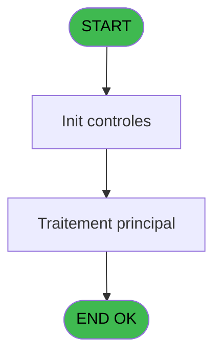
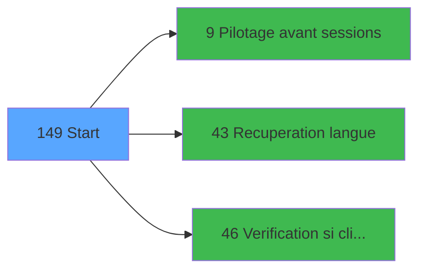

# VIL IDE 149 - Start

> **Analyse**: Phases 1-4 2026-02-03 09:43 -> 09:44 (18s) | Assemblage 09:44
> **Pipeline**: V7.2 Enrichi
> **Structure**: 4 onglets (Resume | Ecrans | Donnees | Connexions)

<!-- TAB:Resume -->

## 1. FICHE D'IDENTITE

| Attribut | Valeur |
|----------|--------|
| Projet | VIL |
| IDE Position | 149 |
| Nom Programme | Start |
| Fichier source | `Prg_149.xml` |
| Domaine metier | General |
| Taches | 4 (0 ecrans visibles) |
| Tables modifiees | 0 |
| Programmes appeles | 3 |

## 2. DESCRIPTION FONCTIONNELLE

**Start** assure la gestion complete de ce processus, accessible depuis [Main Program (IDE 1)](VIL-IDE-1.md).

Le flux de traitement s'organise en **1 blocs fonctionnels** :

- **Traitement** (4 taches) : traitements metier divers

Detail : phases du traitement

#### Phase 1 : Traitement (4 taches)

- **149** - Start
- **149.1** - Get Caisse Param
- **149.2** - N° term coffre2 v1
- **149.3** - N° term coffre2 v1

Delegue a : [Pilotage avant sessions (IDE 9)](VIL-IDE-9.md), [Recuperation langue (IDE 43)](VIL-IDE-43.md)

## 3. BLOCS FONCTIONNELS

### 3.1 Traitement (4 taches)

Traitements internes.

---

#### 149 - Start

**Role** : Traitement : Start.

3 sous-taches directes

| Tache | Nom | Bloc |
|-------|-----|------|
| [149.1](#t3) | Get Caisse Param | Traitement |
| [149.2](#t4) | N° term coffre2 v1 | Traitement |
| [149.3](#t7) | N° term coffre2 v1 | Traitement |

**Delegue a** : [Pilotage avant sessions (IDE 9)](VIL-IDE-9.md), [Recuperation langue (IDE 43)](VIL-IDE-43.md)

---

#### 149.1 - Get Caisse Param

**Role** : Consultation/chargement : Get Caisse Param.
**Delegue a** : [Pilotage avant sessions (IDE 9)](VIL-IDE-9.md), [Recuperation langue (IDE 43)](VIL-IDE-43.md)

---

#### 149.2 - N° term coffre2 v1

**Role** : Traitement : N° term coffre2 v1.
**Variables liees** : F (v.N° Term Coffre2), G (v.Hostname Coffre2), H (v.Host courant Coffre2 ?)
**Delegue a** : [Pilotage avant sessions (IDE 9)](VIL-IDE-9.md), [Recuperation langue (IDE 43)](VIL-IDE-43.md)

---

#### 149.3 - N° term coffre2 v1

**Role** : Traitement : N° term coffre2 v1.
**Variables liees** : F (v.N° Term Coffre2), G (v.Hostname Coffre2), H (v.Host courant Coffre2 ?)
**Delegue a** : [Pilotage avant sessions (IDE 9)](VIL-IDE-9.md), [Recuperation langue (IDE 43)](VIL-IDE-43.md)

## 5. REGLES METIER

*(Aucune regle metier identifiee)*

## 6. CONTEXTE

- **Appele par**: [Main Program (IDE 1)](VIL-IDE-1.md)
- **Appelle**: 3 programmes | **Tables**: 4 (W:0 R:3 L:1) | **Taches**: 4 | **Expressions**: 22

<!-- TAB:Ecrans -->

## 8. ECRANS

*(Programme sans ecran visible)*

## 9. NAVIGATION

### 9.3 Structure hierarchique (4 taches)

| Position | Tache | Type | Dimensions | Bloc |
|----------|-------|------|------------|------|
| **149.1** | [**Start** (149)](#t1) | MDI | - | Traitement |
| 149.1.1 | [Get Caisse Param (149.1)](#t3) | MDI | - | |
| 149.1.2 | [N° term coffre2 v1 (149.2)](#t4) | MDI | - | |
| 149.1.3 | [N° term coffre2 v1 (149.3)](#t7) | MDI | - | |

### 9.4 Algorigramme

> **Legende**: Vert = START/END OK | Rouge = END KO | Bleu = Decisions
> *Algorigramme auto-genere. Utiliser `/algorigramme` pour une synthese metier detaillee.*

<!-- TAB:Donnees -->

## 10. TABLES

### Tables utilisees (4)

| ID | Nom | Description | Type | R | W | L | Usages |
|----|-----|-------------|------|---|---|---|--------|
| 70 | date_comptable___dat |  | DB | R |   |   | 1 |
| 257 | numero_des_terminaux_ims |  | DB | R |   |   | 2 |
| 697 | droits_applications | Droits operateur | DB |   |   | L | 1 |
| 740 | pv_stock_movements | Articles et stock | DB | R |   |   | 1 |

### Colonnes par table (2 / 3 tables avec colonnes identifiees)

Table 70 - date_comptable___dat (R) - 1 usages

| Lettre | Variable | Acces | Type |
|--------|----------|-------|------|
| J | v.Date Comptable | R | Date |

Table 257 - numero_des_terminaux_ims (R) - 2 usages

*Table utilisee uniquement en Link ou aucune colonne Real identifiee dans le DataView.*

Table 740 - pv_stock_movements (R) - 1 usages

| Lettre | Variable | Acces | Type |
|--------|----------|-------|------|
| A | v.connection ? | R | Logical |
| B | v.FROM_ADH | R | Alpha |
| C | v.FROM_ADH_OS | R | Alpha |
| D | v.FROM_IMS_SA | R | Alpha |
| E | v.Cloture Auto | R | Alpha |
| F | v.N° Term Coffre2 | R | Numeric |
| G | v.Hostname Coffre2 | R | Unicode |
| H | v.Host courant Coffre2 ? | R | Logical |
| I | v.Fermeture Appli Interdite | R | Logical |
| J | v.Date Comptable | R | Date |

## 11. VARIABLES

### 11.1 Variables de session (10)

Variables persistantes pendant toute la session.

| Lettre | Nom | Type | Usage dans |
|--------|-----|------|-----------|
| A | v.connection ? | Logical | 2x session |
| B | v.FROM_ADH | Alpha | - |
| C | v.FROM_ADH_OS | Alpha | - |
| D | v.FROM_IMS_SA | Alpha | - |
| E | v.Cloture Auto | Alpha | 1x session |
| F | v.N° Term Coffre2 | Numeric | - |
| G | v.Hostname Coffre2 | Unicode | [149.2](#t4), [149.3](#t7) |
| H | v.Host courant Coffre2 ? | Logical | - |
| I | v.Fermeture Appli Interdite | Logical | - |
| J | v.Date Comptable | Date | - |

## 12. EXPRESSIONS

**22 / 22 expressions decodees (100%)**

### 12.1 Repartition par type

| Type | Expressions | Regles |
|------|-------------|--------|
| CONCATENATION | 1 | 0 |
| CALCULATION | 1 | 0 |
| CONSTANTE | 2 | 0 |
| CONDITION | 4 | 0 |
| OTHER | 3 | 0 |
| REFERENCE_VG | 3 | 0 |
| NEGATION | 6 | 0 |
| CAST_LOGIQUE | 2 | 0 |

### 12.2 Expressions cles par type

#### CONCATENATION (1 expressions)

| Type | IDE | Expression | Regle |
|------|-----|------------|-------|
| CONCATENATION | 9 | `'cmd /c mkdir '&Trim (INIGet ('[MAGIC_LOGICAL_NAMES]club_exportdata'))&'Cloture\Editions'` | - |

#### CALCULATION (1 expressions)

| Type | IDE | Expression | Regle |
|------|-----|------------|-------|
| CALCULATION | 11 | `'cmd /c mkdir '&Trim (VG61)` | - |

#### CONSTANTE (2 expressions)

| Type | IDE | Expression | Regle |
|------|-----|------------|-------|
| CONSTANTE | 18 | `'C'` | - |
| CONSTANTE | 15 | `'CV'` | - |

#### CONDITION (4 expressions)

| Type | IDE | Expression | Regle |
|------|-----|------------|-------|
| CONDITION | 14 | `Trim(INIGet ('[MAGIC_LOGICAL_NAMES]RunMode'))<>'B'` | - |
| CONDITION | 19 | `Trim([O])='GESTION' AND [U]='O'` | - |
| CONDITION | 8 | `v.Cloture Auto [E]='O' AND Date()>[X]` | - |
| CONDITION | 7 | `Trim(INIGet ('[MAGIC_LOGICAL_NAMES]RunMode'))='B'` | - |

#### OTHER (3 expressions)

| Type | IDE | Expression | Regle |
|------|-----|------------|-------|
| OTHER | 20 | `MnuShow('CORRE',(VG3 OR VG36) AND VG23)` | - |
| OTHER | 2 | `v.connection ? [A]` | - |
| OTHER | 1 | `SetParam ('VERIF_USERB','O')` | - |

#### REFERENCE_VG (3 expressions)

| Type | IDE | Expression | Regle |
|------|-----|------------|-------|
| REFERENCE_VG | 22 | `VG39` | - |
| REFERENCE_VG | 17 | `VG1` | - |
| REFERENCE_VG | 3 | `VG60` | - |

#### NEGATION (6 expressions)

| Type | IDE | Expression | Regle |
|------|-----|------------|-------|
| NEGATION | 21 | `NOT VG39` | - |
| NEGATION | 10 | `NOT (FileExist (Trim (INIGet ('[MAGIC_LOGICAL_NAMES]club_exportdata'))&'Cloture\Editions'))` | - |
| NEGATION | 12 | `NOT (FileExist (Trim (VG61)))` | - |
| NEGATION | 4 | `NOT (v.connection ? [A]) AND INIGet ('[MAGIC_LOGICAL_NAMES]RunMode')<>'B'` | - |
| NEGATION | 6 | `NOT (VG4) AND INIGet ('[MAGIC_LOGICAL_NAMES]RunMode')<>'B' AND NOT(IsComponent())` | - |
| ... | | *+1 autres* | |

#### CAST_LOGIQUE (2 expressions)

| Type | IDE | Expression | Regle |
|------|-----|------------|-------|
| CAST_LOGIQUE | 16 | `MnuShow('REMONTECI',IF([O]='INFORMATICIEN','TRUE'LOG,'FALSE'LOG))` | - |
| CAST_LOGIQUE | 5 | `INIPut ('[MAGIC_LOGICAL_NAMES]club_user='&VG1,'FALSE'LOG)` | - |

### 12.3 Toutes les expressions (22)

Voir les 22 expressions

#### CONCATENATION (1)

| IDE | Expression Decodee |
|-----|-------------------|
| 9 | `'cmd /c mkdir '&Trim (INIGet ('[MAGIC_LOGICAL_NAMES]club_exportdata'))&'Cloture\Editions'` |

#### CALCULATION (1)

| IDE | Expression Decodee |
|-----|-------------------|
| 11 | `'cmd /c mkdir '&Trim (VG61)` |

#### CONSTANTE (2)

| IDE | Expression Decodee |
|-----|-------------------|
| 15 | `'CV'` |
| 18 | `'C'` |

#### CONDITION (4)

| IDE | Expression Decodee |
|-----|-------------------|
| 8 | `v.Cloture Auto [E]='O' AND Date()>[X]` |
| 7 | `Trim(INIGet ('[MAGIC_LOGICAL_NAMES]RunMode'))='B'` |
| 14 | `Trim(INIGet ('[MAGIC_LOGICAL_NAMES]RunMode'))<>'B'` |
| 19 | `Trim([O])='GESTION' AND [U]='O'` |

#### OTHER (3)

| IDE | Expression Decodee |
|-----|-------------------|
| 1 | `SetParam ('VERIF_USERB','O')` |
| 2 | `v.connection ? [A]` |
| 20 | `MnuShow('CORRE',(VG3 OR VG36) AND VG23)` |

#### REFERENCE_VG (3)

| IDE | Expression Decodee |
|-----|-------------------|
| 3 | `VG60` |
| 17 | `VG1` |
| 22 | `VG39` |

#### NEGATION (6)

| IDE | Expression Decodee |
|-----|-------------------|
| 4 | `NOT (v.connection ? [A]) AND INIGet ('[MAGIC_LOGICAL_NAMES]RunMode')<>'B'` |
| 6 | `NOT (VG4) AND INIGet ('[MAGIC_LOGICAL_NAMES]RunMode')<>'B' AND NOT(IsComponent())` |
| 13 | `NOT (v.Hostname Coffre2 [G])` |
| 21 | `NOT VG39` |
| 10 | `NOT (FileExist (Trim (INIGet ('[MAGIC_LOGICAL_NAMES]club_exportdata'))&'Cloture\Editions'))` |
| 12 | `NOT (FileExist (Trim (VG61)))` |

#### CAST_LOGIQUE (2)

| IDE | Expression Decodee |
|-----|-------------------|
| 5 | `INIPut ('[MAGIC_LOGICAL_NAMES]club_user='&VG1,'FALSE'LOG)` |
| 16 | `MnuShow('REMONTECI',IF([O]='INFORMATICIEN','TRUE'LOG,'FALSE'LOG))` |

<!-- TAB:Connexions -->

## 13. GRAPHE D'APPELS

### 13.1 Chaine depuis Main (Callers)

Main -> ... -> [Main Program (IDE 1)](VIL-IDE-1.md) -> **Start (IDE 149)**

### 13.2 Callers

| IDE | Nom Programme | Nb Appels |
|-----|---------------|-----------|
| [1](VIL-IDE-1.md) | Main Program | 1 |

### 13.3 Callees (programmes appeles)

### 13.4 Detail Callees avec contexte

| IDE | Nom Programme | Appels | Contexte |
|-----|---------------|--------|----------|
| [9](VIL-IDE-9.md) | Pilotage avant sessions | 1 | Gestion session |
| [43](VIL-IDE-43.md) | Recuperation langue | 1 | Recuperation donnees |
| [46](VIL-IDE-46.md) | Verification si client/serveur | 1 | Controle/validation |

## 14. RECOMMANDATIONS MIGRATION

### 14.1 Profil du programme

| Metrique | Valeur | Impact migration |
|----------|--------|-----------------|
| Lignes de logique | 76 | Programme compact |
| Expressions | 22 | Peu de logique |
| Tables WRITE | 0 | Impact faible |
| Sous-programmes | 3 | Peu de dependances |
| Ecrans visibles | 0 | Ecran unique ou traitement batch |
| Code desactive | 0% (0 / 76) | Code sain |
| Regles metier | 0 | Pas de regle identifiee |

### 14.2 Plan de migration par bloc

#### Traitement (4 taches: 0 ecran, 4 traitements)

- **Strategie** : 4 service(s) backend injectable(s) (Domain Services).
- 3 sous-programme(s) a migrer ou a reutiliser depuis les services existants.
- Decomposer les taches en services unitaires testables.

### 14.3 Dependances critiques

| Dependance | Type | Appels | Impact |
|------------|------|--------|--------|
| [Verification si client/serveur (IDE 46)](VIL-IDE-46.md) | Sous-programme | 1x | Normale - Controle/validation |
| [Recuperation langue (IDE 43)](VIL-IDE-43.md) | Sous-programme | 1x | Normale - Recuperation donnees |
| [Pilotage avant sessions (IDE 9)](VIL-IDE-9.md) | Sous-programme | 1x | Normale - Gestion session |

---
*Spec DETAILED generee par Pipeline V7.2 - 2026-02-03 09:44*
