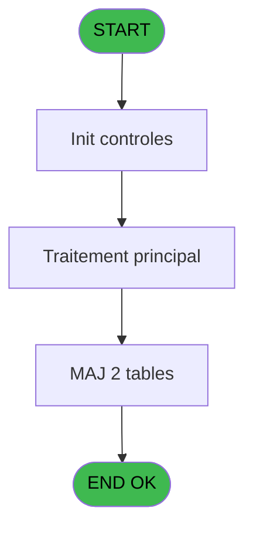

# VIL IDE 15 - Create Bck Files

> **Analyse**: Phases 1-4 2026-02-03 01:01 -> 01:02 (39s) | Assemblage 01:02
> **Pipeline**: V7.2 Enrichi
> **Structure**: 4 onglets (Resume | Ecrans | Donnees | Connexions)

<!-- TAB:Resume -->

## 1. FICHE D'IDENTITE

| Attribut | Valeur |
|----------|--------|
| Projet | VIL |
| IDE Position | 15 |
| Nom Programme | Create Bck Files |
| Fichier source | `Prg_15.xml` |
| Domaine metier | General |
| Taches | 6 (0 ecrans visibles) |
| Tables modifiees | 2 |
| Programmes appeles | 0 |

## 2. DESCRIPTION FONCTIONNELLE

**Create Bck Files** assure la gestion complete de ce processus, accessible depuis [Pilotage après sessions (IDE 10)](VIL-IDE-10.md).

Le flux de traitement s'organise en **2 blocs fonctionnels** :

- **Traitement** (3 taches) : traitements metier divers
- **Creation** (3 taches) : insertion d'enregistrements en base (mouvements, prestations)

**Donnees modifiees** : 2 tables en ecriture (backup_compte_gm__cgm, backup_histo_sessions_caisse).

Detail : phases du traitement

#### Phase 1 : Creation (3 taches)

- **15** - Create Bck Files
- **15.1** - Create Bck Cafil25
- **15.2.1** - Create Bck Cafil25

#### Phase 2 : Traitement (3 taches)

- **15.1.1** - Purge - 8
- **15.2** - Read User
- **15.2.2** - Purge - 8

#### Tables impactees

| Table | Operations | Role metier |
|-------|-----------|-------------|
| backup_compte_gm__cgm | **W**/L (2 usages) | Comptes GM (generaux) |
| backup_histo_sessions_caisse | **W**/L (2 usages) | Sessions de caisse |

## 3. BLOCS FONCTIONNELS

### 3.1 Creation (3 taches)

Insertion de nouveaux enregistrements en base.

---

#### 15 - Create Bck Files

**Role** : Traitement : Create Bck Files.

---

#### 15.1 - Create Bck Cafil25

**Role** : Traitement : Create Bck Cafil25.

---

#### 15.2.1 - Create Bck Cafil25

**Role** : Traitement : Create Bck Cafil25.

### 3.2 Traitement (3 taches)

Traitements internes.

---

#### 15.1.1 - Purge - 8

**Role** : Traitement : Purge - 8.

---

#### 15.2 - Read User

**Role** : Traitement : Read User.

---

#### 15.2.2 - Purge - 8

**Role** : Traitement : Purge - 8.

## 5. REGLES METIER

*(Aucune regle metier identifiee)*

## 6. CONTEXTE

- **Appele par**: [Pilotage après sessions (IDE 10)](VIL-IDE-10.md)
- **Appelle**: 0 programmes | **Tables**: 4 (W:2 R:2 L:2) | **Taches**: 6 | **Expressions**: 15

<!-- TAB:Ecrans -->

## 8. ECRANS

*(Programme sans ecran visible)*

## 9. NAVIGATION

### 9.3 Structure hierarchique (6 taches)

| Position | Tache | Type | Dimensions | Bloc |
|----------|-------|------|------------|------|
| **15.1** | [**Create Bck Files** (15)](#t1) | MDI | - | Creation |
| 15.1.1 | [Create Bck Cafil25 (15.1)](#t2) | MDI | - | |
| 15.1.2 | [Create Bck Cafil25 (15.2.1)](#t5) | MDI | - | |
| **15.2** | [**Purge - 8** (15.1.1)](#t3) | MDI | - | Traitement |
| 15.2.1 | [Read User (15.2)](#t4) | MDI | - | |
| 15.2.2 | [Purge - 8 (15.2.2)](#t6) | MDI | - | |

### 9.4 Algorigramme

> **Legende**: Vert = START/END OK | Rouge = END KO | Bleu = Decisions
> *Algorigramme auto-genere. Utiliser `/algorigramme` pour une synthese metier detaillee.*

<!-- TAB:Donnees -->

## 10. TABLES

### Tables utilisees (4)

| ID | Nom | Description | Type | R | W | L | Usages |
|----|-----|-------------|------|---|---|---|--------|
| 16 | backup_compte_gm__cgm | Comptes GM (generaux) | DB |   | **W** | L | 2 |
| 18 | backup_histo_sessions_caisse | Sessions de caisse | DB |   | **W** | L | 2 |
| 47 | compte_gm________cgm | Comptes GM (generaux) | DB | R |   |   | 1 |
| 246 | histo_sessions_caisse | Sessions de caisse | DB | R |   |   | 2 |

### Colonnes par table (0 / 4 tables avec colonnes identifiees)

Table 16 - backup_compte_gm__cgm (**W**/L) - 2 usages

*Table utilisee uniquement en Link ou aucune colonne Real identifiee dans le DataView.*

Table 18 - backup_histo_sessions_caisse (**W**/L) - 2 usages

*Table utilisee uniquement en Link ou aucune colonne Real identifiee dans le DataView.*

Table 47 - compte_gm________cgm (R) - 1 usages

*Table utilisee uniquement en Link ou aucune colonne Real identifiee dans le DataView.*

Table 246 - histo_sessions_caisse (R) - 2 usages

*Table utilisee uniquement en Link ou aucune colonne Real identifiee dans le DataView.*

## 11. VARIABLES

*(Programme sans variables locales mappees)*

## 12. EXPRESSIONS

**15 / 15 expressions decodees (100%)**

### 12.1 Repartition par type

| Type | Expressions | Regles |
|------|-------------|--------|
| OTHER | 15 | 0 |

### 12.2 Expressions cles par type

#### OTHER (15 expressions)

| Type | IDE | Expression | Regle |
|------|-----|------------|-------|
| OTHER | 11 | `[J]` | - |
| OTHER | 10 | `[I]` | - |
| OTHER | 9 | `[H]` | - |
| OTHER | 12 | `[K]` | - |
| OTHER | 15 | `[N]` | - |
| ... | | *+10 autres* | |

<!-- TAB:Connexions -->

## 13. GRAPHE D'APPELS

### 13.1 Chaine depuis Main (Callers)

Main -> ... -> [Pilotage après sessions (IDE 10)](VIL-IDE-10.md) -> **Create Bck Files (IDE 15)**

### 13.2 Callers

| IDE | Nom Programme | Nb Appels |
|-----|---------------|-----------|
| [10](VIL-IDE-10.md) | Pilotage après sessions | 1 |

### 13.3 Callees (programmes appeles)

### 13.4 Detail Callees avec contexte

| IDE | Nom Programme | Appels | Contexte |
|-----|---------------|--------|----------|
| - | (aucun) | - | - |

## 14. RECOMMANDATIONS MIGRATION

### 14.1 Profil du programme

| Metrique | Valeur | Impact migration |
|----------|--------|-----------------|
| Lignes de logique | 68 | Programme compact |
| Expressions | 15 | Peu de logique |
| Tables WRITE | 2 | Impact faible |
| Sous-programmes | 0 | Peu de dependances |
| Ecrans visibles | 0 | Ecran unique ou traitement batch |
| Code desactive | 0% (0 / 68) | Code sain |
| Regles metier | 0 | Pas de regle identifiee |

### 14.2 Plan de migration par bloc

#### Creation (3 taches: 0 ecran, 3 traitements)

- **Strategie** : Repository pattern avec Entity Framework Core.
- Insertion via `IRepository<T>.CreateAsync()`

#### Traitement (3 taches: 0 ecran, 3 traitements)

- **Strategie** : 3 service(s) backend injectable(s) (Domain Services).
- Decomposer les taches en services unitaires testables.

### 14.3 Dependances critiques

| Dependance | Type | Appels | Impact |
|------------|------|--------|--------|
| backup_compte_gm__cgm | Table WRITE (Database) | 1x | Schema + repository |
| backup_histo_sessions_caisse | Table WRITE (Database) | 1x | Schema + repository |

---
*Spec DETAILED generee par Pipeline V7.2 - 2026-02-03 01:02*
