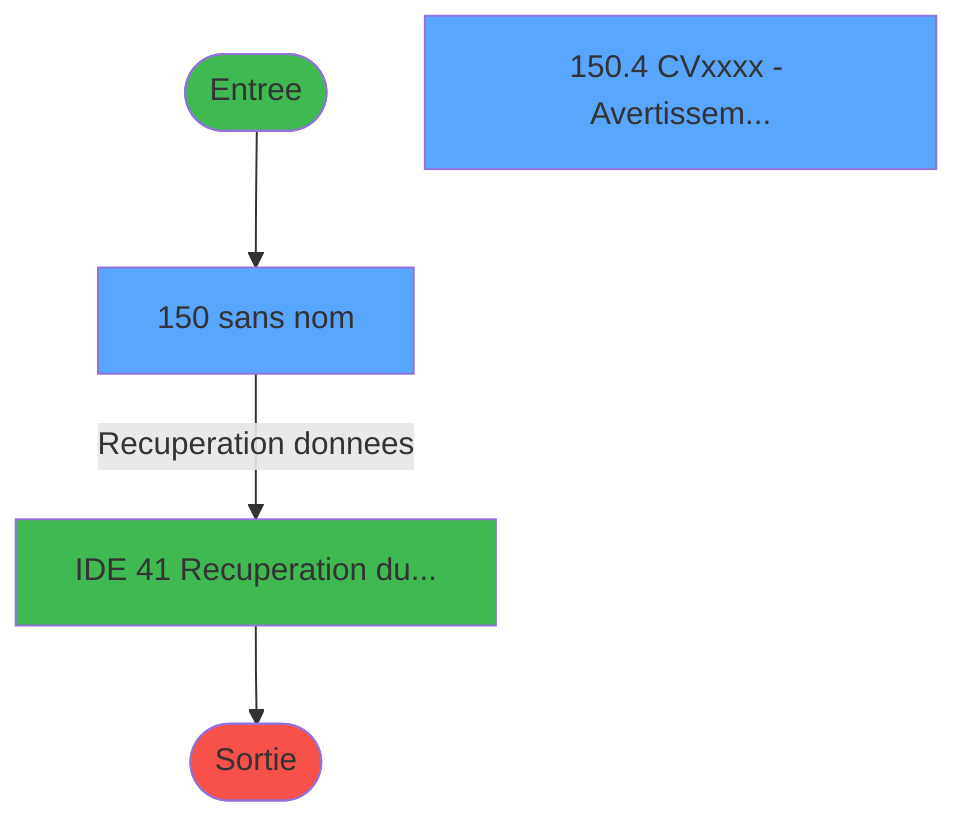
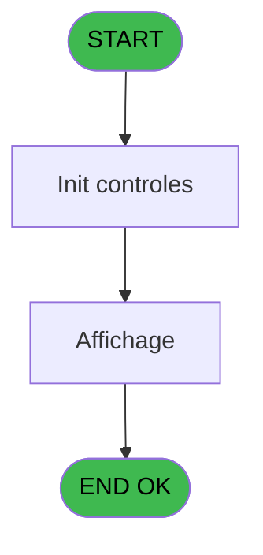
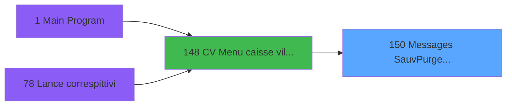

# VIL IDE 150 - Messages Sauv/Purge/Teleph

> **Analyse**: Phases 1-4 2026-02-03 09:44 -> 09:44 (18s) | Assemblage 09:44
> **Pipeline**: V7.2 Enrichi
> **Structure**: 4 onglets (Resume | Ecrans | Donnees | Connexions)

<!-- TAB:Resume -->

## 1. FICHE D'IDENTITE

| Attribut | Valeur |
|----------|--------|
| Projet | VIL |
| IDE Position | 150 |
| Nom Programme | Messages Sauv/Purge/Teleph |
| Fichier source | `Prg_150.xml` |
| Domaine metier | General |
| Taches | 5 (2 ecrans visibles) |
| Tables modifiees | 0 |
| Programmes appeles | 1 |

## 2. DESCRIPTION FONCTIONNELLE

**Messages Sauv/Purge/Teleph** assure la gestion complete de ce processus, accessible depuis [CV  Menu caisse village (IDE 148)](VIL-IDE-148.md).

Le flux de traitement s'organise en **1 blocs fonctionnels** :

- **Traitement** (5 taches) : traitements metier divers

**Logique metier** : 1 regles identifiees couvrant valeurs par defaut.

Detail : phases du traitement

#### Phase 1 : Traitement (5 taches)

- **150** - (sans nom) **[[ECRAN]](#ecran-t1)**
- **150.1** - Lecture Table Sauvegarde
- **150.2** - Lecture Table purge
- **150.3** - Lecture Table telephone
- **150.4** - CVxxxx - Avertissements **[[ECRAN]](#ecran-t5)**

Delegue a : [Recuperation du titre (IDE 41)](VIL-IDE-41.md)

## 3. BLOCS FONCTIONNELS

### 3.1 Traitement (5 taches)

Traitements internes.

---

#### 150 - (sans nom) [[ECRAN]](#ecran-t1)

**Role** : Traitement interne.
**Ecran** : 1014 x 262 DLU (MDI) | [Voir mockup](#ecran-t1)

4 sous-taches directes

| Tache | Nom | Bloc |
|-------|-----|------|
| [150.1](#t2) | Lecture Table Sauvegarde | Traitement |
| [150.2](#t3) | Lecture Table purge | Traitement |
| [150.3](#t4) | Lecture Table telephone | Traitement |
| [150.4](#t5) | CVxxxx - Avertissements **[[ECRAN]](#ecran-t5)** | Traitement |

**Delegue a** : [Recuperation du titre (IDE 41)](VIL-IDE-41.md)

---

#### 150.1 - Lecture Table Sauvegarde

**Role** : Traitement : Lecture Table Sauvegarde.
**Variables liees** : B (V Afficher message sauvegarde)
**Delegue a** : [Recuperation du titre (IDE 41)](VIL-IDE-41.md)

---

#### 150.2 - Lecture Table purge

**Role** : Traitement : Lecture Table purge.
**Variables liees** : C (V Afficher message purge), F (V Der date purge)
**Delegue a** : [Recuperation du titre (IDE 41)](VIL-IDE-41.md)

---

#### 150.3 - Lecture Table telephone

**Role** : Traitement : Lecture Table telephone.
**Variables liees** : D (V Afficher message telephone), G (V Der date cloture telephone)
**Delegue a** : [Recuperation du titre (IDE 41)](VIL-IDE-41.md)

---

#### 150.4 - CVxxxx - Avertissements [[ECRAN]](#ecran-t5)

**Role** : Traitement : CVxxxx - Avertissements.
**Ecran** : 1014 x 262 DLU (MDI) | [Voir mockup](#ecran-t5)
**Delegue a** : [Recuperation du titre (IDE 41)](VIL-IDE-41.md)

## 5. REGLES METIER

1 regles identifiees:

### Autres (1 regles)

#### [RM-001] Valeur par defaut si P0 Societe [A] est vide

| Element | Detail |
|---------|--------|
| **Condition** | `P0 Societe [A]=''` |
| **Si vrai** | 'C' |
| **Si faux** | P0 Societe [A]) |
| **Variables** | A (P0 Societe) |
| **Expression source** | Expression 3 : `IF (P0 Societe [A]='','C',P0 Societe [A])` |
| **Exemple** | Si P0 Societe [A]='' → 'C'. Sinon → P0 Societe [A]) |

## 6. CONTEXTE

- **Appele par**: [CV  Menu caisse village (IDE 148)](VIL-IDE-148.md)
- **Appelle**: 1 programmes | **Tables**: 3 (W:0 R:3 L:0) | **Taches**: 5 | **Expressions**: 4

<!-- TAB:Ecrans -->

## 8. ECRANS

### 8.1 Forms visibles (2 / 5)

| # | Position | Tache | Nom | Type | Largeur | Hauteur | Bloc |
|---|----------|-------|-----|------|---------|---------|------|
| 1 | 150 | 150 | (sans nom) | MDI | 1014 | 262 | Traitement |
| 2 | 150.4 | 150.4 | CVxxxx - Avertissements | MDI | 1014 | 262 | Traitement |

### 8.2 Mockups Ecrans

---

#### 150 - (sans nom)
**Tache** : [150](#t1) | **Type** : MDI | **Dimensions** : 1014 x 262 DLU
**Bloc** : Traitement | **Titre IDE** : (sans nom)

<!-- FORM-DATA:
{
    "width":  1014,
    "vFactor":  8,
    "type":  "MDI",
    "hFactor":  8,
    "controls":  [
                     {
                         "x":  912,
                         "type":  "image",
                         "var":  "",
                         "y":  10,
                         "w":  76,
                         "fmt":  "",
                         "name":  "",
                         "h":  28,
                         "color":  "",
                         "text":  "",
                         "parent":  null
                     }
                 ],
    "taskId":  "150",
    "height":  262
}
-->

---

#### 150.4 - CVxxxx - Avertissements
**Tache** : [150.4](#t5) | **Type** : MDI | **Dimensions** : 1014 x 262 DLU
**Bloc** : Traitement | **Titre IDE** : CVxxxx - Avertissements

<!-- FORM-DATA:
{
    "width":  1014,
    "vFactor":  8,
    "type":  "MDI",
    "hFactor":  8,
    "controls":  [
                     {
                         "x":  106,
                         "type":  "edit",
                         "var":  "",
                         "y":  78,
                         "w":  800,
                         "fmt":  "",
                         "name":  "",
                         "h":  16,
                         "color":  "144",
                         "text":  "",
                         "parent":  null
                     },
                     {
                         "x":  106,
                         "type":  "edit",
                         "var":  "",
                         "y":  118,
                         "w":  800,
                         "fmt":  "",
                         "name":  "",
                         "h":  16,
                         "color":  "144",
                         "text":  "",
                         "parent":  null
                     },
                     {
                         "x":  106,
                         "type":  "edit",
                         "var":  "",
                         "y":  158,
                         "w":  800,
                         "fmt":  "",
                         "name":  "",
                         "h":  16,
                         "color":  "144",
                         "text":  "",
                         "parent":  null
                     },
                     {
                         "x":  406,
                         "type":  "button",
                         "var":  "",
                         "y":  224,
                         "w":  200,
                         "fmt":  "\u0026Quitter",
                         "name":  "Bouton Quitter",
                         "h":  16,
                         "color":  "",
                         "text":  "",
                         "parent":  null
                     },
                     {
                         "x":  912,
                         "type":  "image",
                         "var":  "",
                         "y":  10,
                         "w":  76,
                         "fmt":  "",
                         "name":  "",
                         "h":  28,
                         "color":  "",
                         "text":  "",
                         "parent":  null
                     }
                 ],
    "taskId":  "150.4",
    "height":  262
}
-->

<strong>Champs : 3 champs</strong>

| Pos (x,y) | Nom | Variable | Type |
|-----------|-----|----------|------|
| 106,78 | (sans nom) | - | edit |
| 106,118 | (sans nom) | - | edit |
| 106,158 | (sans nom) | - | edit |

<strong>Boutons : 1 boutons</strong>

| Bouton | Pos (x,y) | Action |
|--------|-----------|--------|
| Quitter | 406,224 | Quitte le programme |

## 9. NAVIGATION

### 9.1 Enchainement des ecrans

**Detail par enchainement :**

| Depuis | Action | Vers | Retour |
|--------|--------|------|--------|
|  | Recuperation donnees | [Recuperation du titre (IDE 41)](VIL-IDE-41.md) | Retour ecran |

### 9.3 Structure hierarchique (5 taches)

| Position | Tache | Type | Dimensions | Bloc |
|----------|-------|------|------------|------|
| **150.1** | [**(sans nom)** (150)](#t1) [mockup](#ecran-t1) | MDI | 1014x262 | Traitement |
| 150.1.1 | [Lecture Table Sauvegarde (150.1)](#t2) | MDI | - | |
| 150.1.2 | [Lecture Table purge (150.2)](#t3) | MDI | - | |
| 150.1.3 | [Lecture Table telephone (150.3)](#t4) | MDI | - | |
| 150.1.4 | [CVxxxx - Avertissements (150.4)](#t5) [mockup](#ecran-t5) | MDI | 1014x262 | |

### 9.4 Algorigramme

> **Legende**: Vert = START/END OK | Rouge = END KO | Bleu = Decisions
> *Algorigramme auto-genere. Utiliser `/algorigramme` pour une synthese metier detaillee.*

<!-- TAB:Donnees -->

## 10. TABLES

### Tables utilisees (3)

| ID | Nom | Description | Type | R | W | L | Usages |
|----|-----|-------------|------|---|---|---|--------|
| 61 | recette_telephonerte |  | DB | R |   |   | 1 |
| 71 | derniere_purge___pur |  | DB | R |   |   | 1 |
| 283 | derniere_sauvegarde |  | DB | R |   |   | 1 |

### Colonnes par table (2 / 3 tables avec colonnes identifiees)

Table 61 - recette_telephonerte (R) - 1 usages

*Table utilisee uniquement en Link ou aucune colonne Real identifiee dans le DataView.*

Table 71 - derniere_purge___pur (R) - 1 usages

| Lettre | Variable | Acces | Type |
|--------|----------|-------|------|
| C | V Afficher message purge | R | Logical |
| F | V Der date purge | R | Date |

Table 283 - derniere_sauvegarde (R) - 1 usages

| Lettre | Variable | Acces | Type |
|--------|----------|-------|------|
| B | V Afficher message sauvegarde | R | Logical |

## 11. VARIABLES

### 11.1 Parametres entrants (1)

Variables recues du programme appelant ([CV  Menu caisse village (IDE 148)](VIL-IDE-148.md)).

| Lettre | Nom | Type | Usage dans |
|--------|-----|------|-----------|
| A | P0 Societe | Alpha | 1x parametre entrant |

### 11.2 Variables de session (6)

Variables persistantes pendant toute la session.

| Lettre | Nom | Type | Usage dans |
|--------|-----|------|-----------|
| B | V Afficher message sauvegarde | Logical | - |
| C | V Afficher message purge | Logical | [150.2](#t3) |
| D | V Afficher message telephone | Logical | - |
| E | V Der date sauveg | Date | - |
| F | V Der date purge | Date | - |
| G | V Der date cloture telephone | Date | - |

## 12. EXPRESSIONS

**4 / 4 expressions decodees (100%)**

### 12.1 Repartition par type

| Type | Expressions | Regles |
|------|-------------|--------|
| CALCULATION | 1 | 0 |
| CONDITION | 1 | 5 |
| CAST_LOGIQUE | 1 | 0 |
| OTHER | 1 | 0 |

### 12.2 Expressions cles par type

#### CALCULATION (1 expressions)

| Type | IDE | Expression | Regle |
|------|-----|------------|-------|
| CALCULATION | 2 | `'00/00/0000'DATE` | - |

#### CONDITION (1 expressions)

| Type | IDE | Expression | Regle |
|------|-----|------------|-------|
| CONDITION | 3 | `IF (P0 Societe [A]='','C',P0 Societe [A])` | [RM-001](#rm-RM-001) |

#### CAST_LOGIQUE (1 expressions)

| Type | IDE | Expression | Regle |
|------|-----|------------|-------|
| CAST_LOGIQUE | 1 | `'FALSE'LOG` | - |

#### OTHER (1 expressions)

| Type | IDE | Expression | Regle |
|------|-----|------------|-------|
| OTHER | 4 | `V Afficher message sau... [B] OR V Afficher message purge [C] OR V Afficher message tel... [D]` | - |

<!-- TAB:Connexions -->

## 13. GRAPHE D'APPELS

### 13.1 Chaine depuis Main (Callers)

Main -> ... -> [CV  Menu caisse village (IDE 148)](VIL-IDE-148.md) -> **Messages Sauv/Purge/Teleph (IDE 150)**

### 13.2 Callers

| IDE | Nom Programme | Nb Appels |
|-----|---------------|-----------|
| [148](VIL-IDE-148.md) | CV  Menu caisse village | 1 |

### 13.3 Callees (programmes appeles)

### 13.4 Detail Callees avec contexte

| IDE | Nom Programme | Appels | Contexte |
|-----|---------------|--------|----------|
| [41](VIL-IDE-41.md) | Recuperation du titre | 1 | Recuperation donnees |

## 14. RECOMMANDATIONS MIGRATION

### 14.1 Profil du programme

| Metrique | Valeur | Impact migration |
|----------|--------|-----------------|
| Lignes de logique | 62 | Programme compact |
| Expressions | 4 | Peu de logique |
| Tables WRITE | 0 | Impact faible |
| Sous-programmes | 1 | Peu de dependances |
| Ecrans visibles | 2 | Quelques ecrans |
| Code desactive | 0% (0 / 62) | Code sain |
| Regles metier | 1 | Quelques regles a preserver |

### 14.2 Plan de migration par bloc

#### Traitement (5 taches: 2 ecrans, 3 traitements)

- **Strategie** : Orchestrateur avec 2 ecrans (Razor/React) et 3 traitements backend (services).
- Les ecrans deviennent des composants UI, les traitements invisibles deviennent des services injectables.
- 1 sous-programme(s) a migrer ou a reutiliser depuis les services existants.
- Decomposer les taches en services unitaires testables.

### 14.3 Dependances critiques

| Dependance | Type | Appels | Impact |
|------------|------|--------|--------|
| [Recuperation du titre (IDE 41)](VIL-IDE-41.md) | Sous-programme | 1x | Normale - Recuperation donnees |

---
*Spec DETAILED generee par Pipeline V7.2 - 2026-02-03 09:44*
