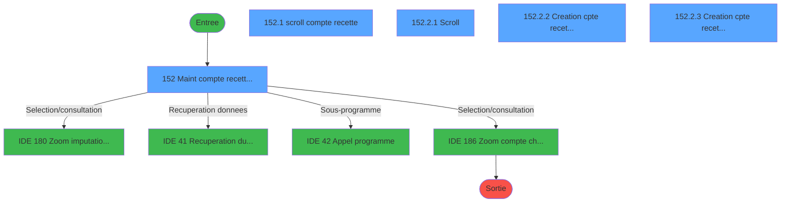
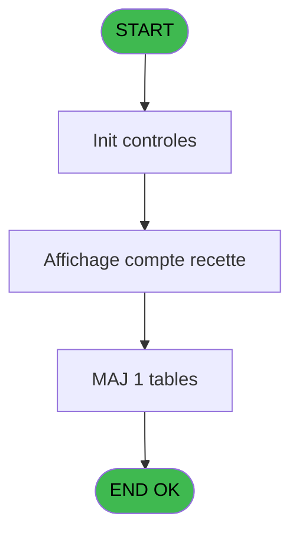
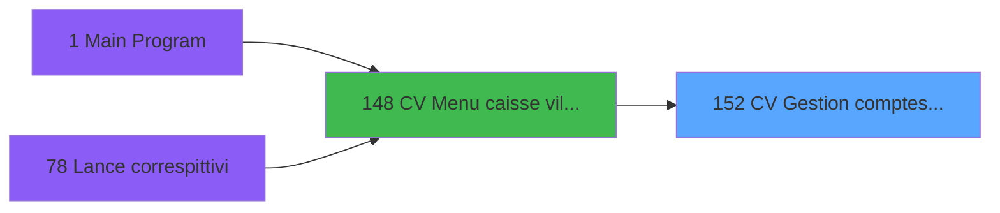
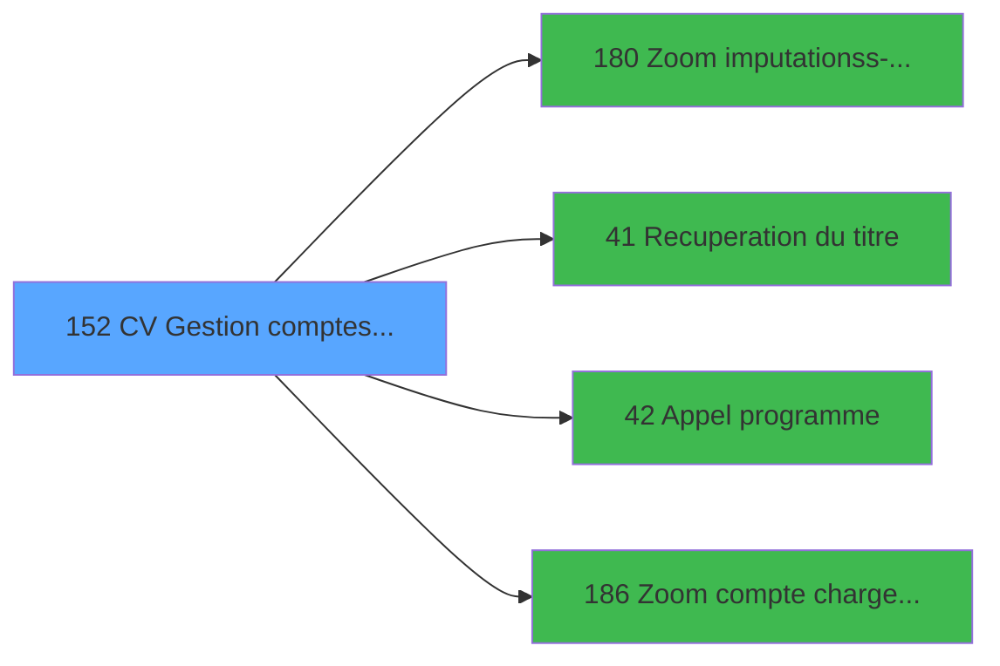

# VIL IDE 152 - CV  Gestion comptes recette

> **Analyse**: Phases 1-4 2026-02-03 09:45 -> 09:45 (19s) | Assemblage 09:45
> **Pipeline**: V7.2 Enrichi
> **Structure**: 4 onglets (Resume | Ecrans | Donnees | Connexions)

<!-- TAB:Resume -->

## 1. FICHE D'IDENTITE

| Attribut | Valeur |
|----------|--------|
| Projet | VIL |
| IDE Position | 152 |
| Nom Programme | CV  Gestion comptes recette |
| Fichier source | `Prg_152.xml` |
| Domaine metier | Comptabilite |
| Taches | 11 (5 ecrans visibles) |
| Tables modifiees | 1 |
| Programmes appeles | 4 |

## 2. DESCRIPTION FONCTIONNELLE

**CV  Gestion comptes recette** assure la gestion complete de ce processus, accessible depuis [CV  Menu caisse village (IDE 148)](VIL-IDE-148.md).

Le flux de traitement s'organise en **4 blocs fonctionnels** :

- **Calcul** (6 taches) : calculs de montants, stocks ou compteurs
- **Traitement** (2 taches) : traitements metier divers
- **Creation** (2 taches) : insertion d'enregistrements en base (mouvements, prestations)
- **Consultation** (1 tache) : ecrans de recherche, selection et consultation

**Donnees modifiees** : 1 tables en ecriture (comptes_recette__cre).

Detail : phases du traitement

#### Phase 1 : Calcul (6 taches)

- **152** - Maint compte recette/depense **[[ECRAN]](#ecran-t1)**
- **152.1** - scroll compte recette **[[ECRAN]](#ecran-t2)**
- **152.2.2.1** - creation compte recette
- **152.2.3.1** - creation compte recette
- **152.2.4** - creation compte recette/depens **[[ECRAN]](#ecran-t11)**
- **152.2.4.1** - suppression d'un compte

Delegue a : [Zoom compte charge 246 (IDE 186)](VIL-IDE-186.md)

#### Phase 2 : Consultation (1 tache)

- **152.2** - Choix **[[ECRAN]](#ecran-t3)**

Delegue a : [Zoom imputation/ss-imputation (IDE 180)](VIL-IDE-180.md), [Recuperation du titre (IDE 41)](VIL-IDE-41.md), [Zoom compte charge 246 (IDE 186)](VIL-IDE-186.md)

#### Phase 3 : Traitement (2 taches)

- **152.2.1** - Scroll **[[ECRAN]](#ecran-t4)**
- **152.2.4.2** - Scroll **[[ECRAN]](#ecran-t14)**

Delegue a : [Recuperation du titre (IDE 41)](VIL-IDE-41.md), [Appel programme (IDE 42)](VIL-IDE-42.md)

#### Phase 4 : Creation (2 taches)

- **152.2.2** - Creation cpte recette/depense **[[ECRAN]](#ecran-t7)**
- **152.2.3** - Creation cpte recette/depense **[[ECRAN]](#ecran-t9)**

#### Tables impactees

| Table | Operations | Role metier |
|-------|-----------|-------------|
| comptes_recette__cre | R/**W** (8 usages) | Comptes GM (generaux) |

## 3. BLOCS FONCTIONNELS

### 3.1 Calcul (6 taches)

Calculs metier : montants, stocks, compteurs.

---

#### 152 - Maint compte recette/depense [[ECRAN]](#ecran-t1)

**Role** : Tache d'orchestration : point d'entree du programme (6 sous-taches). Coordonne l'enchainement des traitements.
**Ecran** : 1110 x 204 DLU (MDI) | [Voir mockup](#ecran-t1)

5 sous-taches directes

| Tache | Nom | Bloc |
|-------|-----|------|
| [152.1](#t2) | scroll compte recette **[[ECRAN]](#ecran-t2)** | Calcul |
| [152.2.2.1](#t8) | creation compte recette | Calcul |
| [152.2.3.1](#t10) | creation compte recette | Calcul |
| [152.2.4](#t11) | creation compte recette/depens **[[ECRAN]](#ecran-t11)** | Calcul |
| [152.2.4.1](#t12) | suppression d'un compte | Calcul |

**Delegue a** : [Zoom compte charge 246 (IDE 186)](VIL-IDE-186.md)

---

#### 152.1 - scroll compte recette [[ECRAN]](#ecran-t2)

**Role** : Traitement : scroll compte recette.
**Ecran** : 459 x 123 DLU (MDI) | [Voir mockup](#ecran-t2)
**Delegue a** : [Zoom compte charge 246 (IDE 186)](VIL-IDE-186.md)

---

#### 152.2.2.1 - creation compte recette

**Role** : Creation d'enregistrement : creation compte recette.
**Delegue a** : [Zoom compte charge 246 (IDE 186)](VIL-IDE-186.md)

---

#### 152.2.3.1 - creation compte recette

**Role** : Creation d'enregistrement : creation compte recette.
**Delegue a** : [Zoom compte charge 246 (IDE 186)](VIL-IDE-186.md)

---

#### 152.2.4 - creation compte recette/depens [[ECRAN]](#ecran-t11)

**Role** : Creation d'enregistrement : creation compte recette/depens.
**Ecran** : 536 x 97 DLU (MDI) | [Voir mockup](#ecran-t11)
**Delegue a** : [Zoom compte charge 246 (IDE 186)](VIL-IDE-186.md)

---

#### 152.2.4.1 - suppression d'un compte

**Role** : Traitement : suppression d'un compte.
**Delegue a** : [Zoom compte charge 246 (IDE 186)](VIL-IDE-186.md)

### 3.2 Consultation (1 tache)

Ecrans de recherche et consultation.

---

#### 152.2 - Choix [[ECRAN]](#ecran-t3)

**Role** : Selection par l'operateur : Choix.
**Ecran** : 190 x 34 DLU (MDI) | [Voir mockup](#ecran-t3)
**Delegue a** : [Zoom imputation/ss-imputation (IDE 180)](VIL-IDE-180.md)

### 3.3 Traitement (2 taches)

Traitements internes.

---

#### 152.2.1 - Scroll [[ECRAN]](#ecran-t4)

**Role** : Traitement : Scroll.
**Ecran** : 520 x 223 DLU (MDI) | [Voir mockup](#ecran-t4)
**Delegue a** : [Recuperation du titre (IDE 41)](VIL-IDE-41.md), [Appel programme (IDE 42)](VIL-IDE-42.md)

---

#### 152.2.4.2 - Scroll [[ECRAN]](#ecran-t14)

**Role** : Traitement : Scroll.
**Ecran** : 520 x 220 DLU (MDI) | [Voir mockup](#ecran-t14)
**Delegue a** : [Recuperation du titre (IDE 41)](VIL-IDE-41.md), [Appel programme (IDE 42)](VIL-IDE-42.md)

### 3.4 Creation (2 taches)

Insertion de nouveaux enregistrements en base.

---

#### 152.2.2 - Creation cpte recette/depense [[ECRAN]](#ecran-t7)

**Role** : Creation d'enregistrement : Creation cpte recette/depense.
**Ecran** : 536 x 74 DLU (MDI) | [Voir mockup](#ecran-t7)

---

#### 152.2.3 - Creation cpte recette/depense [[ECRAN]](#ecran-t9)

**Role** : Creation d'enregistrement : Creation cpte recette/depense.
**Ecran** : 536 x 92 DLU (MDI) | [Voir mockup](#ecran-t9)

## 5. REGLES METIER

*(Aucune regle metier identifiee)*

## 6. CONTEXTE

- **Appele par**: [CV  Menu caisse village (IDE 148)](VIL-IDE-148.md)
- **Appelle**: 4 programmes | **Tables**: 5 (W:1 R:3 L:2) | **Taches**: 11 | **Expressions**: 8

<!-- TAB:Ecrans -->

## 8. ECRANS

### 8.1 Forms visibles (5 / 11)

| # | Position | Tache | Nom | Type | Largeur | Hauteur | Bloc |
|---|----------|-------|-----|------|---------|---------|------|
| 1 | 152 | 152 | Maint compte recette/depense | MDI | 1110 | 204 | Calcul |
| 2 | 152.1 | 152.1 | scroll compte recette | MDI | 459 | 123 | Calcul |
| 3 | 152.2.1 | 152.2.1 | Scroll | MDI | 520 | 223 | Traitement |
| 4 | 152.2.2 | 152.2.2 | Creation cpte recette/depense | MDI | 536 | 74 | Creation |
| 5 | 152.2.3 | 152.2.3 | Creation cpte recette/depense | MDI | 536 | 92 | Creation |

### 8.2 Mockups Ecrans

---

#### 152 - Maint compte recette/depense
**Tache** : [152](#t1) | **Type** : MDI | **Dimensions** : 1110 x 204 DLU
**Bloc** : Calcul | **Titre IDE** : Maint compte recette/depense

<!-- FORM-DATA:
{
    "width":  1110,
    "vFactor":  8,
    "type":  "MDI",
    "hFactor":  8,
    "controls":  [
                     {
                         "x":  0,
                         "type":  "label",
                         "var":  "",
                         "y":  0,
                         "w":  1107,
                         "fmt":  "",
                         "name":  "",
                         "h":  17,
                         "color":  "",
                         "text":  "",
                         "parent":  null
                     },
                     {
                         "x":  37,
                         "type":  "label",
                         "var":  "",
                         "y":  23,
                         "w":  1027,
                         "fmt":  "",
                         "name":  "",
                         "h":  139,
                         "color":  "",
                         "text":  "",
                         "parent":  null
                     },
                     {
                         "x":  53,
                         "type":  "table",
                         "var":  "",
                         "name":  "",
                         "titleH":  12,
                         "color":  "110",
                         "w":  422,
                         "y":  32,
                         "fmt":  "",
                         "parent":  null,
                         "text":  "",
                         "rowH":  17,
                         "h":  122,
                         "cols":  [
                                      {
                                          "title":  "Services du village",
                                          "layer":  1,
                                          "w":  389
                                      }
                                  ],
                         "rows":  1
                     },
                     {
                         "x":  0,
                         "type":  "label",
                         "var":  "",
                         "y":  179,
                         "w":  1107,
                         "fmt":  "",
                         "name":  "",
                         "h":  24,
                         "color":  "",
                         "text":  "",
                         "parent":  null
                     },
                     {
                         "x":  391,
                         "type":  "button",
                         "var":  "",
                         "y":  45,
                         "w":  48,
                         "fmt":  "\u003e\u003e\u003e",
                         "name":  "Bouton selection",
                         "h":  16,
                         "color":  "",
                         "text":  "",
                         "parent":  5
                     },
                     {
                         "x":  64,
                         "type":  "edit",
                         "var":  "",
                         "y":  49,
                         "w":  64,
                         "fmt":  "",
                         "name":  "TAB code alpha5",
                         "h":  8,
                         "color":  "110",
                         "text":  "",
                         "parent":  5
                     },
                     {
                         "x":  135,
                         "type":  "edit",
                         "var":  "",
                         "y":  49,
                         "w":  232,
                         "fmt":  "",
                         "name":  "",
                         "h":  8,
                         "color":  "110",
                         "text":  "",
                         "parent":  5
                     },
                     {
                         "x":  11,
                         "type":  "edit",
                         "var":  "",
                         "y":  3,
                         "w":  395,
                         "fmt":  "30",
                         "name":  "",
                         "h":  8,
                         "color":  "",
                         "text":  "",
                         "parent":  1
                     },
                     {
                         "x":  832,
                         "type":  "edit",
                         "var":  "",
                         "y":  4,
                         "w":  267,
                         "fmt":  "WWW DD MMM YYYYT",
                         "name":  "",
                         "h":  8,
                         "color":  "",
                         "text":  "",
                         "parent":  1
                     },
                     {
                         "x":  7,
                         "type":  "button",
                         "var":  "",
                         "y":  182,
                         "w":  160,
                         "fmt":  "\u0026Quitter",
                         "name":  "",
                         "h":  18,
                         "color":  "",
                         "text":  "",
                         "parent":  null
                     },
                     {
                         "x":  583,
                         "type":  "subform",
                         "var":  "",
                         "y":  26,
                         "w":  472,
                         "fmt":  "",
                         "name":  "Affichage compte recette",
                         "h":  132,
                         "color":  "",
                         "text":  "",
                         "parent":  null
                     }
                 ],
    "taskId":  "152",
    "height":  204
}
-->

<strong>Champs : 4 champs</strong>

| Pos (x,y) | Nom | Variable | Type |
|-----------|-----|----------|------|
| 64,49 | TAB code alpha5 | - | edit |
| 135,49 | (sans nom) | - | edit |
| 11,3 | 30 | - | edit |
| 832,4 | WWW DD MMM YYYYT | - | edit |

<strong>Boutons : 2 boutons</strong>

| Bouton | Pos (x,y) | Action |
|--------|-----------|--------|
| >>> | 391,45 | Bouton fonctionnel |
| Quitter | 7,182 | Quitte le programme |

---

#### 152.1 - scroll compte recette
**Tache** : [152.1](#t2) | **Type** : MDI | **Dimensions** : 459 x 123 DLU
**Bloc** : Calcul | **Titre IDE** : scroll compte recette

<!-- FORM-DATA:
{
    "width":  459,
    "vFactor":  8,
    "type":  "MDI",
    "hFactor":  8,
    "controls":  [
                     {
                         "x":  6,
                         "type":  "label",
                         "var":  "",
                         "y":  0,
                         "w":  432,
                         "fmt":  "",
                         "name":  "",
                         "h":  10,
                         "color":  "7",
                         "text":  "Comptes de recette",
                         "parent":  null
                     },
                     {
                         "x":  6,
                         "type":  "table",
                         "var":  "",
                         "name":  "",
                         "titleH":  12,
                         "color":  "110",
                         "w":  441,
                         "y":  11,
                         "fmt":  "",
                         "parent":  null,
                         "text":  "",
                         "rowH":  13,
                         "h":  109,
                         "cols":  [
                                      {
                                          "title":  "Imputation",
                                          "layer":  1,
                                          "w":  216
                                      },
                                      {
                                          "title":  "Libellé",
                                          "layer":  2,
                                          "w":  190
                                      }
                                  ],
                         "rows":  2
                     },
                     {
                         "x":  17,
                         "type":  "edit",
                         "var":  "",
                         "y":  27,
                         "w":  120,
                         "fmt":  "",
                         "name":  "",
                         "h":  8,
                         "color":  "110",
                         "text":  "",
                         "parent":  2
                     },
                     {
                         "x":  175,
                         "type":  "edit",
                         "var":  "",
                         "y":  27,
                         "w":  42,
                         "fmt":  "",
                         "name":  "",
                         "h":  8,
                         "color":  "110",
                         "text":  "",
                         "parent":  2
                     },
                     {
                         "x":  232,
                         "type":  "edit",
                         "var":  "",
                         "y":  27,
                         "w":  176,
                         "fmt":  "",
                         "name":  "",
                         "h":  8,
                         "color":  "110",
                         "text":  "",
                         "parent":  2
                     },
                     {
                         "x":  143,
                         "type":  "edit",
                         "var":  "",
                         "y":  27,
                         "w":  19,
                         "fmt":  "1",
                         "name":  "",
                         "h":  8,
                         "color":  "110",
                         "text":  "",
                         "parent":  2
                     }
                 ],
    "taskId":  "152.1",
    "height":  123
}
-->

<strong>Champs : 4 champs</strong>

| Pos (x,y) | Nom | Variable | Type |
|-----------|-----|----------|------|
| 17,27 | (sans nom) | - | edit |
| 175,27 | (sans nom) | - | edit |
| 232,27 | (sans nom) | - | edit |
| 143,27 | 1 | - | edit |

---

#### 152.2.1 - Scroll
**Tache** : [152.2.1](#t4) | **Type** : MDI | **Dimensions** : 520 x 223 DLU
**Bloc** : Traitement | **Titre IDE** : Scroll

<!-- FORM-DATA:
{
    "width":  520,
    "vFactor":  8,
    "type":  "MDI",
    "hFactor":  8,
    "controls":  [
                     {
                         "x":  2,
                         "type":  "label",
                         "var":  "",
                         "y":  2,
                         "w":  516,
                         "fmt":  "",
                         "name":  "",
                         "h":  186,
                         "color":  "",
                         "text":  "",
                         "parent":  null
                     },
                     {
                         "x":  37,
                         "type":  "table",
                         "var":  "",
                         "name":  "",
                         "titleH":  12,
                         "color":  "110",
                         "w":  444,
                         "y":  6,
                         "fmt":  "",
                         "parent":  null,
                         "text":  "",
                         "rowH":  12,
                         "h":  100,
                         "cols":  [
                                      {
                                          "title":  "Imputation",
                                          "layer":  1,
                                          "w":  216
                                      },
                                      {
                                          "title":  "Libellé",
                                          "layer":  2,
                                          "w":  195
                                      }
                                  ],
                         "rows":  2
                     },
                     {
                         "x":  13,
                         "type":  "label",
                         "var":  "",
                         "y":  111,
                         "w":  495,
                         "fmt":  "",
                         "name":  "",
                         "h":  73,
                         "color":  "",
                         "text":  "",
                         "parent":  null
                     },
                     {
                         "x":  16,
                         "type":  "label",
                         "var":  "",
                         "y":  112,
                         "w":  489,
                         "fmt":  "",
                         "name":  "",
                         "h":  71,
                         "color":  "",
                         "text":  "",
                         "parent":  null
                     },
                     {
                         "x":  198,
                         "type":  "label",
                         "var":  "",
                         "y":  119,
                         "w":  246,
                         "fmt":  "",
                         "name":  "",
                         "h":  45,
                         "color":  "",
                         "text":  "",
                         "parent":  null
                     },
                     {
                         "x":  200,
                         "type":  "label",
                         "var":  "",
                         "y":  120,
                         "w":  66,
                         "fmt":  "",
                         "name":  "",
                         "h":  43,
                         "color":  "",
                         "text":  "",
                         "parent":  null
                     },
                     {
                         "x":  282,
                         "type":  "label",
                         "var":  "",
                         "y":  123,
                         "w":  133,
                         "fmt":  "",
                         "name":  "",
                         "h":  8,
                         "color":  "7",
                         "text":  "Modification",
                         "parent":  null
                     },
                     {
                         "x":  282,
                         "type":  "label",
                         "var":  "",
                         "y":  136,
                         "w":  133,
                         "fmt":  "",
                         "name":  "",
                         "h":  8,
                         "color":  "7",
                         "text":  "Création",
                         "parent":  null
                     },
                     {
                         "x":  282,
                         "type":  "label",
                         "var":  "",
                         "y":  149,
                         "w":  133,
                         "fmt":  "",
                         "name":  "",
                         "h":  8,
                         "color":  "7",
                         "text":  "Suppression",
                         "parent":  null
                     },
                     {
                         "x":  208,
                         "type":  "label",
                         "var":  "",
                         "y":  168,
                         "w":  194,
                         "fmt":  "",
                         "name":  "",
                         "h":  10,
                         "color":  "",
                         "text":  "Choix de l\u0027action",
                         "parent":  null
                     },
                     {
                         "x":  0,
                         "type":  "label",
                         "var":  "",
                         "y":  197,
                         "w":  518,
                         "fmt":  "",
                         "name":  "",
                         "h":  24,
                         "color":  "",
                         "text":  "",
                         "parent":  null
                     },
                     {
                         "x":  48,
                         "type":  "edit",
                         "var":  "",
                         "y":  21,
                         "w":  120,
                         "fmt":  "",
                         "name":  "",
                         "h":  8,
                         "color":  "110",
                         "text":  "",
                         "parent":  2
                     },
                     {
                         "x":  200,
                         "type":  "edit",
                         "var":  "",
                         "y":  21,
                         "w":  42,
                         "fmt":  "",
                         "name":  "",
                         "h":  8,
                         "color":  "110",
                         "text":  "",
                         "parent":  2
                     },
                     {
                         "x":  264,
                         "type":  "edit",
                         "var":  "",
                         "y":  21,
                         "w":  176,
                         "fmt":  "",
                         "name":  "",
                         "h":  8,
                         "color":  "110",
                         "text":  "",
                         "parent":  2
                     },
                     {
                         "x":  413,
                         "type":  "edit",
                         "var":  "",
                         "y":  168,
                         "w":  26,
                         "fmt":  "",
                         "name":  "",
                         "h":  10,
                         "color":  "6",
                         "text":  "",
                         "parent":  null
                     },
                     {
                         "x":  24,
                         "type":  "image",
                         "var":  "",
                         "y":  117,
                         "w":  142,
                         "fmt":  "",
                         "name":  "",
                         "h":  60,
                         "color":  "",
                         "text":  "",
                         "parent":  null
                     },
                     {
                         "x":  219,
                         "type":  "button",
                         "var":  "",
                         "y":  122,
                         "w":  28,
                         "fmt":  "M",
                         "name":  "M",
                         "h":  9,
                         "color":  "",
                         "text":  "",
                         "parent":  null
                     },
                     {
                         "x":  219,
                         "type":  "button",
                         "var":  "",
                         "y":  135,
                         "w":  28,
                         "fmt":  "C",
                         "name":  "C",
                         "h":  9,
                         "color":  "",
                         "text":  "",
                         "parent":  null
                     },
                     {
                         "x":  219,
                         "type":  "button",
                         "var":  "",
                         "y":  149,
                         "w":  28,
                         "fmt":  "S",
                         "name":  "S",
                         "h":  9,
                         "color":  "",
                         "text":  "",
                         "parent":  null
                     },
                     {
                         "x":  8,
                         "type":  "button",
                         "var":  "",
                         "y":  200,
                         "w":  157,
                         "fmt":  "\u0026Quitter",
                         "name":  "",
                         "h":  18,
                         "color":  "",
                         "text":  "",
                         "parent":  null
                     },
                     {
                         "x":  176,
                         "type":  "edit",
                         "var":  "",
                         "y":  21,
                         "w":  19,
                         "fmt":  "1",
                         "name":  "",
                         "h":  8,
                         "color":  "110",
                         "text":  "",
                         "parent":  2
                     }
                 ],
    "taskId":  "152.2.1",
    "height":  223
}
-->

<strong>Champs : 5 champs</strong>

| Pos (x,y) | Nom | Variable | Type |
|-----------|-----|----------|------|
| 48,21 | (sans nom) | - | edit |
| 200,21 | (sans nom) | - | edit |
| 264,21 | (sans nom) | - | edit |
| 413,168 | (sans nom) | - | edit |
| 176,21 | 1 | - | edit |

<strong>Boutons : 4 boutons</strong>

| Bouton | Pos (x,y) | Action |
|--------|-----------|--------|
| M | 219,122 | Bouton fonctionnel |
| C | 219,135 | Bouton fonctionnel |
| S | 219,149 | Bouton fonctionnel |
| Quitter | 8,200 | Quitte le programme |

---

#### 152.2.2 - Creation cpte recette/depense
**Tache** : [152.2.2](#t7) | **Type** : MDI | **Dimensions** : 536 x 74 DLU
**Bloc** : Creation | **Titre IDE** : Creation cpte recette/depense

<!-- FORM-DATA:
{
    "width":  536,
    "vFactor":  8,
    "type":  "MDI",
    "hFactor":  8,
    "controls":  [
                     {
                         "x":  42,
                         "type":  "label",
                         "var":  "",
                         "y":  7,
                         "w":  452,
                         "fmt":  "",
                         "name":  "",
                         "h":  36,
                         "color":  "",
                         "text":  "",
                         "parent":  null
                     },
                     {
                         "x":  101,
                         "type":  "label",
                         "var":  "",
                         "y":  14,
                         "w":  80,
                         "fmt":  "",
                         "name":  "",
                         "h":  8,
                         "color":  "",
                         "text":  "Imputation",
                         "parent":  null
                     },
                     {
                         "x":  336,
                         "type":  "label",
                         "var":  "",
                         "y":  14,
                         "w":  104,
                         "fmt":  "",
                         "name":  "",
                         "h":  8,
                         "color":  "",
                         "text":  "Libellé",
                         "parent":  null
                     },
                     {
                         "x":  0,
                         "type":  "label",
                         "var":  "",
                         "y":  48,
                         "w":  536,
                         "fmt":  "",
                         "name":  "",
                         "h":  24,
                         "color":  "",
                         "text":  "",
                         "parent":  null
                     },
                     {
                         "x":  77,
                         "type":  "edit",
                         "var":  "",
                         "y":  27,
                         "w":  126,
                         "fmt":  "",
                         "name":  "W2 imputation",
                         "h":  10,
                         "color":  "6",
                         "text":  "",
                         "parent":  null
                     },
                     {
                         "x":  211,
                         "type":  "edit",
                         "var":  "",
                         "y":  27,
                         "w":  48,
                         "fmt":  "",
                         "name":  "W2 ss-imputation",
                         "h":  10,
                         "color":  "6",
                         "text":  "",
                         "parent":  null
                     },
                     {
                         "x":  277,
                         "type":  "edit",
                         "var":  "",
                         "y":  27,
                         "w":  182,
                         "fmt":  "",
                         "name":  "W2 libelle",
                         "h":  10,
                         "color":  "6",
                         "text":  "",
                         "parent":  null
                     },
                     {
                         "x":  7,
                         "type":  "button",
                         "var":  "",
                         "y":  51,
                         "w":  160,
                         "fmt":  "\u0026Ok",
                         "name":  "Bouton OK",
                         "h":  18,
                         "color":  "",
                         "text":  "",
                         "parent":  null
                     },
                     {
                         "x":  174,
                         "type":  "button",
                         "var":  "",
                         "y":  51,
                         "w":  160,
                         "fmt":  "A\u0026bandonner",
                         "name":  "",
                         "h":  18,
                         "color":  "",
                         "text":  "",
                         "parent":  null
                     }
                 ],
    "taskId":  "152.2.2",
    "height":  74
}
-->

<strong>Champs : 3 champs</strong>

| Pos (x,y) | Nom | Variable | Type |
|-----------|-----|----------|------|
| 77,27 | W2 imputation | - | edit |
| 211,27 | W2 ss-imputation | - | edit |
| 277,27 | W2 libelle | - | edit |

<strong>Boutons : 2 boutons</strong>

| Bouton | Pos (x,y) | Action |
|--------|-----------|--------|
| Ok | 7,51 | Valide la saisie et enregistre |
| Abandonner | 174,51 | Annule et retour au menu |

---

#### 152.2.3 - Creation cpte recette/depense
**Tache** : [152.2.3](#t9) | **Type** : MDI | **Dimensions** : 536 x 92 DLU
**Bloc** : Creation | **Titre IDE** : Creation cpte recette/depense

<!-- FORM-DATA:
{
    "width":  536,
    "vFactor":  8,
    "type":  "MDI",
    "hFactor":  8,
    "controls":  [
                     {
                         "x":  42,
                         "type":  "label",
                         "var":  "",
                         "y":  7,
                         "w":  452,
                         "fmt":  "",
                         "name":  "",
                         "h":  53,
                         "color":  "",
                         "text":  "",
                         "parent":  null
                     },
                     {
                         "x":  101,
                         "type":  "label",
                         "var":  "",
                         "y":  32,
                         "w":  80,
                         "fmt":  "",
                         "name":  "",
                         "h":  8,
                         "color":  "",
                         "text":  "Imputation",
                         "parent":  null
                     },
                     {
                         "x":  336,
                         "type":  "label",
                         "var":  "",
                         "y":  32,
                         "w":  104,
                         "fmt":  "",
                         "name":  "",
                         "h":  8,
                         "color":  "",
                         "text":  "Libellé",
                         "parent":  null
                     },
                     {
                         "x":  0,
                         "type":  "label",
                         "var":  "",
                         "y":  68,
                         "w":  536,
                         "fmt":  "",
                         "name":  "",
                         "h":  24,
                         "color":  "",
                         "text":  "",
                         "parent":  null
                     },
                     {
                         "x":  82,
                         "type":  "checkbox",
                         "var":  "",
                         "y":  14,
                         "w":  246,
                         "fmt":  "",
                         "name":  "W2 compte de charge",
                         "h":  12,
                         "color":  "",
                         "text":  " Compte de charge",
                         "parent":  1
                     },
                     {
                         "x":  77,
                         "type":  "edit",
                         "var":  "",
                         "y":  45,
                         "w":  126,
                         "fmt":  "",
                         "name":  "W2 imputation",
                         "h":  10,
                         "color":  "6",
                         "text":  "",
                         "parent":  null
                     },
                     {
                         "x":  211,
                         "type":  "edit",
                         "var":  "",
                         "y":  45,
                         "w":  48,
                         "fmt":  "",
                         "name":  "W2 ss-imputation",
                         "h":  10,
                         "color":  "6",
                         "text":  "",
                         "parent":  null
                     },
                     {
                         "x":  277,
                         "type":  "edit",
                         "var":  "",
                         "y":  45,
                         "w":  182,
                         "fmt":  "",
                         "name":  "W2 libelle",
                         "h":  10,
                         "color":  "6",
                         "text":  "",
                         "parent":  null
                     },
                     {
                         "x":  7,
                         "type":  "button",
                         "var":  "",
                         "y":  71,
                         "w":  160,
                         "fmt":  "\u0026Ok",
                         "name":  "Bouton OK",
                         "h":  18,
                         "color":  "",
                         "text":  "",
                         "parent":  null
                     },
                     {
                         "x":  174,
                         "type":  "button",
                         "var":  "",
                         "y":  71,
                         "w":  160,
                         "fmt":  "\u0026Abandonner",
                         "name":  "",
                         "h":  18,
                         "color":  "",
                         "text":  "",
                         "parent":  null
                     }
                 ],
    "taskId":  "152.2.3",
    "height":  92
}
-->

<strong>Champs : 4 champs</strong>

| Pos (x,y) | Nom | Variable | Type |
|-----------|-----|----------|------|
| 82,14 | W2 compte de charge | - | checkbox |
| 77,45 | W2 imputation | - | edit |
| 211,45 | W2 ss-imputation | - | edit |
| 277,45 | W2 libelle | - | edit |

<strong>Boutons : 2 boutons</strong>

| Bouton | Pos (x,y) | Action |
|--------|-----------|--------|
| Ok | 7,71 | Valide la saisie et enregistre |
| Abandonner | 174,71 | Annule et retour au menu |

## 9. NAVIGATION

### 9.1 Enchainement des ecrans

**Detail par enchainement :**

| Depuis | Action | Vers | Retour |
|--------|--------|------|--------|
| Maint compte recette/depense | Selection/consultation | [Zoom imputation/ss-imputation (IDE 180)](VIL-IDE-180.md) | Retour ecran |
| Maint compte recette/depense | Recuperation donnees | [Recuperation du titre (IDE 41)](VIL-IDE-41.md) | Retour ecran |
| Maint compte recette/depense | Sous-programme | [Appel programme (IDE 42)](VIL-IDE-42.md) | Retour ecran |
| Maint compte recette/depense | Selection/consultation | [Zoom compte charge 246 (IDE 186)](VIL-IDE-186.md) | Retour ecran |

### 9.3 Structure hierarchique (11 taches)

| Position | Tache | Type | Dimensions | Bloc |
|----------|-------|------|------------|------|
| **152.1** | [**Maint compte recette/depense** (152)](#t1) [mockup](#ecran-t1) | MDI | 1110x204 | Calcul |
| 152.1.1 | [scroll compte recette (152.1)](#t2) [mockup](#ecran-t2) | MDI | 459x123 | |
| 152.1.2 | [creation compte recette (152.2.2.1)](#t8) | MDI | - | |
| 152.1.3 | [creation compte recette (152.2.3.1)](#t10) | MDI | - | |
| 152.1.4 | [creation compte recette/depens (152.2.4)](#t11) [mockup](#ecran-t11) | MDI | 536x97 | |
| 152.1.5 | [suppression d'un compte (152.2.4.1)](#t12) | MDI | - | |
| **152.2** | [**Choix** (152.2)](#t3) [mockup](#ecran-t3) | MDI | 190x34 | Consultation |
| **152.3** | [**Scroll** (152.2.1)](#t4) [mockup](#ecran-t4) | MDI | 520x223 | Traitement |
| 152.3.1 | [Scroll (152.2.4.2)](#t14) [mockup](#ecran-t14) | MDI | 520x220 | |
| **152.4** | [**Creation cpte recette/depense** (152.2.2)](#t7) [mockup](#ecran-t7) | MDI | 536x74 | Creation |
| 152.4.1 | [Creation cpte recette/depense (152.2.3)](#t9) [mockup](#ecran-t9) | MDI | 536x92 | |

### 9.4 Algorigramme

> **Legende**: Vert = START/END OK | Rouge = END KO | Bleu = Decisions
> *Algorigramme auto-genere. Utiliser `/algorigramme` pour une synthese metier detaillee.*

<!-- TAB:Donnees -->

## 10. TABLES

### Tables utilisees (5)

| ID | Nom | Description | Type | R | W | L | Usages |
|----|-----|-------------|------|---|---|---|--------|
| 65 | comptes_recette__cre | Comptes GM (generaux) | DB | R | **W** |   | 8 |
| 67 | tables___________tab |  | DB | R |   |   | 1 |
| 77 | articles_________art | Articles et stock | DB |   |   | L | 1 |
| 212 | qualif_service_centralise | Services / filieres | DB | R |   |   | 1 |
| 226 | comptes_charge | Comptes GM (generaux) | DB |   |   | L | 1 |

### Colonnes par table (4 / 3 tables avec colonnes identifiees)

Table 65 - comptes_recette__cre (R/**W**) - 8 usages

| Lettre | Variable | Acces | Type |
|--------|----------|-------|------|
| A | Code Service | W | Alpha |
| B | W2 ret lien art | W | Numeric |
| C | v. passage CP | W | Logical |
| D | W2 choix action | W | Alpha |
| E | W2 libelle | W | Alpha |
| F | W2 validation | W | Alpha |
| G | Bouton OK | W | Alpha |
| H | W2 validation | W | Alpha |
| I | Bouton OK | W | Alpha |

Table 67 - tables___________tab (R) - 1 usages

| Lettre | Variable | Acces | Type |
|--------|----------|-------|------|
| A | Bouton selection | R | Alpha |
| B | >v.titre | R | Alpha |

Table 212 - qualif_service_centralise (R) - 1 usages

| Lettre | Variable | Acces | Type |
|--------|----------|-------|------|
| A | W1 choix action | R | Alpha |
| B | W1 pas enreg | R | Alpha |
| C | W1 imputation | R | Numeric |
| D | W1 sous-imputation | R | Numeric |
| E | W1 libelle | R | Alpha |

## 11. VARIABLES

### 11.1 Autres (9)

Variables diverses.

| Lettre | Nom | Type | Usage dans |
|--------|-----|------|-----------|
| A | Bouton selection | Alpha | - |
| B | >v.titre | Alpha | - |
| C | W1 imputation | Numeric | - |
| D | W1 sous-imputation | Numeric | - |
| E | W1 libelle | Alpha | - |
| F | W2 validation | Alpha | - |
| G | Bouton OK | Alpha | 1x refs |
| H | W2 validation | Alpha | - |
| I | Bouton OK | Alpha | 1x refs |

## 12. EXPRESSIONS

**8 / 8 expressions decodees (100%)**

### 12.1 Repartition par type

| Type | Expressions | Regles |
|------|-------------|--------|
| CONSTANTE | 5 | 0 |
| DATE | 1 | 0 |
| REFERENCE_VG | 1 | 0 |
| STRING | 1 | 0 |

### 12.2 Expressions cles par type

#### CONSTANTE (5 expressions)

| Type | IDE | Expression | Regle |
|------|-----|------------|-------|
| CONSTANTE | 7 | `'O'` | - |
| CONSTANTE | 8 | `'Affichage compte recette'` | - |
| CONSTANTE | 6 | `'VSERV'` | - |
| CONSTANTE | 1 | `'>>>'` | - |
| CONSTANTE | 5 | `116` | - |

#### DATE (1 expressions)

| Type | IDE | Expression | Regle |
|------|-----|------------|-------|
| DATE | 2 | `Date ()` | - |

#### REFERENCE_VG (1 expressions)

| Type | IDE | Expression | Regle |
|------|-----|------------|-------|
| REFERENCE_VG | 3 | `VG2` | - |

#### STRING (1 expressions)

| Type | IDE | Expression | Regle |
|------|-----|------------|-------|
| STRING | 4 | `Trim (Bouton OK [G])` | - |

<!-- TAB:Connexions -->

## 13. GRAPHE D'APPELS

### 13.1 Chaine depuis Main (Callers)

Main -> ... -> [CV  Menu caisse village (IDE 148)](VIL-IDE-148.md) -> **CV  Gestion comptes recette (IDE 152)**

### 13.2 Callers

| IDE | Nom Programme | Nb Appels |
|-----|---------------|-----------|
| [148](VIL-IDE-148.md) | CV  Menu caisse village | 1 |

### 13.3 Callees (programmes appeles)

### 13.4 Detail Callees avec contexte

| IDE | Nom Programme | Appels | Contexte |
|-----|---------------|--------|----------|
| [180](VIL-IDE-180.md) | Zoom imputation/ss-imputation | 2 | Selection/consultation |
| [41](VIL-IDE-41.md) | Recuperation du titre | 1 | Recuperation donnees |
| [42](VIL-IDE-42.md) | Appel programme | 1 | Sous-programme |
| [186](VIL-IDE-186.md) | Zoom compte charge 246 | 1 | Selection/consultation |

## 14. RECOMMANDATIONS MIGRATION

### 14.1 Profil du programme

| Metrique | Valeur | Impact migration |
|----------|--------|-----------------|
| Lignes de logique | 213 | Taille moyenne |
| Expressions | 8 | Peu de logique |
| Tables WRITE | 1 | Impact faible |
| Sous-programmes | 4 | Peu de dependances |
| Ecrans visibles | 5 | Quelques ecrans |
| Code desactive | 0% (0 / 213) | Code sain |
| Regles metier | 0 | Pas de regle identifiee |

### 14.2 Plan de migration par bloc

#### Calcul (6 taches: 3 ecrans, 3 traitements)

- **Strategie** : Services de calcul purs (Domain Services).
- Migrer la logique de calcul (stock, compteurs, montants)

#### Consultation (1 tache: 1 ecran, 0 traitement)

- **Strategie** : Composants de recherche/selection en modales.
- 1 ecran : Choix

#### Traitement (2 taches: 2 ecrans, 0 traitement)

- **Strategie** : 2 composant(s) UI (Razor/React) avec formulaires et validation.
- 4 sous-programme(s) a migrer ou a reutiliser depuis les services existants.
- Decomposer les taches en services unitaires testables.

#### Creation (2 taches: 2 ecrans, 0 traitement)

- **Strategie** : Repository pattern avec Entity Framework Core.
- Insertion via `IRepository<T>.CreateAsync()`

### 14.3 Dependances critiques

| Dependance | Type | Appels | Impact |
|------------|------|--------|--------|
| comptes_recette__cre | Table WRITE (Database) | 3x | Schema + repository |
| [Zoom imputation/ss-imputation (IDE 180)](VIL-IDE-180.md) | Sous-programme | 2x | Haute - Selection/consultation |
| [Zoom compte charge 246 (IDE 186)](VIL-IDE-186.md) | Sous-programme | 1x | Normale - Selection/consultation |
| [Appel programme (IDE 42)](VIL-IDE-42.md) | Sous-programme | 1x | Normale - Sous-programme |
| [Recuperation du titre (IDE 41)](VIL-IDE-41.md) | Sous-programme | 1x | Normale - Recuperation donnees |

---
*Spec DETAILED generee par Pipeline V7.2 - 2026-02-03 09:45*
