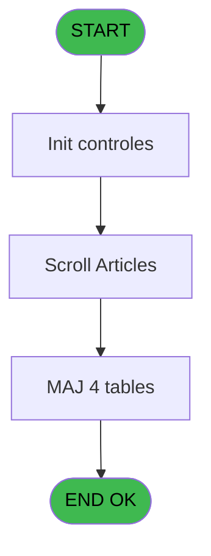
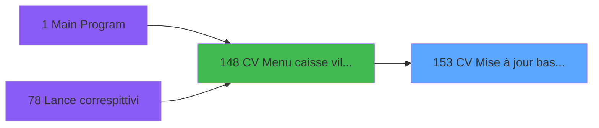
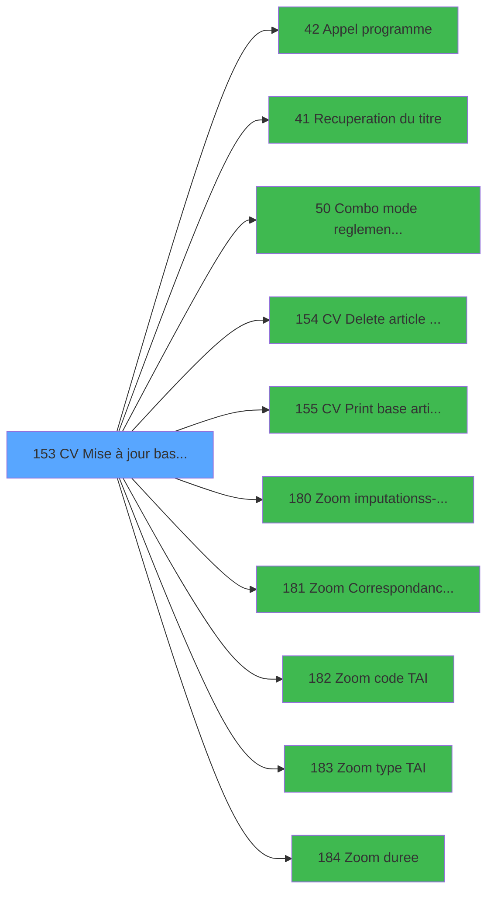

# VIL IDE 153 - CV  Mise à jour base articles

> **Analyse**: Phases 1-4 2026-02-03 09:45 -> 09:46 (30s) | Assemblage 09:46
> **Pipeline**: V7.2 Enrichi
> **Structure**: 4 onglets (Resume | Ecrans | Donnees | Connexions)

<!-- TAB:Resume -->

## 1. FICHE D'IDENTITE

| Attribut | Valeur |
|----------|--------|
| Projet | VIL |
| IDE Position | 153 |
| Nom Programme | CV  Mise à jour base articles |
| Fichier source | `Prg_153.xml` |
| Domaine metier | Ventes |
| Taches | 27 (6 ecrans visibles) |
| Tables modifiees | 4 |
| Programmes appeles | 10 |

## 2. DESCRIPTION FONCTIONNELLE

**CV  Mise à jour base articles** assure la gestion complete de ce processus, accessible depuis [CV  Menu caisse village (IDE 148)](VIL-IDE-148.md).

Le flux de traitement s'organise en **6 blocs fonctionnels** :

- **Traitement** (11 taches) : traitements metier divers
- **Consultation** (8 taches) : ecrans de recherche, selection et consultation
- **Validation** (3 taches) : controles et verifications de coherence
- **Creation** (3 taches) : insertion d'enregistrements en base (mouvements, prestations)
- **Saisie** (1 tache) : ecrans de saisie utilisateur (formulaires, champs, donnees)
- **Calcul** (1 tache) : calculs de montants, stocks ou compteurs

**Donnees modifiees** : 4 tables en ecriture (commande_________com, articles_________art, correspondance_article, pv_weight).

Detail : phases du traitement

#### Phase 1 : Traitement (11 taches)

- **153** - MAJ base articles **[[ECRAN]](#ecran-t1)**
- **153.1** - Scroll articles **[[ECRAN]](#ecran-t2)**
- **153.1.2** - Contrôle desactivation
- **153.1.3** - Contrôle desactivation
- **153.2.3.1** - Lect Forfait
- **153.2.5** - clic TAI or PRO
- **153.2.5.1** - curseur
- **153.4** - Veuillez patienter ... **[[ECRAN]](#ecran-t19)**
- **153.4.1** - Ecriture Fichier concentrateur
- **153.6.1** - lect suivi cloture
- **153.2.9** - Count taxes

Delegue a : [Appel programme (IDE 42)](VIL-IDE-42.md), [Recuperation du titre (IDE 41)](VIL-IDE-41.md), [   CV Delete article corresp (IDE 154)](VIL-IDE-154.md)

#### Phase 2 : Saisie (1 tache)

- **153.1.1** - Affichage point de vente **[[ECRAN]](#ecran-t3)**

#### Phase 3 : Consultation (8 taches)

- **153.2** - Creation/Affichage article **[[ECRAN]](#ecran-t6)**
- **153.2.3** - Affichage annulation **[[ECRAN]](#ecran-t9)**
- **153.2.4** - zoom affectation auto numero
- **153.3** - Selection service **[[ECRAN]](#ecran-t15)**
- **153.2.6** - Recherche Trous
- **153.2.6.1** - Recherche Article +1
- **153.2.7** - AfficheCombo SousType ? **[[ECRAN]](#ecran-t28)**
- **153.2.8** - Affiche Taxes **[[ECRAN]](#ecran-t29)**

Delegue a : [Recuperation du titre (IDE 41)](VIL-IDE-41.md), [Zoom imputation/ss-imputation (IDE 180)](VIL-IDE-180.md), [Zoom Correspondance Article (IDE 181)](VIL-IDE-181.md), [Zoom code TAI (IDE 182)](VIL-IDE-182.md), [Zoom type TAI (IDE 183)](VIL-IDE-183.md), [Zoom duree (IDE 184)](VIL-IDE-184.md)

#### Phase 4 : Creation (3 taches)

- **153.2.1** - Creation change
- **153.2.2** - Creation change
- **153.4.1.1** - Creation Commande

#### Phase 5 : Calcul (1 tache)

- **153.3.1** - Calcul autorisation modif

#### Phase 6 : Validation (3 taches)

- **153.5** - controle sessions caisse
- **153.6** - controle mvt produit
- **153.1.4** - Controle utilisation POS SQL **[[ECRAN]](#ecran-t27)**

#### Tables impactees

| Table | Operations | Role metier |
|-------|-----------|-------------|
| articles_________art | R/**W** (7 usages) | Articles et stock |
| correspondance_article | **W**/L (3 usages) | Articles et stock |
| commande_________com | **W** (1 usages) |  |
| pv_weight | **W** (1 usages) |  |

## 3. BLOCS FONCTIONNELS

### 3.1 Traitement (11 taches)

Traitements internes.

---

#### 153 - MAJ base articles [[ECRAN]](#ecran-t1)

**Role** : Tache d'orchestration : point d'entree du programme (11 sous-taches). Coordonne l'enchainement des traitements.
**Ecran** : 326 x 56 DLU (MDI) | [Voir mockup](#ecran-t1)

10 sous-taches directes

| Tache | Nom | Bloc |
|-------|-----|------|
| [153.1](#t2) | Scroll articles **[[ECRAN]](#ecran-t2)** | Traitement |
| [153.1.2](#t4) | Contrôle desactivation | Traitement |
| [153.1.3](#t5) | Contrôle desactivation | Traitement |
| [153.2.3.1](#t11) | Lect Forfait | Traitement |
| [153.2.5](#t13) | clic TAI or PRO | Traitement |
| [153.2.5.1](#t14) | curseur | Traitement |
| [153.4](#t19) | Veuillez patienter ... **[[ECRAN]](#ecran-t19)** | Traitement |
| [153.4.1](#t20) | Ecriture Fichier concentrateur | Traitement |
| [153.6.1](#t24) | lect suivi cloture | Traitement |
| [153.2.9](#t30) | Count taxes | Traitement |

---

#### 153.1 - Scroll articles [[ECRAN]](#ecran-t2)

**Role** : Traitement : Scroll articles.
**Ecran** : 1162 x 274 DLU (MDI) | [Voir mockup](#ecran-t2)

---

#### 153.1.2 - Contrôle desactivation

**Role** : Traitement : Contrôle desactivation.

---

#### 153.1.3 - Contrôle desactivation

**Role** : Traitement : Contrôle desactivation.

---

#### 153.2.3.1 - Lect Forfait

**Role** : Traitement : Lect Forfait.

---

#### 153.2.5 - clic TAI or PRO

**Role** : Traitement : clic TAI or PRO.

---

#### 153.2.5.1 - curseur

**Role** : Traitement : curseur.

---

#### 153.4 - Veuillez patienter ... [[ECRAN]](#ecran-t19)

**Role** : Traitement : Veuillez patienter ....
**Ecran** : 426 x 56 DLU (MDI) | [Voir mockup](#ecran-t19)

---

#### 153.4.1 - Ecriture Fichier concentrateur

**Role** : Traitement : Ecriture Fichier concentrateur.

---

#### 153.6.1 - lect suivi cloture

**Role** : Traitement : lect suivi cloture.
**Variables liees** : T (W0 nbre caisses non cloturees)

---

#### 153.2.9 - Count taxes

**Role** : Traitement : Count taxes.
**Variables liees** : BJ (v.nb taxes)

### 3.2 Saisie (1 tache)

L'operateur saisit les donnees de la transaction via 1 ecran (Affichage point de vente).

---

#### 153.1.1 - Affichage point de vente [[ECRAN]](#ecran-t3)

**Role** : Saisie des donnees : Affichage point de vente.
**Ecran** : 374 x 74 DLU (MDI) | [Voir mockup](#ecran-t3)
**Variables liees** : N (W0 lieux de vente), Q (W0 pour eviter point vente MK3)

### 3.3 Consultation (8 taches)

Ecrans de recherche et consultation.

---

#### 153.2 - Creation/Affichage article [[ECRAN]](#ecran-t6)

**Role** : Reinitialisation : Creation/Affichage article.
**Ecran** : 936 x 156 DLU (MDI) | [Voir mockup](#ecran-t6)
**Variables liees** : J (W0 pas d'article), K (W0 N° d'article), L (W0 borne article min), M (W0 borne article max), Z (W1 code article datagram)
**Delegue a** : [Zoom imputation/ss-imputation (IDE 180)](VIL-IDE-180.md), [Zoom Correspondance Article (IDE 181)](VIL-IDE-181.md), [Zoom code TAI (IDE 182)](VIL-IDE-182.md)

---

#### 153.2.3 - Affichage annulation [[ECRAN]](#ecran-t9)

**Role** : Reinitialisation : Affichage annulation.
**Ecran** : 312 x 64 DLU (Modal) | [Voir mockup](#ecran-t9)
**Delegue a** : [Zoom imputation/ss-imputation (IDE 180)](VIL-IDE-180.md), [Zoom Correspondance Article (IDE 181)](VIL-IDE-181.md), [Zoom code TAI (IDE 182)](VIL-IDE-182.md)

---

#### 153.2.4 - zoom affectation auto numero

**Role** : Selection par l'operateur : zoom affectation auto numero.
**Variables liees** : O (W0 modif autorisee), BE (W1 Affect  Auto NumArticle ?)
**Delegue a** : [Zoom imputation/ss-imputation (IDE 180)](VIL-IDE-180.md), [Zoom Correspondance Article (IDE 181)](VIL-IDE-181.md), [Zoom code TAI (IDE 182)](VIL-IDE-182.md)

---

#### 153.3 - Selection service [[ECRAN]](#ecran-t15)

**Role** : Selection par l'operateur : Selection service.
**Ecran** : 534 x 175 DLU (MDI) | [Voir mockup](#ecran-t15)
**Variables liees** : I (W0 service-village)
**Delegue a** : [Zoom imputation/ss-imputation (IDE 180)](VIL-IDE-180.md), [Zoom Correspondance Article (IDE 181)](VIL-IDE-181.md), [Zoom code TAI (IDE 182)](VIL-IDE-182.md)

---

#### 153.2.6 - Recherche Trous

**Role** : Traitement : Recherche Trous.
**Variables liees** : BI (V.recherche 10000)
**Delegue a** : [Zoom imputation/ss-imputation (IDE 180)](VIL-IDE-180.md), [Zoom Correspondance Article (IDE 181)](VIL-IDE-181.md), [Zoom code TAI (IDE 182)](VIL-IDE-182.md)

---

#### 153.2.6.1 - Recherche Article +1

**Role** : Traitement : Recherche Article +1.
**Variables liees** : J (W0 pas d'article), K (W0 N° d'article), L (W0 borne article min), M (W0 borne article max), BI (V.recherche 10000)
**Delegue a** : [Zoom imputation/ss-imputation (IDE 180)](VIL-IDE-180.md), [Zoom Correspondance Article (IDE 181)](VIL-IDE-181.md), [Zoom code TAI (IDE 182)](VIL-IDE-182.md)

---

#### 153.2.7 - AfficheCombo SousType ? [[ECRAN]](#ecran-t28)

**Role** : Reinitialisation : AfficheCombo SousType ?.
**Ecran** : 126 x 195 DLU | [Voir mockup](#ecran-t28)
**Delegue a** : [Zoom imputation/ss-imputation (IDE 180)](VIL-IDE-180.md), [Zoom Correspondance Article (IDE 181)](VIL-IDE-181.md), [Zoom code TAI (IDE 182)](VIL-IDE-182.md)

---

#### 153.2.8 - Affiche Taxes [[ECRAN]](#ecran-t29)

**Role** : Reinitialisation : Affiche Taxes.
**Ecran** : 1038 x 130 DLU | [Voir mockup](#ecran-t29)
**Variables liees** : BJ (v.nb taxes)
**Delegue a** : [Zoom imputation/ss-imputation (IDE 180)](VIL-IDE-180.md), [Zoom Correspondance Article (IDE 181)](VIL-IDE-181.md), [Zoom code TAI (IDE 182)](VIL-IDE-182.md)

### 3.4 Creation (3 taches)

Insertion de nouveaux enregistrements en base.

---

#### 153.2.1 - Creation change

**Role** : Creation d'enregistrement : Creation change.

---

#### 153.2.2 - Creation change

**Role** : Creation d'enregistrement : Creation change.

---

#### 153.4.1.1 - Creation Commande

**Role** : Creation d'enregistrement : Creation Commande.

### 3.5 Calcul (1 tache)

Calculs metier : montants, stocks, compteurs.

---

#### 153.3.1 - Calcul autorisation modif

**Role** : Calcul : Calcul autorisation modif.
**Variables liees** : O (W0 modif autorisee)

### 3.6 Validation (3 taches)

Controles de coherence : 3 taches verifient les donnees et conditions.

---

#### 153.5 - controle sessions caisse

**Role** : Verification : controle sessions caisse.
**Variables liees** : S (W0 nbre caisses ouvertes), T (W0 nbre caisses non cloturees)

---

#### 153.6 - controle mvt produit

**Role** : Verification : controle mvt produit.
**Variables liees** : U (W0 existe mvt produits)

---

#### 153.1.4 - Controle utilisation POS SQL [[ECRAN]](#ecran-t27)

**Role** : Verification : Controle utilisation POS SQL.
**Ecran** : 120 x 195 DLU | [Voir mockup](#ecran-t27)
**Variables liees** : A (P0 utilisation CAM)

## 5. REGLES METIER

*(Aucune regle metier identifiee)*

## 6. CONTEXTE

- **Appele par**: [CV  Menu caisse village (IDE 148)](VIL-IDE-148.md)
- **Appelle**: 10 programmes | **Tables**: 18 (W:4 R:10 L:6) | **Taches**: 27 | **Expressions**: 11

<!-- TAB:Ecrans -->

## 8. ECRANS

### 8.1 Forms visibles (6 / 27)

| # | Position | Tache | Nom | Type | Largeur | Hauteur | Bloc |
|---|----------|-------|-----|------|---------|---------|------|
| 1 | 153.1 | 153.1 | Scroll articles | MDI | 1162 | 274 | Traitement |
| 2 | 153.1.1 | 153.1.1 | Affichage point de vente | MDI | 374 | 74 | Saisie |
| 3 | 153.2 | 153.2 | Creation/Affichage article | MDI | 936 | 156 | Consultation |
| 4 | 153.3 | 153.3 | Selection service | MDI | 534 | 175 | Consultation |
| 5 | 153.4 | 153.4 | Veuillez patienter ... | MDI | 426 | 56 | Traitement |
| 6 | 153.2.8 | 153.2.8 | Affiche Taxes | Type0 | 1038 | 130 | Consultation |

### 8.2 Mockups Ecrans

---

#### 153.1 - Scroll articles
**Tache** : [153.1](#t2) | **Type** : MDI | **Dimensions** : 1162 x 274 DLU
**Bloc** : Traitement | **Titre IDE** : Scroll articles

<!-- FORM-DATA:
{
    "width":  1162,
    "vFactor":  8,
    "type":  "MDI",
    "hFactor":  8,
    "controls":  [
                     {
                         "x":  2,
                         "type":  "label",
                         "var":  "",
                         "y":  2,
                         "w":  1160,
                         "fmt":  "",
                         "name":  "",
                         "h":  17,
                         "color":  "",
                         "text":  "",
                         "parent":  null
                     },
                     {
                         "x":  17,
                         "type":  "label",
                         "var":  "",
                         "y":  28,
                         "w":  1131,
                         "fmt":  "",
                         "name":  "",
                         "h":  216,
                         "color":  "",
                         "text":  "",
                         "parent":  null
                     },
                     {
                         "x":  37,
                         "type":  "table",
                         "var":  "",
                         "name":  "",
                         "titleH":  12,
                         "color":  "110",
                         "w":  1093,
                         "y":  47,
                         "fmt":  "",
                         "parent":  null,
                         "text":  "",
                         "rowH":  13,
                         "h":  105,
                         "cols":  [
                                      {
                                          "title":  "Code",
                                          "layer":  1,
                                          "w":  93
                                      },
                                      {
                                          "title":  "Article",
                                          "layer":  2,
                                          "w":  245
                                      },
                                      {
                                          "title":  "Prix",
                                          "layer":  3,
                                          "w":  228
                                      },
                                      {
                                          "title":  "Imputation",
                                          "layer":  4,
                                          "w":  493
                                      }
                                  ],
                         "rows":  4
                     },
                     {
                         "x":  356,
                         "type":  "label",
                         "var":  "",
                         "y":  160,
                         "w":  631,
                         "fmt":  "",
                         "name":  "",
                         "h":  76,
                         "color":  "",
                         "text":  "",
                         "parent":  null
                     },
                     {
                         "x":  358,
                         "type":  "label",
                         "var":  "",
                         "y":  161,
                         "w":  628,
                         "fmt":  "",
                         "name":  "",
                         "h":  74,
                         "color":  "",
                         "text":  "",
                         "parent":  null
                     },
                     {
                         "x":  382,
                         "type":  "label",
                         "var":  "",
                         "y":  168,
                         "w":  289,
                         "fmt":  "",
                         "name":  "",
                         "h":  46,
                         "color":  "",
                         "text":  "",
                         "parent":  null
                     },
                     {
                         "x":  671,
                         "type":  "label",
                         "var":  "",
                         "y":  168,
                         "w":  284,
                         "fmt":  "",
                         "name":  "",
                         "h":  46,
                         "color":  "",
                         "text":  "",
                         "parent":  null
                     },
                     {
                         "x":  384,
                         "type":  "label",
                         "var":  "",
                         "y":  169,
                         "w":  66,
                         "fmt":  "",
                         "name":  "",
                         "h":  44,
                         "color":  "",
                         "text":  "",
                         "parent":  null
                     },
                     {
                         "x":  673,
                         "type":  "label",
                         "var":  "",
                         "y":  169,
                         "w":  66,
                         "fmt":  "",
                         "name":  "",
                         "h":  44,
                         "color":  "",
                         "text":  "",
                         "parent":  null
                     },
                     {
                         "x":  466,
                         "type":  "label",
                         "var":  "",
                         "y":  176,
                         "w":  173,
                         "fmt":  "",
                         "name":  "",
                         "h":  8,
                         "color":  "7",
                         "text":  "Création",
                         "parent":  null
                     },
                     {
                         "x":  755,
                         "type":  "label",
                         "var":  "",
                         "y":  176,
                         "w":  173,
                         "fmt":  "",
                         "name":  "",
                         "h":  8,
                         "color":  "7",
                         "text":  "Désactiver",
                         "parent":  null
                     },
                     {
                         "x":  466,
                         "type":  "label",
                         "var":  "",
                         "y":  188,
                         "w":  173,
                         "fmt":  "",
                         "name":  "",
                         "h":  8,
                         "color":  "7",
                         "text":  "Modification",
                         "parent":  null
                     },
                     {
                         "x":  755,
                         "type":  "label",
                         "var":  "",
                         "y":  188,
                         "w":  173,
                         "fmt":  "",
                         "name":  "",
                         "h":  8,
                         "color":  "7",
                         "text":  "Réactiver",
                         "parent":  null
                     },
                     {
                         "x":  466,
                         "type":  "label",
                         "var":  "",
                         "y":  200,
                         "w":  173,
                         "fmt":  "",
                         "name":  "",
                         "h":  8,
                         "color":  "7",
                         "text":  "Autres services",
                         "parent":  null
                     },
                     {
                         "x":  755,
                         "type":  "label",
                         "var":  "",
                         "y":  200,
                         "w":  173,
                         "fmt":  "",
                         "name":  "",
                         "h":  8,
                         "color":  "7",
                         "text":  "Impression",
                         "parent":  null
                     },
                     {
                         "x":  554,
                         "type":  "label",
                         "var":  "",
                         "y":  220,
                         "w":  186,
                         "fmt":  "",
                         "name":  "",
                         "h":  8,
                         "color":  "",
                         "text":  "Choix de l\u0027action",
                         "parent":  null
                     },
                     {
                         "x":  0,
                         "type":  "label",
                         "var":  "",
                         "y":  249,
                         "w":  1160,
                         "fmt":  "",
                         "name":  "",
                         "h":  24,
                         "color":  "",
                         "text":  "",
                         "parent":  null
                     },
                     {
                         "x":  48,
                         "type":  "edit",
                         "var":  "",
                         "y":  63,
                         "w":  75,
                         "fmt":  "",
                         "name":  "",
                         "h":  8,
                         "color":  "110",
                         "text":  "",
                         "parent":  6
                     },
                     {
                         "x":  139,
                         "type":  "edit",
                         "var":  "",
                         "y":  63,
                         "w":  233,
                         "fmt":  "",
                         "name":  "",
                         "h":  8,
                         "color":  "110",
                         "text":  "",
                         "parent":  6
                     },
                     {
                         "x":  612,
                         "type":  "edit",
                         "var":  "",
                         "y":  63,
                         "w":  176,
                         "fmt":  "",
                         "name":  "",
                         "h":  8,
                         "color":  "110",
                         "text":  "",
                         "parent":  6
                     },
                     {
                         "x":  796,
                         "type":  "edit",
                         "var":  "",
                         "y":  63,
                         "w":  120,
                         "fmt":  "",
                         "name":  "",
                         "h":  8,
                         "color":  "110",
                         "text":  "",
                         "parent":  6
                     },
                     {
                         "x":  943,
                         "type":  "edit",
                         "var":  "",
                         "y":  63,
                         "w":  42,
                         "fmt":  "",
                         "name":  "",
                         "h":  8,
                         "color":  "110",
                         "text":  "",
                         "parent":  6
                     },
                     {
                         "x":  385,
                         "type":  "edit",
                         "var":  "",
                         "y":  63,
                         "w":  210,
                         "fmt":  "## ### ### ###.###Z",
                         "name":  "",
                         "h":  8,
                         "color":  "110",
                         "text":  "",
                         "parent":  6
                     },
                     {
                         "x":  757,
                         "type":  "edit",
                         "var":  "",
                         "y":  219,
                         "w":  26,
                         "fmt":  "UA",
                         "name":  "W1 choix action",
                         "h":  10,
                         "color":  "6",
                         "text":  "",
                         "parent":  null
                     },
                     {
                         "x":  13,
                         "type":  "edit",
                         "var":  "",
                         "y":  6,
                         "w":  395,
                         "fmt":  "30",
                         "name":  "",
                         "h":  8,
                         "color":  "",
                         "text":  "",
                         "parent":  1
                     },
                     {
                         "x":  945,
                         "type":  "edit",
                         "var":  "",
                         "y":  6,
                         "w":  203,
                         "fmt":  "WWW DD MMM YYYYT",
                         "name":  "",
                         "h":  8,
                         "color":  "",
                         "text":  "",
                         "parent":  1
                     },
                     {
                         "x":  214,
                         "type":  "edit",
                         "var":  "",
                         "y":  32,
                         "w":  709,
                         "fmt":  "60",
                         "name":  "",
                         "h":  10,
                         "color":  "7",
                         "text":  "",
                         "parent":  null
                     },
                     {
                         "x":  917,
                         "type":  "edit",
                         "var":  "",
                         "y":  63,
                         "w":  19,
                         "fmt":  "1",
                         "name":  "",
                         "h":  8,
                         "color":  "110",
                         "text":  "",
                         "parent":  6
                     },
                     {
                         "x":  996,
                         "type":  "edit",
                         "var":  "",
                         "y":  63,
                         "w":  19,
                         "fmt":  "1",
                         "name":  "",
                         "h":  8,
                         "color":  "110",
                         "text":  "",
                         "parent":  6
                     },
                     {
                         "x":  1028,
                         "type":  "edit",
                         "var":  "",
                         "y":  63,
                         "w":  64,
                         "fmt":  "5",
                         "name":  "",
                         "h":  8,
                         "color":  "110",
                         "text":  "",
                         "parent":  6
                     },
                     {
                         "x":  108,
                         "type":  "image",
                         "var":  "",
                         "y":  165,
                         "w":  179,
                         "fmt":  "",
                         "name":  "",
                         "h":  62,
                         "color":  "",
                         "text":  "",
                         "parent":  4
                     },
                     {
                         "x":  693,
                         "type":  "button",
                         "var":  "",
                         "y":  175,
                         "w":  26,
                         "fmt":  "D",
                         "name":  "D",
                         "h":  9,
                         "color":  "",
                         "text":  "",
                         "parent":  null
                     },
                     {
                         "x":  404,
                         "type":  "button",
                         "var":  "",
                         "y":  177,
                         "w":  26,
                         "fmt":  "C",
                         "name":  "C",
                         "h":  9,
                         "color":  "",
                         "text":  "",
                         "parent":  null
                     },
                     {
                         "x":  693,
                         "type":  "button",
                         "var":  "",
                         "y":  187,
                         "w":  26,
                         "fmt":  "R",
                         "name":  "R",
                         "h":  9,
                         "color":  "",
                         "text":  "",
                         "parent":  null
                     },
                     {
                         "x":  404,
                         "type":  "button",
                         "var":  "",
                         "y":  189,
                         "w":  26,
                         "fmt":  "M",
                         "name":  "M",
                         "h":  9,
                         "color":  "",
                         "text":  "",
                         "parent":  null
                     },
                     {
                         "x":  693,
                         "type":  "button",
                         "var":  "",
                         "y":  199,
                         "w":  26,
                         "fmt":  "I",
                         "name":  "I",
                         "h":  9,
                         "color":  "",
                         "text":  "",
                         "parent":  null
                     },
                     {
                         "x":  404,
                         "type":  "button",
                         "var":  "",
                         "y":  201,
                         "w":  26,
                         "fmt":  "A",
                         "name":  "A",
                         "h":  9,
                         "color":  "",
                         "text":  "",
                         "parent":  null
                     },
                     {
                         "x":  6,
                         "type":  "button",
                         "var":  "",
                         "y":  252,
                         "w":  160,
                         "fmt":  "\u0026Quitter",
                         "name":  "",
                         "h":  18,
                         "color":  "",
                         "text":  "",
                         "parent":  null
                     },
                     {
                         "x":  37,
                         "type":  "combobox",
                         "var":  "",
                         "y":  32,
                         "w":  112,
                         "fmt":  "",
                         "name":  "V.Actifs ?",
                         "h":  12,
                         "color":  "1",
                         "text":  "A,I,T",
                         "parent":  null
                     }
                 ],
    "taskId":  "153.1",
    "height":  274
}
-->

<strong>Champs : 14 champs</strong>

| Pos (x,y) | Nom | Variable | Type |
|-----------|-----|----------|------|
| 48,63 | (sans nom) | - | edit |
| 139,63 | (sans nom) | - | edit |
| 612,63 | (sans nom) | - | edit |
| 796,63 | (sans nom) | - | edit |
| 943,63 | (sans nom) | - | edit |
| 385,63 | ## ### ### ###.###Z | - | edit |
| 757,219 | W1 choix action | - | edit |
| 13,6 | 30 | - | edit |
| 945,6 | WWW DD MMM YYYYT | - | edit |
| 214,32 | 60 | - | edit |
| 917,63 | 1 | - | edit |
| 996,63 | 1 | - | edit |
| 1028,63 | 5 | - | edit |
| 37,32 | V.Actifs ? | - | combobox |

<strong>Boutons : 7 boutons</strong>

| Bouton | Pos (x,y) | Action |
|--------|-----------|--------|
| D | 693,175 | Bouton fonctionnel |
| C | 404,177 | Bouton fonctionnel |
| R | 693,187 | Bouton fonctionnel |
| M | 404,189 | Bouton fonctionnel |
| I | 693,199 | Bouton fonctionnel |
| A | 404,201 | Bouton fonctionnel |
| Quitter | 6,252 | Quitte le programme |

---

#### 153.1.1 - Affichage point de vente
**Tache** : [153.1.1](#t3) | **Type** : MDI | **Dimensions** : 374 x 74 DLU
**Bloc** : Saisie | **Titre IDE** : Affichage point de vente

<!-- FORM-DATA:
{
    "width":  374,
    "vFactor":  8,
    "type":  "MDI",
    "hFactor":  8,
    "controls":  [
                     {
                         "x":  91,
                         "type":  "label",
                         "var":  "",
                         "y":  4,
                         "w":  199,
                         "fmt":  "",
                         "name":  "",
                         "h":  41,
                         "color":  "",
                         "text":  "",
                         "parent":  2
                     },
                     {
                         "x":  92,
                         "type":  "label",
                         "var":  "",
                         "y":  5,
                         "w":  194,
                         "fmt":  "",
                         "name":  "",
                         "h":  39,
                         "color":  "",
                         "text":  "",
                         "parent":  null
                     },
                     {
                         "x":  109,
                         "type":  "label",
                         "var":  "",
                         "y":  7,
                         "w":  158,
                         "fmt":  "",
                         "name":  "",
                         "h":  8,
                         "color":  "142",
                         "text":  "point de vente",
                         "parent":  null
                     },
                     {
                         "x":  2,
                         "type":  "label",
                         "var":  "",
                         "y":  49,
                         "w":  368,
                         "fmt":  "",
                         "name":  "",
                         "h":  24,
                         "color":  "",
                         "text":  "",
                         "parent":  null
                     },
                     {
                         "x":  107,
                         "type":  "edit",
                         "var":  "",
                         "y":  15,
                         "w":  160,
                         "fmt":  "",
                         "name":  "",
                         "h":  8,
                         "color":  "",
                         "text":  "",
                         "parent":  null
                     },
                     {
                         "x":  107,
                         "type":  "edit",
                         "var":  "",
                         "y":  23,
                         "w":  160,
                         "fmt":  "",
                         "name":  "",
                         "h":  8,
                         "color":  "",
                         "text":  "",
                         "parent":  null
                     },
                     {
                         "x":  107,
                         "type":  "edit",
                         "var":  "",
                         "y":  31,
                         "w":  160,
                         "fmt":  "",
                         "name":  "",
                         "h":  8,
                         "color":  "",
                         "text":  "",
                         "parent":  null
                     },
                     {
                         "x":  8,
                         "type":  "button",
                         "var":  "",
                         "y":  52,
                         "w":  160,
                         "fmt":  "\u0026Quitter",
                         "name":  "",
                         "h":  18,
                         "color":  "",
                         "text":  "",
                         "parent":  null
                     }
                 ],
    "taskId":  "153.1.1",
    "height":  74
}
-->

<strong>Champs : 3 champs</strong>

| Pos (x,y) | Nom | Variable | Type |
|-----------|-----|----------|------|
| 107,15 | (sans nom) | - | edit |
| 107,23 | (sans nom) | - | edit |
| 107,31 | (sans nom) | - | edit |

<strong>Boutons : 1 boutons</strong>

| Bouton | Pos (x,y) | Action |
|--------|-----------|--------|
| Quitter | 8,52 | Quitte le programme |

---

#### 153.2 - Creation/Affichage article
**Tache** : [153.2](#t6) | **Type** : MDI | **Dimensions** : 936 x 156 DLU
**Bloc** : Consultation | **Titre IDE** : Creation/Affichage article

<!-- FORM-DATA:
{
    "width":  936,
    "vFactor":  8,
    "type":  "MDI",
    "hFactor":  8,
    "controls":  [
                     {
                         "x":  3,
                         "type":  "label",
                         "var":  "",
                         "y":  2,
                         "w":  917,
                         "fmt":  "",
                         "name":  "",
                         "h":  125,
                         "color":  "",
                         "text":  "",
                         "parent":  null
                     },
                     {
                         "x":  70,
                         "type":  "label",
                         "var":  "",
                         "y":  23,
                         "w":  66,
                         "fmt":  "",
                         "name":  "",
                         "h":  8,
                         "color":  "",
                         "text":  "Service",
                         "parent":  null
                     },
                     {
                         "x":  147,
                         "type":  "label",
                         "var":  "",
                         "y":  23,
                         "w":  82,
                         "fmt":  "",
                         "name":  "",
                         "h":  8,
                         "color":  "",
                         "text":  "Code",
                         "parent":  null
                     },
                     {
                         "x":  240,
                         "type":  "label",
                         "var":  "",
                         "y":  23,
                         "w":  126,
                         "fmt":  "",
                         "name":  "",
                         "h":  8,
                         "color":  "",
                         "text":  "Imputation",
                         "parent":  null
                     },
                     {
                         "x":  74,
                         "type":  "label",
                         "var":  "",
                         "y":  55,
                         "w":  101,
                         "fmt":  "",
                         "name":  "",
                         "h":  8,
                         "color":  "",
                         "text":  "Libellé",
                         "parent":  null
                     },
                     {
                         "x":  240,
                         "type":  "label",
                         "var":  "",
                         "y":  55,
                         "w":  91,
                         "fmt":  "",
                         "name":  "",
                         "h":  8,
                         "color":  "",
                         "text":  "TAI Code",
                         "parent":  null
                     },
                     {
                         "x":  359,
                         "type":  "label",
                         "var":  "",
                         "y":  55,
                         "w":  115,
                         "fmt":  "",
                         "name":  "",
                         "h":  8,
                         "color":  "",
                         "text":  "TAI Durée",
                         "parent":  null
                     },
                     {
                         "x":  562,
                         "type":  "label",
                         "var":  "",
                         "y":  55,
                         "w":  48,
                         "fmt":  "",
                         "name":  "",
                         "h":  8,
                         "color":  "",
                         "text":  "Prix",
                         "parent":  null
                     },
                     {
                         "x":  8,
                         "type":  "label",
                         "var":  "",
                         "y":  98,
                         "w":  837,
                         "fmt":  "",
                         "name":  "",
                         "h":  26,
                         "color":  "195",
                         "text":  "Correspondance Monétique",
                         "parent":  null
                     },
                     {
                         "x":  102,
                         "type":  "label",
                         "var":  "",
                         "y":  110,
                         "w":  133,
                         "fmt":  "",
                         "name":  "",
                         "h":  8,
                         "color":  "",
                         "text":  "Code Datagram",
                         "parent":  22
                     },
                     {
                         "x":  429,
                         "type":  "label",
                         "var":  "",
                         "y":  110,
                         "w":  133,
                         "fmt":  "",
                         "name":  "",
                         "h":  8,
                         "color":  "",
                         "text":  "Libellé Datagram",
                         "parent":  22
                     },
                     {
                         "x":  0,
                         "type":  "label",
                         "var":  "",
                         "y":  130,
                         "w":  854,
                         "fmt":  "",
                         "name":  "",
                         "h":  24,
                         "color":  "",
                         "text":  "",
                         "parent":  null
                     },
                     {
                         "x":  725,
                         "type":  "label",
                         "var":  "",
                         "y":  55,
                         "w":  88,
                         "fmt":  "",
                         "name":  "",
                         "h":  8,
                         "color":  "",
                         "text":  "TVA",
                         "parent":  null
                     },
                     {
                         "x":  74,
                         "type":  "checkbox",
                         "var":  "",
                         "y":  7,
                         "w":  64,
                         "fmt":  "",
                         "name":  "TAI",
                         "h":  10,
                         "color":  "",
                         "text":  "TAI",
                         "parent":  null
                     },
                     {
                         "x":  152,
                         "type":  "checkbox",
                         "var":  "",
                         "y":  8,
                         "w":  159,
                         "fmt":  "",
                         "name":  "PRO",
                         "h":  8,
                         "color":  "",
                         "text":  "TAI Prolongation",
                         "parent":  null
                     },
                     {
                         "x":  147,
                         "type":  "edit",
                         "var":  "",
                         "y":  38,
                         "w":  82,
                         "fmt":  "",
                         "name":  "W1 code article",
                         "h":  10,
                         "color":  "6",
                         "text":  "",
                         "parent":  null
                     },
                     {
                         "x":  240,
                         "type":  "edit",
                         "var":  "",
                         "y":  38,
                         "w":  126,
                         "fmt":  "",
                         "name":  "W1 imputation",
                         "h":  10,
                         "color":  "6",
                         "text":  "",
                         "parent":  null
                     },
                     {
                         "x":  373,
                         "type":  "edit",
                         "var":  "",
                         "y":  38,
                         "w":  48,
                         "fmt":  "",
                         "name":  "",
                         "h":  10,
                         "color":  "6",
                         "text":  "",
                         "parent":  null
                     },
                     {
                         "x":  482,
                         "type":  "edit",
                         "var":  "",
                         "y":  38,
                         "w":  182,
                         "fmt":  "",
                         "name":  "W1 libelle imput.",
                         "h":  10,
                         "color":  "6",
                         "text":  "",
                         "parent":  null
                     },
                     {
                         "x":  74,
                         "type":  "edit",
                         "var":  "",
                         "y":  68,
                         "w":  157,
                         "fmt":  "U12",
                         "name":  "W1 libelle article",
                         "h":  10,
                         "color":  "6",
                         "text":  "",
                         "parent":  null
                     },
                     {
                         "x":  74,
                         "type":  "edit",
                         "var":  "",
                         "y":  82,
                         "w":  259,
                         "fmt":  "",
                         "name":  "",
                         "h":  10,
                         "color":  "",
                         "text":  "",
                         "parent":  null
                     },
                     {
                         "x":  240,
                         "type":  "edit",
                         "var":  "",
                         "y":  68,
                         "w":  91,
                         "fmt":  "",
                         "name":  "W1 TAI Code",
                         "h":  10,
                         "color":  "6",
                         "text":  "",
                         "parent":  null
                     },
                     {
                         "x":  373,
                         "type":  "edit",
                         "var":  "",
                         "y":  68,
                         "w":  88,
                         "fmt":  "3Z",
                         "name":  "W1 TAI Duree",
                         "h":  10,
                         "color":  "6",
                         "text":  "",
                         "parent":  null
                     },
                     {
                         "x":  482,
                         "type":  "edit",
                         "var":  "",
                         "y":  68,
                         "w":  182,
                         "fmt":  "15CZ",
                         "name":  "W1 prix",
                         "h":  10,
                         "color":  "6",
                         "text":  "",
                         "parent":  null
                     },
                     {
                         "x":  250,
                         "type":  "edit",
                         "var":  "",
                         "y":  109,
                         "w":  48,
                         "fmt":  "",
                         "name":  "W1 code article datagram",
                         "h":  10,
                         "color":  "6",
                         "text":  "",
                         "parent":  22
                     },
                     {
                         "x":  578,
                         "type":  "edit",
                         "var":  "",
                         "y":  109,
                         "w":  104,
                         "fmt":  "",
                         "name":  "W1 libelle datagram",
                         "h":  10,
                         "color":  "6",
                         "text":  "",
                         "parent":  22
                     },
                     {
                         "x":  7,
                         "type":  "button",
                         "var":  "",
                         "y":  133,
                         "w":  160,
                         "fmt":  "\u0026Ok",
                         "name":  "Bouton Ok",
                         "h":  18,
                         "color":  "",
                         "text":  "",
                         "parent":  null
                     },
                     {
                         "x":  70,
                         "type":  "edit",
                         "var":  "",
                         "y":  38,
                         "w":  66,
                         "fmt":  "",
                         "name":  "",
                         "h":  9,
                         "color":  "168",
                         "text":  "",
                         "parent":  null
                     },
                     {
                         "x":  673,
                         "type":  "edit",
                         "var":  "",
                         "y":  68,
                         "w":  42,
                         "fmt":  "3",
                         "name":  "",
                         "h":  10,
                         "color":  "7",
                         "text":  "",
                         "parent":  null
                     },
                     {
                         "x":  376,
                         "type":  "edit",
                         "var":  "",
                         "y":  82,
                         "w":  397,
                         "fmt":  "30",
                         "name":  "",
                         "h":  10,
                         "color":  "2",
                         "text":  "",
                         "parent":  null
                     },
                     {
                         "x":  174,
                         "type":  "button",
                         "var":  "",
                         "y":  133,
                         "w":  160,
                         "fmt":  "A\u0026bandonner",
                         "name":  "",
                         "h":  18,
                         "color":  "",
                         "text":  "",
                         "parent":  null
                     },
                     {
                         "x":  730,
                         "type":  "combobox",
                         "var":  "",
                         "y":  68,
                         "w":  112,
                         "fmt":  "",
                         "name":  "W1. TVA",
                         "h":  12,
                         "color":  "",
                         "text":  "0",
                         "parent":  null
                     }
                 ],
    "taskId":  "153.2",
    "height":  156
}
-->

<strong>Champs : 17 champs</strong>

| Pos (x,y) | Nom | Variable | Type |
|-----------|-----|----------|------|
| 74,7 | TAI | - | checkbox |
| 152,8 | PRO | - | checkbox |
| 147,38 | W1 code article | - | edit |
| 240,38 | W1 imputation | - | edit |
| 373,38 | (sans nom) | - | edit |
| 482,38 | W1 libelle imput. | - | edit |
| 74,68 | W1 libelle article | - | edit |
| 74,82 | (sans nom) | - | edit |
| 240,68 | W1 TAI Code | - | edit |
| 373,68 | W1 TAI Duree | - | edit |
| 482,68 | W1 prix | - | edit |
| 250,109 | W1 code article datagram | - | edit |
| 578,109 | W1 libelle datagram | - | edit |
| 70,38 | (sans nom) | - | edit |
| 673,68 | 3 | - | edit |
| 376,82 | 30 | - | edit |
| 730,68 | W1. TVA | - | combobox |

<strong>Boutons : 2 boutons</strong>

| Bouton | Pos (x,y) | Action |
|--------|-----------|--------|
| Ok | 7,133 | Valide la saisie et enregistre |
| Abandonner | 174,133 | Annule et retour au menu |

---

#### 153.3 - Selection service
**Tache** : [153.3](#t15) | **Type** : MDI | **Dimensions** : 534 x 175 DLU
**Bloc** : Consultation | **Titre IDE** : Selection service

<!-- FORM-DATA:
{
    "width":  534,
    "vFactor":  8,
    "type":  "MDI",
    "hFactor":  8,
    "controls":  [
                     {
                         "x":  82,
                         "type":  "table",
                         "var":  "",
                         "name":  "",
                         "titleH":  12,
                         "color":  "196",
                         "w":  370,
                         "y":  6,
                         "fmt":  "",
                         "parent":  null,
                         "text":  "",
                         "rowH":  12,
                         "h":  113,
                         "cols":  [
                                      {
                                          "title":  "Services du village",
                                          "layer":  1,
                                          "w":  337
                                      }
                                  ],
                         "rows":  1
                     },
                     {
                         "x":  0,
                         "type":  "label",
                         "var":  "",
                         "y":  150,
                         "w":  533,
                         "fmt":  "",
                         "name":  "",
                         "h":  24,
                         "color":  "",
                         "text":  "",
                         "parent":  null
                     },
                     {
                         "x":  93,
                         "type":  "edit",
                         "var":  "",
                         "y":  21,
                         "w":  64,
                         "fmt":  "",
                         "name":  "",
                         "h":  8,
                         "color":  "196",
                         "text":  "",
                         "parent":  1
                     },
                     {
                         "x":  184,
                         "type":  "edit",
                         "var":  "",
                         "y":  21,
                         "w":  232,
                         "fmt":  "",
                         "name":  "",
                         "h":  8,
                         "color":  "196",
                         "text":  "",
                         "parent":  1
                     },
                     {
                         "x":  37,
                         "type":  "button",
                         "var":  "",
                         "y":  153,
                         "w":  160,
                         "fmt":  "Sélectionner",
                         "name":  "",
                         "h":  18,
                         "color":  "",
                         "text":  "",
                         "parent":  null
                     },
                     {
                         "x":  335,
                         "type":  "button",
                         "var":  "",
                         "y":  153,
                         "w":  160,
                         "fmt":  "Quitter",
                         "name":  "",
                         "h":  18,
                         "color":  "",
                         "text":  "",
                         "parent":  null
                     },
                     {
                         "x":  238,
                         "type":  "image",
                         "var":  "",
                         "y":  125,
                         "w":  58,
                         "fmt":  "",
                         "name":  "",
                         "h":  18,
                         "color":  "",
                         "text":  "",
                         "parent":  null
                     }
                 ],
    "taskId":  "153.3",
    "height":  175
}
-->

<strong>Champs : 2 champs</strong>

| Pos (x,y) | Nom | Variable | Type |
|-----------|-----|----------|------|
| 93,21 | (sans nom) | - | edit |
| 184,21 | (sans nom) | - | edit |

<strong>Boutons : 2 boutons</strong>

| Bouton | Pos (x,y) | Action |
|--------|-----------|--------|
| Sélectionner | 37,153 | Bouton fonctionnel |
| Quitter | 335,153 | Quitte le programme |

---

#### 153.4 - Veuillez patienter ...
**Tache** : [153.4](#t19) | **Type** : MDI | **Dimensions** : 426 x 56 DLU
**Bloc** : Traitement | **Titre IDE** : Veuillez patienter ...

<!-- FORM-DATA:
{
    "width":  426,
    "vFactor":  8,
    "type":  "MDI",
    "hFactor":  8,
    "controls":  [
                     {
                         "x":  3,
                         "type":  "label",
                         "var":  "",
                         "y":  0,
                         "w":  423,
                         "fmt":  "",
                         "name":  "",
                         "h":  29,
                         "color":  "",
                         "text":  "",
                         "parent":  null
                     },
                     {
                         "x":  120,
                         "type":  "label",
                         "var":  "",
                         "y":  10,
                         "w":  275,
                         "fmt":  "",
                         "name":  "",
                         "h":  8,
                         "color":  "7",
                         "text":  "Traitement en cours ...",
                         "parent":  null
                     },
                     {
                         "x":  3,
                         "type":  "label",
                         "var":  "",
                         "y":  29,
                         "w":  423,
                         "fmt":  "",
                         "name":  "",
                         "h":  27,
                         "color":  "",
                         "text":  "",
                         "parent":  null
                     },
                     {
                         "x":  87,
                         "type":  "label",
                         "var":  "",
                         "y":  38,
                         "w":  250,
                         "fmt":  "",
                         "name":  "",
                         "h":  8,
                         "color":  "",
                         "text":  "Envoie sur concentrateur",
                         "parent":  null
                     },
                     {
                         "x":  4,
                         "type":  "image",
                         "var":  "",
                         "y":  2,
                         "w":  72,
                         "fmt":  "",
                         "name":  "",
                         "h":  25,
                         "color":  "",
                         "text":  "",
                         "parent":  null
                     }
                 ],
    "taskId":  "153.4",
    "height":  56
}
-->

---

#### 153.2.8 - Affiche Taxes
**Tache** : [153.2.8](#t29) | **Type** : Type0 | **Dimensions** : 1038 x 130 DLU
**Bloc** : Consultation | **Titre IDE** : Affiche Taxes

<!-- FORM-DATA:
{
    "width":  1038,
    "vFactor":  8,
    "type":  "Type0",
    "hFactor":  8,
    "controls":  [
                     {
                         "x":  21,
                         "type":  "table",
                         "var":  "",
                         "name":  "",
                         "titleH":  16,
                         "color":  "111",
                         "w":  1008,
                         "y":  2,
                         "fmt":  "",
                         "parent":  null,
                         "text":  "",
                         "rowH":  16,
                         "h":  115,
                         "cols":  [
                                      {
                                          "title":  "Taux",
                                          "layer":  1,
                                          "w":  93
                                      },
                                      {
                                          "title":  "Libellé",
                                          "layer":  2,
                                          "w":  507
                                      },
                                      {
                                          "title":  "Appliqué sur",
                                          "layer":  3,
                                          "w":  286
                                      }
                                  ],
                         "rows":  3
                     },
                     {
                         "x":  32,
                         "type":  "edit",
                         "var":  "",
                         "y":  25,
                         "w":  75,
                         "fmt":  "",
                         "name":  "tva_code",
                         "h":  8,
                         "color":  "110",
                         "text":  "",
                         "parent":  1
                     },
                     {
                         "x":  123,
                         "type":  "edit",
                         "var":  "",
                         "y":  25,
                         "w":  475,
                         "fmt":  "",
                         "name":  "tva_description",
                         "h":  8,
                         "color":  "110",
                         "text":  "",
                         "parent":  1
                     },
                     {
                         "x":  627,
                         "type":  "combobox",
                         "var":  "",
                         "y":  21,
                         "w":  112,
                         "fmt":  "",
                         "name":  "pv_service",
                         "h":  12,
                         "color":  "6",
                         "text":  "HT,TTC",
                         "parent":  1
                     }
                 ],
    "taskId":  "153.2.8",
    "height":  130
}
-->

<strong>Champs : 3 champs</strong>

| Pos (x,y) | Nom | Variable | Type |
|-----------|-----|----------|------|
| 32,25 | tva_code | - | edit |
| 123,25 | tva_description | - | edit |
| 627,21 | pv_service | - | combobox |

## 9. NAVIGATION

### 9.1 Enchainement des ecrans

```mermaid
flowchart TD
    START([Entree])
    style START fill:#3fb950
    VF2[153.1 Scroll articles]
    style VF2 fill:#58a6ff
    VF3[153.1.1 Affichage point de ...]
    style VF3 fill:#58a6ff
    VF6[153.2 CreationAffichage a...]
    style VF6 fill:#58a6ff
    VF15[153.3 Selection service]
    style VF15 fill:#58a6ff
    VF19[153.4 Veuillez patienter...]
    style VF19 fill:#58a6ff
    VF29[153.2.8 Affiche Taxes]
    style VF29 fill:#58a6ff
    EXT42[IDE 42 Appel programme]
    style EXT42 fill:#3fb950
    EXT41[IDE 41 Recuperation du...]
    style EXT41 fill:#3fb950
    EXT50[IDE 50 Combo mode regl...]
    style EXT50 fill:#3fb950
    EXT154[IDE 154 CV Delete arti...]
    style EXT154 fill:#3fb950
    EXT155[IDE 155 CV Print base ...]
    style EXT155 fill:#3fb950
    EXT180[IDE 180 Zoom imputatio...]
    style EXT180 fill:#3fb950
    EXT181[IDE 181 Zoom Correspon...]
    style EXT181 fill:#3fb950
    EXT182[IDE 182 Zoom code TAI]
    style EXT182 fill:#3fb950
    EXT183[IDE 183 Zoom type TAI]
    style EXT183 fill:#3fb950
    EXT184[IDE 184 Zoom duree]
    style EXT184 fill:#3fb950
    FIN([Sortie])
    style FIN fill:#f85149
    START --> VF2
    VF2 -->|Sous-programme| EXT42
    VF2 -->|Recuperation donnees| EXT41
    VF2 -->|Sous-programme| EXT50
    VF2 -->|Sous-programme| EXT154
    VF2 -->|Impression ticket/document| EXT155
    VF2 -->|Selection/consultation| EXT180
    VF2 -->|Selection/consultation| EXT181
    VF2 -->|Selection/consultation| EXT182
    EXT184 --> FIN
```

**Detail par enchainement :**

| Depuis | Action | Vers | Retour |
|--------|--------|------|--------|
| Scroll articles | Sous-programme | [Appel programme (IDE 42)](VIL-IDE-42.md) | Retour ecran |
| Scroll articles | Recuperation donnees | [Recuperation du titre (IDE 41)](VIL-IDE-41.md) | Retour ecran |
| Scroll articles | Sous-programme | [Combo mode reglement vsl (IDE 50)](VIL-IDE-50.md) | Retour ecran |
| Scroll articles | Sous-programme | [   CV Delete article corresp (IDE 154)](VIL-IDE-154.md) | Retour ecran |
| Scroll articles | Impression ticket/document | [CV  Print base articles (IDE 155)](VIL-IDE-155.md) | Retour ecran |
| Scroll articles | Selection/consultation | [Zoom imputation/ss-imputation (IDE 180)](VIL-IDE-180.md) | Retour ecran |
| Scroll articles | Selection/consultation | [Zoom Correspondance Article (IDE 181)](VIL-IDE-181.md) | Retour ecran |
| Scroll articles | Selection/consultation | [Zoom code TAI (IDE 182)](VIL-IDE-182.md) | Retour ecran |
| Scroll articles | Selection/consultation | [Zoom type TAI (IDE 183)](VIL-IDE-183.md) | Retour ecran |
| Scroll articles | Selection/consultation | [Zoom duree (IDE 184)](VIL-IDE-184.md) | Retour ecran |

### 9.3 Structure hierarchique (27 taches)

| Position | Tache | Type | Dimensions | Bloc |
|----------|-------|------|------------|------|
| **153.1** | [**MAJ base articles** (153)](#t1) [mockup](#ecran-t1) | MDI | 326x56 | Traitement |
| 153.1.1 | [Scroll articles (153.1)](#t2) [mockup](#ecran-t2) | MDI | 1162x274 | |
| 153.1.2 | [Contrôle desactivation (153.1.2)](#t4) | MDI | - | |
| 153.1.3 | [Contrôle desactivation (153.1.3)](#t5) | MDI | - | |
| 153.1.4 | [Lect Forfait (153.2.3.1)](#t11) | MDI | - | |
| 153.1.5 | [clic TAI or PRO (153.2.5)](#t13) | MDI | - | |
| 153.1.6 | [curseur (153.2.5.1)](#t14) | MDI | - | |
| 153.1.7 | [Veuillez patienter ... (153.4)](#t19) [mockup](#ecran-t19) | MDI | 426x56 | |
| 153.1.8 | [Ecriture Fichier concentrateur (153.4.1)](#t20) | MDI | - | |
| 153.1.9 | [lect suivi cloture (153.6.1)](#t24) | MDI | - | |
| 153.1.10 | [Count taxes (153.2.9)](#t30) | - | - | |
| **153.2** | [**Affichage point de vente** (153.1.1)](#t3) [mockup](#ecran-t3) | MDI | 374x74 | Saisie |
| **153.3** | [**Creation/Affichage article** (153.2)](#t6) [mockup](#ecran-t6) | MDI | 936x156 | Consultation |
| 153.3.1 | [Affichage annulation (153.2.3)](#t9) [mockup](#ecran-t9) | Modal | 312x64 | |
| 153.3.2 | [zoom affectation auto numero (153.2.4)](#t12) | MDI | - | |
| 153.3.3 | [Selection service (153.3)](#t15) [mockup](#ecran-t15) | MDI | 534x175 | |
| 153.3.4 | [Recherche Trous (153.2.6)](#t25) | - | - | |
| 153.3.5 | [Recherche Article +1 (153.2.6.1)](#t26) | - | - | |
| 153.3.6 | [AfficheCombo SousType ? (153.2.7)](#t28) [mockup](#ecran-t28) | - | 126x195 | |
| 153.3.7 | [Affiche Taxes (153.2.8)](#t29) [mockup](#ecran-t29) | - | 1038x130 | |
| **153.4** | [**Creation change** (153.2.1)](#t7) | MDI | - | Creation |
| 153.4.1 | [Creation change (153.2.2)](#t8) | MDI | - | |
| 153.4.2 | [Creation Commande (153.4.1.1)](#t21) | MDI | - | |
| **153.5** | [**Calcul autorisation modif** (153.3.1)](#t16) | MDI | - | Calcul |
| **153.6** | [**controle sessions caisse** (153.5)](#t22) | MDI | - | Validation |
| 153.6.1 | [controle mvt produit (153.6)](#t23) | MDI | - | |
| 153.6.2 | [Controle utilisation POS SQL (153.1.4)](#t27) [mockup](#ecran-t27) | - | 120x195 | |

### 9.4 Algorigramme

> **Legende**: Vert = START/END OK | Rouge = END KO | Bleu = Decisions
> *Algorigramme auto-genere. Utiliser `/algorigramme` pour une synthese metier detaillee.*

<!-- TAB:Donnees -->

## 10. TABLES

### Tables utilisees (18)

| ID | Nom | Description | Type | R | W | L | Usages |
|----|-----|-------------|------|---|---|---|--------|
| 28 | user___service___uss | Services / filieres | DB | R |   |   | 1 |
| 64 | table_supplement_ta2 |  | DB | R |   |   | 1 |
| 65 | comptes_recette__cre | Comptes GM (generaux) | DB | R |   |   | 1 |
| 67 | tables___________tab |  | DB | R |   |   | 1 |
| 74 | commande_________com |  | DB |   | **W** |   | 1 |
| 77 | articles_________art | Articles et stock | DB | R | **W** |   | 7 |
| 97 | table_art__prest_arp |  | DB | R |   |   | 2 |
| 197 | articles_en_stock | Articles et stock | DB |   |   | L | 2 |
| 213 | suivi_cloture | Donnees reseau/cloture | DB | R |   |   | 1 |
| 237 | mouvement_stock_histo | Mouvements de prestation | DB | R |   |   | 1 |
| 246 | histo_sessions_caisse | Sessions de caisse | DB | R |   |   | 1 |
| 279 | correspondance_article | Articles et stock | DB |   | **W** | L | 3 |
| 417 | pv_weight |  | DB |   | **W** |   | 1 |
| 462 | type_change___________bi |  | DB | R |   |   | 1 |
| 740 | pv_stock_movements | Articles et stock | DB |   |   | L | 1 |
| 802 | type_prestation | Prestations/services vendus | DB |   |   | L | 1 |
| 804 | valeur_credit_bar_defaut |  | DB |   |   | L | 2 |
| 839 | ##_pv_compta_dat |  | DB |   |   | L | 1 |

### Colonnes par table (13 / 13 tables avec colonnes identifiees)

Table 28 - user___service___uss (R) - 1 usages

| Lettre | Variable | Acces | Type |
|--------|----------|-------|------|
| A | W2 retour auth service | R | Logical |
| I | W0 service-village | R | Alpha |

Table 64 - table_supplement_ta2 (R) - 1 usages

| Lettre | Variable | Acces | Type |
|--------|----------|-------|------|
| D | P0 date comptable | R | Date |
| Q | W1.Activité Comptable | R | Numeric |

Table 65 - comptes_recette__cre (R) - 1 usages

*Table utilisee uniquement en Link ou aucune colonne Real identifiee dans le DataView.*

Table 67 - tables___________tab (R) - 1 usages

*Table utilisee uniquement en Link ou aucune colonne Real identifiee dans le DataView.*

Table 74 - commande_________com (**W**) - 1 usages

*Table utilisee uniquement en Link ou aucune colonne Real identifiee dans le DataView.*

Table 77 - articles_________art (R/**W**) - 7 usages

| Lettre | Variable | Acces | Type |
|--------|----------|-------|------|
| A | V.Actifs ? | W | Alpha |
| B | W1 choix action | W | Alpha |
| C | W1 desactivation:O/N | W | Alpha |
| D | W1 article dans forfait | W | Logical |
| E | W1 article gere en stock | W | Logical |
| F | W1 fin tâche | W | Alpha |
| G | W1 retour vente | W | Logical |
| H | W1 sous-imputation | W | Numeric |
| I | W1 libelle imput. | W | Alpha |
| J | W1 libelle article | W | Alpha |
| K | W1.Type article | W | Alpha |
| L | W1.SousTypeArticle | W | Alpha |
| M | W1.AfficheComboSousType | W | Logical |
| N | W1.Nb JH | W | Numeric |
| O | W1.Type repas | W | Alpha |
| P | W1.Mode paiement | W | Alpha |
| Q | W1.Activité Comptable | W | Numeric |
| R | W1.Eligible Gift Pass | W | Logical |
| S | W1 lieux vente | W | Alpha |
| T | W1 TAI Libelle | W | Alpha |
| U | W1 TAI Code | W | Alpha |
| V | W1 TAI Duree | W | Numeric |
| W | W1 prix | W | Numeric |
| X | W1. TVA(FTV Activé) | W | Numeric |
| Y | W1. TVA 2(FTV Non Activé) | W | Numeric |
| Z | W1 code article datagram | W | Numeric |
| BA | W1 cdrt article datagram | W | Logical |
| BB | W1 libelle datagram | W | Alpha |
| BC | W1 validation | W | Alpha |
| BD | W1 control-valid | W | Alpha |
| BE | W1 Affect  Auto NumArticle ? | W | Logical |
| BF | W1 Nature | W | Unicode |
| BG | W1 Forcer ticket | W | Logical |
| BH | Bouton Ok | W | Alpha |
| BI | V.recherche 10000 | W | Logical |
| BJ | v.nb taxes | W | Alpha |
| BK | v.Confirmer TVA | W | Numeric |

Table 97 - table_art__prest_arp (R) - 2 usages

| Lettre | Variable | Acces | Type |
|--------|----------|-------|------|
| D | P0 date comptable | R | Date |
| Q | W1.Activité Comptable | R | Numeric |

Table 213 - suivi_cloture (R) - 1 usages

| Lettre | Variable | Acces | Type |
|--------|----------|-------|------|
| A | v date fin cloture | R | Date |
| B | v heure fin cloture | R | Time |
| T | W0 nbre caisses non cloturees | R | Numeric |

Table 237 - mouvement_stock_histo (R) - 1 usages

| Lettre | Variable | Acces | Type |
|--------|----------|-------|------|
| A | v date fin cloture | R | Date |
| B | v heure fin cloture | R | Time |

Table 246 - histo_sessions_caisse (R) - 1 usages

| Lettre | Variable | Acces | Type |
|--------|----------|-------|------|
| S | W0 nbre caisses ouvertes | R | Numeric |
| T | W0 nbre caisses non cloturees | R | Numeric |

Table 279 - correspondance_article (**W**/L) - 3 usages

| Lettre | Variable | Acces | Type |
|--------|----------|-------|------|
| A | v.Code Article Min | W | Numeric |
| B | v.Code Article Max | W | Numeric |
| BA | W1 cdrt article datagram | W | Logical |
| BE | W1 Affect  Auto NumArticle ? | W | Logical |
| C | W1 code article | W | Numeric |
| D | W1 article dans forfait | W | Logical |
| E | W1 article gere en stock | W | Logical |
| J | W0 pas d'article | W | Alpha |
| K | W0 N° d'article | W | Numeric |
| L | W0 borne article min | W | Numeric |
| M | W0 borne article max | W | Numeric |
| Z | W1 code article datagram | W | Numeric |

Table 417 - pv_weight (**W**) - 1 usages

*Table utilisee uniquement en Link ou aucune colonne Real identifiee dans le DataView.*

Table 462 - type_change___________bi (R) - 1 usages

| Lettre | Variable | Acces | Type |
|--------|----------|-------|------|
| G | V.Existe imputation type  ? | R | Logical |
| K | W1.Type article | R | Alpha |
| L | W1.SousTypeArticle | R | Alpha |
| M | W1.AfficheComboSousType | R | Logical |
| O | W1.Type repas | R | Alpha |

## 11. VARIABLES

### 11.1 Parametres entrants (7)

Variables recues du programme appelant ([CV  Menu caisse village (IDE 148)](VIL-IDE-148.md)).

| Lettre | Nom | Type | Usage dans |
|--------|-----|------|-----------|
| A | P0 utilisation CAM | Alpha | [153.1.4](#t27) |
| B | P0 masque mtt | Alpha | - |
| C | P0 devise locale | Alpha | - |
| D | P0 date comptable | Date | - |
| E | P0 nbre decimales | Numeric | - |
| F | P0 nom village | Alpha | - |
| G | P0 village TAI | Alpha | - |

### 11.2 Variables de session (4)

Variables persistantes pendant toute la session.

| Lettre | Nom | Type | Usage dans |
|--------|-----|------|-----------|
| R | v.titre | Alpha | - |
| BI | V.recherche 10000 | Logical | - |
| BJ | v.nb taxes | Alpha | - |
| BK | v.Confirmer TVA | Numeric | - |

### 11.3 Variables de travail (14)

Variables internes au programme.

| Lettre | Nom | Type | Usage dans |
|--------|-----|------|-----------|
| I | W0 service-village | Alpha | - |
| J | W0 pas d'article | Alpha | - |
| K | W0 N° d'article | Numeric | 4x calcul interne |
| L | W0 borne article min | Numeric | - |
| M | W0 borne article max | Numeric | - |
| N | W0 lieux de vente | Alpha | - |
| O | W0 modif autorisee | Alpha | - |
| P | W0 MàJ command-conc. | Alpha | - |
| Q | W0 pour eviter point vente MK3 | Alpha | - |
| S | W0 nbre caisses ouvertes | Numeric | 1x calcul interne |
| T | W0 nbre caisses non cloturees | Numeric | - |
| U | W0 existe mvt produits | Logical | - |
| V | W0 existe mvt vrl vsl | Logical | - |
| W | W0.Combo mode paiement VSL | Alpha | - |

### 11.4 Autres (12)

Variables diverses.

| Lettre | Nom | Type | Usage dans |
|--------|-----|------|-----------|
| H | V0 choix action | Alpha | - |
| X | W1. TVA(FTV Activé) | Numeric | - |
| Y | W1. TVA 2(FTV Non Activé) | Numeric | - |
| Z | W1 code article datagram | Numeric | - |
| BA | W1 cdrt article datagram | Logical | - |
| BB | W1 libelle datagram | Alpha | - |
| BC | W1 validation | Alpha | - |
| BD | W1 control-valid | Alpha | - |
| BE | W1 Affect  Auto NumArticle ? | Logical | - |
| BF | W1 Nature | Unicode | - |
| BG | W1 Forcer ticket | Logical | - |
| BH | Bouton Ok | Alpha | - |

Toutes les 37 variables (liste complete)

| Cat | Lettre | Nom Variable | Type |
|-----|--------|--------------|------|
| P0 | **A** | P0 utilisation CAM | Alpha |
| P0 | **B** | P0 masque mtt | Alpha |
| P0 | **C** | P0 devise locale | Alpha |
| P0 | **D** | P0 date comptable | Date |
| P0 | **E** | P0 nbre decimales | Numeric |
| P0 | **F** | P0 nom village | Alpha |
| P0 | **G** | P0 village TAI | Alpha |
| W0 | **I** | W0 service-village | Alpha |
| W0 | **J** | W0 pas d'article | Alpha |
| W0 | **K** | W0 N° d'article | Numeric |
| W0 | **L** | W0 borne article min | Numeric |
| W0 | **M** | W0 borne article max | Numeric |
| W0 | **N** | W0 lieux de vente | Alpha |
| W0 | **O** | W0 modif autorisee | Alpha |
| W0 | **P** | W0 MàJ command-conc. | Alpha |
| W0 | **Q** | W0 pour eviter point vente MK3 | Alpha |
| W0 | **S** | W0 nbre caisses ouvertes | Numeric |
| W0 | **T** | W0 nbre caisses non cloturees | Numeric |
| W0 | **U** | W0 existe mvt produits | Logical |
| W0 | **V** | W0 existe mvt vrl vsl | Logical |
| W0 | **W** | W0.Combo mode paiement VSL | Alpha |
| V. | **R** | v.titre | Alpha |
| V. | **BI** | V.recherche 10000 | Logical |
| V. | **BJ** | v.nb taxes | Alpha |
| V. | **BK** | v.Confirmer TVA | Numeric |
| Autre | **H** | V0 choix action | Alpha |
| Autre | **X** | W1. TVA(FTV Activé) | Numeric |
| Autre | **Y** | W1. TVA 2(FTV Non Activé) | Numeric |
| Autre | **Z** | W1 code article datagram | Numeric |
| Autre | **BA** | W1 cdrt article datagram | Logical |
| Autre | **BB** | W1 libelle datagram | Alpha |
| Autre | **BC** | W1 validation | Alpha |
| Autre | **BD** | W1 control-valid | Alpha |
| Autre | **BE** | W1 Affect  Auto NumArticle ? | Logical |
| Autre | **BF** | W1 Nature | Unicode |
| Autre | **BG** | W1 Forcer ticket | Logical |
| Autre | **BH** | Bouton Ok | Alpha |

## 12. EXPRESSIONS

**11 / 11 expressions decodees (100%)**

### 12.1 Repartition par type

| Type | Expressions | Regles |
|------|-------------|--------|
| CONSTANTE | 3 | 0 |
| OTHER | 2 | 0 |
| CONDITION | 6 | 0 |

### 12.2 Expressions cles par type

#### CONSTANTE (3 expressions)

| Type | IDE | Expression | Regle |
|------|-----|------------|-------|
| CONSTANTE | 9 | `'A'` | - |
| CONSTANTE | 4 | `117` | - |
| CONSTANTE | 2 | `'N'` | - |

#### OTHER (2 expressions)

| Type | IDE | Expression | Regle |
|------|-----|------------|-------|
| OTHER | 3 | `W0 nbre caisses non cl... [T]` | - |
| OTHER | 1 | `P0 utilisation CAM [A]` | - |

#### CONDITION (6 expressions)

| Type | IDE | Expression | Regle |
|------|-----|------------|-------|
| CONDITION | 10 | `P0 utilisation CAM [A]='O' AND W0 nbre caisses ouvertes [S]='O'` | - |
| CONDITION | 11 | `INIGet ('[MAGIC_LOGICAL_NAMES]Club_Monetique_Datagram')='O'` | - |
| CONDITION | 7 | `InStr ('CM',W0 N° d'article [K])>0` | - |
| CONDITION | 5 | `W0 N° d'article [K]='A'` | - |
| CONDITION | 6 | `W0 N° d'article [K]<>'F'` | - |
| ... | | *+1 autres* | |

<!-- TAB:Connexions -->

## 13. GRAPHE D'APPELS

### 13.1 Chaine depuis Main (Callers)

Main -> ... -> [CV  Menu caisse village (IDE 148)](VIL-IDE-148.md) -> **CV  Mise à jour base articles (IDE 153)**

### 13.2 Callers

| IDE | Nom Programme | Nb Appels |
|-----|---------------|-----------|
| [148](VIL-IDE-148.md) | CV  Menu caisse village | 1 |

### 13.3 Callees (programmes appeles)

### 13.4 Detail Callees avec contexte

| IDE | Nom Programme | Appels | Contexte |
|-----|---------------|--------|----------|
| [42](VIL-IDE-42.md) | Appel programme | 2 | Sous-programme |
| [41](VIL-IDE-41.md) | Recuperation du titre | 1 | Recuperation donnees |
| [50](VIL-IDE-50.md) | Combo mode reglement vsl | 1 | Sous-programme |
| [154](VIL-IDE-154.md) |    CV Delete article corresp | 1 | Sous-programme |
| [155](VIL-IDE-155.md) | CV  Print base articles | 1 | Impression ticket/document |
| [180](VIL-IDE-180.md) | Zoom imputation/ss-imputation | 1 | Selection/consultation |
| [181](VIL-IDE-181.md) | Zoom Correspondance Article | 1 | Selection/consultation |
| [182](VIL-IDE-182.md) | Zoom code TAI | 1 | Selection/consultation |
| [183](VIL-IDE-183.md) | Zoom type TAI | 1 | Selection/consultation |
| [184](VIL-IDE-184.md) | Zoom duree | 1 | Selection/consultation |

## 14. RECOMMANDATIONS MIGRATION

### 14.1 Profil du programme

| Metrique | Valeur | Impact migration |
|----------|--------|-----------------|
| Lignes de logique | 744 | Programme volumineux |
| Expressions | 11 | Peu de logique |
| Tables WRITE | 4 | Impact modere |
| Sous-programmes | 10 | Dependances moderees |
| Ecrans visibles | 6 | Interface complexe multi-ecrans |
| Code desactive | 4.3% (32 / 744) | Code sain |
| Regles metier | 0 | Pas de regle identifiee |

### 14.2 Plan de migration par bloc

#### Traitement (11 taches: 3 ecrans, 8 traitements)

- **Strategie** : Orchestrateur avec 3 ecrans (Razor/React) et 8 traitements backend (services).
- Les ecrans deviennent des composants UI, les traitements invisibles deviennent des services injectables.
- 10 sous-programme(s) a migrer ou a reutiliser depuis les services existants.
- Decomposer les taches en services unitaires testables.

#### Saisie (1 tache: 1 ecran, 0 traitement)

- **Strategie** : Formulaire React/Blazor avec validation Zod/FluentValidation.
- Reproduire 1 ecran : Affichage point de vente
- Validation temps reel cote client + serveur

#### Consultation (8 taches: 5 ecrans, 3 traitements)

- **Strategie** : Composants de recherche/selection en modales.
- 5 ecrans : Creation/Affichage article, Affichage annulation, Selection service, AfficheCombo SousType ?, Affiche Taxes

#### Creation (3 taches: 0 ecran, 3 traitements)

- **Strategie** : Repository pattern avec Entity Framework Core.
- Insertion via `IRepository<T>.CreateAsync()`

#### Calcul (1 tache: 0 ecran, 1 traitement)

- **Strategie** : Services de calcul purs (Domain Services).
- Migrer la logique de calcul (stock, compteurs, montants)

#### Validation (3 taches: 1 ecran, 2 traitements)

- **Strategie** : FluentValidation avec validators specifiques.
- Chaque tache de validation -> un validator injectable

### 14.3 Dependances critiques

| Dependance | Type | Appels | Impact |
|------------|------|--------|--------|
| commande_________com | Table WRITE (Database) | 1x | Schema + repository |
| articles_________art | Table WRITE (Database) | 4x | Schema + repository |
| correspondance_article | Table WRITE (Database) | 1x | Schema + repository |
| pv_weight | Table WRITE (Database) | 1x | Schema + repository |
| [Appel programme (IDE 42)](VIL-IDE-42.md) | Sous-programme | 2x | Haute - Sous-programme |
| [Zoom code TAI (IDE 182)](VIL-IDE-182.md) | Sous-programme | 1x | Normale - Selection/consultation |
| [Zoom Correspondance Article (IDE 181)](VIL-IDE-181.md) | Sous-programme | 1x | Normale - Selection/consultation |
| [Zoom duree (IDE 184)](VIL-IDE-184.md) | Sous-programme | 1x | Normale - Selection/consultation |
| [Zoom type TAI (IDE 183)](VIL-IDE-183.md) | Sous-programme | 1x | Normale - Selection/consultation |
| [Zoom imputation/ss-imputation (IDE 180)](VIL-IDE-180.md) | Sous-programme | 1x | Normale - Selection/consultation |
| [Combo mode reglement vsl (IDE 50)](VIL-IDE-50.md) | Sous-programme | 1x | Normale - Sous-programme |
| [Recuperation du titre (IDE 41)](VIL-IDE-41.md) | Sous-programme | 1x | Normale - Recuperation donnees |
| [CV  Print base articles (IDE 155)](VIL-IDE-155.md) | Sous-programme | 1x | Normale - Impression ticket/document |
| [   CV Delete article corresp (IDE 154)](VIL-IDE-154.md) | Sous-programme | 1x | Normale - Sous-programme |

---
*Spec DETAILED generee par Pipeline V7.2 - 2026-02-03 09:46*
