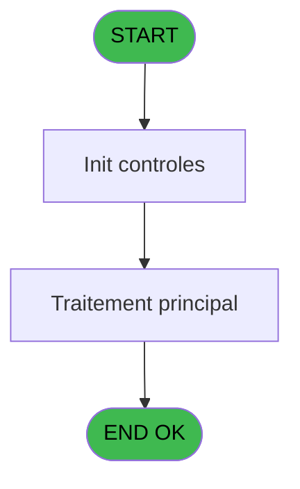
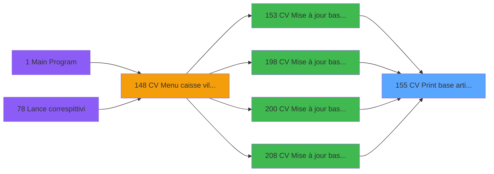

# VIL IDE 155 - CV  Print base articles

> **Analyse**: Phases 1-4 2026-02-03 09:47 -> 09:47 (21s) | Assemblage 09:47
> **Pipeline**: V7.2 Enrichi
> **Structure**: 4 onglets (Resume | Ecrans | Donnees | Connexions)

<!-- TAB:Resume -->

## 1. FICHE D'IDENTITE

| Attribut | Valeur |
|----------|--------|
| Projet | VIL |
| IDE Position | 155 |
| Nom Programme | CV  Print base articles |
| Fichier source | `Prg_155.xml` |
| Domaine metier | Ventes |
| Taches | 1 (0 ecrans visibles) |
| Tables modifiees | 0 |
| Programmes appeles | 0 |

## 2. DESCRIPTION FONCTIONNELLE

**CV  Print base articles** assure la gestion complete de ce processus, accessible depuis [CV  Mise à jour base articles (IDE 153)](VIL-IDE-153.md), [CV  Mise à jour base articles* (IDE 198)](VIL-IDE-198.md), [CV  Mise à jour base articles (IDE 200)](VIL-IDE-200.md), [CV  Mise à jour base articles (IDE 208)](VIL-IDE-208.md).

Le flux de traitement s'organise en **1 blocs fonctionnels** :

- **Traitement** (1 tache) : traitements metier divers

## 3. BLOCS FONCTIONNELS

### 3.1 Traitement (1 tache)

Traitements internes.

---

#### 155 - Veuillez patienter.... [[ECRAN]](#ecran-t1)

**Role** : Traitement : Veuillez patienter.....
**Ecran** : 426 x 56 DLU (MDI) | [Voir mockup](#ecran-t1)

## 5. REGLES METIER

*(Aucune regle metier identifiee)*

## 6. CONTEXTE

- **Appele par**: [CV  Mise à jour base articles (IDE 153)](VIL-IDE-153.md), [CV  Mise à jour base articles* (IDE 198)](VIL-IDE-198.md), [CV  Mise à jour base articles (IDE 200)](VIL-IDE-200.md), [CV  Mise à jour base articles (IDE 208)](VIL-IDE-208.md)
- **Appelle**: 0 programmes | **Tables**: 1 (W:0 R:1 L:0) | **Taches**: 1 | **Expressions**: 8

<!-- TAB:Ecrans -->

## 8. ECRANS

*(Programme sans ecran visible)*

## 9. NAVIGATION

### 9.3 Structure hierarchique (1 tache)

| Position | Tache | Type | Dimensions | Bloc |
|----------|-------|------|------------|------|
| **155.1** | [**Veuillez patienter....** (155)](#t1) [mockup](#ecran-t1) | MDI | 426x56 | Traitement |

### 9.4 Algorigramme

> **Legende**: Vert = START/END OK | Rouge = END KO | Bleu = Decisions
> *Algorigramme auto-genere. Utiliser `/algorigramme` pour une synthese metier detaillee.*

<!-- TAB:Donnees -->

## 10. TABLES

### Tables utilisees (1)

| ID | Nom | Description | Type | R | W | L | Usages |
|----|-----|-------------|------|---|---|---|--------|
| 77 | articles_________art | Articles et stock | DB | R |   |   | 1 |

### Colonnes par table (1 / 1 tables avec colonnes identifiees)

Table 77 - articles_________art (R) - 1 usages

| Lettre | Variable | Acces | Type |
|--------|----------|-------|------|
| A | P0 devise locale | R | Alpha |
| B | P0 masque mtt | R | Alpha |
| C | P0 nom village | R | Alpha |
| D | P0 service | R | Alpha |
| E | W0 config imp | R | Alpha |

## 11. VARIABLES

### 11.1 Parametres entrants (4)

Variables recues du programme appelant ([CV  Mise à jour base articles (IDE 153)](VIL-IDE-153.md)).

| Lettre | Nom | Type | Usage dans |
|--------|-----|------|-----------|
| A | P0 devise locale | Alpha | - |
| B | P0 masque mtt | Alpha | 1x parametre entrant |
| C | P0 nom village | Alpha | - |
| D | P0 service | Alpha | 2x parametre entrant |

### 11.2 Variables de travail (1)

Variables internes au programme.

| Lettre | Nom | Type | Usage dans |
|--------|-----|------|-----------|
| E | W0 config imp | Alpha | - |

## 12. EXPRESSIONS

**8 / 8 expressions decodees (100%)**

### 12.1 Repartition par type

| Type | Expressions | Regles |
|------|-------------|--------|
| CONCATENATION | 2 | 0 |
| DATE | 1 | 0 |
| OTHER | 4 | 0 |
| CONDITION | 1 | 0 |

### 12.2 Expressions cles par type

#### CONCATENATION (2 expressions)

| Type | IDE | Expression | Regle |
|------|-----|------------|-------|
| CONCATENATION | 1 | `MlsTrans ('ARTICLES DU SERVICE')&' '&Trim (P0 service [D])` | - |
| CONCATENATION | 7 | `'- '&Str (Page (0,1),'2P0Z0')&' -'` | - |

#### DATE (1 expressions)

| Type | IDE | Expression | Regle |
|------|-----|------------|-------|
| DATE | 4 | `Date ()` | - |

#### OTHER (4 expressions)

| Type | IDE | Expression | Regle |
|------|-----|------------|-------|
| OTHER | 5 | `P0 service [D]` | - |
| OTHER | 6 | `P0 masque mtt [B]` | - |
| OTHER | 2 | `SetCrsr (1)` | - |
| OTHER | 3 | `SetCrsr (2)` | - |

#### CONDITION (1 expressions)

| Type | IDE | Expression | Regle |
|------|-----|------------|-------|
| CONDITION | 8 | `INIGet ('[MAGIC_LOGICAL_NAMES]preview')='O'` | - |

<!-- TAB:Connexions -->

## 13. GRAPHE D'APPELS

### 13.1 Chaine depuis Main (Callers)

Main -> ... -> [CV  Mise à jour base articles (IDE 153)](VIL-IDE-153.md) -> **CV  Print base articles (IDE 155)**

Main -> ... -> [CV  Mise à jour base articles* (IDE 198)](VIL-IDE-198.md) -> **CV  Print base articles (IDE 155)**

Main -> ... -> [CV  Mise à jour base articles (IDE 200)](VIL-IDE-200.md) -> **CV  Print base articles (IDE 155)**

Main -> ... -> [CV  Mise à jour base articles (IDE 208)](VIL-IDE-208.md) -> **CV  Print base articles (IDE 155)**

### 13.2 Callers

| IDE | Nom Programme | Nb Appels |
|-----|---------------|-----------|
| [153](VIL-IDE-153.md) | CV  Mise à jour base articles | 1 |
| [198](VIL-IDE-198.md) | CV  Mise à jour base articles* | 1 |
| [200](VIL-IDE-200.md) | CV  Mise à jour base articles | 1 |
| [208](VIL-IDE-208.md) | CV  Mise à jour base articles | 1 |

### 13.3 Callees (programmes appeles)

### 13.4 Detail Callees avec contexte

| IDE | Nom Programme | Appels | Contexte |
|-----|---------------|--------|----------|
| - | (aucun) | - | - |

## 14. RECOMMANDATIONS MIGRATION

### 14.1 Profil du programme

| Metrique | Valeur | Impact migration |
|----------|--------|-----------------|
| Lignes de logique | 19 | Programme compact |
| Expressions | 8 | Peu de logique |
| Tables WRITE | 0 | Impact faible |
| Sous-programmes | 0 | Peu de dependances |
| Ecrans visibles | 0 | Ecran unique ou traitement batch |
| Code desactive | 0% (0 / 19) | Code sain |
| Regles metier | 0 | Pas de regle identifiee |

### 14.2 Plan de migration par bloc

#### Traitement (1 tache: 1 ecran, 0 traitement)

- **Strategie** : 1 composant(s) UI (Razor/React) avec formulaires et validation.
- Decomposer les taches en services unitaires testables.

### 14.3 Dependances critiques

| Dependance | Type | Appels | Impact |
|------------|------|--------|--------|

---
*Spec DETAILED generee par Pipeline V7.2 - 2026-02-03 09:47*
