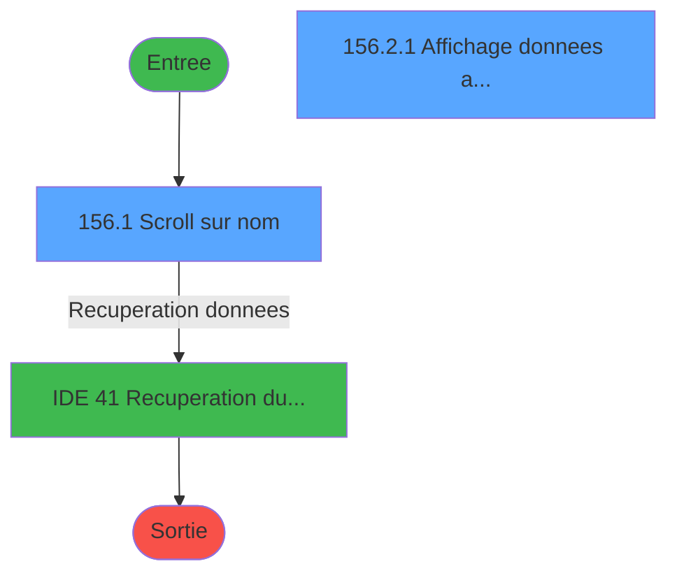
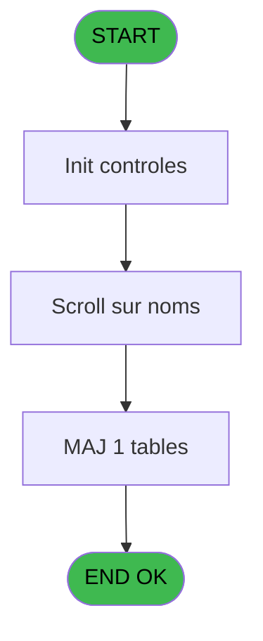
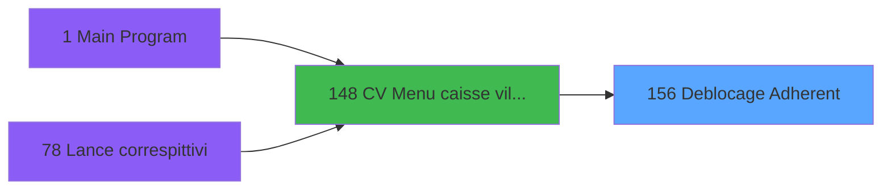
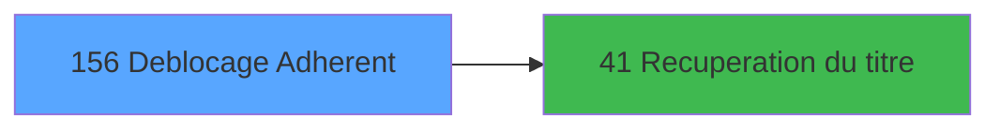

# VIL IDE 156 - Deblocage Adherent

> **Analyse**: Phases 1-4 2026-02-03 09:47 -> 09:47 (24s) | Assemblage 09:48
> **Pipeline**: V7.2 Enrichi
> **Structure**: 4 onglets (Resume | Ecrans | Donnees | Connexions)

<!-- TAB:Resume -->

## 1. FICHE D'IDENTITE

| Attribut | Valeur |
|----------|--------|
| Projet | VIL |
| IDE Position | 156 |
| Nom Programme | Deblocage Adherent |
| Fichier source | `Prg_156.xml` |
| Domaine metier | General |
| Taches | 6 (2 ecrans visibles) |
| Tables modifiees | 1 |
| Programmes appeles | 1 |

## 2. DESCRIPTION FONCTIONNELLE

**Deblocage Adherent** assure la gestion complete de ce processus, accessible depuis [CV  Menu caisse village (IDE 148)](VIL-IDE-148.md).

Le flux de traitement s'organise en **3 blocs fonctionnels** :

- **Traitement** (3 taches) : traitements metier divers
- **Consultation** (2 taches) : ecrans de recherche, selection et consultation
- **Calcul** (1 tache) : calculs de montants, stocks ou compteurs

**Donnees modifiees** : 1 tables en ecriture (compte_gm________cgm).

Detail : phases du traitement

#### Phase 1 : Traitement (3 taches)

- **156** - (sans nom) **[[ECRAN]](#ecran-t1)**
- **156.1** - Scroll sur nom **[[ECRAN]](#ecran-t2)**
- **156.2** - Menu caisse **[[ECRAN]](#ecran-t3)**

Delegue a : [Recuperation du titre (IDE 41)](VIL-IDE-41.md)

#### Phase 2 : Consultation (2 taches)

- **156.2.1** - Affichage donnees adherent **[[ECRAN]](#ecran-t4)**
- **156.2.2** - Affichage message etat **[[ECRAN]](#ecran-t5)**

Delegue a : [Recuperation du titre (IDE 41)](VIL-IDE-41.md)

#### Phase 3 : Calcul (1 tache)

- **156.2.2.1** - Deblocage compte CGM

#### Tables impactees

| Table | Operations | Role metier |
|-------|-----------|-------------|
| compte_gm________cgm | R/**W**/L (3 usages) | Comptes GM (generaux) |

## 3. BLOCS FONCTIONNELS

### 3.1 Traitement (3 taches)

Traitements internes.

---

#### 156 - (sans nom) [[ECRAN]](#ecran-t1)

**Role** : Traitement interne.
**Ecran** : 166 x 45 DLU (MDI) | [Voir mockup](#ecran-t1)
**Delegue a** : [Recuperation du titre (IDE 41)](VIL-IDE-41.md)

---

#### 156.1 - Scroll sur nom [[ECRAN]](#ecran-t2)

**Role** : Traitement : Scroll sur nom.
**Ecran** : 656 x 262 DLU (MDI) | [Voir mockup](#ecran-t2)
**Delegue a** : [Recuperation du titre (IDE 41)](VIL-IDE-41.md)

---

#### 156.2 - Menu caisse [[ECRAN]](#ecran-t3)

**Role** : Traitement : Menu caisse.
**Ecran** : 166 x 60 DLU (MDI) | [Voir mockup](#ecran-t3)
**Delegue a** : [Recuperation du titre (IDE 41)](VIL-IDE-41.md)

### 3.2 Consultation (2 taches)

Ecrans de recherche et consultation.

---

#### 156.2.1 - Affichage donnees adherent [[ECRAN]](#ecran-t4)

**Role** : Reinitialisation : Affichage donnees adherent.
**Ecran** : 691 x 177 DLU (MDI) | [Voir mockup](#ecran-t4)

---

#### 156.2.2 - Affichage message etat [[ECRAN]](#ecran-t5)

**Role** : Reinitialisation : Affichage message etat.
**Ecran** : 782 x 103 DLU (MDI) | [Voir mockup](#ecran-t5)

### 3.3 Calcul (1 tache)

Calculs metier : montants, stocks, compteurs.

---

#### 156.2.2.1 - Deblocage compte CGM

**Role** : Traitement : Deblocage compte CGM.

## 5. REGLES METIER

*(Aucune regle metier identifiee)*

## 6. CONTEXTE

- **Appele par**: [CV  Menu caisse village (IDE 148)](VIL-IDE-148.md)
- **Appelle**: 1 programmes | **Tables**: 6 (W:1 R:2 L:6) | **Taches**: 6 | **Expressions**: 10

<!-- TAB:Ecrans -->

## 8. ECRANS

### 8.1 Forms visibles (2 / 6)

| # | Position | Tache | Nom | Type | Largeur | Hauteur | Bloc |
|---|----------|-------|-----|------|---------|---------|------|
| 1 | 156.1 | 156.1 | Scroll sur nom | MDI | 656 | 262 | Traitement |
| 2 | 156.2.1 | 156.2.1 | Affichage donnees adherent | MDI | 691 | 177 | Consultation |

### 8.2 Mockups Ecrans

---

#### 156.1 - Scroll sur nom
**Tache** : [156.1](#t2) | **Type** : MDI | **Dimensions** : 656 x 262 DLU
**Bloc** : Traitement | **Titre IDE** : Scroll sur nom

<!-- FORM-DATA:
{
    "width":  656,
    "vFactor":  8,
    "type":  "MDI",
    "hFactor":  8,
    "controls":  [
                     {
                         "x":  2,
                         "type":  "label",
                         "var":  "",
                         "y":  1,
                         "w":  651,
                         "fmt":  "",
                         "name":  "",
                         "h":  17,
                         "color":  "",
                         "text":  "",
                         "parent":  null
                     },
                     {
                         "x":  31,
                         "type":  "label",
                         "var":  "",
                         "y":  27,
                         "w":  590,
                         "fmt":  "",
                         "name":  "",
                         "h":  188,
                         "color":  "",
                         "text":  "",
                         "parent":  null
                     },
                     {
                         "x":  65,
                         "type":  "table",
                         "var":  "",
                         "name":  "",
                         "titleH":  12,
                         "color":  "6",
                         "w":  522,
                         "y":  38,
                         "fmt":  "",
                         "parent":  null,
                         "text":  "",
                         "rowH":  13,
                         "h":  144,
                         "cols":  [
                                      {
                                          "title":  "Nom",
                                          "layer":  1,
                                          "w":  226
                                      },
                                      {
                                          "title":  "Prénom",
                                          "layer":  2,
                                          "w":  150
                                      },
                                      {
                                          "title":  "Sexe",
                                          "layer":  3,
                                          "w":  116
                                      }
                                  ],
                         "rows":  3
                     },
                     {
                         "x":  77,
                         "type":  "label",
                         "var":  "",
                         "y":  52,
                         "w":  21,
                         "fmt":  "",
                         "name":  "",
                         "h":  10,
                         "color":  "149",
                         "text":  "m",
                         "parent":  5
                     },
                     {
                         "x":  72,
                         "type":  "label",
                         "var":  "",
                         "y":  194,
                         "w":  229,
                         "fmt":  "",
                         "name":  "",
                         "h":  8,
                         "color":  "",
                         "text":  "Saisie du nom du GM",
                         "parent":  null
                     },
                     {
                         "x":  0,
                         "type":  "label",
                         "var":  "",
                         "y":  237,
                         "w":  653,
                         "fmt":  "",
                         "name":  "",
                         "h":  23,
                         "color":  "",
                         "text":  "",
                         "parent":  null
                     },
                     {
                         "x":  123,
                         "type":  "edit",
                         "var":  "",
                         "y":  53,
                         "w":  165,
                         "fmt":  "U14",
                         "name":  "",
                         "h":  8,
                         "color":  "6",
                         "text":  "",
                         "parent":  5
                     },
                     {
                         "x":  302,
                         "type":  "edit",
                         "var":  "",
                         "y":  53,
                         "w":  98,
                         "fmt":  "",
                         "name":  "",
                         "h":  8,
                         "color":  "6",
                         "text":  "",
                         "parent":  5
                     },
                     {
                         "x":  315,
                         "type":  "edit",
                         "var":  "",
                         "y":  192,
                         "w":  166,
                         "fmt":  "",
                         "name":  "W1 detecte \u0027*\u0027",
                         "h":  12,
                         "color":  "6",
                         "text":  "",
                         "parent":  null
                     },
                     {
                         "x":  331,
                         "type":  "edit",
                         "var":  "",
                         "y":  194,
                         "w":  120,
                         "fmt":  "",
                         "name":  "W1 chaîne_recherchee",
                         "h":  8,
                         "color":  "6",
                         "text":  "",
                         "parent":  null
                     },
                     {
                         "x":  13,
                         "type":  "edit",
                         "var":  "",
                         "y":  5,
                         "w":  267,
                         "fmt":  "20",
                         "name":  "",
                         "h":  8,
                         "color":  "",
                         "text":  "",
                         "parent":  1
                     },
                     {
                         "x":  438,
                         "type":  "edit",
                         "var":  "",
                         "y":  5,
                         "w":  203,
                         "fmt":  "WWW DD MMM YYYYT",
                         "name":  "",
                         "h":  8,
                         "color":  "",
                         "text":  "",
                         "parent":  1
                     },
                     {
                         "x":  520,
                         "type":  "image",
                         "var":  "",
                         "y":  52,
                         "w":  26,
                         "fmt":  "",
                         "name":  "",
                         "h":  10,
                         "color":  "",
                         "text":  "",
                         "parent":  5
                     },
                     {
                         "x":  461,
                         "type":  "edit",
                         "var":  "",
                         "y":  53,
                         "w":  30,
                         "fmt":  "2",
                         "name":  "",
                         "h":  8,
                         "color":  "6",
                         "text":  "",
                         "parent":  5
                     },
                     {
                         "x":  494,
                         "type":  "image",
                         "var":  "",
                         "y":  184,
                         "w":  122,
                         "fmt":  "",
                         "name":  "",
                         "h":  27,
                         "color":  "",
                         "text":  "",
                         "parent":  null
                     },
                     {
                         "x":  30,
                         "type":  "edit",
                         "var":  "",
                         "y":  218,
                         "w":  593,
                         "fmt":  "30",
                         "name":  "",
                         "h":  14,
                         "color":  "6",
                         "text":  "",
                         "parent":  null
                     },
                     {
                         "x":  8,
                         "type":  "button",
                         "var":  "",
                         "y":  240,
                         "w":  160,
                         "fmt":  "\u0026Quitter",
                         "name":  "",
                         "h":  18,
                         "color":  "",
                         "text":  "",
                         "parent":  null
                     }
                 ],
    "taskId":  "156.1",
    "height":  262
}
-->

<strong>Champs : 8 champs</strong>

| Pos (x,y) | Nom | Variable | Type |
|-----------|-----|----------|------|
| 123,53 | U14 | - | edit |
| 302,53 | (sans nom) | - | edit |
| 315,192 | W1 detecte '*' | - | edit |
| 331,194 | W1 chaîne_recherchee | - | edit |
| 13,5 | 20 | - | edit |
| 438,5 | WWW DD MMM YYYYT | - | edit |
| 461,53 | 2 | - | edit |
| 30,218 | 30 | - | edit |

<strong>Boutons : 1 boutons</strong>

| Bouton | Pos (x,y) | Action |
|--------|-----------|--------|
| Quitter | 8,240 | Quitte le programme |

---

#### 156.2.1 - Affichage donnees adherent
**Tache** : [156.2.1](#t4) | **Type** : MDI | **Dimensions** : 691 x 177 DLU
**Bloc** : Consultation | **Titre IDE** : Affichage donnees adherent

<!-- FORM-DATA:
{
    "width":  691,
    "vFactor":  8,
    "type":  "MDI",
    "hFactor":  8,
    "controls":  [
                     {
                         "x":  4,
                         "type":  "label",
                         "var":  "",
                         "y":  2,
                         "w":  684,
                         "fmt":  "",
                         "name":  "",
                         "h":  63,
                         "color":  "195",
                         "text":  "Renseignement compte",
                         "parent":  null
                     },
                     {
                         "x":  17,
                         "type":  "label",
                         "var":  "",
                         "y":  14,
                         "w":  80,
                         "fmt":  "",
                         "name":  "",
                         "h":  10,
                         "color":  "",
                         "text":  "Code GM",
                         "parent":  1
                     },
                     {
                         "x":  17,
                         "type":  "label",
                         "var":  "",
                         "y":  30,
                         "w":  144,
                         "fmt":  "",
                         "name":  "",
                         "h":  10,
                         "color":  "",
                         "text":  "Etat compte",
                         "parent":  1
                     },
                     {
                         "x":  275,
                         "type":  "label",
                         "var":  "",
                         "y":  30,
                         "w":  67,
                         "fmt":  "",
                         "name":  "",
                         "h":  10,
                         "color":  "",
                         "text":  "Solde",
                         "parent":  1
                     },
                     {
                         "x":  2,
                         "type":  "label",
                         "var":  "",
                         "y":  72,
                         "w":  684,
                         "fmt":  "",
                         "name":  "",
                         "h":  102,
                         "color":  "195",
                         "text":  "Renseignement adhérent",
                         "parent":  null
                     },
                     {
                         "x":  15,
                         "type":  "label",
                         "var":  "",
                         "y":  86,
                         "w":  37,
                         "fmt":  "",
                         "name":  "",
                         "h":  9,
                         "color":  "",
                         "text":  "Age",
                         "parent":  10
                     },
                     {
                         "x":  203,
                         "type":  "label",
                         "var":  "",
                         "y":  86,
                         "w":  131,
                         "fmt":  "",
                         "name":  "",
                         "h":  8,
                         "color":  "",
                         "text":  "Langue parlée",
                         "parent":  10
                     },
                     {
                         "x":  15,
                         "type":  "label",
                         "var":  "",
                         "y":  104,
                         "w":  66,
                         "fmt":  "",
                         "name":  "",
                         "h":  8,
                         "color":  "",
                         "text":  "Pass.n°",
                         "parent":  10
                     },
                     {
                         "x":  15,
                         "type":  "label",
                         "var":  "",
                         "y":  121,
                         "w":  56,
                         "fmt":  "",
                         "name":  "",
                         "h":  9,
                         "color":  "",
                         "text":  "Séjour",
                         "parent":  10
                     },
                     {
                         "x":  224,
                         "type":  "label",
                         "var":  "",
                         "y":  121,
                         "w":  27,
                         "fmt":  "",
                         "name":  "",
                         "h":  9,
                         "color":  "",
                         "text":  "du",
                         "parent":  10
                     },
                     {
                         "x":  458,
                         "type":  "label",
                         "var":  "",
                         "y":  121,
                         "w":  30,
                         "fmt":  "",
                         "name":  "",
                         "h":  9,
                         "color":  "",
                         "text":  "au",
                         "parent":  10
                     },
                     {
                         "x":  15,
                         "type":  "label",
                         "var":  "",
                         "y":  139,
                         "w":  110,
                         "fmt":  "",
                         "name":  "",
                         "h":  8,
                         "color":  "",
                         "text":  "Hébergement",
                         "parent":  10
                     },
                     {
                         "x":  371,
                         "type":  "label",
                         "var":  "",
                         "y":  140,
                         "w":  113,
                         "fmt":  "",
                         "name":  "",
                         "h":  9,
                         "color":  "",
                         "text":  "Logement",
                         "parent":  10
                     },
                     {
                         "x":  15,
                         "type":  "label",
                         "var":  "",
                         "y":  156,
                         "w":  42,
                         "fmt":  "",
                         "name":  "",
                         "h":  9,
                         "color":  "",
                         "text":  "Club",
                         "parent":  10
                     },
                     {
                         "x":  98,
                         "type":  "edit",
                         "var":  "",
                         "y":  156,
                         "w":  123,
                         "fmt":  "",
                         "name":  "",
                         "h":  9,
                         "color":  "",
                         "text":  "",
                         "parent":  10
                     },
                     {
                         "x":  233,
                         "type":  "edit",
                         "var":  "",
                         "y":  156,
                         "w":  22,
                         "fmt":  "",
                         "name":  "",
                         "h":  9,
                         "color":  "",
                         "text":  "",
                         "parent":  10
                     },
                     {
                         "x":  266,
                         "type":  "edit",
                         "var":  "",
                         "y":  156,
                         "w":  45,
                         "fmt":  "",
                         "name":  "",
                         "h":  9,
                         "color":  "",
                         "text":  "",
                         "parent":  10
                     },
                     {
                         "x":  279,
                         "type":  "edit",
                         "var":  "",
                         "y":  121,
                         "w":  168,
                         "fmt":  "WWW DD/MM/YYYYZ",
                         "name":  "",
                         "h":  9,
                         "color":  "",
                         "text":  "",
                         "parent":  10
                     },
                     {
                         "x":  500,
                         "type":  "edit",
                         "var":  "",
                         "y":  121,
                         "w":  168,
                         "fmt":  "WWW DD/MM/YYYYZ",
                         "name":  "",
                         "h":  9,
                         "color":  "",
                         "text":  "",
                         "parent":  10
                     },
                     {
                         "x":  158,
                         "type":  "edit",
                         "var":  "",
                         "y":  140,
                         "w":  45,
                         "fmt":  "U3",
                         "name":  "",
                         "h":  9,
                         "color":  "",
                         "text":  "",
                         "parent":  10
                     },
                     {
                         "x":  222,
                         "type":  "edit",
                         "var":  "",
                         "y":  140,
                         "w":  45,
                         "fmt":  "",
                         "name":  "",
                         "h":  9,
                         "color":  "",
                         "text":  "",
                         "parent":  10
                     },
                     {
                         "x":  499,
                         "type":  "edit",
                         "var":  "",
                         "y":  140,
                         "w":  78,
                         "fmt":  "",
                         "name":  "",
                         "h":  9,
                         "color":  "",
                         "text":  "",
                         "parent":  10
                     },
                     {
                         "x":  167,
                         "type":  "edit",
                         "var":  "",
                         "y":  30,
                         "w":  26,
                         "fmt":  "",
                         "name":  "",
                         "h":  10,
                         "color":  "",
                         "text":  "",
                         "parent":  1
                     },
                     {
                         "x":  338,
                         "type":  "edit",
                         "var":  "",
                         "y":  30,
                         "w":  227,
                         "fmt":  "N## ### ### ###.###Z",
                         "name":  "",
                         "h":  10,
                         "color":  "",
                         "text":  "",
                         "parent":  1
                     },
                     {
                         "x":  353,
                         "type":  "edit",
                         "var":  "",
                         "y":  86,
                         "w":  232,
                         "fmt":  "",
                         "name":  "",
                         "h":  8,
                         "color":  "",
                         "text":  "",
                         "parent":  10
                     },
                     {
                         "x":  17,
                         "type":  "edit",
                         "var":  "",
                         "y":  48,
                         "w":  131,
                         "fmt":  "11",
                         "name":  "",
                         "h":  10,
                         "color":  "",
                         "text":  "",
                         "parent":  1
                     },
                     {
                         "x":  167,
                         "type":  "edit",
                         "var":  "",
                         "y":  48,
                         "w":  126,
                         "fmt":  "DD/MM/YYYYZ",
                         "name":  "",
                         "h":  10,
                         "color":  "",
                         "text":  "",
                         "parent":  1
                     },
                     {
                         "x":  74,
                         "type":  "edit",
                         "var":  "",
                         "y":  86,
                         "w":  34,
                         "fmt":  "3",
                         "name":  "",
                         "h":  8,
                         "color":  "",
                         "text":  "",
                         "parent":  10
                     },
                     {
                         "x":  124,
                         "type":  "edit",
                         "var":  "",
                         "y":  86,
                         "w":  53,
                         "fmt":  "4",
                         "name":  "",
                         "h":  9,
                         "color":  "",
                         "text":  "",
                         "parent":  10
                     },
                     {
                         "x":  115,
                         "type":  "edit",
                         "var":  "",
                         "y":  104,
                         "w":  240,
                         "fmt":  "30",
                         "name":  "",
                         "h":  8,
                         "color":  "",
                         "text":  "",
                         "parent":  10
                     },
                     {
                         "x":  93,
                         "type":  "edit",
                         "var":  "",
                         "y":  121,
                         "w":  98,
                         "fmt":  "8",
                         "name":  "",
                         "h":  9,
                         "color":  "",
                         "text":  "",
                         "parent":  10
                     },
                     {
                         "x":  167,
                         "type":  "edit",
                         "var":  "",
                         "y":  14,
                         "w":  104,
                         "fmt":  "",
                         "name":  "",
                         "h":  10,
                         "color":  "",
                         "text":  "",
                         "parent":  1
                     }
                 ],
    "taskId":  "156.2.1",
    "height":  177
}
-->

<strong>Champs : 18 champs</strong>

| Pos (x,y) | Nom | Variable | Type |
|-----------|-----|----------|------|
| 98,156 | (sans nom) | - | edit |
| 233,156 | (sans nom) | - | edit |
| 266,156 | (sans nom) | - | edit |
| 279,121 | WWW DD/MM/YYYYZ | - | edit |
| 500,121 | WWW DD/MM/YYYYZ | - | edit |
| 158,140 | U3 | - | edit |
| 222,140 | (sans nom) | - | edit |
| 499,140 | (sans nom) | - | edit |
| 167,30 | (sans nom) | - | edit |
| 338,30 | N## ### ### ###.###Z | - | edit |
| 353,86 | (sans nom) | - | edit |
| 17,48 | 11 | - | edit |
| 167,48 | DD/MM/YYYYZ | - | edit |
| 74,86 | 3 | - | edit |
| 124,86 | 4 | - | edit |
| 115,104 | 30 | - | edit |
| 93,121 | 8 | - | edit |
| 167,14 | (sans nom) | - | edit |

## 9. NAVIGATION

### 9.1 Enchainement des ecrans

**Detail par enchainement :**

| Depuis | Action | Vers | Retour |
|--------|--------|------|--------|
| Scroll sur nom | Recuperation donnees | [Recuperation du titre (IDE 41)](VIL-IDE-41.md) | Retour ecran |

### 9.3 Structure hierarchique (6 taches)

| Position | Tache | Type | Dimensions | Bloc |
|----------|-------|------|------------|------|
| **156.1** | [**(sans nom)** (156)](#t1) [mockup](#ecran-t1) | MDI | 166x45 | Traitement |
| 156.1.1 | [Scroll sur nom (156.1)](#t2) [mockup](#ecran-t2) | MDI | 656x262 | |
| 156.1.2 | [Menu caisse (156.2)](#t3) [mockup](#ecran-t3) | MDI | 166x60 | |
| **156.2** | [**Affichage donnees adherent** (156.2.1)](#t4) [mockup](#ecran-t4) | MDI | 691x177 | Consultation |
| 156.2.1 | [Affichage message etat (156.2.2)](#t5) [mockup](#ecran-t5) | MDI | 782x103 | |
| **156.3** | [**Deblocage compte CGM** (156.2.2.1)](#t6) | MDI | - | Calcul |

### 9.4 Algorigramme

> **Legende**: Vert = START/END OK | Rouge = END KO | Bleu = Decisions
> *Algorigramme auto-genere. Utiliser `/algorigramme` pour une synthese metier detaillee.*

<!-- TAB:Donnees -->

## 10. TABLES

### Tables utilisees (6)

| ID | Nom | Description | Type | R | W | L | Usages |
|----|-----|-------------|------|---|---|---|--------|
| 30 | gm-recherche_____gmr | Index de recherche | DB | R |   | L | 2 |
| 31 | gm-complet_______gmc |  | DB |   |   | L | 1 |
| 34 | hebergement______heb | Hebergement (chambres) | DB |   |   | L | 1 |
| 47 | compte_gm________cgm | Comptes GM (generaux) | DB | R | **W** | L | 3 |
| 130 | fichier_langue |  | DB |   |   | L | 1 |
| 340 | histo_fusionseparation | Historique / journal | DB |   |   | L | 1 |

### Colonnes par table (2 / 2 tables avec colonnes identifiees)

Table 30 - gm-recherche_____gmr (R/L) - 2 usages

| Lettre | Variable | Acces | Type |
|--------|----------|-------|------|
| A | T Fusion/Separation | R | Logical |
| B | W1 control_fin | R | Alpha |
| C | W1 detecte '*' | R | Alpha |
| D | W1 chaîne_recherchee | R | Alpha |

Table 47 - compte_gm________cgm (R/**W**/L) - 3 usages

| Lettre | Variable | Acces | Type |
|--------|----------|-------|------|
| A | W2 ret.lien hebergem | W | Numeric |
| B | W2 date debut | W | Alpha |
| C | W2 date fin | W | Alpha |

## 11. VARIABLES

### 11.1 Parametres entrants (6)

Variables recues du programme appelant ([CV  Menu caisse village (IDE 148)](VIL-IDE-148.md)).

| Lettre | Nom | Type | Usage dans |
|--------|-----|------|-----------|
| A | P0 societe | Alpha | 1x parametre entrant |
| B | P0 nbre_de_decimales | Numeric | - |
| C | P0 masque montant | Alpha | - |
| D | P0 devise locale | Alpha | - |
| E | P. Nom village | Alpha | - |
| F | P. U(ni)/B(ilateral) | Alpha | - |

### 11.2 Variables de session (1)

Variables persistantes pendant toute la session.

| Lettre | Nom | Type | Usage dans |
|--------|-----|------|-----------|
| P | V F(usion) ou E(clatement) | Alpha | - |

### 11.3 Variables de travail (3)

Variables internes au programme.

| Lettre | Nom | Type | Usage dans |
|--------|-----|------|-----------|
| G | W0 choix action | Alpha | 3x calcul interne |
| N | W0 utilisation caiss | Alpha | - |
| O | W0 code retour | Alpha | - |

### 11.4 Autres (7)

Variables diverses.

| Lettre | Nom | Type | Usage dans |
|--------|-----|------|-----------|
| H | WP0 chaîne recherche | Alpha | - |
| I | WP0 code GM | Numeric | - |
| J | WP0 filiation | Numeric | - |
| K | WP0 prog d'appel | Alpha | - |
| L | WP0 fonction-call | Alpha | - |
| M | WP0 numero CAM | Numeric | - |
| Q | >v.titre | Alpha | 1x refs |

Toutes les 17 variables (liste complete)

| Cat | Lettre | Nom Variable | Type |
|-----|--------|--------------|------|
| P0 | **A** | P0 societe | Alpha |
| P0 | **B** | P0 nbre_de_decimales | Numeric |
| P0 | **C** | P0 masque montant | Alpha |
| P0 | **D** | P0 devise locale | Alpha |
| P0 | **E** | P. Nom village | Alpha |
| P0 | **F** | P. U(ni)/B(ilateral) | Alpha |
| W0 | **G** | W0 choix action | Alpha |
| W0 | **N** | W0 utilisation caiss | Alpha |
| W0 | **O** | W0 code retour | Alpha |
| V. | **P** | V F(usion) ou E(clatement) | Alpha |
| Autre | **H** | WP0 chaîne recherche | Alpha |
| Autre | **I** | WP0 code GM | Numeric |
| Autre | **J** | WP0 filiation | Numeric |
| Autre | **K** | WP0 prog d'appel | Alpha |
| Autre | **L** | WP0 fonction-call | Alpha |
| Autre | **M** | WP0 numero CAM | Numeric |
| Autre | **Q** | >v.titre | Alpha |

## 12. EXPRESSIONS

**10 / 10 expressions decodees (100%)**

### 12.1 Repartition par type

| Type | Expressions | Regles |
|------|-------------|--------|
| CONSTANTE | 5 | 0 |
| CONDITION | 5 | 0 |

### 12.2 Expressions cles par type

#### CONSTANTE (5 expressions)

| Type | IDE | Expression | Regle |
|------|-----|------------|-------|
| CONSTANTE | 8 | `'L'` | - |
| CONSTANTE | 9 | `'S'` | - |
| CONSTANTE | 7 | `'M'` | - |
| CONSTANTE | 2 | `'C'` | - |
| CONSTANTE | 4 | `141` | - |

#### CONDITION (5 expressions)

| Type | IDE | Expression | Regle |
|------|-----|------------|-------|
| CONDITION | 10 | `W0 choix action [G]='F'` | - |
| CONDITION | 3 | `Trim (>v.titre [Q])` | - |
| CONDITION | 6 | `W0 choix action [G]='M'` | - |
| CONDITION | 1 | `P0 societe [A]=''` | - |
| CONDITION | 5 | `W0 choix action [G]='S'` | - |

<!-- TAB:Connexions -->

## 13. GRAPHE D'APPELS

### 13.1 Chaine depuis Main (Callers)

Main -> ... -> [CV  Menu caisse village (IDE 148)](VIL-IDE-148.md) -> **Deblocage Adherent (IDE 156)**

### 13.2 Callers

| IDE | Nom Programme | Nb Appels |
|-----|---------------|-----------|
| [148](VIL-IDE-148.md) | CV  Menu caisse village | 1 |

### 13.3 Callees (programmes appeles)

### 13.4 Detail Callees avec contexte

| IDE | Nom Programme | Appels | Contexte |
|-----|---------------|--------|----------|
| [41](VIL-IDE-41.md) | Recuperation du titre | 1 | Recuperation donnees |

## 14. RECOMMANDATIONS MIGRATION

### 14.1 Profil du programme

| Metrique | Valeur | Impact migration |
|----------|--------|-----------------|
| Lignes de logique | 160 | Programme compact |
| Expressions | 10 | Peu de logique |
| Tables WRITE | 1 | Impact faible |
| Sous-programmes | 1 | Peu de dependances |
| Ecrans visibles | 2 | Quelques ecrans |
| Code desactive | 0% (0 / 160) | Code sain |
| Regles metier | 0 | Pas de regle identifiee |

### 14.2 Plan de migration par bloc

#### Traitement (3 taches: 3 ecrans, 0 traitement)

- **Strategie** : 3 composant(s) UI (Razor/React) avec formulaires et validation.
- 1 sous-programme(s) a migrer ou a reutiliser depuis les services existants.
- Decomposer les taches en services unitaires testables.

#### Consultation (2 taches: 2 ecrans, 0 traitement)

- **Strategie** : Composants de recherche/selection en modales.
- 2 ecrans : Affichage donnees adherent, Affichage message etat

#### Calcul (1 tache: 0 ecran, 1 traitement)

- **Strategie** : Services de calcul purs (Domain Services).
- Migrer la logique de calcul (stock, compteurs, montants)

### 14.3 Dependances critiques

| Dependance | Type | Appels | Impact |
|------------|------|--------|--------|
| compte_gm________cgm | Table WRITE (Database) | 1x | Schema + repository |
| [Recuperation du titre (IDE 41)](VIL-IDE-41.md) | Sous-programme | 1x | Normale - Recuperation donnees |

---
*Spec DETAILED generee par Pipeline V7.2 - 2026-02-03 09:48*
