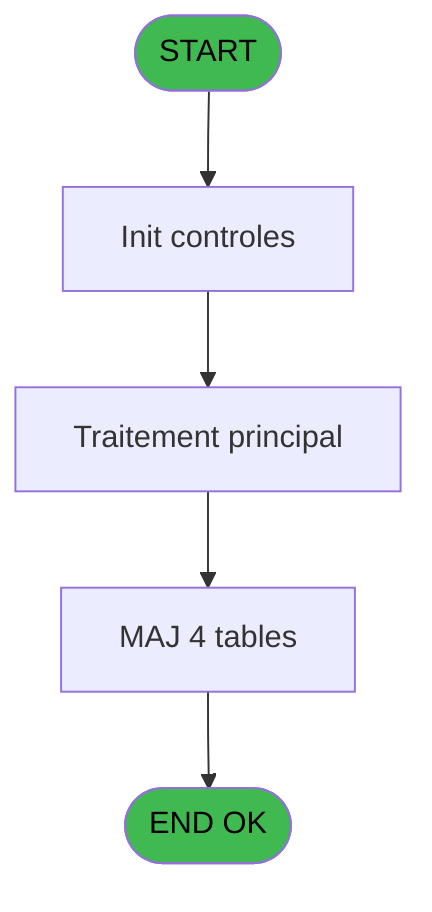
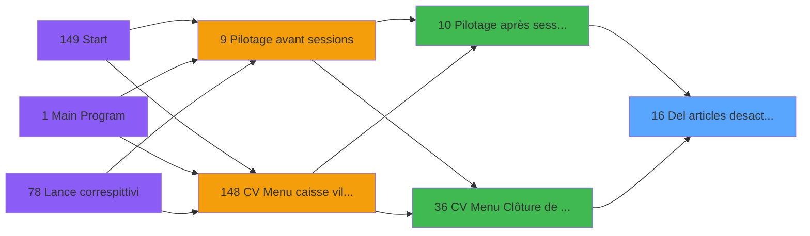

# VIL IDE 16 - Del articles desactives

> **Analyse**: Phases 1-4 2026-02-03 01:02 -> 01:03 (38s) | Assemblage 01:03
> **Pipeline**: V7.2 Enrichi
> **Structure**: 4 onglets (Resume | Ecrans | Donnees | Connexions)

<!-- TAB:Resume -->

## 1. FICHE D'IDENTITE

| Attribut | Valeur |
|----------|--------|
| Projet | VIL |
| IDE Position | 16 |
| Nom Programme | Del articles desactives |
| Fichier source | `Prg_16.xml` |
| Domaine metier | Ventes |
| Taches | 4 (1 ecrans visibles) |
| Tables modifiees | 4 |
| Programmes appeles | 0 |

## 2. DESCRIPTION FONCTIONNELLE

**Del articles desactives** assure la gestion complete de ce processus, accessible depuis [Pilotage après sessions (IDE 10)](VIL-IDE-10.md), [CV  Menu Clôture de caisse (IDE 36)](VIL-IDE-36.md).

Le flux de traitement s'organise en **1 blocs fonctionnels** :

- **Traitement** (4 taches) : traitements metier divers

**Donnees modifiees** : 4 tables en ecriture (articles_________art, table_prestation_pre, table_art__prest_arp, correspondance_article).

Detail : phases du traitement

#### Phase 1 : Traitement (4 taches)

- **16** - Veuillez patienter... **[[ECRAN]](#ecran-t1)**
- **16.1** - Suppression PRES et ARP
- **16.1.1** - Suppression ARP
- **16.2** - Suppression PRES et ARP

#### Tables impactees

| Table | Operations | Role metier |
|-------|-----------|-------------|
| correspondance_article | **W** (1 usages) | Articles et stock |
| articles_________art | **W** (1 usages) | Articles et stock |
| table_prestation_pre | **W** (1 usages) | Prestations/services vendus |
| table_art__prest_arp | **W** (1 usages) |  |

## 3. BLOCS FONCTIONNELS

### 3.1 Traitement (4 taches)

Traitements internes.

---

#### 16 - Veuillez patienter... [[ECRAN]](#ecran-t1)

**Role** : Traitement : Veuillez patienter....
**Ecran** : 424 x 58 DLU (MDI) | [Voir mockup](#ecran-t1)

3 sous-taches directes

| Tache | Nom | Bloc |
|-------|-----|------|
| [16.1](#t2) | Suppression PRES et ARP | Traitement |
| [16.1.1](#t3) | Suppression ARP | Traitement |
| [16.2](#t4) | Suppression PRES et ARP | Traitement |

---

#### 16.1 - Suppression PRES et ARP

**Role** : Traitement : Suppression PRES et ARP.

---

#### 16.1.1 - Suppression ARP

**Role** : Traitement : Suppression ARP.

---

#### 16.2 - Suppression PRES et ARP

**Role** : Traitement : Suppression PRES et ARP.

## 5. REGLES METIER

*(Aucune regle metier identifiee)*

## 6. CONTEXTE

- **Appele par**: [Pilotage après sessions (IDE 10)](VIL-IDE-10.md), [CV  Menu Clôture de caisse (IDE 36)](VIL-IDE-36.md)
- **Appelle**: 0 programmes | **Tables**: 4 (W:4 R:0 L:0) | **Taches**: 4 | **Expressions**: 4

<!-- TAB:Ecrans -->

## 8. ECRANS

### 8.1 Forms visibles (1 / 4)

| # | Position | Tache | Nom | Type | Largeur | Hauteur | Bloc |
|---|----------|-------|-----|------|---------|---------|------|
| 1 | 16 | 16 | Veuillez patienter... | MDI | 424 | 58 | Traitement |

### 8.2 Mockups Ecrans

---

#### 16 - Veuillez patienter...
**Tache** : [16](#t1) | **Type** : MDI | **Dimensions** : 424 x 58 DLU
**Bloc** : Traitement | **Titre IDE** : Veuillez patienter...

<!-- FORM-DATA:
{
    "width":  424,
    "vFactor":  8,
    "type":  "MDI",
    "hFactor":  8,
    "controls":  [
                     {
                         "x":  0,
                         "type":  "label",
                         "var":  "",
                         "y":  0,
                         "w":  423,
                         "fmt":  "",
                         "name":  "",
                         "h":  29,
                         "color":  "",
                         "text":  "",
                         "parent":  null
                     },
                     {
                         "x":  125,
                         "type":  "label",
                         "var":  "",
                         "y":  10,
                         "w":  254,
                         "fmt":  "",
                         "name":  "",
                         "h":  8,
                         "color":  "7",
                         "text":  "Traitement en cours...",
                         "parent":  null
                     },
                     {
                         "x":  0,
                         "type":  "label",
                         "var":  "",
                         "y":  29,
                         "w":  423,
                         "fmt":  "",
                         "name":  "",
                         "h":  27,
                         "color":  "",
                         "text":  "",
                         "parent":  null
                     },
                     {
                         "x":  42,
                         "type":  "label",
                         "var":  "",
                         "y":  38,
                         "w":  346,
                         "fmt":  "",
                         "name":  "",
                         "h":  8,
                         "color":  "",
                         "text":  "Suppression des articles desactives",
                         "parent":  4
                     },
                     {
                         "x":  4,
                         "type":  "image",
                         "var":  "",
                         "y":  2,
                         "w":  72,
                         "fmt":  "",
                         "name":  "",
                         "h":  25,
                         "color":  "",
                         "text":  "",
                         "parent":  null
                     }
                 ],
    "taskId":  "16",
    "height":  58
}
-->

## 9. NAVIGATION

Ecran unique: **Veuillez patienter...**

### 9.3 Structure hierarchique (4 taches)

| Position | Tache | Type | Dimensions | Bloc |
|----------|-------|------|------------|------|
| **16.1** | [**Veuillez patienter...** (16)](#t1) [mockup](#ecran-t1) | MDI | 424x58 | Traitement |
| 16.1.1 | [Suppression PRES et ARP (16.1)](#t2) | MDI | - | |
| 16.1.2 | [Suppression ARP (16.1.1)](#t3) | MDI | - | |
| 16.1.3 | [Suppression PRES et ARP (16.2)](#t4) | MDI | - | |

### 9.4 Algorigramme

> **Legende**: Vert = START/END OK | Rouge = END KO | Bleu = Decisions
> *Algorigramme auto-genere. Utiliser `/algorigramme` pour une synthese metier detaillee.*

<!-- TAB:Donnees -->

## 10. TABLES

### Tables utilisees (4)

| ID | Nom | Description | Type | R | W | L | Usages |
|----|-----|-------------|------|---|---|---|--------|
| 77 | articles_________art | Articles et stock | DB |   | **W** |   | 1 |
| 96 | table_prestation_pre | Prestations/services vendus | DB |   | **W** |   | 1 |
| 97 | table_art__prest_arp |  | DB |   | **W** |   | 1 |
| 279 | correspondance_article | Articles et stock | DB |   | **W** |   | 1 |

### Colonnes par table (0 / 4 tables avec colonnes identifiees)

Table 77 - articles_________art (**W**) - 1 usages

*Table utilisee uniquement en Link ou aucune colonne Real identifiee dans le DataView.*

Table 96 - table_prestation_pre (**W**) - 1 usages

*Table utilisee uniquement en Link ou aucune colonne Real identifiee dans le DataView.*

Table 97 - table_art__prest_arp (**W**) - 1 usages

*Table utilisee uniquement en Link ou aucune colonne Real identifiee dans le DataView.*

Table 279 - correspondance_article (**W**) - 1 usages

*Table utilisee uniquement en Link ou aucune colonne Real identifiee dans le DataView.*

## 11. VARIABLES

*(Programme sans variables locales mappees)*

## 12. EXPRESSIONS

**4 / 4 expressions decodees (100%)**

### 12.1 Repartition par type

| Type | Expressions | Regles |
|------|-------------|--------|
| CONDITION | 4 | 0 |

### 12.2 Expressions cles par type

#### CONDITION (4 expressions)

| Type | IDE | Expression | Regle |
|------|-----|------------|-------|
| CONDITION | 3 | `INIGet ('[MAGIC_LOGICAL_NAMES]Club_Monetique_Datagram')='O' AND [B]='X'` | - |
| CONDITION | 4 | `[I]<>'VRL' AND [I]<>'VSL'` | - |
| CONDITION | 1 | `[B]='X'` | - |
| CONDITION | 2 | `[D]='O' AND [B]='X'` | - |

<!-- TAB:Connexions -->

## 13. GRAPHE D'APPELS

### 13.1 Chaine depuis Main (Callers)

Main -> ... -> [Pilotage après sessions (IDE 10)](VIL-IDE-10.md) -> **Del articles desactives (IDE 16)**

Main -> ... -> [CV  Menu Clôture de caisse (IDE 36)](VIL-IDE-36.md) -> **Del articles desactives (IDE 16)**

### 13.2 Callers

| IDE | Nom Programme | Nb Appels |
|-----|---------------|-----------|
| [10](VIL-IDE-10.md) | Pilotage après sessions | 1 |
| [36](VIL-IDE-36.md) | CV  Menu Clôture de caisse | 1 |

### 13.3 Callees (programmes appeles)

### 13.4 Detail Callees avec contexte

| IDE | Nom Programme | Appels | Contexte |
|-----|---------------|--------|----------|
| - | (aucun) | - | - |

## 14. RECOMMANDATIONS MIGRATION

### 14.1 Profil du programme

| Metrique | Valeur | Impact migration |
|----------|--------|-----------------|
| Lignes de logique | 18 | Programme compact |
| Expressions | 4 | Peu de logique |
| Tables WRITE | 4 | Impact modere |
| Sous-programmes | 0 | Peu de dependances |
| Ecrans visibles | 1 | Ecran unique ou traitement batch |
| Code desactive | 0% (0 / 18) | Code sain |
| Regles metier | 0 | Pas de regle identifiee |

### 14.2 Plan de migration par bloc

#### Traitement (4 taches: 1 ecran, 3 traitements)

- **Strategie** : Orchestrateur avec 1 ecrans (Razor/React) et 3 traitements backend (services).
- Les ecrans deviennent des composants UI, les traitements invisibles deviennent des services injectables.
- Decomposer les taches en services unitaires testables.

### 14.3 Dependances critiques

| Dependance | Type | Appels | Impact |
|------------|------|--------|--------|
| articles_________art | Table WRITE (Database) | 1x | Schema + repository |
| table_prestation_pre | Table WRITE (Database) | 1x | Schema + repository |
| table_art__prest_arp | Table WRITE (Database) | 1x | Schema + repository |
| correspondance_article | Table WRITE (Database) | 1x | Schema + repository |

---
*Spec DETAILED generee par Pipeline V7.2 - 2026-02-03 01:03*
