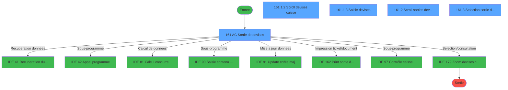
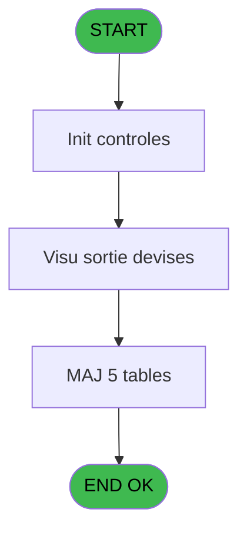
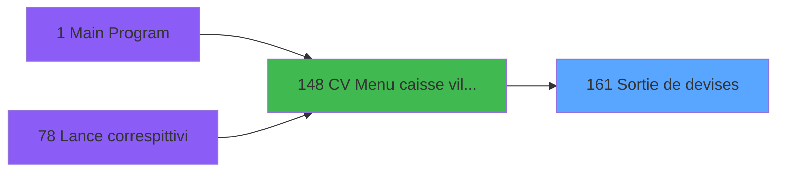
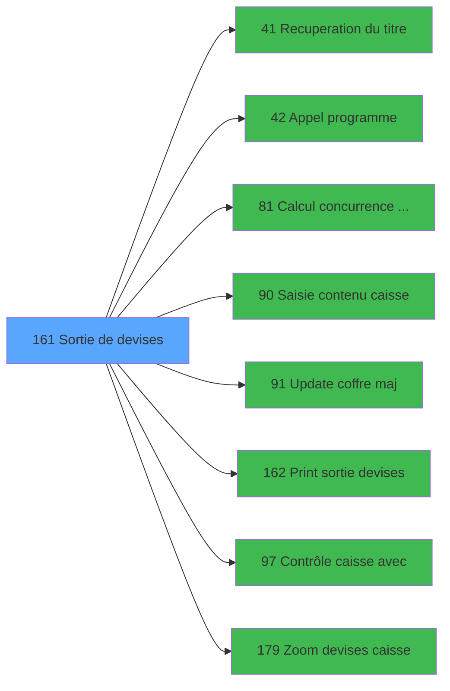

# VIL IDE 161 - Sortie de devises

> **Analyse**: Phases 1-4 2026-02-03 09:50 -> 09:50 (20s) | Assemblage 09:50
> **Pipeline**: V7.2 Enrichi
> **Structure**: 4 onglets (Resume | Ecrans | Donnees | Connexions)

<!-- TAB:Resume -->

## 1. FICHE D'IDENTITE

| Attribut | Valeur |
|----------|--------|
| Projet | VIL |
| IDE Position | 161 |
| Nom Programme | Sortie de devises |
| Fichier source | `Prg_161.xml` |
| Domaine metier | Change |
| Taches | 16 (5 ecrans visibles) |
| Tables modifiees | 5 |
| Programmes appeles | 8 |

## 2. DESCRIPTION FONCTIONNELLE

**Sortie de devises** assure la gestion complete de ce processus, accessible depuis [CV  Menu caisse village (IDE 148)](VIL-IDE-148.md).

Le flux de traitement s'organise en **4 blocs fonctionnels** :

- **Traitement** (12 taches) : traitements metier divers
- **Saisie** (2 taches) : ecrans de saisie utilisateur (formulaires, champs, donnees)
- **Calcul** (1 tache) : calculs de montants, stocks ou compteurs
- **Consultation** (1 tache) : ecrans de recherche, selection et consultation

**Donnees modifiees** : 5 tables en ecriture (reseau_cloture___rec, devises_caisse___ddk, sorties_devises__sdk, lign_sortie_dev__ldk, suivi_pdc).

Detail : phases du traitement

#### Phase 1 : Traitement (12 taches)

- **161** - AC  Sortie de devises **[[ECRAN]](#ecran-t1)**
- **161.1.1** - Test si cloture en cours
- **161.1.1.1** - Blocage cloture v1
- **161.1.2** - Scroll devises caisse **[[ECRAN]](#ecran-t5)**
- **161.1.3.1** - MàJ ligne sortie devise
- **161.1.3.2** - MàJ sortie devise
- **161.1.4** - Deblocage cloture v1
- **161.2** - Scroll sorties devises **[[ECRAN]](#ecran-t10)**
- **161.4** - Lecture dernière sortie
- **161.1.1.2** - Blocage cloture v1
- **161.1.5** - Deblocage cloture v1
- **161.1.6** - (sans nom)

Delegue a : [Recuperation du titre (IDE 41)](VIL-IDE-41.md), [Appel programme (IDE 42)](VIL-IDE-42.md), [Update coffre maj (IDE 91)](VIL-IDE-91.md), [Contrôle caisse avec (IDE 97)](VIL-IDE-97.md)

#### Phase 2 : Saisie (2 taches)

- **161.1** - Saisie devises **[[ECRAN]](#ecran-t2)**
- **161.1.3** - Saisie devises **[[ECRAN]](#ecran-t6)**

Delegue a : [Saisie contenu caisse (IDE 90)](VIL-IDE-90.md)

#### Phase 3 : Consultation (1 tache)

- **161.3** - Selection sortie devise **[[ECRAN]](#ecran-t11)**

Delegue a : [Recuperation du titre (IDE 41)](VIL-IDE-41.md), [Zoom  devises caisse (IDE 179)](VIL-IDE-179.md)

#### Phase 4 : Calcul (1 tache)

- **161.5** - Lecture date comptable

Delegue a : [Calcul concurrence sessions v1 (IDE 81)](VIL-IDE-81.md)

#### Tables impactees

| Table | Operations | Role metier |
|-------|-----------|-------------|
| reseau_cloture___rec | R/**W** (5 usages) | Donnees reseau/cloture |
| sorties_devises__sdk | R/**W** (3 usages) | Devises / taux de change |
| lign_sortie_dev__ldk | R/**W**/L (3 usages) |  |
| devises_caisse___ddk | R/**W** (2 usages) | Sessions de caisse |
| suivi_pdc | **W** (1 usages) |  |

## 3. BLOCS FONCTIONNELS

### 3.1 Traitement (12 taches)

Traitements internes.

---

#### 161 - AC  Sortie de devises [[ECRAN]](#ecran-t1)

**Role** : Tache d'orchestration : point d'entree du programme (12 sous-taches). Coordonne l'enchainement des traitements.
**Ecran** : 822 x 223 DLU (MDI) | [Voir mockup](#ecran-t1)

11 sous-taches directes

| Tache | Nom | Bloc |
|-------|-----|------|
| [161.1.1](#t3) | Test si cloture en cours | Traitement |
| [161.1.1.1](#t4) | Blocage cloture v1 | Traitement |
| [161.1.2](#t5) | Scroll devises caisse **[[ECRAN]](#ecran-t5)** | Traitement |
| [161.1.3.1](#t7) | MàJ ligne sortie devise | Traitement |
| [161.1.3.2](#t8) | MàJ sortie devise | Traitement |
| [161.1.4](#t9) | Deblocage cloture v1 | Traitement |
| [161.2](#t10) | Scroll sorties devises **[[ECRAN]](#ecran-t10)** | Traitement |
| [161.4](#t12) | Lecture dernière sortie | Traitement |
| [161.1.1.2](#t16) | Blocage cloture v1 | Traitement |
| [161.1.5](#t19) | Deblocage cloture v1 | Traitement |
| [161.1.6](#t20) | (sans nom) | Traitement |

**Variables liees** : M (W0 date sortie visu), N (W0 heure sortie visu), O (W0 last-sortie date), X (V. Comptage post entree/sortie)

---

#### 161.1.1 - Test si cloture en cours

**Role** : Verification : Test si cloture en cours.
**Variables liees** : U (v cloture_auto), V (v saisie reception en cours)

---

#### 161.1.1.1 - Blocage cloture v1

**Role** : Traitement : Blocage cloture v1.
**Variables liees** : U (v cloture_auto)

---

#### 161.1.2 - Scroll devises caisse [[ECRAN]](#ecran-t5)

**Role** : Traitement : Scroll devises caisse.
**Ecran** : 957 x 223 DLU (MDI) | [Voir mockup](#ecran-t5)

---

#### 161.1.3.1 - MàJ ligne sortie devise

**Role** : Traitement : MàJ ligne sortie devise.
**Variables liees** : M (W0 date sortie visu), N (W0 heure sortie visu), O (W0 last-sortie date), P (W0 nbre de lignes), X (V. Comptage post entree/sortie)

---

#### 161.1.3.2 - MàJ sortie devise

**Role** : Traitement : MàJ sortie devise.
**Variables liees** : M (W0 date sortie visu), N (W0 heure sortie visu), O (W0 last-sortie date), X (V. Comptage post entree/sortie), B (Param devise locale)

---

#### 161.1.4 - Deblocage cloture v1

**Role** : Traitement : Deblocage cloture v1.
**Variables liees** : U (v cloture_auto)

---

#### 161.2 - Scroll sorties devises [[ECRAN]](#ecran-t10)

**Role** : Traitement : Scroll sorties devises.
**Ecran** : 942 x 217 DLU (MDI) | [Voir mockup](#ecran-t10)

---

#### 161.4 - Lecture dernière sortie

**Role** : Traitement : Lecture dernière sortie.
**Variables liees** : M (W0 date sortie visu), N (W0 heure sortie visu), O (W0 last-sortie date), S (V Date comptable (dernière)), X (V. Comptage post entree/sortie)

---

#### 161.1.1.2 - Blocage cloture v1

**Role** : Traitement : Blocage cloture v1.
**Variables liees** : U (v cloture_auto)

---

#### 161.1.5 - Deblocage cloture v1

**Role** : Traitement : Deblocage cloture v1.
**Variables liees** : U (v cloture_auto)

---

#### 161.1.6 - (sans nom)

**Role** : Traitement interne.

### 3.2 Saisie (2 taches)

L'operateur saisit les donnees de la transaction via 2 ecrans (Saisie devises, Saisie devises).

---

#### 161.1 - Saisie devises [[ECRAN]](#ecran-t2)

**Role** : Saisie des donnees : Saisie devises.
**Ecran** : 8 x 8 DLU (MDI) | [Voir mockup](#ecran-t2)
**Variables liees** : V (v saisie reception en cours)
**Delegue a** : [Saisie contenu caisse (IDE 90)](VIL-IDE-90.md)

---

#### 161.1.3 - Saisie devises [[ECRAN]](#ecran-t6)

**Role** : Saisie des donnees : Saisie devises.
**Ecran** : 621 x 85 DLU (MDI) | [Voir mockup](#ecran-t6)
**Variables liees** : V (v saisie reception en cours)
**Delegue a** : [Saisie contenu caisse (IDE 90)](VIL-IDE-90.md)

### 3.3 Consultation (1 tache)

Ecrans de recherche et consultation.

---

#### 161.3 - Selection sortie devise [[ECRAN]](#ecran-t11)

**Role** : Selection par l'operateur : Selection sortie devise.
**Ecran** : 557 x 162 DLU (MDI) | [Voir mockup](#ecran-t11)
**Variables liees** : M (W0 date sortie visu), N (W0 heure sortie visu), O (W0 last-sortie date), X (V. Comptage post entree/sortie), B (Param devise locale)
**Delegue a** : [Zoom  devises caisse (IDE 179)](VIL-IDE-179.md)

### 3.4 Calcul (1 tache)

Calculs metier : montants, stocks, compteurs.

---

#### 161.5 - Lecture date comptable

**Role** : Traitement : Lecture date comptable.
**Variables liees** : K (W0 date comptable), L (W0 date cmpt visu), M (W0 date sortie visu), O (W0 last-sortie date), S (V Date comptable (dernière))
**Delegue a** : [Calcul concurrence sessions v1 (IDE 81)](VIL-IDE-81.md)

## 5. REGLES METIER

*(Aucune regle metier identifiee)*

## 6. CONTEXTE

- **Appele par**: [CV  Menu caisse village (IDE 148)](VIL-IDE-148.md)
- **Appelle**: 8 programmes | **Tables**: 9 (W:5 R:5 L:4) | **Taches**: 16 | **Expressions**: 14

<!-- TAB:Ecrans -->

## 8. ECRANS

### 8.1 Forms visibles (5 / 16)

| # | Position | Tache | Nom | Type | Largeur | Hauteur | Bloc |
|---|----------|-------|-----|------|---------|---------|------|
| 1 | 161 | 161 | AC  Sortie de devises | MDI | 822 | 223 | Traitement |
| 2 | 161.1.2 | 161.1.2 | Scroll devises caisse | MDI | 957 | 223 | Traitement |
| 3 | 161.1.3 | 161.1.3 | Saisie devises | MDI | 621 | 85 | Saisie |
| 4 | 161.2 | 161.2 | Scroll sorties devises | MDI | 942 | 217 | Traitement |
| 5 | 161.3 | 161.3 | Selection sortie devise | MDI | 557 | 162 | Consultation |

### 8.2 Mockups Ecrans

---

#### 161 - AC  Sortie de devises
**Tache** : [161](#t1) | **Type** : MDI | **Dimensions** : 822 x 223 DLU
**Bloc** : Traitement | **Titre IDE** : AC  Sortie de devises

<!-- FORM-DATA:
{
    "width":  822,
    "vFactor":  8,
    "type":  "MDI",
    "hFactor":  8,
    "controls":  [
                     {
                         "x":  0,
                         "type":  "label",
                         "var":  "",
                         "y":  0,
                         "w":  817,
                         "fmt":  "",
                         "name":  "",
                         "h":  17,
                         "color":  "",
                         "text":  "",
                         "parent":  null
                     },
                     {
                         "x":  54,
                         "type":  "label",
                         "var":  "",
                         "y":  27,
                         "w":  709,
                         "fmt":  "",
                         "name":  "",
                         "h":  154,
                         "color":  "",
                         "text":  "",
                         "parent":  null
                     },
                     {
                         "x":  152,
                         "type":  "label",
                         "var":  "",
                         "y":  99,
                         "w":  513,
                         "fmt":  "",
                         "name":  "",
                         "h":  74,
                         "color":  "",
                         "text":  "",
                         "parent":  null
                     },
                     {
                         "x":  154,
                         "type":  "label",
                         "var":  "",
                         "y":  100,
                         "w":  509,
                         "fmt":  "",
                         "name":  "",
                         "h":  72,
                         "color":  "",
                         "text":  "",
                         "parent":  null
                     },
                     {
                         "x":  198,
                         "type":  "label",
                         "var":  "",
                         "y":  109,
                         "w":  455,
                         "fmt":  "",
                         "name":  "",
                         "h":  42,
                         "color":  "",
                         "text":  "",
                         "parent":  null
                     },
                     {
                         "x":  201,
                         "type":  "label",
                         "var":  "",
                         "y":  110,
                         "w":  50,
                         "fmt":  "",
                         "name":  "",
                         "h":  40,
                         "color":  "",
                         "text":  "",
                         "parent":  null
                     },
                     {
                         "x":  257,
                         "type":  "label",
                         "var":  "",
                         "y":  116,
                         "w":  378,
                         "fmt":  "",
                         "name":  "",
                         "h":  8,
                         "color":  "7",
                         "text":  "Rappel d\u0027une Entrée/Sortie existante",
                         "parent":  null
                     },
                     {
                         "x":  257,
                         "type":  "label",
                         "var":  "",
                         "y":  134,
                         "w":  363,
                         "fmt":  "",
                         "name":  "",
                         "h":  8,
                         "color":  "7",
                         "text":  "Création d\u0027une nouvelle Entrée/Sortie",
                         "parent":  null
                     },
                     {
                         "x":  290,
                         "type":  "label",
                         "var":  "",
                         "y":  157,
                         "w":  192,
                         "fmt":  "",
                         "name":  "",
                         "h":  8,
                         "color":  "",
                         "text":  "Choix de l\u0027action",
                         "parent":  null
                     },
                     {
                         "x":  0,
                         "type":  "label",
                         "var":  "",
                         "y":  197,
                         "w":  818,
                         "fmt":  "",
                         "name":  "",
                         "h":  23,
                         "color":  "",
                         "text":  "",
                         "parent":  null
                     },
                     {
                         "x":  96,
                         "type":  "label",
                         "var":  "",
                         "y":  43,
                         "w":  206,
                         "fmt":  "",
                         "name":  "",
                         "h":  42,
                         "color":  "195",
                         "text":  "Date comptable",
                         "parent":  null
                     },
                     {
                         "x":  514,
                         "type":  "label",
                         "var":  "",
                         "y":  43,
                         "w":  206,
                         "fmt":  "",
                         "name":  "",
                         "h":  41,
                         "color":  "195",
                         "text":  "Dernière sortie",
                         "parent":  null
                     },
                     {
                         "x":  495,
                         "type":  "edit",
                         "var":  "",
                         "y":  156,
                         "w":  32,
                         "fmt":  "#A",
                         "name":  "",
                         "h":  10,
                         "color":  "6",
                         "text":  "",
                         "parent":  null
                     },
                     {
                         "x":  130,
                         "type":  "edit",
                         "var":  "",
                         "y":  61,
                         "w":  123,
                         "fmt":  "DD/MM/YYYYZ",
                         "name":  "",
                         "h":  9,
                         "color":  "4",
                         "text":  "",
                         "parent":  15
                     },
                     {
                         "x":  559,
                         "type":  "edit",
                         "var":  "",
                         "y":  61,
                         "w":  123,
                         "fmt":  "DD/MM/YYYYZ",
                         "name":  "",
                         "h":  9,
                         "color":  "4",
                         "text":  "",
                         "parent":  17
                     },
                     {
                         "x":  525,
                         "type":  "edit",
                         "var":  "",
                         "y":  4,
                         "w":  280,
                         "fmt":  "WWW DD MMM YYYYT",
                         "name":  "",
                         "h":  8,
                         "color":  "",
                         "text":  "",
                         "parent":  1
                     },
                     {
                         "x":  347,
                         "type":  "image",
                         "var":  "",
                         "y":  62,
                         "w":  122,
                         "fmt":  "",
                         "name":  "",
                         "h":  27,
                         "color":  "",
                         "text":  "",
                         "parent":  null
                     },
                     {
                         "x":  208,
                         "type":  "button",
                         "var":  "",
                         "y":  115,
                         "w":  36,
                         "fmt":  "1",
                         "name":  "1",
                         "h":  11,
                         "color":  "",
                         "text":  "",
                         "parent":  null
                     },
                     {
                         "x":  208,
                         "type":  "button",
                         "var":  "",
                         "y":  133,
                         "w":  36,
                         "fmt":  "2",
                         "name":  "2",
                         "h":  11,
                         "color":  "",
                         "text":  "",
                         "parent":  null
                     },
                     {
                         "x":  8,
                         "type":  "button",
                         "var":  "",
                         "y":  200,
                         "w":  160,
                         "fmt":  "\u0026Quitter",
                         "name":  "",
                         "h":  18,
                         "color":  "",
                         "text":  "",
                         "parent":  null
                     },
                     {
                         "x":  5,
                         "type":  "edit",
                         "var":  "",
                         "y":  4,
                         "w":  363,
                         "fmt":  "30",
                         "name":  "",
                         "h":  8,
                         "color":  "",
                         "text":  "",
                         "parent":  1
                     }
                 ],
    "taskId":  "161",
    "height":  223
}
-->

<strong>Champs : 5 champs</strong>

| Pos (x,y) | Nom | Variable | Type |
|-----------|-----|----------|------|
| 495,156 | #A | - | edit |
| 130,61 | DD/MM/YYYYZ | - | edit |
| 559,61 | DD/MM/YYYYZ | - | edit |
| 525,4 | WWW DD MMM YYYYT | - | edit |
| 5,4 | 30 | - | edit |

<strong>Boutons : 3 boutons</strong>

| Bouton | Pos (x,y) | Action |
|--------|-----------|--------|
| 1 | 208,115 | Bouton fonctionnel |
| 2 | 208,133 | Bouton fonctionnel |
| Quitter | 8,200 | Quitte le programme |

---

#### 161.1.2 - Scroll devises caisse
**Tache** : [161.1.2](#t5) | **Type** : MDI | **Dimensions** : 957 x 223 DLU
**Bloc** : Traitement | **Titre IDE** : Scroll devises caisse

<!-- FORM-DATA:
{
    "width":  957,
    "vFactor":  8,
    "type":  "MDI",
    "hFactor":  8,
    "controls":  [
                     {
                         "x":  0,
                         "type":  "label",
                         "var":  "",
                         "y":  2,
                         "w":  949,
                         "fmt":  "",
                         "name":  "",
                         "h":  21,
                         "color":  "",
                         "text":  "",
                         "parent":  null
                     },
                     {
                         "x":  11,
                         "type":  "label",
                         "var":  "",
                         "y":  26,
                         "w":  930,
                         "fmt":  "",
                         "name":  "",
                         "h":  162,
                         "color":  "",
                         "text":  "",
                         "parent":  null
                     },
                     {
                         "x":  0,
                         "type":  "label",
                         "var":  "",
                         "y":  195,
                         "w":  954,
                         "fmt":  "",
                         "name":  "",
                         "h":  25,
                         "color":  "",
                         "text":  "",
                         "parent":  null
                     },
                     {
                         "x":  65,
                         "type":  "table",
                         "var":  "",
                         "name":  "",
                         "titleH":  12,
                         "color":  "110",
                         "w":  826,
                         "y":  43,
                         "fmt":  "",
                         "parent":  null,
                         "text":  "",
                         "rowH":  13,
                         "h":  79,
                         "cols":  [
                                      {
                                          "title":  "Code devise",
                                          "layer":  1,
                                          "w":  112
                                      },
                                      {
                                          "title":  "Mode de paiement",
                                          "layer":  2,
                                          "w":  162
                                      },
                                      {
                                          "title":  "Solde du jour",
                                          "layer":  3,
                                          "w":  234
                                      },
                                      {
                                          "title":  "E/S",
                                          "layer":  4,
                                          "w":  60
                                      },
                                      {
                                          "title":  "Sortie devise",
                                          "layer":  5,
                                          "w":  228
                                      }
                                  ],
                         "rows":  5
                     },
                     {
                         "x":  352,
                         "type":  "label",
                         "var":  "",
                         "y":  125,
                         "w":  253,
                         "fmt":  "",
                         "name":  "",
                         "h":  59,
                         "color":  "",
                         "text":  "",
                         "parent":  4
                     },
                     {
                         "x":  382,
                         "type":  "label",
                         "var":  "",
                         "y":  134,
                         "w":  182,
                         "fmt":  "",
                         "name":  "",
                         "h":  29,
                         "color":  "",
                         "text":  "",
                         "parent":  19
                     },
                     {
                         "x":  386,
                         "type":  "label",
                         "var":  "",
                         "y":  135,
                         "w":  38,
                         "fmt":  "",
                         "name":  "",
                         "h":  27,
                         "color":  "",
                         "text":  "",
                         "parent":  19
                     },
                     {
                         "x":  440,
                         "type":  "label",
                         "var":  "",
                         "y":  138,
                         "w":  109,
                         "fmt":  "",
                         "name":  "",
                         "h":  8,
                         "color":  "7",
                         "text":  "Sortie",
                         "parent":  19
                     },
                     {
                         "x":  440,
                         "type":  "label",
                         "var":  "",
                         "y":  151,
                         "w":  93,
                         "fmt":  "",
                         "name":  "",
                         "h":  8,
                         "color":  "7",
                         "text":  "Entrée",
                         "parent":  19
                     },
                     {
                         "x":  399,
                         "type":  "label",
                         "var":  "",
                         "y":  169,
                         "w":  120,
                         "fmt":  "",
                         "name":  "",
                         "h":  8,
                         "color":  "",
                         "text":  "Votre choix",
                         "parent":  19
                     },
                     {
                         "x":  107,
                         "type":  "edit",
                         "var":  "",
                         "y":  59,
                         "w":  42,
                         "fmt":  "",
                         "name":  "",
                         "h":  8,
                         "color":  "110",
                         "text":  "",
                         "parent":  8
                     },
                     {
                         "x":  246,
                         "type":  "edit",
                         "var":  "",
                         "y":  59,
                         "w":  53,
                         "fmt":  "",
                         "name":  "",
                         "h":  8,
                         "color":  "110",
                         "text":  "",
                         "parent":  8
                     },
                     {
                         "x":  642,
                         "type":  "edit",
                         "var":  "",
                         "y":  59,
                         "w":  213,
                         "fmt":  "N## ### ### ###Z",
                         "name":  "",
                         "h":  8,
                         "color":  "110",
                         "text":  "",
                         "parent":  8
                     },
                     {
                         "x":  348,
                         "type":  "edit",
                         "var":  "",
                         "y":  59,
                         "w":  221,
                         "fmt":  "N## ### ### ###Z",
                         "name":  "",
                         "h":  8,
                         "color":  "110",
                         "text":  "",
                         "parent":  8
                     },
                     {
                         "x":  528,
                         "type":  "edit",
                         "var":  "",
                         "y":  168,
                         "w":  26,
                         "fmt":  "UA",
                         "name":  "",
                         "h":  10,
                         "color":  "6",
                         "text":  "",
                         "parent":  19
                     },
                     {
                         "x":  686,
                         "type":  "edit",
                         "var":  "",
                         "y":  9,
                         "w":  254,
                         "fmt":  "WWW DD MMM YYYYT",
                         "name":  "",
                         "h":  8,
                         "color":  "",
                         "text":  "",
                         "parent":  1
                     },
                     {
                         "x":  167,
                         "type":  "edit",
                         "var":  "",
                         "y":  30,
                         "w":  618,
                         "fmt":  "80",
                         "name":  "",
                         "h":  10,
                         "color":  "7",
                         "text":  "",
                         "parent":  4
                     },
                     {
                         "x":  586,
                         "type":  "edit",
                         "var":  "",
                         "y":  59,
                         "w":  42,
                         "fmt":  "3",
                         "name":  "",
                         "h":  8,
                         "color":  "110",
                         "text":  "",
                         "parent":  8
                     },
                     {
                         "x":  123,
                         "type":  "image",
                         "var":  "",
                         "y":  141,
                         "w":  122,
                         "fmt":  "",
                         "name":  "",
                         "h":  27,
                         "color":  "",
                         "text":  "",
                         "parent":  null
                     },
                     {
                         "x":  390,
                         "type":  "button",
                         "var":  "",
                         "y":  137,
                         "w":  27,
                         "fmt":  "S",
                         "name":  "S",
                         "h":  9,
                         "color":  "",
                         "text":  "",
                         "parent":  null
                     },
                     {
                         "x":  390,
                         "type":  "button",
                         "var":  "",
                         "y":  150,
                         "w":  27,
                         "fmt":  "E",
                         "name":  "E",
                         "h":  9,
                         "color":  "",
                         "text":  "",
                         "parent":  null
                     },
                     {
                         "x":  9,
                         "type":  "button",
                         "var":  "",
                         "y":  199,
                         "w":  175,
                         "fmt":  "\u0026Quitter",
                         "name":  "",
                         "h":  18,
                         "color":  "",
                         "text":  "",
                         "parent":  7
                     },
                     {
                         "x":  7,
                         "type":  "edit",
                         "var":  "",
                         "y":  9,
                         "w":  395,
                         "fmt":  "30",
                         "name":  "",
                         "h":  8,
                         "color":  "",
                         "text":  "",
                         "parent":  1
                     }
                 ],
    "taskId":  "161.1.2",
    "height":  223
}
-->

<strong>Champs : 9 champs</strong>

| Pos (x,y) | Nom | Variable | Type |
|-----------|-----|----------|------|
| 107,59 | (sans nom) | - | edit |
| 246,59 | (sans nom) | - | edit |
| 642,59 | N## ### ### ###Z | - | edit |
| 348,59 | N## ### ### ###Z | - | edit |
| 528,168 | UA | - | edit |
| 686,9 | WWW DD MMM YYYYT | - | edit |
| 167,30 | 80 | - | edit |
| 586,59 | 3 | - | edit |
| 7,9 | 30 | - | edit |

<strong>Boutons : 3 boutons</strong>

| Bouton | Pos (x,y) | Action |
|--------|-----------|--------|
| S | 390,137 | Bouton fonctionnel |
| E | 390,150 | Bouton fonctionnel |
| Quitter | 9,199 | Quitte le programme |

---

#### 161.1.3 - Saisie devises
**Tache** : [161.1.3](#t6) | **Type** : MDI | **Dimensions** : 621 x 85 DLU
**Bloc** : Saisie | **Titre IDE** : Saisie devises

<!-- FORM-DATA:
{
    "width":  621,
    "vFactor":  8,
    "type":  "MDI",
    "hFactor":  8,
    "controls":  [
                     {
                         "x":  8,
                         "type":  "label",
                         "var":  "",
                         "y":  4,
                         "w":  600,
                         "fmt":  "",
                         "name":  "",
                         "h":  48,
                         "color":  "",
                         "text":  "",
                         "parent":  null
                     },
                     {
                         "x":  86,
                         "type":  "label",
                         "var":  "",
                         "y":  15,
                         "w":  74,
                         "fmt":  "",
                         "name":  "",
                         "h":  8,
                         "color":  "",
                         "text":  "Devise",
                         "parent":  null
                     },
                     {
                         "x":  185,
                         "type":  "label",
                         "var":  "",
                         "y":  15,
                         "w":  147,
                         "fmt":  "",
                         "name":  "",
                         "h":  8,
                         "color":  "",
                         "text":  "Mode de paiement",
                         "parent":  null
                     },
                     {
                         "x":  400,
                         "type":  "label",
                         "var":  "",
                         "y":  15,
                         "w":  72,
                         "fmt":  "",
                         "name":  "",
                         "h":  8,
                         "color":  "",
                         "text":  "Quantité",
                         "parent":  null
                     },
                     {
                         "x":  1,
                         "type":  "label",
                         "var":  "",
                         "y":  59,
                         "w":  614,
                         "fmt":  "",
                         "name":  "",
                         "h":  23,
                         "color":  "",
                         "text":  "",
                         "parent":  null
                     },
                     {
                         "x":  358,
                         "type":  "edit",
                         "var":  "",
                         "y":  25,
                         "w":  160,
                         "fmt":  "# ### ### ###Z",
                         "name":  "W2 quantite",
                         "h":  10,
                         "color":  "6",
                         "text":  "",
                         "parent":  null
                     },
                     {
                         "x":  11,
                         "type":  "button",
                         "var":  "",
                         "y":  62,
                         "w":  160,
                         "fmt":  "\u0026Ok",
                         "name":  "Bouton valider",
                         "h":  18,
                         "color":  "",
                         "text":  "",
                         "parent":  null
                     },
                     {
                         "x":  93,
                         "type":  "edit",
                         "var":  "",
                         "y":  26,
                         "w":  48,
                         "fmt":  "",
                         "name":  "",
                         "h":  10,
                         "color":  "",
                         "text":  "",
                         "parent":  null
                     },
                     {
                         "x":  226,
                         "type":  "edit",
                         "var":  "",
                         "y":  26,
                         "w":  59,
                         "fmt":  "",
                         "name":  "",
                         "h":  10,
                         "color":  "",
                         "text":  "",
                         "parent":  null
                     },
                     {
                         "x":  179,
                         "type":  "button",
                         "var":  "",
                         "y":  62,
                         "w":  160,
                         "fmt":  "\u0026Abandonner",
                         "name":  "",
                         "h":  18,
                         "color":  "",
                         "text":  "",
                         "parent":  null
                     }
                 ],
    "taskId":  "161.1.3",
    "height":  85
}
-->

<strong>Champs : 3 champs</strong>

| Pos (x,y) | Nom | Variable | Type |
|-----------|-----|----------|------|
| 358,25 | W2 quantite | - | edit |
| 93,26 | (sans nom) | - | edit |
| 226,26 | (sans nom) | - | edit |

<strong>Boutons : 2 boutons</strong>

| Bouton | Pos (x,y) | Action |
|--------|-----------|--------|
| Ok | 11,62 | Valide la saisie et enregistre |
| Abandonner | 179,62 | Annule et retour au menu |

---

#### 161.2 - Scroll sorties devises
**Tache** : [161.2](#t10) | **Type** : MDI | **Dimensions** : 942 x 217 DLU
**Bloc** : Traitement | **Titre IDE** : Scroll sorties devises

<!-- FORM-DATA:
{
    "width":  942,
    "vFactor":  8,
    "type":  "MDI",
    "hFactor":  8,
    "controls":  [
                     {
                         "x":  1,
                         "type":  "label",
                         "var":  "",
                         "y":  0,
                         "w":  938,
                         "fmt":  "",
                         "name":  "",
                         "h":  17,
                         "color":  "",
                         "text":  "",
                         "parent":  null
                     },
                     {
                         "x":  9,
                         "type":  "label",
                         "var":  "",
                         "y":  28,
                         "w":  925,
                         "fmt":  "",
                         "name":  "",
                         "h":  157,
                         "color":  "",
                         "text":  "",
                         "parent":  null
                     },
                     {
                         "x":  38,
                         "type":  "label",
                         "var":  "",
                         "y":  41,
                         "w":  241,
                         "fmt":  "",
                         "name":  "",
                         "h":  44,
                         "color":  "",
                         "text":  "",
                         "parent":  null
                     },
                     {
                         "x":  40,
                         "type":  "label",
                         "var":  "",
                         "y":  42,
                         "w":  237,
                         "fmt":  "",
                         "name":  "",
                         "h":  42,
                         "color":  "",
                         "text":  "",
                         "parent":  null
                     },
                     {
                         "x":  44,
                         "type":  "label",
                         "var":  "",
                         "y":  47,
                         "w":  226,
                         "fmt":  "",
                         "name":  "",
                         "h":  8,
                         "color":  "",
                         "text":  "Entrée/Sortie devise du",
                         "parent":  null
                     },
                     {
                         "x":  478,
                         "type":  "label",
                         "var":  "",
                         "y":  129,
                         "w":  316,
                         "fmt":  "",
                         "name":  "",
                         "h":  45,
                         "color":  "",
                         "text":  "",
                         "parent":  null
                     },
                     {
                         "x":  482,
                         "type":  "label",
                         "var":  "",
                         "y":  130,
                         "w":  309,
                         "fmt":  "",
                         "name":  "",
                         "h":  43,
                         "color":  "",
                         "text":  "",
                         "parent":  null
                     },
                     {
                         "x":  540,
                         "type":  "label",
                         "var":  "",
                         "y":  136,
                         "w":  190,
                         "fmt":  "",
                         "name":  "",
                         "h":  19,
                         "color":  "",
                         "text":  "",
                         "parent":  null
                     },
                     {
                         "x":  543,
                         "type":  "label",
                         "var":  "",
                         "y":  137,
                         "w":  37,
                         "fmt":  "",
                         "name":  "",
                         "h":  17,
                         "color":  "",
                         "text":  "",
                         "parent":  null
                     },
                     {
                         "x":  590,
                         "type":  "label",
                         "var":  "",
                         "y":  140,
                         "w":  117,
                         "fmt":  "",
                         "name":  "",
                         "h":  8,
                         "color":  "7",
                         "text":  "Impression",
                         "parent":  null
                     },
                     {
                         "x":  559,
                         "type":  "label",
                         "var":  "",
                         "y":  159,
                         "w":  114,
                         "fmt":  "",
                         "name":  "",
                         "h":  10,
                         "color":  "",
                         "text":  "Votre choix",
                         "parent":  null
                     },
                     {
                         "x":  1,
                         "type":  "label",
                         "var":  "",
                         "y":  194,
                         "w":  939,
                         "fmt":  "",
                         "name":  "",
                         "h":  23,
                         "color":  "",
                         "text":  "",
                         "parent":  null
                     },
                     {
                         "x":  311,
                         "type":  "table",
                         "var":  "",
                         "name":  "",
                         "titleH":  12,
                         "color":  "110",
                         "w":  614,
                         "y":  36,
                         "fmt":  "",
                         "parent":  null,
                         "text":  "",
                         "rowH":  11,
                         "h":  85,
                         "cols":  [
                                      {
                                          "title":  "Code devise",
                                          "layer":  1,
                                          "w":  126
                                      },
                                      {
                                          "title":  "Moyen de paiement",
                                          "layer":  2,
                                          "w":  162
                                      },
                                      {
                                          "title":  "E / S",
                                          "layer":  3,
                                          "w":  63
                                      },
                                      {
                                          "title":  "Quantité",
                                          "layer":  4,
                                          "w":  229
                                      }
                                  ],
                         "rows":  4
                     },
                     {
                         "x":  360,
                         "type":  "edit",
                         "var":  "",
                         "y":  51,
                         "w":  42,
                         "fmt":  "",
                         "name":  "",
                         "h":  8,
                         "color":  "110",
                         "text":  "",
                         "parent":  18
                     },
                     {
                         "x":  495,
                         "type":  "edit",
                         "var":  "",
                         "y":  51,
                         "w":  53,
                         "fmt":  "",
                         "name":  "",
                         "h":  8,
                         "color":  "110",
                         "text":  "",
                         "parent":  18
                     },
                     {
                         "x":  668,
                         "type":  "edit",
                         "var":  "",
                         "y":  51,
                         "w":  221,
                         "fmt":  "",
                         "name":  "",
                         "h":  8,
                         "color":  "110",
                         "text":  "",
                         "parent":  18
                     },
                     {
                         "x":  689,
                         "type":  "edit",
                         "var":  "",
                         "y":  159,
                         "w":  26,
                         "fmt":  "UA",
                         "name":  "W1 choix action",
                         "h":  10,
                         "color":  "6",
                         "text":  "",
                         "parent":  null
                     },
                     {
                         "x":  15,
                         "type":  "edit",
                         "var":  "",
                         "y":  4,
                         "w":  395,
                         "fmt":  "30",
                         "name":  "",
                         "h":  8,
                         "color":  "",
                         "text":  "",
                         "parent":  null
                     },
                     {
                         "x":  728,
                         "type":  "edit",
                         "var":  "",
                         "y":  4,
                         "w":  203,
                         "fmt":  "WWW DD MMM YYYYT",
                         "name":  "",
                         "h":  8,
                         "color":  "",
                         "text":  "",
                         "parent":  null
                     },
                     {
                         "x":  608,
                         "type":  "edit",
                         "var":  "",
                         "y":  51,
                         "w":  50,
                         "fmt":  "3",
                         "name":  "",
                         "h":  8,
                         "color":  "110",
                         "text":  "",
                         "parent":  18
                     },
                     {
                         "x":  95,
                         "type":  "edit",
                         "var":  "",
                         "y":  62,
                         "w":  123,
                         "fmt":  "DD/MM/YYYY",
                         "name":  "",
                         "h":  9,
                         "color":  "",
                         "text":  "",
                         "parent":  null
                     },
                     {
                         "x":  74,
                         "type":  "image",
                         "var":  "",
                         "y":  125,
                         "w":  163,
                         "fmt":  "",
                         "name":  "",
                         "h":  49,
                         "color":  "",
                         "text":  "",
                         "parent":  null
                     },
                     {
                         "x":  550,
                         "type":  "button",
                         "var":  "",
                         "y":  140,
                         "w":  25,
                         "fmt":  "I",
                         "name":  "I",
                         "h":  9,
                         "color":  "",
                         "text":  "",
                         "parent":  null
                     },
                     {
                         "x":  11,
                         "type":  "button",
                         "var":  "",
                         "y":  197,
                         "w":  160,
                         "fmt":  "\u0026Quitter",
                         "name":  "",
                         "h":  18,
                         "color":  "",
                         "text":  "",
                         "parent":  null
                     }
                 ],
    "taskId":  "161.2",
    "height":  217
}
-->

<strong>Champs : 8 champs</strong>

| Pos (x,y) | Nom | Variable | Type |
|-----------|-----|----------|------|
| 360,51 | (sans nom) | - | edit |
| 495,51 | (sans nom) | - | edit |
| 668,51 | (sans nom) | - | edit |
| 689,159 | W1 choix action | - | edit |
| 15,4 | 30 | - | edit |
| 728,4 | WWW DD MMM YYYYT | - | edit |
| 608,51 | 3 | - | edit |
| 95,62 | DD/MM/YYYY | - | edit |

<strong>Boutons : 2 boutons</strong>

| Bouton | Pos (x,y) | Action |
|--------|-----------|--------|
| I | 550,140 | Bouton fonctionnel |
| Quitter | 11,197 | Quitte le programme |

---

#### 161.3 - Selection sortie devise
**Tache** : [161.3](#t11) | **Type** : MDI | **Dimensions** : 557 x 162 DLU
**Bloc** : Consultation | **Titre IDE** : Selection sortie devise

<!-- FORM-DATA:
{
    "width":  557,
    "vFactor":  8,
    "type":  "MDI",
    "hFactor":  8,
    "controls":  [
                     {
                         "x":  2,
                         "type":  "label",
                         "var":  "",
                         "y":  136,
                         "w":  553,
                         "fmt":  "",
                         "name":  "",
                         "h":  24,
                         "color":  "",
                         "text":  "",
                         "parent":  null
                     },
                     {
                         "x":  49,
                         "type":  "table",
                         "var":  "",
                         "name":  "",
                         "titleH":  12,
                         "color":  "177",
                         "w":  459,
                         "y":  9,
                         "fmt":  "",
                         "parent":  null,
                         "text":  "",
                         "rowH":  12,
                         "h":  103,
                         "cols":  [
                                      {
                                          "title":  "Date comptable",
                                          "layer":  1,
                                          "w":  150
                                      },
                                      {
                                          "title":  "Date de sortie",
                                          "layer":  2,
                                          "w":  144
                                      },
                                      {
                                          "title":  "Heure de sortie",
                                          "layer":  3,
                                          "w":  129
                                      }
                                  ],
                         "rows":  3
                     },
                     {
                         "x":  62,
                         "type":  "edit",
                         "var":  "",
                         "y":  24,
                         "w":  120,
                         "fmt":  "DD/MM/YYYYZ",
                         "name":  "",
                         "h":  8,
                         "color":  "177",
                         "text":  "",
                         "parent":  3
                     },
                     {
                         "x":  219,
                         "type":  "edit",
                         "var":  "",
                         "y":  24,
                         "w":  120,
                         "fmt":  "DD/MM/YYYYZ",
                         "name":  "",
                         "h":  8,
                         "color":  "177",
                         "text":  "",
                         "parent":  3
                     },
                     {
                         "x":  355,
                         "type":  "edit",
                         "var":  "",
                         "y":  24,
                         "w":  98,
                         "fmt":  "",
                         "name":  "",
                         "h":  8,
                         "color":  "177",
                         "text":  "",
                         "parent":  3
                     },
                     {
                         "x":  86,
                         "type":  "button",
                         "var":  "",
                         "y":  139,
                         "w":  160,
                         "fmt":  "\u0026Selectionner",
                         "name":  "",
                         "h":  18,
                         "color":  "",
                         "text":  "",
                         "parent":  null
                     },
                     {
                         "x":  327,
                         "type":  "button",
                         "var":  "",
                         "y":  139,
                         "w":  160,
                         "fmt":  "\u0026Quitter",
                         "name":  "",
                         "h":  18,
                         "color":  "",
                         "text":  "",
                         "parent":  null
                     },
                     {
                         "x":  249,
                         "type":  "image",
                         "var":  "",
                         "y":  113,
                         "w":  58,
                         "fmt":  "",
                         "name":  "",
                         "h":  18,
                         "color":  "",
                         "text":  "",
                         "parent":  null
                     }
                 ],
    "taskId":  "161.3",
    "height":  162
}
-->

<strong>Champs : 3 champs</strong>

| Pos (x,y) | Nom | Variable | Type |
|-----------|-----|----------|------|
| 62,24 | DD/MM/YYYYZ | - | edit |
| 219,24 | DD/MM/YYYYZ | - | edit |
| 355,24 | (sans nom) | - | edit |

<strong>Boutons : 2 boutons</strong>

| Bouton | Pos (x,y) | Action |
|--------|-----------|--------|
| Selectionner | 86,139 | Ouvre la selection |
| Quitter | 327,139 | Quitte le programme |

## 9. NAVIGATION

### 9.1 Enchainement des ecrans

**Detail par enchainement :**

| Depuis | Action | Vers | Retour |
|--------|--------|------|--------|
| AC  Sortie de devises | Recuperation donnees | [Recuperation du titre (IDE 41)](VIL-IDE-41.md) | Retour ecran |
| AC  Sortie de devises | Sous-programme | [Appel programme (IDE 42)](VIL-IDE-42.md) | Retour ecran |
| AC  Sortie de devises | Calcul de donnees | [Calcul concurrence sessions v1 (IDE 81)](VIL-IDE-81.md) | Retour ecran |
| AC  Sortie de devises | Sous-programme | [Saisie contenu caisse (IDE 90)](VIL-IDE-90.md) | Retour ecran |
| AC  Sortie de devises | Mise a jour donnees | [Update coffre maj (IDE 91)](VIL-IDE-91.md) | Retour ecran |
| AC  Sortie de devises | Impression ticket/document | [Print sortie devises (IDE 162)](VIL-IDE-162.md) | Retour ecran |
| AC  Sortie de devises | Sous-programme | [Contrôle caisse avec (IDE 97)](VIL-IDE-97.md) | Retour ecran |
| AC  Sortie de devises | Selection/consultation | [Zoom  devises caisse (IDE 179)](VIL-IDE-179.md) | Retour ecran |

### 9.3 Structure hierarchique (16 taches)

| Position | Tache | Type | Dimensions | Bloc |
|----------|-------|------|------------|------|
| **161.1** | [**AC  Sortie de devises** (161)](#t1) [mockup](#ecran-t1) | MDI | 822x223 | Traitement |
| 161.1.1 | [Test si cloture en cours (161.1.1)](#t3) | MDI | - | |
| 161.1.2 | [Blocage cloture v1 (161.1.1.1)](#t4) | MDI | - | |
| 161.1.3 | [Scroll devises caisse (161.1.2)](#t5) [mockup](#ecran-t5) | MDI | 957x223 | |
| 161.1.4 | [MàJ ligne sortie devise (161.1.3.1)](#t7) | MDI | - | |
| 161.1.5 | [MàJ sortie devise (161.1.3.2)](#t8) | MDI | - | |
| 161.1.6 | [Deblocage cloture v1 (161.1.4)](#t9) | MDI | - | |
| 161.1.7 | [Scroll sorties devises (161.2)](#t10) [mockup](#ecran-t10) | MDI | 942x217 | |
| 161.1.8 | [Lecture dernière sortie (161.4)](#t12) | MDI | - | |
| 161.1.9 | [Blocage cloture v1 (161.1.1.2)](#t16) | MDI | - | |
| 161.1.10 | [Deblocage cloture v1 (161.1.5)](#t19) | MDI | - | |
| 161.1.11 | [(sans nom) (161.1.6)](#t20) | - | - | |
| **161.2** | [**Saisie devises** (161.1)](#t2) [mockup](#ecran-t2) | MDI | 8x8 | Saisie |
| 161.2.1 | [Saisie devises (161.1.3)](#t6) [mockup](#ecran-t6) | MDI | 621x85 | |
| **161.3** | [**Selection sortie devise** (161.3)](#t11) [mockup](#ecran-t11) | MDI | 557x162 | Consultation |
| **161.4** | [**Lecture date comptable** (161.5)](#t13) | MDI | - | Calcul |

### 9.4 Algorigramme

> **Legende**: Vert = START/END OK | Rouge = END KO | Bleu = Decisions
> *Algorigramme auto-genere. Utiliser `/algorigramme` pour une synthese metier detaillee.*

<!-- TAB:Donnees -->

## 10. TABLES

### Tables utilisees (9)

| ID | Nom | Description | Type | R | W | L | Usages |
|----|-----|-------------|------|---|---|---|--------|
| 23 | reseau_cloture___rec | Donnees reseau/cloture | DB | R | **W** |   | 5 |
| 57 | devises_caisse___ddk | Sessions de caisse | DB | R | **W** |   | 2 |
| 58 | sorties_devises__sdk | Devises / taux de change | DB | R | **W** |   | 3 |
| 59 | lign_sortie_dev__ldk |  | DB | R | **W** | L | 3 |
| 70 | date_comptable___dat |  | DB | R |   |   | 1 |
| 229 | detail_coffre_devise | Etat du coffre | DB |   |   | L | 2 |
| 255 | suivi_pdc |  | DB |   | **W** |   | 1 |
| 348 | log_cloture_auto | Donnees reseau/cloture | DB |   |   | L | 1 |
| 697 | droits_applications | Droits operateur | DB |   |   | L | 1 |

### Colonnes par table (7 / 6 tables avec colonnes identifiees)

Table 23 - reseau_cloture___rec (R/**W**) - 5 usages

| Lettre | Variable | Acces | Type |
|--------|----------|-------|------|
| A | W2 fin tache | W | Alpha |
| B | W2 cloture en cours | W | Numeric |

Table 57 - devises_caisse___ddk (R/**W**) - 2 usages

| Lettre | Variable | Acces | Type |
|--------|----------|-------|------|
| A | W2 Choix | W | Alpha |
| B | W2 Fin tâche | W | Alpha |
| C | > v.titre | W | Alpha |
| D | Bouton valider | W | Alpha |

Table 58 - sorties_devises__sdk (R/**W**) - 3 usages

| Lettre | Variable | Acces | Type |
|--------|----------|-------|------|
| U | v nbre devises | W | Numeric |

Table 59 - lign_sortie_dev__ldk (R/**W**/L) - 3 usages

| Lettre | Variable | Acces | Type |
|--------|----------|-------|------|
| A | W1 choix action | W | Alpha |
| B | W1 fin tâche | W | Alpha |
| C | > v.titre | W | Alpha |

Table 70 - date_comptable___dat (R) - 1 usages

| Lettre | Variable | Acces | Type |
|--------|----------|-------|------|
| A | W1 date creation | R | Date |
| D | Param date comptable | R | Date |
| K | W0 date comptable | R | Date |
| L | W0 date cmpt visu | R | Date |
| M | W0 date sortie visu | R | Date |
| O | W0 last-sortie date | R | Date |
| S | V Date comptable (dernière) | R | Date |
| W | v. abandon update | R | Logical |

Table 255 - suivi_pdc (**W**) - 1 usages

*Table utilisee uniquement en Link ou aucune colonne Real identifiee dans le DataView.*

## 11. VARIABLES

### 11.1 Parametres entrants (3)

Variables recues du programme appelant ([CV  Menu caisse village (IDE 148)](VIL-IDE-148.md)).

| Lettre | Nom | Type | Usage dans |
|--------|-----|------|-----------|
| A | P0 societe | Alpha | 1x parametre entrant |
| E | P0 nom village | Alpha | - |
| G | P0 Uni/bilateral | Alpha | - |

### 11.2 Variables de session (5)

Variables persistantes pendant toute la session.

| Lettre | Nom | Type | Usage dans |
|--------|-----|------|-----------|
| S | V Date comptable (dernière) | Date | - |
| U | v cloture_auto | Logical | - |
| V | v saisie reception en cours | Alpha | - |
| W | v avec coffre 2 | Alpha | - |
| X | V. Comptage post entree/sortie | Logical | - |

### 11.3 Variables de travail (8)

Variables internes au programme.

| Lettre | Nom | Type | Usage dans |
|--------|-----|------|-----------|
| K | W0 date comptable | Date | - |
| L | W0 date cmpt visu | Date | - |
| M | W0 date sortie visu | Date | - |
| N | W0 heure sortie visu | Time | [161](#t1), [161.1.3.1](#t7), [161.1.3.2](#t8) |
| O | W0 last-sortie date | Date | - |
| P | W0 nbre de lignes | Numeric | - |
| Q | W0 validee | Alpha | - |
| R | W0 param bidon | Alpha | - |

### 11.4 Autres (8)

Variables diverses.

| Lettre | Nom | Type | Usage dans |
|--------|-----|------|-----------|
| B | Param devise locale | Alpha | - |
| C | Param masque | Alpha | 2x refs |
| D | Param date comptable | Date | [161.5](#t13) |
| F | Param Nbre decimales | Numeric | - |
| H | Param N° term coffre2 | Numeric | - |
| I | Param Hostname coffre2 | Unicode | - |
| J | V0 choix action | Alpha | 1x refs |
| T | > v.titre | Alpha | - |

Toutes les 24 variables (liste complete)

| Cat | Lettre | Nom Variable | Type |
|-----|--------|--------------|------|
| P0 | **A** | P0 societe | Alpha |
| P0 | **E** | P0 nom village | Alpha |
| P0 | **G** | P0 Uni/bilateral | Alpha |
| W0 | **K** | W0 date comptable | Date |
| W0 | **L** | W0 date cmpt visu | Date |
| W0 | **M** | W0 date sortie visu | Date |
| W0 | **N** | W0 heure sortie visu | Time |
| W0 | **O** | W0 last-sortie date | Date |
| W0 | **P** | W0 nbre de lignes | Numeric |
| W0 | **Q** | W0 validee | Alpha |
| W0 | **R** | W0 param bidon | Alpha |
| V. | **S** | V Date comptable (dernière) | Date |
| V. | **U** | v cloture_auto | Logical |
| V. | **V** | v saisie reception en cours | Alpha |
| V. | **W** | v avec coffre 2 | Alpha |
| V. | **X** | V. Comptage post entree/sortie | Logical |
| Autre | **B** | Param devise locale | Alpha |
| Autre | **C** | Param masque | Alpha |
| Autre | **D** | Param date comptable | Date |
| Autre | **F** | Param Nbre decimales | Numeric |
| Autre | **H** | Param N° term coffre2 | Numeric |
| Autre | **I** | Param Hostname coffre2 | Unicode |
| Autre | **J** | V0 choix action | Alpha |
| Autre | **T** | > v.titre | Alpha |

## 12. EXPRESSIONS

**14 / 14 expressions decodees (100%)**

### 12.1 Repartition par type

| Type | Expressions | Regles |
|------|-------------|--------|
| CONSTANTE | 4 | 0 |
| DATE | 1 | 0 |
| CONDITION | 6 | 0 |
| REFERENCE_VG | 1 | 0 |
| CAST_LOGIQUE | 1 | 0 |
| STRING | 1 | 0 |

### 12.2 Expressions cles par type

#### CONSTANTE (4 expressions)

| Type | IDE | Expression | Regle |
|------|-----|------------|-------|
| CONSTANTE | 5 | `103` | - |
| CONSTANTE | 8 | `''` | - |
| CONSTANTE | 2 | `'C'` | - |
| CONSTANTE | 4 | `100` | - |

#### DATE (1 expressions)

| Type | IDE | Expression | Regle |
|------|-----|------------|-------|
| DATE | 6 | `Date ()` | - |

#### CONDITION (6 expressions)

| Type | IDE | Expression | Regle |
|------|-----|------------|-------|
| CONDITION | 11 | `V0 choix action [J]>0` | - |
| CONDITION | 12 | `Param masque [C]<>'B'` | - |
| CONDITION | 13 | `Param masque [C]='B'` | - |
| CONDITION | 1 | `P0 societe [A]=''` | - |
| CONDITION | 9 | `Param date comptable [D]='2'` | - |
| ... | | *+1 autres* | |

#### REFERENCE_VG (1 expressions)

| Type | IDE | Expression | Regle |
|------|-----|------------|-------|
| REFERENCE_VG | 7 | `VG2` | - |

#### CAST_LOGIQUE (1 expressions)

| Type | IDE | Expression | Regle |
|------|-----|------------|-------|
| CAST_LOGIQUE | 14 | `'TRUE'LOG` | - |

#### STRING (1 expressions)

| Type | IDE | Expression | Regle |
|------|-----|------------|-------|
| STRING | 3 | `Trim (W0 heure sortie visu [N])` | - |

<!-- TAB:Connexions -->

## 13. GRAPHE D'APPELS

### 13.1 Chaine depuis Main (Callers)

Main -> ... -> [CV  Menu caisse village (IDE 148)](VIL-IDE-148.md) -> **Sortie de devises (IDE 161)**

### 13.2 Callers

| IDE | Nom Programme | Nb Appels |
|-----|---------------|-----------|
| [148](VIL-IDE-148.md) | CV  Menu caisse village | 1 |

### 13.3 Callees (programmes appeles)

### 13.4 Detail Callees avec contexte

| IDE | Nom Programme | Appels | Contexte |
|-----|---------------|--------|----------|
| [41](VIL-IDE-41.md) | Recuperation du titre | 5 | Recuperation donnees |
| [42](VIL-IDE-42.md) | Appel programme | 3 | Sous-programme |
| [81](VIL-IDE-81.md) | Calcul concurrence sessions v1 | 2 | Calcul de donnees |
| [90](VIL-IDE-90.md) | Saisie contenu caisse | 2 | Sous-programme |
| [91](VIL-IDE-91.md) | Update coffre maj | 2 | Mise a jour donnees |
| [162](VIL-IDE-162.md) | Print sortie devises | 2 | Impression ticket/document |
| [97](VIL-IDE-97.md) | Contrôle caisse avec | 1 | Sous-programme |
| [179](VIL-IDE-179.md) | Zoom  devises caisse | 1 | Selection/consultation |

## 14. RECOMMANDATIONS MIGRATION

### 14.1 Profil du programme

| Metrique | Valeur | Impact migration |
|----------|--------|-----------------|
| Lignes de logique | 369 | Taille moyenne |
| Expressions | 14 | Peu de logique |
| Tables WRITE | 5 | Impact modere |
| Sous-programmes | 8 | Dependances moderees |
| Ecrans visibles | 5 | Quelques ecrans |
| Code desactive | 0% (0 / 369) | Code sain |
| Regles metier | 0 | Pas de regle identifiee |

### 14.2 Plan de migration par bloc

#### Traitement (12 taches: 3 ecrans, 9 traitements)

- **Strategie** : Orchestrateur avec 3 ecrans (Razor/React) et 9 traitements backend (services).
- Les ecrans deviennent des composants UI, les traitements invisibles deviennent des services injectables.
- 8 sous-programme(s) a migrer ou a reutiliser depuis les services existants.
- Decomposer les taches en services unitaires testables.

#### Saisie (2 taches: 2 ecrans, 0 traitement)

- **Strategie** : Formulaire React/Blazor avec validation Zod/FluentValidation.
- Reproduire 2 ecrans : Saisie devises, Saisie devises
- Validation temps reel cote client + serveur

#### Consultation (1 tache: 1 ecran, 0 traitement)

- **Strategie** : Composants de recherche/selection en modales.
- 1 ecran : Selection sortie devise

#### Calcul (1 tache: 0 ecran, 1 traitement)

- **Strategie** : Services de calcul purs (Domain Services).
- Migrer la logique de calcul (stock, compteurs, montants)

### 14.3 Dependances critiques

| Dependance | Type | Appels | Impact |
|------------|------|--------|--------|
| reseau_cloture___rec | Table WRITE (Database) | 4x | Schema + repository |
| devises_caisse___ddk | Table WRITE (Database) | 1x | Schema + repository |
| sorties_devises__sdk | Table WRITE (Database) | 1x | Schema + repository |
| lign_sortie_dev__ldk | Table WRITE (Database) | 1x | Schema + repository |
| suivi_pdc | Table WRITE (Database) | 1x | Schema + repository |
| [Recuperation du titre (IDE 41)](VIL-IDE-41.md) | Sous-programme | 5x | **CRITIQUE** - Recuperation donnees |
| [Appel programme (IDE 42)](VIL-IDE-42.md) | Sous-programme | 3x | **CRITIQUE** - Sous-programme |
| [Update coffre maj (IDE 91)](VIL-IDE-91.md) | Sous-programme | 2x | Haute - Mise a jour donnees |
| [Print sortie devises (IDE 162)](VIL-IDE-162.md) | Sous-programme | 2x | Haute - Impression ticket/document |
| [Calcul concurrence sessions v1 (IDE 81)](VIL-IDE-81.md) | Sous-programme | 2x | Haute - Calcul de donnees |
| [Saisie contenu caisse (IDE 90)](VIL-IDE-90.md) | Sous-programme | 2x | Haute - Sous-programme |
| [Zoom  devises caisse (IDE 179)](VIL-IDE-179.md) | Sous-programme | 1x | Normale - Selection/consultation |
| [Contrôle caisse avec (IDE 97)](VIL-IDE-97.md) | Sous-programme | 1x | Normale - Sous-programme |

---
*Spec DETAILED generee par Pipeline V7.2 - 2026-02-03 09:50*
