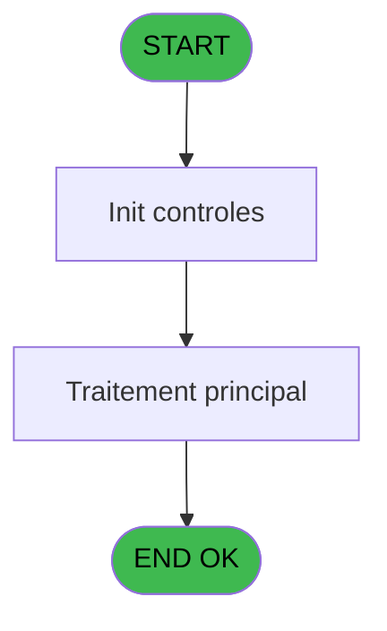
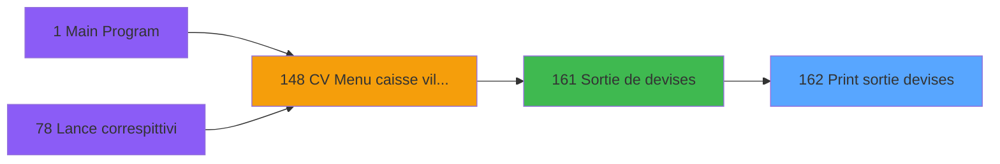

# VIL IDE 162 - Print sortie devises

> **Analyse**: Phases 1-4 2026-02-03 09:50 -> 09:50 (21s) | Assemblage 09:50
> **Pipeline**: V7.2 Enrichi
> **Structure**: 4 onglets (Resume | Ecrans | Donnees | Connexions)

<!-- TAB:Resume -->

## 1. FICHE D'IDENTITE

| Attribut | Valeur |
|----------|--------|
| Projet | VIL |
| IDE Position | 162 |
| Nom Programme | Print sortie devises |
| Fichier source | `Prg_162.xml` |
| Domaine metier | Change |
| Taches | 1 (0 ecrans visibles) |
| Tables modifiees | 0 |
| Programmes appeles | 0 |

## 2. DESCRIPTION FONCTIONNELLE

**Print sortie devises** assure la gestion complete de ce processus, accessible depuis [Sortie de devises (IDE 161)](VIL-IDE-161.md).

Le flux de traitement s'organise en **1 blocs fonctionnels** :

- **Traitement** (1 tache) : traitements metier divers

**Logique metier** : 3 regles identifiees couvrant conditions metier.

## 3. BLOCS FONCTIONNELS

### 3.1 Traitement (1 tache)

Traitements internes.

---

#### 162 - Veuillez patienter .... [[ECRAN]](#ecran-t1)

**Role** : Traitement : Veuillez patienter .....
**Ecran** : 426 x 57 DLU (MDI) | [Voir mockup](#ecran-t1)

## 5. REGLES METIER

3 regles identifiees:

### Autres (3 regles)

#### [RM-001] Si P0 validation [E]='O' alors '' sinon '    Duplicata')

| Element | Detail |
|---------|--------|
| **Condition** | `P0 validation [E]='O'` |
| **Si vrai** | '' |
| **Si faux** | '    Duplicata') |
| **Variables** | E (P0 validation) |
| **Expression source** | Expression 7 : `IF (P0 validation [E]='O','','    Duplicata')` |
| **Exemple** | Si P0 validation [E]='O' → ''. Sinon → '    Duplicata') |

#### [RM-002] Si [M]<0 alors 'ENTREE' sinon IF ([M]>0,'SORTIE',''))

| Element | Detail |
|---------|--------|
| **Condition** | `[M]<0` |
| **Si vrai** | 'ENTREE' |
| **Si faux** | IF ([M]>0,'SORTIE','')) |
| **Expression source** | Expression 8 : `IF ([M]<0,'ENTREE',IF ([M]>0,'SORTIE',''))` |
| **Exemple** | Si [M]<0 → 'ENTREE'. Sinon → IF ([M]>0,'SORTIE','')) |

#### [RM-003] Si P0 Uni/Bi [G]='B' alors MlsTrans('ENTREE/SORTIE DE DEVISES') sinon MlsTrans('SORTIE DE DEVISES'))

| Element | Detail |
|---------|--------|
| **Condition** | `P0 Uni/Bi [G]='B'` |
| **Si vrai** | MlsTrans('ENTREE/SORTIE DE DEVISES') |
| **Si faux** | MlsTrans('SORTIE DE DEVISES')) |
| **Variables** | G (P0 Uni/Bi) |
| **Expression source** | Expression 11 : `IF(P0 Uni/Bi [G]='B',MlsTrans('ENTREE/SORTIE DE DEVISES'),Ml` |
| **Exemple** | Si P0 Uni/Bi [G]='B' → MlsTrans('ENTREE/SORTIE DE DEVISES'). Sinon → MlsTrans('SORTIE DE DEVISES')) |

## 6. CONTEXTE

- **Appele par**: [Sortie de devises (IDE 161)](VIL-IDE-161.md)
- **Appelle**: 0 programmes | **Tables**: 1 (W:0 R:1 L:0) | **Taches**: 1 | **Expressions**: 12

<!-- TAB:Ecrans -->

## 8. ECRANS

*(Programme sans ecran visible)*

## 9. NAVIGATION

### 9.3 Structure hierarchique (1 tache)

| Position | Tache | Type | Dimensions | Bloc |
|----------|-------|------|------------|------|
| **162.1** | [**Veuillez patienter ....** (162)](#t1) [mockup](#ecran-t1) | MDI | 426x57 | Traitement |

### 9.4 Algorigramme

> **Legende**: Vert = START/END OK | Rouge = END KO | Bleu = Decisions
> *Algorigramme auto-genere. Utiliser `/algorigramme` pour une synthese metier detaillee.*

<!-- TAB:Donnees -->

## 10. TABLES

### Tables utilisees (1)

| ID | Nom | Description | Type | R | W | L | Usages |
|----|-----|-------------|------|---|---|---|--------|
| 59 | lign_sortie_dev__ldk |  | DB | R |   |   | 1 |

### Colonnes par table (1 / 1 tables avec colonnes identifiees)

Table 59 - lign_sortie_dev__ldk (R) - 1 usages

| Lettre | Variable | Acces | Type |
|--------|----------|-------|------|
| A | P0 societe | R | Alpha |
| B | P0 date comptable | R | Date |
| C | P0 date sortie | R | Date |
| D | P0 heure sortie | R | Time |
| E | P0 validation | R | Alpha |
| F | P0 nom village | R | Alpha |
| G | P0 Uni/Bi | R | Alpha |
| H | W0 config imp. | R | Alpha |

## 11. VARIABLES

### 11.1 Parametres entrants (7)

Variables recues du programme appelant ([Sortie de devises (IDE 161)](VIL-IDE-161.md)).

| Lettre | Nom | Type | Usage dans |
|--------|-----|------|-----------|
| A | P0 societe | Alpha | 1x parametre entrant |
| B | P0 date comptable | Date | 1x parametre entrant |
| C | P0 date sortie | Date | 1x parametre entrant |
| D | P0 heure sortie | Time | 1x parametre entrant |
| E | P0 validation | Alpha | 1x parametre entrant |
| F | P0 nom village | Alpha | - |
| G | P0 Uni/Bi | Alpha | 2x parametre entrant |

### 11.2 Variables de travail (1)

Variables internes au programme.

| Lettre | Nom | Type | Usage dans |
|--------|-----|------|-----------|
| H | W0 config imp. | Alpha | - |

## 12. EXPRESSIONS

**12 / 12 expressions decodees (100%)**

### 12.1 Repartition par type

| Type | Expressions | Regles |
|------|-------------|--------|
| CONCATENATION | 1 | 0 |
| CONDITION | 5 | 3 |
| OTHER | 6 | 0 |

### 12.2 Expressions cles par type

#### CONCATENATION (1 expressions)

| Type | IDE | Expression | Regle |
|------|-----|------------|-------|
| CONCATENATION | 10 | `'- '&Str (Page (0,1),'3P0Z0')&' -'` | - |

#### CONDITION (5 expressions)

| Type | IDE | Expression | Regle |
|------|-----|------------|-------|
| CONDITION | 11 | `IF(P0 Uni/Bi [G]='B',MlsTrans('ENTREE/SORTIE DE DEVISES'),MlsTrans('SORTIE DE DEVISES'))` | [RM-003](#rm-RM-003) |
| CONDITION | 8 | `IF ([M]<0,'ENTREE',IF ([M]>0,'SORTIE',''))` | [RM-002](#rm-RM-002) |
| CONDITION | 7 | `IF (P0 validation [E]='O','','    Duplicata')` | [RM-001](#rm-RM-001) |
| CONDITION | 12 | `P0 Uni/Bi [G]='B'` | - |
| CONDITION | 9 | `INIGet ('[MAGIC_LOGICAL_NAMES]preview')='O'` | - |

#### OTHER (6 expressions)

| Type | IDE | Expression | Regle |
|------|-----|------------|-------|
| OTHER | 4 | `P0 date comptable [B]` | - |
| OTHER | 5 | `P0 date sortie [C]` | - |
| OTHER | 6 | `P0 heure sortie [D]` | - |
| OTHER | 1 | `SetCrsr (1)` | - |
| OTHER | 2 | `SetCrsr (2)` | - |
| ... | | *+1 autres* | |

<!-- TAB:Connexions -->

## 13. GRAPHE D'APPELS

### 13.1 Chaine depuis Main (Callers)

Main -> ... -> [Sortie de devises (IDE 161)](VIL-IDE-161.md) -> **Print sortie devises (IDE 162)**

### 13.2 Callers

| IDE | Nom Programme | Nb Appels |
|-----|---------------|-----------|
| [161](VIL-IDE-161.md) | Sortie de devises | 2 |

### 13.3 Callees (programmes appeles)

### 13.4 Detail Callees avec contexte

| IDE | Nom Programme | Appels | Contexte |
|-----|---------------|--------|----------|
| - | (aucun) | - | - |

## 14. RECOMMANDATIONS MIGRATION

### 14.1 Profil du programme

| Metrique | Valeur | Impact migration |
|----------|--------|-----------------|
| Lignes de logique | 22 | Programme compact |
| Expressions | 12 | Peu de logique |
| Tables WRITE | 0 | Impact faible |
| Sous-programmes | 0 | Peu de dependances |
| Ecrans visibles | 0 | Ecran unique ou traitement batch |
| Code desactive | 0% (0 / 22) | Code sain |
| Regles metier | 3 | Quelques regles a preserver |

### 14.2 Plan de migration par bloc

#### Traitement (1 tache: 1 ecran, 0 traitement)

- **Strategie** : 1 composant(s) UI (Razor/React) avec formulaires et validation.
- Decomposer les taches en services unitaires testables.

### 14.3 Dependances critiques

| Dependance | Type | Appels | Impact |
|------------|------|--------|--------|

---
*Spec DETAILED generee par Pipeline V7.2 - 2026-02-03 09:50*
