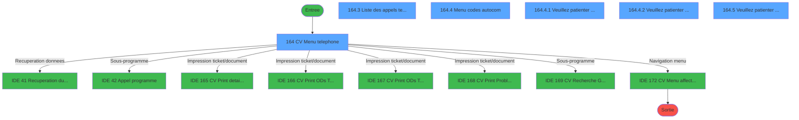
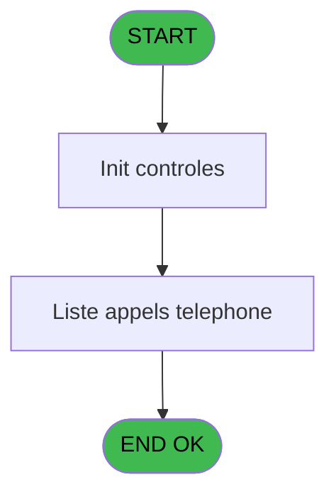
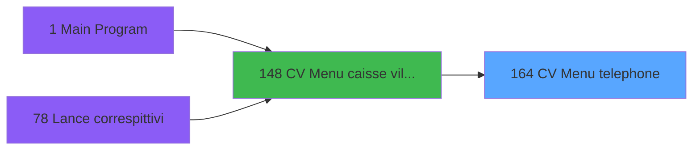
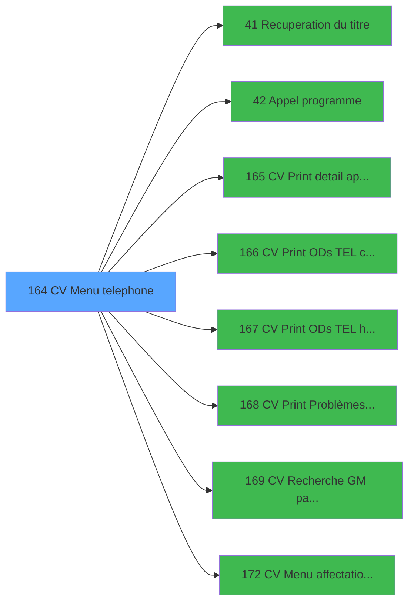

# VIL IDE 164 - CV  Menu telephone

> **Analyse**: Phases 1-4 2026-02-03 09:51 -> 09:51 (20s) | Assemblage 09:51
> **Pipeline**: V7.2 Enrichi
> **Structure**: 4 onglets (Resume | Ecrans | Donnees | Connexions)

<!-- TAB:Resume -->

## 1. FICHE D'IDENTITE

| Attribut | Valeur |
|----------|--------|
| Projet | VIL |
| IDE Position | 164 |
| Nom Programme | CV  Menu telephone |
| Fichier source | `Prg_164.xml` |
| Domaine metier | Navigation |
| Taches | 11 (6 ecrans visibles) |
| Tables modifiees | 0 |
| Programmes appeles | 8 |

## 2. DESCRIPTION FONCTIONNELLE

**CV  Menu telephone** assure la gestion complete de ce processus, accessible depuis [CV  Menu caisse village (IDE 148)](VIL-IDE-148.md).

Le flux de traitement s'organise en **2 blocs fonctionnels** :

- **Traitement** (10 taches) : traitements metier divers
- **Calcul** (1 tache) : calculs de montants, stocks ou compteurs

Detail : phases du traitement

#### Phase 1 : Traitement (10 taches)

- **164** - CV  Menu telephone **[[ECRAN]](#ecran-t1)**
- **164.1** - Lecture Paramètres tel
- **164.3** - Liste des appels telephone **[[ECRAN]](#ecran-t4)**
- **164.4** - Menu codes autocom **[[ECRAN]](#ecran-t5)**
- **164.4.1** - Veuillez patienter ... **[[ECRAN]](#ecran-t6)**
- **164.4.2** - Veuillez patienter ... **[[ECRAN]](#ecran-t7)**
- **164.4.2.1** - Code autocom du GM
- **164.5** - Veuillez patienter ... **[[ECRAN]](#ecran-t9)**
- **164.5.1** - Code autocom du GM
- **164.5.1.1** - SDA

Delegue a : [Recuperation du titre (IDE 41)](VIL-IDE-41.md), [Appel programme (IDE 42)](VIL-IDE-42.md), [CV  Menu affectation auto (IDE 172)](VIL-IDE-172.md)

#### Phase 2 : Calcul (1 tache)

- **164.2** - Lecture date comptable

## 3. BLOCS FONCTIONNELS

### 3.1 Traitement (10 taches)

Traitements internes.

---

#### 164 - CV  Menu telephone [[ECRAN]](#ecran-t1)

**Role** : Tache d'orchestration : point d'entree du programme (10 sous-taches). Coordonne l'enchainement des traitements.
**Ecran** : 757 x 179 DLU (MDI) | [Voir mockup](#ecran-t1)

9 sous-taches directes

| Tache | Nom | Bloc |
|-------|-----|------|
| [164.1](#t2) | Lecture Paramètres tel | Traitement |
| [164.3](#t4) | Liste des appels telephone **[[ECRAN]](#ecran-t4)** | Traitement |
| [164.4](#t5) | Menu codes autocom **[[ECRAN]](#ecran-t5)** | Traitement |
| [164.4.1](#t6) | Veuillez patienter ... **[[ECRAN]](#ecran-t6)** | Traitement |
| [164.4.2](#t7) | Veuillez patienter ... **[[ECRAN]](#ecran-t7)** | Traitement |
| [164.4.2.1](#t8) | Code autocom du GM | Traitement |
| [164.5](#t9) | Veuillez patienter ... **[[ECRAN]](#ecran-t9)** | Traitement |
| [164.5.1](#t10) | Code autocom du GM | Traitement |
| [164.5.1.1](#t11) | SDA | Traitement |

**Delegue a** : [Recuperation du titre (IDE 41)](VIL-IDE-41.md), [Appel programme (IDE 42)](VIL-IDE-42.md), [CV  Menu affectation auto (IDE 172)](VIL-IDE-172.md)

---

#### 164.1 - Lecture Paramètres tel

**Role** : Traitement : Lecture Paramètres tel.
**Delegue a** : [Recuperation du titre (IDE 41)](VIL-IDE-41.md), [Appel programme (IDE 42)](VIL-IDE-42.md), [CV  Menu affectation auto (IDE 172)](VIL-IDE-172.md)

---

#### 164.3 - Liste des appels telephone [[ECRAN]](#ecran-t4)

**Role** : Traitement : Liste des appels telephone.
**Ecran** : 696 x 139 DLU (MDI) | [Voir mockup](#ecran-t4)
**Delegue a** : [Recuperation du titre (IDE 41)](VIL-IDE-41.md), [Appel programme (IDE 42)](VIL-IDE-42.md), [CV  Menu affectation auto (IDE 172)](VIL-IDE-172.md)

---

#### 164.4 - Menu codes autocom [[ECRAN]](#ecran-t5)

**Role** : Traitement : Menu codes autocom.
**Ecran** : 723 x 148 DLU (MDI) | [Voir mockup](#ecran-t5)
**Delegue a** : [Recuperation du titre (IDE 41)](VIL-IDE-41.md), [Appel programme (IDE 42)](VIL-IDE-42.md), [CV  Menu affectation auto (IDE 172)](VIL-IDE-172.md)

---

#### 164.4.1 - Veuillez patienter ... [[ECRAN]](#ecran-t6)

**Role** : Traitement : Veuillez patienter ....
**Ecran** : 427 x 56 DLU (MDI) | [Voir mockup](#ecran-t6)
**Delegue a** : [Recuperation du titre (IDE 41)](VIL-IDE-41.md), [Appel programme (IDE 42)](VIL-IDE-42.md), [CV  Menu affectation auto (IDE 172)](VIL-IDE-172.md)

---

#### 164.4.2 - Veuillez patienter ... [[ECRAN]](#ecran-t7)

**Role** : Traitement : Veuillez patienter ....
**Ecran** : 422 x 56 DLU (MDI) | [Voir mockup](#ecran-t7)
**Delegue a** : [Recuperation du titre (IDE 41)](VIL-IDE-41.md), [Appel programme (IDE 42)](VIL-IDE-42.md), [CV  Menu affectation auto (IDE 172)](VIL-IDE-172.md)

---

#### 164.4.2.1 - Code autocom du GM

**Role** : Traitement : Code autocom du GM.
**Variables liees** : J (W0 longueur code tel), M (W0 nb code accepte)
**Delegue a** : [Recuperation du titre (IDE 41)](VIL-IDE-41.md), [Appel programme (IDE 42)](VIL-IDE-42.md), [CV  Menu affectation auto (IDE 172)](VIL-IDE-172.md)

---

#### 164.5 - Veuillez patienter ... [[ECRAN]](#ecran-t9)

**Role** : Traitement : Veuillez patienter ....
**Ecran** : 424 x 56 DLU (MDI) | [Voir mockup](#ecran-t9)
**Delegue a** : [Recuperation du titre (IDE 41)](VIL-IDE-41.md), [Appel programme (IDE 42)](VIL-IDE-42.md), [CV  Menu affectation auto (IDE 172)](VIL-IDE-172.md)

---

#### 164.5.1 - Code autocom du GM

**Role** : Traitement : Code autocom du GM.
**Variables liees** : J (W0 longueur code tel), M (W0 nb code accepte)
**Delegue a** : [Recuperation du titre (IDE 41)](VIL-IDE-41.md), [Appel programme (IDE 42)](VIL-IDE-42.md), [CV  Menu affectation auto (IDE 172)](VIL-IDE-172.md)

---

#### 164.5.1.1 - SDA

**Role** : Traitement interne.

### 3.2 Calcul (1 tache)

Calculs metier : montants, stocks, compteurs.

---

#### 164.2 - Lecture date comptable

**Role** : Traitement : Lecture date comptable.
**Variables liees** : G (P0 date comptable)

## 5. REGLES METIER

*(Aucune regle metier identifiee)*

## 6. CONTEXTE

- **Appele par**: [CV  Menu caisse village (IDE 148)](VIL-IDE-148.md)
- **Appelle**: 8 programmes | **Tables**: 5 (W:0 R:5 L:1) | **Taches**: 11 | **Expressions**: 18

<!-- TAB:Ecrans -->

## 8. ECRANS

### 8.1 Forms visibles (6 / 11)

| # | Position | Tache | Nom | Type | Largeur | Hauteur | Bloc |
|---|----------|-------|-----|------|---------|---------|------|
| 1 | 164 | 164 | CV  Menu telephone | MDI | 757 | 179 | Traitement |
| 2 | 164.3 | 164.3 | Liste des appels telephone | MDI | 696 | 139 | Traitement |
| 3 | 164.4 | 164.4 | Menu codes autocom | MDI | 723 | 148 | Traitement |
| 4 | 164.4.1 | 164.4.1 | Veuillez patienter ... | MDI | 427 | 56 | Traitement |
| 5 | 164.4.2 | 164.4.2 | Veuillez patienter ... | MDI | 422 | 56 | Traitement |
| 6 | 164.5 | 164.5 | Veuillez patienter ... | MDI | 424 | 56 | Traitement |

### 8.2 Mockups Ecrans

---

#### 164 - CV  Menu telephone
**Tache** : [164](#t1) | **Type** : MDI | **Dimensions** : 757 x 179 DLU
**Bloc** : Traitement | **Titre IDE** : CV  Menu telephone

<!-- FORM-DATA:
{
    "width":  757,
    "vFactor":  8,
    "type":  "MDI",
    "hFactor":  8,
    "controls":  [
                     {
                         "x":  1,
                         "type":  "label",
                         "var":  "",
                         "y":  0,
                         "w":  755,
                         "fmt":  "",
                         "name":  "",
                         "h":  17,
                         "color":  "",
                         "text":  "",
                         "parent":  null
                     },
                     {
                         "x":  182,
                         "type":  "label",
                         "var":  "",
                         "y":  25,
                         "w":  548,
                         "fmt":  "",
                         "name":  "",
                         "h":  126,
                         "color":  "",
                         "text":  "",
                         "parent":  null
                     },
                     {
                         "x":  185,
                         "type":  "label",
                         "var":  "",
                         "y":  26,
                         "w":  543,
                         "fmt":  "",
                         "name":  "",
                         "h":  124,
                         "color":  "",
                         "text":  "",
                         "parent":  null
                     },
                     {
                         "x":  208,
                         "type":  "label",
                         "var":  "",
                         "y":  38,
                         "w":  488,
                         "fmt":  "",
                         "name":  "",
                         "h":  88,
                         "color":  "",
                         "text":  "",
                         "parent":  null
                     },
                     {
                         "x":  211,
                         "type":  "label",
                         "var":  "",
                         "y":  39,
                         "w":  50,
                         "fmt":  "",
                         "name":  "",
                         "h":  86,
                         "color":  "",
                         "text":  "",
                         "parent":  null
                     },
                     {
                         "x":  269,
                         "type":  "label",
                         "var":  "",
                         "y":  45,
                         "w":  296,
                         "fmt":  "",
                         "name":  "",
                         "h":  8,
                         "color":  "7",
                         "text":  "Liste des appels d\u0027un autocom",
                         "parent":  null
                     },
                     {
                         "x":  271,
                         "type":  "label",
                         "var":  "",
                         "y":  58,
                         "w":  301,
                         "fmt":  "",
                         "name":  "",
                         "h":  8,
                         "color":  "7",
                         "text":  "Liste des appels téléphoniques",
                         "parent":  null
                     },
                     {
                         "x":  271,
                         "type":  "label",
                         "var":  "",
                         "y":  71,
                         "w":  272,
                         "fmt":  "",
                         "name":  "",
                         "h":  8,
                         "color":  "7",
                         "text":  "Gestion des codes autocom",
                         "parent":  null
                     },
                     {
                         "x":  271,
                         "type":  "label",
                         "var":  "",
                         "y":  84,
                         "w":  302,
                         "fmt":  "",
                         "name":  "",
                         "h":  8,
                         "color":  "7",
                         "text":  "Liste des problèmes rencontrés",
                         "parent":  null
                     },
                     {
                         "x":  271,
                         "type":  "label",
                         "var":  "",
                         "y":  97,
                         "w":  312,
                         "fmt":  "",
                         "name":  "",
                         "h":  8,
                         "color":  "7",
                         "text":  "Liste des lignes directes (S.D.A)",
                         "parent":  null
                     },
                     {
                         "x":  271,
                         "type":  "label",
                         "var":  "",
                         "y":  109,
                         "w":  419,
                         "fmt":  "",
                         "name":  "",
                         "h":  9,
                         "color":  "7",
                         "text":  "Affectation automatique des codes autocom",
                         "parent":  null
                     },
                     {
                         "x":  282,
                         "type":  "label",
                         "var":  "",
                         "y":  135,
                         "w":  203,
                         "fmt":  "",
                         "name":  "",
                         "h":  8,
                         "color":  "",
                         "text":  "Choix de l\u0027action",
                         "parent":  null
                     },
                     {
                         "x":  2,
                         "type":  "label",
                         "var":  "",
                         "y":  156,
                         "w":  754,
                         "fmt":  "",
                         "name":  "",
                         "h":  23,
                         "color":  "",
                         "text":  "",
                         "parent":  null
                     },
                     {
                         "x":  490,
                         "type":  "edit",
                         "var":  "",
                         "y":  134,
                         "w":  32,
                         "fmt":  "",
                         "name":  "",
                         "h":  10,
                         "color":  "6",
                         "text":  "",
                         "parent":  null
                     },
                     {
                         "x":  6,
                         "type":  "edit",
                         "var":  "",
                         "y":  4,
                         "w":  267,
                         "fmt":  "20",
                         "name":  "",
                         "h":  8,
                         "color":  "",
                         "text":  "",
                         "parent":  1
                     },
                     {
                         "x":  545,
                         "type":  "edit",
                         "var":  "",
                         "y":  4,
                         "w":  203,
                         "fmt":  "WWW DD MMM YYYYZ",
                         "name":  "",
                         "h":  8,
                         "color":  "",
                         "text":  "",
                         "parent":  1
                     },
                     {
                         "x":  8,
                         "type":  "image",
                         "var":  "",
                         "y":  36,
                         "w":  160,
                         "fmt":  "",
                         "name":  "",
                         "h":  50,
                         "color":  "",
                         "text":  "",
                         "parent":  null
                     },
                     {
                         "x":  221,
                         "type":  "button",
                         "var":  "",
                         "y":  44,
                         "w":  26,
                         "fmt":  "1",
                         "name":  "1",
                         "h":  9,
                         "color":  "",
                         "text":  "",
                         "parent":  null
                     },
                     {
                         "x":  221,
                         "type":  "button",
                         "var":  "",
                         "y":  57,
                         "w":  26,
                         "fmt":  "2",
                         "name":  "2",
                         "h":  9,
                         "color":  "",
                         "text":  "",
                         "parent":  null
                     },
                     {
                         "x":  221,
                         "type":  "button",
                         "var":  "",
                         "y":  70,
                         "w":  26,
                         "fmt":  "3",
                         "name":  "3",
                         "h":  9,
                         "color":  "",
                         "text":  "",
                         "parent":  null
                     },
                     {
                         "x":  221,
                         "type":  "button",
                         "var":  "",
                         "y":  83,
                         "w":  26,
                         "fmt":  "4",
                         "name":  "4",
                         "h":  9,
                         "color":  "",
                         "text":  "",
                         "parent":  null
                     },
                     {
                         "x":  221,
                         "type":  "button",
                         "var":  "",
                         "y":  96,
                         "w":  26,
                         "fmt":  "5",
                         "name":  "5",
                         "h":  9,
                         "color":  "",
                         "text":  "",
                         "parent":  null
                     },
                     {
                         "x":  221,
                         "type":  "button",
                         "var":  "",
                         "y":  109,
                         "w":  26,
                         "fmt":  "6",
                         "name":  "6",
                         "h":  9,
                         "color":  "",
                         "text":  "",
                         "parent":  null
                     },
                     {
                         "x":  10,
                         "type":  "button",
                         "var":  "",
                         "y":  159,
                         "w":  160,
                         "fmt":  "\u0026Quitter",
                         "name":  "",
                         "h":  18,
                         "color":  "",
                         "text":  "",
                         "parent":  null
                     }
                 ],
    "taskId":  "164",
    "height":  179
}
-->

<strong>Champs : 3 champs</strong>

| Pos (x,y) | Nom | Variable | Type |
|-----------|-----|----------|------|
| 490,134 | (sans nom) | - | edit |
| 6,4 | 20 | - | edit |
| 545,4 | WWW DD MMM YYYYZ | - | edit |

<strong>Boutons : 7 boutons</strong>

| Bouton | Pos (x,y) | Action |
|--------|-----------|--------|
| 1 | 221,44 | Bouton fonctionnel |
| 2 | 221,57 | Bouton fonctionnel |
| 3 | 221,70 | Bouton fonctionnel |
| 4 | 221,83 | Bouton fonctionnel |
| 5 | 221,96 | Bouton fonctionnel |
| 6 | 221,109 | Bouton fonctionnel |
| Quitter | 10,159 | Quitte le programme |

---

#### 164.3 - Liste des appels telephone
**Tache** : [164.3](#t4) | **Type** : MDI | **Dimensions** : 696 x 139 DLU
**Bloc** : Traitement | **Titre IDE** : Liste des appels telephone

<!-- FORM-DATA:
{
    "width":  696,
    "vFactor":  8,
    "type":  "MDI",
    "hFactor":  8,
    "controls":  [
                     {
                         "x":  3,
                         "type":  "label",
                         "var":  "",
                         "y":  0,
                         "w":  689,
                         "fmt":  "",
                         "name":  "",
                         "h":  17,
                         "color":  "",
                         "text":  "",
                         "parent":  null
                     },
                     {
                         "x":  23,
                         "type":  "label",
                         "var":  "",
                         "y":  34,
                         "w":  651,
                         "fmt":  "",
                         "name":  "",
                         "h":  63,
                         "color":  "",
                         "text":  "",
                         "parent":  null
                     },
                     {
                         "x":  26,
                         "type":  "label",
                         "var":  "",
                         "y":  35,
                         "w":  646,
                         "fmt":  "",
                         "name":  "",
                         "h":  61,
                         "color":  "",
                         "text":  "",
                         "parent":  null
                     },
                     {
                         "x":  252,
                         "type":  "label",
                         "var":  "",
                         "y":  44,
                         "w":  390,
                         "fmt":  "",
                         "name":  "",
                         "h":  34,
                         "color":  "",
                         "text":  "",
                         "parent":  null
                     },
                     {
                         "x":  255,
                         "type":  "label",
                         "var":  "",
                         "y":  45,
                         "w":  50,
                         "fmt":  "",
                         "name":  "",
                         "h":  32,
                         "color":  "",
                         "text":  "",
                         "parent":  null
                     },
                     {
                         "x":  313,
                         "type":  "label",
                         "var":  "",
                         "y":  50,
                         "w":  274,
                         "fmt":  "",
                         "name":  "",
                         "h":  8,
                         "color":  "7",
                         "text":  "Liste à partir de \u0027Comptable\u0027",
                         "parent":  null
                     },
                     {
                         "x":  315,
                         "type":  "label",
                         "var":  "",
                         "y":  63,
                         "w":  221,
                         "fmt":  "",
                         "name":  "",
                         "h":  8,
                         "color":  "7",
                         "text":  "Liste à partir du PABX",
                         "parent":  null
                     },
                     {
                         "x":  370,
                         "type":  "label",
                         "var":  "",
                         "y":  82,
                         "w":  123,
                         "fmt":  "",
                         "name":  "",
                         "h":  8,
                         "color":  "",
                         "text":  "Votre choix",
                         "parent":  null
                     },
                     {
                         "x":  2,
                         "type":  "label",
                         "var":  "",
                         "y":  115,
                         "w":  690,
                         "fmt":  "",
                         "name":  "",
                         "h":  23,
                         "color":  "",
                         "text":  "",
                         "parent":  null
                     },
                     {
                         "x":  503,
                         "type":  "edit",
                         "var":  "",
                         "y":  82,
                         "w":  32,
                         "fmt":  "",
                         "name":  "",
                         "h":  10,
                         "color":  "6",
                         "text":  "",
                         "parent":  null
                     },
                     {
                         "x":  483,
                         "type":  "edit",
                         "var":  "",
                         "y":  4,
                         "w":  203,
                         "fmt":  "WWW DD MMM YYYYZ",
                         "name":  "",
                         "h":  8,
                         "color":  "",
                         "text":  "",
                         "parent":  1
                     },
                     {
                         "x":  64,
                         "type":  "image",
                         "var":  "",
                         "y":  38,
                         "w":  182,
                         "fmt":  "",
                         "name":  "",
                         "h":  56,
                         "color":  "",
                         "text":  "",
                         "parent":  5
                     },
                     {
                         "x":  265,
                         "type":  "button",
                         "var":  "",
                         "y":  50,
                         "w":  26,
                         "fmt":  "1",
                         "name":  "1",
                         "h":  9,
                         "color":  "",
                         "text":  "",
                         "parent":  null
                     },
                     {
                         "x":  265,
                         "type":  "button",
                         "var":  "",
                         "y":  64,
                         "w":  26,
                         "fmt":  "2",
                         "name":  "2",
                         "h":  9,
                         "color":  "",
                         "text":  "",
                         "parent":  null
                     },
                     {
                         "x":  10,
                         "type":  "button",
                         "var":  "",
                         "y":  118,
                         "w":  160,
                         "fmt":  "\u0026Quitter",
                         "name":  "",
                         "h":  18,
                         "color":  "",
                         "text":  "",
                         "parent":  null
                     },
                     {
                         "x":  9,
                         "type":  "edit",
                         "var":  "",
                         "y":  4,
                         "w":  267,
                         "fmt":  "20",
                         "name":  "",
                         "h":  8,
                         "color":  "",
                         "text":  "",
                         "parent":  1
                     }
                 ],
    "taskId":  "164.3",
    "height":  139
}
-->

<strong>Champs : 3 champs</strong>

| Pos (x,y) | Nom | Variable | Type |
|-----------|-----|----------|------|
| 503,82 | (sans nom) | - | edit |
| 483,4 | WWW DD MMM YYYYZ | - | edit |
| 9,4 | 20 | - | edit |

<strong>Boutons : 3 boutons</strong>

| Bouton | Pos (x,y) | Action |
|--------|-----------|--------|
| 1 | 265,50 | Bouton fonctionnel |
| 2 | 265,64 | Bouton fonctionnel |
| Quitter | 10,118 | Quitte le programme |

---

#### 164.4 - Menu codes autocom
**Tache** : [164.4](#t5) | **Type** : MDI | **Dimensions** : 723 x 148 DLU
**Bloc** : Traitement | **Titre IDE** : Menu codes autocom

<!-- FORM-DATA:
{
    "width":  723,
    "vFactor":  8,
    "type":  "MDI",
    "hFactor":  8,
    "controls":  [
                     {
                         "x":  1,
                         "type":  "label",
                         "var":  "",
                         "y":  0,
                         "w":  721,
                         "fmt":  "",
                         "name":  "",
                         "h":  17,
                         "color":  "",
                         "text":  "",
                         "parent":  null
                     },
                     {
                         "x":  168,
                         "type":  "label",
                         "var":  "",
                         "y":  31,
                         "w":  511,
                         "fmt":  "",
                         "name":  "",
                         "h":  78,
                         "color":  "",
                         "text":  "",
                         "parent":  null
                     },
                     {
                         "x":  171,
                         "type":  "label",
                         "var":  "",
                         "y":  32,
                         "w":  506,
                         "fmt":  "",
                         "name":  "",
                         "h":  76,
                         "color":  "",
                         "text":  "",
                         "parent":  null
                     },
                     {
                         "x":  202,
                         "type":  "label",
                         "var":  "",
                         "y":  41,
                         "w":  448,
                         "fmt":  "",
                         "name":  "",
                         "h":  48,
                         "color":  "",
                         "text":  "",
                         "parent":  null
                     },
                     {
                         "x":  205,
                         "type":  "label",
                         "var":  "",
                         "y":  42,
                         "w":  50,
                         "fmt":  "",
                         "name":  "",
                         "h":  46,
                         "color":  "",
                         "text":  "",
                         "parent":  null
                     },
                     {
                         "x":  263,
                         "type":  "label",
                         "var":  "",
                         "y":  47,
                         "w":  157,
                         "fmt":  "",
                         "name":  "",
                         "h":  8,
                         "color":  "7",
                         "text":  "Liste par statut",
                         "parent":  null
                     },
                     {
                         "x":  263,
                         "type":  "label",
                         "var":  "",
                         "y":  60,
                         "w":  275,
                         "fmt":  "",
                         "name":  "",
                         "h":  8,
                         "color":  "7",
                         "text":  "Liste par ordre alphabétique",
                         "parent":  null
                     },
                     {
                         "x":  263,
                         "type":  "label",
                         "var":  "",
                         "y":  75,
                         "w":  368,
                         "fmt":  "",
                         "name":  "",
                         "h":  8,
                         "color":  "7",
                         "text":  "Recherche d\u0027un GM à partir d\u0027un code",
                         "parent":  null
                     },
                     {
                         "x":  322,
                         "type":  "label",
                         "var":  "",
                         "y":  94,
                         "w":  123,
                         "fmt":  "",
                         "name":  "",
                         "h":  8,
                         "color":  "",
                         "text":  "Votre choix",
                         "parent":  null
                     },
                     {
                         "x":  0,
                         "type":  "label",
                         "var":  "",
                         "y":  125,
                         "w":  721,
                         "fmt":  "",
                         "name":  "",
                         "h":  23,
                         "color":  "",
                         "text":  "",
                         "parent":  null
                     },
                     {
                         "x":  455,
                         "type":  "edit",
                         "var":  "",
                         "y":  93,
                         "w":  32,
                         "fmt":  "",
                         "name":  "",
                         "h":  10,
                         "color":  "6",
                         "text":  "",
                         "parent":  null
                     },
                     {
                         "x":  435,
                         "type":  "edit",
                         "var":  "",
                         "y":  4,
                         "w":  275,
                         "fmt":  "WWW DD MMM YYYYZ",
                         "name":  "",
                         "h":  8,
                         "color":  "",
                         "text":  "",
                         "parent":  1
                     },
                     {
                         "x":  1,
                         "type":  "image",
                         "var":  "",
                         "y":  27,
                         "w":  160,
                         "fmt":  "",
                         "name":  "",
                         "h":  62,
                         "color":  "",
                         "text":  "",
                         "parent":  null
                     },
                     {
                         "x":  215,
                         "type":  "button",
                         "var":  "",
                         "y":  47,
                         "w":  26,
                         "fmt":  "1",
                         "name":  "1",
                         "h":  9,
                         "color":  "",
                         "text":  "",
                         "parent":  null
                     },
                     {
                         "x":  215,
                         "type":  "button",
                         "var":  "",
                         "y":  61,
                         "w":  26,
                         "fmt":  "2",
                         "name":  "2",
                         "h":  9,
                         "color":  "",
                         "text":  "",
                         "parent":  null
                     },
                     {
                         "x":  215,
                         "type":  "button",
                         "var":  "",
                         "y":  74,
                         "w":  26,
                         "fmt":  "3",
                         "name":  "3",
                         "h":  9,
                         "color":  "",
                         "text":  "",
                         "parent":  null
                     },
                     {
                         "x":  7,
                         "type":  "button",
                         "var":  "",
                         "y":  128,
                         "w":  160,
                         "fmt":  "\u0026Quitter",
                         "name":  "",
                         "h":  18,
                         "color":  "",
                         "text":  "",
                         "parent":  null
                     },
                     {
                         "x":  7,
                         "type":  "edit",
                         "var":  "",
                         "y":  4,
                         "w":  267,
                         "fmt":  "20",
                         "name":  "",
                         "h":  8,
                         "color":  "",
                         "text":  "",
                         "parent":  1
                     }
                 ],
    "taskId":  "164.4",
    "height":  148
}
-->

<strong>Champs : 3 champs</strong>

| Pos (x,y) | Nom | Variable | Type |
|-----------|-----|----------|------|
| 455,93 | (sans nom) | - | edit |
| 435,4 | WWW DD MMM YYYYZ | - | edit |
| 7,4 | 20 | - | edit |

<strong>Boutons : 4 boutons</strong>

| Bouton | Pos (x,y) | Action |
|--------|-----------|--------|
| 1 | 215,47 | Bouton fonctionnel |
| 2 | 215,61 | Bouton fonctionnel |
| 3 | 215,74 | Bouton fonctionnel |
| Quitter | 7,128 | Quitte le programme |

---

#### 164.4.1 - Veuillez patienter ...
**Tache** : [164.4.1](#t6) | **Type** : MDI | **Dimensions** : 427 x 56 DLU
**Bloc** : Traitement | **Titre IDE** : Veuillez patienter ...

<!-- FORM-DATA:
{
    "width":  427,
    "vFactor":  8,
    "type":  "MDI",
    "hFactor":  8,
    "controls":  [
                     {
                         "x":  3,
                         "type":  "label",
                         "var":  "",
                         "y":  0,
                         "w":  423,
                         "fmt":  "",
                         "name":  "",
                         "h":  29,
                         "color":  "",
                         "text":  "",
                         "parent":  null
                     },
                     {
                         "x":  120,
                         "type":  "label",
                         "var":  "",
                         "y":  10,
                         "w":  275,
                         "fmt":  "",
                         "name":  "",
                         "h":  8,
                         "color":  "7",
                         "text":  "Impression en cours...",
                         "parent":  null
                     },
                     {
                         "x":  3,
                         "type":  "label",
                         "var":  "",
                         "y":  29,
                         "w":  423,
                         "fmt":  "",
                         "name":  "",
                         "h":  27,
                         "color":  "",
                         "text":  "",
                         "parent":  null
                     },
                     {
                         "x":  75,
                         "type":  "label",
                         "var":  "",
                         "y":  39,
                         "w":  323,
                         "fmt":  "",
                         "name":  "",
                         "h":  8,
                         "color":  "",
                         "text":  "Liste des autocom",
                         "parent":  null
                     },
                     {
                         "x":  4,
                         "type":  "image",
                         "var":  "",
                         "y":  2,
                         "w":  72,
                         "fmt":  "",
                         "name":  "",
                         "h":  25,
                         "color":  "",
                         "text":  "",
                         "parent":  null
                     }
                 ],
    "taskId":  "164.4.1",
    "height":  56
}
-->

---

#### 164.4.2 - Veuillez patienter ...
**Tache** : [164.4.2](#t7) | **Type** : MDI | **Dimensions** : 422 x 56 DLU
**Bloc** : Traitement | **Titre IDE** : Veuillez patienter ...

<!-- FORM-DATA:
{
    "width":  422,
    "vFactor":  8,
    "type":  "MDI",
    "hFactor":  8,
    "controls":  [
                     {
                         "x":  0,
                         "type":  "label",
                         "var":  "",
                         "y":  0,
                         "w":  423,
                         "fmt":  "",
                         "name":  "",
                         "h":  29,
                         "color":  "",
                         "text":  "",
                         "parent":  null
                     },
                     {
                         "x":  117,
                         "type":  "label",
                         "var":  "",
                         "y":  10,
                         "w":  275,
                         "fmt":  "",
                         "name":  "",
                         "h":  8,
                         "color":  "7",
                         "text":  "Impression en cours...",
                         "parent":  null
                     },
                     {
                         "x":  0,
                         "type":  "label",
                         "var":  "",
                         "y":  29,
                         "w":  423,
                         "fmt":  "",
                         "name":  "",
                         "h":  27,
                         "color":  "",
                         "text":  "",
                         "parent":  null
                     },
                     {
                         "x":  70,
                         "type":  "label",
                         "var":  "",
                         "y":  39,
                         "w":  282,
                         "fmt":  "",
                         "name":  "",
                         "h":  8,
                         "color":  "",
                         "text":  "Liste des autocoms",
                         "parent":  null
                     },
                     {
                         "x":  1,
                         "type":  "image",
                         "var":  "",
                         "y":  2,
                         "w":  72,
                         "fmt":  "",
                         "name":  "",
                         "h":  25,
                         "color":  "",
                         "text":  "",
                         "parent":  null
                     }
                 ],
    "taskId":  "164.4.2",
    "height":  56
}
-->

---

#### 164.5 - Veuillez patienter ...
**Tache** : [164.5](#t9) | **Type** : MDI | **Dimensions** : 424 x 56 DLU
**Bloc** : Traitement | **Titre IDE** : Veuillez patienter ...

<!-- FORM-DATA:
{
    "width":  424,
    "vFactor":  8,
    "type":  "MDI",
    "hFactor":  8,
    "controls":  [
                     {
                         "x":  1,
                         "type":  "label",
                         "var":  "",
                         "y":  0,
                         "w":  423,
                         "fmt":  "",
                         "name":  "",
                         "h":  29,
                         "color":  "",
                         "text":  "",
                         "parent":  null
                     },
                     {
                         "x":  99,
                         "type":  "label",
                         "var":  "",
                         "y":  10,
                         "w":  275,
                         "fmt":  "",
                         "name":  "",
                         "h":  8,
                         "color":  "7",
                         "text":  "Impression en cours...",
                         "parent":  null
                     },
                     {
                         "x":  1,
                         "type":  "label",
                         "var":  "",
                         "y":  29,
                         "w":  423,
                         "fmt":  "",
                         "name":  "",
                         "h":  27,
                         "color":  "",
                         "text":  "",
                         "parent":  null
                     },
                     {
                         "x":  99,
                         "type":  "label",
                         "var":  "",
                         "y":  39,
                         "w":  220,
                         "fmt":  "",
                         "name":  "",
                         "h":  8,
                         "color":  "",
                         "text":  "SDA",
                         "parent":  null
                     },
                     {
                         "x":  2,
                         "type":  "image",
                         "var":  "",
                         "y":  2,
                         "w":  72,
                         "fmt":  "",
                         "name":  "",
                         "h":  25,
                         "color":  "",
                         "text":  "",
                         "parent":  null
                     }
                 ],
    "taskId":  "164.5",
    "height":  56
}
-->

## 9. NAVIGATION

### 9.1 Enchainement des ecrans

**Detail par enchainement :**

| Depuis | Action | Vers | Retour |
|--------|--------|------|--------|
| CV  Menu telephone | Recuperation donnees | [Recuperation du titre (IDE 41)](VIL-IDE-41.md) | Retour ecran |
| CV  Menu telephone | Sous-programme | [Appel programme (IDE 42)](VIL-IDE-42.md) | Retour ecran |
| CV  Menu telephone | Impression ticket/document | [CV  Print detail appel/code a (IDE 165)](VIL-IDE-165.md) | Retour ecran |
| CV  Menu telephone | Impression ticket/document | [CV  Print ODs TEL (comptable) (IDE 166)](VIL-IDE-166.md) | Retour ecran |
| CV  Menu telephone | Impression ticket/document | [CV  Print ODs TEL (historique) (IDE 167)](VIL-IDE-167.md) | Retour ecran |
| CV  Menu telephone | Impression ticket/document | [CV  Print Problèmes rencontre (IDE 168)](VIL-IDE-168.md) | Retour ecran |
| CV  Menu telephone | Sous-programme | [CV  Recherche GM par code (IDE 169)](VIL-IDE-169.md) | Retour ecran |
| CV  Menu telephone | Navigation menu | [CV  Menu affectation auto (IDE 172)](VIL-IDE-172.md) | Retour ecran |

### 9.3 Structure hierarchique (11 taches)

| Position | Tache | Type | Dimensions | Bloc |
|----------|-------|------|------------|------|
| **164.1** | [**CV  Menu telephone** (164)](#t1) [mockup](#ecran-t1) | MDI | 757x179 | Traitement |
| 164.1.1 | [Lecture Paramètres tel (164.1)](#t2) | MDI | - | |
| 164.1.2 | [Liste des appels telephone (164.3)](#t4) [mockup](#ecran-t4) | MDI | 696x139 | |
| 164.1.3 | [Menu codes autocom (164.4)](#t5) [mockup](#ecran-t5) | MDI | 723x148 | |
| 164.1.4 | [Veuillez patienter ... (164.4.1)](#t6) [mockup](#ecran-t6) | MDI | 427x56 | |
| 164.1.5 | [Veuillez patienter ... (164.4.2)](#t7) [mockup](#ecran-t7) | MDI | 422x56 | |
| 164.1.6 | [Code autocom du GM (164.4.2.1)](#t8) | MDI | - | |
| 164.1.7 | [Veuillez patienter ... (164.5)](#t9) [mockup](#ecran-t9) | MDI | 424x56 | |
| 164.1.8 | [Code autocom du GM (164.5.1)](#t10) | MDI | - | |
| 164.1.9 | [SDA (164.5.1.1)](#t11) | MDI | - | |
| **164.2** | [**Lecture date comptable** (164.2)](#t3) | MDI | - | Calcul |

### 9.4 Algorigramme

> **Legende**: Vert = START/END OK | Rouge = END KO | Bleu = Decisions
> *Algorigramme auto-genere. Utiliser `/algorigramme` pour une synthese metier detaillee.*

<!-- TAB:Donnees -->

## 10. TABLES

### Tables utilisees (5)

| ID | Nom | Description | Type | R | W | L | Usages |
|----|-----|-------------|------|---|---|---|--------|
| 30 | gm-recherche_____gmr | Index de recherche | DB | R |   | L | 3 |
| 70 | date_comptable___dat |  | DB | R |   |   | 1 |
| 78 | param__telephone_tel |  | DB | R |   |   | 1 |
| 80 | codes_autocom____aut |  | DB | R |   |   | 3 |
| 87 | sda_telephone____sda |  | DB | R |   |   | 1 |

### Colonnes par table (1 / 5 tables avec colonnes identifiees)

Table 30 - gm-recherche_____gmr (R/L) - 3 usages

*Table utilisee uniquement en Link ou aucune colonne Real identifiee dans le DataView.*

Table 70 - date_comptable___dat (R) - 1 usages

| Lettre | Variable | Acces | Type |
|--------|----------|-------|------|
| G | P0 date comptable | R | Date |

Table 78 - param__telephone_tel (R) - 1 usages

*Table utilisee uniquement en Link ou aucune colonne Real identifiee dans le DataView.*

Table 80 - codes_autocom____aut (R) - 3 usages

*Table utilisee uniquement en Link ou aucune colonne Real identifiee dans le DataView.*

Table 87 - sda_telephone____sda (R) - 1 usages

*Table utilisee uniquement en Link ou aucune colonne Real identifiee dans le DataView.*

## 11. VARIABLES

### 11.1 Parametres entrants (7)

Variables recues du programme appelant ([CV  Menu caisse village (IDE 148)](VIL-IDE-148.md)).

| Lettre | Nom | Type | Usage dans |
|--------|-----|------|-----------|
| A | P0 societe | Alpha | - |
| B | P0 masque montant | Alpha | - |
| C | P0 nbre decimales | Numeric | 1x parametre entrant |
| D | P0 devise locale | Alpha | - |
| E | P0 nom village | Alpha | - |
| F | P0 masque cumul | Alpha | - |
| G | P0 date comptable | Date | - |

### 11.2 Variables de session (1)

Variables persistantes pendant toute la session.

| Lettre | Nom | Type | Usage dans |
|--------|-----|------|-----------|
| P | v.titre | Alpha | 9x session |

### 11.3 Variables de travail (8)

Variables internes au programme.

| Lettre | Nom | Type | Usage dans |
|--------|-----|------|-----------|
| H | W0 type interface | Alpha | 3x calcul interne |
| I | W0 type triplet | Alpha | 3x calcul interne |
| J | W0 longueur code tel | Numeric | - |
| K | W0 longueur poste | Numeric | - |
| L | W0 SDA | Alpha | 3x calcul interne |
| M | W0 nb code accepte | Numeric | - |
| N | W0 max ligne/poste | Numeric | - |
| O | W0 choix action | Alpha | - |

Toutes les 16 variables (liste complete)

| Cat | Lettre | Nom Variable | Type |
|-----|--------|--------------|------|
| P0 | **A** | P0 societe | Alpha |
| P0 | **B** | P0 masque montant | Alpha |
| P0 | **C** | P0 nbre decimales | Numeric |
| P0 | **D** | P0 devise locale | Alpha |
| P0 | **E** | P0 nom village | Alpha |
| P0 | **F** | P0 masque cumul | Alpha |
| P0 | **G** | P0 date comptable | Date |
| W0 | **H** | W0 type interface | Alpha |
| W0 | **I** | W0 type triplet | Alpha |
| W0 | **J** | W0 longueur code tel | Numeric |
| W0 | **K** | W0 longueur poste | Numeric |
| W0 | **L** | W0 SDA | Alpha |
| W0 | **M** | W0 nb code accepte | Numeric |
| W0 | **N** | W0 max ligne/poste | Numeric |
| W0 | **O** | W0 choix action | Alpha |
| V. | **P** | v.titre | Alpha |

## 12. EXPRESSIONS

**18 / 18 expressions decodees (100%)**

### 12.1 Repartition par type

| Type | Expressions | Regles |
|------|-------------|--------|
| CONSTANTE | 2 | 0 |
| DATE | 1 | 0 |
| REFERENCE_VG | 1 | 0 |
| CONCATENATION | 1 | 0 |
| CONDITION | 12 | 0 |
| STRING | 1 | 0 |

### 12.2 Expressions cles par type

#### CONSTANTE (2 expressions)

| Type | IDE | Expression | Regle |
|------|-----|------------|-------|
| CONSTANTE | 6 | `''` | - |
| CONSTANTE | 4 | `167` | - |

#### DATE (1 expressions)

| Type | IDE | Expression | Regle |
|------|-----|------------|-------|
| DATE | 1 | `Date ()` | - |

#### REFERENCE_VG (1 expressions)

| Type | IDE | Expression | Regle |
|------|-----|------------|-------|
| REFERENCE_VG | 2 | `VG2` | - |

#### CONCATENATION (1 expressions)

| Type | IDE | Expression | Regle |
|------|-----|------------|-------|
| CONCATENATION | 5 | `'N'&Right (' ### ### ### ###'&Left ('.',P0 nbre decimales [C])&Left ('###',P0 nbre decimales [C]),16)&'Z'` | - |

#### CONDITION (12 expressions)

| Type | IDE | Expression | Regle |
|------|-----|------------|-------|
| CONDITION | 15 | `v.titre [P]='5' AND W0 SDA [L]<>'O'` | - |
| CONDITION | 14 | `W0 SDA [L]='O'` | - |
| CONDITION | 13 | `v.titre [P]='5' AND W0 SDA [L]='O'` | - |
| CONDITION | 18 | `v.titre [P]='6' AND (W0 type triplet [I]<>'3' AND W0 type triplet [I]<>'1')` | - |
| CONDITION | 17 | `W0 type triplet [I]='1' OR W0 type triplet [I]='3'` | - |
| ... | | *+7 autres* | |

#### STRING (1 expressions)

| Type | IDE | Expression | Regle |
|------|-----|------------|-------|
| STRING | 3 | `RTrim ([Q])` | - |

<!-- TAB:Connexions -->

## 13. GRAPHE D'APPELS

### 13.1 Chaine depuis Main (Callers)

Main -> ... -> [CV  Menu caisse village (IDE 148)](VIL-IDE-148.md) -> **CV  Menu telephone (IDE 164)**

### 13.2 Callers

| IDE | Nom Programme | Nb Appels |
|-----|---------------|-----------|
| [148](VIL-IDE-148.md) | CV  Menu caisse village | 1 |

### 13.3 Callees (programmes appeles)

### 13.4 Detail Callees avec contexte

| IDE | Nom Programme | Appels | Contexte |
|-----|---------------|--------|----------|
| [41](VIL-IDE-41.md) | Recuperation du titre | 3 | Recuperation donnees |
| [42](VIL-IDE-42.md) | Appel programme | 3 | Sous-programme |
| [165](VIL-IDE-165.md) | CV  Print detail appel/code a | 1 | Impression ticket/document |
| [166](VIL-IDE-166.md) | CV  Print ODs TEL (comptable) | 1 | Impression ticket/document |
| [167](VIL-IDE-167.md) | CV  Print ODs TEL (historique) | 1 | Impression ticket/document |
| [168](VIL-IDE-168.md) | CV  Print Problèmes rencontre | 1 | Impression ticket/document |
| [169](VIL-IDE-169.md) | CV  Recherche GM par code | 1 | Sous-programme |
| [172](VIL-IDE-172.md) | CV  Menu affectation auto | 1 | Navigation menu |

## 14. RECOMMANDATIONS MIGRATION

### 14.1 Profil du programme

| Metrique | Valeur | Impact migration |
|----------|--------|-----------------|
| Lignes de logique | 129 | Programme compact |
| Expressions | 18 | Peu de logique |
| Tables WRITE | 0 | Impact faible |
| Sous-programmes | 8 | Dependances moderees |
| Ecrans visibles | 6 | Interface complexe multi-ecrans |
| Code desactive | 0% (0 / 129) | Code sain |
| Regles metier | 0 | Pas de regle identifiee |

### 14.2 Plan de migration par bloc

#### Traitement (10 taches: 6 ecrans, 4 traitements)

- **Strategie** : Orchestrateur avec 6 ecrans (Razor/React) et 4 traitements backend (services).
- Les ecrans deviennent des composants UI, les traitements invisibles deviennent des services injectables.
- 8 sous-programme(s) a migrer ou a reutiliser depuis les services existants.
- Decomposer les taches en services unitaires testables.

#### Calcul (1 tache: 0 ecran, 1 traitement)

- **Strategie** : Services de calcul purs (Domain Services).
- Migrer la logique de calcul (stock, compteurs, montants)

### 14.3 Dependances critiques

| Dependance | Type | Appels | Impact |
|------------|------|--------|--------|
| [Appel programme (IDE 42)](VIL-IDE-42.md) | Sous-programme | 3x | **CRITIQUE** - Sous-programme |
| [Recuperation du titre (IDE 41)](VIL-IDE-41.md) | Sous-programme | 3x | **CRITIQUE** - Recuperation donnees |
| [CV  Print Problèmes rencontre (IDE 168)](VIL-IDE-168.md) | Sous-programme | 1x | Normale - Impression ticket/document |
| [CV  Recherche GM par code (IDE 169)](VIL-IDE-169.md) | Sous-programme | 1x | Normale - Sous-programme |
| [CV  Menu affectation auto (IDE 172)](VIL-IDE-172.md) | Sous-programme | 1x | Normale - Navigation menu |
| [CV  Print detail appel/code a (IDE 165)](VIL-IDE-165.md) | Sous-programme | 1x | Normale - Impression ticket/document |
| [CV  Print ODs TEL (comptable) (IDE 166)](VIL-IDE-166.md) | Sous-programme | 1x | Normale - Impression ticket/document |
| [CV  Print ODs TEL (historique) (IDE 167)](VIL-IDE-167.md) | Sous-programme | 1x | Normale - Impression ticket/document |

---
*Spec DETAILED generee par Pipeline V7.2 - 2026-02-03 09:51*
