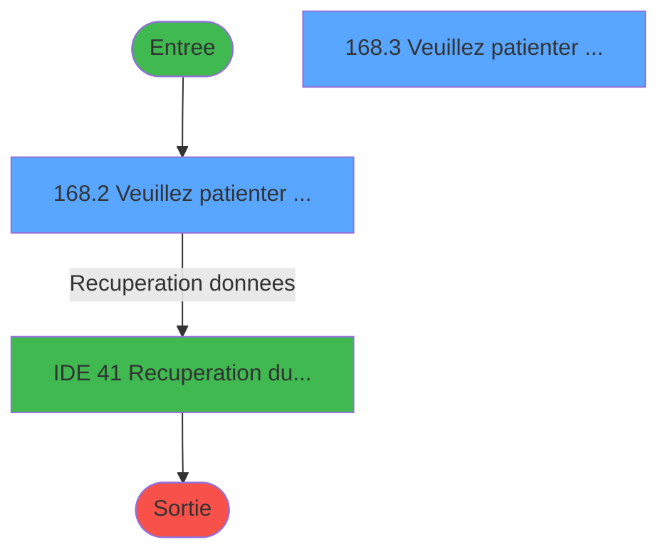
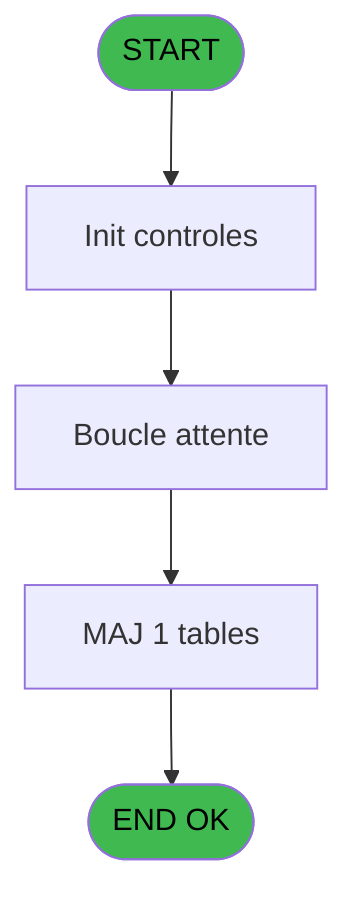
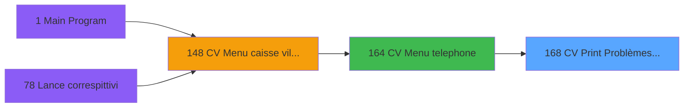

# VIL IDE 168 - CV  Print Problèmes rencontre

> **Analyse**: Phases 1-4 2026-02-03 09:53 -> 09:53 (19s) | Assemblage 09:53
> **Pipeline**: V7.2 Enrichi
> **Structure**: 4 onglets (Resume | Ecrans | Donnees | Connexions)

<!-- TAB:Resume -->

## 1. FICHE D'IDENTITE

| Attribut | Valeur |
|----------|--------|
| Projet | VIL |
| IDE Position | 168 |
| Nom Programme | CV  Print Problèmes rencontre |
| Fichier source | `Prg_168.xml` |
| Domaine metier | Impression |
| Taches | 6 (2 ecrans visibles) |
| Tables modifiees | 1 |
| Programmes appeles | 1 |

## 2. DESCRIPTION FONCTIONNELLE

**CV  Print Problèmes rencontre** assure la gestion complete de ce processus, accessible depuis [CV  Menu telephone (IDE 164)](VIL-IDE-164.md).

Le flux de traitement s'organise en **3 blocs fonctionnels** :

- **Traitement** (3 taches) : traitements metier divers
- **Creation** (2 taches) : insertion d'enregistrements en base (mouvements, prestations)
- **Consultation** (1 tache) : ecrans de recherche, selection et consultation

**Donnees modifiees** : 1 tables en ecriture (commande_autocom_cot).

Detail : phases du traitement

#### Phase 1 : Traitement (3 taches)

- **168** - (sans nom) **[[ECRAN]](#ecran-t1)**
- **168.2** - Veuillez patienter ... **[[ECRAN]](#ecran-t4)**
- **168.3** - Veuillez patienter ... **[[ECRAN]](#ecran-t5)**

Delegue a : [Recuperation du titre (IDE 41)](VIL-IDE-41.md)

#### Phase 2 : Creation (2 taches)

- **168.1** - Creation ASCII
- **168.1.1** - Creation commande tel

#### Phase 3 : Consultation (1 tache)

- **168.3.1** - Recherche du nom/prenom

Delegue a : [Recuperation du titre (IDE 41)](VIL-IDE-41.md)

#### Tables impactees

| Table | Operations | Role metier |
|-------|-----------|-------------|
| commande_autocom_cot | **W** (1 usages) |  |

## 3. BLOCS FONCTIONNELS

### 3.1 Traitement (3 taches)

Traitements internes.

---

#### 168 - (sans nom) [[ECRAN]](#ecran-t1)

**Role** : Traitement interne.
**Ecran** : 789 x 118 DLU (MDI) | [Voir mockup](#ecran-t1)
**Delegue a** : [Recuperation du titre (IDE 41)](VIL-IDE-41.md)

---

#### 168.2 - Veuillez patienter ... [[ECRAN]](#ecran-t4)

**Role** : Traitement : Veuillez patienter ....
**Ecran** : 424 x 56 DLU (MDI) | [Voir mockup](#ecran-t4)
**Delegue a** : [Recuperation du titre (IDE 41)](VIL-IDE-41.md)

---

#### 168.3 - Veuillez patienter ... [[ECRAN]](#ecran-t5)

**Role** : Traitement : Veuillez patienter ....
**Ecran** : 422 x 54 DLU (MDI) | [Voir mockup](#ecran-t5)
**Delegue a** : [Recuperation du titre (IDE 41)](VIL-IDE-41.md)

### 3.2 Creation (2 taches)

Insertion de nouveaux enregistrements en base.

---

#### 168.1 - Creation ASCII

**Role** : Creation d'enregistrement : Creation ASCII.

---

#### 168.1.1 - Creation commande tel

**Role** : Creation d'enregistrement : Creation commande tel.

### 3.3 Consultation (1 tache)

Ecrans de recherche et consultation.

---

#### 168.3.1 - Recherche du nom/prenom

**Role** : Traitement : Recherche du nom/prenom.

## 5. REGLES METIER

*(Aucune regle metier identifiee)*

## 6. CONTEXTE

- **Appele par**: [CV  Menu telephone (IDE 164)](VIL-IDE-164.md)
- **Appelle**: 1 programmes | **Tables**: 3 (W:1 R:1 L:1) | **Taches**: 6 | **Expressions**: 5

<!-- TAB:Ecrans -->

## 8. ECRANS

### 8.1 Forms visibles (2 / 6)

| # | Position | Tache | Nom | Type | Largeur | Hauteur | Bloc |
|---|----------|-------|-----|------|---------|---------|------|
| 1 | 168.2 | 168.2 | Veuillez patienter ... | MDI | 424 | 56 | Traitement |
| 2 | 168.3 | 168.3 | Veuillez patienter ... | MDI | 422 | 54 | Traitement |

### 8.2 Mockups Ecrans

---

#### 168.2 - Veuillez patienter ...
**Tache** : [168.2](#t4) | **Type** : MDI | **Dimensions** : 424 x 56 DLU
**Bloc** : Traitement | **Titre IDE** : Veuillez patienter ...

<!-- FORM-DATA:
{
    "width":  424,
    "vFactor":  8,
    "type":  "MDI",
    "hFactor":  8,
    "controls":  [
                     {
                         "x":  1,
                         "type":  "label",
                         "var":  "",
                         "y":  0,
                         "w":  423,
                         "fmt":  "",
                         "name":  "",
                         "h":  29,
                         "color":  "",
                         "text":  "",
                         "parent":  null
                     },
                     {
                         "x":  99,
                         "type":  "label",
                         "var":  "",
                         "y":  10,
                         "w":  275,
                         "fmt":  "",
                         "name":  "",
                         "h":  8,
                         "color":  "7",
                         "text":  "Traitement en cours...",
                         "parent":  null
                     },
                     {
                         "x":  1,
                         "type":  "label",
                         "var":  "",
                         "y":  29,
                         "w":  423,
                         "fmt":  "",
                         "name":  "",
                         "h":  27,
                         "color":  "",
                         "text":  "",
                         "parent":  null
                     },
                     {
                         "x":  77,
                         "type":  "label",
                         "var":  "",
                         "y":  39,
                         "w":  270,
                         "fmt":  "",
                         "name":  "",
                         "h":  8,
                         "color":  "",
                         "text":  "Attente de reponse Autocom",
                         "parent":  null
                     },
                     {
                         "x":  2,
                         "type":  "image",
                         "var":  "",
                         "y":  2,
                         "w":  72,
                         "fmt":  "",
                         "name":  "",
                         "h":  25,
                         "color":  "",
                         "text":  "",
                         "parent":  null
                     }
                 ],
    "taskId":  "168.2",
    "height":  56
}
-->

---

#### 168.3 - Veuillez patienter ...
**Tache** : [168.3](#t5) | **Type** : MDI | **Dimensions** : 422 x 54 DLU
**Bloc** : Traitement | **Titre IDE** : Veuillez patienter ...

<!-- FORM-DATA:
{
    "width":  422,
    "vFactor":  8,
    "type":  "MDI",
    "hFactor":  8,
    "controls":  [
                     {
                         "x":  117,
                         "type":  "label",
                         "var":  "",
                         "y":  8,
                         "w":  275,
                         "fmt":  "",
                         "name":  "",
                         "h":  8,
                         "color":  "7",
                         "text":  "Impression en cours...",
                         "parent":  null
                     },
                     {
                         "x":  0,
                         "type":  "label",
                         "var":  "",
                         "y":  27,
                         "w":  423,
                         "fmt":  "",
                         "name":  "",
                         "h":  27,
                         "color":  "",
                         "text":  "",
                         "parent":  null
                     },
                     {
                         "x":  53,
                         "type":  "label",
                         "var":  "",
                         "y":  37,
                         "w":  317,
                         "fmt":  "",
                         "name":  "",
                         "h":  8,
                         "color":  "",
                         "text":  "Impression problemes rencontres",
                         "parent":  null
                     },
                     {
                         "x":  1,
                         "type":  "image",
                         "var":  "",
                         "y":  0,
                         "w":  72,
                         "fmt":  "",
                         "name":  "",
                         "h":  25,
                         "color":  "",
                         "text":  "",
                         "parent":  null
                     }
                 ],
    "taskId":  "168.3",
    "height":  54
}
-->

## 9. NAVIGATION

### 9.1 Enchainement des ecrans

**Detail par enchainement :**

| Depuis | Action | Vers | Retour |
|--------|--------|------|--------|
| Veuillez patienter ... | Recuperation donnees | [Recuperation du titre (IDE 41)](VIL-IDE-41.md) | Retour ecran |

### 9.3 Structure hierarchique (6 taches)

| Position | Tache | Type | Dimensions | Bloc |
|----------|-------|------|------------|------|
| **168.1** | [**(sans nom)** (168)](#t1) [mockup](#ecran-t1) | MDI | 789x118 | Traitement |
| 168.1.1 | [Veuillez patienter ... (168.2)](#t4) [mockup](#ecran-t4) | MDI | 424x56 | |
| 168.1.2 | [Veuillez patienter ... (168.3)](#t5) [mockup](#ecran-t5) | MDI | 422x54 | |
| **168.2** | [**Creation ASCII** (168.1)](#t2) | MDI | - | Creation |
| 168.2.1 | [Creation commande tel (168.1.1)](#t3) | MDI | - | |
| **168.3** | [**Recherche du nom/prenom** (168.3.1)](#t6) | MDI | - | Consultation |

### 9.4 Algorigramme

> **Legende**: Vert = START/END OK | Rouge = END KO | Bleu = Decisions
> *Algorigramme auto-genere. Utiliser `/algorigramme` pour une synthese metier detaillee.*

<!-- TAB:Donnees -->

## 10. TABLES

### Tables utilisees (3)

| ID | Nom | Description | Type | R | W | L | Usages |
|----|-----|-------------|------|---|---|---|--------|
| 30 | gm-recherche_____gmr | Index de recherche | DB |   |   | L | 1 |
| 75 | commande_autocom_cot |  | DB |   | **W** |   | 1 |
| 80 | codes_autocom____aut |  | DB | R |   |   | 1 |

### Colonnes par table (2 / 2 tables avec colonnes identifiees)

Table 75 - commande_autocom_cot (**W**) - 1 usages

| Lettre | Variable | Acces | Type |
|--------|----------|-------|------|
| G | W0 n° autocom | W | Alpha |

Table 80 - codes_autocom____aut (R) - 1 usages

| Lettre | Variable | Acces | Type |
|--------|----------|-------|------|
| G | W0 n° autocom | R | Alpha |

## 11. VARIABLES

### 11.1 Parametres entrants (2)

Variables recues du programme appelant ([CV  Menu telephone (IDE 164)](VIL-IDE-164.md)).

| Lettre | Nom | Type | Usage dans |
|--------|-----|------|-----------|
| A | P0 societe | Alpha | - |
| B | P0 nom village | Alpha | - |

### 11.2 Variables de session (1)

Variables persistantes pendant toute la session.

| Lettre | Nom | Type | Usage dans |
|--------|-----|------|-----------|
| I | v.titre | Alpha | 1x session |

### 11.3 Variables de travail (6)

Variables internes au programme.

| Lettre | Nom | Type | Usage dans |
|--------|-----|------|-----------|
| C | W0 confirmation | Numeric | 1x calcul interne |
| D | W0 nom fichier | Alpha | 1x calcul interne |
| E | W0 n° ligne | Alpha | - |
| F | W0 n° poste | Alpha | - |
| G | W0 n° autocom | Alpha | - |
| H | W0 chaine | Alpha | - |

## 12. EXPRESSIONS

**5 / 5 expressions decodees (100%)**

### 12.1 Repartition par type

| Type | Expressions | Regles |
|------|-------------|--------|
| CONSTANTE | 1 | 0 |
| CONCATENATION | 1 | 0 |
| CONDITION | 1 | 0 |
| STRING | 2 | 0 |

### 12.2 Expressions cles par type

#### CONSTANTE (1 expressions)

| Type | IDE | Expression | Regle |
|------|-----|------------|-------|
| CONSTANTE | 3 | `162` | - |

#### CONCATENATION (1 expressions)

| Type | IDE | Expression | Regle |
|------|-----|------------|-------|
| CONCATENATION | 5 | `'4'&DStr (Date (),'DD')&ASCIIChr (65+Hour (Time ()))&TStr (Time (),'MMSS')&'.'&Str (VG40,'3P0')` | - |

#### CONDITION (1 expressions)

| Type | IDE | Expression | Regle |
|------|-----|------------|-------|
| CONDITION | 1 | `W0 confirmation [C]=6` | - |

#### STRING (2 expressions)

| Type | IDE | Expression | Regle |
|------|-----|------------|-------|
| STRING | 4 | `FileDelete (Trim (INIGet ('[MAGIC_LOGICAL_NAMES]club_pabx'))&W0 nom fichier [D])` | - |
| STRING | 2 | `RTrim (v.titre [I])` | - |

<!-- TAB:Connexions -->

## 13. GRAPHE D'APPELS

### 13.1 Chaine depuis Main (Callers)

Main -> ... -> [CV  Menu telephone (IDE 164)](VIL-IDE-164.md) -> **CV  Print Problèmes rencontre (IDE 168)**

### 13.2 Callers

| IDE | Nom Programme | Nb Appels |
|-----|---------------|-----------|
| [164](VIL-IDE-164.md) | CV  Menu telephone | 1 |

### 13.3 Callees (programmes appeles)

### 13.4 Detail Callees avec contexte

| IDE | Nom Programme | Appels | Contexte |
|-----|---------------|--------|----------|
| [41](VIL-IDE-41.md) | Recuperation du titre | 1 | Recuperation donnees |

## 14. RECOMMANDATIONS MIGRATION

### 14.1 Profil du programme

| Metrique | Valeur | Impact migration |
|----------|--------|-----------------|
| Lignes de logique | 65 | Programme compact |
| Expressions | 5 | Peu de logique |
| Tables WRITE | 1 | Impact faible |
| Sous-programmes | 1 | Peu de dependances |
| Ecrans visibles | 2 | Quelques ecrans |
| Code desactive | 0% (0 / 65) | Code sain |
| Regles metier | 0 | Pas de regle identifiee |

### 14.2 Plan de migration par bloc

#### Traitement (3 taches: 3 ecrans, 0 traitement)

- **Strategie** : 3 composant(s) UI (Razor/React) avec formulaires et validation.
- 1 sous-programme(s) a migrer ou a reutiliser depuis les services existants.
- Decomposer les taches en services unitaires testables.

#### Creation (2 taches: 0 ecran, 2 traitements)

- **Strategie** : Repository pattern avec Entity Framework Core.
- Insertion via `IRepository<T>.CreateAsync()`

#### Consultation (1 tache: 0 ecran, 1 traitement)

- **Strategie** : Composants de recherche/selection en modales.

### 14.3 Dependances critiques

| Dependance | Type | Appels | Impact |
|------------|------|--------|--------|
| commande_autocom_cot | Table WRITE (Database) | 1x | Schema + repository |
| [Recuperation du titre (IDE 41)](VIL-IDE-41.md) | Sous-programme | 1x | Normale - Recuperation donnees |

---
*Spec DETAILED generee par Pipeline V7.2 - 2026-02-03 09:53*
