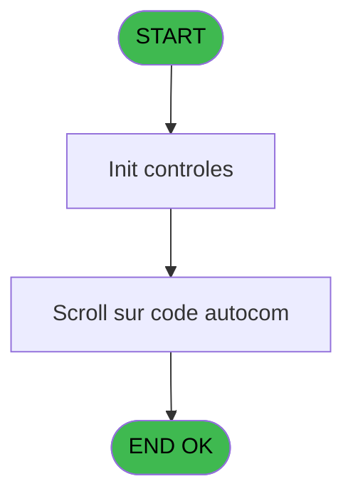

# VIL IDE 169 - CV  Recherche GM par code

> **Analyse**: Phases 1-4 2026-02-03 09:54 -> 09:54 (25s) | Assemblage 09:54
> **Pipeline**: V7.2 Enrichi
> **Structure**: 4 onglets (Resume | Ecrans | Donnees | Connexions)

<!-- TAB:Resume -->

## 1. FICHE D'IDENTITE

| Attribut | Valeur |
|----------|--------|
| Projet | VIL |
| IDE Position | 169 |
| Nom Programme | CV  Recherche GM par code |
| Fichier source | `Prg_169.xml` |
| Domaine metier | Consultation |
| Taches | 2 (1 ecrans visibles) |
| Tables modifiees | 0 |
| Programmes appeles | 1 |

## 2. DESCRIPTION FONCTIONNELLE

**CV  Recherche GM par code** assure la gestion complete de ce processus, accessible depuis [CV  Menu telephone (IDE 164)](VIL-IDE-164.md).

Le flux de traitement s'organise en **2 blocs fonctionnels** :

- **Consultation** (1 tache) : ecrans de recherche, selection et consultation
- **Traitement** (1 tache) : traitements metier divers

Detail : phases du traitement

#### Phase 1 : Traitement (1 tache)

- **169** - (sans nom) **[[ECRAN]](#ecran-t1)**

Delegue a : [Recuperation du titre (IDE 41)](VIL-IDE-41.md)

#### Phase 2 : Consultation (1 tache)

- **169.1** - CV  Recherche GM par code **[[ECRAN]](#ecran-t2)**

Delegue a : [Recuperation du titre (IDE 41)](VIL-IDE-41.md)

## 3. BLOCS FONCTIONNELS

### 3.1 Traitement (1 tache)

Traitements internes.

---

#### 169 - (sans nom) [[ECRAN]](#ecran-t1)

**Role** : Traitement interne.
**Ecran** : 169 x 102 DLU (MDI) | [Voir mockup](#ecran-t1)
**Delegue a** : [Recuperation du titre (IDE 41)](VIL-IDE-41.md)

### 3.2 Consultation (1 tache)

Ecrans de recherche et consultation.

---

#### 169.1 - CV  Recherche GM par code [[ECRAN]](#ecran-t2)

**Role** : Traitement : CV  Recherche GM par code.
**Ecran** : 880 x 247 DLU (MDI) | [Voir mockup](#ecran-t2)
**Variables liees** : B (P0 longueur code tel), C (W0 code recherche)

## 5. REGLES METIER

*(Aucune regle metier identifiee)*

## 6. CONTEXTE

- **Appele par**: [CV  Menu telephone (IDE 164)](VIL-IDE-164.md)
- **Appelle**: 1 programmes | **Tables**: 2 (W:0 R:1 L:1) | **Taches**: 2 | **Expressions**: 3

<!-- TAB:Ecrans -->

## 8. ECRANS

### 8.1 Forms visibles (1 / 2)

| # | Position | Tache | Nom | Type | Largeur | Hauteur | Bloc |
|---|----------|-------|-----|------|---------|---------|------|
| 1 | 169.1 | 169.1 | CV  Recherche GM par code | MDI | 880 | 247 | Consultation |

### 8.2 Mockups Ecrans

---

#### 169.1 - CV  Recherche GM par code
**Tache** : [169.1](#t2) | **Type** : MDI | **Dimensions** : 880 x 247 DLU
**Bloc** : Consultation | **Titre IDE** : CV  Recherche GM par code

<!-- FORM-DATA:
{
    "width":  880,
    "vFactor":  8,
    "type":  "MDI",
    "hFactor":  8,
    "controls":  [
                     {
                         "x":  2,
                         "type":  "label",
                         "var":  "",
                         "y":  0,
                         "w":  875,
                         "fmt":  "",
                         "name":  "",
                         "h":  17,
                         "color":  "",
                         "text":  "",
                         "parent":  null
                     },
                     {
                         "x":  23,
                         "type":  "table",
                         "var":  "",
                         "name":  "",
                         "titleH":  12,
                         "color":  "110",
                         "w":  832,
                         "y":  27,
                         "fmt":  "",
                         "parent":  null,
                         "text":  "",
                         "rowH":  14,
                         "h":  142,
                         "cols":  [
                                      {
                                          "title":  "Code",
                                          "layer":  1,
                                          "w":  93
                                      },
                                      {
                                          "title":  "Nom / Prénom",
                                          "layer":  2,
                                          "w":  350
                                      },
                                      {
                                          "title":  "Statut",
                                          "layer":  3,
                                          "w":  170
                                      },
                                      {
                                          "title":  "Poste",
                                          "layer":  4,
                                          "w":  96
                                      },
                                      {
                                          "title":  "Ligne",
                                          "layer":  5,
                                          "w":  88
                                      }
                                  ],
                         "rows":  5
                     },
                     {
                         "x":  29,
                         "type":  "label",
                         "var":  "",
                         "y":  176,
                         "w":  311,
                         "fmt":  "",
                         "name":  "",
                         "h":  32,
                         "color":  "195",
                         "text":  "Recherche",
                         "parent":  null
                     },
                     {
                         "x":  86,
                         "type":  "label",
                         "var":  "",
                         "y":  189,
                         "w":  72,
                         "fmt":  "",
                         "name":  "",
                         "h":  8,
                         "color":  "",
                         "text":  "N° Carte",
                         "parent":  15
                     },
                     {
                         "x":  0,
                         "type":  "label",
                         "var":  "",
                         "y":  222,
                         "w":  878,
                         "fmt":  "",
                         "name":  "",
                         "h":  23,
                         "color":  "",
                         "text":  "",
                         "parent":  null
                     },
                     {
                         "x":  180,
                         "type":  "edit",
                         "var":  "",
                         "y":  188,
                         "w":  82,
                         "fmt":  "",
                         "name":  "",
                         "h":  10,
                         "color":  "6",
                         "text":  "",
                         "parent":  15
                     },
                     {
                         "x":  30,
                         "type":  "edit",
                         "var":  "",
                         "y":  43,
                         "w":  75,
                         "fmt":  "6P0",
                         "name":  "",
                         "h":  8,
                         "color":  "110",
                         "text":  "",
                         "parent":  4
                     },
                     {
                         "x":  736,
                         "type":  "edit",
                         "var":  "",
                         "y":  43,
                         "w":  75,
                         "fmt":  "",
                         "name":  "",
                         "h":  8,
                         "color":  "110",
                         "text":  "",
                         "parent":  4
                     },
                     {
                         "x":  642,
                         "type":  "edit",
                         "var":  "",
                         "y":  43,
                         "w":  75,
                         "fmt":  "",
                         "name":  "",
                         "h":  8,
                         "color":  "110",
                         "text":  "",
                         "parent":  4
                     },
                     {
                         "x":  668,
                         "type":  "edit",
                         "var":  "",
                         "y":  4,
                         "w":  203,
                         "fmt":  "WWW DD MMM YYYYZ",
                         "name":  "",
                         "h":  8,
                         "color":  "",
                         "text":  "",
                         "parent":  1
                     },
                     {
                         "x":  123,
                         "type":  "edit",
                         "var":  "",
                         "y":  43,
                         "w":  333,
                         "fmt":  "29",
                         "name":  "",
                         "h":  8,
                         "color":  "110",
                         "text":  "",
                         "parent":  4
                     },
                     {
                         "x":  472,
                         "type":  "edit",
                         "var":  "",
                         "y":  43,
                         "w":  154,
                         "fmt":  "13",
                         "name":  "",
                         "h":  8,
                         "color":  "110",
                         "text":  "",
                         "parent":  4
                     },
                     {
                         "x":  522,
                         "type":  "image",
                         "var":  "",
                         "y":  181,
                         "w":  125,
                         "fmt":  "",
                         "name":  "",
                         "h":  32,
                         "color":  "",
                         "text":  "",
                         "parent":  null
                     },
                     {
                         "x":  8,
                         "type":  "button",
                         "var":  "",
                         "y":  225,
                         "w":  160,
                         "fmt":  "\u0026Quitter",
                         "name":  "",
                         "h":  18,
                         "color":  "",
                         "text":  "",
                         "parent":  null
                     },
                     {
                         "x":  8,
                         "type":  "edit",
                         "var":  "",
                         "y":  4,
                         "w":  267,
                         "fmt":  "20",
                         "name":  "",
                         "h":  8,
                         "color":  "",
                         "text":  "",
                         "parent":  1
                     }
                 ],
    "taskId":  "169.1",
    "height":  247
}
-->

<strong>Champs : 8 champs</strong>

| Pos (x,y) | Nom | Variable | Type |
|-----------|-----|----------|------|
| 180,188 | (sans nom) | - | edit |
| 30,43 | 6P0 | - | edit |
| 736,43 | (sans nom) | - | edit |
| 642,43 | (sans nom) | - | edit |
| 668,4 | WWW DD MMM YYYYZ | - | edit |
| 123,43 | 29 | - | edit |
| 472,43 | 13 | - | edit |
| 8,4 | 20 | - | edit |

<strong>Boutons : 1 boutons</strong>

| Bouton | Pos (x,y) | Action |
|--------|-----------|--------|
| Quitter | 8,225 | Quitte le programme |

## 9. NAVIGATION

Ecran unique: **CV  Recherche GM par code**

### 9.3 Structure hierarchique (2 taches)

| Position | Tache | Type | Dimensions | Bloc |
|----------|-------|------|------------|------|
| **169.1** | [**(sans nom)** (169)](#t1) [mockup](#ecran-t1) | MDI | 169x102 | Traitement |
| **169.2** | [**CV  Recherche GM par code** (169.1)](#t2) [mockup](#ecran-t2) | MDI | 880x247 | Consultation |

### 9.4 Algorigramme

> **Legende**: Vert = START/END OK | Rouge = END KO | Bleu = Decisions
> *Algorigramme auto-genere. Utiliser `/algorigramme` pour une synthese metier detaillee.*

<!-- TAB:Donnees -->

## 10. TABLES

### Tables utilisees (2)

| ID | Nom | Description | Type | R | W | L | Usages |
|----|-----|-------------|------|---|---|---|--------|
| 30 | gm-recherche_____gmr | Index de recherche | DB | R |   |   | 1 |
| 80 | codes_autocom____aut |  | DB |   |   | L | 1 |

### Colonnes par table (1 / 1 tables avec colonnes identifiees)

Table 30 - gm-recherche_____gmr (R) - 1 usages

| Lettre | Variable | Acces | Type |
|--------|----------|-------|------|
| A | W1 code recherche | R | Numeric |
| B | W1 fin tache | R | Alpha |
| C | v.titre | R | Alpha |

## 11. VARIABLES

### 11.1 Parametres entrants (2)

Variables recues du programme appelant ([CV  Menu telephone (IDE 164)](VIL-IDE-164.md)).

| Lettre | Nom | Type | Usage dans |
|--------|-----|------|-----------|
| A | P0 societe | Alpha | 1x parametre entrant |
| B | P0 longueur code tel | Numeric | - |

### 11.2 Variables de travail (2)

Variables internes au programme.

| Lettre | Nom | Type | Usage dans |
|--------|-----|------|-----------|
| C | W0 code recherche | Numeric | - |
| D | W0 fin tache | Alpha | 1x calcul interne |

## 12. EXPRESSIONS

**3 / 3 expressions decodees (100%)**

### 12.1 Repartition par type

| Type | Expressions | Regles |
|------|-------------|--------|
| CONSTANTE | 1 | 0 |
| CONDITION | 2 | 0 |

### 12.2 Expressions cles par type

#### CONSTANTE (1 expressions)

| Type | IDE | Expression | Regle |
|------|-----|------------|-------|
| CONSTANTE | 2 | `'C'` | - |

#### CONDITION (2 expressions)

| Type | IDE | Expression | Regle |
|------|-----|------------|-------|
| CONDITION | 3 | `W0 fin tache [D]='F'` | - |
| CONDITION | 1 | `P0 societe [A]=''` | - |

<!-- TAB:Connexions -->

## 13. GRAPHE D'APPELS

### 13.1 Chaine depuis Main (Callers)

Main -> ... -> [CV  Menu telephone (IDE 164)](VIL-IDE-164.md) -> **CV  Recherche GM par code (IDE 169)**

### 13.2 Callers

| IDE | Nom Programme | Nb Appels |
|-----|---------------|-----------|
| [164](VIL-IDE-164.md) | CV  Menu telephone | 1 |

### 13.3 Callees (programmes appeles)

### 13.4 Detail Callees avec contexte

| IDE | Nom Programme | Appels | Contexte |
|-----|---------------|--------|----------|
| [41](VIL-IDE-41.md) | Recuperation du titre | 1 | Recuperation donnees |

## 14. RECOMMANDATIONS MIGRATION

### 14.1 Profil du programme

| Metrique | Valeur | Impact migration |
|----------|--------|-----------------|
| Lignes de logique | 37 | Programme compact |
| Expressions | 3 | Peu de logique |
| Tables WRITE | 0 | Impact faible |
| Sous-programmes | 1 | Peu de dependances |
| Ecrans visibles | 1 | Ecran unique ou traitement batch |
| Code desactive | 0% (0 / 37) | Code sain |
| Regles metier | 0 | Pas de regle identifiee |

### 14.2 Plan de migration par bloc

#### Traitement (1 tache: 1 ecran, 0 traitement)

- **Strategie** : 1 composant(s) UI (Razor/React) avec formulaires et validation.
- 1 sous-programme(s) a migrer ou a reutiliser depuis les services existants.
- Decomposer les taches en services unitaires testables.

#### Consultation (1 tache: 1 ecran, 0 traitement)

- **Strategie** : Composants de recherche/selection en modales.
- 1 ecran : CV  Recherche GM par code

### 14.3 Dependances critiques

| Dependance | Type | Appels | Impact |
|------------|------|--------|--------|
| [Recuperation du titre (IDE 41)](VIL-IDE-41.md) | Sous-programme | 1x | Normale - Recuperation donnees |

---
*Spec DETAILED generee par Pipeline V7.2 - 2026-02-03 09:54*
