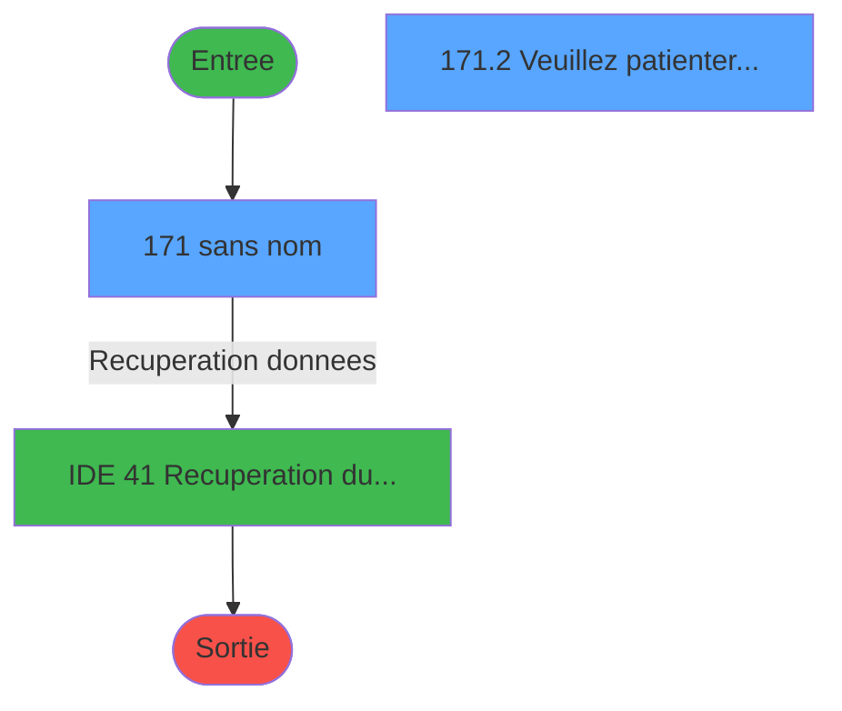
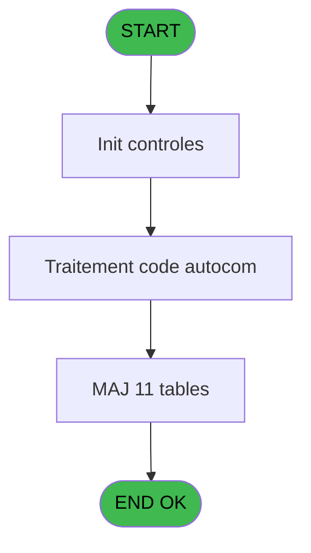
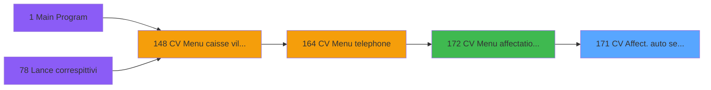

# VIL IDE 171 - CV  Affect. auto /seminaire

> **Analyse**: Phases 1-4 2026-02-03 20:50 -> 20:50 (15s) | Assemblage 20:50
> **Pipeline**: V7.2 Enrichi
> **Structure**: 4 onglets (Resume | Ecrans | Donnees | Connexions)

<!-- TAB:Resume -->

## 1. FICHE D'IDENTITE

| Attribut | Valeur |
|----------|--------|
| Projet | VIL |
| IDE Position | 171 |
| Nom Programme | CV  Affect. auto /seminaire |
| Fichier source | `Prg_171.xml` |
| Dossier IDE | Téléphone |
| Taches | 34 (2 ecrans visibles) |
| Tables modifiees | 11 |
| Programmes appeles | 1 |

## 2. DESCRIPTION FONCTIONNELLE

**CV  Affect. auto /seminaire** assure la gestion complete de ce processus, accessible depuis [CV  Menu affectation auto (IDE 172)](VIL-IDE-172.md).

Le flux de traitement s'organise en **4 blocs fonctionnels** :

- **Traitement** (24 taches) : traitements metier divers
- **Creation** (7 taches) : insertion d'enregistrements en base (mouvements, prestations)
- **Calcul** (2 taches) : calculs de montants, stocks ou compteurs
- **Validation** (1 tache) : controles et verifications de coherence

**Donnees modifiees** : 11 tables en ecriture (compte_gm________cgm, serie_ligne______slg, ligne_telephone__lgn, compteurs________cpt, generation_code_gen, serie_telephone__stl, commande_autocom_cot, codes_autocom____aut, fichier_echanges, nb_code__poste, tempo_heures).

Detail : phases du traitement

#### Phase 1 : Traitement (24 taches)

- **171** - (sans nom) **[[ECRAN]](#ecran-t1)**
- **171.1** - Suppression Tempo
- **171.2** - Veuillez patienter... **[[ECRAN]](#ecran-t3)**
- **171.2.1** - Test reseau
- **171.2.2.1** - Decrementation Code/poste
- **171.2.3** - Code existe deja?
- **171.2.4** - Ecriture dans table autocom
- **171.2.5.1** - Ecrire ASCII triplet
- **171.2.5.5** - Tempo 1 seconde
- **171.2.6** - Formation triplet
- **171.2.6.1** - Nettoyage des anciens triplets
- **171.2.6.1.2** - Libere Ligne ou SDA
- **171.2.6.1.3** - Libere Poste
- **171.2.6.1.5** - Commande telephone
- **171.2.6.1.7** - Tempo 1 seconde
- **171.2.7** - Recuperation code auto de GEN
- **171.2.7.1** - Recup. serie
- **171.2.7.2** - Changement serie
- **171.2.8** - Recuperation code auto de GEN
- **171.2.8.1** - Recup. serie
- **171.2.8.2** - Changement serie
- **171.2.10** - Tempo 1 seconde
- **171.2.11** - Deblocage reseau
- **171.3** - Veuillez patienter ... **[[ECRAN]](#ecran-t34)**

Delegue a : [Recuperation du titre (IDE 41)](VIL-IDE-41.md)

#### Phase 2 : Calcul (2 taches)

- **171.2.2** - Recup. compteur codes
- **171.2.6.1.1** - Decrementation compteur

#### Phase 3 : Creation (7 taches)

- **171.2.5** - Creation ASCII
- **171.2.5.2** - Creation commande tel
- **171.2.5.3** - Creation commande tel
- **171.2.5.4** - Creation commande tel
- **171.2.6.1.4** - Creation ASCII
- **171.2.6.1.6** - Creation Echange
- **171.2.9** - Creation Tempo

#### Phase 4 : Validation (1 tache)

- **171.2.6.2** - Controle du nombre de poste

#### Tables impactees

| Table | Operations | Role metier |
|-------|-----------|-------------|
| fichier_echanges | **W** (3 usages) |  |
| nb_code__poste | **W** (3 usages) |  |
| codes_autocom____aut | R/**W** (3 usages) |  |
| tempo_heures | **W** (3 usages) | Table temporaire ecran |
| ligne_telephone__lgn | **W** (2 usages) |  |
| commande_autocom_cot | **W** (2 usages) |  |
| compteurs________cpt | **W** (2 usages) | Comptes GM (generaux) |
| serie_ligne______slg | R/**W** (2 usages) |  |
| serie_telephone__stl | R/**W** (2 usages) |  |
| compte_gm________cgm | **W** (2 usages) | Comptes GM (generaux) |
| generation_code_gen | **W** (1 usages) |  |

## 3. BLOCS FONCTIONNELS

### 3.1 Traitement (24 taches)

Traitements internes.

---

#### 171 - (sans nom) [[ECRAN]](#ecran-t1)

**Role** : Tache d'orchestration : point d'entree du programme (24 sous-taches). Coordonne l'enchainement des traitements.
**Ecran** : 562 x 135 DLU (MDI) | [Voir mockup](#ecran-t1)

23 sous-taches directes

| Tache | Nom | Bloc |
|-------|-----|------|
| [171.1](#t2) | Suppression Tempo | Traitement |
| [171.2](#t3) | Veuillez patienter... **[[ECRAN]](#ecran-t3)** | Traitement |
| [171.2.1](#t4) | Test reseau | Traitement |
| [171.2.2.1](#t6) | Decrementation Code/poste | Traitement |
| [171.2.3](#t7) | Code existe deja? | Traitement |
| [171.2.4](#t8) | Ecriture dans table autocom | Traitement |
| [171.2.5.1](#t10) | Ecrire ASCII triplet | Traitement |
| [171.2.5.5](#t14) | Tempo 1 seconde | Traitement |
| [171.2.6](#t15) | Formation triplet | Traitement |
| [171.2.6.1](#t16) | Nettoyage des anciens triplets | Traitement |
| [171.2.6.1.2](#t18) | Libere Ligne ou SDA | Traitement |
| [171.2.6.1.3](#t19) | Libere Poste | Traitement |
| [171.2.6.1.5](#t21) | Commande telephone | Traitement |
| [171.2.6.1.7](#t23) | Tempo 1 seconde | Traitement |
| [171.2.7](#t25) | Recuperation code auto de GEN | Traitement |
| [171.2.7.1](#t26) | Recup. serie | Traitement |
| [171.2.7.2](#t27) | Changement serie | Traitement |
| [171.2.8](#t28) | Recuperation code auto de GEN | Traitement |
| [171.2.8.1](#t29) | Recup. serie | Traitement |
| [171.2.8.2](#t30) | Changement serie | Traitement |
| [171.2.10](#t32) | Tempo 1 seconde | Traitement |
| [171.2.11](#t33) | Deblocage reseau | Traitement |
| [171.3](#t34) | Veuillez patienter ... **[[ECRAN]](#ecran-t34)** | Traitement |

---

#### 171.1 - Suppression Tempo

**Role** : Traitement : Suppression Tempo.

---

#### 171.2 - Veuillez patienter... [[ECRAN]](#ecran-t3)

**Role** : Traitement : Veuillez patienter....
**Ecran** : 424 x 56 DLU (MDI) | [Voir mockup](#ecran-t3)

---

#### 171.2.1 - Test reseau

**Role** : Verification : Test reseau.

---

#### 171.2.2.1 - Decrementation Code/poste

**Role** : Traitement : Decrementation Code/poste.

---

#### 171.2.3 - Code existe deja?

**Role** : Traitement : Code existe deja?.
**Variables liees** : C (P0 nb code accepte), D (P0 longueur code)

---

#### 171.2.4 - Ecriture dans table autocom

**Role** : Traitement : Ecriture dans table autocom.

---

#### 171.2.5.1 - Ecrire ASCII triplet

**Role** : Traitement : Ecrire ASCII triplet.
**Variables liees** : G (P0 type triplet)

---

#### 171.2.5.5 - Tempo 1 seconde

**Role** : Traitement : Tempo 1 seconde.

---

#### 171.2.6 - Formation triplet

**Role** : Traitement : Formation triplet.
**Variables liees** : G (P0 type triplet)

---

#### 171.2.6.1 - Nettoyage des anciens triplets

**Role** : Traitement : Nettoyage des anciens triplets.

---

#### 171.2.6.1.2 - Libere Ligne ou SDA

**Role** : Traitement : Libere Ligne ou SDA.
**Variables liees** : E (P0 max ligne/poste)

---

#### 171.2.6.1.3 - Libere Poste

**Role** : Traitement : Libere Poste.
**Variables liees** : E (P0 max ligne/poste)

---

#### 171.2.6.1.5 - Commande telephone

**Role** : Traitement : Commande telephone.

---

#### 171.2.6.1.7 - Tempo 1 seconde

**Role** : Traitement : Tempo 1 seconde.

---

#### 171.2.7 - Recuperation code auto de GEN

**Role** : Consultation/chargement : Recuperation code auto de GEN.
**Variables liees** : C (P0 nb code accepte), D (P0 longueur code)

---

#### 171.2.7.1 - Recup. serie

**Role** : Consultation/chargement : Recup. serie.

---

#### 171.2.7.2 - Changement serie

**Role** : Traitement : Changement serie.

---

#### 171.2.8 - Recuperation code auto de GEN

**Role** : Consultation/chargement : Recuperation code auto de GEN.
**Variables liees** : C (P0 nb code accepte), D (P0 longueur code)

---

#### 171.2.8.1 - Recup. serie

**Role** : Consultation/chargement : Recup. serie.

---

#### 171.2.8.2 - Changement serie

**Role** : Traitement : Changement serie.

---

#### 171.2.10 - Tempo 1 seconde

**Role** : Traitement : Tempo 1 seconde.

---

#### 171.2.11 - Deblocage reseau

**Role** : Traitement : Deblocage reseau.

---

#### 171.3 - Veuillez patienter ... [[ECRAN]](#ecran-t34)

**Role** : Traitement : Veuillez patienter ....
**Ecran** : 422 x 56 DLU (MDI) | [Voir mockup](#ecran-t34)

### 3.2 Calcul (2 taches)

Calculs metier : montants, stocks, compteurs.

---

#### 171.2.2 - Recup. compteur codes

**Role** : Calcul : Recup. compteur codes.

---

#### 171.2.6.1.1 - Decrementation compteur

**Role** : Calcul : Decrementation compteur.

### 3.3 Creation (7 taches)

Insertion de nouveaux enregistrements en base.

---

#### 171.2.5 - Creation ASCII

**Role** : Creation d'enregistrement : Creation ASCII.

---

#### 171.2.5.2 - Creation commande tel

**Role** : Creation d'enregistrement : Creation commande tel.

---

#### 171.2.5.3 - Creation commande tel

**Role** : Creation d'enregistrement : Creation commande tel.

---

#### 171.2.5.4 - Creation commande tel

**Role** : Creation d'enregistrement : Creation commande tel.

---

#### 171.2.6.1.4 - Creation ASCII

**Role** : Creation d'enregistrement : Creation ASCII.

---

#### 171.2.6.1.6 - Creation Echange

**Role** : Creation d'enregistrement : Creation Echange.

---

#### 171.2.9 - Creation Tempo

**Role** : Creation d'enregistrement : Creation Tempo.

### 3.4 Validation (1 tache)

Controles de coherence : 1 tache verifie les donnees et conditions.

---

#### 171.2.6.2 - Controle du nombre de poste

**Role** : Calcul : Controle du nombre de poste.
**Variables liees** : E (P0 max ligne/poste)

## 5. REGLES METIER

*(Aucune regle metier identifiee)*

## 6. CONTEXTE

- **Appele par**: [CV  Menu affectation auto (IDE 172)](VIL-IDE-172.md)
- **Appelle**: 1 programmes | **Tables**: 18 (W:11 R:5 L:6) | **Taches**: 34 | **Expressions**: 11

<!-- TAB:Ecrans -->

## 8. ECRANS

### 8.1 Forms visibles (2 / 34)

| # | Position | Tache | Nom | Type | Largeur | Hauteur | Bloc |
|---|----------|-------|-----|------|---------|---------|------|
| 1 | 171 | 171 | (sans nom) | MDI | 562 | 135 | Traitement |
| 2 | 171.2 | 171.2 | Veuillez patienter... | MDI | 424 | 56 | Traitement |

### 8.2 Mockups Ecrans

---

#### 171 - (sans nom)
**Tache** : [171](#t1) | **Type** : MDI | **Dimensions** : 562 x 135 DLU
**Bloc** : Traitement | **Titre IDE** : (sans nom)

<!-- FORM-DATA:
{
    "width":  562,
    "vFactor":  8,
    "type":  "MDI",
    "hFactor":  8,
    "controls":  [
                     {
                         "x":  0,
                         "type":  "label",
                         "var":  "",
                         "y":  2,
                         "w":  559,
                         "fmt":  "",
                         "name":  "",
                         "h":  17,
                         "color":  "",
                         "text":  "",
                         "parent":  null
                     },
                     {
                         "x":  27,
                         "type":  "label",
                         "var":  "",
                         "y":  31,
                         "w":  519,
                         "fmt":  "",
                         "name":  "",
                         "h":  65,
                         "color":  "",
                         "text":  "",
                         "parent":  null
                     },
                     {
                         "x":  29,
                         "type":  "label",
                         "var":  "",
                         "y":  32,
                         "w":  515,
                         "fmt":  "",
                         "name":  "",
                         "h":  63,
                         "color":  "",
                         "text":  "",
                         "parent":  null
                     },
                     {
                         "x":  186,
                         "type":  "label",
                         "var":  "",
                         "y":  51,
                         "w":  85,
                         "fmt":  "",
                         "name":  "",
                         "h":  8,
                         "color":  "",
                         "text":  "Séminaire",
                         "parent":  null
                     },
                     {
                         "x":  186,
                         "type":  "label",
                         "var":  "",
                         "y":  74,
                         "w":  85,
                         "fmt":  "",
                         "name":  "",
                         "h":  8,
                         "color":  "",
                         "text":  "Arrivée du",
                         "parent":  null
                     },
                     {
                         "x":  0,
                         "type":  "label",
                         "var":  "",
                         "y":  112,
                         "w":  560,
                         "fmt":  "",
                         "name":  "",
                         "h":  23,
                         "color":  "",
                         "text":  "",
                         "parent":  null
                     },
                     {
                         "x":  296,
                         "type":  "edit",
                         "var":  "",
                         "y":  51,
                         "w":  238,
                         "fmt":  "",
                         "name":  "W0 seminaire",
                         "h":  10,
                         "color":  "6",
                         "text":  "",
                         "parent":  null
                     },
                     {
                         "x":  296,
                         "type":  "edit",
                         "var":  "",
                         "y":  74,
                         "w":  126,
                         "fmt":  "DD/MM/YYYYZ",
                         "name":  "W0 date arrivee",
                         "h":  10,
                         "color":  "6",
                         "text":  "",
                         "parent":  null
                     },
                     {
                         "x":  8,
                         "type":  "button",
                         "var":  "",
                         "y":  115,
                         "w":  158,
                         "fmt":  "\u0026Ok",
                         "name":  "Bouton Ok",
                         "h":  18,
                         "color":  "",
                         "text":  "",
                         "parent":  null
                     },
                     {
                         "x":  5,
                         "type":  "edit",
                         "var":  "",
                         "y":  6,
                         "w":  267,
                         "fmt":  "20",
                         "name":  "",
                         "h":  8,
                         "color":  "",
                         "text":  "",
                         "parent":  1
                     },
                     {
                         "x":  348,
                         "type":  "edit",
                         "var":  "",
                         "y":  6,
                         "w":  203,
                         "fmt":  "WWW DD MMM YYYYZ",
                         "name":  "",
                         "h":  8,
                         "color":  "",
                         "text":  "",
                         "parent":  1
                     },
                     {
                         "x":  37,
                         "type":  "image",
                         "var":  "",
                         "y":  38,
                         "w":  137,
                         "fmt":  "",
                         "name":  "",
                         "h":  53,
                         "color":  "",
                         "text":  "",
                         "parent":  null
                     },
                     {
                         "x":  179,
                         "type":  "button",
                         "var":  "",
                         "y":  115,
                         "w":  158,
                         "fmt":  "A\u0026bandonner",
                         "name":  "",
                         "h":  18,
                         "color":  "",
                         "text":  "",
                         "parent":  null
                     }
                 ],
    "taskId":  "171",
    "height":  135
}
-->

<strong>Champs : 4 champs</strong>

| Pos (x,y) | Nom | Variable | Type |
|-----------|-----|----------|------|
| 296,51 | W0 seminaire | - | edit |
| 296,74 | W0 date arrivee | - | edit |
| 5,6 | 20 | - | edit |
| 348,6 | WWW DD MMM YYYYZ | - | edit |

<strong>Boutons : 2 boutons</strong>

| Bouton | Pos (x,y) | Action |
|--------|-----------|--------|
| Ok | 8,115 | Valide la saisie et enregistre |
| Abandonner | 179,115 | Annule et retour au menu |

---

#### 171.2 - Veuillez patienter...
**Tache** : [171.2](#t3) | **Type** : MDI | **Dimensions** : 424 x 56 DLU
**Bloc** : Traitement | **Titre IDE** : Veuillez patienter...

<!-- FORM-DATA:
{
    "width":  424,
    "vFactor":  8,
    "type":  "MDI",
    "hFactor":  8,
    "controls":  [
                     {
                         "x":  1,
                         "type":  "label",
                         "var":  "",
                         "y":  0,
                         "w":  423,
                         "fmt":  "",
                         "name":  "",
                         "h":  29,
                         "color":  "",
                         "text":  "",
                         "parent":  null
                     },
                     {
                         "x":  99,
                         "type":  "label",
                         "var":  "",
                         "y":  10,
                         "w":  275,
                         "fmt":  "",
                         "name":  "",
                         "h":  8,
                         "color":  "7",
                         "text":  "Traitement en cours...",
                         "parent":  null
                     },
                     {
                         "x":  1,
                         "type":  "label",
                         "var":  "",
                         "y":  29,
                         "w":  423,
                         "fmt":  "",
                         "name":  "",
                         "h":  27,
                         "color":  "",
                         "text":  "",
                         "parent":  null
                     },
                     {
                         "x":  84,
                         "type":  "label",
                         "var":  "",
                         "y":  39,
                         "w":  256,
                         "fmt":  "",
                         "name":  "",
                         "h":  8,
                         "color":  "",
                         "text":  "Affectation code Autocom",
                         "parent":  null
                     },
                     {
                         "x":  2,
                         "type":  "image",
                         "var":  "",
                         "y":  2,
                         "w":  72,
                         "fmt":  "",
                         "name":  "",
                         "h":  25,
                         "color":  "",
                         "text":  "",
                         "parent":  null
                     }
                 ],
    "taskId":  "171.2",
    "height":  56
}
-->

## 9. NAVIGATION

### 9.1 Enchainement des ecrans

**Detail par enchainement :**

| Depuis | Action | Vers | Retour |
|--------|--------|------|--------|
|  | Recuperation donnees | [Recuperation du titre (IDE 41)](VIL-IDE-41.md) | Retour ecran |

### 9.3 Structure hierarchique (34 taches)

| Position | Tache | Type | Dimensions | Bloc |
|----------|-------|------|------------|------|
| **171.1** | [**(sans nom)** (171)](#t1) [mockup](#ecran-t1) | MDI | 562x135 | Traitement |
| 171.1.1 | [Suppression Tempo (171.1)](#t2) | MDI | - | |
| 171.1.2 | [Veuillez patienter... (171.2)](#t3) [mockup](#ecran-t3) | MDI | 424x56 | |
| 171.1.3 | [Test reseau (171.2.1)](#t4) | MDI | - | |
| 171.1.4 | [Decrementation Code/poste (171.2.2.1)](#t6) | MDI | - | |
| 171.1.5 | [Code existe deja? (171.2.3)](#t7) | MDI | - | |
| 171.1.6 | [Ecriture dans table autocom (171.2.4)](#t8) | MDI | - | |
| 171.1.7 | [Ecrire ASCII triplet (171.2.5.1)](#t10) | MDI | - | |
| 171.1.8 | [Tempo 1 seconde (171.2.5.5)](#t14) | MDI | - | |
| 171.1.9 | [Formation triplet (171.2.6)](#t15) | MDI | - | |
| 171.1.10 | [Nettoyage des anciens triplets (171.2.6.1)](#t16) | MDI | - | |
| 171.1.11 | [Libere Ligne ou SDA (171.2.6.1.2)](#t18) | MDI | - | |
| 171.1.12 | [Libere Poste (171.2.6.1.3)](#t19) | MDI | - | |
| 171.1.13 | [Commande telephone (171.2.6.1.5)](#t21) | MDI | - | |
| 171.1.14 | [Tempo 1 seconde (171.2.6.1.7)](#t23) | MDI | - | |
| 171.1.15 | [Recuperation code auto de GEN (171.2.7)](#t25) | MDI | - | |
| 171.1.16 | [Recup. serie (171.2.7.1)](#t26) | MDI | - | |
| 171.1.17 | [Changement serie (171.2.7.2)](#t27) | MDI | - | |
| 171.1.18 | [Recuperation code auto de GEN (171.2.8)](#t28) | MDI | - | |
| 171.1.19 | [Recup. serie (171.2.8.1)](#t29) | MDI | - | |
| 171.1.20 | [Changement serie (171.2.8.2)](#t30) | MDI | - | |
| 171.1.21 | [Tempo 1 seconde (171.2.10)](#t32) | MDI | - | |
| 171.1.22 | [Deblocage reseau (171.2.11)](#t33) | MDI | - | |
| 171.1.23 | [Veuillez patienter ... (171.3)](#t34) [mockup](#ecran-t34) | MDI | 422x56 | |
| **171.2** | [**Recup. compteur codes** (171.2.2)](#t5) | MDI | - | Calcul |
| 171.2.1 | [Decrementation compteur (171.2.6.1.1)](#t17) | MDI | - | |
| **171.3** | [**Creation ASCII** (171.2.5)](#t9) | MDI | - | Creation |
| 171.3.1 | [Creation commande tel (171.2.5.2)](#t11) | MDI | - | |
| 171.3.2 | [Creation commande tel (171.2.5.3)](#t12) | MDI | - | |
| 171.3.3 | [Creation commande tel (171.2.5.4)](#t13) | MDI | - | |
| 171.3.4 | [Creation ASCII (171.2.6.1.4)](#t20) | MDI | - | |
| 171.3.5 | [Creation Echange (171.2.6.1.6)](#t22) | MDI | - | |
| 171.3.6 | [Creation Tempo (171.2.9)](#t31) | MDI | - | |
| **171.4** | [**Controle du nombre de poste** (171.2.6.2)](#t24) | MDI | - | Validation |

### 9.4 Algorigramme

> **Legende**: Vert = START/END OK | Rouge = END KO | Bleu = Decisions
> *Algorigramme auto-genere. Utiliser `/algorigramme` pour une synthese metier detaillee.*

<!-- TAB:Donnees -->

## 10. TABLES

### Tables utilisees (18)

| ID | Nom | Description | Type | R | W | L | Usages |
|----|-----|-------------|------|---|---|---|--------|
| 30 | gm-recherche_____gmr | Index de recherche | DB | R |   | L | 3 |
| 34 | hebergement______heb | Hebergement (chambres) | DB |   |   | L | 2 |
| 47 | compte_gm________cgm | Comptes GM (generaux) | DB |   | **W** |   | 2 |
| 52 | serie_ligne______slg |  | DB | R | **W** |   | 2 |
| 53 | ligne_telephone__lgn |  | DB |   | **W** |   | 2 |
| 68 | compteurs________cpt | Comptes GM (generaux) | DB |   | **W** |   | 2 |
| 72 | generation_code_gen |  | DB |   | **W** |   | 1 |
| 73 | serie_telephone__stl |  | DB | R | **W** |   | 2 |
| 75 | commande_autocom_cot |  | DB |   | **W** |   | 2 |
| 80 | codes_autocom____aut |  | DB | R | **W** |   | 3 |
| 87 | sda_telephone____sda |  | DB |   |   | L | 1 |
| 104 | fichier_menage |  | DB | R |   |   | 1 |
| 130 | fichier_langue |  | DB |   |   | L | 1 |
| 131 | fichier_validation |  | DB |   |   | L | 2 |
| 136 | fichier_echanges |  | DB |   | **W** |   | 3 |
| 151 | nb_code__poste |  | DB |   | **W** |   | 3 |
| 152 | parametres_pour_pabx |  | DB |   |   | L | 1 |
| 657 | tempo_heures | Table temporaire ecran | DB |   | **W** |   | 3 |

### Colonnes par table (8 / 13 tables avec colonnes identifiees)

Table 30 - gm-recherche_____gmr (R/L) - 3 usages

| Lettre | Variable | Acces | Type |
|--------|----------|-------|------|
| A | W1 code autocom | R | Numeric |
| B | W1 triplet | R | Alpha |
| C | W1 n° ligne | R | Numeric |
| D | W1 n° poste | R | Numeric |
| E | W1 logement | R | Alpha |
| F | W1 commentaire | R | Alpha |
| G | W1 heure allocation | R | Time |
| H | W1 reseau | R | Alpha |
| I | W1 accord suite | R | Alpha |

Table 47 - compte_gm________cgm (**W**) - 2 usages

*Table utilisee uniquement en Link ou aucune colonne Real identifiee dans le DataView.*

Table 52 - serie_ligne______slg (R/**W**) - 2 usages

| Lettre | Variable | Acces | Type |
|--------|----------|-------|------|
| A | W4 ret.lien Ligne | W | Numeric |
| B | W2 ret.lien serie | W | Numeric |
| C | W1 n° ligne | W | Numeric |
| E | P0 max ligne/poste | W | Numeric |

Table 53 - ligne_telephone__lgn (**W**) - 2 usages

| Lettre | Variable | Acces | Type |
|--------|----------|-------|------|
| A | W4 ret.lien Ligne | W | Numeric |
| B | W4 ret.lien SDA | W | Numeric |
| C | W2 fin tâche | W | Alpha |

Table 68 - compteurs________cpt (**W**) - 2 usages

*Table utilisee uniquement en Link ou aucune colonne Real identifiee dans le DataView.*

Table 72 - generation_code_gen (**W**) - 1 usages

| Lettre | Variable | Acces | Type |
|--------|----------|-------|------|
| A | W2 serie | W | Alpha |
| B | W2 ret.lien serie | W | Numeric |
| C | W2 fin tâche | W | Alpha |

Table 73 - serie_telephone__stl (R/**W**) - 2 usages

| Lettre | Variable | Acces | Type |
|--------|----------|-------|------|
| A | W2 serie | W | Alpha |
| B | W2 ret.lien serie | W | Numeric |

Table 75 - commande_autocom_cot (**W**) - 2 usages

| Lettre | Variable | Acces | Type |
|--------|----------|-------|------|
| A | W1 code autocom | W | Numeric |

Table 80 - codes_autocom____aut (R/**W**) - 3 usages

| Lettre | Variable | Acces | Type |
|--------|----------|-------|------|
| A | W2 ret.lien code | W | Numeric |
| B | W3 date fin | W | Alpha |
| C | W3 date debut future | W | Alpha |
| D | W3 retlienHEB actuel | W | Numeric |
| E | W3 retlienHEB futur | W | Numeric |
| F | W3 nom ASCII | W | Alpha |
| G | W3 triplet | W | Alpha |

Table 104 - fichier_menage (R) - 1 usages

*Table utilisee uniquement en Link ou aucune colonne Real identifiee dans le DataView.*

Table 136 - fichier_echanges (**W**) - 3 usages

*Table utilisee uniquement en Link ou aucune colonne Real identifiee dans le DataView.*

Table 151 - nb_code__poste (**W**) - 3 usages

| Lettre | Variable | Acces | Type |
|--------|----------|-------|------|
| A | W1 code autocom | W | Numeric |
| C | P0 nb code accepte | W | Numeric |
| D | P0 longueur code | W | Numeric |
| E | P0 max ligne/poste | W | Numeric |

Table 657 - tempo_heures (**W**) - 3 usages

*Table utilisee uniquement en Link ou aucune colonne Real identifiee dans le DataView.*

## 11. VARIABLES

### 11.1 Parametres entrants (7)

Variables recues du programme appelant ([CV  Menu affectation auto (IDE 172)](VIL-IDE-172.md)).

| Lettre | Nom | Type | Usage dans |
|--------|-----|------|-----------|
| A | P0 societe | Alpha | 1x parametre entrant |
| B | P0 nom village | Alpha | - |
| C | P0 nb code accepte | Numeric | - |
| D | P0 longueur code | Numeric | - |
| E | P0 max ligne/poste | Numeric | - |
| F | P0 type interface | Alpha | - |
| G | P0 type triplet | Alpha | - |

### 11.2 Variables de session (1)

Variables persistantes pendant toute la session.

| Lettre | Nom | Type | Usage dans |
|--------|-----|------|-----------|
| J | v.titre | Alpha | 1x session |

### 11.3 Variables de travail (2)

Variables internes au programme.

| Lettre | Nom | Type | Usage dans |
|--------|-----|------|-----------|
| H | W0 seminaire | Alpha | 2x calcul interne |
| I | W0 date arrivee | Date | 2x calcul interne |

### 11.4 Autres (1)

Variables diverses.

| Lettre | Nom | Type | Usage dans |
|--------|-----|------|-----------|
| K | Bouton Ok | Alpha | - |

## 12. EXPRESSIONS

**11 / 11 expressions decodees (100%)**

### 12.1 Repartition par type

| Type | Expressions | Regles |
|------|-------------|--------|
| CONSTANTE | 2 | 0 |
| DATE | 1 | 0 |
| CONDITION | 4 | 0 |
| OTHER | 2 | 0 |
| REFERENCE_VG | 1 | 0 |
| STRING | 1 | 0 |

### 12.2 Expressions cles par type

#### CONSTANTE (2 expressions)

| Type | IDE | Expression | Regle |
|------|-----|------------|-------|
| CONSTANTE | 6 | `165` | - |
| CONSTANTE | 2 | `'C'` | - |

#### DATE (1 expressions)

| Type | IDE | Expression | Regle |
|------|-----|------------|-------|
| DATE | 7 | `Date ()` | - |

#### CONDITION (4 expressions)

| Type | IDE | Expression | Regle |
|------|-----|------------|-------|
| CONDITION | 1 | `P0 societe [A]=''` | - |
| CONDITION | 9 | `W0 seminaire [H]=''` | - |
| CONDITION | 10 | `W0 date arrivee [I]>Date ()+2 OR W0 date arrivee [I]<Date ()` | - |
| CONDITION | 11 | `W0 date arrivee [I]<=Date ()+2 AND W0 date arrivee [I]>=Date () AND W0 seminaire [H]<>''` | - |

#### OTHER (2 expressions)

| Type | IDE | Expression | Regle |
|------|-----|------------|-------|
| OTHER | 4 | `SetCrsr (1)` | - |
| OTHER | 3 | `SetCrsr (2)` | - |

#### REFERENCE_VG (1 expressions)

| Type | IDE | Expression | Regle |
|------|-----|------------|-------|
| REFERENCE_VG | 8 | `VG2` | - |

#### STRING (1 expressions)

| Type | IDE | Expression | Regle |
|------|-----|------------|-------|
| STRING | 5 | `RTrim (v.titre [J])` | - |

<!-- TAB:Connexions -->

## 13. GRAPHE D'APPELS

### 13.1 Chaine depuis Main (Callers)

Main -> ... -> [CV  Menu affectation auto (IDE 172)](VIL-IDE-172.md) -> **CV  Affect. auto /seminaire (IDE 171)**

### 13.2 Callers

| IDE | Nom Programme | Nb Appels |
|-----|---------------|-----------|
| [172](VIL-IDE-172.md) | CV  Menu affectation auto | 1 |

### 13.3 Callees (programmes appeles)

### 13.4 Detail Callees avec contexte

| IDE | Nom Programme | Appels | Contexte |
|-----|---------------|--------|----------|
| [41](VIL-IDE-41.md) | Recuperation du titre | 1 | Recuperation donnees |

## 14. RECOMMANDATIONS MIGRATION

### 14.1 Profil du programme

| Metrique | Valeur | Impact migration |
|----------|--------|-----------------|
| Lignes de logique | 536 | Programme volumineux |
| Expressions | 11 | Peu de logique |
| Tables WRITE | 11 | Fort impact donnees |
| Sous-programmes | 1 | Peu de dependances |
| Ecrans visibles | 2 | Quelques ecrans |
| Code desactive | 0% (0 / 536) | Code sain |
| Regles metier | 0 | Pas de regle identifiee |

### 14.2 Plan de migration par bloc

#### Traitement (24 taches: 3 ecrans, 21 traitements)

- **Strategie** : Orchestrateur avec 3 ecrans (Razor/React) et 21 traitements backend (services).
- Les ecrans deviennent des composants UI, les traitements invisibles deviennent des services injectables.
- 1 sous-programme(s) a migrer ou a reutiliser depuis les services existants.
- Decomposer les taches en services unitaires testables.

#### Calcul (2 taches: 0 ecran, 2 traitements)

- **Strategie** : Services de calcul purs (Domain Services).
- Migrer la logique de calcul (stock, compteurs, montants)

#### Creation (7 taches: 0 ecran, 7 traitements)

- **Strategie** : Repository pattern avec Entity Framework Core.
- Insertion via `IRepository<T>.CreateAsync()`

#### Validation (1 tache: 0 ecran, 1 traitement)

- **Strategie** : FluentValidation avec validators specifiques.
- Chaque tache de validation -> un validator injectable

### 14.3 Dependances critiques

| Dependance | Type | Appels | Impact |
|------------|------|--------|--------|
| compte_gm________cgm | Table WRITE (Database) | 2x | Schema + repository |
| serie_ligne______slg | Table WRITE (Database) | 1x | Schema + repository |
| ligne_telephone__lgn | Table WRITE (Database) | 2x | Schema + repository |
| compteurs________cpt | Table WRITE (Database) | 2x | Schema + repository |
| generation_code_gen | Table WRITE (Database) | 1x | Schema + repository |
| serie_telephone__stl | Table WRITE (Database) | 1x | Schema + repository |
| commande_autocom_cot | Table WRITE (Database) | 2x | Schema + repository |
| codes_autocom____aut | Table WRITE (Database) | 2x | Schema + repository |
| fichier_echanges | Table WRITE (Database) | 3x | Schema + repository |
| nb_code__poste | Table WRITE (Database) | 3x | Schema + repository |
| tempo_heures | Table WRITE (Database) | 3x | Schema + repository |
| [Recuperation du titre (IDE 41)](VIL-IDE-41.md) | Sous-programme | 1x | Normale - Recuperation donnees |

---
*Spec DETAILED generee par Pipeline V7.2 - 2026-02-03 20:50*
