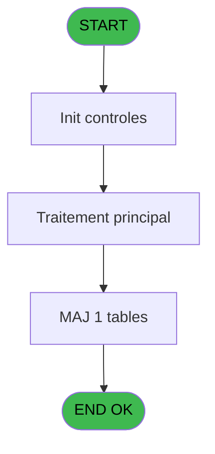
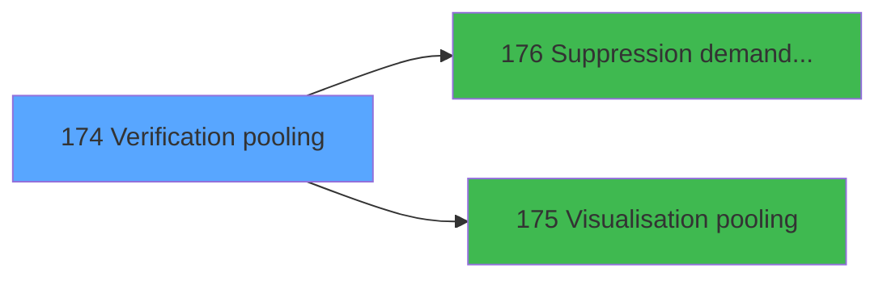

# VIL IDE 174 - Verification pooling

> **Analyse**: Phases 1-4 2026-02-03 20:51 -> 20:52 (18s) | Assemblage 20:52
> **Pipeline**: V7.2 Enrichi
> **Structure**: 4 onglets (Resume | Ecrans | Donnees | Connexions)

<!-- TAB:Resume -->

## 1. FICHE D'IDENTITE

| Attribut | Valeur |
|----------|--------|
| Projet | VIL |
| IDE Position | 174 |
| Nom Programme | Verification pooling |
| Fichier source | `Prg_174.xml` |
| Dossier IDE | Téléphone |
| Taches | 5 (1 ecrans visibles) |
| Tables modifiees | 1 |
| Programmes appeles | 2 |
| :warning: Statut | **ORPHELIN_POTENTIEL** |

## 2. DESCRIPTION FONCTIONNELLE

**Verification pooling** assure la gestion complete de ce processus.

Le flux de traitement s'organise en **2 blocs fonctionnels** :

- **Traitement** (4 taches) : traitements metier divers
- **Validation** (1 tache) : controles et verifications de coherence

**Donnees modifiees** : 1 tables en ecriture (comptes_pour_changer_activite).

Detail : phases du traitement

#### Phase 1 : Validation (1 tache)

- **174** - Verification pooling

Delegue a : [Suppression demande verif pool (IDE 176)](VIL-IDE-176.md)

#### Phase 2 : Traitement (4 taches)

- **174.1** - Mise à jour telephone
- **174.2** - Mise à jour monetique
- **174.3** - Traitement en attente **[[ECRAN]](#ecran-t4)**
- **174.3.1** - Veuillez patienter ... **[[ECRAN]](#ecran-t5)**

Delegue a : [Visualisation pooling (IDE 175)](VIL-IDE-175.md)

#### Tables impactees

| Table | Operations | Role metier |
|-------|-----------|-------------|
| comptes_pour_changer_activite | R/**W** (3 usages) | Comptes GM (generaux) |

## 3. BLOCS FONCTIONNELS

### 3.1 Validation (1 tache)

Controles de coherence : 1 tache verifie les donnees et conditions.

---

#### 174 - Verification pooling

**Role** : Verification : Verification pooling.
**Delegue a** : [Suppression demande verif pool (IDE 176)](VIL-IDE-176.md)

### 3.2 Traitement (4 taches)

Traitements internes.

---

#### 174.1 - Mise à jour telephone

**Role** : Traitement : Mise à jour telephone.
**Delegue a** : [Visualisation pooling (IDE 175)](VIL-IDE-175.md)

---

#### 174.2 - Mise à jour monetique

**Role** : Traitement : Mise à jour monetique.
**Delegue a** : [Visualisation pooling (IDE 175)](VIL-IDE-175.md)

---

#### 174.3 - Traitement en attente [[ECRAN]](#ecran-t4)

**Role** : Traitement : Traitement en attente.
**Ecran** : 442 x 48 DLU (MDI) | [Voir mockup](#ecran-t4)
**Delegue a** : [Visualisation pooling (IDE 175)](VIL-IDE-175.md)

---

#### 174.3.1 - Veuillez patienter ... [[ECRAN]](#ecran-t5)

**Role** : Traitement : Veuillez patienter ....
**Ecran** : 442 x 55 DLU (MDI) | [Voir mockup](#ecran-t5)
**Delegue a** : [Visualisation pooling (IDE 175)](VIL-IDE-175.md)

## 5. REGLES METIER

*(Aucune regle metier identifiee)*

## 6. CONTEXTE

- **Appele par**: (aucun)
- **Appelle**: 2 programmes | **Tables**: 2 (W:1 R:2 L:0) | **Taches**: 5 | **Expressions**: 6

<!-- TAB:Ecrans -->

## 8. ECRANS

### 8.1 Forms visibles (1 / 5)

| # | Position | Tache | Nom | Type | Largeur | Hauteur | Bloc |
|---|----------|-------|-----|------|---------|---------|------|
| 1 | 174.3.1 | 174.3.1 | Veuillez patienter ... | MDI | 442 | 55 | Traitement |

### 8.2 Mockups Ecrans

---

#### 174.3.1 - Veuillez patienter ...
**Tache** : [174.3.1](#t5) | **Type** : MDI | **Dimensions** : 442 x 55 DLU
**Bloc** : Traitement | **Titre IDE** : Veuillez patienter ...

<!-- FORM-DATA:
{
    "width":  442,
    "vFactor":  8,
    "type":  "MDI",
    "hFactor":  8,
    "controls":  [
                     {
                         "x":  139,
                         "type":  "label",
                         "var":  "",
                         "y":  45,
                         "w":  253,
                         "fmt":  "",
                         "name":  "",
                         "h":  8,
                         "color":  "",
                         "text":  "(Attente au plus de 30 secondes)",
                         "parent":  null
                     },
                     {
                         "x":  2,
                         "type":  "image",
                         "var":  "",
                         "y":  0,
                         "w":  85,
                         "fmt":  "",
                         "name":  "",
                         "h":  33,
                         "color":  "",
                         "text":  "",
                         "parent":  null
                     },
                     {
                         "x":  3,
                         "type":  "image",
                         "var":  "",
                         "y":  0,
                         "w":  77,
                         "fmt":  "",
                         "name":  "",
                         "h":  33,
                         "color":  "",
                         "text":  "",
                         "parent":  null
                     },
                     {
                         "x":  3,
                         "type":  "image",
                         "var":  "",
                         "y":  0,
                         "w":  75,
                         "fmt":  "",
                         "name":  "",
                         "h":  33,
                         "color":  "",
                         "text":  "",
                         "parent":  null
                     },
                     {
                         "x":  3,
                         "type":  "image",
                         "var":  "",
                         "y":  1,
                         "w":  75,
                         "fmt":  "",
                         "name":  "",
                         "h":  33,
                         "color":  "",
                         "text":  "",
                         "parent":  null
                     },
                     {
                         "x":  90,
                         "type":  "edit",
                         "var":  "",
                         "y":  5,
                         "w":  350,
                         "fmt":  "80",
                         "name":  "",
                         "h":  19,
                         "color":  "",
                         "text":  "",
                         "parent":  null
                     },
                     {
                         "x":  213,
                         "type":  "edit",
                         "var":  "",
                         "y":  32,
                         "w":  104,
                         "fmt":  "HH:MM:SS",
                         "name":  "",
                         "h":  10,
                         "color":  "6",
                         "text":  "",
                         "parent":  null
                     }
                 ],
    "taskId":  "174.3.1",
    "height":  55
}
-->

<strong>Champs : 2 champs</strong>

| Pos (x,y) | Nom | Variable | Type |
|-----------|-----|----------|------|
| 90,5 | 80 | - | edit |
| 213,32 | HH:MM:SS | - | edit |

## 9. NAVIGATION

Ecran unique: **Veuillez patienter ...**

### 9.3 Structure hierarchique (5 taches)

| Position | Tache | Type | Dimensions | Bloc |
|----------|-------|------|------------|------|
| **174.1** | [**Verification pooling** (174)](#t1) | MDI | - | Validation |
| **174.2** | [**Mise à jour telephone** (174.1)](#t2) | MDI | - | Traitement |
| 174.2.1 | [Mise à jour monetique (174.2)](#t3) | MDI | - | |
| 174.2.2 | [Traitement en attente (174.3)](#t4) [mockup](#ecran-t4) | MDI | 442x48 | |
| 174.2.3 | [Veuillez patienter ... (174.3.1)](#t5) [mockup](#ecran-t5) | MDI | 442x55 | |

### 9.4 Algorigramme

> **Legende**: Vert = START/END OK | Rouge = END KO | Bleu = Decisions
> *Algorigramme auto-genere. Utiliser `/algorigramme` pour une synthese metier detaillee.*

<!-- TAB:Donnees -->

## 10. TABLES

### Tables utilisees (2)

| ID | Nom | Description | Type | R | W | L | Usages |
|----|-----|-------------|------|---|---|---|--------|
| 63 | parametres___par |  | DB | R |   |   | 1 |
| 476 | comptes_pour_changer_activite | Comptes GM (generaux) | TMP | R | **W** |   | 3 |

### Colonnes par table (0 / 2 tables avec colonnes identifiees)

Table 63 - parametres___par (R) - 1 usages

*Table utilisee uniquement en Link ou aucune colonne Real identifiee dans le DataView.*

Table 476 - comptes_pour_changer_activite (R/**W**) - 3 usages

*Table utilisee uniquement en Link ou aucune colonne Real identifiee dans le DataView.*

## 11. VARIABLES

### 11.1 Variables de session (2)

Variables persistantes pendant toute la session.

| Lettre | Nom | Type | Usage dans |
|--------|-----|------|-----------|
| A | v. fin | Logical | - |
| B | v. time | Time | - |

## 12. EXPRESSIONS

**6 / 6 expressions decodees (100%)**

### 12.1 Repartition par type

| Type | Expressions | Regles |
|------|-------------|--------|
| CONSTANTE | 3 | 0 |
| CONDITION | 3 | 0 |

### 12.2 Expressions cles par type

#### CONSTANTE (3 expressions)

| Type | IDE | Expression | Regle |
|------|-----|------------|-------|
| CONSTANTE | 3 | `2` | - |
| CONSTANTE | 2 | `1` | - |
| CONSTANTE | 1 | `'C'` | - |

#### CONDITION (3 expressions)

| Type | IDE | Expression | Regle |
|------|-----|------------|-------|
| CONDITION | 6 | `[C]<>'O' AND [F]<>'O'` | - |
| CONDITION | 5 | `[C]='O' OR [F]='O'` | - |
| CONDITION | 4 | `[C]='O'` | - |

<!-- TAB:Connexions -->

## 13. GRAPHE D'APPELS

### 13.1 Chaine depuis Main (Callers)

**Chemin**: (pas de callers directs)

### 13.2 Callers

| IDE | Nom Programme | Nb Appels |
|-----|---------------|-----------|
| - | (aucun) | - |

### 13.3 Callees (programmes appeles)

### 13.4 Detail Callees avec contexte

| IDE | Nom Programme | Appels | Contexte |
|-----|---------------|--------|----------|
| [176](VIL-IDE-176.md) | Suppression demande verif pool | 2 | Controle/validation |
| [175](VIL-IDE-175.md) | Visualisation pooling | 1 | Sous-programme |

## 14. RECOMMANDATIONS MIGRATION

### 14.1 Profil du programme

| Metrique | Valeur | Impact migration |
|----------|--------|-----------------|
| Lignes de logique | 52 | Programme compact |
| Expressions | 6 | Peu de logique |
| Tables WRITE | 1 | Impact faible |
| Sous-programmes | 2 | Peu de dependances |
| Ecrans visibles | 1 | Ecran unique ou traitement batch |
| Code desactive | 0% (0 / 52) | Code sain |
| Regles metier | 0 | Pas de regle identifiee |

### 14.2 Plan de migration par bloc

#### Validation (1 tache: 0 ecran, 1 traitement)

- **Strategie** : FluentValidation avec validators specifiques.
- Chaque tache de validation -> un validator injectable

#### Traitement (4 taches: 2 ecrans, 2 traitements)

- **Strategie** : Orchestrateur avec 2 ecrans (Razor/React) et 2 traitements backend (services).
- Les ecrans deviennent des composants UI, les traitements invisibles deviennent des services injectables.
- 2 sous-programme(s) a migrer ou a reutiliser depuis les services existants.
- Decomposer les taches en services unitaires testables.

### 14.3 Dependances critiques

| Dependance | Type | Appels | Impact |
|------------|------|--------|--------|
| comptes_pour_changer_activite | Table WRITE (Temp) | 2x | Schema + repository |
| [Suppression demande verif pool (IDE 176)](VIL-IDE-176.md) | Sous-programme | 2x | Haute - Controle/validation |
| [Visualisation pooling (IDE 175)](VIL-IDE-175.md) | Sous-programme | 1x | Normale - Sous-programme |

---
*Spec DETAILED generee par Pipeline V7.2 - 2026-02-03 20:52*
