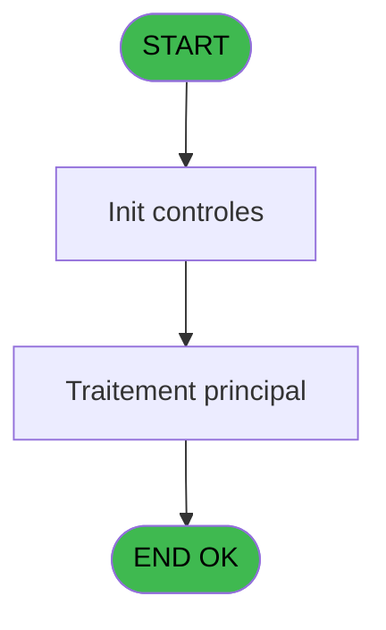
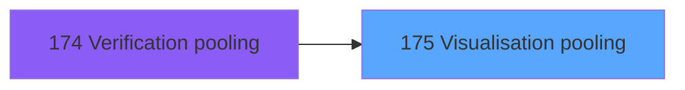

# VIL IDE 175 - Visualisation pooling

> **Analyse**: Phases 1-4 2026-02-03 20:52 -> 20:52 (17s) | Assemblage 20:52
> **Pipeline**: V7.2 Enrichi
> **Structure**: 4 onglets (Resume | Ecrans | Donnees | Connexions)

<!-- TAB:Resume -->

## 1. FICHE D'IDENTITE

| Attribut | Valeur |
|----------|--------|
| Projet | VIL |
| IDE Position | 175 |
| Nom Programme | Visualisation pooling |
| Fichier source | `Prg_175.xml` |
| Dossier IDE | Téléphone |
| Taches | 1 (1 ecrans visibles) |
| Tables modifiees | 0 |
| Programmes appeles | 0 |

## 2. DESCRIPTION FONCTIONNELLE

**Visualisation pooling** assure la gestion complete de ce processus, accessible depuis [Verification pooling (IDE 174)](VIL-IDE-174.md).

Le flux de traitement s'organise en **1 blocs fonctionnels** :

- **Validation** (1 tache) : controles et verifications de coherence

**Logique metier** : 2 regles identifiees couvrant conditions metier.

## 3. BLOCS FONCTIONNELS

### 3.1 Validation (1 tache)

Controles de coherence : 1 tache verifie les donnees et conditions.

---

#### 175 - Verification Pooling [[ECRAN]](#ecran-t1)

**Role** : Verification : Verification Pooling.
**Ecran** : 877 x 165 DLU (MDI) | [Voir mockup](#ecran-t1)
**Variables liees** : A (v. type de pooling)

## 5. REGLES METIER

2 regles identifiees:

### Autres (2 regles)

#### [RM-001] Si [B]='COM' alors 'TELEPHONE' sinon 'MONETIQUE')

| Element | Detail |
|---------|--------|
| **Condition** | `[B]='COM'` |
| **Si vrai** | 'TELEPHONE' |
| **Si faux** | 'MONETIQUE') |
| **Expression source** | Expression 4 : `IF ([B]='COM','TELEPHONE','MONETIQUE')` |
| **Exemple** | Si [B]='COM' → 'TELEPHONE'. Sinon → 'MONETIQUE') |

#### [RM-002] Si [D] alors 'Probleme sur le pooling' sinon 'Ok')

| Element | Detail |
|---------|--------|
| **Condition** | `[D]` |
| **Si vrai** | 'Probleme sur le pooling' |
| **Si faux** | 'Ok') |
| **Expression source** | Expression 5 : `IF ([D],'Probleme sur le pooling','Ok')` |
| **Exemple** | Si [D] → 'Probleme sur le pooling'. Sinon → 'Ok') |

## 6. CONTEXTE

- **Appele par**: [Verification pooling (IDE 174)](VIL-IDE-174.md)
- **Appelle**: 0 programmes | **Tables**: 1 (W:0 R:1 L:0) | **Taches**: 1 | **Expressions**: 6

<!-- TAB:Ecrans -->

## 8. ECRANS

### 8.1 Forms visibles (1 / 1)

| # | Position | Tache | Nom | Type | Largeur | Hauteur | Bloc |
|---|----------|-------|-----|------|---------|---------|------|
| 1 | 175 | 175 | Verification Pooling | MDI | 877 | 165 | Validation |

### 8.2 Mockups Ecrans

---

#### 175 - Verification Pooling
**Tache** : [175](#t1) | **Type** : MDI | **Dimensions** : 877 x 165 DLU
**Bloc** : Validation | **Titre IDE** : Verification Pooling

<!-- FORM-DATA:
{
    "width":  877,
    "vFactor":  8,
    "type":  "MDI",
    "hFactor":  8,
    "controls":  [
                     {
                         "x":  0,
                         "type":  "label",
                         "var":  "",
                         "y":  0,
                         "w":  875,
                         "fmt":  "",
                         "name":  "",
                         "h":  19,
                         "color":  "",
                         "text":  "",
                         "parent":  null
                     },
                     {
                         "x":  85,
                         "type":  "table",
                         "var":  "",
                         "name":  "",
                         "titleH":  12,
                         "color":  "110",
                         "w":  712,
                         "y":  51,
                         "fmt":  "",
                         "parent":  null,
                         "text":  "",
                         "rowH":  13,
                         "h":  57,
                         "cols":  [
                                      {
                                          "title":  "Pooling",
                                          "layer":  1,
                                          "w":  250
                                      },
                                      {
                                          "title":  "Etat",
                                          "layer":  2,
                                          "w":  246
                                      },
                                      {
                                          "title":  "Heure de vérification",
                                          "layer":  3,
                                          "w":  184
                                      }
                                  ],
                         "rows":  3
                     },
                     {
                         "x":  2,
                         "type":  "label",
                         "var":  "",
                         "y":  140,
                         "w":  875,
                         "fmt":  "",
                         "name":  "",
                         "h":  24,
                         "color":  "",
                         "text":  "",
                         "parent":  null
                     },
                     {
                         "x":  97,
                         "type":  "edit",
                         "var":  "",
                         "y":  66,
                         "w":  232,
                         "fmt":  "",
                         "name":  "",
                         "h":  8,
                         "color":  "110",
                         "text":  "",
                         "parent":  4
                     },
                     {
                         "x":  624,
                         "type":  "edit",
                         "var":  "",
                         "y":  66,
                         "w":  98,
                         "fmt":  "",
                         "name":  "",
                         "h":  8,
                         "color":  "110",
                         "text":  "",
                         "parent":  4
                     },
                     {
                         "x":  502,
                         "type":  "edit",
                         "var":  "",
                         "y":  5,
                         "w":  365,
                         "fmt":  "WWW DD MMM YYYYT",
                         "name":  "",
                         "h":  8,
                         "color":  "",
                         "text":  "",
                         "parent":  1
                     },
                     {
                         "x":  342,
                         "type":  "edit",
                         "var":  "",
                         "y":  66,
                         "w":  232,
                         "fmt":  "30",
                         "name":  "",
                         "h":  8,
                         "color":  "110",
                         "text":  "",
                         "parent":  4
                     },
                     {
                         "x":  8,
                         "type":  "button",
                         "var":  "",
                         "y":  143,
                         "w":  154,
                         "fmt":  "\u0026Quitter",
                         "name":  "",
                         "h":  18,
                         "color":  "",
                         "text":  "",
                         "parent":  14
                     },
                     {
                         "x":  10,
                         "type":  "edit",
                         "var":  "",
                         "y":  5,
                         "w":  267,
                         "fmt":  "20",
                         "name":  "",
                         "h":  8,
                         "color":  "",
                         "text":  "",
                         "parent":  1
                     }
                 ],
    "taskId":  "175",
    "height":  165
}
-->

<strong>Champs : 5 champs</strong>

| Pos (x,y) | Nom | Variable | Type |
|-----------|-----|----------|------|
| 97,66 | (sans nom) | - | edit |
| 624,66 | (sans nom) | - | edit |
| 502,5 | WWW DD MMM YYYYT | - | edit |
| 342,66 | 30 | - | edit |
| 10,5 | 20 | - | edit |

<strong>Boutons : 1 boutons</strong>

| Bouton | Pos (x,y) | Action |
|--------|-----------|--------|
| Quitter | 8,143 | Quitte le programme |

## 9. NAVIGATION

Ecran unique: **Verification Pooling**

### 9.3 Structure hierarchique (1 tache)

| Position | Tache | Type | Dimensions | Bloc |
|----------|-------|------|------------|------|
| **175.1** | [**Verification Pooling** (175)](#t1) [mockup](#ecran-t1) | MDI | 877x165 | Validation |

### 9.4 Algorigramme

> **Legende**: Vert = START/END OK | Rouge = END KO | Bleu = Decisions
> *Algorigramme auto-genere. Utiliser `/algorigramme` pour une synthese metier detaillee.*

<!-- TAB:Donnees -->

## 10. TABLES

### Tables utilisees (1)

| ID | Nom | Description | Type | R | W | L | Usages |
|----|-----|-------------|------|---|---|---|--------|
| 476 | comptes_pour_changer_activite | Comptes GM (generaux) | TMP | R |   |   | 1 |

### Colonnes par table (0 / 1 tables avec colonnes identifiees)

Table 476 - comptes_pour_changer_activite (R) - 1 usages

*Table utilisee uniquement en Link ou aucune colonne Real identifiee dans le DataView.*

## 11. VARIABLES

*(Programme sans variables locales mappees)*

## 12. EXPRESSIONS

**6 / 6 expressions decodees (100%)**

### 12.1 Repartition par type

| Type | Expressions | Regles |
|------|-------------|--------|
| CONDITION | 3 | 2 |
| DATE | 1 | 0 |
| REFERENCE_VG | 2 | 0 |

### 12.2 Expressions cles par type

#### CONDITION (3 expressions)

| Type | IDE | Expression | Regle |
|------|-----|------------|-------|
| CONDITION | 5 | `IF ([D],'Probleme sur le pooling','Ok')` | [RM-002](#rm-RM-002) |
| CONDITION | 4 | `IF ([B]='COM','TELEPHONE','MONETIQUE')` | [RM-001](#rm-RM-001) |
| CONDITION | 6 | `IF ([D],11,1)` | - |

#### DATE (1 expressions)

| Type | IDE | Expression | Regle |
|------|-----|------------|-------|
| DATE | 2 | `Date ()` | - |

#### REFERENCE_VG (2 expressions)

| Type | IDE | Expression | Regle |
|------|-----|------------|-------|
| REFERENCE_VG | 3 | `VG2` | - |
| REFERENCE_VG | 1 | `VG40` | - |

<!-- TAB:Connexions -->

## 13. GRAPHE D'APPELS

### 13.1 Chaine depuis Main (Callers)

Main -> ... -> [Verification pooling (IDE 174)](VIL-IDE-174.md) -> **Visualisation pooling (IDE 175)**

### 13.2 Callers

| IDE | Nom Programme | Nb Appels |
|-----|---------------|-----------|
| [174](VIL-IDE-174.md) | Verification pooling | 1 |

### 13.3 Callees (programmes appeles)

### 13.4 Detail Callees avec contexte

| IDE | Nom Programme | Appels | Contexte |
|-----|---------------|--------|----------|
| - | (aucun) | - | - |

## 14. RECOMMANDATIONS MIGRATION

### 14.1 Profil du programme

| Metrique | Valeur | Impact migration |
|----------|--------|-----------------|
| Lignes de logique | 8 | Programme compact |
| Expressions | 6 | Peu de logique |
| Tables WRITE | 0 | Impact faible |
| Sous-programmes | 0 | Peu de dependances |
| Ecrans visibles | 1 | Ecran unique ou traitement batch |
| Code desactive | 0% (0 / 8) | Code sain |
| Regles metier | 2 | Quelques regles a preserver |

### 14.2 Plan de migration par bloc

#### Validation (1 tache: 1 ecran, 0 traitement)

- **Strategie** : FluentValidation avec validators specifiques.
- Chaque tache de validation -> un validator injectable

### 14.3 Dependances critiques

| Dependance | Type | Appels | Impact |
|------------|------|--------|--------|

---
*Spec DETAILED generee par Pipeline V7.2 - 2026-02-03 20:52*
