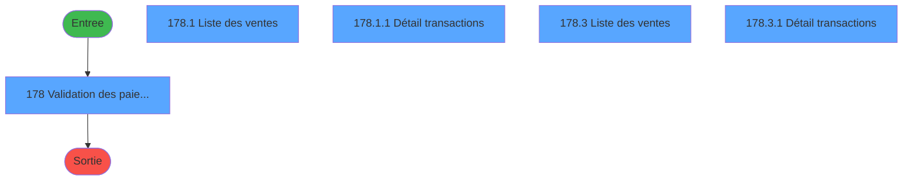
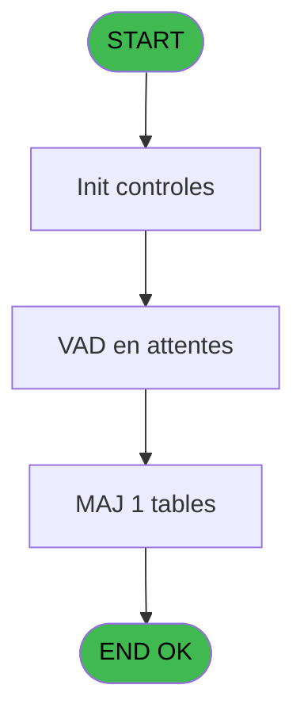
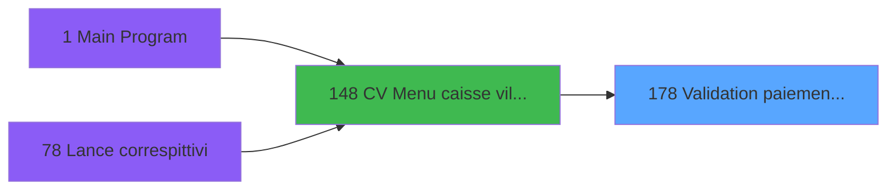

# VIL IDE 178 - Validation paiements VAD

> **Analyse**: Phases 1-4 2026-02-03 20:53 -> 20:53 (17s) | Assemblage 20:53
> **Pipeline**: V7.2 Enrichi
> **Structure**: 4 onglets (Resume | Ecrans | Donnees | Connexions)

<!-- TAB:Resume -->

## 1. FICHE D'IDENTITE

| Attribut | Valeur |
|----------|--------|
| Projet | VIL |
| IDE Position | 178 |
| Nom Programme | Validation paiements VAD |
| Fichier source | `Prg_178.xml` |
| Dossier IDE | Zooms |
| Taches | 9 (5 ecrans visibles) |
| Tables modifiees | 1 |
| Programmes appeles | 0 |

## 2. DESCRIPTION FONCTIONNELLE

**Validation paiements VAD** assure la gestion complete de ce processus, accessible depuis [CV  Menu caisse village (IDE 148)](VIL-IDE-148.md).

Le flux de traitement s'organise en **4 blocs fonctionnels** :

- **Saisie** (5 taches) : ecrans de saisie utilisateur (formulaires, champs, donnees)
- **Traitement** (2 taches) : traitements metier divers
- **Calcul** (1 tache) : calculs de montants, stocks ou compteurs
- **Reglement** (1 tache) : gestion des moyens de paiement et reglements

**Donnees modifiees** : 1 tables en ecriture (pv_cust_rentals).

Detail : phases du traitement

#### Phase 1 : Reglement (1 tache)

- **178** - Validation des paiements VAD **[[ECRAN]](#ecran-t1)**

#### Phase 2 : Saisie (5 taches)

- **178.1** - Liste des  ventes **[[ECRAN]](#ecran-t20)**
- **178.1.1** - Détail transactions **[[ECRAN]](#ecran-t23)**
- **178.3** - Liste des  ventes **[[ECRAN]](#ecran-t47)**
- **178.3.1** - Détail transactions **[[ECRAN]](#ecran-t52)**
- **178.5** - Liste des  ventes **[[ECRAN]](#ecran-t55)**

#### Phase 3 : Traitement (2 taches)

- **178.2** - Calc combo GM **[[ECRAN]](#ecran-t24)**
- **178.6** - Lignes VAD

#### Phase 4 : Calcul (1 tache)

- **178.4** - Recup Date Comptable

#### Tables impactees

| Table | Operations | Role metier |
|-------|-----------|-------------|
| pv_cust_rentals | **W** (3 usages) |  |

## 3. BLOCS FONCTIONNELS

### 3.1 Reglement (1 tache)

Gestion des moyens de paiement : 1 tache de reglement.

---

#### 178 - Validation des paiements VAD [[ECRAN]](#ecran-t1)

**Role** : Gestion du reglement : Validation des paiements VAD.
**Ecran** : 1708 x 375 DLU | [Voir mockup](#ecran-t1)
**Variables liees** : P (v.Nb lignes Validation), R (v.Confirmation Validation), U (v.validation confirmée?), V (v.compte gm validation), W (v.filiation gm validation)

### 3.2 Saisie (5 taches)

L'operateur saisit les donnees de la transaction via 5 ecrans (Liste des  ventes, Détail transactions, Liste des  ventes, Détail transactions, Liste des  ventes).

---

#### 178.1 - Liste des  ventes [[ECRAN]](#ecran-t20)

**Role** : Saisie des donnees : Liste des  ventes.
**Ecran** : 1699 x 281 DLU | [Voir mockup](#ecran-t20)
**Variables liees** : X (v.liste tickets)

---

#### 178.1.1 - Détail transactions [[ECRAN]](#ecran-t23)

**Role** : Saisie des donnees : Détail transactions.
**Ecran** : 832 x 280 DLU | [Voir mockup](#ecran-t23)

---

#### 178.3 - Liste des  ventes [[ECRAN]](#ecran-t47)

**Role** : Saisie des donnees : Liste des  ventes.
**Ecran** : 1699 x 281 DLU | [Voir mockup](#ecran-t47)
**Variables liees** : X (v.liste tickets)

---

#### 178.3.1 - Détail transactions [[ECRAN]](#ecran-t52)

**Role** : Saisie des donnees : Détail transactions.
**Ecran** : 861 x 280 DLU | [Voir mockup](#ecran-t52)

---

#### 178.5 - Liste des  ventes [[ECRAN]](#ecran-t55)

**Role** : Saisie des donnees : Liste des  ventes.
**Ecran** : 1699 x 281 DLU | [Voir mockup](#ecran-t55)
**Variables liees** : X (v.liste tickets)

### 3.3 Traitement (2 taches)

Traitements internes.

---

#### 178.2 - Calc combo GM [[ECRAN]](#ecran-t24)

**Role** : Traitement : Calc combo GM.
**Ecran** : 465 x 195 DLU | [Voir mockup](#ecran-t24)
**Variables liees** : K (Combo GM), L (Combo code GM)

---

#### 178.6 - Lignes VAD

**Role** : Traitement : Lignes VAD.
**Variables liees** : P (v.Nb lignes Validation), Q (v.Nb lignes Annulation)

### 3.4 Calcul (1 tache)

Calculs metier : montants, stocks, compteurs.

---

#### 178.4 - Recup Date Comptable

**Role** : Consultation/chargement : Recup Date Comptable.
**Variables liees** : T (v.Date Comptable), D (Date min), E (b_date_min), F (Date max), G (b_date_max)

## 5. REGLES METIER

*(Aucune regle metier identifiee)*

## 6. CONTEXTE

- **Appele par**: [CV  Menu caisse village (IDE 148)](VIL-IDE-148.md)
- **Appelle**: 0 programmes | **Tables**: 6 (W:1 R:3 L:2) | **Taches**: 9 | **Expressions**: 27

<!-- TAB:Ecrans -->

## 8. ECRANS

### 8.1 Forms visibles (5 / 9)

| # | Position | Tache | Nom | Type | Largeur | Hauteur | Bloc |
|---|----------|-------|-----|------|---------|---------|------|
| 1 | 178 | 178 | Validation des paiements VAD | Type0 | 1708 | 375 | Reglement |
| 2 | 178.2 | 178.1 | Liste des  ventes | Type0 | 1699 | 281 | Saisie |
| 3 | 178.2.1 | 178.1.1 | Détail transactions | Type0 | 832 | 280 | Saisie |
| 4 | 178.3 | 178.3 | Liste des  ventes | Type0 | 1699 | 281 | Saisie |
| 5 | 178.3.1 | 178.3.1 | Détail transactions | Type0 | 861 | 280 | Saisie |

### 8.2 Mockups Ecrans

---

#### 178 - Validation des paiements VAD
**Tache** : [178](#t1) | **Type** : Type0 | **Dimensions** : 1708 x 375 DLU
**Bloc** : Reglement | **Titre IDE** : Validation des paiements VAD

<!-- FORM-DATA:
{
    "width":  1708,
    "vFactor":  8,
    "type":  "Type0",
    "hFactor":  8,
    "controls":  [
                     {
                         "x":  11,
                         "type":  "label",
                         "var":  "",
                         "y":  0,
                         "w":  1694,
                         "fmt":  "",
                         "name":  "",
                         "h":  19,
                         "color":  "",
                         "text":  "",
                         "parent":  null
                     },
                     {
                         "x":  6,
                         "type":  "label",
                         "var":  "",
                         "y":  23,
                         "w":  1697,
                         "fmt":  "",
                         "name":  "",
                         "h":  37,
                         "color":  "195",
                         "text":  "Sélection",
                         "parent":  null
                     },
                     {
                         "x":  26,
                         "type":  "label",
                         "var":  "",
                         "y":  34,
                         "w":  169,
                         "fmt":  "",
                         "name":  "",
                         "h":  9,
                         "color":  "",
                         "text":  "Date d\u0027opération du",
                         "parent":  9
                     },
                     {
                         "x":  26,
                         "type":  "label",
                         "var":  "",
                         "y":  45,
                         "w":  169,
                         "fmt":  "",
                         "name":  "",
                         "h":  9,
                         "color":  "",
                         "text":  "au",
                         "parent":  9
                     },
                     {
                         "x":  416,
                         "type":  "label",
                         "var":  "",
                         "y":  34,
                         "w":  126,
                         "fmt":  "",
                         "name":  "",
                         "h":  9,
                         "color":  "",
                         "text":  "Montant mini",
                         "parent":  9
                     },
                     {
                         "x":  416,
                         "type":  "label",
                         "var":  "",
                         "y":  45,
                         "w":  126,
                         "fmt":  "",
                         "name":  "",
                         "h":  9,
                         "color":  "",
                         "text":  "maxi",
                         "parent":  9
                     },
                     {
                         "x":  760,
                         "type":  "label",
                         "var":  "",
                         "y":  34,
                         "w":  52,
                         "fmt":  "",
                         "name":  "",
                         "h":  9,
                         "color":  "",
                         "text":  "GM",
                         "parent":  9
                     },
                     {
                         "x":  17,
                         "type":  "edit",
                         "var":  "",
                         "y":  6,
                         "w":  267,
                         "fmt":  "20",
                         "name":  "VG.USER",
                         "h":  8,
                         "color":  "",
                         "text":  "",
                         "parent":  1
                     },
                     {
                         "x":  1489,
                         "type":  "edit",
                         "var":  "",
                         "y":  6,
                         "w":  203,
                         "fmt":  "WWW DD MMM YYYYT",
                         "name":  "",
                         "h":  8,
                         "color":  "",
                         "text":  "",
                         "parent":  1
                     },
                     {
                         "x":  203,
                         "type":  "edit",
                         "var":  "",
                         "y":  34,
                         "w":  110,
                         "fmt":  "DD/MM/YYYYZ TA",
                         "name":  "Date min",
                         "h":  10,
                         "color":  "6",
                         "text":  "",
                         "parent":  9
                     },
                     {
                         "x":  323,
                         "type":  "button",
                         "var":  "",
                         "y":  34,
                         "w":  28,
                         "fmt":  "",
                         "name":  "b_DateMin",
                         "h":  10,
                         "color":  "",
                         "text":  "",
                         "parent":  9
                     },
                     {
                         "x":  203,
                         "type":  "edit",
                         "var":  "",
                         "y":  45,
                         "w":  110,
                         "fmt":  "DD/MM/YYYYZ TA",
                         "name":  "Date max",
                         "h":  10,
                         "color":  "6",
                         "text":  "",
                         "parent":  9
                     },
                     {
                         "x":  322,
                         "type":  "button",
                         "var":  "",
                         "y":  45,
                         "w":  28,
                         "fmt":  "",
                         "name":  "b_DateMax",
                         "h":  10,
                         "color":  "",
                         "text":  "",
                         "parent":  9
                     },
                     {
                         "x":  562,
                         "type":  "edit",
                         "var":  "",
                         "y":  34,
                         "w":  131,
                         "fmt":  "10.2CZ",
                         "name":  "Montant mini",
                         "h":  9,
                         "color":  "6",
                         "text":  "",
                         "parent":  9
                     },
                     {
                         "x":  562,
                         "type":  "edit",
                         "var":  "",
                         "y":  45,
                         "w":  131,
                         "fmt":  "10.2CZ",
                         "name":  "Montant maxi",
                         "h":  10,
                         "color":  "6",
                         "text":  "",
                         "parent":  9
                     },
                     {
                         "x":  811,
                         "type":  "combobox",
                         "var":  "",
                         "y":  32,
                         "w":  490,
                         "fmt":  "",
                         "name":  "Code GM",
                         "h":  9,
                         "color":  "6",
                         "text":  "",
                         "parent":  9
                     },
                     {
                         "x":  2,
                         "type":  "tab",
                         "var":  "",
                         "y":  63,
                         "w":  1705,
                         "fmt":  "",
                         "name":  "Type_transaction",
                         "h":  294,
                         "color":  "",
                         "text":  "A,V",
                         "parent":  null
                     },
                     {
                         "x":  2,
                         "type":  "subform",
                         "var":  "",
                         "y":  77,
                         "w":  1701,
                         "fmt":  "",
                         "name":  "VAD en attentes",
                         "h":  282,
                         "color":  "",
                         "text":  "",
                         "parent":  2
                     },
                     {
                         "x":  605,
                         "type":  "button",
                         "var":  "",
                         "y":  359,
                         "w":  166,
                         "fmt":  "\u0026Valider",
                         "name":  "",
                         "h":  16,
                         "color":  "",
                         "text":  "",
                         "parent":  2
                     },
                     {
                         "x":  2,
                         "type":  "subform",
                         "var":  "",
                         "y":  77,
                         "w":  1701,
                         "fmt":  "",
                         "name":  "VAD validées",
                         "h":  282,
                         "color":  "",
                         "text":  "",
                         "parent":  2
                     },
                     {
                         "x":  601,
                         "type":  "button",
                         "var":  "",
                         "y":  359,
                         "w":  261,
                         "fmt":  "Annuler les lignes validées",
                         "name":  "",
                         "h":  16,
                         "color":  "",
                         "text":  "",
                         "parent":  2
                     },
                     {
                         "x":  1538,
                         "type":  "button",
                         "var":  "",
                         "y":  359,
                         "w":  168,
                         "fmt":  "\u0026Quitter",
                         "name":  "",
                         "h":  16,
                         "color":  "",
                         "text":  "",
                         "parent":  null
                     },
                     {
                         "x":  1514,
                         "type":  "button",
                         "var":  "",
                         "y":  35,
                         "w":  166,
                         "fmt":  "\u0026Impression",
                         "name":  "",
                         "h":  16,
                         "color":  "",
                         "text":  "",
                         "parent":  null
                     }
                 ],
    "taskId":  "178",
    "height":  375
}
-->

<strong>Champs : 7 champs</strong>

| Pos (x,y) | Nom | Variable | Type |
|-----------|-----|----------|------|
| 17,6 | VG.USER | - | edit |
| 1489,6 | WWW DD MMM YYYYT | - | edit |
| 203,34 | Date min | - | edit |
| 203,45 | Date max | - | edit |
| 562,34 | Montant mini | - | edit |
| 562,45 | Montant maxi | - | edit |
| 811,32 | Code GM | - | combobox |

<strong>Boutons : 6 boutons</strong>

| Bouton | Pos (x,y) | Action |
|--------|-----------|--------|
| b_DateMin | 323,34 | Bouton fonctionnel |
| b_DateMax | 322,45 | Bouton fonctionnel |
| Valider | 605,359 | Valide la saisie et enregistre |
| Annuler les lignes validées | 601,359 | Valide la saisie et enregistre Annule et retour au menu |
| Quitter | 1538,359 | Quitte le programme |
| Impression | 1514,35 | Bouton fonctionnel |

---

#### 178.2 - Liste des  ventes
**Tache** : [178.1](#t20) | **Type** : Type0 | **Dimensions** : 1699 x 281 DLU
**Bloc** : Saisie | **Titre IDE** : Liste des  ventes

<!-- FORM-DATA:
{
    "width":  1699,
    "vFactor":  8,
    "type":  "Type0",
    "hFactor":  8,
    "controls":  [
                     {
                         "x":  6,
                         "type":  "table",
                         "var":  "",
                         "name":  "",
                         "titleH":  12,
                         "color":  "110",
                         "w":  848,
                         "y":  0,
                         "fmt":  "",
                         "parent":  null,
                         "text":  "",
                         "rowH":  14,
                         "h":  277,
                         "cols":  [
                                      {
                                          "title":  "Date",
                                          "layer":  1,
                                          "w":  90
                                      },
                                      {
                                          "title":  "Compte ",
                                          "layer":  2,
                                          "w":  92
                                      },
                                      {
                                          "title":  "Fil.",
                                          "layer":  3,
                                          "w":  53
                                      },
                                      {
                                          "title":  "Nom \u0026\u0026 Prénom",
                                          "layer":  4,
                                          "w":  184
                                      },
                                      {
                                          "title":  "Opération",
                                          "layer":  5,
                                          "w":  92
                                      },
                                      {
                                          "title":  "Montant",
                                          "layer":  6,
                                          "w":  112
                                      },
                                      {
                                          "title":  "Paiement",
                                          "layer":  7,
                                          "w":  94
                                      },
                                      {
                                          "title":  "ü",
                                          "layer":  8,
                                          "w":  41
                                      },
                                      {
                                          "title":  "Supp.",
                                          "layer":  9,
                                          "w":  53
                                      }
                                  ],
                         "rows":  9
                     },
                     {
                         "x":  13,
                         "type":  "edit",
                         "var":  "",
                         "y":  16,
                         "w":  81,
                         "fmt":  "DD/MM/YYZ T",
                         "name":  "date",
                         "h":  8,
                         "color":  "110",
                         "text":  "",
                         "parent":  5
                     },
                     {
                         "x":  103,
                         "type":  "edit",
                         "var":  "",
                         "y":  15,
                         "w":  82,
                         "fmt":  "8Z",
                         "name":  "CPTE",
                         "h":  10,
                         "color":  "110",
                         "text":  "",
                         "parent":  5
                     },
                     {
                         "x":  196,
                         "type":  "edit",
                         "var":  "",
                         "y":  15,
                         "w":  38,
                         "fmt":  "",
                         "name":  "libelle",
                         "h":  10,
                         "color":  "110",
                         "text":  "",
                         "parent":  5
                     },
                     {
                         "x":  241,
                         "type":  "edit",
                         "var":  "",
                         "y":  15,
                         "w":  185,
                         "fmt":  "60",
                         "name":  "",
                         "h":  10,
                         "color":  "110",
                         "text":  "",
                         "parent":  5
                     },
                     {
                         "x":  432,
                         "type":  "edit",
                         "var":  "",
                         "y":  15,
                         "w":  78,
                         "fmt":  "30",
                         "name":  "",
                         "h":  10,
                         "color":  "110",
                         "text":  "",
                         "parent":  5
                     },
                     {
                         "x":  522,
                         "type":  "edit",
                         "var":  "",
                         "y":  15,
                         "w":  99,
                         "fmt":  "10.2CZ",
                         "name":  "Montant",
                         "h":  10,
                         "color":  "110",
                         "text":  "",
                         "parent":  5
                     },
                     {
                         "x":  637,
                         "type":  "edit",
                         "var":  "",
                         "y":  15,
                         "w":  79,
                         "fmt":  "30",
                         "name":  "paiement",
                         "h":  10,
                         "color":  "110",
                         "text":  "",
                         "parent":  5
                     },
                     {
                         "x":  731,
                         "type":  "checkbox",
                         "var":  "",
                         "y":  15,
                         "w":  25,
                         "fmt":  "",
                         "name":  "Flag select",
                         "h":  11,
                         "color":  "110",
                         "text":  "",
                         "parent":  5
                     },
                     {
                         "x":  772,
                         "type":  "button",
                         "var":  "",
                         "y":  15,
                         "w":  34,
                         "fmt":  "",
                         "name":  "BOUTON_SUPRIM_LIGNE",
                         "h":  11,
                         "color":  "",
                         "text":  "",
                         "parent":  5
                     },
                     {
                         "x":  864,
                         "type":  "subform",
                         "var":  "",
                         "y":  0,
                         "w":  832,
                         "fmt":  "",
                         "name":  "Détail transactions",
                         "h":  280,
                         "color":  "",
                         "text":  "",
                         "parent":  null
                     }
                 ],
    "taskId":  "178.2",
    "height":  281
}
-->

<strong>Champs : 8 champs</strong>

| Pos (x,y) | Nom | Variable | Type |
|-----------|-----|----------|------|
| 13,16 | date | - | edit |
| 103,15 | CPTE | - | edit |
| 196,15 | libelle | - | edit |
| 241,15 | 60 | - | edit |
| 432,15 | 30 | - | edit |
| 522,15 | Montant | - | edit |
| 637,15 | paiement | - | edit |
| 731,15 | Flag select | - | checkbox |

<strong>Boutons : 1 boutons</strong>

| Bouton | Pos (x,y) | Action |
|--------|-----------|--------|
| _SUPRIM_LIGNE | 772,15 | Bouton fonctionnel |

---

#### 178.2.1 - Détail transactions
**Tache** : [178.1.1](#t23) | **Type** : Type0 | **Dimensions** : 832 x 280 DLU
**Bloc** : Saisie | **Titre IDE** : Détail transactions

<!-- FORM-DATA:
{
    "width":  832,
    "vFactor":  8,
    "type":  "Type0",
    "hFactor":  8,
    "controls":  [
                     {
                         "x":  0,
                         "type":  "table",
                         "var":  "",
                         "name":  "",
                         "titleH":  12,
                         "color":  "110",
                         "w":  829,
                         "y":  0,
                         "fmt":  "",
                         "parent":  null,
                         "text":  "",
                         "rowH":  13,
                         "h":  277,
                         "cols":  [
                                      {
                                          "title":  "Imputation",
                                          "layer":  1,
                                          "w":  120
                                      },
                                      {
                                          "title":  "Ss Imp.",
                                          "layer":  2,
                                          "w":  62
                                      },
                                      {
                                          "title":  "Service",
                                          "layer":  3,
                                          "w":  64
                                      },
                                      {
                                          "title":  "Libellé",
                                          "layer":  4,
                                          "w":  193
                                      },
                                      {
                                          "title":  "Libellé sup.",
                                          "layer":  5,
                                          "w":  160
                                      },
                                      {
                                          "title":  "Montant",
                                          "layer":  6,
                                          "w":  112
                                      },
                                      {
                                          "title":  "Opérateur",
                                          "layer":  7,
                                          "w":  83
                                      }
                                  ],
                         "rows":  7
                     },
                     {
                         "x":  6,
                         "type":  "edit",
                         "var":  "",
                         "y":  15,
                         "w":  110,
                         "fmt":  "10Z",
                         "name":  "ven_imputation",
                         "h":  10,
                         "color":  "110",
                         "text":  "",
                         "parent":  1
                     },
                     {
                         "x":  136,
                         "type":  "edit",
                         "var":  "",
                         "y":  15,
                         "w":  40,
                         "fmt":  "3Z",
                         "name":  "ven_sous_imputation",
                         "h":  10,
                         "color":  "110",
                         "text":  "",
                         "parent":  1
                     },
                     {
                         "x":  195,
                         "type":  "edit",
                         "var":  "",
                         "y":  15,
                         "w":  51,
                         "fmt":  "30",
                         "name":  "ven_service",
                         "h":  10,
                         "color":  "110",
                         "text":  "",
                         "parent":  1
                     },
                     {
                         "x":  259,
                         "type":  "edit",
                         "var":  "",
                         "y":  15,
                         "w":  174,
                         "fmt":  "20",
                         "name":  "Libellé",
                         "h":  10,
                         "color":  "110",
                         "text":  "",
                         "parent":  1
                     },
                     {
                         "x":  451,
                         "type":  "edit",
                         "var":  "",
                         "y":  15,
                         "w":  143,
                         "fmt":  "20",
                         "name":  "Libellé sup.",
                         "h":  10,
                         "color":  "110",
                         "text":  "",
                         "parent":  1
                     },
                     {
                         "x":  605,
                         "type":  "edit",
                         "var":  "",
                         "y":  15,
                         "w":  101,
                         "fmt":  "10.2CZ",
                         "name":  "ven_montant",
                         "h":  10,
                         "color":  "110",
                         "text":  "",
                         "parent":  1
                     },
                     {
                         "x":  718,
                         "type":  "edit",
                         "var":  "",
                         "y":  15,
                         "w":  76,
                         "fmt":  "30",
                         "name":  "Operateur",
                         "h":  10,
                         "color":  "110",
                         "text":  "",
                         "parent":  1
                     }
                 ],
    "taskId":  "178.2.1",
    "height":  280
}
-->

<strong>Champs : 7 champs</strong>

| Pos (x,y) | Nom | Variable | Type |
|-----------|-----|----------|------|
| 6,15 | ven_imputation | - | edit |
| 136,15 | ven_sous_imputation | - | edit |
| 195,15 | ven_service | - | edit |
| 259,15 | Libellé | - | edit |
| 451,15 | Libellé sup. | - | edit |
| 605,15 | ven_montant | - | edit |
| 718,15 | Operateur | - | edit |

---

#### 178.3 - Liste des  ventes
**Tache** : [178.3](#t47) | **Type** : Type0 | **Dimensions** : 1699 x 281 DLU
**Bloc** : Saisie | **Titre IDE** : Liste des  ventes

<!-- FORM-DATA:
{
    "width":  1699,
    "vFactor":  8,
    "type":  "Type0",
    "hFactor":  8,
    "controls":  [
                     {
                         "x":  6,
                         "type":  "table",
                         "var":  "",
                         "name":  "",
                         "titleH":  12,
                         "color":  "110",
                         "w":  776,
                         "y":  0,
                         "fmt":  "",
                         "parent":  null,
                         "text":  "",
                         "rowH":  13,
                         "h":  276,
                         "cols":  [
                                      {
                                          "title":  "Date",
                                          "layer":  1,
                                          "w":  88
                                      },
                                      {
                                          "title":  "Compte ",
                                          "layer":  2,
                                          "w":  86
                                      },
                                      {
                                          "title":  "Fil.",
                                          "layer":  3,
                                          "w":  51
                                      },
                                      {
                                          "title":  "Nom \u0026\u0026 Prénom",
                                          "layer":  4,
                                          "w":  197
                                      },
                                      {
                                          "title":  "Opération",
                                          "layer":  5,
                                          "w":  85
                                      },
                                      {
                                          "title":  "Montant",
                                          "layer":  6,
                                          "w":  114
                                      },
                                      {
                                          "title":  "Paiement",
                                          "layer":  7,
                                          "w":  83
                                      },
                                      {
                                          "title":  "ü",
                                          "layer":  8,
                                          "w":  39
                                      }
                                  ],
                         "rows":  8
                     },
                     {
                         "x":  13,
                         "type":  "edit",
                         "var":  "",
                         "y":  16,
                         "w":  78,
                         "fmt":  "DD/MM/YYZ T",
                         "name":  "date",
                         "h":  8,
                         "color":  "110",
                         "text":  "",
                         "parent":  5
                     },
                     {
                         "x":  98,
                         "type":  "edit",
                         "var":  "",
                         "y":  15,
                         "w":  79,
                         "fmt":  "8Z",
                         "name":  "CPTE",
                         "h":  10,
                         "color":  "110",
                         "text":  "",
                         "parent":  5
                     },
                     {
                         "x":  189,
                         "type":  "edit",
                         "var":  "",
                         "y":  15,
                         "w":  39,
                         "fmt":  "",
                         "name":  "libelle",
                         "h":  10,
                         "color":  "110",
                         "text":  "",
                         "parent":  5
                     },
                     {
                         "x":  236,
                         "type":  "edit",
                         "var":  "",
                         "y":  15,
                         "w":  192,
                         "fmt":  "60",
                         "name":  "",
                         "h":  10,
                         "color":  "110",
                         "text":  "",
                         "parent":  5
                     },
                     {
                         "x":  435,
                         "type":  "edit",
                         "var":  "",
                         "y":  15,
                         "w":  74,
                         "fmt":  "30",
                         "name":  "",
                         "h":  10,
                         "color":  "6",
                         "text":  "",
                         "parent":  5
                     },
                     {
                         "x":  522,
                         "type":  "edit",
                         "var":  "",
                         "y":  15,
                         "w":  105,
                         "fmt":  "10.2CZ",
                         "name":  "Montant",
                         "h":  10,
                         "color":  "110",
                         "text":  "",
                         "parent":  5
                     },
                     {
                         "x":  631,
                         "type":  "edit",
                         "var":  "",
                         "y":  15,
                         "w":  75,
                         "fmt":  "",
                         "name":  "paiement",
                         "h":  10,
                         "color":  "110",
                         "text":  "",
                         "parent":  5
                     },
                     {
                         "x":  720,
                         "type":  "checkbox",
                         "var":  "",
                         "y":  15,
                         "w":  25,
                         "fmt":  "",
                         "name":  "Flag select",
                         "h":  9,
                         "color":  "110",
                         "text":  "",
                         "parent":  5
                     },
                     {
                         "x":  808,
                         "type":  "subform",
                         "var":  "",
                         "y":  0,
                         "w":  889,
                         "fmt":  "",
                         "name":  "Détail transactions",
                         "h":  280,
                         "color":  "",
                         "text":  "",
                         "parent":  null
                     }
                 ],
    "taskId":  "178.3",
    "height":  281
}
-->

<strong>Champs : 8 champs</strong>

| Pos (x,y) | Nom | Variable | Type |
|-----------|-----|----------|------|
| 13,16 | date | - | edit |
| 98,15 | CPTE | - | edit |
| 189,15 | libelle | - | edit |
| 236,15 | 60 | - | edit |
| 435,15 | 30 | - | edit |
| 522,15 | Montant | - | edit |
| 631,15 | paiement | - | edit |
| 720,15 | Flag select | - | checkbox |

---

#### 178.3.1 - Détail transactions
**Tache** : [178.3.1](#t52) | **Type** : Type0 | **Dimensions** : 861 x 280 DLU
**Bloc** : Saisie | **Titre IDE** : Détail transactions

<!-- FORM-DATA:
{
    "width":  861,
    "vFactor":  8,
    "type":  "Type0",
    "hFactor":  8,
    "controls":  [
                     {
                         "x":  0,
                         "type":  "table",
                         "var":  "",
                         "name":  "",
                         "titleH":  12,
                         "color":  "110",
                         "w":  858,
                         "y":  0,
                         "fmt":  "",
                         "parent":  null,
                         "text":  "",
                         "rowH":  13,
                         "h":  277,
                         "cols":  [
                                      {
                                          "title":  "Imputation",
                                          "layer":  1,
                                          "w":  120
                                      },
                                      {
                                          "title":  "Ss Imp.",
                                          "layer":  2,
                                          "w":  62
                                      },
                                      {
                                          "title":  "Service",
                                          "layer":  3,
                                          "w":  64
                                      },
                                      {
                                          "title":  "Libellé",
                                          "layer":  4,
                                          "w":  209
                                      },
                                      {
                                          "title":  "Libellé sup.",
                                          "layer":  5,
                                          "w":  160
                                      },
                                      {
                                          "title":  "Montant",
                                          "layer":  6,
                                          "w":  125
                                      },
                                      {
                                          "title":  "Opérateur",
                                          "layer":  7,
                                          "w":  83
                                      }
                                  ],
                         "rows":  7
                     },
                     {
                         "x":  6,
                         "type":  "edit",
                         "var":  "",
                         "y":  15,
                         "w":  110,
                         "fmt":  "10Z",
                         "name":  "ven_imputation",
                         "h":  10,
                         "color":  "110",
                         "text":  "",
                         "parent":  1
                     },
                     {
                         "x":  136,
                         "type":  "edit",
                         "var":  "",
                         "y":  15,
                         "w":  40,
                         "fmt":  "3Z",
                         "name":  "ven_sous_imputation",
                         "h":  10,
                         "color":  "110",
                         "text":  "",
                         "parent":  1
                     },
                     {
                         "x":  195,
                         "type":  "edit",
                         "var":  "",
                         "y":  15,
                         "w":  51,
                         "fmt":  "30",
                         "name":  "ven_service",
                         "h":  10,
                         "color":  "110",
                         "text":  "",
                         "parent":  1
                     },
                     {
                         "x":  259,
                         "type":  "edit",
                         "var":  "",
                         "y":  15,
                         "w":  193,
                         "fmt":  "20",
                         "name":  "Libellé",
                         "h":  10,
                         "color":  "110",
                         "text":  "",
                         "parent":  1
                     },
                     {
                         "x":  467,
                         "type":  "edit",
                         "var":  "",
                         "y":  15,
                         "w":  143,
                         "fmt":  "20",
                         "name":  "Libellé sup.",
                         "h":  10,
                         "color":  "110",
                         "text":  "",
                         "parent":  1
                     },
                     {
                         "x":  621,
                         "type":  "edit",
                         "var":  "",
                         "y":  15,
                         "w":  120,
                         "fmt":  "10.2CZ",
                         "name":  "ven_montant",
                         "h":  10,
                         "color":  "110",
                         "text":  "",
                         "parent":  1
                     },
                     {
                         "x":  747,
                         "type":  "edit",
                         "var":  "",
                         "y":  15,
                         "w":  76,
                         "fmt":  "30",
                         "name":  "Operateur",
                         "h":  10,
                         "color":  "110",
                         "text":  "",
                         "parent":  1
                     }
                 ],
    "taskId":  "178.3.1",
    "height":  280
}
-->

<strong>Champs : 7 champs</strong>

| Pos (x,y) | Nom | Variable | Type |
|-----------|-----|----------|------|
| 6,15 | ven_imputation | - | edit |
| 136,15 | ven_sous_imputation | - | edit |
| 195,15 | ven_service | - | edit |
| 259,15 | Libellé | - | edit |
| 467,15 | Libellé sup. | - | edit |
| 621,15 | ven_montant | - | edit |
| 747,15 | Operateur | - | edit |

## 9. NAVIGATION

### 9.1 Enchainement des ecrans

**Detail par enchainement :**

| Depuis | Action | Vers | Retour |
|--------|--------|------|--------|

### 9.3 Structure hierarchique (9 taches)

| Position | Tache | Type | Dimensions | Bloc |
|----------|-------|------|------------|------|
| **178.1** | [**Validation des paiements VAD** (178)](#t1) [mockup](#ecran-t1) | - | 1708x375 | Reglement |
| **178.2** | [**Liste des  ventes** (178.1)](#t20) [mockup](#ecran-t20) | - | 1699x281 | Saisie |
| 178.2.1 | [Détail transactions (178.1.1)](#t23) [mockup](#ecran-t23) | - | 832x280 | |
| 178.2.2 | [Liste des  ventes (178.3)](#t47) [mockup](#ecran-t47) | - | 1699x281 | |
| 178.2.3 | [Détail transactions (178.3.1)](#t52) [mockup](#ecran-t52) | - | 861x280 | |
| 178.2.4 | [Liste des  ventes (178.5)](#t55) [mockup](#ecran-t55) | - | 1699x281 | |
| **178.3** | [**Calc combo GM** (178.2)](#t24) [mockup](#ecran-t24) | - | 465x195 | Traitement |
| 178.3.1 | [Lignes VAD (178.6)](#t56) | - | - | |
| **178.4** | [**Recup Date Comptable** (178.4)](#t49) | - | - | Calcul |

### 9.4 Algorigramme

> **Legende**: Vert = START/END OK | Rouge = END KO | Bleu = Decisions
> *Algorigramme auto-genere. Utiliser `/algorigramme` pour une synthese metier detaillee.*

<!-- TAB:Donnees -->

## 10. TABLES

### Tables utilisees (6)

| ID | Nom | Description | Type | R | W | L | Usages |
|----|-----|-------------|------|---|---|---|--------|
| 40 | comptable________cte |  | DB | R |   |   | 2 |
| 70 | date_comptable___dat |  | DB | R |   |   | 1 |
| 263 | vente | Donnees de ventes | DB |   |   | L | 2 |
| 372 | pv_budget |  | DB | R |   |   | 1 |
| 519 | pv_cust_rentals |  | TMP |   | **W** |   | 3 |
| 946 | Table_946 |  | MEM |   |   | L | 2 |

### Colonnes par table (5 / 4 tables avec colonnes identifiees)

Table 40 - comptable________cte (R) - 2 usages

| Lettre | Variable | Acces | Type |
|--------|----------|-------|------|
| A | P.i Num ticket | R | Numeric |
| B | P.i Mode Paiement | R | Alpha |

Table 70 - date_comptable___dat (R) - 1 usages

| Lettre | Variable | Acces | Type |
|--------|----------|-------|------|
| A | P.Date min | R | Date |
| B | P.Date max | R | Date |
| BA | CHG_REASON_Date max | R | Numeric |
| BB | CHG_PRV_Date max | R | Date |
| D | Date min | R | Date |
| E | b_date_min | R | Alpha |
| F | Date max | R | Date |
| G | b_date_max | R | Alpha |
| P | V0.Date | R | Date |
| T | v.Date Comptable | R | Date |
| Y | CHG_REASON_Date min | R | Numeric |
| Z | CHG_PRV_Date min | R | Date |

Table 372 - pv_budget (R) - 1 usages

| Lettre | Variable | Acces | Type |
|--------|----------|-------|------|
| A | P.i Sté | R | Alpha |
| B | P.i Devise locale | R | Alpha |
| C | P.i Masque montant | R | Alpha |
| D | Date min | R | Date |
| E | b_date_min | R | Alpha |
| F | Date max | R | Date |
| G | b_date_max | R | Alpha |
| H | Montant mini | R | Numeric |
| I | Montant maxi | R | Numeric |
| J | Code GM+Fil | R | Numeric |
| K | Combo GM | R | Alpha |
| L | Combo code GM | R | Alpha |
| M | Compte GM | R | Numeric |
| N | Code fil | R | Numeric |
| O | v.Onglet Histo,VAD | R | Alpha |
| P | v.Nb lignes Validation | R | Numeric |
| Q | v.Nb lignes Annulation | R | Numeric |
| R | v.Confirmation Validation | R | Numeric |
| S | v.Confirmation Annulation | R | Numeric |
| T | v.Date Comptable | R | Date |
| U | v.validation confirmée? | R | Logical |
| V | v.compte gm validation | R | Numeric |
| W | v.filiation gm validation | R | Numeric |
| X | v.liste tickets | R | Alpha |
| Y | CHG_REASON_Date min | R | Numeric |
| Z | CHG_PRV_Date min | R | Date |
| BA | CHG_REASON_Date max | R | Numeric |
| BB | CHG_PRV_Date max | R | Date |
| BC | CHG_REASON_Montant mini | R | Numeric |
| BD | CHG_PRV_Montant mini | R | Numeric |
| BE | CHG_REASON_Montant maxi | R | Numeric |
| BF | CHG_PRV_Montant maxi | R | Numeric |

Table 519 - pv_cust_rentals (**W**) - 3 usages

| Lettre | Variable | Acces | Type |
|--------|----------|-------|------|
| A | P.Date min | W | Date |
| B | P.Date max | W | Date |
| C | P.Montant min | W | Numeric |
| D | P.Montant max | W | Numeric |
| E | P.Compte GM | W | Numeric |
| F | date | W | Alpha |
| G | paiement | W | Unicode |
| H | CPTE | W | Numeric |
| I | FIL | W | Numeric |
| J | gmc_nom_complet | W | Unicode |
| K | gmc_prenom_complet | W | Unicode |
| L | Type table | W | Alpha |
| M | Commentaire_Validation | W | Unicode |
| N | Num Ticket | W | Numeric |
| O | Montant | W | Numeric |
| P | V0.Date | W | Date |
| Q | V0.Confirmer Validation | W | Numeric |
| R | V0.Erreur ? | W | Logical |
| S | V0.VAD ? | W | Logical |
| T | V0.Fin de tache ? | W | Alpha |
| U | V0.Reseau | W | Alpha |
| V | V0.Mode paiement | W | Alpha |
| W | V0.Exist ligne à valider ? | W | Logical |
| X | V0.Existe ligne selectionnee ? | W | Logical |
| Y | v.Token.Id | W | Unicode |
| Z | v.Existe paiement OD | W | Logical |
| BA | v.Existe paiement non OD | W | Logical |
| BB | v.confirmation suppression | W | Numeric |

## 11. VARIABLES

### 11.1 Parametres entrants (3)

Variables recues du programme appelant ([CV  Menu caisse village (IDE 148)](VIL-IDE-148.md)).

| Lettre | Nom | Type | Usage dans |
|--------|-----|------|-----------|
| A | P.i Sté | Alpha | 1x parametre entrant |
| B | P.i Devise locale | Alpha | - |
| C | P.i Masque montant | Alpha | - |

### 11.2 Variables de session (10)

Variables persistantes pendant toute la session.

| Lettre | Nom | Type | Usage dans |
|--------|-----|------|-----------|
| O | v.Onglet Histo,VAD | Alpha | - |
| P | v.Nb lignes Validation | Numeric | - |
| Q | v.Nb lignes Annulation | Numeric | [178.6](#t56) |
| R | v.Confirmation Validation | Numeric | [178](#t1) |
| S | v.Confirmation Annulation | Numeric | - |
| T | v.Date Comptable | Date | [178.4](#t49) |
| U | v.validation confirmée? | Logical | 1x session |
| V | v.compte gm validation | Numeric | [178](#t1) |
| W | v.filiation gm validation | Numeric | [178](#t1) |
| X | v.liste tickets | Alpha | - |

### 11.3 Autres (19)

Variables diverses.

| Lettre | Nom | Type | Usage dans |
|--------|-----|------|-----------|
| D | Date min | Date | - |
| E | b_date_min | Alpha | - |
| F | Date max | Date | - |
| G | b_date_max | Alpha | - |
| H | Montant mini | Numeric | - |
| I | Montant maxi | Numeric | - |
| J | Code GM+Fil | Numeric | - |
| K | Combo GM | Alpha | - |
| L | Combo code GM | Alpha | - |
| M | Compte GM | Numeric | 2x refs |
| N | Code fil | Numeric | - |
| Y | CHG_REASON_Date min | Numeric | - |
| Z | CHG_PRV_Date min | Date | - |
| BA | CHG_REASON_Date max | Numeric | - |
| BB | CHG_PRV_Date max | Date | - |
| BC | CHG_REASON_Montant mini | Numeric | - |
| BD | CHG_PRV_Montant mini | Numeric | - |
| BE | CHG_REASON_Montant maxi | Numeric | - |
| BF | CHG_PRV_Montant maxi | Numeric | - |

Toutes les 32 variables (liste complete)

| Cat | Lettre | Nom Variable | Type |
|-----|--------|--------------|------|
| P0 | **A** | P.i Sté | Alpha |
| P0 | **B** | P.i Devise locale | Alpha |
| P0 | **C** | P.i Masque montant | Alpha |
| V. | **O** | v.Onglet Histo,VAD | Alpha |
| V. | **P** | v.Nb lignes Validation | Numeric |
| V. | **Q** | v.Nb lignes Annulation | Numeric |
| V. | **R** | v.Confirmation Validation | Numeric |
| V. | **S** | v.Confirmation Annulation | Numeric |
| V. | **T** | v.Date Comptable | Date |
| V. | **U** | v.validation confirmée? | Logical |
| V. | **V** | v.compte gm validation | Numeric |
| V. | **W** | v.filiation gm validation | Numeric |
| V. | **X** | v.liste tickets | Alpha |
| Autre | **D** | Date min | Date |
| Autre | **E** | b_date_min | Alpha |
| Autre | **F** | Date max | Date |
| Autre | **G** | b_date_max | Alpha |
| Autre | **H** | Montant mini | Numeric |
| Autre | **I** | Montant maxi | Numeric |
| Autre | **J** | Code GM+Fil | Numeric |
| Autre | **K** | Combo GM | Alpha |
| Autre | **L** | Combo code GM | Alpha |
| Autre | **M** | Compte GM | Numeric |
| Autre | **N** | Code fil | Numeric |
| Autre | **Y** | CHG_REASON_Date min | Numeric |
| Autre | **Z** | CHG_PRV_Date min | Date |
| Autre | **BA** | CHG_REASON_Date max | Numeric |
| Autre | **BB** | CHG_PRV_Date max | Date |
| Autre | **BC** | CHG_REASON_Montant mini | Numeric |
| Autre | **BD** | CHG_PRV_Montant mini | Numeric |
| Autre | **BE** | CHG_REASON_Montant maxi | Numeric |
| Autre | **BF** | CHG_PRV_Montant maxi | Numeric |

## 12. EXPRESSIONS

**27 / 27 expressions decodees (100%)**

### 12.1 Repartition par type

| Type | Expressions | Regles |
|------|-------------|--------|
| CALCUL | 2 | 0 |
| CONSTANTE | 5 | 0 |
| DATE | 3 | 0 |
| CONDITION | 9 | 0 |
| OTHER | 4 | 0 |
| CAST_LOGIQUE | 2 | 0 |
| STRING | 2 | 0 |

### 12.2 Expressions cles par type

#### CALCUL (2 expressions)

| Type | IDE | Expression | Regle |
|------|-----|------------|-------|
| CALCUL | 10 | `Fix(v.compte gm validation [V]/1000,0,3)*1000` | - |
| CALCUL | 9 | `Fix(v.compte gm validation [V]/1000,8,0)` | - |

#### CONSTANTE (5 expressions)

| Type | IDE | Expression | Regle |
|------|-----|------------|-------|
| CONSTANTE | 19 | `0` | - |
| CONSTANTE | 24 | `'%club_images%Calendr.bmp'` | - |
| CONSTANTE | 17 | `'VAD validées'` | - |
| CONSTANTE | 2 | `'A'` | - |
| CONSTANTE | 16 | `'VAD en attentes'` | - |

#### DATE (3 expressions)

| Type | IDE | Expression | Regle |
|------|-----|------------|-------|
| DATE | 6 | `Date()` | - |
| DATE | 5 | `Date()-VG42` | - |
| DATE | 1 | `Date()` | - |

#### CONDITION (9 expressions)

| Type | IDE | Expression | Regle |
|------|-----|------------|-------|
| CONDITION | 18 | `[AG]>0` | - |
| CONDITION | 15 | `[AH]=6` | - |
| CONDITION | 21 | `v.validation confirmée? [U]<>0 AND v.Date Comptable [T]>v.validation confirmée? [U]` | - |
| CONDITION | 20 | `v.Confirmation Validation [R]<>0 AND v.Nb lignes Annulation [Q]>v.Confirmation Validation [R]` | - |
| CONDITION | 14 | `[AF]=6` | - |
| ... | | *+4 autres* | |

#### OTHER (4 expressions)

| Type | IDE | Expression | Regle |
|------|-----|------------|-------|
| OTHER | 25 | `[AZ]` | - |
| OTHER | 26 | `P.i Sté [A]` | - |
| OTHER | 3 | `DbDel('{519,2}'DSOURCE,'')` | - |
| OTHER | 4 | `DbDel('{596,2}'DSOURCE,'')` | - |

#### CAST_LOGIQUE (2 expressions)

| Type | IDE | Expression | Regle |
|------|-----|------------|-------|
| CAST_LOGIQUE | 27 | `'FALSE'LOG` | - |
| CAST_LOGIQUE | 11 | `'TRUE'LOG` | - |

#### STRING (2 expressions)

| Type | IDE | Expression | Regle |
|------|-----|------------|-------|
| STRING | 8 | `Trim([AB])` | - |
| STRING | 7 | `Trim(v.filiation gm validation [W])` | - |

### 12.3 Toutes les expressions (27)

Voir les 27 expressions

#### CALCUL (2)

| IDE | Expression Decodee |
|-----|-------------------|
| 9 | `Fix(v.compte gm validation [V]/1000,8,0)` |
| 10 | `Fix(v.compte gm validation [V]/1000,0,3)*1000` |

#### CONSTANTE (5)

| IDE | Expression Decodee |
|-----|-------------------|
| 2 | `'A'` |
| 16 | `'VAD en attentes'` |
| 17 | `'VAD validées'` |
| 19 | `0` |
| 24 | `'%club_images%Calendr.bmp'` |

#### DATE (3)

| IDE | Expression Decodee |
|-----|-------------------|
| 1 | `Date()` |
| 5 | `Date()-VG42` |
| 6 | `Date()` |

#### CONDITION (9)

| IDE | Expression Decodee |
|-----|-------------------|
| 22 | `v.Nb lignes Annulation [Q]>Date()` |
| 23 | `v.Confirmation Validation [R]>Date()` |
| 12 | `[AE]>0` |
| 13 | `[AG]>0` |
| 14 | `[AF]=6` |
| 15 | `[AH]=6` |
| 18 | `[AG]>0` |
| 20 | `v.Confirmation Validation [R]<>0 AND v.Nb lignes Annulation [Q]>v.Confirmation Validation [R]` |
| 21 | `v.validation confirmée? [U]<>0 AND v.Date Comptable [T]>v.validation confirmée? [U]` |

#### OTHER (4)

| IDE | Expression Decodee |
|-----|-------------------|
| 3 | `DbDel('{519,2}'DSOURCE,'')` |
| 4 | `DbDel('{596,2}'DSOURCE,'')` |
| 25 | `[AZ]` |
| 26 | `P.i Sté [A]` |

#### CAST_LOGIQUE (2)

| IDE | Expression Decodee |
|-----|-------------------|
| 11 | `'TRUE'LOG` |
| 27 | `'FALSE'LOG` |

#### STRING (2)

| IDE | Expression Decodee |
|-----|-------------------|
| 7 | `Trim(v.filiation gm validation [W])` |
| 8 | `Trim([AB])` |

<!-- TAB:Connexions -->

## 13. GRAPHE D'APPELS

### 13.1 Chaine depuis Main (Callers)

Main -> ... -> [CV  Menu caisse village (IDE 148)](VIL-IDE-148.md) -> **Validation paiements VAD (IDE 178)**

### 13.2 Callers

| IDE | Nom Programme | Nb Appels |
|-----|---------------|-----------|
| [148](VIL-IDE-148.md) | CV  Menu caisse village | 1 |

### 13.3 Callees (programmes appeles)

### 13.4 Detail Callees avec contexte

| IDE | Nom Programme | Appels | Contexte |
|-----|---------------|--------|----------|
| - | (aucun) | - | - |

## 14. RECOMMANDATIONS MIGRATION

### 14.1 Profil du programme

| Metrique | Valeur | Impact migration |
|----------|--------|-----------------|
| Lignes de logique | 301 | Taille moyenne |
| Expressions | 27 | Peu de logique |
| Tables WRITE | 1 | Impact faible |
| Sous-programmes | 0 | Peu de dependances |
| Ecrans visibles | 5 | Quelques ecrans |
| Code desactive | 0.7% (2 / 301) | Code sain |
| Regles metier | 0 | Pas de regle identifiee |

### 14.2 Plan de migration par bloc

#### Reglement (1 tache: 1 ecran, 0 traitement)

- **Strategie** : Service `IReglementService` avec pattern Strategy par mode de paiement.
- Integration TPE si applicable

#### Saisie (5 taches: 5 ecrans, 0 traitement)

- **Strategie** : Formulaire React/Blazor avec validation Zod/FluentValidation.
- Reproduire 5 ecrans : Liste des  ventes, Détail transactions, Liste des  ventes, Détail transactions, Liste des  ventes
- Validation temps reel cote client + serveur

#### Traitement (2 taches: 1 ecran, 1 traitement)

- **Strategie** : Orchestrateur avec 1 ecrans (Razor/React) et 1 traitements backend (services).
- Les ecrans deviennent des composants UI, les traitements invisibles deviennent des services injectables.
- Decomposer les taches en services unitaires testables.

#### Calcul (1 tache: 0 ecran, 1 traitement)

- **Strategie** : Services de calcul purs (Domain Services).
- Migrer la logique de calcul (stock, compteurs, montants)

### 14.3 Dependances critiques

| Dependance | Type | Appels | Impact |
|------------|------|--------|--------|
| pv_cust_rentals | Table WRITE (Temp) | 3x | Schema + repository |

---
*Spec DETAILED generee par Pipeline V7.2 - 2026-02-03 20:53*
