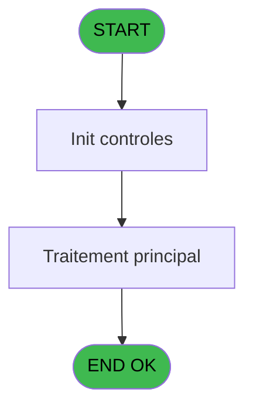
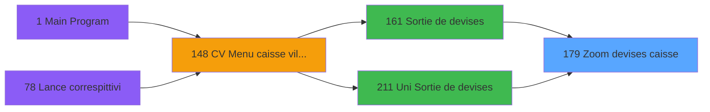
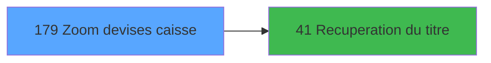

# VIL IDE 179 - Zoom  devises caisse

> **Analyse**: Phases 1-4 2026-02-03 20:53 -> 20:54 (17s) | Assemblage 20:54
> **Pipeline**: V7.2 Enrichi
> **Structure**: 4 onglets (Resume | Ecrans | Donnees | Connexions)

<!-- TAB:Resume -->

## 1. FICHE D'IDENTITE

| Attribut | Valeur |
|----------|--------|
| Projet | VIL |
| IDE Position | 179 |
| Nom Programme | Zoom  devises caisse |
| Fichier source | `Prg_179.xml` |
| Dossier IDE | Zooms |
| Taches | 1 (1 ecrans visibles) |
| Tables modifiees | 0 |
| Programmes appeles | 1 |

## 2. DESCRIPTION FONCTIONNELLE

**Zoom  devises caisse** assure la gestion complete de ce processus, accessible depuis [Sortie de devises (IDE 161)](VIL-IDE-161.md), [Uni Sortie de devises (IDE 211)](VIL-IDE-211.md).

Le flux de traitement s'organise en **1 blocs fonctionnels** :

- **Traitement** (1 tache) : traitements metier divers

## 3. BLOCS FONCTIONNELS

### 3.1 Traitement (1 tache)

Traitements internes.

---

#### 179 - Scroll devises caisse [[ECRAN]](#ecran-t1)

**Role** : Traitement : Scroll devises caisse.
**Ecran** : 742 x 173 DLU (MDI) | [Voir mockup](#ecran-t1)
**Delegue a** : [Recuperation du titre (IDE 41)](VIL-IDE-41.md)

## 5. REGLES METIER

*(Aucune regle metier identifiee)*

## 6. CONTEXTE

- **Appele par**: [Sortie de devises (IDE 161)](VIL-IDE-161.md), [Uni Sortie de devises (IDE 211)](VIL-IDE-211.md)
- **Appelle**: 1 programmes | **Tables**: 2 (W:0 R:1 L:1) | **Taches**: 1 | **Expressions**: 10

<!-- TAB:Ecrans -->

## 8. ECRANS

### 8.1 Forms visibles (1 / 1)

| # | Position | Tache | Nom | Type | Largeur | Hauteur | Bloc |
|---|----------|-------|-----|------|---------|---------|------|
| 1 | 179 | 179 | Scroll devises caisse | MDI | 742 | 173 | Traitement |

### 8.2 Mockups Ecrans

---

#### 179 - Scroll devises caisse
**Tache** : [179](#t1) | **Type** : MDI | **Dimensions** : 742 x 173 DLU
**Bloc** : Traitement | **Titre IDE** : Scroll devises caisse

<!-- FORM-DATA:
{
    "width":  742,
    "vFactor":  8,
    "type":  "MDI",
    "hFactor":  8,
    "controls":  [
                     {
                         "x":  23,
                         "type":  "table",
                         "var":  "",
                         "name":  "",
                         "titleH":  12,
                         "color":  "196",
                         "w":  696,
                         "y":  6,
                         "fmt":  "",
                         "parent":  null,
                         "text":  "",
                         "rowH":  14,
                         "h":  114,
                         "cols":  [
                                      {
                                          "title":  "Code devise",
                                          "layer":  1,
                                          "w":  117
                                      },
                                      {
                                          "title":  "Mode de paiement",
                                          "layer":  2,
                                          "w":  149
                                      },
                                      {
                                          "title":  "Solde du jour",
                                          "layer":  3,
                                          "w":  200
                                      },
                                      {
                                          "title":  "Sortie devise",
                                          "layer":  4,
                                          "w":  197
                                      }
                                  ],
                         "rows":  4
                     },
                     {
                         "x":  0,
                         "type":  "label",
                         "var":  "",
                         "y":  149,
                         "w":  741,
                         "fmt":  "",
                         "name":  "",
                         "h":  24,
                         "color":  "",
                         "text":  "",
                         "parent":  null
                     },
                     {
                         "x":  45,
                         "type":  "edit",
                         "var":  "",
                         "y":  22,
                         "w":  42,
                         "fmt":  "",
                         "name":  "",
                         "h":  8,
                         "color":  "196",
                         "text":  "",
                         "parent":  1
                     },
                     {
                         "x":  178,
                         "type":  "edit",
                         "var":  "",
                         "y":  22,
                         "w":  53,
                         "fmt":  "",
                         "name":  "",
                         "h":  8,
                         "color":  "196",
                         "text":  "",
                         "parent":  1
                     },
                     {
                         "x":  501,
                         "type":  "edit",
                         "var":  "",
                         "y":  22,
                         "w":  174,
                         "fmt":  "N## ### ### ###Z",
                         "name":  "",
                         "h":  8,
                         "color":  "196",
                         "text":  "",
                         "parent":  1
                     },
                     {
                         "x":  296,
                         "type":  "edit",
                         "var":  "",
                         "y":  22,
                         "w":  176,
                         "fmt":  "N## ### ### ###Z",
                         "name":  "",
                         "h":  8,
                         "color":  "196",
                         "text":  "",
                         "parent":  1
                     },
                     {
                         "x":  138,
                         "type":  "button",
                         "var":  "",
                         "y":  152,
                         "w":  160,
                         "fmt":  "\u0026Selectionner",
                         "name":  "",
                         "h":  18,
                         "color":  "",
                         "text":  "",
                         "parent":  null
                     },
                     {
                         "x":  445,
                         "type":  "button",
                         "var":  "",
                         "y":  152,
                         "w":  160,
                         "fmt":  "\u0026Quitter",
                         "name":  "",
                         "h":  18,
                         "color":  "",
                         "text":  "",
                         "parent":  null
                     },
                     {
                         "x":  342,
                         "type":  "image",
                         "var":  "",
                         "y":  125,
                         "w":  58,
                         "fmt":  "",
                         "name":  "",
                         "h":  18,
                         "color":  "",
                         "text":  "",
                         "parent":  null
                     }
                 ],
    "taskId":  "179",
    "height":  173
}
-->

<strong>Champs : 4 champs</strong>

| Pos (x,y) | Nom | Variable | Type |
|-----------|-----|----------|------|
| 45,22 | (sans nom) | - | edit |
| 178,22 | (sans nom) | - | edit |
| 501,22 | N## ### ### ###Z | - | edit |
| 296,22 | N## ### ### ###Z | - | edit |

<strong>Boutons : 2 boutons</strong>

| Bouton | Pos (x,y) | Action |
|--------|-----------|--------|
| Selectionner | 138,152 | Ouvre la selection |
| Quitter | 445,152 | Quitte le programme |

## 9. NAVIGATION

Ecran unique: **Scroll devises caisse**

### 9.3 Structure hierarchique (1 tache)

| Position | Tache | Type | Dimensions | Bloc |
|----------|-------|------|------------|------|
| **179.1** | [**Scroll devises caisse** (179)](#t1) [mockup](#ecran-t1) | MDI | 742x173 | Traitement |

### 9.4 Algorigramme

> **Legende**: Vert = START/END OK | Rouge = END KO | Bleu = Decisions
> *Algorigramme auto-genere. Utiliser `/algorigramme` pour une synthese metier detaillee.*

<!-- TAB:Donnees -->

## 10. TABLES

### Tables utilisees (2)

| ID | Nom | Description | Type | R | W | L | Usages |
|----|-----|-------------|------|---|---|---|--------|
| 57 | devises_caisse___ddk | Sessions de caisse | DB | R |   |   | 1 |
| 229 | detail_coffre_devise | Etat du coffre | DB |   |   | L | 1 |

### Colonnes par table (2 / 1 tables avec colonnes identifiees)

Table 57 - devises_caisse___ddk (R) - 1 usages

| Lettre | Variable | Acces | Type |
|--------|----------|-------|------|
| A | > Societe | R | Alpha |
| B | < n° devise | R | Numeric |
| C | < Code devise | R | Alpha |
| D | < Mode de paiement | R | Alpha |
| E | < Sortie devise | R | Numeric |
| F | P. Date comptable (dernière) | R | Date |
| G | v.titre | R | Alpha |
| H | Bouton selection | R | Alpha |
| I | Bouton Quitter | R | Alpha |

## 11. VARIABLES

### 11.1 Parametres entrants (1)

Variables recues du programme appelant ([Sortie de devises (IDE 161)](VIL-IDE-161.md)).

| Lettre | Nom | Type | Usage dans |
|--------|-----|------|-----------|
| F | P. Date comptable (dernière) | Date | - |

### 11.2 Variables de session (1)

Variables persistantes pendant toute la session.

| Lettre | Nom | Type | Usage dans |
|--------|-----|------|-----------|
| G | v.titre | Alpha | - |

### 11.3 Autres (7)

Variables diverses.

| Lettre | Nom | Type | Usage dans |
|--------|-----|------|-----------|
| A | > Societe | Alpha | 1x refs |
| B | < n° devise | Numeric | - |
| C | < Code devise | Alpha | - |
| D | < Mode de paiement | Alpha | - |
| E | < Sortie devise | Numeric | - |
| H | Bouton selection | Alpha | 1x refs |
| I | Bouton Quitter | Alpha | 1x refs |

## 12. EXPRESSIONS

**10 / 10 expressions decodees (100%)**

### 12.1 Repartition par type

| Type | Expressions | Regles |
|------|-------------|--------|
| CONSTANTE | 2 | 0 |
| CONDITION | 2 | 0 |
| OTHER | 5 | 0 |
| STRING | 1 | 0 |

### 12.2 Expressions cles par type

#### CONSTANTE (2 expressions)

| Type | IDE | Expression | Regle |
|------|-----|------------|-------|
| CONSTANTE | 9 | `0` | - |
| CONSTANTE | 2 | `109` | - |

#### CONDITION (2 expressions)

| Type | IDE | Expression | Regle |
|------|-----|------------|-------|
| CONDITION | 10 | `[Q]<>0` | - |
| CONDITION | 3 | `> Societe [A]` | - |

#### OTHER (5 expressions)

| Type | IDE | Expression | Regle |
|------|-----|------------|-------|
| OTHER | 7 | `[J]` | - |
| OTHER | 8 | `[L]` | - |
| OTHER | 6 | `Bouton Quitter [I]` | - |
| OTHER | 4 | `P. Date comptable (der... [F]` | - |
| OTHER | 5 | `Bouton selection [H]` | - |

#### STRING (1 expressions)

| Type | IDE | Expression | Regle |
|------|-----|------------|-------|
| STRING | 1 | `Trim ([R])` | - |

<!-- TAB:Connexions -->

## 13. GRAPHE D'APPELS

### 13.1 Chaine depuis Main (Callers)

Main -> ... -> [Sortie de devises (IDE 161)](VIL-IDE-161.md) -> **Zoom  devises caisse (IDE 179)**

Main -> ... -> [Uni Sortie de devises (IDE 211)](VIL-IDE-211.md) -> **Zoom  devises caisse (IDE 179)**

### 13.2 Callers

| IDE | Nom Programme | Nb Appels |
|-----|---------------|-----------|
| [161](VIL-IDE-161.md) | Sortie de devises | 1 |
| [211](VIL-IDE-211.md) | Uni Sortie de devises | 1 |

### 13.3 Callees (programmes appeles)

### 13.4 Detail Callees avec contexte

| IDE | Nom Programme | Appels | Contexte |
|-----|---------------|--------|----------|
| [41](VIL-IDE-41.md) | Recuperation du titre | 1 | Recuperation donnees |

## 14. RECOMMANDATIONS MIGRATION

### 14.1 Profil du programme

| Metrique | Valeur | Impact migration |
|----------|--------|-----------------|
| Lignes de logique | 34 | Programme compact |
| Expressions | 10 | Peu de logique |
| Tables WRITE | 0 | Impact faible |
| Sous-programmes | 1 | Peu de dependances |
| Ecrans visibles | 1 | Ecran unique ou traitement batch |
| Code desactive | 0% (0 / 34) | Code sain |
| Regles metier | 0 | Pas de regle identifiee |

### 14.2 Plan de migration par bloc

#### Traitement (1 tache: 1 ecran, 0 traitement)

- **Strategie** : 1 composant(s) UI (Razor/React) avec formulaires et validation.
- 1 sous-programme(s) a migrer ou a reutiliser depuis les services existants.
- Decomposer les taches en services unitaires testables.

### 14.3 Dependances critiques

| Dependance | Type | Appels | Impact |
|------------|------|--------|--------|
| [Recuperation du titre (IDE 41)](VIL-IDE-41.md) | Sous-programme | 1x | Normale - Recuperation donnees |

---
*Spec DETAILED generee par Pipeline V7.2 - 2026-02-03 20:54*
