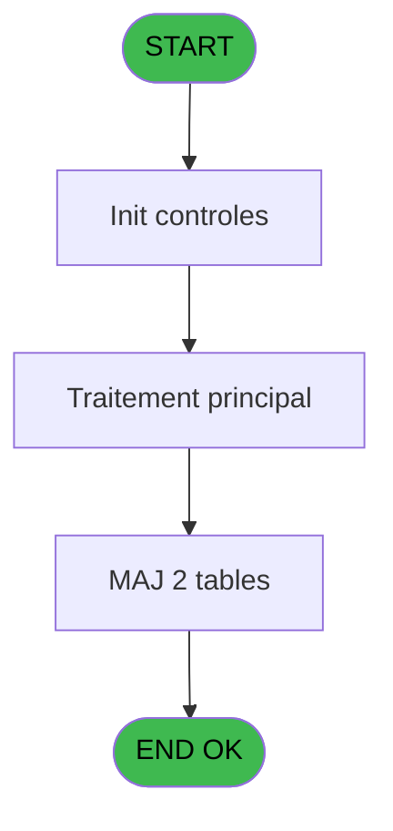
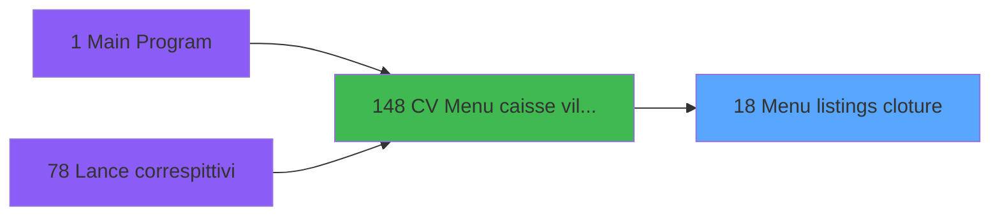
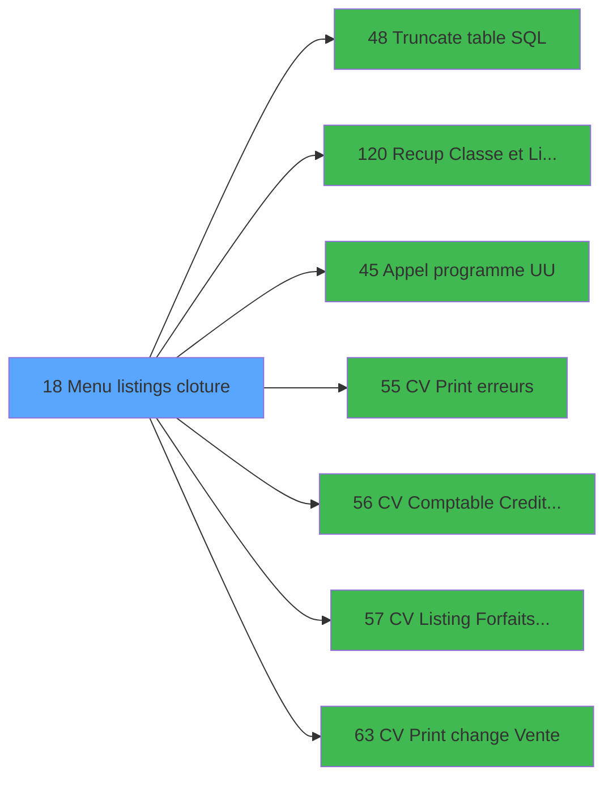

# VIL IDE 18 - Menu listings cloture

> **Analyse**: Phases 1-4 2026-02-03 01:04 -> 01:05 (39s) | Assemblage 01:05
> **Pipeline**: V7.2 Enrichi
> **Structure**: 4 onglets (Resume | Ecrans | Donnees | Connexions)

<!-- TAB:Resume -->

## 1. FICHE D'IDENTITE

| Attribut | Valeur |
|----------|--------|
| Projet | VIL |
| IDE Position | 18 |
| Nom Programme | Menu listings cloture |
| Fichier source | `Prg_18.xml` |
| Domaine metier | Navigation |
| Taches | 7 (1 ecrans visibles) |
| Tables modifiees | 2 |
| Programmes appeles | 7 |

## 2. DESCRIPTION FONCTIONNELLE

**Menu listings cloture** assure la gestion complete de ce processus, accessible depuis [CV  Menu caisse village (IDE 148)](VIL-IDE-148.md).

Le flux de traitement s'organise en **1 blocs fonctionnels** :

- **Traitement** (7 taches) : traitements metier divers

**Donnees modifiees** : 2 tables en ecriture (comptage_coffre_devise, pv_customer).

Detail : phases du traitement

#### Phase 1 : Traitement (7 taches)

- **18** - CV  Menu listings complement. **[[ECRAN]](#ecran-t1)**
- **18.1** - Contenu Combo
- **18.2** - Versements/Retraits
- **18.3** - Versements/Retraits
- **18.4** - Lecture solde veille
- **18.5** - Gen 341
- **18.6** - Gen 341

Delegue a : [Truncate table SQL (IDE 48)](VIL-IDE-48.md), [Appel programme UU (IDE 45)](VIL-IDE-45.md), [CV Listing Forfaits TAI CASH (IDE 57)](VIL-IDE-57.md)

#### Tables impactees

| Table | Operations | Role metier |
|-------|-----------|-------------|
| comptage_coffre_devise | **W** (1 usages) | Etat du coffre |
| pv_customer | **W** (1 usages) |  |

## 3. BLOCS FONCTIONNELS

### 3.1 Traitement (7 taches)

Traitements internes.

---

#### 18 - CV  Menu listings complement. [[ECRAN]](#ecran-t1)

**Role** : Tache d'orchestration : point d'entree du programme (7 sous-taches). Coordonne l'enchainement des traitements.
**Ecran** : 1021 x 220 DLU (MDI) | [Voir mockup](#ecran-t1)

6 sous-taches directes

| Tache | Nom | Bloc |
|-------|-----|------|
| [18.1](#t2) | Contenu Combo | Traitement |
| [18.2](#t3) | Versements/Retraits | Traitement |
| [18.3](#t4) | Versements/Retraits | Traitement |
| [18.4](#t5) | Lecture solde veille | Traitement |
| [18.5](#t6) | Gen 341 | Traitement |
| [18.6](#t7) | Gen 341 | Traitement |

**Delegue a** : [Truncate table SQL (IDE 48)](VIL-IDE-48.md), [Appel programme UU (IDE 45)](VIL-IDE-45.md), [CV Listing Forfaits TAI CASH (IDE 57)](VIL-IDE-57.md)

---

#### 18.1 - Contenu Combo

**Role** : Traitement : Contenu Combo.
**Variables liees** : BE (W0 Contenu Combo)
**Delegue a** : [Truncate table SQL (IDE 48)](VIL-IDE-48.md), [Appel programme UU (IDE 45)](VIL-IDE-45.md), [CV Listing Forfaits TAI CASH (IDE 57)](VIL-IDE-57.md)

---

#### 18.2 - Versements/Retraits

**Role** : Traitement : Versements/Retraits.
**Delegue a** : [Truncate table SQL (IDE 48)](VIL-IDE-48.md), [Appel programme UU (IDE 45)](VIL-IDE-45.md), [CV Listing Forfaits TAI CASH (IDE 57)](VIL-IDE-57.md)

---

#### 18.3 - Versements/Retraits

**Role** : Traitement : Versements/Retraits.
**Delegue a** : [Truncate table SQL (IDE 48)](VIL-IDE-48.md), [Appel programme UU (IDE 45)](VIL-IDE-45.md), [CV Listing Forfaits TAI CASH (IDE 57)](VIL-IDE-57.md)

---

#### 18.4 - Lecture solde veille

**Role** : Consultation/chargement : Lecture solde veille.
**Variables liees** : V (W0 solde veille)
**Delegue a** : [Truncate table SQL (IDE 48)](VIL-IDE-48.md), [Appel programme UU (IDE 45)](VIL-IDE-45.md), [CV Listing Forfaits TAI CASH (IDE 57)](VIL-IDE-57.md)

---

#### 18.5 - Gen 341

**Role** : Traitement : Gen 341.
**Delegue a** : [Truncate table SQL (IDE 48)](VIL-IDE-48.md), [Appel programme UU (IDE 45)](VIL-IDE-45.md), [CV Listing Forfaits TAI CASH (IDE 57)](VIL-IDE-57.md)

---

#### 18.6 - Gen 341

**Role** : Traitement : Gen 341.
**Delegue a** : [Truncate table SQL (IDE 48)](VIL-IDE-48.md), [Appel programme UU (IDE 45)](VIL-IDE-45.md), [CV Listing Forfaits TAI CASH (IDE 57)](VIL-IDE-57.md)

## 5. REGLES METIER

*(Aucune regle metier identifiee)*

## 6. CONTEXTE

- **Appele par**: [CV  Menu caisse village (IDE 148)](VIL-IDE-148.md)
- **Appelle**: 7 programmes | **Tables**: 8 (W:2 R:3 L:3) | **Taches**: 7 | **Expressions**: 43

<!-- TAB:Ecrans -->

## 8. ECRANS

### 8.1 Forms visibles (1 / 7)

| # | Position | Tache | Nom | Type | Largeur | Hauteur | Bloc |
|---|----------|-------|-----|------|---------|---------|------|
| 1 | 18 | 18 | CV  Menu listings complement. | MDI | 1021 | 220 | Traitement |

### 8.2 Mockups Ecrans

---

#### 18 - CV  Menu listings complement.
**Tache** : [18](#t1) | **Type** : MDI | **Dimensions** : 1021 x 220 DLU
**Bloc** : Traitement | **Titre IDE** : CV  Menu listings complement.

<!-- FORM-DATA:
{
    "width":  1021,
    "vFactor":  8,
    "type":  "MDI",
    "hFactor":  8,
    "controls":  [
                     {
                         "x":  0,
                         "type":  "label",
                         "var":  "",
                         "y":  1,
                         "w":  1006,
                         "fmt":  "",
                         "name":  "",
                         "h":  17,
                         "color":  "",
                         "text":  "",
                         "parent":  null
                     },
                     {
                         "x":  343,
                         "type":  "label",
                         "var":  "",
                         "y":  20,
                         "w":  160,
                         "fmt":  "",
                         "name":  "",
                         "h":  12,
                         "color":  "",
                         "text":  "Date Comptable",
                         "parent":  null
                     },
                     {
                         "x":  0,
                         "type":  "label",
                         "var":  "",
                         "y":  35,
                         "w":  1012,
                         "fmt":  "",
                         "name":  "",
                         "h":  158,
                         "color":  "",
                         "text":  "",
                         "parent":  null
                     },
                     {
                         "x":  3,
                         "type":  "label",
                         "var":  "",
                         "y":  36,
                         "w":  1005,
                         "fmt":  "",
                         "name":  "",
                         "h":  156,
                         "color":  "",
                         "text":  "",
                         "parent":  null
                     },
                     {
                         "x":  179,
                         "type":  "label",
                         "var":  "",
                         "y":  45,
                         "w":  398,
                         "fmt":  "",
                         "name":  "",
                         "h":  122,
                         "color":  "",
                         "text":  "",
                         "parent":  null
                     },
                     {
                         "x":  590,
                         "type":  "label",
                         "var":  "",
                         "y":  45,
                         "w":  398,
                         "fmt":  "",
                         "name":  "",
                         "h":  122,
                         "color":  "",
                         "text":  "",
                         "parent":  null
                     },
                     {
                         "x":  182,
                         "type":  "label",
                         "var":  "",
                         "y":  46,
                         "w":  50,
                         "fmt":  "",
                         "name":  "",
                         "h":  120,
                         "color":  "",
                         "text":  "",
                         "parent":  null
                     },
                     {
                         "x":  593,
                         "type":  "label",
                         "var":  "",
                         "y":  46,
                         "w":  50,
                         "fmt":  "",
                         "name":  "",
                         "h":  120,
                         "color":  "",
                         "text":  "",
                         "parent":  null
                     },
                     {
                         "x":  651,
                         "type":  "label",
                         "var":  "",
                         "y":  51,
                         "w":  320,
                         "fmt":  "",
                         "name":  "",
                         "h":  9,
                         "color":  "7",
                         "text":  "Récapitulatif des devises",
                         "parent":  9
                     },
                     {
                         "x":  240,
                         "type":  "label",
                         "var":  "",
                         "y":  64,
                         "w":  320,
                         "fmt":  "",
                         "name":  "",
                         "h":  9,
                         "color":  "7",
                         "text":  "Listing des erreurs",
                         "parent":  8
                     },
                     {
                         "x":  651,
                         "type":  "label",
                         "var":  "",
                         "y":  64,
                         "w":  320,
                         "fmt":  "",
                         "name":  "",
                         "h":  9,
                         "color":  "7",
                         "text":  "Listing du Change",
                         "parent":  9
                     },
                     {
                         "x":  240,
                         "type":  "label",
                         "var":  "",
                         "y":  77,
                         "w":  320,
                         "fmt":  "",
                         "name":  "",
                         "h":  9,
                         "color":  "7",
                         "text":  "Listing comptable",
                         "parent":  8
                     },
                     {
                         "x":  651,
                         "type":  "label",
                         "var":  "",
                         "y":  77,
                         "w":  320,
                         "fmt":  "",
                         "name":  "",
                         "h":  9,
                         "color":  "7",
                         "text":  "Listing des transactions",
                         "parent":  9
                     },
                     {
                         "x":  240,
                         "type":  "label",
                         "var":  "",
                         "y":  90,
                         "w":  320,
                         "fmt":  "",
                         "name":  "",
                         "h":  9,
                         "color":  "7",
                         "text":  "Compte adherent",
                         "parent":  8
                     },
                     {
                         "x":  651,
                         "type":  "label",
                         "var":  "",
                         "y":  90,
                         "w":  320,
                         "fmt":  "",
                         "name":  "",
                         "h":  9,
                         "color":  "7",
                         "text":  "Télécollectes",
                         "parent":  9
                     },
                     {
                         "x":  651,
                         "type":  "label",
                         "var":  "",
                         "y":  103,
                         "w":  320,
                         "fmt":  "",
                         "name":  "",
                         "h":  9,
                         "color":  "7",
                         "text":  "Edition clôture",
                         "parent":  9
                     },
                     {
                         "x":  238,
                         "type":  "label",
                         "var":  "",
                         "y":  116,
                         "w":  320,
                         "fmt":  "",
                         "name":  "",
                         "h":  9,
                         "color":  "7",
                         "text":  "Listing des forfaits TAI CASH",
                         "parent":  8
                     },
                     {
                         "x":  651,
                         "type":  "label",
                         "var":  "",
                         "y":  116,
                         "w":  320,
                         "fmt":  "",
                         "name":  "",
                         "h":  9,
                         "color":  "7",
                         "text":  "Récapitulatif des sessions",
                         "parent":  9
                     },
                     {
                         "x":  391,
                         "type":  "label",
                         "var":  "",
                         "y":  177,
                         "w":  195,
                         "fmt":  "",
                         "name":  "",
                         "h":  8,
                         "color":  "",
                         "text":  "Choix de l\u0027action",
                         "parent":  null
                     },
                     {
                         "x":  0,
                         "type":  "label",
                         "var":  "",
                         "y":  196,
                         "w":  1009,
                         "fmt":  "",
                         "name":  "",
                         "h":  23,
                         "color":  "",
                         "text":  "",
                         "parent":  null
                     },
                     {
                         "x":  240,
                         "type":  "label",
                         "var":  "",
                         "y":  103,
                         "w":  320,
                         "fmt":  "",
                         "name":  "",
                         "h":  9,
                         "color":  "7",
                         "text":  "Crédit de conso",
                         "parent":  8
                     },
                     {
                         "x":  528,
                         "type":  "combobox",
                         "var":  "",
                         "y":  20,
                         "w":  150,
                         "fmt":  "",
                         "name":  "",
                         "h":  12,
                         "color":  "",
                         "text":  "A,B",
                         "parent":  null
                     },
                     {
                         "x":  587,
                         "type":  "edit",
                         "var":  "",
                         "y":  176,
                         "w":  43,
                         "fmt":  "",
                         "name":  "",
                         "h":  10,
                         "color":  "6",
                         "text":  "",
                         "parent":  null
                     },
                     {
                         "x":  11,
                         "type":  "edit",
                         "var":  "",
                         "y":  5,
                         "w":  395,
                         "fmt":  "30",
                         "name":  "",
                         "h":  8,
                         "color":  "",
                         "text":  "",
                         "parent":  1
                     },
                     {
                         "x":  723,
                         "type":  "edit",
                         "var":  "",
                         "y":  5,
                         "w":  264,
                         "fmt":  "WWW DD MMM YYYYZ",
                         "name":  "",
                         "h":  8,
                         "color":  "",
                         "text":  "",
                         "parent":  1
                     },
                     {
                         "x":  19,
                         "type":  "image",
                         "var":  "",
                         "y":  44,
                         "w":  144,
                         "fmt":  "",
                         "name":  "",
                         "h":  62,
                         "color":  "",
                         "text":  "",
                         "parent":  null
                     },
                     {
                         "x":  603,
                         "type":  "button",
                         "var":  "",
                         "y":  51,
                         "w":  26,
                         "fmt":  "7",
                         "name":  "7",
                         "h":  9,
                         "color":  "",
                         "text":  "",
                         "parent":  11
                     },
                     {
                         "x":  192,
                         "type":  "button",
                         "var":  "",
                         "y":  64,
                         "w":  26,
                         "fmt":  "2",
                         "name":  "2",
                         "h":  9,
                         "color":  "",
                         "text":  "",
                         "parent":  10
                     },
                     {
                         "x":  603,
                         "type":  "button",
                         "var":  "",
                         "y":  64,
                         "w":  26,
                         "fmt":  "8",
                         "name":  "8",
                         "h":  9,
                         "color":  "",
                         "text":  "",
                         "parent":  11
                     },
                     {
                         "x":  192,
                         "type":  "button",
                         "var":  "",
                         "y":  77,
                         "w":  26,
                         "fmt":  "3",
                         "name":  "3",
                         "h":  9,
                         "color":  "",
                         "text":  "",
                         "parent":  10
                     },
                     {
                         "x":  603,
                         "type":  "button",
                         "var":  "",
                         "y":  77,
                         "w":  26,
                         "fmt":  "9",
                         "name":  "9",
                         "h":  9,
                         "color":  "",
                         "text":  "",
                         "parent":  11
                     },
                     {
                         "x":  192,
                         "type":  "button",
                         "var":  "",
                         "y":  90,
                         "w":  26,
                         "fmt":  "4",
                         "name":  "4",
                         "h":  9,
                         "color":  "",
                         "text":  "",
                         "parent":  10
                     },
                     {
                         "x":  603,
                         "type":  "button",
                         "var":  "",
                         "y":  90,
                         "w":  26,
                         "fmt":  "10",
                         "name":  "10",
                         "h":  9,
                         "color":  "",
                         "text":  "",
                         "parent":  11
                     },
                     {
                         "x":  192,
                         "type":  "button",
                         "var":  "",
                         "y":  103,
                         "w":  26,
                         "fmt":  "5",
                         "name":  "5",
                         "h":  9,
                         "color":  "",
                         "text":  "",
                         "parent":  10
                     },
                     {
                         "x":  603,
                         "type":  "button",
                         "var":  "",
                         "y":  103,
                         "w":  26,
                         "fmt":  "11",
                         "name":  "11",
                         "h":  9,
                         "color":  "",
                         "text":  "",
                         "parent":  11
                     },
                     {
                         "x":  192,
                         "type":  "button",
                         "var":  "",
                         "y":  116,
                         "w":  26,
                         "fmt":  "6",
                         "name":  "6",
                         "h":  9,
                         "color":  "",
                         "text":  "",
                         "parent":  10
                     },
                     {
                         "x":  603,
                         "type":  "button",
                         "var":  "",
                         "y":  116,
                         "w":  26,
                         "fmt":  "12",
                         "name":  "12",
                         "h":  9,
                         "color":  "",
                         "text":  "",
                         "parent":  11
                     },
                     {
                         "x":  9,
                         "type":  "button",
                         "var":  "",
                         "y":  199,
                         "w":  160,
                         "fmt":  "\u0026Quitter",
                         "name":  "",
                         "h":  18,
                         "color":  "",
                         "text":  "",
                         "parent":  null
                     }
                 ],
    "taskId":  "18",
    "height":  220
}
-->

<strong>Champs : 4 champs</strong>

| Pos (x,y) | Nom | Variable | Type |
|-----------|-----|----------|------|
| 528,20 | A,B | - | combobox |
| 587,176 | (sans nom) | - | edit |
| 11,5 | 30 | - | edit |
| 723,5 | WWW DD MMM YYYYZ | - | edit |

<strong>Boutons : 12 boutons</strong>

| Bouton | Pos (x,y) | Action |
|--------|-----------|--------|
| 7 | 603,51 | Bouton fonctionnel |
| 2 | 192,64 | Bouton fonctionnel |
| 8 | 603,64 | Bouton fonctionnel |
| 3 | 192,77 | Bouton fonctionnel |
| 9 | 603,77 | Bouton fonctionnel |
| 4 | 192,90 | Bouton fonctionnel |
| 10 | 603,90 | Bouton fonctionnel |
| 5 | 192,103 | Bouton fonctionnel |
| 11 | 603,103 | Bouton fonctionnel |
| 6 | 192,116 | Bouton fonctionnel |
| 12 | 603,116 | Bouton fonctionnel |
| Quitter | 9,199 | Quitte le programme |

## 9. NAVIGATION

Ecran unique: **CV  Menu listings complement.**

### 9.3 Structure hierarchique (7 taches)

| Position | Tache | Type | Dimensions | Bloc |
|----------|-------|------|------------|------|
| **18.1** | [**CV  Menu listings complement.** (18)](#t1) [mockup](#ecran-t1) | MDI | 1021x220 | Traitement |
| 18.1.1 | [Contenu Combo (18.1)](#t2) | MDI | - | |
| 18.1.2 | [Versements/Retraits (18.2)](#t3) | MDI | - | |
| 18.1.3 | [Versements/Retraits (18.3)](#t4) | MDI | - | |
| 18.1.4 | [Lecture solde veille (18.4)](#t5) | MDI | - | |
| 18.1.5 | [Gen 341 (18.5)](#t6) | MDI | - | |
| 18.1.6 | [Gen 341 (18.6)](#t7) | MDI | - | |

### 9.4 Algorigramme

> **Legende**: Vert = START/END OK | Rouge = END KO | Bleu = Decisions
> *Algorigramme auto-genere. Utiliser `/algorigramme` pour une synthese metier detaillee.*

<!-- TAB:Donnees -->

## 10. TABLES

### Tables utilisees (8)

| ID | Nom | Description | Type | R | W | L | Usages |
|----|-----|-------------|------|---|---|---|--------|
| 17 | backup_devises_caisse | Sessions de caisse | DB |   |   | L | 1 |
| 18 | backup_histo_sessions_caisse | Sessions de caisse | DB |   |   | L | 1 |
| 40 | comptable________cte |  | DB | R |   |   | 2 |
| 55 | solde_caisse_____sks | Sessions de caisse | DB | R |   |   | 1 |
| 140 | moyen_paiement___mop |  | DB |   |   | L | 1 |
| 348 | log_cloture_auto | Donnees reseau/cloture | DB | R |   |   | 1 |
| 471 | comptage_coffre_devise | Etat du coffre | TMP |   | **W** |   | 1 |
| 508 | pv_customer |  | TMP |   | **W** |   | 1 |

### Colonnes par table (3 / 5 tables avec colonnes identifiees)

Table 40 - comptable________cte (R) - 2 usages

| Lettre | Variable | Acces | Type |
|--------|----------|-------|------|
| D | P0 date comptable | R | Date |
| O | WP0 String Date Comptable | R | Alpha |
| P | WP0 Date Comptable Choisie | R | Date |

Table 55 - solde_caisse_____sks (R) - 1 usages

| Lettre | Variable | Acces | Type |
|--------|----------|-------|------|
| V | W0 solde veille | R | Numeric |

Table 348 - log_cloture_auto (R) - 1 usages

*Table utilisee uniquement en Link ou aucune colonne Real identifiee dans le DataView.*

Table 471 - comptage_coffre_devise (**W**) - 1 usages

| Lettre | Variable | Acces | Type |
|--------|----------|-------|------|
| G | P0 Devise Locale | W | Alpha |

Table 508 - pv_customer (**W**) - 1 usages

*Table utilisee uniquement en Link ou aucune colonne Real identifiee dans le DataView.*

## 11. VARIABLES

### 11.1 Parametres entrants (13)

Variables recues du programme appelant ([CV  Menu caisse village (IDE 148)](VIL-IDE-148.md)).

| Lettre | Nom | Type | Usage dans |
|--------|-----|------|-----------|
| A | P0 societe | Alpha | - |
| B | P0 picture montant | Alpha | - |
| C | P0 nbre decimales | Numeric | 1x parametre entrant |
| D | P0 date comptable | Date | 12x parametre entrant |
| E | P0 nom village | Alpha | - |
| F | P0 Uni / Bi | Alpha | 1x parametre entrant |
| G | P0 Devise Locale | Alpha | - |
| H | P0 Village CAM | Alpha | 1x parametre entrant |
| I | P0 Village TEL | Alpha | - |
| J | P0 Village BIBOP | Alpha | - |
| K | P0 Village PME | Alpha | - |
| L | P0 Village TAI | Alpha | 1x parametre entrant |
| M | P0 TAI Obligatoire | Alpha | 1x parametre entrant |

### 11.2 Variables de travail (17)

Variables internes au programme.

| Lettre | Nom | Type | Usage dans |
|--------|-----|------|-----------|
| Q | W0 param bidon | Numeric | - |
| R | W0 choix action | Alpha | 11x calcul interne |
| S | W0 fin tache | Alpha | 2x calcul interne |
| T | W0 Date enregistrement | Date | - |
| U | W0 Abandon date enreg | Logical | - |
| V | W0 solde veille | Numeric | - |
| W | W0 montant versmnt | Numeric | - |
| X | W0 montant retrait | Numeric | - |
| Y | W0 pkes recettes | Numeric | - |
| Z | W0 pkes depenses | Numeric | - |
| BA | W0 Versement CASH | Numeric | - |
| BB | W0 Versement NON CASH | Numeric | - |
| BC | W0 Retrait CASH | Numeric | - |
| BD | W0 Retrait NON CASH | Numeric | - |
| BE | W0 Contenu Combo | Alpha | - |
| BF | W0 Edition Erreur Effectuee | Logical | - |
| BG | W0 Repertoire Editions | Alpha | - |

### 11.3 Autres (3)

Variables diverses.

| Lettre | Nom | Type | Usage dans |
|--------|-----|------|-----------|
| N | WP0 masque cumul | Alpha | - |
| O | WP0 String Date Comptable | Alpha | 1x refs |
| P | WP0 Date Comptable Choisie | Date | - |

Toutes les 33 variables (liste complete)

| Cat | Lettre | Nom Variable | Type |
|-----|--------|--------------|------|
| P0 | **A** | P0 societe | Alpha |
| P0 | **B** | P0 picture montant | Alpha |
| P0 | **C** | P0 nbre decimales | Numeric |
| P0 | **D** | P0 date comptable | Date |
| P0 | **E** | P0 nom village | Alpha |
| P0 | **F** | P0 Uni / Bi | Alpha |
| P0 | **G** | P0 Devise Locale | Alpha |
| P0 | **H** | P0 Village CAM | Alpha |
| P0 | **I** | P0 Village TEL | Alpha |
| P0 | **J** | P0 Village BIBOP | Alpha |
| P0 | **K** | P0 Village PME | Alpha |
| P0 | **L** | P0 Village TAI | Alpha |
| P0 | **M** | P0 TAI Obligatoire | Alpha |
| W0 | **Q** | W0 param bidon | Numeric |
| W0 | **R** | W0 choix action | Alpha |
| W0 | **S** | W0 fin tache | Alpha |
| W0 | **T** | W0 Date enregistrement | Date |
| W0 | **U** | W0 Abandon date enreg | Logical |
| W0 | **V** | W0 solde veille | Numeric |
| W0 | **W** | W0 montant versmnt | Numeric |
| W0 | **X** | W0 montant retrait | Numeric |
| W0 | **Y** | W0 pkes recettes | Numeric |
| W0 | **Z** | W0 pkes depenses | Numeric |
| W0 | **BA** | W0 Versement CASH | Numeric |
| W0 | **BB** | W0 Versement NON CASH | Numeric |
| W0 | **BC** | W0 Retrait CASH | Numeric |
| W0 | **BD** | W0 Retrait NON CASH | Numeric |
| W0 | **BE** | W0 Contenu Combo | Alpha |
| W0 | **BF** | W0 Edition Erreur Effectuee | Logical |
| W0 | **BG** | W0 Repertoire Editions | Alpha |
| Autre | **N** | WP0 masque cumul | Alpha |
| Autre | **O** | WP0 String Date Comptable | Alpha |
| Autre | **P** | WP0 Date Comptable Choisie | Date |

## 12. EXPRESSIONS

**43 / 43 expressions decodees (100%)**

### 12.1 Repartition par type

| Type | Expressions | Regles |
|------|-------------|--------|
| CONDITION | 17 | 0 |
| CONSTANTE | 1 | 0 |
| DATE | 3 | 0 |
| CONCATENATION | 12 | 0 |
| REFERENCE_VG | 1 | 0 |
| CAST_LOGIQUE | 1 | 0 |
| OTHER | 6 | 0 |
| STRING | 2 | 0 |

### 12.2 Expressions cles par type

#### CONDITION (17 expressions)

| Type | IDE | Expression | Regle |
|------|-----|------------|-------|
| CONDITION | 18 | `W0 fin tache [S]='F'` | - |
| CONDITION | 19 | `W0 fin tache [S]<>'F'` | - |
| CONDITION | 15 | `W0 choix action [R]='10'` | - |
| CONDITION | 16 | `W0 choix action [R]='11'` | - |
| CONDITION | 23 | `P0 Village TAI [L]='O' AND P0 TAI Obligatoire [M]='1'` | - |
| ... | | *+12 autres* | |

#### CONSTANTE (1 expressions)

| Type | IDE | Expression | Regle |
|------|-----|------------|-------|
| CONSTANTE | 5 | `''` | - |

#### DATE (3 expressions)

| Type | IDE | Expression | Regle |
|------|-----|------------|-------|
| DATE | 24 | `DStr (P0 date comptable [D]-1,'DD/MM/YYYY')` | - |
| DATE | 2 | `Date ()` | - |
| DATE | 1 | `DVal (WP0 String Date Comptable [O],'DD/MM/YYYY')` | - |

#### CONCATENATION (12 expressions)

| Type | IDE | Expression | Regle |
|------|-----|------------|-------|
| CONCATENATION | 40 | `Trim ([AG])&'Cloture_'&DStr (WP0 Date Comptable Cho... [P],'YYYYMMDD')&'.htm'` | - |
| CONCATENATION | 39 | `Trim ([AG])&'telecollecte_'&DStr (WP0 Date Comptable Cho... [P],'YYYYMMDD')&'.htm'` | - |
| CONCATENATION | 38 | `Trim ([AG])&'Ventes_'&DStr (WP0 Date Comptable Cho... [P],'YYYYMMDD')&'.htm'` | - |
| CONCATENATION | 17 | `'N'&Right (' ### ### ### ###'&Left ('.',P0 nbre decimales [C])&Left ('###',P0 nbre decimales [C]),16)&'Z'` | - |
| CONCATENATION | 42 | `Trim ([AG])&'Recap_Sessions_'&DStr (WP0 Date Comptable Cho... [P],'YYYYMMDD')&'.htm'` | - |
| ... | | *+7 autres* | |

#### REFERENCE_VG (1 expressions)

| Type | IDE | Expression | Regle |
|------|-----|------------|-------|
| REFERENCE_VG | 3 | `VG2` | - |

#### CAST_LOGIQUE (1 expressions)

| Type | IDE | Expression | Regle |
|------|-----|------------|-------|
| CAST_LOGIQUE | 7 | `'TRUE'LOG` | - |

#### OTHER (6 expressions)

| Type | IDE | Expression | Regle |
|------|-----|------------|-------|
| OTHER | 29 | `DbName ('{165,2}'DSOURCE)` | - |
| OTHER | 30 | `DbName ('{175,2}'DSOURCE)` | - |
| OTHER | 31 | `DbName ('{362,2}'DSOURCE)` | - |
| OTHER | 26 | `[AF]` | - |
| OTHER | 27 | `DbName ('{146,2}'DSOURCE)` | - |
| ... | | *+1 autres* | |

#### STRING (2 expressions)

| Type | IDE | Expression | Regle |
|------|-----|------------|-------|
| STRING | 32 | `Trim (INIGet ('[MAGIC_LOGICAL_NAMES]club_exportdata')&'Cloture\Editions\')` | - |
| STRING | 25 | `Trim ([AE])` | - |

### 12.3 Toutes les expressions (43)

Voir les 43 expressions

#### CONDITION (17)

| IDE | Expression Decodee |
|-----|-------------------|
| 22 | `WP0 Date Comptable Cho... [P]=P0 date comptable [D]-1` |
| 6 | `W0 choix action [R]='2'` |
| 8 | `W0 choix action [R]='3'` |
| 9 | `W0 choix action [R]='4'` |
| 10 | `W0 choix action [R]='5'` |
| 11 | `W0 choix action [R]='6'` |
| 12 | `W0 choix action [R]='7'` |
| 13 | `W0 choix action [R]='8'` |
| 14 | `W0 choix action [R]='9'` |
| 15 | `W0 choix action [R]='10'` |
| 16 | `W0 choix action [R]='11'` |
| 18 | `W0 fin tache [S]='F'` |
| 19 | `W0 fin tache [S]<>'F'` |
| 20 | `P0 Uni / Bi [F]='B'` |
| 21 | `P0 Village CAM [H]='O'` |
| 23 | `P0 Village TAI [L]='O' AND P0 TAI Obligatoire [M]='1'` |
| 43 | `W0 choix action [R]='12'` |

#### CONSTANTE (1)

| IDE | Expression Decodee |
|-----|-------------------|
| 5 | `''` |

#### DATE (3)

| IDE | Expression Decodee |
|-----|-------------------|
| 1 | `DVal (WP0 String Date Comptable [O],'DD/MM/YYYY')` |
| 2 | `Date ()` |
| 24 | `DStr (P0 date comptable [D]-1,'DD/MM/YYYY')` |

#### CONCATENATION (12)

| IDE | Expression Decodee |
|-----|-------------------|
| 4 | `SetParam ('DTCLOSURE',MlsTrans ('Le')&' '&DStr (Date (),'DD/MM/YYYY')&' - '&TStr (Time (),'HH:MM:SS'))` |
| 33 | `Trim ([AG])&'Comptable_'&DStr (WP0 Date Comptable Cho... [P],'YYYYMMDD')&'.htm'` |
| 34 | `Trim ([AG])&'Gratuite_'&DStr (WP0 Date Comptable Cho... [P],'YYYYMMDD')&'.htm'` |
| 35 | `Trim ([AG])&'Adherent_'&DStr (WP0 Date Comptable Cho... [P],'YYYYMMDD')&'.htm'` |
| 36 | `Trim ([AG])&'Recap_Devise_'&DStr (WP0 Date Comptable Cho... [P],'YYYYMMDD')&'.htm'` |
| 37 | `Trim ([AG])&'Change_'&DStr (WP0 Date Comptable Cho... [P],'YYYYMMDD')&'.htm'` |
| 38 | `Trim ([AG])&'Ventes_'&DStr (WP0 Date Comptable Cho... [P],'YYYYMMDD')&'.htm'` |
| 39 | `Trim ([AG])&'telecollecte_'&DStr (WP0 Date Comptable Cho... [P],'YYYYMMDD')&'.htm'` |
| 40 | `Trim ([AG])&'Cloture_'&DStr (WP0 Date Comptable Cho... [P],'YYYYMMDD')&'.htm'` |
| 41 | `Trim ([AG])&'Ecarts_'&DStr (WP0 Date Comptable Cho... [P],'YYYYMMDD')&'.htm'` |
| 42 | `Trim ([AG])&'Recap_Sessions_'&DStr (WP0 Date Comptable Cho... [P],'YYYYMMDD')&'.htm'` |
| 17 | `'N'&Right (' ### ### ### ###'&Left ('.',P0 nbre decimales [C])&Left ('###',P0 nbre decimales [C]),16)&'Z'` |

#### REFERENCE_VG (1)

| IDE | Expression Decodee |
|-----|-------------------|
| 3 | `VG2` |

#### CAST_LOGIQUE (1)

| IDE | Expression Decodee |
|-----|-------------------|
| 7 | `'TRUE'LOG` |

#### OTHER (6)

| IDE | Expression Decodee |
|-----|-------------------|
| 26 | `[AF]` |
| 27 | `DbName ('{146,2}'DSOURCE)` |
| 28 | `DbName ('{156,2}'DSOURCE)` |
| 29 | `DbName ('{165,2}'DSOURCE)` |
| 30 | `DbName ('{175,2}'DSOURCE)` |
| 31 | `DbName ('{362,2}'DSOURCE)` |

#### STRING (2)

| IDE | Expression Decodee |
|-----|-------------------|
| 25 | `Trim ([AE])` |
| 32 | `Trim (INIGet ('[MAGIC_LOGICAL_NAMES]club_exportdata')&'Cloture\Editions\')` |

<!-- TAB:Connexions -->

## 13. GRAPHE D'APPELS

### 13.1 Chaine depuis Main (Callers)

Main -> ... -> [CV  Menu caisse village (IDE 148)](VIL-IDE-148.md) -> **Menu listings cloture (IDE 18)**

### 13.2 Callers

| IDE | Nom Programme | Nb Appels |
|-----|---------------|-----------|
| [148](VIL-IDE-148.md) | CV  Menu caisse village | 1 |

### 13.3 Callees (programmes appeles)

### 13.4 Detail Callees avec contexte

| IDE | Nom Programme | Appels | Contexte |
|-----|---------------|--------|----------|
| [48](VIL-IDE-48.md) | Truncate table SQL | 5 | Sous-programme |
| [120](VIL-IDE-120.md) | Recup Classe et Lib du MOP | 2 | Recuperation donnees |
| [45](VIL-IDE-45.md) | Appel programme UU | 1 | Sous-programme |
| [55](VIL-IDE-55.md) | CV  Print erreurs | 1 | Impression ticket/document |
| [56](VIL-IDE-56.md) | CV Comptable Credit conso | 1 | Sous-programme |
| [57](VIL-IDE-57.md) | CV Listing Forfaits TAI CASH | 1 | Configuration impression |
| [63](VIL-IDE-63.md) | CV  Print change Vente | 1 | Impression ticket/document |

## 14. RECOMMANDATIONS MIGRATION

### 14.1 Profil du programme

| Metrique | Valeur | Impact migration |
|----------|--------|-----------------|
| Lignes de logique | 232 | Taille moyenne |
| Expressions | 43 | Peu de logique |
| Tables WRITE | 2 | Impact faible |
| Sous-programmes | 7 | Dependances moderees |
| Ecrans visibles | 1 | Ecran unique ou traitement batch |
| Code desactive | 0% (0 / 232) | Code sain |
| Regles metier | 0 | Pas de regle identifiee |

### 14.2 Plan de migration par bloc

#### Traitement (7 taches: 1 ecran, 6 traitements)

- **Strategie** : Orchestrateur avec 1 ecrans (Razor/React) et 6 traitements backend (services).
- Les ecrans deviennent des composants UI, les traitements invisibles deviennent des services injectables.
- 7 sous-programme(s) a migrer ou a reutiliser depuis les services existants.
- Decomposer les taches en services unitaires testables.

### 14.3 Dependances critiques

| Dependance | Type | Appels | Impact |
|------------|------|--------|--------|
| comptage_coffre_devise | Table WRITE (Temp) | 1x | Schema + repository |
| pv_customer | Table WRITE (Temp) | 1x | Schema + repository |
| [Truncate table SQL (IDE 48)](VIL-IDE-48.md) | Sous-programme | 5x | **CRITIQUE** - Sous-programme |
| [Recup Classe et Lib du MOP (IDE 120)](VIL-IDE-120.md) | Sous-programme | 2x | Haute - Recuperation donnees |
| [CV Listing Forfaits TAI CASH (IDE 57)](VIL-IDE-57.md) | Sous-programme | 1x | Normale - Configuration impression |
| [CV  Print change Vente (IDE 63)](VIL-IDE-63.md) | Sous-programme | 1x | Normale - Impression ticket/document |
| [CV Comptable Credit conso (IDE 56)](VIL-IDE-56.md) | Sous-programme | 1x | Normale - Sous-programme |
| [Appel programme UU (IDE 45)](VIL-IDE-45.md) | Sous-programme | 1x | Normale - Sous-programme |
| [CV  Print erreurs (IDE 55)](VIL-IDE-55.md) | Sous-programme | 1x | Normale - Impression ticket/document |

---
*Spec DETAILED generee par Pipeline V7.2 - 2026-02-03 01:05*
