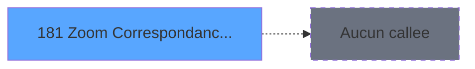

# VIL IDE 181 - Zoom Correspondance Article

> **Analyse**: Phases 1-4 2026-02-03 20:54 -> 20:55 (18s) | Assemblage 20:55
> **Pipeline**: V7.2 Enrichi
> **Structure**: 4 onglets (Resume | Ecrans | Donnees | Connexions)

<!-- TAB:Resume -->

## 1. FICHE D'IDENTITE

| Attribut | Valeur |
|----------|--------|
| Projet | VIL |
| IDE Position | 181 |
| Nom Programme | Zoom Correspondance Article |
| Fichier source | `Prg_181.xml` |
| Dossier IDE | Zooms |
| Taches | 1 (1 ecrans visibles) |
| Tables modifiees | 0 |
| Programmes appeles | 0 |

## 2. DESCRIPTION FONCTIONNELLE

**Zoom Correspondance Article** assure la gestion complete de ce processus, accessible depuis [CV  Mise à jour base articles (IDE 153)](VIL-IDE-153.md), [CV  Mise à jour base articles* (IDE 198)](VIL-IDE-198.md), [CV  Mise à jour base articles (IDE 200)](VIL-IDE-200.md), [CV  Mise à jour base articles (IDE 208)](VIL-IDE-208.md).

Le flux de traitement s'organise en **1 blocs fonctionnels** :

- **Traitement** (1 tache) : traitements metier divers

## 3. BLOCS FONCTIONNELS

### 3.1 Traitement (1 tache)

Traitements internes.

---

#### 181 - Correspondance articles [[ECRAN]](#ecran-t1)

**Role** : Traitement : Correspondance articles.
**Ecran** : 584 x 184 DLU (MDI) | [Voir mockup](#ecran-t1)

## 5. REGLES METIER

*(Aucune regle metier identifiee)*

## 6. CONTEXTE

- **Appele par**: [CV  Mise à jour base articles (IDE 153)](VIL-IDE-153.md), [CV  Mise à jour base articles* (IDE 198)](VIL-IDE-198.md), [CV  Mise à jour base articles (IDE 200)](VIL-IDE-200.md), [CV  Mise à jour base articles (IDE 208)](VIL-IDE-208.md)
- **Appelle**: 0 programmes | **Tables**: 1 (W:0 R:1 L:0) | **Taches**: 1 | **Expressions**: 2

<!-- TAB:Ecrans -->

## 8. ECRANS

### 8.1 Forms visibles (1 / 1)

| # | Position | Tache | Nom | Type | Largeur | Hauteur | Bloc |
|---|----------|-------|-----|------|---------|---------|------|
| 1 | 181 | 181 | Correspondance articles | MDI | 584 | 184 | Traitement |

### 8.2 Mockups Ecrans

---

#### 181 - Correspondance articles
**Tache** : [181](#t1) | **Type** : MDI | **Dimensions** : 584 x 184 DLU
**Bloc** : Traitement | **Titre IDE** : Correspondance articles

<!-- FORM-DATA:
{
    "width":  584,
    "vFactor":  8,
    "type":  "MDI",
    "hFactor":  8,
    "controls":  [
                     {
                         "x":  48,
                         "type":  "label",
                         "var":  "",
                         "y":  5,
                         "w":  488,
                         "fmt":  "",
                         "name":  "",
                         "h":  121,
                         "color":  "",
                         "text":  "",
                         "parent":  null
                     },
                     {
                         "x":  68,
                         "type":  "table",
                         "var":  "",
                         "name":  "",
                         "titleH":  12,
                         "color":  "177",
                         "w":  454,
                         "y":  24,
                         "fmt":  "",
                         "parent":  null,
                         "text":  "",
                         "rowH":  14,
                         "h":  98,
                         "cols":  [
                                      {
                                          "title":  "Code datagram",
                                          "layer":  1,
                                          "w":  245
                                      },
                                      {
                                          "title":  "Libellé",
                                          "layer":  2,
                                          "w":  178
                                      }
                                  ],
                         "rows":  2
                     },
                     {
                         "x":  69,
                         "type":  "label",
                         "var":  "",
                         "y":  24,
                         "w":  135,
                         "fmt":  "",
                         "name":  "",
                         "h":  13,
                         "color":  "7",
                         "text":  "Code Datagram",
                         "parent":  2
                     },
                     {
                         "x":  218,
                         "type":  "label",
                         "var":  "",
                         "y":  24,
                         "w":  124,
                         "fmt":  "",
                         "name":  "",
                         "h":  13,
                         "color":  "7",
                         "text":  "Code PMS",
                         "parent":  null
                     },
                     {
                         "x":  330,
                         "type":  "label",
                         "var":  "",
                         "y":  24,
                         "w":  158,
                         "fmt":  "",
                         "name":  "",
                         "h":  13,
                         "color":  "7",
                         "text":  "Libelle",
                         "parent":  2
                     },
                     {
                         "x":  0,
                         "type":  "label",
                         "var":  "",
                         "y":  159,
                         "w":  580,
                         "fmt":  "",
                         "name":  "",
                         "h":  24,
                         "color":  "",
                         "text":  "",
                         "parent":  null
                     },
                     {
                         "x":  82,
                         "type":  "edit",
                         "var":  "",
                         "y":  40,
                         "w":  75,
                         "fmt":  "",
                         "name":  "",
                         "h":  8,
                         "color":  "177",
                         "text":  "",
                         "parent":  2
                     },
                     {
                         "x":  189,
                         "type":  "edit",
                         "var":  "",
                         "y":  40,
                         "w":  75,
                         "fmt":  "",
                         "name":  "",
                         "h":  8,
                         "color":  "177",
                         "text":  "",
                         "parent":  2
                     },
                     {
                         "x":  334,
                         "type":  "edit",
                         "var":  "",
                         "y":  40,
                         "w":  98,
                         "fmt":  "",
                         "name":  "",
                         "h":  8,
                         "color":  "177",
                         "text":  "",
                         "parent":  2
                     },
                     {
                         "x":  7,
                         "type":  "button",
                         "var":  "",
                         "y":  162,
                         "w":  160,
                         "fmt":  "\u0026Quitter",
                         "name":  "",
                         "h":  18,
                         "color":  "",
                         "text":  "",
                         "parent":  null
                     },
                     {
                         "x":  261,
                         "type":  "image",
                         "var":  "",
                         "y":  133,
                         "w":  58,
                         "fmt":  "",
                         "name":  "",
                         "h":  18,
                         "color":  "",
                         "text":  "",
                         "parent":  null
                     }
                 ],
    "taskId":  "181",
    "height":  184
}
-->

<strong>Champs : 3 champs</strong>

| Pos (x,y) | Nom | Variable | Type |
|-----------|-----|----------|------|
| 82,40 | (sans nom) | - | edit |
| 189,40 | (sans nom) | - | edit |
| 334,40 | (sans nom) | - | edit |

<strong>Boutons : 1 boutons</strong>

| Bouton | Pos (x,y) | Action |
|--------|-----------|--------|
| Quitter | 7,162 | Quitte le programme |

## 9. NAVIGATION

Ecran unique: **Correspondance articles**

### 9.3 Structure hierarchique (1 tache)

| Position | Tache | Type | Dimensions | Bloc |
|----------|-------|------|------------|------|
| **181.1** | [**Correspondance articles** (181)](#t1) [mockup](#ecran-t1) | MDI | 584x184 | Traitement |

### 9.4 Algorigramme

> **Legende**: Vert = START/END OK | Rouge = END KO | Bleu = Decisions
> *Algorigramme auto-genere. Utiliser `/algorigramme` pour une synthese metier detaillee.*

<!-- TAB:Donnees -->

## 10. TABLES

### Tables utilisees (1)

| ID | Nom | Description | Type | R | W | L | Usages |
|----|-----|-------------|------|---|---|---|--------|
| 279 | correspondance_article | Articles et stock | DB | R |   |   | 1 |

### Colonnes par table (1 / 1 tables avec colonnes identifiees)

Table 279 - correspondance_article (R) - 1 usages

| Lettre | Variable | Acces | Type |
|--------|----------|-------|------|
| A | > code datagram | R | Numeric |
| B | v. passage | R | Logical |

## 11. VARIABLES

### 11.1 Variables de session (1)

Variables persistantes pendant toute la session.

| Lettre | Nom | Type | Usage dans |
|--------|-----|------|-----------|
| B | v. passage | Logical | - |

### 11.2 Autres (1)

Variables diverses.

| Lettre | Nom | Type | Usage dans |
|--------|-----|------|-----------|
| A | > code datagram | Numeric | 1x refs |

## 12. EXPRESSIONS

**2 / 2 expressions decodees (100%)**

### 12.1 Repartition par type

| Type | Expressions | Regles |
|------|-------------|--------|
| CONDITION | 1 | 0 |
| CAST_LOGIQUE | 1 | 0 |

### 12.2 Expressions cles par type

#### CONDITION (1 expressions)

| Type | IDE | Expression | Regle |
|------|-----|------------|-------|
| CONDITION | 1 | `> code datagram [A]` | - |

#### CAST_LOGIQUE (1 expressions)

| Type | IDE | Expression | Regle |
|------|-----|------------|-------|
| CAST_LOGIQUE | 2 | `'TRUE'LOG` | - |

<!-- TAB:Connexions -->

## 13. GRAPHE D'APPELS

### 13.1 Chaine depuis Main (Callers)

Main -> ... -> [CV  Mise à jour base articles (IDE 153)](VIL-IDE-153.md) -> **Zoom Correspondance Article (IDE 181)**

Main -> ... -> [CV  Mise à jour base articles* (IDE 198)](VIL-IDE-198.md) -> **Zoom Correspondance Article (IDE 181)**

Main -> ... -> [CV  Mise à jour base articles (IDE 200)](VIL-IDE-200.md) -> **Zoom Correspondance Article (IDE 181)**

Main -> ... -> [CV  Mise à jour base articles (IDE 208)](VIL-IDE-208.md) -> **Zoom Correspondance Article (IDE 181)**

### 13.2 Callers

| IDE | Nom Programme | Nb Appels |
|-----|---------------|-----------|
| [153](VIL-IDE-153.md) | CV  Mise à jour base articles | 1 |
| [198](VIL-IDE-198.md) | CV  Mise à jour base articles* | 1 |
| [200](VIL-IDE-200.md) | CV  Mise à jour base articles | 1 |
| [208](VIL-IDE-208.md) | CV  Mise à jour base articles | 1 |

### 13.3 Callees (programmes appeles)

### 13.4 Detail Callees avec contexte

| IDE | Nom Programme | Appels | Contexte |
|-----|---------------|--------|----------|
| - | (aucun) | - | - |

## 14. RECOMMANDATIONS MIGRATION

### 14.1 Profil du programme

| Metrique | Valeur | Impact migration |
|----------|--------|-----------------|
| Lignes de logique | 9 | Programme compact |
| Expressions | 2 | Peu de logique |
| Tables WRITE | 0 | Impact faible |
| Sous-programmes | 0 | Peu de dependances |
| Ecrans visibles | 1 | Ecran unique ou traitement batch |
| Code desactive | 0% (0 / 9) | Code sain |
| Regles metier | 0 | Pas de regle identifiee |

### 14.2 Plan de migration par bloc

#### Traitement (1 tache: 1 ecran, 0 traitement)

- **Strategie** : 1 composant(s) UI (Razor/React) avec formulaires et validation.
- Decomposer les taches en services unitaires testables.

### 14.3 Dependances critiques

| Dependance | Type | Appels | Impact |
|------------|------|--------|--------|

---
*Spec DETAILED generee par Pipeline V7.2 - 2026-02-03 20:55*
