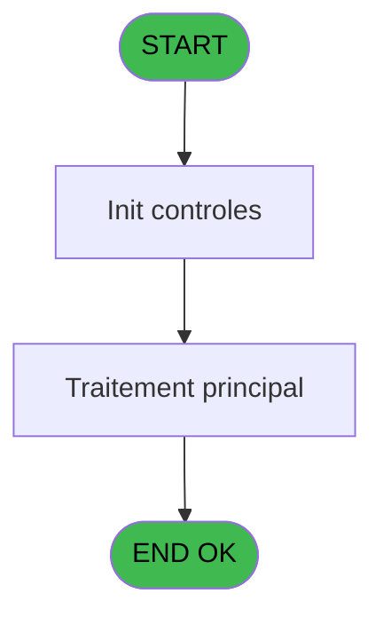
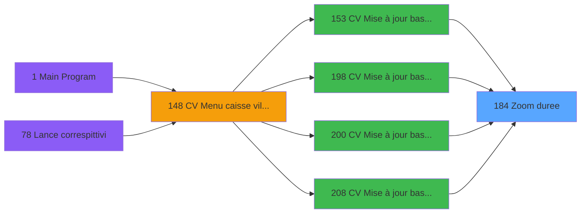
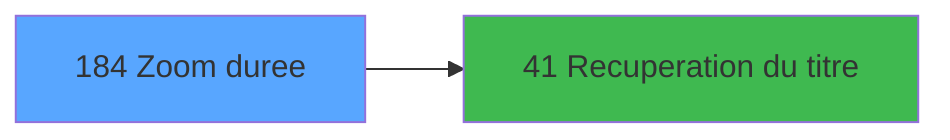

# VIL IDE 184 - Zoom duree

> **Analyse**: Phases 1-4 2026-02-03 20:56 -> 20:56 (17s) | Assemblage 20:56
> **Pipeline**: V7.2 Enrichi
> **Structure**: 4 onglets (Resume | Ecrans | Donnees | Connexions)

<!-- TAB:Resume -->

## 1. FICHE D'IDENTITE

| Attribut | Valeur |
|----------|--------|
| Projet | VIL |
| IDE Position | 184 |
| Nom Programme | Zoom duree |
| Fichier source | `Prg_184.xml` |
| Dossier IDE | Zooms |
| Taches | 1 (1 ecrans visibles) |
| Tables modifiees | 0 |
| Programmes appeles | 1 |

## 2. DESCRIPTION FONCTIONNELLE

**Zoom duree** assure la gestion complete de ce processus, accessible depuis [CV  Mise à jour base articles (IDE 153)](VIL-IDE-153.md), [CV  Mise à jour base articles* (IDE 198)](VIL-IDE-198.md), [CV  Mise à jour base articles (IDE 200)](VIL-IDE-200.md), [CV  Mise à jour base articles (IDE 208)](VIL-IDE-208.md).

Le flux de traitement s'organise en **1 blocs fonctionnels** :

- **Consultation** (1 tache) : ecrans de recherche, selection et consultation

## 3. BLOCS FONCTIONNELS

### 3.1 Consultation (1 tache)

Ecrans de recherche et consultation.

---

#### 184 - Zoom duree [[ECRAN]](#ecran-t1)

**Role** : Selection par l'operateur : Zoom duree.
**Ecran** : 560 x 192 DLU (MDI) | [Voir mockup](#ecran-t1)
**Variables liees** : A (Param duree)

## 5. REGLES METIER

*(Aucune regle metier identifiee)*

## 6. CONTEXTE

- **Appele par**: [CV  Mise à jour base articles (IDE 153)](VIL-IDE-153.md), [CV  Mise à jour base articles* (IDE 198)](VIL-IDE-198.md), [CV  Mise à jour base articles (IDE 200)](VIL-IDE-200.md), [CV  Mise à jour base articles (IDE 208)](VIL-IDE-208.md)
- **Appelle**: 1 programmes | **Tables**: 1 (W:0 R:1 L:0) | **Taches**: 1 | **Expressions**: 5

<!-- TAB:Ecrans -->

## 8. ECRANS

### 8.1 Forms visibles (1 / 1)

| # | Position | Tache | Nom | Type | Largeur | Hauteur | Bloc |
|---|----------|-------|-----|------|---------|---------|------|
| 1 | 184 | 184 | Zoom duree | MDI | 560 | 192 | Consultation |

### 8.2 Mockups Ecrans

---

#### 184 - Zoom duree
**Tache** : [184](#t1) | **Type** : MDI | **Dimensions** : 560 x 192 DLU
**Bloc** : Consultation | **Titre IDE** : Zoom duree

<!-- FORM-DATA:
{
    "width":  560,
    "vFactor":  8,
    "type":  "MDI",
    "hFactor":  8,
    "controls":  [
                     {
                         "x":  88,
                         "type":  "table",
                         "var":  "",
                         "name":  "",
                         "titleH":  12,
                         "color":  "196",
                         "w":  382,
                         "y":  3,
                         "fmt":  "",
                         "parent":  null,
                         "text":  "",
                         "rowH":  13,
                         "h":  145,
                         "cols":  [
                                      {
                                          "title":  "Durée",
                                          "layer":  1,
                                          "w":  99
                                      },
                                      {
                                          "title":  "Libellé",
                                          "layer":  2,
                                          "w":  250
                                      }
                                  ],
                         "rows":  2
                     },
                     {
                         "x":  5,
                         "type":  "label",
                         "var":  "",
                         "y":  171,
                         "w":  551,
                         "fmt":  "",
                         "name":  "",
                         "h":  19,
                         "color":  "",
                         "text":  "",
                         "parent":  null
                     },
                     {
                         "x":  93,
                         "type":  "edit",
                         "var":  "",
                         "y":  16,
                         "w":  72,
                         "fmt":  "",
                         "name":  "",
                         "h":  11,
                         "color":  "196",
                         "text":  "",
                         "parent":  1
                     },
                     {
                         "x":  194,
                         "type":  "edit",
                         "var":  "",
                         "y":  16,
                         "w":  185,
                         "fmt":  "",
                         "name":  "",
                         "h":  11,
                         "color":  "196",
                         "text":  "",
                         "parent":  1
                     },
                     {
                         "x":  384,
                         "type":  "edit",
                         "var":  "",
                         "y":  16,
                         "w":  14,
                         "fmt":  "",
                         "name":  "",
                         "h":  11,
                         "color":  "196",
                         "text":  "",
                         "parent":  1
                     },
                     {
                         "x":  13,
                         "type":  "button",
                         "var":  "",
                         "y":  173,
                         "w":  120,
                         "fmt":  "\u0026Select",
                         "name":  "Select",
                         "h":  14,
                         "color":  "",
                         "text":  "",
                         "parent":  null
                     },
                     {
                         "x":  428,
                         "type":  "button",
                         "var":  "",
                         "y":  173,
                         "w":  120,
                         "fmt":  "A\u0026bandon",
                         "name":  "Abandon",
                         "h":  14,
                         "color":  "",
                         "text":  "",
                         "parent":  null
                     },
                     {
                         "x":  251,
                         "type":  "image",
                         "var":  "",
                         "y":  151,
                         "w":  58,
                         "fmt":  "",
                         "name":  "",
                         "h":  18,
                         "color":  "",
                         "text":  "",
                         "parent":  null
                     }
                 ],
    "taskId":  "184",
    "height":  192
}
-->

<strong>Champs : 3 champs</strong>

| Pos (x,y) | Nom | Variable | Type |
|-----------|-----|----------|------|
| 93,16 | (sans nom) | - | edit |
| 194,16 | (sans nom) | - | edit |
| 384,16 | (sans nom) | - | edit |

<strong>Boutons : 2 boutons</strong>

| Bouton | Pos (x,y) | Action |
|--------|-----------|--------|
| Select | 13,173 | Ouvre la selection |
| Abandon | 428,173 | Annule et retour au menu |

## 9. NAVIGATION

Ecran unique: **Zoom duree**

### 9.3 Structure hierarchique (1 tache)

| Position | Tache | Type | Dimensions | Bloc |
|----------|-------|------|------------|------|
| **184.1** | [**Zoom duree** (184)](#t1) [mockup](#ecran-t1) | MDI | 560x192 | Consultation |

### 9.4 Algorigramme

> **Legende**: Vert = START/END OK | Rouge = END KO | Bleu = Decisions
> *Algorigramme auto-genere. Utiliser `/algorigramme` pour une synthese metier detaillee.*

<!-- TAB:Donnees -->

## 10. TABLES

### Tables utilisees (1)

| ID | Nom | Description | Type | R | W | L | Usages |
|----|-----|-------------|------|---|---|---|--------|
| 461 | trf_transfert_new |  | DB | R |   |   | 1 |

### Colonnes par table (1 / 1 tables avec colonnes identifiees)

Table 461 - trf_transfert_new (R) - 1 usages

| Lettre | Variable | Acces | Type |
|--------|----------|-------|------|
| A | Param duree | R | Numeric |
| B | titre | R | Alpha |

## 11. VARIABLES

### 11.1 Autres (2)

Variables diverses.

| Lettre | Nom | Type | Usage dans |
|--------|-----|------|-----------|
| A | Param duree | Numeric | - |
| B | titre | Alpha | - |

## 12. EXPRESSIONS

**5 / 5 expressions decodees (100%)**

### 12.1 Repartition par type

| Type | Expressions | Regles |
|------|-------------|--------|
| CONSTANTE | 1 | 0 |
| OTHER | 2 | 0 |
| CONDITION | 1 | 0 |
| STRING | 1 | 0 |

### 12.2 Expressions cles par type

#### CONSTANTE (1 expressions)

| Type | IDE | Expression | Regle |
|------|-----|------------|-------|
| CONSTANTE | 3 | `237` | - |

#### OTHER (2 expressions)

| Type | IDE | Expression | Regle |
|------|-----|------------|-------|
| OTHER | 2 | `[C]` | - |
| OTHER | 1 | `GetParam ('CODELANGUE')` | - |

#### CONDITION (1 expressions)

| Type | IDE | Expression | Regle |
|------|-----|------------|-------|
| CONDITION | 5 | `[C]<>99` | - |

#### STRING (1 expressions)

| Type | IDE | Expression | Regle |
|------|-----|------------|-------|
| STRING | 4 | `Trim ([F])` | - |

<!-- TAB:Connexions -->

## 13. GRAPHE D'APPELS

### 13.1 Chaine depuis Main (Callers)

Main -> ... -> [CV  Mise à jour base articles (IDE 153)](VIL-IDE-153.md) -> **Zoom duree (IDE 184)**

Main -> ... -> [CV  Mise à jour base articles* (IDE 198)](VIL-IDE-198.md) -> **Zoom duree (IDE 184)**

Main -> ... -> [CV  Mise à jour base articles (IDE 200)](VIL-IDE-200.md) -> **Zoom duree (IDE 184)**

Main -> ... -> [CV  Mise à jour base articles (IDE 208)](VIL-IDE-208.md) -> **Zoom duree (IDE 184)**

### 13.2 Callers

| IDE | Nom Programme | Nb Appels |
|-----|---------------|-----------|
| [153](VIL-IDE-153.md) | CV  Mise à jour base articles | 1 |
| [198](VIL-IDE-198.md) | CV  Mise à jour base articles* | 1 |
| [200](VIL-IDE-200.md) | CV  Mise à jour base articles | 1 |
| [208](VIL-IDE-208.md) | CV  Mise à jour base articles | 1 |

### 13.3 Callees (programmes appeles)

### 13.4 Detail Callees avec contexte

| IDE | Nom Programme | Appels | Contexte |
|-----|---------------|--------|----------|
| [41](VIL-IDE-41.md) | Recuperation du titre | 1 | Recuperation donnees |

## 14. RECOMMANDATIONS MIGRATION

### 14.1 Profil du programme

| Metrique | Valeur | Impact migration |
|----------|--------|-----------------|
| Lignes de logique | 11 | Programme compact |
| Expressions | 5 | Peu de logique |
| Tables WRITE | 0 | Impact faible |
| Sous-programmes | 1 | Peu de dependances |
| Ecrans visibles | 1 | Ecran unique ou traitement batch |
| Code desactive | 0% (0 / 11) | Code sain |
| Regles metier | 0 | Pas de regle identifiee |

### 14.2 Plan de migration par bloc

#### Consultation (1 tache: 1 ecran, 0 traitement)

- **Strategie** : Composants de recherche/selection en modales.
- 1 ecran : Zoom duree

### 14.3 Dependances critiques

| Dependance | Type | Appels | Impact |
|------------|------|--------|--------|
| [Recuperation du titre (IDE 41)](VIL-IDE-41.md) | Sous-programme | 1x | Normale - Recuperation donnees |

---
*Spec DETAILED generee par Pipeline V7.2 - 2026-02-03 20:56*
