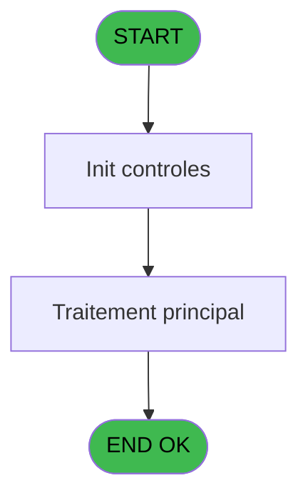
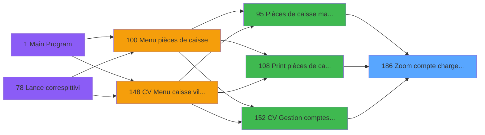
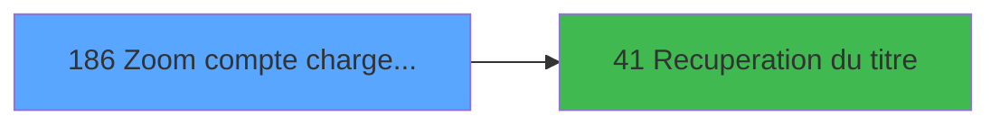

# VIL IDE 186 - Zoom compte charge 246

> **Analyse**: Phases 1-4 2026-02-03 20:56 -> 20:57 (18s) | Assemblage 20:57
> **Pipeline**: V7.2 Enrichi
> **Structure**: 4 onglets (Resume | Ecrans | Donnees | Connexions)

<!-- TAB:Resume -->

## 1. FICHE D'IDENTITE

| Attribut | Valeur |
|----------|--------|
| Projet | VIL |
| IDE Position | 186 |
| Nom Programme | Zoom compte charge 246 |
| Fichier source | `Prg_186.xml` |
| Dossier IDE | Zooms |
| Taches | 1 (1 ecrans visibles) |
| Tables modifiees | 0 |
| Programmes appeles | 1 |

## 2. DESCRIPTION FONCTIONNELLE

**Zoom compte charge 246** assure la gestion complete de ce processus, accessible depuis [Pièces de caisse manuelles (IDE 95)](VIL-IDE-95.md), [Print pièces de caisse / imput (IDE 108)](VIL-IDE-108.md), [CV  Gestion comptes recette (IDE 152)](VIL-IDE-152.md).

Le flux de traitement s'organise en **1 blocs fonctionnels** :

- **Calcul** (1 tache) : calculs de montants, stocks ou compteurs

**Logique metier** : 1 regles identifiees couvrant conditions metier.

## 3. BLOCS FONCTIONNELS

### 3.1 Calcul (1 tache)

Calculs metier : montants, stocks, compteurs.

---

#### 186 - Zoom compte charge 246 [[ECRAN]](#ecran-t1)

**Role** : Selection par l'operateur : Zoom compte charge 246.
**Ecran** : 640 x 0 DLU (MDI) | [Voir mockup](#ecran-t1)

## 5. REGLES METIER

1 regles identifiees:

### Autres (1 regles)

#### [RM-001] Si GetParam ('CODELANGUE')='FRA' alors [M] sinon [N])

| Element | Detail |
|---------|--------|
| **Condition** | `GetParam ('CODELANGUE')='FRA'` |
| **Si vrai** | [M] |
| **Si faux** | [N]) |
| **Expression source** | Expression 11 : `IF (GetParam ('CODELANGUE')='FRA',[M],[N])` |
| **Exemple** | Si GetParam ('CODELANGUE')='FRA' → [M]. Sinon → [N]) |

## 6. CONTEXTE

- **Appele par**: [Pièces de caisse manuelles (IDE 95)](VIL-IDE-95.md), [Print pièces de caisse / imput (IDE 108)](VIL-IDE-108.md), [CV  Gestion comptes recette (IDE 152)](VIL-IDE-152.md)
- **Appelle**: 1 programmes | **Tables**: 2 (W:0 R:1 L:1) | **Taches**: 1 | **Expressions**: 11

<!-- TAB:Ecrans -->

## 8. ECRANS

### 8.1 Forms visibles (1 / 1)

| # | Position | Tache | Nom | Type | Largeur | Hauteur | Bloc |
|---|----------|-------|-----|------|---------|---------|------|
| 1 | 186 | 186 | Zoom compte charge 246 | MDI | 640 | 0 | Calcul |

### 8.2 Mockups Ecrans

---

#### 186 - Zoom compte charge 246
**Tache** : [186](#t1) | **Type** : MDI | **Dimensions** : 640 x 0 DLU
**Bloc** : Calcul | **Titre IDE** : Zoom compte charge 246

<!-- FORM-DATA:
{
    "width":  640,
    "vFactor":  8,
    "type":  "MDI",
    "hFactor":  8,
    "controls":  [
                     {
                         "x":  5,
                         "type":  "label",
                         "var":  "",
                         "y":  181,
                         "w":  631,
                         "fmt":  "",
                         "name":  "",
                         "h":  19,
                         "color":  "",
                         "text":  "",
                         "parent":  null
                     },
                     {
                         "x":  41,
                         "type":  "table",
                         "var":  "",
                         "name":  "",
                         "titleH":  12,
                         "color":  "196",
                         "w":  558,
                         "y":  2,
                         "fmt":  "",
                         "parent":  null,
                         "text":  "",
                         "rowH":  11,
                         "h":  146,
                         "cols":  [
                                      {
                                          "title":  "Service",
                                          "layer":  1,
                                          "w":  94
                                      },
                                      {
                                          "title":  "Imputation",
                                          "layer":  2,
                                          "w":  167
                                      },
                                      {
                                          "title":  "S/Imp",
                                          "layer":  3,
                                          "w":  69
                                      },
                                      {
                                          "title":  "Libellé",
                                          "layer":  4,
                                          "w":  195
                                      },
                                      {
                                          "title":  "",
                                          "layer":  5,
                                          "w":  1
                                      }
                                  ],
                         "rows":  5
                     },
                     {
                         "x":  293,
                         "type":  "image",
                         "var":  "",
                         "y":  161,
                         "w":  58,
                         "fmt":  "",
                         "name":  "",
                         "h":  18,
                         "color":  "",
                         "text":  "",
                         "parent":  null
                     },
                     {
                         "x":  12,
                         "type":  "button",
                         "var":  "",
                         "y":  184,
                         "w":  120,
                         "fmt":  "Abandon",
                         "name":  "Abandon",
                         "h":  14,
                         "color":  "",
                         "text":  "",
                         "parent":  null
                     },
                     {
                         "x":  509,
                         "type":  "button",
                         "var":  "",
                         "y":  184,
                         "w":  120,
                         "fmt":  "Select",
                         "name":  "Select",
                         "h":  14,
                         "color":  "",
                         "text":  "",
                         "parent":  null
                     },
                     {
                         "x":  46,
                         "type":  "edit",
                         "var":  "",
                         "y":  152,
                         "w":  553,
                         "fmt":  "128",
                         "name":  "",
                         "h":  8,
                         "color":  "",
                         "text":  "",
                         "parent":  null
                     },
                     {
                         "x":  46,
                         "type":  "edit",
                         "var":  "",
                         "y":  15,
                         "w":  72,
                         "fmt":  "",
                         "name":  "cha_service_village",
                         "h":  10,
                         "color":  "196",
                         "text":  "",
                         "parent":  33
                     },
                     {
                         "x":  147,
                         "type":  "edit",
                         "var":  "",
                         "y":  15,
                         "w":  150,
                         "fmt":  "",
                         "name":  "IMPUTATION ALPHA",
                         "h":  10,
                         "color":  "196",
                         "text":  "",
                         "parent":  33
                     },
                     {
                         "x":  312,
                         "type":  "edit",
                         "var":  "",
                         "y":  15,
                         "w":  40,
                         "fmt":  "",
                         "name":  "cha_sous_imputation",
                         "h":  10,
                         "color":  "196",
                         "text":  "",
                         "parent":  33
                     },
                     {
                         "x":  379,
                         "type":  "edit",
                         "var":  "",
                         "y":  15,
                         "w":  182,
                         "fmt":  "64",
                         "name":  "cha_libelle",
                         "h":  10,
                         "color":  "196",
                         "text":  "",
                         "parent":  33
                     }
                 ],
    "taskId":  "186",
    "height":  0
}
-->

<strong>Champs : 5 champs</strong>

| Pos (x,y) | Nom | Variable | Type |
|-----------|-----|----------|------|
| 46,152 | 128 | - | edit |
| 46,15 | cha_service_village | - | edit |
| 147,15 | IMPUTATION ALPHA | - | edit |
| 312,15 | cha_sous_imputation | - | edit |
| 379,15 | cha_libelle | - | edit |

<strong>Boutons : 2 boutons</strong>

| Bouton | Pos (x,y) | Action |
|--------|-----------|--------|
| Abandon | 12,184 | Annule et retour au menu |
| Select | 509,184 | Ouvre la selection |

## 9. NAVIGATION

Ecran unique: **Zoom compte charge 246**

### 9.3 Structure hierarchique (1 tache)

| Position | Tache | Type | Dimensions | Bloc |
|----------|-------|------|------------|------|
| **186.1** | [**Zoom compte charge 246** (186)](#t1) [mockup](#ecran-t1) | MDI | 640x0 | Calcul |

### 9.4 Algorigramme

> **Legende**: Vert = START/END OK | Rouge = END KO | Bleu = Decisions
> *Algorigramme auto-genere. Utiliser `/algorigramme` pour une synthese metier detaillee.*

<!-- TAB:Donnees -->

## 10. TABLES

### Tables utilisees (2)

| ID | Nom | Description | Type | R | W | L | Usages |
|----|-----|-------------|------|---|---|---|--------|
| 209 | plan_comptable_central |  | DB | R |   |   | 1 |
| 226 | comptes_charge | Comptes GM (generaux) | DB |   |   | L | 1 |

### Colonnes par table (1 / 1 tables avec colonnes identifiees)

Table 209 - plan_comptable_central (R) - 1 usages

| Lettre | Variable | Acces | Type |
|--------|----------|-------|------|
| A | Param societe | R | Alpha |
| B | Param imputation | R | Numeric |
| C | Param sous imputation | R | Numeric |
| D | Param libelle | R | Alpha |
| E | IMPUTATION ALPHA | R | Alpha |
| F | titre | R | Alpha |

## 11. VARIABLES

### 11.1 Autres (6)

Variables diverses.

| Lettre | Nom | Type | Usage dans |
|--------|-----|------|-----------|
| A | Param societe | Alpha | 1x refs |
| B | Param imputation | Numeric | 1x refs |
| C | Param sous imputation | Numeric | - |
| D | Param libelle | Alpha | - |
| E | IMPUTATION ALPHA | Alpha | - |
| F | titre | Alpha | - |

## 12. EXPRESSIONS

**11 / 11 expressions decodees (100%)**

### 12.1 Repartition par type

| Type | Expressions | Regles |
|------|-------------|--------|
| CONDITION | 1 | 5 |
| CONSTANTE | 1 | 0 |
| OTHER | 4 | 0 |
| STRING | 5 | 0 |

### 12.2 Expressions cles par type

#### CONDITION (1 expressions)

| Type | IDE | Expression | Regle |
|------|-----|------------|-------|
| CONDITION | 11 | `IF (GetParam ('CODELANGUE')='FRA',[M],[N])` | [RM-001](#rm-RM-001) |

#### CONSTANTE (1 expressions)

| Type | IDE | Expression | Regle |
|------|-----|------------|-------|
| CONSTANTE | 9 | `246` | - |

#### OTHER (4 expressions)

| Type | IDE | Expression | Regle |
|------|-----|------------|-------|
| OTHER | 7 | `[H]` | - |
| OTHER | 8 | `[I]` | - |
| OTHER | 1 | `Param societe [A]` | - |
| OTHER | 6 | `[G]` | - |

#### STRING (5 expressions)

| Type | IDE | Expression | Regle |
|------|-----|------------|-------|
| STRING | 5 | `Val (Left (Trim (Str (Param imputation [B],'10'))&'0000000000',9),'9')` | - |
| STRING | 10 | `Trim ([O])` | - |
| STRING | 4 | `Str ([G],'9P0')` | - |
| STRING | 2 | `Val (Left (Trim (Str ([G],'10')),6),'6')` | - |
| STRING | 3 | `Val (MID (Trim (Str ([G],'10')),7,3),'3')` | - |

<!-- TAB:Connexions -->

## 13. GRAPHE D'APPELS

### 13.1 Chaine depuis Main (Callers)

Main -> ... -> [Pièces de caisse manuelles (IDE 95)](VIL-IDE-95.md) -> **Zoom compte charge 246 (IDE 186)**

Main -> ... -> [Print pièces de caisse / imput (IDE 108)](VIL-IDE-108.md) -> **Zoom compte charge 246 (IDE 186)**

Main -> ... -> [CV  Gestion comptes recette (IDE 152)](VIL-IDE-152.md) -> **Zoom compte charge 246 (IDE 186)**

### 13.2 Callers

| IDE | Nom Programme | Nb Appels |
|-----|---------------|-----------|
| [95](VIL-IDE-95.md) | Pièces de caisse manuelles | 1 |
| [108](VIL-IDE-108.md) | Print pièces de caisse / imput | 1 |
| [152](VIL-IDE-152.md) | CV  Gestion comptes recette | 1 |

### 13.3 Callees (programmes appeles)

### 13.4 Detail Callees avec contexte

| IDE | Nom Programme | Appels | Contexte |
|-----|---------------|--------|----------|
| [41](VIL-IDE-41.md) | Recuperation du titre | 1 | Recuperation donnees |

## 14. RECOMMANDATIONS MIGRATION

### 14.1 Profil du programme

| Metrique | Valeur | Impact migration |
|----------|--------|-----------------|
| Lignes de logique | 26 | Programme compact |
| Expressions | 11 | Peu de logique |
| Tables WRITE | 0 | Impact faible |
| Sous-programmes | 1 | Peu de dependances |
| Ecrans visibles | 1 | Ecran unique ou traitement batch |
| Code desactive | 0% (0 / 26) | Code sain |
| Regles metier | 1 | Quelques regles a preserver |

### 14.2 Plan de migration par bloc

#### Calcul (1 tache: 1 ecran, 0 traitement)

- **Strategie** : Services de calcul purs (Domain Services).
- Migrer la logique de calcul (stock, compteurs, montants)

### 14.3 Dependances critiques

| Dependance | Type | Appels | Impact |
|------------|------|--------|--------|
| [Recuperation du titre (IDE 41)](VIL-IDE-41.md) | Sous-programme | 1x | Normale - Recuperation donnees |

---
*Spec DETAILED generee par Pipeline V7.2 - 2026-02-03 20:57*
