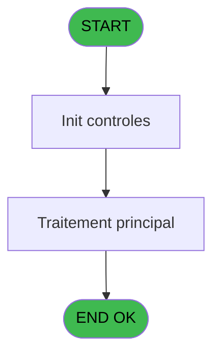
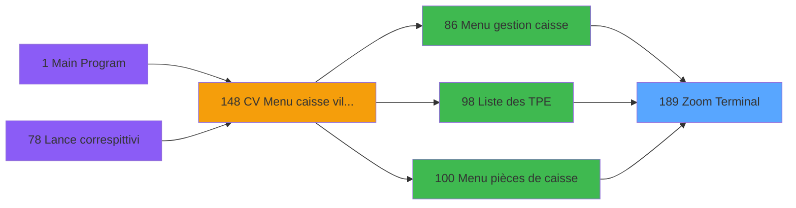
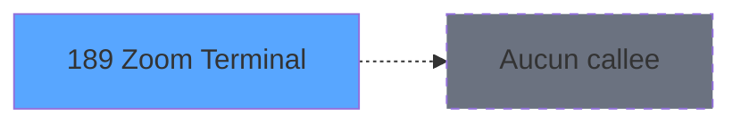

# VIL IDE 189 - Zoom Terminal

> **Analyse**: Phases 1-4 2026-02-03 20:58 -> 20:58 (17s) | Assemblage 20:58
> **Pipeline**: V7.2 Enrichi
> **Structure**: 4 onglets (Resume | Ecrans | Donnees | Connexions)

<!-- TAB:Resume -->

## 1. FICHE D'IDENTITE

| Attribut | Valeur |
|----------|--------|
| Projet | VIL |
| IDE Position | 189 |
| Nom Programme | Zoom Terminal |
| Fichier source | `Prg_189.xml` |
| Dossier IDE | Zooms |
| Taches | 1 (1 ecrans visibles) |
| Tables modifiees | 0 |
| Programmes appeles | 0 |

## 2. DESCRIPTION FONCTIONNELLE

**Zoom Terminal** assure la gestion complete de ce processus, accessible depuis [Menu gestion caisse (IDE 86)](VIL-IDE-86.md), [Liste des TPE (IDE 98)](VIL-IDE-98.md), [Menu pièces de caisse (IDE 100)](VIL-IDE-100.md).

Le flux de traitement s'organise en **1 blocs fonctionnels** :

- **Consultation** (1 tache) : ecrans de recherche, selection et consultation

**Logique metier** : 1 regles identifiees couvrant conditions metier.

## 3. BLOCS FONCTIONNELS

### 3.1 Consultation (1 tache)

Ecrans de recherche et consultation.

---

#### 189 - Zoom Terminal [[ECRAN]](#ecran-t3)

**Role** : Selection par l'operateur : Zoom Terminal.
**Ecran** : 640 x 224 DLU (MDI) | [Voir mockup](#ecran-t3)
**Variables liees** : A (p. Num Terminal), C (Existe_terminal_IMS)

## 5. REGLES METIER

1 regles identifiees:

### Autres (1 regles)

#### [RM-001] Condition toujours vraie (flag actif)

| Element | Detail |
|---------|--------|
| **Condition** | `[N]` |
| **Si vrai** | Existe_terminal_IMS [C] |
| **Si faux** | 'TRUE'LOG) |
| **Variables** | C (Existe_terminal_IMS) |
| **Expression source** | Expression 3 : `IF([N],Existe_terminal_IMS [C],'TRUE'LOG)` |
| **Exemple** | Si [N] → Existe_terminal_IMS [C]. Sinon → 'TRUE'LOG) |

## 6. CONTEXTE

- **Appele par**: [Menu gestion caisse (IDE 86)](VIL-IDE-86.md), [Liste des TPE (IDE 98)](VIL-IDE-98.md), [Menu pièces de caisse (IDE 100)](VIL-IDE-100.md)
- **Appelle**: 0 programmes | **Tables**: 2 (W:0 R:1 L:1) | **Taches**: 1 | **Expressions**: 3

<!-- TAB:Ecrans -->

## 8. ECRANS

### 8.1 Forms visibles (1 / 1)

| # | Position | Tache | Nom | Type | Largeur | Hauteur | Bloc |
|---|----------|-------|-----|------|---------|---------|------|
| 1 | 189.1 | 189 | Zoom Terminal | MDI | 640 | 224 | Consultation |

### 8.2 Mockups Ecrans

---

#### 189.1 - Zoom Terminal
**Tache** : [189](#t3) | **Type** : MDI | **Dimensions** : 640 x 224 DLU
**Bloc** : Consultation | **Titre IDE** : Zoom Terminal

<!-- FORM-DATA:
{
    "width":  640,
    "vFactor":  8,
    "type":  "MDI",
    "hFactor":  8,
    "controls":  [
                     {
                         "x":  46,
                         "type":  "table",
                         "var":  "",
                         "name":  "",
                         "titleH":  11,
                         "color":  "196",
                         "w":  549,
                         "y":  12,
                         "fmt":  "",
                         "parent":  null,
                         "text":  "",
                         "rowH":  12,
                         "h":  160,
                         "cols":  [
                                      {
                                          "title":  "N° Terminal",
                                          "layer":  1,
                                          "w":  148
                                      },
                                      {
                                          "title":  "Nom Terminal",
                                          "layer":  2,
                                          "w":  369
                                      }
                                  ],
                         "rows":  2
                     },
                     {
                         "x":  6,
                         "type":  "label",
                         "var":  "",
                         "y":  202,
                         "w":  631,
                         "fmt":  "",
                         "name":  "",
                         "h":  19,
                         "color":  "",
                         "text":  "",
                         "parent":  null
                     },
                     {
                         "x":  54,
                         "type":  "edit",
                         "var":  "",
                         "y":  25,
                         "w":  42,
                         "fmt":  "",
                         "name":  "",
                         "h":  8,
                         "color":  "196",
                         "text":  "",
                         "parent":  1
                     },
                     {
                         "x":  203,
                         "type":  "edit",
                         "var":  "",
                         "y":  25,
                         "w":  344,
                         "fmt":  "",
                         "name":  "",
                         "h":  8,
                         "color":  "196",
                         "text":  "",
                         "parent":  1
                     },
                     {
                         "x":  45,
                         "type":  "button",
                         "var":  "",
                         "y":  204,
                         "w":  120,
                         "fmt":  "Abandon",
                         "name":  "",
                         "h":  14,
                         "color":  "",
                         "text":  "",
                         "parent":  null
                     },
                     {
                         "x":  467,
                         "type":  "button",
                         "var":  "",
                         "y":  204,
                         "w":  120,
                         "fmt":  "Select",
                         "name":  "",
                         "h":  14,
                         "color":  "",
                         "text":  "",
                         "parent":  null
                     },
                     {
                         "x":  291,
                         "type":  "image",
                         "var":  "",
                         "y":  178,
                         "w":  58,
                         "fmt":  "",
                         "name":  "",
                         "h":  18,
                         "color":  "",
                         "text":  "",
                         "parent":  null
                     }
                 ],
    "taskId":  "189.1",
    "height":  224
}
-->

<strong>Champs : 2 champs</strong>

| Pos (x,y) | Nom | Variable | Type |
|-----------|-----|----------|------|
| 54,25 | (sans nom) | - | edit |
| 203,25 | (sans nom) | - | edit |

<strong>Boutons : 2 boutons</strong>

| Bouton | Pos (x,y) | Action |
|--------|-----------|--------|
| Abandon | 45,204 | Annule et retour au menu |
| Select | 467,204 | Ouvre la selection |

## 9. NAVIGATION

Ecran unique: **Zoom Terminal**

### 9.3 Structure hierarchique (1 tache)

| Position | Tache | Type | Dimensions | Bloc |
|----------|-------|------|------------|------|
| **189.1** | [**Zoom Terminal** (189)](#t3) [mockup](#ecran-t3) | MDI | 640x224 | Consultation |

### 9.4 Algorigramme

> **Legende**: Vert = START/END OK | Rouge = END KO | Bleu = Decisions
> *Algorigramme auto-genere. Utiliser `/algorigramme` pour une synthese metier detaillee.*

<!-- TAB:Donnees -->

## 10. TABLES

### Tables utilisees (2)

| ID | Nom | Description | Type | R | W | L | Usages |
|----|-----|-------------|------|---|---|---|--------|
| 24 | imprimante_______prn |  | DB | R |   |   | 1 |
| 259 | tpe_par_service | Services / filieres | DB |   |   | L | 1 |

### Colonnes par table (1 / 1 tables avec colonnes identifiees)

Table 24 - imprimante_______prn (R) - 1 usages

| Lettre | Variable | Acces | Type |
|--------|----------|-------|------|
| A | p. Num Terminal | R | Numeric |
| B | p. Uniquement IMS | R | Logical |
| C | Existe_terminal_IMS | R | Logical |

## 11. VARIABLES

### 11.1 Parametres entrants (2)

Variables recues du programme appelant ([Menu gestion caisse (IDE 86)](VIL-IDE-86.md)).

| Lettre | Nom | Type | Usage dans |
|--------|-----|------|-----------|
| A | p. Num Terminal | Numeric | [189](#t3) |
| B | p. Uniquement IMS | Logical | - |

### 11.2 Autres (1)

Variables diverses.

| Lettre | Nom | Type | Usage dans |
|--------|-----|------|-----------|
| C | Existe_terminal_IMS | Logical | 1x refs |

## 12. EXPRESSIONS

**3 / 3 expressions decodees (100%)**

### 12.1 Repartition par type

| Type | Expressions | Regles |
|------|-------------|--------|
| CAST_LOGIQUE | 1 | 5 |
| OTHER | 2 | 0 |

### 12.2 Expressions cles par type

#### CAST_LOGIQUE (1 expressions)

| Type | IDE | Expression | Regle |
|------|-----|------------|-------|
| CAST_LOGIQUE | 3 | `IF([N],Existe_terminal_IMS [C],'TRUE'LOG)` | [RM-001](#rm-RM-001) |

#### OTHER (2 expressions)

| Type | IDE | Expression | Regle |
|------|-----|------------|-------|
| OTHER | 2 | `p. Num Terminal [A]` | - |
| OTHER | 1 | `[N]` | - |

<!-- TAB:Connexions -->

## 13. GRAPHE D'APPELS

### 13.1 Chaine depuis Main (Callers)

Main -> ... -> [Menu gestion caisse (IDE 86)](VIL-IDE-86.md) -> **Zoom Terminal (IDE 189)**

Main -> ... -> [Liste des TPE (IDE 98)](VIL-IDE-98.md) -> **Zoom Terminal (IDE 189)**

Main -> ... -> [Menu pièces de caisse (IDE 100)](VIL-IDE-100.md) -> **Zoom Terminal (IDE 189)**

### 13.2 Callers

| IDE | Nom Programme | Nb Appels |
|-----|---------------|-----------|
| [86](VIL-IDE-86.md) | Menu gestion caisse | 1 |
| [98](VIL-IDE-98.md) | Liste des TPE | 1 |
| [100](VIL-IDE-100.md) | Menu pièces de caisse | 1 |

### 13.3 Callees (programmes appeles)

### 13.4 Detail Callees avec contexte

| IDE | Nom Programme | Appels | Contexte |
|-----|---------------|--------|----------|
| - | (aucun) | - | - |

## 14. RECOMMANDATIONS MIGRATION

### 14.1 Profil du programme

| Metrique | Valeur | Impact migration |
|----------|--------|-----------------|
| Lignes de logique | 14 | Programme compact |
| Expressions | 3 | Peu de logique |
| Tables WRITE | 0 | Impact faible |
| Sous-programmes | 0 | Peu de dependances |
| Ecrans visibles | 1 | Ecran unique ou traitement batch |
| Code desactive | 0% (0 / 14) | Code sain |
| Regles metier | 1 | Quelques regles a preserver |

### 14.2 Plan de migration par bloc

#### Consultation (1 tache: 1 ecran, 0 traitement)

- **Strategie** : Composants de recherche/selection en modales.
- 1 ecran : Zoom Terminal

### 14.3 Dependances critiques

| Dependance | Type | Appels | Impact |
|------------|------|--------|--------|

---
*Spec DETAILED generee par Pipeline V7.2 - 2026-02-03 20:58*
