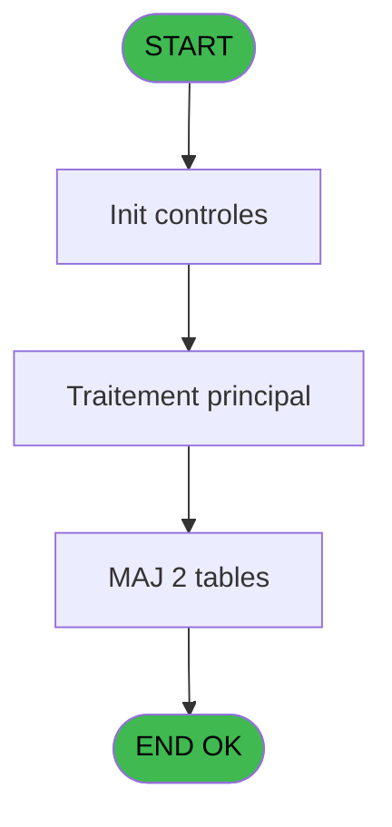

# VIL IDE 191 - Print recap sessions

> **Analyse**: Phases 1-4 2026-02-03 20:59 -> 20:59 (18s) | Assemblage 20:59
> **Pipeline**: V7.2 Enrichi
> **Structure**: 4 onglets (Resume | Ecrans | Donnees | Connexions)

<!-- TAB:Resume -->

## 1. FICHE D'IDENTITE

| Attribut | Valeur |
|----------|--------|
| Projet | VIL |
| IDE Position | 191 |
| Nom Programme | Print recap sessions |
| Fichier source | `Prg_191.xml` |
| Dossier IDE | Developpement |
| Taches | 24 (0 ecrans visibles) |
| Tables modifiees | 2 |
| Programmes appeles | 0 |

## 2. DESCRIPTION FONCTIONNELLE

**Print recap sessions** assure la gestion complete de ce processus, accessible depuis [    Listings cloture HTML (IDE 29)](VIL-IDE-29.md), [    Listings cloture HTML (IDE 192)](VIL-IDE-192.md).

Le flux de traitement s'organise en **4 blocs fonctionnels** :

- **Traitement** (20 taches) : traitements metier divers
- **Impression** (2 taches) : generation de tickets et documents
- **Calcul** (1 tache) : calculs de montants, stocks ou compteurs
- **Saisie** (1 tache) : ecrans de saisie utilisateur (formulaires, champs, donnees)

**Donnees modifiees** : 2 tables en ecriture (tempo_ecran_mecano, tempo_ecr_menage).

Detail : phases du traitement

#### Phase 1 : Impression (2 taches)

- **191** - Print etat recap sessions
- **191.11** - Edition

#### Phase 2 : Traitement (20 taches)

- **191.1** - Recap Change
- **191.2** - Sessions caisses
- **191.2.1** - CAISSE v1 **[[ECRAN]](#ecran-t4)**
- **191.2.2** - Sessions
- **191.2.2.1** - Appro / Remise
- **191.3** - Lecture 18
- **191.3.1** - Upd Recap Sessions
- **191.4.1** - Upd Recap Sessions
- **191.5** - Telecollectes
- **191.5.1** - Upd Recap Sessions Boutique
- **191.6** - Recap OD
- **191.7** - Recap Change
- **191.8** - Recap Ecarts
- **191.8.1** - Upd File
- **191.10** - PC Coffre 1
- **191.11.1** - Reception
- **191.11.1.1** - Telecollecte
- **191.11.2** - Autres Services
- **191.12** - Telecollectes
- **191.12.1** - Upd Recap Sessions Boutique

#### Phase 3 : Saisie (1 tache)

- **191.4** - Lecture Ventes

#### Phase 4 : Calcul (1 tache)

- **191.9** - Comptage Reception

#### Tables impactees

| Table | Operations | Role metier |
|-------|-----------|-------------|
| tempo_ecran_mecano | R/**W**/L (14 usages) | Table temporaire ecran |
| tempo_ecr_menage | **W**/L (4 usages) | Table temporaire ecran |

## 3. BLOCS FONCTIONNELS

### 3.1 Impression (2 taches)

Generation des documents et tickets.

---

#### 191 - Print etat recap sessions

**Role** : Generation du document : Print etat recap sessions.
**Variables liees** : E (v.nb sessions reception)

---

#### 191.11 - Edition

**Role** : Generation du document : Edition.

### 3.2 Traitement (20 taches)

Traitements internes.

---

#### 191.1 - Recap Change

**Role** : Traitement : Recap Change.

---

#### 191.2 - Sessions caisses

**Role** : Traitement : Sessions caisses.
**Variables liees** : E (v.nb sessions reception)

---

#### 191.2.1 - CAISSE v1 [[ECRAN]](#ecran-t4)

**Role** : Traitement : CAISSE v1.
**Ecran** : 205 x 89 DLU (MDI) | [Voir mockup](#ecran-t4)

---

#### 191.2.2 - Sessions

**Role** : Traitement : Sessions.
**Variables liees** : E (v.nb sessions reception)

---

#### 191.2.2.1 - Appro / Remise

**Role** : Calcul fidelite/avantage : Appro / Remise.
**Variables liees** : H (v.Appro Coffre 1), I (v.Remise Coffre 1)

---

#### 191.3 - Lecture 18

**Role** : Traitement : Lecture 18.

---

#### 191.3.1 - Upd Recap Sessions

**Role** : Traitement : Upd Recap Sessions.
**Variables liees** : E (v.nb sessions reception)

---

#### 191.4.1 - Upd Recap Sessions

**Role** : Traitement : Upd Recap Sessions.
**Variables liees** : E (v.nb sessions reception)

---

#### 191.5 - Telecollectes

**Role** : Traitement : Telecollectes.

---

#### 191.5.1 - Upd Recap Sessions Boutique

**Role** : Traitement : Upd Recap Sessions Boutique.
**Variables liees** : E (v.nb sessions reception)

---

#### 191.6 - Recap OD

**Role** : Traitement : Recap OD.

---

#### 191.7 - Recap Change

**Role** : Traitement : Recap Change.

---

#### 191.8 - Recap Ecarts

**Role** : Traitement : Recap Ecarts.

---

#### 191.8.1 - Upd File

**Role** : Traitement : Upd File.

---

#### 191.10 - PC Coffre 1

**Role** : Traitement : PC Coffre 1.
**Variables liees** : B (p.Terminal Coffre 2), F (v.user coffre 2), G (v.PC Coffre 1), H (v.Appro Coffre 1), I (v.Remise Coffre 1)

---

#### 191.11.1 - Reception

**Role** : Traitement : Reception.
**Variables liees** : E (v.nb sessions reception)

---

#### 191.11.1.1 - Telecollecte

**Role** : Traitement : Telecollecte.

---

#### 191.11.2 - Autres Services

**Role** : Traitement : Autres Services.

---

#### 191.12 - Telecollectes

**Role** : Traitement : Telecollectes.

---

#### 191.12.1 - Upd Recap Sessions Boutique

**Role** : Traitement : Upd Recap Sessions Boutique.
**Variables liees** : E (v.nb sessions reception)

### 3.3 Saisie (1 tache)

Ce bloc traite la saisie des donnees de la transaction.

---

#### 191.4 - Lecture Ventes

**Role** : Saisie des donnees : Lecture Ventes.

### 3.4 Calcul (1 tache)

Calculs metier : montants, stocks, compteurs.

---

#### 191.9 - Comptage Reception

**Role** : Traitement : Comptage Reception.
**Variables liees** : E (v.nb sessions reception)

## 5. REGLES METIER

*(Aucune regle metier identifiee)*

## 6. CONTEXTE

- **Appele par**: [    Listings cloture HTML (IDE 29)](VIL-IDE-29.md), [    Listings cloture HTML (IDE 192)](VIL-IDE-192.md)
- **Appelle**: 0 programmes | **Tables**: 22 (W:2 R:10 L:15) | **Taches**: 24 | **Expressions**: 7

<!-- TAB:Ecrans -->

## 8. ECRANS

*(Programme sans ecran visible)*

## 9. NAVIGATION

### 9.3 Structure hierarchique (24 taches)

| Position | Tache | Type | Dimensions | Bloc |
|----------|-------|------|------------|------|
| **191.1** | [**Print etat recap sessions** (191)](#t1) | MDI | - | Impression |
| 191.1.1 | [Edition (191.11)](#t25) | MDI | - | |
| **191.2** | [**Recap Change** (191.1)](#t2) | MDI | - | Traitement |
| 191.2.1 | [Sessions caisses (191.2)](#t3) | MDI | - | |
| 191.2.2 | [CAISSE v1 (191.2.1)](#t4) [mockup](#ecran-t4) | MDI | 205x89 | |
| 191.2.3 | [Sessions (191.2.2)](#t5) | MDI | - | |
| 191.2.4 | [Appro / Remise (191.2.2.1)](#t6) | MDI | - | |
| 191.2.5 | [Lecture 18 (191.3)](#t7) | MDI | - | |
| 191.2.6 | [Upd Recap Sessions (191.3.1)](#t8) | MDI | - | |
| 191.2.7 | [Upd Recap Sessions (191.4.1)](#t10) | MDI | - | |
| 191.2.8 | [Telecollectes (191.5)](#t11) | MDI | - | |
| 191.2.9 | [Upd Recap Sessions Boutique (191.5.1)](#t12) | MDI | - | |
| 191.2.10 | [Recap OD (191.6)](#t13) | MDI | - | |
| 191.2.11 | [Recap Change (191.7)](#t14) | MDI | - | |
| 191.2.12 | [Recap Ecarts (191.8)](#t15) | MDI | - | |
| 191.2.13 | [Upd File (191.8.1)](#t16) | MDI | - | |
| 191.2.14 | [PC Coffre 1 (191.10)](#t18) | MDI | - | |
| 191.2.15 | [Reception (191.11.1)](#t26) | MDI | - | |
| 191.2.16 | [Telecollecte (191.11.1.1)](#t27) | MDI | - | |
| 191.2.17 | [Autres Services (191.11.2)](#t28) | MDI | - | |
| 191.2.18 | [Telecollectes (191.12)](#t37) | MDI | - | |
| 191.2.19 | [Upd Recap Sessions Boutique (191.12.1)](#t38) | MDI | - | |
| **191.3** | [**Lecture Ventes** (191.4)](#t9) | MDI | - | Saisie |
| **191.4** | [**Comptage Reception** (191.9)](#t17) | MDI | - | Calcul |

### 9.4 Algorigramme

> **Legende**: Vert = START/END OK | Rouge = END KO | Bleu = Decisions
> *Algorigramme auto-genere. Utiliser `/algorigramme` pour une synthese metier detaillee.*

<!-- TAB:Donnees -->

## 10. TABLES

### Tables utilisees (22)

| ID | Nom | Description | Type | R | W | L | Usages |
|----|-----|-------------|------|---|---|---|--------|
| 40 | comptable________cte |  | DB | R |   |   | 1 |
| 44 | change___________chg |  | DB | R |   |   | 1 |
| 50 | moyens_reglement_mor | Reglements / paiements | DB | R |   |   | 1 |
| 54 | pieces_caisse____pks | Sessions de caisse | DB | R |   |   | 1 |
| 66 | imputations______imp |  | DB |   |   | L | 1 |
| 67 | tables___________tab |  | DB | R |   | L | 5 |
| 69 | initialisation___ini |  | DB |   |   | L | 1 |
| 147 | change_vente_____chg | Donnees de ventes | DB | R |   |   | 1 |
| 228 | detail_coffre | Etat du coffre | DB |   |   | L | 1 |
| 234 | ecarts |  | DB | R |   |   | 1 |
| 239 | total_od |  | DB |   |   | L | 1 |
| 241 | pointage_appro_remise |  | DB |   |   | L | 1 |
| 246 | histo_sessions_caisse | Sessions de caisse | DB | R |   |   | 2 |
| 249 | histo_sessions_caisse_detail | Sessions de caisse | DB | R |   | L | 3 |
| 255 | suivi_pdc |  | DB |   |   | L | 1 |
| 263 | vente | Donnees de ventes | DB |   |   | L | 1 |
| 351 | sessions_ouvertes | Sessions de caisse | DB |   |   | L | 1 |
| 471 | comptage_coffre_devise | Etat du coffre | TMP |   |   | L | 3 |
| 554 | import_circuit___imc |  | TMP |   |   | L | 2 |
| 594 | tempo_ecran_mecano | Table temporaire ecran | TMP | R | **W** | L | 14 |
| 595 | tempo_ecr_menage | Table temporaire ecran | TMP |   | **W** | L | 4 |
| 734 | arc_pv_cust_packages |  | DB |   |   | L | 4 |

### Colonnes par table (14 / 11 tables avec colonnes identifiees)

Table 40 - comptable________cte (R) - 1 usages

| Lettre | Variable | Acces | Type |
|--------|----------|-------|------|
| A | v.retour terminal IMS | R | Logical |
| B | v.is user reception | R | Logical |

Table 44 - change___________chg (R) - 1 usages

| Lettre | Variable | Acces | Type |
|--------|----------|-------|------|
| H | v.total Change | R | Numeric |

Table 50 - moyens_reglement_mor (R) - 1 usages

| Lettre | Variable | Acces | Type |
|--------|----------|-------|------|
| A | p.Date Comptable | R | Date |
| B | p.Terminal Coffre 2 | R | Numeric |
| C | p.Societe | R | Alpha |
| D | p.Masque | R | Alpha |
| E | v.nb sessions reception | R | Numeric |
| F | v.user coffre 2 | R | Alpha |
| G | v.PC Coffre 1 | R | Numeric |
| H | v.Appro Coffre 1 | R | Numeric |
| I | v.Remise Coffre 1 | R | Numeric |
| J | v.Ecart Coffre 1 | R | Numeric |
| K | V.Existe mop WECH ? | R | Logical |

Table 54 - pieces_caisse____pks (R) - 1 usages

*Table utilisee uniquement en Link ou aucune colonne Real identifiee dans le DataView.*

Table 67 - tables___________tab (R/L) - 5 usages

| Lettre | Variable | Acces | Type |
|--------|----------|-------|------|
| A | v.retour terminal IMS | R | Logical |
| B | v.is user reception | R | Logical |

Table 147 - change_vente_____chg (R) - 1 usages

| Lettre | Variable | Acces | Type |
|--------|----------|-------|------|
| F | v.total Vente Cash | R | Numeric |
| H | v.total Change | R | Numeric |

Table 234 - ecarts (R) - 1 usages

*Table utilisee uniquement en Link ou aucune colonne Real identifiee dans le DataView.*

Table 246 - histo_sessions_caisse (R) - 2 usages

| Lettre | Variable | Acces | Type |
|--------|----------|-------|------|
| E | v.nb sessions reception | R | Numeric |

Table 249 - histo_sessions_caisse_detail (R/L) - 3 usages

| Lettre | Variable | Acces | Type |
|--------|----------|-------|------|
| E | v.nb sessions reception | R | Numeric |

Table 594 - tempo_ecran_mecano (R/**W**/L) - 14 usages

| Lettre | Variable | Acces | Type |
|--------|----------|-------|------|
| A | V.Existe utilisateur coffre 2 ? | W | Logical |
| B | v.total OD | W | Numeric |
| C | v.total FDR Init | W | Numeric |
| D | v.total FDR Final | W | Numeric |
| E | v.total Vers/Ret Cash | W | Numeric |
| F | v.total Vente Cash | W | Numeric |
| G | v.total Solde Cash | W | Numeric |
| H | v.total Change | W | Numeric |
| I | v.total Appro | W | Numeric |
| J | v.total Remise | W | Numeric |
| K | v.total Ecart | W | Numeric |
| L | v.total AMEX | W | Numeric |
| M | v.total CCAU | W | Numeric |
| N | v.total Visa | W | Numeric |
| O | v.total WECH | W | Numeric |
| P | v.total UNIO | W | Numeric |
| Q | v.total CC | W | Numeric |

Table 595 - tempo_ecr_menage (**W**/L) - 4 usages

*Table utilisee uniquement en Link ou aucune colonne Real identifiee dans le DataView.*

## 11. VARIABLES

### 11.1 Parametres entrants (4)

Variables recues du programme appelant ([    Listings cloture HTML (IDE 29)](VIL-IDE-29.md)).

| Lettre | Nom | Type | Usage dans |
|--------|-----|------|-----------|
| A | p.Date Comptable | Date | 2x parametre entrant |
| B | p.Terminal Coffre 2 | Numeric | - |
| C | p.Societe | Alpha | 1x parametre entrant |
| D | p.Masque | Alpha | - |

### 11.2 Variables de session (13)

Variables persistantes pendant toute la session.

| Lettre | Nom | Type | Usage dans |
|--------|-----|------|-----------|
| E | v.nb sessions reception | Numeric | - |
| F | v.user coffre 2 | Alpha | - |
| G | v.PC Coffre 1 | Numeric | - |
| H | v.Appro Coffre 1 | Numeric | - |
| I | v.Remise Coffre 1 | Numeric | - |
| J | v.Ecart Coffre 1 | Numeric | - |
| K | V.Existe mop WECH ? | Logical | - |
| L | v.total AMEX | Numeric | - |
| M | v.total CCAU | Numeric | - |
| N | v.total Visa | Numeric | - |
| O | v.total WECH | Numeric | - |
| P | v.total UNIO | Numeric | - |
| Q | v.total CC | Numeric | - |

Toutes les 17 variables (liste complete)

| Cat | Lettre | Nom Variable | Type |
|-----|--------|--------------|------|
| P0 | **A** | p.Date Comptable | Date |
| P0 | **B** | p.Terminal Coffre 2 | Numeric |
| P0 | **C** | p.Societe | Alpha |
| P0 | **D** | p.Masque | Alpha |
| V. | **E** | v.nb sessions reception | Numeric |
| V. | **F** | v.user coffre 2 | Alpha |
| V. | **G** | v.PC Coffre 1 | Numeric |
| V. | **H** | v.Appro Coffre 1 | Numeric |
| V. | **I** | v.Remise Coffre 1 | Numeric |
| V. | **J** | v.Ecart Coffre 1 | Numeric |
| V. | **K** | V.Existe mop WECH ? | Logical |
| V. | **L** | v.total AMEX | Numeric |
| V. | **M** | v.total CCAU | Numeric |
| V. | **N** | v.total Visa | Numeric |
| V. | **O** | v.total WECH | Numeric |
| V. | **P** | v.total UNIO | Numeric |
| V. | **Q** | v.total CC | Numeric |

## 12. EXPRESSIONS

**7 / 7 expressions decodees (100%)**

### 12.1 Repartition par type

| Type | Expressions | Regles |
|------|-------------|--------|
| CALCULATION | 1 | 0 |
| CONSTANTE | 2 | 0 |
| OTHER | 2 | 0 |
| REFERENCE_VG | 1 | 0 |
| NEGATION | 1 | 0 |

### 12.2 Expressions cles par type

#### CALCULATION (1 expressions)

| Type | IDE | Expression | Regle |
|------|-----|------------|-------|
| CALCULATION | 3 | `p.Date Comptable [A]-1` | - |

#### CONSTANTE (2 expressions)

| Type | IDE | Expression | Regle |
|------|-----|------------|-------|
| CONSTANTE | 5 | `'WECH'` | - |
| CONSTANTE | 2 | `'CHGE'` | - |

#### OTHER (2 expressions)

| Type | IDE | Expression | Regle |
|------|-----|------------|-------|
| OTHER | 4 | `p.Date Comptable [A]` | - |
| OTHER | 1 | `p.Societe [C]` | - |

#### REFERENCE_VG (1 expressions)

| Type | IDE | Expression | Regle |
|------|-----|------------|-------|
| REFERENCE_VG | 6 | `VG25` | - |

#### NEGATION (1 expressions)

| Type | IDE | Expression | Regle |
|------|-----|------------|-------|
| NEGATION | 7 | `NOT VG25` | - |

<!-- TAB:Connexions -->

## 13. GRAPHE D'APPELS

### 13.1 Chaine depuis Main (Callers)

Main -> ... -> [    Listings cloture HTML (IDE 29)](VIL-IDE-29.md) -> **Print recap sessions (IDE 191)**

Main -> ... -> [    Listings cloture HTML (IDE 192)](VIL-IDE-192.md) -> **Print recap sessions (IDE 191)**

### 13.2 Callers

| IDE | Nom Programme | Nb Appels |
|-----|---------------|-----------|
| [29](VIL-IDE-29.md) |     Listings cloture HTML | 1 |
| [192](VIL-IDE-192.md) |     Listings cloture HTML | 1 |

### 13.3 Callees (programmes appeles)

### 13.4 Detail Callees avec contexte

| IDE | Nom Programme | Appels | Contexte |
|-----|---------------|--------|----------|
| - | (aucun) | - | - |

## 14. RECOMMANDATIONS MIGRATION

### 14.1 Profil du programme

| Metrique | Valeur | Impact migration |
|----------|--------|-----------------|
| Lignes de logique | 584 | Programme volumineux |
| Expressions | 7 | Peu de logique |
| Tables WRITE | 2 | Impact faible |
| Sous-programmes | 0 | Peu de dependances |
| Ecrans visibles | 0 | Ecran unique ou traitement batch |
| Code desactive | 0% (0 / 584) | Code sain |
| Regles metier | 0 | Pas de regle identifiee |

### 14.2 Plan de migration par bloc

#### Impression (2 taches: 0 ecran, 2 traitements)

- **Strategie** : Templates HTML -> PDF via wkhtmltopdf ou Puppeteer.
- `PrintService` injectable avec choix imprimante

#### Traitement (20 taches: 1 ecran, 19 traitements)

- **Strategie** : Orchestrateur avec 1 ecrans (Razor/React) et 19 traitements backend (services).
- Les ecrans deviennent des composants UI, les traitements invisibles deviennent des services injectables.
- Decomposer les taches en services unitaires testables.

#### Saisie (1 tache: 0 ecran, 1 traitement)

- **Strategie** : Formulaire React/Blazor avec validation Zod/FluentValidation.
- Validation temps reel cote client + serveur

#### Calcul (1 tache: 0 ecran, 1 traitement)

- **Strategie** : Services de calcul purs (Domain Services).
- Migrer la logique de calcul (stock, compteurs, montants)

### 14.3 Dependances critiques

| Dependance | Type | Appels | Impact |
|------------|------|--------|--------|
| tempo_ecran_mecano | Table WRITE (Temp) | 8x | Schema + repository |
| tempo_ecr_menage | Table WRITE (Temp) | 1x | Schema + repository |

---
*Spec DETAILED generee par Pipeline V7.2 - 2026-02-03 20:59*
