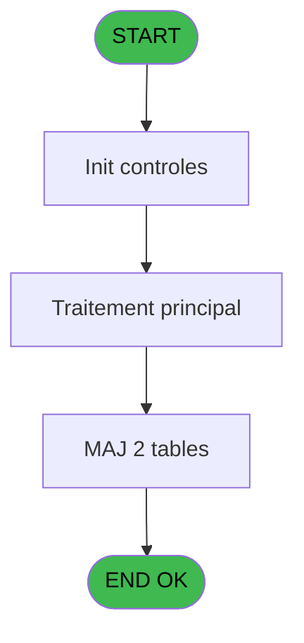
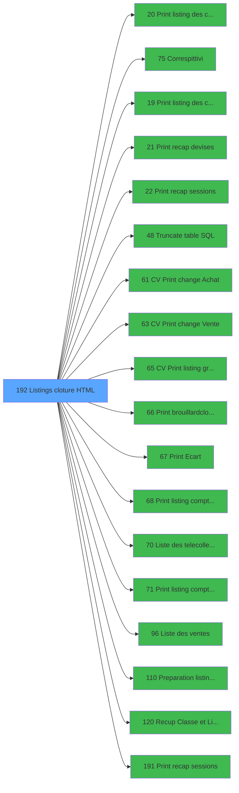

# VIL IDE 192 - Listings cloture HTML

> **Analyse**: Phases 1-4 2026-02-03 20:59 -> 20:59 (17s) | Assemblage 20:59
> **Pipeline**: V7.2 Enrichi
> **Structure**: 4 onglets (Resume | Ecrans | Donnees | Connexions)

<!-- TAB:Resume -->

## 1. FICHE D'IDENTITE

| Attribut | Valeur |
|----------|--------|
| Projet | VIL |
| IDE Position | 192 |
| Nom Programme | Listings cloture HTML |
| Fichier source | `Prg_192.xml` |
| Dossier IDE | Developpement |
| Taches | 5 (0 ecrans visibles) |
| Tables modifiees | 2 |
| Programmes appeles | 18 |
| :warning: Statut | **ORPHELIN_POTENTIEL** |

## 2. DESCRIPTION FONCTIONNELLE

**Listings cloture HTML** assure la gestion complete de ce processus.

Le flux de traitement s'organise en **1 blocs fonctionnels** :

- **Traitement** (5 taches) : traitements metier divers

**Donnees modifiees** : 2 tables en ecriture (comptage_coffre_devise, pv_customer).

Detail : phases du traitement

#### Phase 1 : Traitement (5 taches)

- **192** - CV  Menu listings complement. **[[ECRAN]](#ecran-t1)**
- **192.1** - Versements/Retraits
- **192.2** - Lecture solde veille
- **192.3** - Gen 341
- **192.4** - Gen 341

Delegue a : [Correspittivi (IDE 75)](VIL-IDE-75.md), [Truncate table SQL (IDE 48)](VIL-IDE-48.md), [Liste des telecollectes (IDE 70)](VIL-IDE-70.md)

#### Tables impactees

| Table | Operations | Role metier |
|-------|-----------|-------------|
| pv_customer | **W** (1 usages) |  |
| comptage_coffre_devise | **W** (1 usages) | Etat du coffre |

## 3. BLOCS FONCTIONNELS

### 3.1 Traitement (5 taches)

Traitements internes.

---

#### 192 - CV  Menu listings complement. [[ECRAN]](#ecran-t1)

**Role** : Traitement : CV  Menu listings complement..
**Ecran** : 342 x 17 DLU (MDI) | [Voir mockup](#ecran-t1)

4 sous-taches directes

| Tache | Nom | Bloc |
|-------|-----|------|
| [192.1](#t2) | Versements/Retraits | Traitement |
| [192.2](#t3) | Lecture solde veille | Traitement |
| [192.3](#t4) | Gen 341 | Traitement |
| [192.4](#t5) | Gen 341 | Traitement |

**Delegue a** : [Correspittivi (IDE 75)](VIL-IDE-75.md), [Truncate table SQL (IDE 48)](VIL-IDE-48.md), [Liste des telecollectes (IDE 70)](VIL-IDE-70.md)

---

#### 192.1 - Versements/Retraits

**Role** : Traitement : Versements/Retraits.
**Delegue a** : [Correspittivi (IDE 75)](VIL-IDE-75.md), [Truncate table SQL (IDE 48)](VIL-IDE-48.md), [Liste des telecollectes (IDE 70)](VIL-IDE-70.md)

---

#### 192.2 - Lecture solde veille

**Role** : Consultation/chargement : Lecture solde veille.
**Variables liees** : L (W0 solde veille)
**Delegue a** : [Correspittivi (IDE 75)](VIL-IDE-75.md), [Truncate table SQL (IDE 48)](VIL-IDE-48.md), [Liste des telecollectes (IDE 70)](VIL-IDE-70.md)

---

#### 192.3 - Gen 341

**Role** : Traitement : Gen 341.
**Delegue a** : [Correspittivi (IDE 75)](VIL-IDE-75.md), [Truncate table SQL (IDE 48)](VIL-IDE-48.md), [Liste des telecollectes (IDE 70)](VIL-IDE-70.md)

---

#### 192.4 - Gen 341

**Role** : Traitement : Gen 341.
**Delegue a** : [Correspittivi (IDE 75)](VIL-IDE-75.md), [Truncate table SQL (IDE 48)](VIL-IDE-48.md), [Liste des telecollectes (IDE 70)](VIL-IDE-70.md)

## 5. REGLES METIER

*(Aucune regle metier identifiee)*

## 6. CONTEXTE

- **Appele par**: (aucun)
- **Appelle**: 18 programmes | **Tables**: 6 (W:2 R:2 L:2) | **Taches**: 5 | **Expressions**: 22

<!-- TAB:Ecrans -->

## 8. ECRANS

*(Programme sans ecran visible)*

## 9. NAVIGATION

### 9.3 Structure hierarchique (5 taches)

| Position | Tache | Type | Dimensions | Bloc |
|----------|-------|------|------------|------|
| **192.1** | [**CV  Menu listings complement.** (192)](#t1) [mockup](#ecran-t1) | MDI | 342x17 | Traitement |
| 192.1.1 | [Versements/Retraits (192.1)](#t2) | MDI | - | |
| 192.1.2 | [Lecture solde veille (192.2)](#t3) | MDI | - | |
| 192.1.3 | [Gen 341 (192.3)](#t4) | MDI | - | |
| 192.1.4 | [Gen 341 (192.4)](#t5) | MDI | - | |

### 9.4 Algorigramme

> **Legende**: Vert = START/END OK | Rouge = END KO | Bleu = Decisions
> *Algorigramme auto-genere. Utiliser `/algorigramme` pour une synthese metier detaillee.*

<!-- TAB:Donnees -->

## 10. TABLES

### Tables utilisees (6)

| ID | Nom | Description | Type | R | W | L | Usages |
|----|-----|-------------|------|---|---|---|--------|
| 17 | backup_devises_caisse | Sessions de caisse | DB |   |   | L | 1 |
| 18 | backup_histo_sessions_caisse | Sessions de caisse | DB |   |   | L | 1 |
| 40 | comptable________cte |  | DB | R |   |   | 1 |
| 55 | solde_caisse_____sks | Sessions de caisse | DB | R |   |   | 1 |
| 471 | comptage_coffre_devise | Etat du coffre | TMP |   | **W** |   | 1 |
| 508 | pv_customer |  | TMP |   | **W** |   | 1 |

### Colonnes par table (3 / 4 tables avec colonnes identifiees)

Table 40 - comptable________cte (R) - 1 usages

| Lettre | Variable | Acces | Type |
|--------|----------|-------|------|
| D | P0 date comptable | R | Date |

Table 55 - solde_caisse_____sks (R) - 1 usages

| Lettre | Variable | Acces | Type |
|--------|----------|-------|------|
| L | W0 solde veille | R | Numeric |

Table 471 - comptage_coffre_devise (**W**) - 1 usages

| Lettre | Variable | Acces | Type |
|--------|----------|-------|------|
| G | P0 Devise Locale | W | Alpha |
| H | P0 Terminal Coffre 2 | W | Numeric |
| I | P0 Hostname Coffre 2 | W | Unicode |

Table 508 - pv_customer (**W**) - 1 usages

*Table utilisee uniquement en Link ou aucune colonne Real identifiee dans le DataView.*

## 11. VARIABLES

### 11.1 Parametres entrants (9)

Variables recues en parametre.

| Lettre | Nom | Type | Usage dans |
|--------|-----|------|-----------|
| A | P0 societe | Alpha | - |
| B | P0 picture montant | Alpha | - |
| C | P0 nbre decimales | Numeric | 1x parametre entrant |
| D | P0 date comptable | Date | 3x parametre entrant |
| E | P0 nom village | Alpha | - |
| F | P0 Uni / Bi | Alpha | 1x parametre entrant |
| G | P0 Devise Locale | Alpha | - |
| H | P0 Terminal Coffre 2 | Numeric | - |
| I | P0 Hostname Coffre 2 | Unicode | - |

### 11.2 Variables de travail (10)

Variables internes au programme.

| Lettre | Nom | Type | Usage dans |
|--------|-----|------|-----------|
| K | W0 param bidon | Numeric | - |
| L | W0 solde veille | Numeric | - |
| M | W0 montant versmnt | Numeric | - |
| N | W0 montant retrait | Numeric | - |
| O | W0 pkes recettes | Numeric | - |
| P | W0 pkes depenses | Numeric | - |
| Q | W0 Versement CASH | Numeric | - |
| R | W0 Versement NON CASH | Numeric | - |
| S | W0 Retrait CASH | Numeric | - |
| T | W0 Retrait NON CASH | Numeric | - |

### 11.3 Autres (1)

Variables diverses.

| Lettre | Nom | Type | Usage dans |
|--------|-----|------|-----------|
| J | WP0 masque cumul | Alpha | - |

Toutes les 20 variables (liste complete)

| Cat | Lettre | Nom Variable | Type |
|-----|--------|--------------|------|
| P0 | **A** | P0 societe | Alpha |
| P0 | **B** | P0 picture montant | Alpha |
| P0 | **C** | P0 nbre decimales | Numeric |
| P0 | **D** | P0 date comptable | Date |
| P0 | **E** | P0 nom village | Alpha |
| P0 | **F** | P0 Uni / Bi | Alpha |
| P0 | **G** | P0 Devise Locale | Alpha |
| P0 | **H** | P0 Terminal Coffre 2 | Numeric |
| P0 | **I** | P0 Hostname Coffre 2 | Unicode |
| W0 | **K** | W0 param bidon | Numeric |
| W0 | **L** | W0 solde veille | Numeric |
| W0 | **M** | W0 montant versmnt | Numeric |
| W0 | **N** | W0 montant retrait | Numeric |
| W0 | **O** | W0 pkes recettes | Numeric |
| W0 | **P** | W0 pkes depenses | Numeric |
| W0 | **Q** | W0 Versement CASH | Numeric |
| W0 | **R** | W0 Versement NON CASH | Numeric |
| W0 | **S** | W0 Retrait CASH | Numeric |
| W0 | **T** | W0 Retrait NON CASH | Numeric |
| Autre | **J** | WP0 masque cumul | Alpha |

## 12. EXPRESSIONS

**22 / 22 expressions decodees (100%)**

### 12.1 Repartition par type

| Type | Expressions | Regles |
|------|-------------|--------|
| CONSTANTE | 8 | 0 |
| CAST_LOGIQUE | 1 | 0 |
| CONCATENATION | 1 | 0 |
| CONDITION | 2 | 0 |
| OTHER | 7 | 0 |
| REFERENCE_VG | 3 | 0 |

### 12.2 Expressions cles par type

#### CONSTANTE (8 expressions)

| Type | IDE | Expression | Regle |
|------|-----|------------|-------|
| CONSTANTE | 16 | `'J'` | - |
| CONSTANTE | 12 | `2` | - |
| CONSTANTE | 22 | `'C'` | - |
| CONSTANTE | 19 | `'M'` | - |
| CONSTANTE | 5 | `'O'` | - |
| ... | | *+3 autres* | |

#### CAST_LOGIQUE (1 expressions)

| Type | IDE | Expression | Regle |
|------|-----|------------|-------|
| CAST_LOGIQUE | 2 | `'TRUE'LOG` | - |

#### CONCATENATION (1 expressions)

| Type | IDE | Expression | Regle |
|------|-----|------------|-------|
| CONCATENATION | 3 | `'N'&Right (' ### ### ### ###'&Left ('.',P0 nbre decimales [C])&Left ('###',P0 nbre decimales [C]),16)&'Z'` | - |

#### CONDITION (2 expressions)

| Type | IDE | Expression | Regle |
|------|-----|------------|-------|
| CONDITION | 15 | `P0 date comptable [D]=EOM(P0 date comptable [D])` | - |
| CONDITION | 4 | `P0 Uni / Bi [F]='B'` | - |

#### OTHER (7 expressions)

| Type | IDE | Expression | Regle |
|------|-----|------------|-------|
| OTHER | 17 | `BOM(P0 date comptable [D])` | - |
| OTHER | 18 | `EOM(P0 date comptable [D])` | - |
| OTHER | 20 | `NOT(VG24)` | - |
| OTHER | 11 | `DbDel ('{595,2}'DSOURCE,'')` | - |
| OTHER | 7 | `DbDel ('{508,2}'DSOURCE,'')` | - |
| ... | | *+2 autres* | |

#### REFERENCE_VG (3 expressions)

| Type | IDE | Expression | Regle |
|------|-----|------------|-------|
| REFERENCE_VG | 21 | `VG24` | - |
| REFERENCE_VG | 14 | `VG23` | - |
| REFERENCE_VG | 13 | `VG14` | - |

### 12.3 Toutes les expressions (22)

Voir les 22 expressions

#### CONSTANTE (8)

| IDE | Expression Decodee |
|-----|-------------------|
| 1 | `''` |
| 5 | `'O'` |
| 6 | `0` |
| 9 | `'2'` |
| 12 | `2` |
| 16 | `'J'` |
| 19 | `'M'` |
| 22 | `'C'` |

#### CAST_LOGIQUE (1)

| IDE | Expression Decodee |
|-----|-------------------|
| 2 | `'TRUE'LOG` |

#### CONCATENATION (1)

| IDE | Expression Decodee |
|-----|-------------------|
| 3 | `'N'&Right (' ### ### ### ###'&Left ('.',P0 nbre decimales [C])&Left ('###',P0 nbre decimales [C]),16)&'Z'` |

#### CONDITION (2)

| IDE | Expression Decodee |
|-----|-------------------|
| 4 | `P0 Uni / Bi [F]='B'` |
| 15 | `P0 date comptable [D]=EOM(P0 date comptable [D])` |

#### OTHER (7)

| IDE | Expression Decodee |
|-----|-------------------|
| 7 | `DbDel ('{508,2}'DSOURCE,'')` |
| 8 | `DbName ('{471,2}'DSOURCE)` |
| 10 | `DbDel ('{594,2}'DSOURCE,'')` |
| 11 | `DbDel ('{595,2}'DSOURCE,'')` |
| 17 | `BOM(P0 date comptable [D])` |
| 18 | `EOM(P0 date comptable [D])` |
| 20 | `NOT(VG24)` |

#### REFERENCE_VG (3)

| IDE | Expression Decodee |
|-----|-------------------|
| 13 | `VG14` |
| 14 | `VG23` |
| 21 | `VG24` |

<!-- TAB:Connexions -->

## 13. GRAPHE D'APPELS

### 13.1 Chaine depuis Main (Callers)

**Chemin**: (pas de callers directs)

### 13.2 Callers

| IDE | Nom Programme | Nb Appels |
|-----|---------------|-----------|
| - | (aucun) | - |

### 13.3 Callees (programmes appeles)

### 13.4 Detail Callees avec contexte

| IDE | Nom Programme | Appels | Contexte |
|-----|---------------|--------|----------|
| [20](VIL-IDE-20.md) | Print listing des comptes (PME | 2 | Impression ticket/document |
| [75](VIL-IDE-75.md) | Correspittivi | 2 | Sous-programme |
| [19](VIL-IDE-19.md) |     Print listing des comptes | 1 | Impression ticket/document |
| [21](VIL-IDE-21.md) |     Print recap devises | 1 | Impression ticket/document |
| [22](VIL-IDE-22.md) |     Print recap sessions | 1 | Impression ticket/document |
| [48](VIL-IDE-48.md) | Truncate table SQL | 1 | Sous-programme |
| [61](VIL-IDE-61.md) | CV  Print change Achat | 1 | Impression ticket/document |
| [63](VIL-IDE-63.md) | CV  Print change Vente | 1 | Impression ticket/document |
| [65](VIL-IDE-65.md) | CV  Print listing gratuites | 1 | Impression ticket/document |
| [66](VIL-IDE-66.md) | Print brouillard/cloture | 1 | Impression ticket/document |
| [67](VIL-IDE-67.md) | Print Ecart | 1 | Impression ticket/document |
| [68](VIL-IDE-68.md) | Print listing comptable | 1 | Impression ticket/document |
| [70](VIL-IDE-70.md) | Liste des telecollectes | 1 | Configuration impression |
| [71](VIL-IDE-71.md) | Print listing compte cash | 1 | Impression ticket/document |
| [96](VIL-IDE-96.md) | Liste des ventes | 1 | Configuration impression |
| [110](VIL-IDE-110.md) | Preparation listing comptable | 1 | Configuration impression |
| [120](VIL-IDE-120.md) | Recup Classe et Lib du MOP | 1 | Recuperation donnees |
| [191](VIL-IDE-191.md) |     Print recap sessions | 1 | Impression ticket/document |

## 14. RECOMMANDATIONS MIGRATION

### 14.1 Profil du programme

| Metrique | Valeur | Impact migration |
|----------|--------|-----------------|
| Lignes de logique | 151 | Programme compact |
| Expressions | 22 | Peu de logique |
| Tables WRITE | 2 | Impact faible |
| Sous-programmes | 18 | Forte dependance |
| Ecrans visibles | 0 | Ecran unique ou traitement batch |
| Code desactive | 0.7% (1 / 151) | Code sain |
| Regles metier | 0 | Pas de regle identifiee |

### 14.2 Plan de migration par bloc

#### Traitement (5 taches: 1 ecran, 4 traitements)

- **Strategie** : Orchestrateur avec 1 ecrans (Razor/React) et 4 traitements backend (services).
- Les ecrans deviennent des composants UI, les traitements invisibles deviennent des services injectables.
- 18 sous-programme(s) a migrer ou a reutiliser depuis les services existants.
- Decomposer les taches en services unitaires testables.

### 14.3 Dependances critiques

| Dependance | Type | Appels | Impact |
|------------|------|--------|--------|
| comptage_coffre_devise | Table WRITE (Temp) | 1x | Schema + repository |
| pv_customer | Table WRITE (Temp) | 1x | Schema + repository |
| [Correspittivi (IDE 75)](VIL-IDE-75.md) | Sous-programme | 2x | Haute - Sous-programme |
| [Print listing des comptes (PME (IDE 20)](VIL-IDE-20.md) | Sous-programme | 2x | Haute - Impression ticket/document |
| [Liste des telecollectes (IDE 70)](VIL-IDE-70.md) | Sous-programme | 1x | Normale - Configuration impression |
| [Print listing compte cash (IDE 71)](VIL-IDE-71.md) | Sous-programme | 1x | Normale - Impression ticket/document |
| [Print Ecart (IDE 67)](VIL-IDE-67.md) | Sous-programme | 1x | Normale - Impression ticket/document |
| [Print listing comptable (IDE 68)](VIL-IDE-68.md) | Sous-programme | 1x | Normale - Impression ticket/document |
| [Recup Classe et Lib du MOP (IDE 120)](VIL-IDE-120.md) | Sous-programme | 1x | Normale - Recuperation donnees |
| [    Print recap sessions (IDE 191)](VIL-IDE-191.md) | Sous-programme | 1x | Normale - Impression ticket/document |
| [Liste des ventes (IDE 96)](VIL-IDE-96.md) | Sous-programme | 1x | Normale - Configuration impression |
| [Preparation listing comptable (IDE 110)](VIL-IDE-110.md) | Sous-programme | 1x | Normale - Configuration impression |

---
*Spec DETAILED generee par Pipeline V7.2 - 2026-02-03 20:59*
