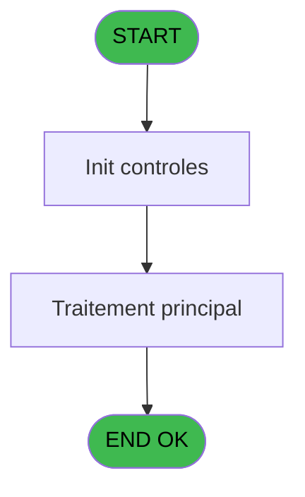

# VIL IDE 20 - Print listing des comptes (PME

> **Analyse**: Phases 1-4 2026-02-03 01:06 -> 01:07 (39s) | Assemblage 01:07
> **Pipeline**: V7.2 Enrichi
> **Structure**: 4 onglets (Resume | Ecrans | Donnees | Connexions)

<!-- TAB:Resume -->

## 1. FICHE D'IDENTITE

| Attribut | Valeur |
|----------|--------|
| Projet | VIL |
| IDE Position | 20 |
| Nom Programme | Print listing des comptes (PME |
| Fichier source | `Prg_20.xml` |
| Domaine metier | Comptabilite |
| Taches | 2 (1 ecrans visibles) |
| Tables modifiees | 0 |
| Programmes appeles | 0 |

## 2. DESCRIPTION FONCTIONNELLE

**Print listing des comptes (PME** assure la gestion complete de ce processus, accessible depuis [    Listings cloture HTML (IDE 29)](VIL-IDE-29.md), [    Listings cloture HTML (IDE 192)](VIL-IDE-192.md).

Le flux de traitement s'organise en **2 blocs fonctionnels** :

- **Consultation** (1 tache) : ecrans de recherche, selection et consultation
- **Traitement** (1 tache) : traitements metier divers

**Logique metier** : 7 regles identifiees couvrant conditions metier.

Detail : phases du traitement

#### Phase 1 : Traitement (1 tache)

- **20** - Veuillez patienter ..... **[[ECRAN]](#ecran-t3)**

#### Phase 2 : Consultation (1 tache)

- **20.1** - Recher depot CASH

## 3. BLOCS FONCTIONNELS

### 3.1 Traitement (1 tache)

Traitements internes.

---

#### 20 - Veuillez patienter ..... [[ECRAN]](#ecran-t3)

**Role** : Traitement : Veuillez patienter ......
**Ecran** : 427 x 57 DLU (MDI) | [Voir mockup](#ecran-t3)

### 3.2 Consultation (1 tache)

Ecrans de recherche et consultation.

---

#### 20.1 - Recher depot CASH

**Role** : Traitement : Recher depot CASH.
**Variables liees** : F (P0 Edition Compte Cash ?), N (W0 Cumul Cash), O (V Retour Depot garantie)

## 5. REGLES METIER

7 regles identifiees:

### Autres (7 regles)

#### [RM-001] Si [U]<=P0 date comptable [C] alors 'INSOL' sinon '')

| Element | Detail |
|---------|--------|
| **Condition** | `[U]<=P0 date comptable [C]` |
| **Si vrai** | 'INSOL' |
| **Si faux** | '') |
| **Variables** | C (P0 date comptable) |
| **Expression source** | Expression 10 : `IF ([U]<=P0 date comptable [C],'INSOL','')` |
| **Exemple** | Si [U]<=P0 date comptable [C] → 'INSOL'. Sinon → '') |

#### [RM-002] Si [T]<0 alors Str (- ([T]) sinon P0 masque cumul [B]),Fill (' ',17)&Str ([T],Left (P0 masque cumul [B],17)))

| Element | Detail |
|---------|--------|
| **Condition** | `[T]<0` |
| **Si vrai** | Str (- ([T]) |
| **Si faux** | P0 masque cumul [B]),Fill (' ',17)&Str ([T],Left (P0 masque cumul [B],17))) |
| **Variables** | B (P0 masque cumul) |
| **Expression source** | Expression 13 : `IF ([T]<0,Str (- ([T]),P0 masque cumul [B]),Fill (' ',17)&St` |
| **Exemple** | Si [T]<0 → Str (- ([T]) |

#### [RM-003] Si W0 cumul debit [J]+W0 heure listing [I]<0 alors Str (- (W0 cumul debit [J]+W0 heure listing [I]) sinon P0 masque cumul [B]),Fill (' ',17)&Str (W0 cumul debit [J]+W0 heure listing [I],Left (P0 masque cumul [B],17)))

| Element | Detail |
|---------|--------|
| **Condition** | `W0 cumul debit [J]+W0 heure listing [I]<0` |
| **Si vrai** | Str (- (W0 cumul debit [J]+W0 heure listing [I]) |
| **Si faux** | P0 masque cumul [B]),Fill (' ',17)&Str (W0 cumul debit [J]+W0 heure listing [I],Left (P0 masque cumul [B],17))) |
| **Variables** | B (P0 masque cumul), I (W0 heure listing), J (W0 cumul debit) |
| **Expression source** | Expression 16 : `IF (W0 cumul debit [J]+W0 heure listing [I]<0,Str (- (W0 cum` |
| **Exemple** | Si W0 cumul debit [J]+W0 heure listing [I]<0 → Str (- (W0 cumul debit [J]+W0 heure listing [I]) |

#### [RM-004] Si W0 heure listing [I]+W0 cumul debit [J]<0 alors MlsTrans ('debiteur') sinon MlsTrans ('crediteur'))

| Element | Detail |
|---------|--------|
| **Condition** | `W0 heure listing [I]+W0 cumul debit [J]<0` |
| **Si vrai** | MlsTrans ('debiteur') |
| **Si faux** | MlsTrans ('crediteur')) |
| **Variables** | I (W0 heure listing), J (W0 cumul debit) |
| **Expression source** | Expression 20 : `IF (W0 heure listing [I]+W0 cumul debit [J]<0,MlsTrans ('deb` |
| **Exemple** | Si W0 heure listing [I]+W0 cumul debit [J]<0 → MlsTrans ('debiteur'). Sinon → MlsTrans ('crediteur')) |

#### [RM-005] Si NOT([AQ]) alors Trim (INIGet ('[MAGIC_LOGICAL_NAMES]club_exportdata')&'Cloture\Editions\Adherent'&IF (P0 edition html [E] sinon '_'&DStr (P0 date comptable [C],'YYYYMMDD'),'')&'.htm'),'')

| Element | Detail |
|---------|--------|
| **Condition** | `NOT([AQ])` |
| **Si vrai** | Trim (INIGet ('[MAGIC_LOGICAL_NAMES]club_exportdata')&'Cloture\Editions\Adherent'&IF (P0 edition html [E] |
| **Si faux** | '_'&DStr (P0 date comptable [C],'YYYYMMDD'),'')&'.htm'),'') |
| **Variables** | C (P0 date comptable), E (P0 edition html) |
| **Expression source** | Expression 27 : `IF(NOT([AQ]),Trim (INIGet ('[MAGIC_LOGICAL_NAMES]club_export` |
| **Exemple** | Si NOT([AQ]) → Trim (INIGet ('[MAGIC_LOGICAL_NAMES]club_exportdata')&'Cloture\Editions\Adherent'&IF (P0 edition html [E]. Sinon → '_'&DStr (P0 date comptable [C],'YYYYMMDD'),'')&'.htm'),'') |

#### [RM-006] Si [AQ] alors Trim (INIGet ('[MAGIC_LOGICAL_NAMES]club_exportdata')&'Cloture\Editions\Garantie_Cash'&IF (P0 edition html [E] sinon '_'&DStr (P0 date comptable [C],'YYYYMMDD'),'')&'.htm'),'')

| Element | Detail |
|---------|--------|
| **Condition** | `[AQ]` |
| **Si vrai** | Trim (INIGet ('[MAGIC_LOGICAL_NAMES]club_exportdata')&'Cloture\Editions\Garantie_Cash'&IF (P0 edition html [E] |
| **Si faux** | '_'&DStr (P0 date comptable [C],'YYYYMMDD'),'')&'.htm'),'') |
| **Variables** | C (P0 date comptable), E (P0 edition html) |
| **Expression source** | Expression 28 : `IF([AQ],Trim (INIGet ('[MAGIC_LOGICAL_NAMES]club_exportdata'` |
| **Exemple** | Si [AQ] → Trim (INIGet ('[MAGIC_LOGICAL_NAMES]club_exportdata')&'Cloture\Editions\Garantie_Cash'&IF (P0 edition html [E]. Sinon → '_'&DStr (P0 date comptable [C],'YYYYMMDD'),'')&'.htm'),'') |

#### [RM-007] Si [T]>0 alors [T] sinon 0)

| Element | Detail |
|---------|--------|
| **Condition** | `[T]>0` |
| **Si vrai** | [T] |
| **Si faux** | 0) |
| **Expression source** | Expression 33 : `IF ([T]>0,[T],0)` |
| **Exemple** | Si [T]>0 → [T]. Sinon → 0) |

## 6. CONTEXTE

- **Appele par**: [    Listings cloture HTML (IDE 29)](VIL-IDE-29.md), [    Listings cloture HTML (IDE 192)](VIL-IDE-192.md)
- **Appelle**: 0 programmes | **Tables**: 2 (W:0 R:2 L:1) | **Taches**: 2 | **Expressions**: 46

<!-- TAB:Ecrans -->

## 8. ECRANS

### 8.1 Forms visibles (1 / 2)

| # | Position | Tache | Nom | Type | Largeur | Hauteur | Bloc |
|---|----------|-------|-----|------|---------|---------|------|
| 1 | 20.1 | 20 | Veuillez patienter ..... | MDI | 427 | 57 | Traitement |

### 8.2 Mockups Ecrans

---

#### 20.1 - Veuillez patienter .....
**Tache** : [20](#t3) | **Type** : MDI | **Dimensions** : 427 x 57 DLU
**Bloc** : Traitement | **Titre IDE** : Veuillez patienter .....

<!-- FORM-DATA:
{
    "width":  427,
    "vFactor":  8,
    "type":  "MDI",
    "hFactor":  8,
    "controls":  [
                     {
                         "x":  2,
                         "type":  "label",
                         "var":  "",
                         "y":  0,
                         "w":  423,
                         "fmt":  "",
                         "name":  "",
                         "h":  29,
                         "color":  "",
                         "text":  "",
                         "parent":  null
                     },
                     {
                         "x":  119,
                         "type":  "label",
                         "var":  "",
                         "y":  10,
                         "w":  275,
                         "fmt":  "",
                         "name":  "",
                         "h":  8,
                         "color":  "7",
                         "text":  "Impression en cours",
                         "parent":  null
                     },
                     {
                         "x":  2,
                         "type":  "label",
                         "var":  "",
                         "y":  29,
                         "w":  423,
                         "fmt":  "",
                         "name":  "",
                         "h":  27,
                         "color":  "",
                         "text":  "",
                         "parent":  null
                     },
                     {
                         "x":  74,
                         "type":  "label",
                         "var":  "",
                         "y":  39,
                         "w":  302,
                         "fmt":  "",
                         "name":  "",
                         "h":  8,
                         "color":  "",
                         "text":  "Impression  listing des comptes",
                         "parent":  null
                     },
                     {
                         "x":  3,
                         "type":  "image",
                         "var":  "",
                         "y":  2,
                         "w":  72,
                         "fmt":  "",
                         "name":  "",
                         "h":  25,
                         "color":  "",
                         "text":  "",
                         "parent":  null
                     }
                 ],
    "taskId":  "20.1",
    "height":  57
}
-->

## 9. NAVIGATION

Ecran unique: **Veuillez patienter .....**

### 9.3 Structure hierarchique (2 taches)

| Position | Tache | Type | Dimensions | Bloc |
|----------|-------|------|------------|------|
| **20.1** | [**Veuillez patienter .....** (20)](#t3) [mockup](#ecran-t3) | MDI | 427x57 | Traitement |
| **20.2** | [**Recher depot CASH** (20.1)](#t7) | - | - | Consultation |

### 9.4 Algorigramme

> **Legende**: Vert = START/END OK | Rouge = END KO | Bleu = Decisions
> *Algorigramme auto-genere. Utiliser `/algorigramme` pour une synthese metier detaillee.*

<!-- TAB:Donnees -->

## 10. TABLES

### Tables utilisees (2)

| ID | Nom | Description | Type | R | W | L | Usages |
|----|-----|-------------|------|---|---|---|--------|
| 16 | backup_compte_gm__cgm | Comptes GM (generaux) | DB | R |   |   | 1 |
| 39 | depot_garantie___dga | Depots et garanties | DB | R |   | L | 2 |

### Colonnes par table (2 / 2 tables avec colonnes identifiees)

Table 16 - backup_compte_gm__cgm (R) - 1 usages

| Lettre | Variable | Acces | Type |
|--------|----------|-------|------|
| A | P0 societe | R | Alpha |
| B | P0 masque cumul | R | Alpha |
| C | P0 date comptable | R | Date |
| D | P0 nom village | R | Alpha |
| E | P0 edition html | R | Logical |
| F | P0 Edition Compte Cash ? | R | Logical |
| G | W0 config imp | R | Alpha |
| H | W0 date listing | R | Date |
| I | W0 heure listing | R | Time |
| J | W0 cumul debit | R | Numeric |
| K | W0 cumul credit | R | Numeric |
| L | W0 string-solde | R | Alpha |
| M | W0 string-solde | R | Alpha |
| N | W0 Cumul Cash | R | Numeric |
| O | V Retour Depot garantie | R | Logical |

Table 39 - depot_garantie___dga (R/L) - 2 usages

| Lettre | Variable | Acces | Type |
|--------|----------|-------|------|
| O | V Retour Depot garantie | R | Logical |

## 11. VARIABLES

### 11.1 Parametres entrants (6)

Variables recues du programme appelant ([    Listings cloture HTML (IDE 29)](VIL-IDE-29.md)).

| Lettre | Nom | Type | Usage dans |
|--------|-----|------|-----------|
| A | P0 societe | Alpha | 1x parametre entrant |
| B | P0 masque cumul | Alpha | 5x parametre entrant |
| C | P0 date comptable | Date | 4x parametre entrant |
| D | P0 nom village | Alpha | - |
| E | P0 edition html | Logical | 5x parametre entrant |
| F | P0 Edition Compte Cash ? | Logical | - |

### 11.2 Variables de session (1)

Variables persistantes pendant toute la session.

| Lettre | Nom | Type | Usage dans |
|--------|-----|------|-----------|
| O | V Retour Depot garantie | Logical | - |

### 11.3 Variables de travail (8)

Variables internes au programme.

| Lettre | Nom | Type | Usage dans |
|--------|-----|------|-----------|
| G | W0 config imp | Alpha | - |
| H | W0 date listing | Date | - |
| I | W0 heure listing | Time | 6x calcul interne |
| J | W0 cumul debit | Numeric | 6x calcul interne |
| K | W0 cumul credit | Numeric | - |
| L | W0 string-solde | Alpha | - |
| M | W0 string-solde | Alpha | - |
| N | W0 Cumul Cash | Numeric | - |

## 12. EXPRESSIONS

**46 / 46 expressions decodees (100%)**

### 12.1 Repartition par type

| Type | Expressions | Regles |
|------|-------------|--------|
| CALCULATION | 3 | 0 |
| CONDITION | 18 | 7 |
| CONCATENATION | 1 | 0 |
| CAST_LOGIQUE | 2 | 0 |
| CONSTANTE | 3 | 0 |
| DATE | 1 | 0 |
| OTHER | 17 | 0 |
| NEGATION | 1 | 0 |

### 12.2 Expressions cles par type

#### CALCULATION (3 expressions)

| Type | IDE | Expression | Regle |
|------|-----|------------|-------|
| CALCULATION | 22 | `W0 cumul debit [J]+[T]` | - |
| CALCULATION | 21 | `W0 heure listing [I]+[T]` | - |
| CALCULATION | 17 | `W0 cumul debit [J]+W0 heure listing [I]` | - |

#### CONDITION (18 expressions)

| Type | IDE | Expression | Regle |
|------|-----|------------|-------|
| CONDITION | 27 | `IF(NOT([AQ]),Trim (INIGet ('[MAGIC_LOGICAL_NAMES]club_exportdata')&'Cloture\Editions\Adherent'&IF (P0 edition html [E],'_'&DStr (P0 date comptable [C],'YYYYMMDD'),'')&'.htm'),'')
` | [RM-005](#rm-RM-005) |
| CONDITION | 16 | `IF (W0 cumul debit [J]+W0 heure listing [I]<0,Str (- (W0 cumul debit [J]+W0 heure listing [I]),P0 masque cumul [B]),Fill (' ',17)&Str (W0 cumul debit [J]+W0 heure listing [I],Left (P0 masque cumul [B],17)))` | [RM-003](#rm-RM-003) |
| CONDITION | 33 | `IF ([T]>0,[T],0)` | [RM-007](#rm-RM-007) |
| CONDITION | 28 | `IF([AQ],Trim (INIGet ('[MAGIC_LOGICAL_NAMES]club_exportdata')&'Cloture\Editions\Garantie_Cash'&IF (P0 edition html [E],'_'&DStr (P0 date comptable [C],'YYYYMMDD'),'')&'.htm'),'')` | [RM-006](#rm-RM-006) |
| CONDITION | 10 | `IF ([U]<=P0 date comptable [C],'INSOL','')` | [RM-001](#rm-RM-001) |
| ... | | *+13 autres* | |

#### CONCATENATION (1 expressions)

| Type | IDE | Expression | Regle |
|------|-----|------------|-------|
| CONCATENATION | 26 | `'- '&Str (Page (0,1),'3P0Z0')&' -'` | - |

#### CAST_LOGIQUE (2 expressions)

| Type | IDE | Expression | Regle |
|------|-----|------------|-------|
| CAST_LOGIQUE | 44 | `'TRUE'LOG` | - |
| CAST_LOGIQUE | 40 | `IF([AQ],[BG],'TRUE'LOG)` | - |

#### CONSTANTE (3 expressions)

| Type | IDE | Expression | Regle |
|------|-----|------------|-------|
| CONSTANTE | 46 | `''` | - |
| CONSTANTE | 39 | `0` | - |
| CONSTANTE | 24 | `''` | - |

#### DATE (1 expressions)

| Type | IDE | Expression | Regle |
|------|-----|------------|-------|
| DATE | 8 | `Date ()` | - |

#### OTHER (17 expressions)

| Type | IDE | Expression | Regle |
|------|-----|------------|-------|
| OTHER | 34 | `[AQ] AND [BG]` | - |
| OTHER | 35 | `[AQ]` | - |
| OTHER | 30 | `P0 edition html [E] AND NOT([AQ])` | - |
| OTHER | 31 | `P0 edition html [E] AND ([AQ])` | - |
| OTHER | 42 | `[AQ]` | - |
| ... | | *+12 autres* | |

#### NEGATION (1 expressions)

| Type | IDE | Expression | Regle |
|------|-----|------------|-------|
| NEGATION | 36 | `NOT [AQ]` | - |

### 12.3 Toutes les expressions (46)

Voir les 46 expressions

#### CALCULATION (3)

| IDE | Expression Decodee |
|-----|-------------------|
| 17 | `W0 cumul debit [J]+W0 heure listing [I]` |
| 21 | `W0 heure listing [I]+[T]` |
| 22 | `W0 cumul debit [J]+[T]` |

#### CONDITION (18)

| IDE | Expression Decodee |
|-----|-------------------|
| 18 | `W0 cumul debit [J]+W0 heure listing [I]<0` |
| 19 | `W0 cumul debit [J]+W0 heure listing [I]>=0` |
| 10 | `IF ([U]<=P0 date comptable [C],'INSOL','')` |
| 13 | `IF ([T]<0,Str (- ([T]),P0 masque cumul [B]),Fill (' ',17)&Str ([T],Left (P0 masque cumul [B],17)))` |
| 16 | `IF (W0 cumul debit [J]+W0 heure listing [I]<0,Str (- (W0 cumul debit [J]+W0 heure listing [I]),P0 masque cumul [B]),Fill (' ',17)&Str (W0 cumul debit [J]+W0 heure listing [I],Left (P0 masque cumul [B],17)))` |
| 20 | `IF (W0 heure listing [I]+W0 cumul debit [J]<0,MlsTrans ('debiteur'),MlsTrans ('crediteur'))` |
| 27 | `IF(NOT([AQ]),Trim (INIGet ('[MAGIC_LOGICAL_NAMES]club_exportdata')&'Cloture\Editions\Adherent'&IF (P0 edition html [E],'_'&DStr (P0 date comptable [C],'YYYYMMDD'),'')&'.htm'),'')
` |
| 28 | `IF([AQ],Trim (INIGet ('[MAGIC_LOGICAL_NAMES]club_exportdata')&'Cloture\Editions\Garantie_Cash'&IF (P0 edition html [E],'_'&DStr (P0 date comptable [C],'YYYYMMDD'),'')&'.htm'),'')` |
| 32 | `IF ([T]<0,[T],0)` |
| 33 | `IF ([T]>0,[T],0)` |
| 45 | `IF(NOT([AQ]),'COMPTE ADHERENT AU : ','COMPTE ADHERENT & GARANTIE CASH :')` |
| 11 | `[T]<0` |
| 12 | `[T]>0` |
| 14 | `[T]>=0` |
| 15 | `[T]<0` |
| 23 | `[T]<>0` |
| 25 | `INIGet ('[MAGIC_LOGICAL_NAMES]preview')='O'` |
| 37 | `[AQ] AND [BD]>0` |

#### CONCATENATION (1)

| IDE | Expression Decodee |
|-----|-------------------|
| 26 | `'- '&Str (Page (0,1),'3P0Z0')&' -'` |

#### CAST_LOGIQUE (2)

| IDE | Expression Decodee |
|-----|-------------------|
| 40 | `IF([AQ],[BG],'TRUE'LOG)` |
| 44 | `'TRUE'LOG` |

#### CONSTANTE (3)

| IDE | Expression Decodee |
|-----|-------------------|
| 24 | `''` |
| 39 | `0` |
| 46 | `''` |

#### DATE (1)

| IDE | Expression Decodee |
|-----|-------------------|
| 8 | `Date ()` |

#### OTHER (17)

| IDE | Expression Decodee |
|-----|-------------------|
| 1 | `GetParam ('DTCLOSURE')` |
| 2 | `SetCrsr (1)` |
| 3 | `SetCrsr (2)` |
| 4 | `P0 date comptable [C]` |
| 5 | `P0 societe [A]` |
| 6 | `Left (P0 masque cumul [B],17)` |
| 7 | `Left (Right (P0 masque cumul [B],17),16)` |
| 9 | `Time ()` |
| 29 | `P0 edition html [E]` |
| 30 | `P0 edition html [E] AND NOT([AQ])` |
| 31 | `P0 edition html [E] AND ([AQ])` |
| 34 | `[AQ] AND [BG]` |
| 35 | `[AQ]` |
| 38 | `[P]` |
| 41 | `P0 masque cumul [B]` |
| 42 | `[AQ]` |
| 43 | `[BD]` |

#### NEGATION (1)

| IDE | Expression Decodee |
|-----|-------------------|
| 36 | `NOT [AQ]` |

<!-- TAB:Connexions -->

## 13. GRAPHE D'APPELS

### 13.1 Chaine depuis Main (Callers)

Main -> ... -> [    Listings cloture HTML (IDE 29)](VIL-IDE-29.md) -> **Print listing des comptes (PME (IDE 20)**

Main -> ... -> [    Listings cloture HTML (IDE 192)](VIL-IDE-192.md) -> **Print listing des comptes (PME (IDE 20)**

### 13.2 Callers

| IDE | Nom Programme | Nb Appels |
|-----|---------------|-----------|
| [29](VIL-IDE-29.md) |     Listings cloture HTML | 2 |
| [192](VIL-IDE-192.md) |     Listings cloture HTML | 2 |

### 13.3 Callees (programmes appeles)

### 13.4 Detail Callees avec contexte

| IDE | Nom Programme | Appels | Contexte |
|-----|---------------|--------|----------|
| - | (aucun) | - | - |

## 14. RECOMMANDATIONS MIGRATION

### 14.1 Profil du programme

| Metrique | Valeur | Impact migration |
|----------|--------|-----------------|
| Lignes de logique | 105 | Programme compact |
| Expressions | 46 | Peu de logique |
| Tables WRITE | 0 | Impact faible |
| Sous-programmes | 0 | Peu de dependances |
| Ecrans visibles | 1 | Ecran unique ou traitement batch |
| Code desactive | 0% (0 / 105) | Code sain |
| Regles metier | 7 | Quelques regles a preserver |

### 14.2 Plan de migration par bloc

#### Traitement (1 tache: 1 ecran, 0 traitement)

- **Strategie** : 1 composant(s) UI (Razor/React) avec formulaires et validation.
- Decomposer les taches en services unitaires testables.

#### Consultation (1 tache: 0 ecran, 1 traitement)

- **Strategie** : Composants de recherche/selection en modales.

### 14.3 Dependances critiques

| Dependance | Type | Appels | Impact |
|------------|------|--------|--------|

---
*Spec DETAILED generee par Pipeline V7.2 - 2026-02-03 01:07*
