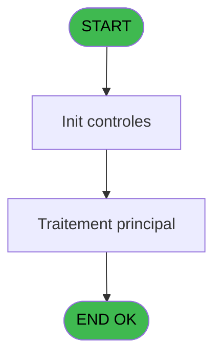
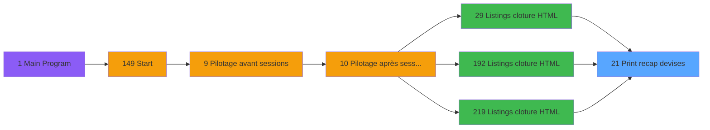

# VIL IDE 21 - Print recap devises

> **Analyse**: Phases 1-4 2026-02-03 01:07 -> 01:08 (38s) | Assemblage 01:08
> **Pipeline**: V7.2 Enrichi
> **Structure**: 4 onglets (Resume | Ecrans | Donnees | Connexions)

<!-- TAB:Resume -->

## 1. FICHE D'IDENTITE

| Attribut | Valeur |
|----------|--------|
| Projet | VIL |
| IDE Position | 21 |
| Nom Programme | Print recap devises |
| Fichier source | `Prg_21.xml` |
| Domaine metier | Change |
| Taches | 1 (1 ecrans visibles) |
| Tables modifiees | 0 |
| Programmes appeles | 0 |

## 2. DESCRIPTION FONCTIONNELLE

**Print recap devises** assure la gestion complete de ce processus, accessible depuis [    Listings cloture HTML (IDE 29)](VIL-IDE-29.md), [    Listings cloture HTML (IDE 192)](VIL-IDE-192.md), [    Listings cloture HTML (IDE 219)](VIL-IDE-219.md).

Le flux de traitement s'organise en **1 blocs fonctionnels** :

- **Traitement** (1 tache) : traitements metier divers

**Logique metier** : 2 regles identifiees couvrant conditions metier.

## 3. BLOCS FONCTIONNELS

### 3.1 Traitement (1 tache)

Traitements internes.

---

#### 21 - Veuillez patienter ... [[ECRAN]](#ecran-t1)

**Role** : Traitement : Veuillez patienter ....
**Ecran** : 427 x 56 DLU (MDI) | [Voir mockup](#ecran-t1)

## 5. REGLES METIER

2 regles identifiees:

### Autres (2 regles)

#### [RM-001] Si P0 Uni/Bilateral [E]='B' alors MlsTrans ('Entree/Sortie') sinon MlsTrans ('Sortie Devises'))

| Element | Detail |
|---------|--------|
| **Condition** | `P0 Uni/Bilateral [E]='B'` |
| **Si vrai** | MlsTrans ('Entree/Sortie') |
| **Si faux** | MlsTrans ('Sortie Devises')) |
| **Variables** | E (P0 Uni/Bilateral) |
| **Expression source** | Expression 10 : `IF (P0 Uni/Bilateral [E]='B',MlsTrans ('Entree/Sortie'),MlsT` |
| **Exemple** | Si P0 Uni/Bilateral [E]='B' → MlsTrans ('Entree/Sortie'). Sinon → MlsTrans ('Sortie Devises')) |

#### [RM-002] Si [P]<0 alors [P]*- (1) sinon [P])

| Element | Detail |
|---------|--------|
| **Condition** | `[P]<0` |
| **Si vrai** | [P]*- (1) |
| **Si faux** | [P]) |
| **Expression source** | Expression 12 : `IF ([P]<0,[P]*- (1),[P])` |
| **Exemple** | Si [P]<0 → [P]*- (1). Sinon → [P]) |

## 6. CONTEXTE

- **Appele par**: [    Listings cloture HTML (IDE 29)](VIL-IDE-29.md), [    Listings cloture HTML (IDE 192)](VIL-IDE-192.md), [    Listings cloture HTML (IDE 219)](VIL-IDE-219.md)
- **Appelle**: 0 programmes | **Tables**: 1 (W:0 R:1 L:0) | **Taches**: 1 | **Expressions**: 16

<!-- TAB:Ecrans -->

## 8. ECRANS

### 8.1 Forms visibles (1 / 1)

| # | Position | Tache | Nom | Type | Largeur | Hauteur | Bloc |
|---|----------|-------|-----|------|---------|---------|------|
| 1 | 21 | 21 | Veuillez patienter ... | MDI | 427 | 56 | Traitement |

### 8.2 Mockups Ecrans

---

#### 21 - Veuillez patienter ...
**Tache** : [21](#t1) | **Type** : MDI | **Dimensions** : 427 x 56 DLU
**Bloc** : Traitement | **Titre IDE** : Veuillez patienter ...

<!-- FORM-DATA:
{
    "width":  427,
    "vFactor":  8,
    "type":  "MDI",
    "hFactor":  8,
    "controls":  [
                     {
                         "x":  3,
                         "type":  "label",
                         "var":  "",
                         "y":  0,
                         "w":  423,
                         "fmt":  "",
                         "name":  "",
                         "h":  29,
                         "color":  "",
                         "text":  "",
                         "parent":  null
                     },
                     {
                         "x":  120,
                         "type":  "label",
                         "var":  "",
                         "y":  10,
                         "w":  275,
                         "fmt":  "",
                         "name":  "",
                         "h":  8,
                         "color":  "7",
                         "text":  "Impression en cours",
                         "parent":  null
                     },
                     {
                         "x":  3,
                         "type":  "label",
                         "var":  "",
                         "y":  29,
                         "w":  423,
                         "fmt":  "",
                         "name":  "",
                         "h":  27,
                         "color":  "",
                         "text":  "",
                         "parent":  null
                     },
                     {
                         "x":  27,
                         "type":  "label",
                         "var":  "",
                         "y":  39,
                         "w":  376,
                         "fmt":  "",
                         "name":  "",
                         "h":  8,
                         "color":  "",
                         "text":  "Impression  etat recap  devises",
                         "parent":  null
                     },
                     {
                         "x":  4,
                         "type":  "image",
                         "var":  "",
                         "y":  2,
                         "w":  72,
                         "fmt":  "",
                         "name":  "",
                         "h":  25,
                         "color":  "",
                         "text":  "",
                         "parent":  null
                     }
                 ],
    "taskId":  "21",
    "height":  56
}
-->

## 9. NAVIGATION

Ecran unique: **Veuillez patienter ...**

### 9.3 Structure hierarchique (1 tache)

| Position | Tache | Type | Dimensions | Bloc |
|----------|-------|------|------------|------|
| **21.1** | [**Veuillez patienter ...** (21)](#t1) [mockup](#ecran-t1) | MDI | 427x56 | Traitement |

### 9.4 Algorigramme

> **Legende**: Vert = START/END OK | Rouge = END KO | Bleu = Decisions
> *Algorigramme auto-genere. Utiliser `/algorigramme` pour une synthese metier detaillee.*

<!-- TAB:Donnees -->

## 10. TABLES

### Tables utilisees (1)

| ID | Nom | Description | Type | R | W | L | Usages |
|----|-----|-------------|------|---|---|---|--------|
| 17 | backup_devises_caisse | Sessions de caisse | DB | R |   |   | 1 |

### Colonnes par table (1 / 1 tables avec colonnes identifiees)

Table 17 - backup_devises_caisse (R) - 1 usages

| Lettre | Variable | Acces | Type |
|--------|----------|-------|------|
| A | P0 societe | R | Alpha |
| B | P0 date comptable | R | Date |
| C | P0 masque cumul | R | Alpha |
| D | P0 nom village | R | Alpha |
| E | P0 Uni/Bilateral | R | Alpha |
| F | P0 Edition HTML | R | Logical |
| G | W0 date listing | R | Date |
| H | W0 heure listing | R | Time |

## 11. VARIABLES

### 11.1 Parametres entrants (6)

Variables recues du programme appelant ([    Listings cloture HTML (IDE 29)](VIL-IDE-29.md)).

| Lettre | Nom | Type | Usage dans |
|--------|-----|------|-----------|
| A | P0 societe | Alpha | 1x parametre entrant |
| B | P0 date comptable | Date | 2x parametre entrant |
| C | P0 masque cumul | Alpha | 1x parametre entrant |
| D | P0 nom village | Alpha | - |
| E | P0 Uni/Bilateral | Alpha | 2x parametre entrant |
| F | P0 Edition HTML | Logical | 2x parametre entrant |

### 11.2 Variables de travail (2)

Variables internes au programme.

| Lettre | Nom | Type | Usage dans |
|--------|-----|------|-----------|
| G | W0 date listing | Date | - |
| H | W0 heure listing | Time | - |

## 12. EXPRESSIONS

**16 / 16 expressions decodees (100%)**

### 12.1 Repartition par type

| Type | Expressions | Regles |
|------|-------------|--------|
| CALCULATION | 1 | 0 |
| CONCATENATION | 2 | 0 |
| CONDITION | 4 | 2 |
| DATE | 1 | 0 |
| OTHER | 8 | 0 |

### 12.2 Expressions cles par type

#### CALCULATION (1 expressions)

| Type | IDE | Expression | Regle |
|------|-----|------------|-------|
| CALCULATION | 9 | `[O]+[N]-[P]` | - |

#### CONCATENATION (2 expressions)

| Type | IDE | Expression | Regle |
|------|-----|------------|-------|
| CONCATENATION | 15 | `Trim (INIGet ('[MAGIC_LOGICAL_NAMES]club_exportdata')&'Cloture\Editions\Recap_Devise'&IF (P0 Edition HTML [F],'_'&DStr (P0 date comptable [B],'YYYYMMDD'),'')&'.htm')` | - |
| CONCATENATION | 14 | `'- '&Str (Page (0,1),'3P0Z0')&' -'` | - |

#### CONDITION (4 expressions)

| Type | IDE | Expression | Regle |
|------|-----|------------|-------|
| CONDITION | 12 | `IF ([P]<0,[P]*- (1),[P])` | [RM-002](#rm-RM-002) |
| CONDITION | 10 | `IF (P0 Uni/Bilateral [E]='B',MlsTrans ('Entree/Sortie'),MlsTrans ('Sortie Devises'))` | [RM-001](#rm-RM-001) |
| CONDITION | 13 | `INIGet ('[MAGIC_LOGICAL_NAMES]preview')='O'` | - |
| CONDITION | 11 | `IF (P0 Uni/Bilateral [E]='B',IF ([P]>0,'(S)',IF ([P]<0,'(E)','')),'')` | - |

#### DATE (1 expressions)

| Type | IDE | Expression | Regle |
|------|-----|------------|-------|
| DATE | 6 | `Date ()` | - |

#### OTHER (8 expressions)

| Type | IDE | Expression | Regle |
|------|-----|------------|-------|
| OTHER | 7 | `Time ()` | - |
| OTHER | 5 | `P0 societe [A]` | - |
| OTHER | 16 | `P0 Edition HTML [F]` | - |
| OTHER | 8 | `P0 masque cumul [C]` | - |
| OTHER | 2 | `SetCrsr (1)` | - |
| ... | | *+3 autres* | |

<!-- TAB:Connexions -->

## 13. GRAPHE D'APPELS

### 13.1 Chaine depuis Main (Callers)

Main -> ... -> [    Listings cloture HTML (IDE 29)](VIL-IDE-29.md) -> **Print recap devises (IDE 21)**

Main -> ... -> [    Listings cloture HTML (IDE 192)](VIL-IDE-192.md) -> **Print recap devises (IDE 21)**

Main -> ... -> [    Listings cloture HTML (IDE 219)](VIL-IDE-219.md) -> **Print recap devises (IDE 21)**

### 13.2 Callers

| IDE | Nom Programme | Nb Appels |
|-----|---------------|-----------|
| [29](VIL-IDE-29.md) |     Listings cloture HTML | 1 |
| [192](VIL-IDE-192.md) |     Listings cloture HTML | 1 |
| [219](VIL-IDE-219.md) |     Listings cloture HTML | 1 |

### 13.3 Callees (programmes appeles)

### 13.4 Detail Callees avec contexte

| IDE | Nom Programme | Appels | Contexte |
|-----|---------------|--------|----------|
| - | (aucun) | - | - |

## 14. RECOMMANDATIONS MIGRATION

### 14.1 Profil du programme

| Metrique | Valeur | Impact migration |
|----------|--------|-----------------|
| Lignes de logique | 30 | Programme compact |
| Expressions | 16 | Peu de logique |
| Tables WRITE | 0 | Impact faible |
| Sous-programmes | 0 | Peu de dependances |
| Ecrans visibles | 1 | Ecran unique ou traitement batch |
| Code desactive | 0% (0 / 30) | Code sain |
| Regles metier | 2 | Quelques regles a preserver |

### 14.2 Plan de migration par bloc

#### Traitement (1 tache: 1 ecran, 0 traitement)

- **Strategie** : 1 composant(s) UI (Razor/React) avec formulaires et validation.
- Decomposer les taches en services unitaires testables.

### 14.3 Dependances critiques

| Dependance | Type | Appels | Impact |
|------------|------|--------|--------|

---
*Spec DETAILED generee par Pipeline V7.2 - 2026-02-03 01:08*
