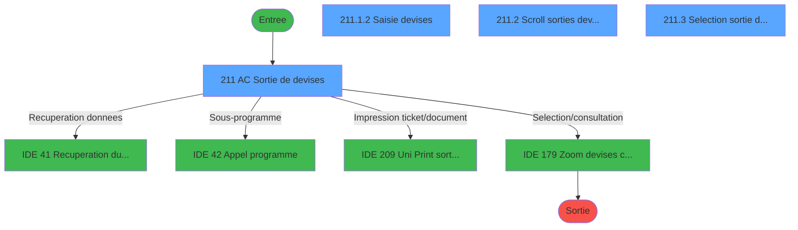
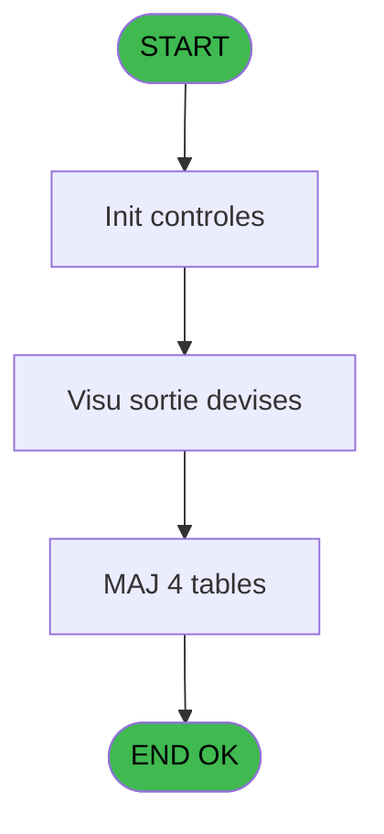
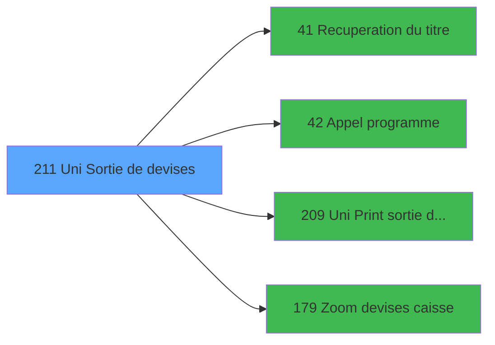

# VIL IDE 211 - Uni Sortie de devises

> **Analyse**: Phases 1-4 2026-02-03 21:05 -> 21:05 (15s) | Assemblage 21:05
> **Pipeline**: V7.2 Enrichi
> **Structure**: 4 onglets (Resume | Ecrans | Donnees | Connexions)

<!-- TAB:Resume -->

## 1. FICHE D'IDENTITE

| Attribut | Valeur |
|----------|--------|
| Projet | VIL |
| IDE Position | 211 |
| Nom Programme | Uni Sortie de devises |
| Fichier source | `Prg_211.xml` |
| Dossier IDE | Suppr |
| Taches | 12 (4 ecrans visibles) |
| Tables modifiees | 4 |
| Programmes appeles | 4 |
| :warning: Statut | **ORPHELIN_POTENTIEL** |

## 2. DESCRIPTION FONCTIONNELLE

**Uni Sortie de devises** assure la gestion complete de ce processus.

Le flux de traitement s'organise en **4 blocs fonctionnels** :

- **Traitement** (9 taches) : traitements metier divers
- **Calcul** (1 tache) : calculs de montants, stocks ou compteurs
- **Consultation** (1 tache) : ecrans de recherche, selection et consultation
- **Saisie** (1 tache) : ecrans de saisie utilisateur (formulaires, champs, donnees)

**Donnees modifiees** : 4 tables en ecriture (reseau_cloture___rec, devises_caisse___ddk, sorties_devises__sdk, lign_sortie_dev__ldk).

Detail : phases du traitement

#### Phase 1 : Traitement (9 taches)

- **211** - AC  Sortie de devises **[[ECRAN]](#ecran-t1)**
- **211.1** - Sans titre **[[ECRAN]](#ecran-t2)**
- **211.1.1** - Test si cloture en cours
- **211.1.1.1** - Blocage cloture
- **211.1.2.1** - MàJ ligne sortie devise
- **211.1.2.2** - MàJ sortie devise
- **211.1.3** - Deblocage cloture
- **211.2** - Scroll sorties devises **[[ECRAN]](#ecran-t10)**
- **211.4** - Lecture dernière sortie

Delegue a : [Recuperation du titre (IDE 41)](VIL-IDE-41.md), [Appel programme (IDE 42)](VIL-IDE-42.md)

#### Phase 2 : Saisie (1 tache)

- **211.1.2** - Saisie devises **[[ECRAN]](#ecran-t5)**

#### Phase 3 : Consultation (1 tache)

- **211.3** - Selection sortie devise **[[ECRAN]](#ecran-t11)**

Delegue a : [Recuperation du titre (IDE 41)](VIL-IDE-41.md), [Zoom  devises caisse (IDE 179)](VIL-IDE-179.md)

#### Phase 4 : Calcul (1 tache)

- **211.5** - Lecture date comptable

#### Tables impactees

| Table | Operations | Role metier |
|-------|-----------|-------------|
| reseau_cloture___rec | R/**W** (3 usages) | Donnees reseau/cloture |
| sorties_devises__sdk | R/**W** (3 usages) | Devises / taux de change |
| lign_sortie_dev__ldk | R/**W**/L (3 usages) |  |
| devises_caisse___ddk | **W** (1 usages) | Sessions de caisse |

## 3. BLOCS FONCTIONNELS

### 3.1 Traitement (9 taches)

Traitements internes.

---

#### 211 - AC  Sortie de devises [[ECRAN]](#ecran-t1)

**Role** : Tache d'orchestration : point d'entree du programme (9 sous-taches). Coordonne l'enchainement des traitements.
**Ecran** : 864 x 223 DLU (MDI) | [Voir mockup](#ecran-t1)

8 sous-taches directes

| Tache | Nom | Bloc |
|-------|-----|------|
| [211.1](#t2) | Sans titre **[[ECRAN]](#ecran-t2)** | Traitement |
| [211.1.1](#t3) | Test si cloture en cours | Traitement |
| [211.1.1.1](#t4) | Blocage cloture | Traitement |
| [211.1.2.1](#t6) | MàJ ligne sortie devise | Traitement |
| [211.1.2.2](#t7) | MàJ sortie devise | Traitement |
| [211.1.3](#t9) | Deblocage cloture | Traitement |
| [211.2](#t10) | Scroll sorties devises **[[ECRAN]](#ecran-t10)** | Traitement |
| [211.4](#t12) | Lecture dernière sortie | Traitement |

**Variables liees** : F (W0 date sortie visu), G (W0 heure sortie visu), H (W0 last-sortie date)
**Delegue a** : [Recuperation du titre (IDE 41)](VIL-IDE-41.md), [Appel programme (IDE 42)](VIL-IDE-42.md)

---

#### 211.1 - Sans titre [[ECRAN]](#ecran-t2)

**Role** : Traitement : Sans titre.
**Ecran** : 166 x 33 DLU (MDI) | [Voir mockup](#ecran-t2)
**Variables liees** : M (v. titre)
**Delegue a** : [Recuperation du titre (IDE 41)](VIL-IDE-41.md), [Appel programme (IDE 42)](VIL-IDE-42.md)

---

#### 211.1.1 - Test si cloture en cours

**Role** : Verification : Test si cloture en cours.
**Delegue a** : [Recuperation du titre (IDE 41)](VIL-IDE-41.md), [Appel programme (IDE 42)](VIL-IDE-42.md)

---

#### 211.1.1.1 - Blocage cloture

**Role** : Traitement : Blocage cloture.
**Delegue a** : [Recuperation du titre (IDE 41)](VIL-IDE-41.md), [Appel programme (IDE 42)](VIL-IDE-42.md)

---

#### 211.1.2.1 - MàJ ligne sortie devise

**Role** : Traitement : MàJ ligne sortie devise.
**Variables liees** : F (W0 date sortie visu), G (W0 heure sortie visu), H (W0 last-sortie date), I (W0 nbre de lignes)
**Delegue a** : [Recuperation du titre (IDE 41)](VIL-IDE-41.md), [Appel programme (IDE 42)](VIL-IDE-42.md)

---

#### 211.1.2.2 - MàJ sortie devise

**Role** : Traitement : MàJ sortie devise.
**Variables liees** : F (W0 date sortie visu), G (W0 heure sortie visu), H (W0 last-sortie date)
**Delegue a** : [Recuperation du titre (IDE 41)](VIL-IDE-41.md), [Appel programme (IDE 42)](VIL-IDE-42.md)

---

#### 211.1.3 - Deblocage cloture

**Role** : Traitement : Deblocage cloture.
**Delegue a** : [Recuperation du titre (IDE 41)](VIL-IDE-41.md), [Appel programme (IDE 42)](VIL-IDE-42.md)

---

#### 211.2 - Scroll sorties devises [[ECRAN]](#ecran-t10)

**Role** : Traitement : Scroll sorties devises.
**Ecran** : 926 x 218 DLU (MDI) | [Voir mockup](#ecran-t10)
**Delegue a** : [Recuperation du titre (IDE 41)](VIL-IDE-41.md), [Appel programme (IDE 42)](VIL-IDE-42.md)

---

#### 211.4 - Lecture dernière sortie

**Role** : Traitement : Lecture dernière sortie.
**Variables liees** : F (W0 date sortie visu), G (W0 heure sortie visu), H (W0 last-sortie date)
**Delegue a** : [Recuperation du titre (IDE 41)](VIL-IDE-41.md), [Appel programme (IDE 42)](VIL-IDE-42.md)

### 3.2 Saisie (1 tache)

L'operateur saisit les donnees de la transaction via 1 ecran (Saisie devises).

---

#### 211.1.2 - Saisie devises [[ECRAN]](#ecran-t5)

**Role** : Saisie des donnees : Saisie devises.
**Ecran** : 531 x 92 DLU (MDI) | [Voir mockup](#ecran-t5)

### 3.3 Consultation (1 tache)

Ecrans de recherche et consultation.

---

#### 211.3 - Selection sortie devise [[ECRAN]](#ecran-t11)

**Role** : Selection par l'operateur : Selection sortie devise.
**Ecran** : 501 x 145 DLU (MDI) | [Voir mockup](#ecran-t11)
**Variables liees** : F (W0 date sortie visu), G (W0 heure sortie visu), H (W0 last-sortie date)
**Delegue a** : [Zoom  devises caisse (IDE 179)](VIL-IDE-179.md)

### 3.4 Calcul (1 tache)

Calculs metier : montants, stocks, compteurs.

---

#### 211.5 - Lecture date comptable

**Role** : Traitement : Lecture date comptable.
**Variables liees** : D (W0 date comptable), E (W0 date cmpt visu), F (W0 date sortie visu), H (W0 last-sortie date), L (V date comptable - 1)

## 5. REGLES METIER

*(Aucune regle metier identifiee)*

## 6. CONTEXTE

- **Appele par**: (aucun)
- **Appelle**: 4 programmes | **Tables**: 7 (W:4 R:4 L:3) | **Taches**: 12 | **Expressions**: 10

<!-- TAB:Ecrans -->

## 8. ECRANS

### 8.1 Forms visibles (4 / 12)

| # | Position | Tache | Nom | Type | Largeur | Hauteur | Bloc |
|---|----------|-------|-----|------|---------|---------|------|
| 1 | 211 | 211 | AC  Sortie de devises | MDI | 864 | 223 | Traitement |
| 2 | 211.1.2 | 211.1.2 | Saisie devises | MDI | 531 | 92 | Saisie |
| 3 | 211.2 | 211.2 | Scroll sorties devises | MDI | 926 | 218 | Traitement |
| 4 | 211.3 | 211.3 | Selection sortie devise | MDI | 501 | 145 | Consultation |

### 8.2 Mockups Ecrans

---

#### 211 - AC  Sortie de devises
**Tache** : [211](#t1) | **Type** : MDI | **Dimensions** : 864 x 223 DLU
**Bloc** : Traitement | **Titre IDE** : AC  Sortie de devises

<!-- FORM-DATA:
{
    "width":  864,
    "vFactor":  8,
    "type":  "MDI",
    "hFactor":  8,
    "controls":  [
                     {
                         "x":  2,
                         "type":  "label",
                         "var":  "",
                         "y":  2,
                         "w":  859,
                         "fmt":  "",
                         "name":  "",
                         "h":  17,
                         "color":  "",
                         "text":  "",
                         "parent":  null
                     },
                     {
                         "x":  70,
                         "type":  "label",
                         "var":  "",
                         "y":  30,
                         "w":  721,
                         "fmt":  "",
                         "name":  "",
                         "h":  150,
                         "color":  "",
                         "text":  "",
                         "parent":  null
                     },
                     {
                         "x":  134,
                         "type":  "label",
                         "var":  "",
                         "y":  45,
                         "w":  206,
                         "fmt":  "",
                         "name":  "",
                         "h":  42,
                         "color":  "195",
                         "text":  "Date comptable",
                         "parent":  null
                     },
                     {
                         "x":  520,
                         "type":  "label",
                         "var":  "",
                         "y":  46,
                         "w":  206,
                         "fmt":  "",
                         "name":  "",
                         "h":  41,
                         "color":  "195",
                         "text":  "Dernière sortie",
                         "parent":  null
                     },
                     {
                         "x":  199,
                         "type":  "label",
                         "var":  "",
                         "y":  102,
                         "w":  463,
                         "fmt":  "",
                         "name":  "",
                         "h":  70,
                         "color":  "",
                         "text":  "",
                         "parent":  null
                     },
                     {
                         "x":  202,
                         "type":  "label",
                         "var":  "",
                         "y":  103,
                         "w":  458,
                         "fmt":  "",
                         "name":  "",
                         "h":  68,
                         "color":  "",
                         "text":  "",
                         "parent":  null
                     },
                     {
                         "x":  253,
                         "type":  "label",
                         "var":  "",
                         "y":  114,
                         "w":  356,
                         "fmt":  "",
                         "name":  "",
                         "h":  37,
                         "color":  "",
                         "text":  "",
                         "parent":  null
                     },
                     {
                         "x":  254,
                         "type":  "label",
                         "var":  "",
                         "y":  115,
                         "w":  50,
                         "fmt":  "",
                         "name":  "",
                         "h":  35,
                         "color":  "",
                         "text":  "",
                         "parent":  null
                     },
                     {
                         "x":  307,
                         "type":  "label",
                         "var":  "",
                         "y":  121,
                         "w":  299,
                         "fmt":  "",
                         "name":  "",
                         "h":  8,
                         "color":  "7",
                         "text":  "Rappel d\u0027une sortie existante",
                         "parent":  null
                     },
                     {
                         "x":  307,
                         "type":  "label",
                         "var":  "",
                         "y":  136,
                         "w":  291,
                         "fmt":  "",
                         "name":  "",
                         "h":  8,
                         "color":  "7",
                         "text":  "Création d\u0027une nouvelle sortie",
                         "parent":  null
                     },
                     {
                         "x":  294,
                         "type":  "label",
                         "var":  "",
                         "y":  157,
                         "w":  200,
                         "fmt":  "",
                         "name":  "",
                         "h":  8,
                         "color":  "",
                         "text":  "Choix de l\u0027action",
                         "parent":  null
                     },
                     {
                         "x":  0,
                         "type":  "label",
                         "var":  "",
                         "y":  199,
                         "w":  860,
                         "fmt":  "",
                         "name":  "",
                         "h":  23,
                         "color":  "",
                         "text":  "",
                         "parent":  null
                     },
                     {
                         "x":  508,
                         "type":  "edit",
                         "var":  "",
                         "y":  156,
                         "w":  32,
                         "fmt":  "#A",
                         "name":  "",
                         "h":  10,
                         "color":  "6",
                         "text":  "",
                         "parent":  null
                     },
                     {
                         "x":  168,
                         "type":  "edit",
                         "var":  "",
                         "y":  63,
                         "w":  138,
                         "fmt":  "DD/MM/YYYY",
                         "name":  "",
                         "h":  10,
                         "color":  "4",
                         "text":  "",
                         "parent":  5
                     },
                     {
                         "x":  565,
                         "type":  "edit",
                         "var":  "",
                         "y":  64,
                         "w":  126,
                         "fmt":  "DD/MM/YYYY",
                         "name":  "",
                         "h":  10,
                         "color":  "4",
                         "text":  "",
                         "parent":  6
                     },
                     {
                         "x":  643,
                         "type":  "edit",
                         "var":  "",
                         "y":  6,
                         "w":  203,
                         "fmt":  "WWW DD MMM YYYYT",
                         "name":  "",
                         "h":  8,
                         "color":  "",
                         "text":  "",
                         "parent":  1
                     },
                     {
                         "x":  369,
                         "type":  "image",
                         "var":  "",
                         "y":  60,
                         "w":  122,
                         "fmt":  "",
                         "name":  "",
                         "h":  27,
                         "color":  "",
                         "text":  "",
                         "parent":  null
                     },
                     {
                         "x":  266,
                         "type":  "button",
                         "var":  "",
                         "y":  120,
                         "w":  26,
                         "fmt":  "1",
                         "name":  "1",
                         "h":  9,
                         "color":  "",
                         "text":  "",
                         "parent":  null
                     },
                     {
                         "x":  266,
                         "type":  "button",
                         "var":  "",
                         "y":  135,
                         "w":  26,
                         "fmt":  "2",
                         "name":  "2",
                         "h":  9,
                         "color":  "",
                         "text":  "",
                         "parent":  null
                     },
                     {
                         "x":  7,
                         "type":  "button",
                         "var":  "",
                         "y":  202,
                         "w":  160,
                         "fmt":  "\u0026Quitter",
                         "name":  "",
                         "h":  18,
                         "color":  "",
                         "text":  "",
                         "parent":  null
                     },
                     {
                         "x":  8,
                         "type":  "edit",
                         "var":  "",
                         "y":  6,
                         "w":  363,
                         "fmt":  "30",
                         "name":  "",
                         "h":  8,
                         "color":  "",
                         "text":  "",
                         "parent":  1
                     }
                 ],
    "taskId":  "211",
    "height":  223
}
-->

<strong>Champs : 5 champs</strong>

| Pos (x,y) | Nom | Variable | Type |
|-----------|-----|----------|------|
| 508,156 | #A | - | edit |
| 168,63 | DD/MM/YYYY | - | edit |
| 565,64 | DD/MM/YYYY | - | edit |
| 643,6 | WWW DD MMM YYYYT | - | edit |
| 8,6 | 30 | - | edit |

<strong>Boutons : 3 boutons</strong>

| Bouton | Pos (x,y) | Action |
|--------|-----------|--------|
| 1 | 266,120 | Bouton fonctionnel |
| 2 | 266,135 | Bouton fonctionnel |
| Quitter | 7,202 | Quitte le programme |

---

#### 211.1.2 - Saisie devises
**Tache** : [211.1.2](#t5) | **Type** : MDI | **Dimensions** : 531 x 92 DLU
**Bloc** : Saisie | **Titre IDE** : Saisie devises

<!-- FORM-DATA:
{
    "width":  531,
    "vFactor":  8,
    "type":  "MDI",
    "hFactor":  8,
    "controls":  [
                     {
                         "x":  1,
                         "type":  "label",
                         "var":  "",
                         "y":  2,
                         "w":  527,
                         "fmt":  "",
                         "name":  "",
                         "h":  55,
                         "color":  "",
                         "text":  "",
                         "parent":  null
                     },
                     {
                         "x":  53,
                         "type":  "label",
                         "var":  "",
                         "y":  12,
                         "w":  69,
                         "fmt":  "",
                         "name":  "",
                         "h":  8,
                         "color":  "",
                         "text":  "Devise",
                         "parent":  null
                     },
                     {
                         "x":  141,
                         "type":  "label",
                         "var":  "",
                         "y":  12,
                         "w":  139,
                         "fmt":  "",
                         "name":  "",
                         "h":  8,
                         "color":  "",
                         "text":  "Mode paiement",
                         "parent":  null
                     },
                     {
                         "x":  358,
                         "type":  "label",
                         "var":  "",
                         "y":  12,
                         "w":  72,
                         "fmt":  "",
                         "name":  "",
                         "h":  8,
                         "color":  "",
                         "text":  "Quantité",
                         "parent":  null
                     },
                     {
                         "x":  0,
                         "type":  "label",
                         "var":  "",
                         "y":  66,
                         "w":  526,
                         "fmt":  "",
                         "name":  "",
                         "h":  24,
                         "color":  "",
                         "text":  "",
                         "parent":  null
                     },
                     {
                         "x":  315,
                         "type":  "edit",
                         "var":  "",
                         "y":  28,
                         "w":  160,
                         "fmt":  "# ### ### ###Z",
                         "name":  "W2 quantite",
                         "h":  10,
                         "color":  "6",
                         "text":  "",
                         "parent":  null
                     },
                     {
                         "x":  10,
                         "type":  "button",
                         "var":  "",
                         "y":  69,
                         "w":  160,
                         "fmt":  "\u0026Ok",
                         "name":  "Bouton validation",
                         "h":  18,
                         "color":  "",
                         "text":  "",
                         "parent":  null
                     },
                     {
                         "x":  63,
                         "type":  "edit",
                         "var":  "",
                         "y":  28,
                         "w":  48,
                         "fmt":  "",
                         "name":  "",
                         "h":  10,
                         "color":  "",
                         "text":  "",
                         "parent":  null
                     },
                     {
                         "x":  168,
                         "type":  "edit",
                         "var":  "",
                         "y":  28,
                         "w":  59,
                         "fmt":  "",
                         "name":  "",
                         "h":  10,
                         "color":  "",
                         "text":  "",
                         "parent":  null
                     },
                     {
                         "x":  186,
                         "type":  "button",
                         "var":  "",
                         "y":  69,
                         "w":  160,
                         "fmt":  "\u0026Abandonner",
                         "name":  "",
                         "h":  18,
                         "color":  "",
                         "text":  "",
                         "parent":  null
                     }
                 ],
    "taskId":  "211.1.2",
    "height":  92
}
-->

<strong>Champs : 3 champs</strong>

| Pos (x,y) | Nom | Variable | Type |
|-----------|-----|----------|------|
| 315,28 | W2 quantite | - | edit |
| 63,28 | (sans nom) | - | edit |
| 168,28 | (sans nom) | - | edit |

<strong>Boutons : 2 boutons</strong>

| Bouton | Pos (x,y) | Action |
|--------|-----------|--------|
| Ok | 10,69 | Valide la saisie et enregistre |
| Abandonner | 186,69 | Annule et retour au menu |

---

#### 211.2 - Scroll sorties devises
**Tache** : [211.2](#t10) | **Type** : MDI | **Dimensions** : 926 x 218 DLU
**Bloc** : Traitement | **Titre IDE** : Scroll sorties devises

<!-- FORM-DATA:
{
    "width":  926,
    "vFactor":  8,
    "type":  "MDI",
    "hFactor":  8,
    "controls":  [
                     {
                         "x":  0,
                         "type":  "label",
                         "var":  "",
                         "y":  0,
                         "w":  922,
                         "fmt":  "",
                         "name":  "",
                         "h":  17,
                         "color":  "",
                         "text":  "",
                         "parent":  null
                     },
                     {
                         "x":  7,
                         "type":  "label",
                         "var":  "",
                         "y":  24,
                         "w":  911,
                         "fmt":  "",
                         "name":  "",
                         "h":  164,
                         "color":  "",
                         "text":  "",
                         "parent":  null
                     },
                     {
                         "x":  339,
                         "type":  "table",
                         "var":  "",
                         "name":  "",
                         "titleH":  12,
                         "color":  "110",
                         "w":  556,
                         "y":  31,
                         "fmt":  "",
                         "parent":  null,
                         "text":  "",
                         "rowH":  13,
                         "h":  91,
                         "cols":  [
                                      {
                                          "title":  "Code devise",
                                          "layer":  1,
                                          "w":  115
                                      },
                                      {
                                          "title":  "Moyen de paiement",
                                          "layer":  2,
                                          "w":  170
                                      },
                                      {
                                          "title":  "Quantité",
                                          "layer":  3,
                                          "w":  239
                                      }
                                  ],
                         "rows":  3
                     },
                     {
                         "x":  41,
                         "type":  "label",
                         "var":  "",
                         "y":  36,
                         "w":  197,
                         "fmt":  "",
                         "name":  "",
                         "h":  44,
                         "color":  "",
                         "text":  "",
                         "parent":  null
                     },
                     {
                         "x":  43,
                         "type":  "label",
                         "var":  "",
                         "y":  37,
                         "w":  194,
                         "fmt":  "",
                         "name":  "",
                         "h":  42,
                         "color":  "",
                         "text":  "",
                         "parent":  null
                     },
                     {
                         "x":  66,
                         "type":  "label",
                         "var":  "",
                         "y":  43,
                         "w":  149,
                         "fmt":  "",
                         "name":  "",
                         "h":  9,
                         "color":  "",
                         "text":  "Sortie devise du",
                         "parent":  null
                     },
                     {
                         "x":  509,
                         "type":  "label",
                         "var":  "",
                         "y":  134,
                         "w":  268,
                         "fmt":  "",
                         "name":  "",
                         "h":  45,
                         "color":  "",
                         "text":  "",
                         "parent":  null
                     },
                     {
                         "x":  511,
                         "type":  "label",
                         "var":  "",
                         "y":  135,
                         "w":  264,
                         "fmt":  "",
                         "name":  "",
                         "h":  43,
                         "color":  "",
                         "text":  "",
                         "parent":  null
                     },
                     {
                         "x":  544,
                         "type":  "label",
                         "var":  "",
                         "y":  141,
                         "w":  188,
                         "fmt":  "",
                         "name":  "",
                         "h":  18,
                         "color":  "",
                         "text":  "",
                         "parent":  null
                     },
                     {
                         "x":  546,
                         "type":  "label",
                         "var":  "",
                         "y":  142,
                         "w":  34,
                         "fmt":  "",
                         "name":  "",
                         "h":  16,
                         "color":  "",
                         "text":  "",
                         "parent":  null
                     },
                     {
                         "x":  592,
                         "type":  "label",
                         "var":  "",
                         "y":  146,
                         "w":  117,
                         "fmt":  "",
                         "name":  "",
                         "h":  8,
                         "color":  "7",
                         "text":  "Impression",
                         "parent":  null
                     },
                     {
                         "x":  567,
                         "type":  "label",
                         "var":  "",
                         "y":  164,
                         "w":  114,
                         "fmt":  "",
                         "name":  "",
                         "h":  8,
                         "color":  "",
                         "text":  "Votre choix",
                         "parent":  null
                     },
                     {
                         "x":  0,
                         "type":  "label",
                         "var":  "",
                         "y":  194,
                         "w":  925,
                         "fmt":  "",
                         "name":  "",
                         "h":  23,
                         "color":  "",
                         "text":  "",
                         "parent":  null
                     },
                     {
                         "x":  376,
                         "type":  "edit",
                         "var":  "",
                         "y":  46,
                         "w":  42,
                         "fmt":  "",
                         "name":  "",
                         "h":  8,
                         "color":  "110",
                         "text":  "",
                         "parent":  5
                     },
                     {
                         "x":  523,
                         "type":  "edit",
                         "var":  "",
                         "y":  46,
                         "w":  53,
                         "fmt":  "",
                         "name":  "",
                         "h":  8,
                         "color":  "110",
                         "text":  "",
                         "parent":  5
                     },
                     {
                         "x":  634,
                         "type":  "edit",
                         "var":  "",
                         "y":  46,
                         "w":  221,
                         "fmt":  "",
                         "name":  "",
                         "h":  8,
                         "color":  "110",
                         "text":  "",
                         "parent":  5
                     },
                     {
                         "x":  683,
                         "type":  "edit",
                         "var":  "",
                         "y":  162,
                         "w":  26,
                         "fmt":  "UA",
                         "name":  "W1 choix action",
                         "h":  10,
                         "color":  "6",
                         "text":  "",
                         "parent":  null
                     },
                     {
                         "x":  9,
                         "type":  "edit",
                         "var":  "",
                         "y":  4,
                         "w":  395,
                         "fmt":  "30",
                         "name":  "",
                         "h":  8,
                         "color":  "",
                         "text":  "",
                         "parent":  null
                     },
                     {
                         "x":  709,
                         "type":  "edit",
                         "var":  "",
                         "y":  4,
                         "w":  203,
                         "fmt":  "WWW DD MMM YYYYT",
                         "name":  "",
                         "h":  8,
                         "color":  "",
                         "text":  "",
                         "parent":  null
                     },
                     {
                         "x":  79,
                         "type":  "edit",
                         "var":  "",
                         "y":  59,
                         "w":  120,
                         "fmt":  "DD/MM/YYYY",
                         "name":  "",
                         "h":  8,
                         "color":  "",
                         "text":  "",
                         "parent":  null
                     },
                     {
                         "x":  99,
                         "type":  "image",
                         "var":  "",
                         "y":  124,
                         "w":  163,
                         "fmt":  "",
                         "name":  "",
                         "h":  49,
                         "color":  "",
                         "text":  "",
                         "parent":  4
                     },
                     {
                         "x":  554,
                         "type":  "button",
                         "var":  "",
                         "y":  146,
                         "w":  18,
                         "fmt":  "I",
                         "name":  "I",
                         "h":  9,
                         "color":  "",
                         "text":  "",
                         "parent":  null
                     },
                     {
                         "x":  8,
                         "type":  "button",
                         "var":  "",
                         "y":  197,
                         "w":  160,
                         "fmt":  "\u0026Quitter",
                         "name":  "",
                         "h":  18,
                         "color":  "",
                         "text":  "",
                         "parent":  null
                     }
                 ],
    "taskId":  "211.2",
    "height":  218
}
-->

<strong>Champs : 7 champs</strong>

| Pos (x,y) | Nom | Variable | Type |
|-----------|-----|----------|------|
| 376,46 | (sans nom) | - | edit |
| 523,46 | (sans nom) | - | edit |
| 634,46 | (sans nom) | - | edit |
| 683,162 | W1 choix action | - | edit |
| 9,4 | 30 | - | edit |
| 709,4 | WWW DD MMM YYYYT | - | edit |
| 79,59 | DD/MM/YYYY | - | edit |

<strong>Boutons : 2 boutons</strong>

| Bouton | Pos (x,y) | Action |
|--------|-----------|--------|
| I | 554,146 | Bouton fonctionnel |
| Quitter | 8,197 | Quitte le programme |

---

#### 211.3 - Selection sortie devise
**Tache** : [211.3](#t11) | **Type** : MDI | **Dimensions** : 501 x 145 DLU
**Bloc** : Consultation | **Titre IDE** : Selection sortie devise

<!-- FORM-DATA:
{
    "width":  501,
    "vFactor":  8,
    "type":  "MDI",
    "hFactor":  8,
    "controls":  [
                     {
                         "x":  21,
                         "type":  "table",
                         "var":  "",
                         "name":  "",
                         "titleH":  12,
                         "color":  "196",
                         "w":  454,
                         "y":  6,
                         "fmt":  "",
                         "parent":  null,
                         "text":  "",
                         "rowH":  12,
                         "h":  91,
                         "cols":  [
                                      {
                                          "title":  "Date comptable",
                                          "layer":  1,
                                          "w":  167
                                      },
                                      {
                                          "title":  "Date sortie",
                                          "layer":  2,
                                          "w":  132
                                      },
                                      {
                                          "title":  "Heure sortie",
                                          "layer":  3,
                                          "w":  124
                                      }
                                  ],
                         "rows":  3
                     },
                     {
                         "x":  0,
                         "type":  "label",
                         "var":  "",
                         "y":  119,
                         "w":  498,
                         "fmt":  "",
                         "name":  "",
                         "h":  24,
                         "color":  "",
                         "text":  "",
                         "parent":  null
                     },
                     {
                         "x":  42,
                         "type":  "edit",
                         "var":  "",
                         "y":  21,
                         "w":  120,
                         "fmt":  "DD/MM/YYYYZ",
                         "name":  "",
                         "h":  8,
                         "color":  "196",
                         "text":  "",
                         "parent":  1
                     },
                     {
                         "x":  190,
                         "type":  "edit",
                         "var":  "",
                         "y":  21,
                         "w":  120,
                         "fmt":  "DD/MM/YYYYZ",
                         "name":  "",
                         "h":  8,
                         "color":  "196",
                         "text":  "",
                         "parent":  1
                     },
                     {
                         "x":  326,
                         "type":  "edit",
                         "var":  "",
                         "y":  21,
                         "w":  98,
                         "fmt":  "",
                         "name":  "",
                         "h":  8,
                         "color":  "196",
                         "text":  "",
                         "parent":  1
                     },
                     {
                         "x":  64,
                         "type":  "button",
                         "var":  "",
                         "y":  122,
                         "w":  160,
                         "fmt":  "\u0026Selectionner",
                         "name":  "",
                         "h":  18,
                         "color":  "",
                         "text":  "",
                         "parent":  null
                     },
                     {
                         "x":  295,
                         "type":  "button",
                         "var":  "",
                         "y":  122,
                         "w":  160,
                         "fmt":  "\u0026Quitter",
                         "name":  "",
                         "h":  18,
                         "color":  "",
                         "text":  "",
                         "parent":  null
                     },
                     {
                         "x":  220,
                         "type":  "image",
                         "var":  "",
                         "y":  99,
                         "w":  58,
                         "fmt":  "",
                         "name":  "",
                         "h":  18,
                         "color":  "",
                         "text":  "",
                         "parent":  null
                     }
                 ],
    "taskId":  "211.3",
    "height":  145
}
-->

<strong>Champs : 3 champs</strong>

| Pos (x,y) | Nom | Variable | Type |
|-----------|-----|----------|------|
| 42,21 | DD/MM/YYYYZ | - | edit |
| 190,21 | DD/MM/YYYYZ | - | edit |
| 326,21 | (sans nom) | - | edit |

<strong>Boutons : 2 boutons</strong>

| Bouton | Pos (x,y) | Action |
|--------|-----------|--------|
| Selectionner | 64,122 | Ouvre la selection |
| Quitter | 295,122 | Quitte le programme |

## 9. NAVIGATION

### 9.1 Enchainement des ecrans

**Detail par enchainement :**

| Depuis | Action | Vers | Retour |
|--------|--------|------|--------|
| AC  Sortie de devises | Recuperation donnees | [Recuperation du titre (IDE 41)](VIL-IDE-41.md) | Retour ecran |
| AC  Sortie de devises | Sous-programme | [Appel programme (IDE 42)](VIL-IDE-42.md) | Retour ecran |
| AC  Sortie de devises | Impression ticket/document | [Uni Print sortie devises (IDE 209)](VIL-IDE-209.md) | Retour ecran |
| AC  Sortie de devises | Selection/consultation | [Zoom  devises caisse (IDE 179)](VIL-IDE-179.md) | Retour ecran |

### 9.3 Structure hierarchique (12 taches)

| Position | Tache | Type | Dimensions | Bloc |
|----------|-------|------|------------|------|
| **211.1** | [**AC  Sortie de devises** (211)](#t1) [mockup](#ecran-t1) | MDI | 864x223 | Traitement |
| 211.1.1 | [Sans titre (211.1)](#t2) [mockup](#ecran-t2) | MDI | 166x33 | |
| 211.1.2 | [Test si cloture en cours (211.1.1)](#t3) | MDI | - | |
| 211.1.3 | [Blocage cloture (211.1.1.1)](#t4) | MDI | - | |
| 211.1.4 | [MàJ ligne sortie devise (211.1.2.1)](#t6) | MDI | - | |
| 211.1.5 | [MàJ sortie devise (211.1.2.2)](#t7) | MDI | - | |
| 211.1.6 | [Deblocage cloture (211.1.3)](#t9) | MDI | - | |
| 211.1.7 | [Scroll sorties devises (211.2)](#t10) [mockup](#ecran-t10) | MDI | 926x218 | |
| 211.1.8 | [Lecture dernière sortie (211.4)](#t12) | MDI | - | |
| **211.2** | [**Saisie devises** (211.1.2)](#t5) [mockup](#ecran-t5) | MDI | 531x92 | Saisie |
| **211.3** | [**Selection sortie devise** (211.3)](#t11) [mockup](#ecran-t11) | MDI | 501x145 | Consultation |
| **211.4** | [**Lecture date comptable** (211.5)](#t13) | MDI | - | Calcul |

### 9.4 Algorigramme

> **Legende**: Vert = START/END OK | Rouge = END KO | Bleu = Decisions
> *Algorigramme auto-genere. Utiliser `/algorigramme` pour une synthese metier detaillee.*

<!-- TAB:Donnees -->

## 10. TABLES

### Tables utilisees (7)

| ID | Nom | Description | Type | R | W | L | Usages |
|----|-----|-------------|------|---|---|---|--------|
| 23 | reseau_cloture___rec | Donnees reseau/cloture | DB | R | **W** |   | 3 |
| 57 | devises_caisse___ddk | Sessions de caisse | DB |   | **W** |   | 1 |
| 58 | sorties_devises__sdk | Devises / taux de change | DB | R | **W** |   | 3 |
| 59 | lign_sortie_dev__ldk |  | DB | R | **W** | L | 3 |
| 70 | date_comptable___dat |  | DB | R |   |   | 1 |
| 229 | detail_coffre_devise | Etat du coffre | DB |   |   | L | 1 |
| 348 | log_cloture_auto | Donnees reseau/cloture | DB |   |   | L | 1 |

### Colonnes par table (6 / 5 tables avec colonnes identifiees)

Table 23 - reseau_cloture___rec (R/**W**) - 3 usages

| Lettre | Variable | Acces | Type |
|--------|----------|-------|------|
| A | W2 fin tache | W | Alpha |
| B | W2 cloture en cours | W | Numeric |

Table 57 - devises_caisse___ddk (**W**) - 1 usages

| Lettre | Variable | Acces | Type |
|--------|----------|-------|------|
| A | W2 retour lien | W | Numeric |
| B | W2 quantite | W | Numeric |
| C | W2 validation | W | Alpha |
| D | Bouton validation | W | Alpha |

Table 58 - sorties_devises__sdk (R/**W**) - 3 usages

*Table utilisee uniquement en Link ou aucune colonne Real identifiee dans le DataView.*

Table 59 - lign_sortie_dev__ldk (R/**W**/L) - 3 usages

| Lettre | Variable | Acces | Type |
|--------|----------|-------|------|
| A | W1 choix action | W | Alpha |
| B | W1 fin tâche | W | Alpha |
| C | > v.titre | W | Alpha |

Table 70 - date_comptable___dat (R) - 1 usages

| Lettre | Variable | Acces | Type |
|--------|----------|-------|------|
| A | W1 date creation | R | Date |
| D | W0 date comptable | R | Date |
| E | W0 date cmpt visu | R | Date |
| F | W0 date sortie visu | R | Date |
| H | W0 last-sortie date | R | Date |
| L | V date comptable - 1 | R | Date |

## 11. VARIABLES

### 11.1 Parametres entrants (2)

Variables recues en parametre.

| Lettre | Nom | Type | Usage dans |
|--------|-----|------|-----------|
| A | P0 societe | Alpha | 1x parametre entrant |
| B | P0 nom village | Alpha | - |

### 11.2 Variables de session (2)

Variables persistantes pendant toute la session.

| Lettre | Nom | Type | Usage dans |
|--------|-----|------|-----------|
| L | V date comptable - 1 | Date | - |
| M | v. titre | Alpha | [211.1](#t2) |

### 11.3 Variables de travail (8)

Variables internes au programme.

| Lettre | Nom | Type | Usage dans |
|--------|-----|------|-----------|
| D | W0 date comptable | Date | - |
| E | W0 date cmpt visu | Date | - |
| F | W0 date sortie visu | Date | - |
| G | W0 heure sortie visu | Time | - |
| H | W0 last-sortie date | Date | - |
| I | W0 nbre de lignes | Numeric | 1x calcul interne |
| J | W0 validee | Alpha | - |
| K | W0 param bidon | Alpha | - |

### 11.4 Autres (1)

Variables diverses.

| Lettre | Nom | Type | Usage dans |
|--------|-----|------|-----------|
| C | V0 choix action | Alpha | 2x refs |

## 12. EXPRESSIONS

**10 / 10 expressions decodees (100%)**

### 12.1 Repartition par type

| Type | Expressions | Regles |
|------|-------------|--------|
| CONSTANTE | 3 | 0 |
| DATE | 1 | 0 |
| CONDITION | 4 | 0 |
| REFERENCE_VG | 1 | 0 |
| STRING | 1 | 0 |

### 12.2 Expressions cles par type

#### CONSTANTE (3 expressions)

| Type | IDE | Expression | Regle |
|------|-----|------------|-------|
| CONSTANTE | 7 | `''` | - |
| CONSTANTE | 6 | `100` | - |
| CONSTANTE | 1 | `'C'` | - |

#### DATE (1 expressions)

| Type | IDE | Expression | Regle |
|------|-----|------------|-------|
| DATE | 3 | `Date ()` | - |

#### CONDITION (4 expressions)

| Type | IDE | Expression | Regle |
|------|-----|------------|-------|
| CONDITION | 9 | `V0 choix action [C]='1'` | - |
| CONDITION | 10 | `W0 nbre de lignes [I]>0` | - |
| CONDITION | 2 | `P0 societe [A]=''` | - |
| CONDITION | 8 | `V0 choix action [C]='2'` | - |

#### REFERENCE_VG (1 expressions)

| Type | IDE | Expression | Regle |
|------|-----|------------|-------|
| REFERENCE_VG | 4 | `VG2` | - |

#### STRING (1 expressions)

| Type | IDE | Expression | Regle |
|------|-----|------------|-------|
| STRING | 5 | `Trim (v. titre [M])` | - |

<!-- TAB:Connexions -->

## 13. GRAPHE D'APPELS

### 13.1 Chaine depuis Main (Callers)

**Chemin**: (pas de callers directs)

### 13.2 Callers

| IDE | Nom Programme | Nb Appels |
|-----|---------------|-----------|
| - | (aucun) | - |

### 13.3 Callees (programmes appeles)

### 13.4 Detail Callees avec contexte

| IDE | Nom Programme | Appels | Contexte |
|-----|---------------|--------|----------|
| [41](VIL-IDE-41.md) | Recuperation du titre | 2 | Recuperation donnees |
| [42](VIL-IDE-42.md) | Appel programme | 2 | Sous-programme |
| [209](VIL-IDE-209.md) | Uni Print sortie devises | 2 | Impression ticket/document |
| [179](VIL-IDE-179.md) | Zoom  devises caisse | 1 | Selection/consultation |

## 14. RECOMMANDATIONS MIGRATION

### 14.1 Profil du programme

| Metrique | Valeur | Impact migration |
|----------|--------|-----------------|
| Lignes de logique | 214 | Taille moyenne |
| Expressions | 10 | Peu de logique |
| Tables WRITE | 4 | Impact modere |
| Sous-programmes | 4 | Peu de dependances |
| Ecrans visibles | 4 | Quelques ecrans |
| Code desactive | 0% (0 / 214) | Code sain |
| Regles metier | 0 | Pas de regle identifiee |

### 14.2 Plan de migration par bloc

#### Traitement (9 taches: 3 ecrans, 6 traitements)

- **Strategie** : Orchestrateur avec 3 ecrans (Razor/React) et 6 traitements backend (services).
- Les ecrans deviennent des composants UI, les traitements invisibles deviennent des services injectables.
- 4 sous-programme(s) a migrer ou a reutiliser depuis les services existants.
- Decomposer les taches en services unitaires testables.

#### Saisie (1 tache: 1 ecran, 0 traitement)

- **Strategie** : Formulaire React/Blazor avec validation Zod/FluentValidation.
- Reproduire 1 ecran : Saisie devises
- Validation temps reel cote client + serveur

#### Consultation (1 tache: 1 ecran, 0 traitement)

- **Strategie** : Composants de recherche/selection en modales.
- 1 ecran : Selection sortie devise

#### Calcul (1 tache: 0 ecran, 1 traitement)

- **Strategie** : Services de calcul purs (Domain Services).
- Migrer la logique de calcul (stock, compteurs, montants)

### 14.3 Dependances critiques

| Dependance | Type | Appels | Impact |
|------------|------|--------|--------|
| reseau_cloture___rec | Table WRITE (Database) | 2x | Schema + repository |
| devises_caisse___ddk | Table WRITE (Database) | 1x | Schema + repository |
| sorties_devises__sdk | Table WRITE (Database) | 1x | Schema + repository |
| lign_sortie_dev__ldk | Table WRITE (Database) | 1x | Schema + repository |
| [Uni Print sortie devises (IDE 209)](VIL-IDE-209.md) | Sous-programme | 2x | Haute - Impression ticket/document |
| [Appel programme (IDE 42)](VIL-IDE-42.md) | Sous-programme | 2x | Haute - Sous-programme |
| [Recuperation du titre (IDE 41)](VIL-IDE-41.md) | Sous-programme | 2x | Haute - Recuperation donnees |
| [Zoom  devises caisse (IDE 179)](VIL-IDE-179.md) | Sous-programme | 1x | Normale - Selection/consultation |

---
*Spec DETAILED generee par Pipeline V7.2 - 2026-02-03 21:06*
