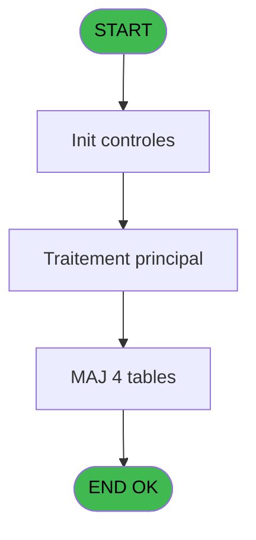
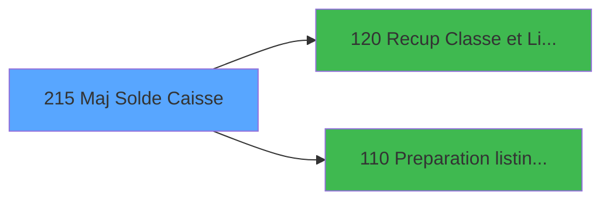

# VIL IDE 215 - Maj Solde Caisse

> **Analyse**: Phases 1-4 2026-02-03 21:06 -> 21:07 (12s) | Assemblage 21:07
> **Pipeline**: V7.2 Enrichi
> **Structure**: 4 onglets (Resume | Ecrans | Donnees | Connexions)

<!-- TAB:Resume -->

## 1. FICHE D'IDENTITE

| Attribut | Valeur |
|----------|--------|
| Projet | VIL |
| IDE Position | 215 |
| Nom Programme | Maj Solde Caisse |
| Fichier source | `Prg_215.xml` |
| Dossier IDE | Suppr |
| Taches | 10 (0 ecrans visibles) |
| Tables modifiees | 4 |
| Programmes appeles | 2 |
| :warning: Statut | **ORPHELIN_POTENTIEL** |

## 2. DESCRIPTION FONCTIONNELLE

**Maj Solde Caisse** assure la gestion complete de ce processus.

Le flux de traitement s'organise en **4 blocs fonctionnels** :

- **Traitement** (6 taches) : traitements metier divers
- **Calcul** (2 taches) : calculs de montants, stocks ou compteurs
- **Creation** (1 tache) : insertion d'enregistrements en base (mouvements, prestations)
- **Validation** (1 tache) : controles et verifications de coherence

**Donnees modifiees** : 4 tables en ecriture (backup_devises_caisse, solde_caisse_____sks, devises_caisse___ddk, import_logement__iml).

Detail : phases du traitement

#### Phase 1 : Validation (1 tache)

- **215** - AC  Verification caisse **[[ECRAN]](#ecran-t1)**

#### Phase 2 : Traitement (6 taches)

- **215.1** - Lecture solde veille
- **215.2** - Versements/Retraits
- **215.3** - Versements/Retraits
- **215.6** - MAJ nouveau solde
- **215.7.1** - Purge - 8
- **215.8** - MàJ solde caisse

#### Phase 3 : Calcul (2 taches)

- **215.4** - Calcul Pièces de Caisse
- **215.5** - Calcul Res Jour

Delegue a : [Preparation listing comptable (IDE 110)](VIL-IDE-110.md)

#### Phase 4 : Creation (1 tache)

- **215.7** - Create Bck Cafil35

#### Tables impactees

| Table | Operations | Role metier |
|-------|-----------|-------------|
| backup_devises_caisse | **W**/L (2 usages) | Sessions de caisse |
| devises_caisse___ddk | R/**W** (2 usages) | Sessions de caisse |
| solde_caisse_____sks | R/**W** (2 usages) | Sessions de caisse |
| import_logement__iml | **W** (1 usages) |  |

## 3. BLOCS FONCTIONNELS

### 3.1 Validation (1 tache)

Controles de coherence : 1 tache verifie les donnees et conditions.

---

#### 215 - AC  Verification caisse [[ECRAN]](#ecran-t1)

**Role** : Verification : AC  Verification caisse.
**Ecran** : 118 x 110 DLU (MDI) | [Voir mockup](#ecran-t1)

### 3.2 Traitement (6 taches)

Traitements internes.

---

#### 215.1 - Lecture solde veille

**Role** : Consultation/chargement : Lecture solde veille.
**Variables liees** : F (WP0 solde veille), I (WP0 Resultat Veille), J (WP0 Cumul Veille)

---

#### 215.2 - Versements/Retraits

**Role** : Traitement : Versements/Retraits.

---

#### 215.3 - Versements/Retraits

**Role** : Traitement : Versements/Retraits.

---

#### 215.6 - MAJ nouveau solde

**Role** : Consultation/chargement : MAJ nouveau solde.
**Variables liees** : F (WP0 solde veille)

---

#### 215.7.1 - Purge - 8

**Role** : Traitement : Purge - 8.

---

#### 215.8 - MàJ solde caisse

**Role** : Consultation/chargement : MàJ solde caisse.
**Variables liees** : F (WP0 solde veille)

### 3.3 Calcul (2 taches)

Calculs metier : montants, stocks, compteurs.

---

#### 215.4 - Calcul Pièces de Caisse

**Role** : Calcul : Calcul Pièces de Caisse.
**Delegue a** : [Preparation listing comptable (IDE 110)](VIL-IDE-110.md)

---

#### 215.5 - Calcul Res Jour

**Role** : Calcul : Calcul Res Jour.
**Variables liees** : K (WP0 Resultat Jour)
**Delegue a** : [Preparation listing comptable (IDE 110)](VIL-IDE-110.md)

### 3.4 Creation (1 tache)

Insertion de nouveaux enregistrements en base.

---

#### 215.7 - Create Bck Cafil35

**Role** : Traitement : Create Bck Cafil35.

## 5. REGLES METIER

*(Aucune regle metier identifiee)*

## 6. CONTEXTE

- **Appele par**: (aucun)
- **Appelle**: 2 programmes | **Tables**: 8 (W:4 R:4 L:3) | **Taches**: 10 | **Expressions**: 4

<!-- TAB:Ecrans -->

## 8. ECRANS

*(Programme sans ecran visible)*

## 9. NAVIGATION

### 9.3 Structure hierarchique (10 taches)

| Position | Tache | Type | Dimensions | Bloc |
|----------|-------|------|------------|------|
| **215.1** | [**AC  Verification caisse** (215)](#t1) [mockup](#ecran-t1) | MDI | 118x110 | Validation |
| **215.2** | [**Lecture solde veille** (215.1)](#t2) | MDI | - | Traitement |
| 215.2.1 | [Versements/Retraits (215.2)](#t3) | MDI | - | |
| 215.2.2 | [Versements/Retraits (215.3)](#t4) | MDI | - | |
| 215.2.3 | [MAJ nouveau solde (215.6)](#t7) | MDI | - | |
| 215.2.4 | [Purge - 8 (215.7.1)](#t9) | MDI | - | |
| 215.2.5 | [MàJ solde caisse (215.8)](#t10) | MDI | - | |
| **215.3** | [**Calcul Pièces de Caisse** (215.4)](#t5) | MDI | - | Calcul |
| 215.3.1 | [Calcul Res Jour (215.5)](#t6) | MDI | - | |
| **215.4** | [**Create Bck Cafil35** (215.7)](#t8) | MDI | - | Creation |

### 9.4 Algorigramme

> **Legende**: Vert = START/END OK | Rouge = END KO | Bleu = Decisions
> *Algorigramme auto-genere. Utiliser `/algorigramme` pour une synthese metier detaillee.*

<!-- TAB:Donnees -->

## 10. TABLES

### Tables utilisees (8)

| ID | Nom | Description | Type | R | W | L | Usages |
|----|-----|-------------|------|---|---|---|--------|
| 17 | backup_devises_caisse | Sessions de caisse | DB |   | **W** | L | 2 |
| 40 | comptable________cte |  | DB | R |   |   | 2 |
| 54 | pieces_caisse____pks | Sessions de caisse | DB | R |   |   | 1 |
| 55 | solde_caisse_____sks | Sessions de caisse | DB | R | **W** |   | 2 |
| 57 | devises_caisse___ddk | Sessions de caisse | DB | R | **W** |   | 2 |
| 140 | moyen_paiement___mop |  | DB |   |   | L | 1 |
| 224 | complement_pieces_de_caisse | Sessions de caisse | DB |   |   | L | 1 |
| 553 | import_logement__iml |  | DB |   | **W** |   | 1 |

### Colonnes par table (2 / 6 tables avec colonnes identifiees)

Table 17 - backup_devises_caisse (**W**/L) - 2 usages

*Table utilisee uniquement en Link ou aucune colonne Real identifiee dans le DataView.*

Table 40 - comptable________cte (R) - 2 usages

| Lettre | Variable | Acces | Type |
|--------|----------|-------|------|
| B | P0 date comptable | R | Date |

Table 54 - pieces_caisse____pks (R) - 1 usages

*Table utilisee uniquement en Link ou aucune colonne Real identifiee dans le DataView.*

Table 55 - solde_caisse_____sks (R/**W**) - 2 usages

| Lettre | Variable | Acces | Type |
|--------|----------|-------|------|
| F | WP0 solde veille | W | Numeric |

Table 57 - devises_caisse___ddk (R/**W**) - 2 usages

*Table utilisee uniquement en Link ou aucune colonne Real identifiee dans le DataView.*

Table 553 - import_logement__iml (**W**) - 1 usages

*Table utilisee uniquement en Link ou aucune colonne Real identifiee dans le DataView.*

## 11. VARIABLES

### 11.1 Parametres entrants (3)

Variables recues en parametre.

| Lettre | Nom | Type | Usage dans |
|--------|-----|------|-----------|
| A | P0 societe | Alpha | 1x parametre entrant |
| B | P0 date comptable | Date | - |
| C | P0 uni/bilateral | Alpha | 2x parametre entrant |

### 11.2 Autres (8)

Variables diverses.

| Lettre | Nom | Type | Usage dans |
|--------|-----|------|-----------|
| D | WP0 montant versmnt | Numeric | - |
| E | WP0 montant retrait | Numeric | - |
| F | WP0 solde veille | Numeric | - |
| G | WP0 pkes recette | Numeric | - |
| H | WP0 pkes depense | Numeric | - |
| I | WP0 Resultat Veille | Numeric | - |
| J | WP0 Cumul Veille | Numeric | - |
| K | WP0 Resultat Jour | Numeric | - |

## 12. EXPRESSIONS

**4 / 4 expressions decodees (100%)**

### 12.1 Repartition par type

| Type | Expressions | Regles |
|------|-------------|--------|
| CONSTANTE | 1 | 0 |
| CONDITION | 3 | 0 |

### 12.2 Expressions cles par type

#### CONSTANTE (1 expressions)

| Type | IDE | Expression | Regle |
|------|-----|------------|-------|
| CONSTANTE | 2 | `'C'` | - |

#### CONDITION (3 expressions)

| Type | IDE | Expression | Regle |
|------|-----|------------|-------|
| CONDITION | 4 | `P0 uni/bilateral [C]='B'` | - |
| CONDITION | 3 | `P0 uni/bilateral [C]<>'B'` | - |
| CONDITION | 1 | `P0 societe [A]=''` | - |

<!-- TAB:Connexions -->

## 13. GRAPHE D'APPELS

### 13.1 Chaine depuis Main (Callers)

**Chemin**: (pas de callers directs)

### 13.2 Callers

| IDE | Nom Programme | Nb Appels |
|-----|---------------|-----------|
| - | (aucun) | - |

### 13.3 Callees (programmes appeles)

### 13.4 Detail Callees avec contexte

| IDE | Nom Programme | Appels | Contexte |
|-----|---------------|--------|----------|
| [120](VIL-IDE-120.md) | Recup Classe et Lib du MOP | 2 | Recuperation donnees |
| [110](VIL-IDE-110.md) | Preparation listing comptable | 1 | Configuration impression |

## 14. RECOMMANDATIONS MIGRATION

### 14.1 Profil du programme

| Metrique | Valeur | Impact migration |
|----------|--------|-----------------|
| Lignes de logique | 167 | Programme compact |
| Expressions | 4 | Peu de logique |
| Tables WRITE | 4 | Impact modere |
| Sous-programmes | 2 | Peu de dependances |
| Ecrans visibles | 0 | Ecran unique ou traitement batch |
| Code desactive | 0% (0 / 167) | Code sain |
| Regles metier | 0 | Pas de regle identifiee |

### 14.2 Plan de migration par bloc

#### Validation (1 tache: 1 ecran, 0 traitement)

- **Strategie** : FluentValidation avec validators specifiques.
- Chaque tache de validation -> un validator injectable

#### Traitement (6 taches: 0 ecran, 6 traitements)

- **Strategie** : 6 service(s) backend injectable(s) (Domain Services).
- 2 sous-programme(s) a migrer ou a reutiliser depuis les services existants.
- Decomposer les taches en services unitaires testables.

#### Calcul (2 taches: 0 ecran, 2 traitements)

- **Strategie** : Services de calcul purs (Domain Services).
- Migrer la logique de calcul (stock, compteurs, montants)

#### Creation (1 tache: 0 ecran, 1 traitement)

- **Strategie** : Repository pattern avec Entity Framework Core.
- Insertion via `IRepository<T>.CreateAsync()`

### 14.3 Dependances critiques

| Dependance | Type | Appels | Impact |
|------------|------|--------|--------|
| backup_devises_caisse | Table WRITE (Database) | 1x | Schema + repository |
| solde_caisse_____sks | Table WRITE (Database) | 1x | Schema + repository |
| devises_caisse___ddk | Table WRITE (Database) | 1x | Schema + repository |
| import_logement__iml | Table WRITE (Database) | 1x | Schema + repository |
| [Recup Classe et Lib du MOP (IDE 120)](VIL-IDE-120.md) | Sous-programme | 2x | Haute - Recuperation donnees |
| [Preparation listing comptable (IDE 110)](VIL-IDE-110.md) | Sous-programme | 1x | Normale - Configuration impression |

---
*Spec DETAILED generee par Pipeline V7.2 - 2026-02-03 21:07*
