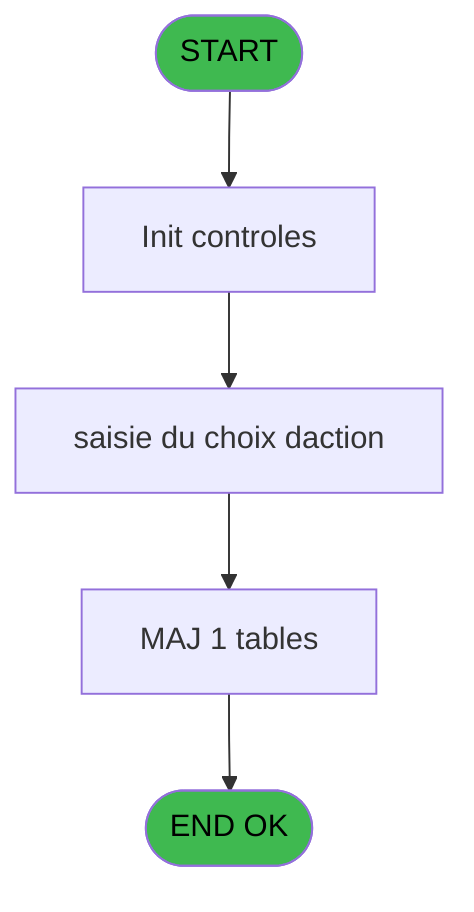
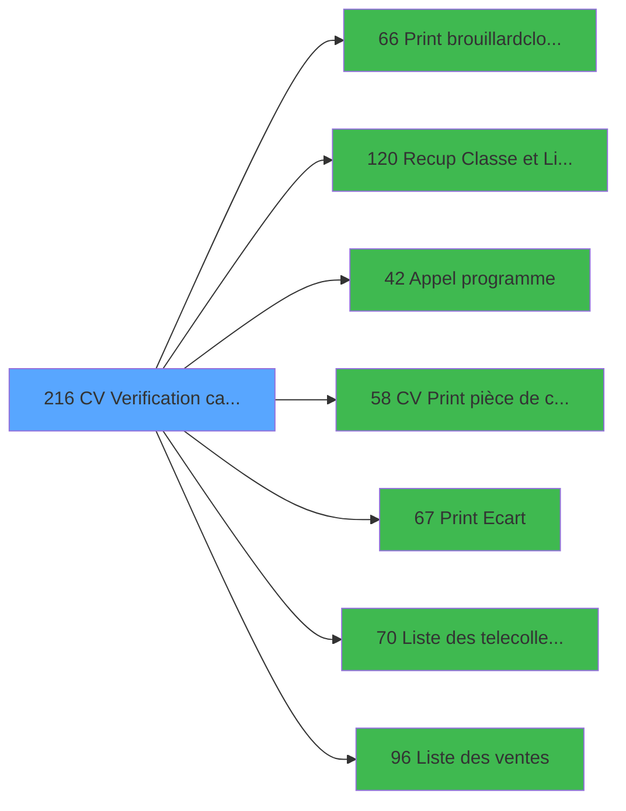

# VIL IDE 216 - CV  Verification caisse

> **Analyse**: Phases 1-4 2026-02-03 21:07 -> 21:07 (10s) | Assemblage 21:07
> **Pipeline**: V7.2 Enrichi
> **Structure**: 4 onglets (Resume | Ecrans | Donnees | Connexions)

<!-- TAB:Resume -->

## 1. FICHE D'IDENTITE

| Attribut | Valeur |
|----------|--------|
| Projet | VIL |
| IDE Position | 216 |
| Nom Programme | CV  Verification caisse |
| Fichier source | `Prg_216.xml` |
| Dossier IDE | Suppr |
| Taches | 9 (1 ecrans visibles) |
| Tables modifiees | 1 |
| Programmes appeles | 7 |
| :warning: Statut | **ORPHELIN_POTENTIEL** |

## 2. DESCRIPTION FONCTIONNELLE

**CV  Verification caisse** assure la gestion complete de ce processus.

Le flux de traitement s'organise en **3 blocs fonctionnels** :

- **Traitement** (7 taches) : traitements metier divers
- **Validation** (1 tache) : controles et verifications de coherence
- **Consultation** (1 tache) : ecrans de recherche, selection et consultation

**Donnees modifiees** : 1 tables en ecriture (solde_caisse_____sks).

Detail : phases du traitement

#### Phase 1 : Validation (1 tache)

- **216** - AC  Verification caisse **[[ECRAN]](#ecran-t1)**

#### Phase 2 : Consultation (1 tache)

- **216.1** - Affichage menu operations **[[ECRAN]](#ecran-t2)**

Delegue a : [Recup Classe et Lib du MOP (IDE 120)](VIL-IDE-120.md)

#### Phase 3 : Traitement (7 taches)

- **216.2** - Lecture solde veille
- **216.3** - (sans nom) **[[ECRAN]](#ecran-t4)**
- **216.4** - MAJ nouveau solde
- **216.5** - Versements/Retraits
- **216.6** - Versements/Retraits
- **216.7** - Recuperation n° pièce change
- **216.7.1** - Recup imputation chge

Delegue a : [Appel programme (IDE 42)](VIL-IDE-42.md), [Liste des telecollectes (IDE 70)](VIL-IDE-70.md)

#### Tables impactees

| Table | Operations | Role metier |
|-------|-----------|-------------|
| solde_caisse_____sks | R/**W** (2 usages) | Sessions de caisse |

## 3. BLOCS FONCTIONNELS

### 3.1 Validation (1 tache)

Controles de coherence : 1 tache verifie les donnees et conditions.

---

#### 216 - AC  Verification caisse [[ECRAN]](#ecran-t1)

**Role** : Verification : AC  Verification caisse.
**Ecran** : 118 x 110 DLU (MDI) | [Voir mockup](#ecran-t1)
**Variables liees** : F (P0 top verif caisse)

### 3.2 Consultation (1 tache)

Ecrans de recherche et consultation.

---

#### 216.1 - Affichage menu operations [[ECRAN]](#ecran-t2)

**Role** : Reinitialisation : Affichage menu operations.
**Ecran** : 773 x 245 DLU (MDI) | [Voir mockup](#ecran-t2)

### 3.3 Traitement (7 taches)

Traitements internes.

---

#### 216.2 - Lecture solde veille

**Role** : Consultation/chargement : Lecture solde veille.
**Variables liees** : Q (WP0 solde veille)
**Delegue a** : [Appel programme (IDE 42)](VIL-IDE-42.md), [Liste des telecollectes (IDE 70)](VIL-IDE-70.md)

---

#### 216.3 - (sans nom) [[ECRAN]](#ecran-t4)

**Role** : Traitement interne.
**Ecran** : 100 x 24 DLU (MDI) | [Voir mockup](#ecran-t4)
**Delegue a** : [Appel programme (IDE 42)](VIL-IDE-42.md), [Liste des telecollectes (IDE 70)](VIL-IDE-70.md)

---

#### 216.4 - MAJ nouveau solde

**Role** : Consultation/chargement : MAJ nouveau solde.
**Variables liees** : Q (WP0 solde veille)
**Delegue a** : [Appel programme (IDE 42)](VIL-IDE-42.md), [Liste des telecollectes (IDE 70)](VIL-IDE-70.md)

---

#### 216.5 - Versements/Retraits

**Role** : Traitement : Versements/Retraits.
**Delegue a** : [Appel programme (IDE 42)](VIL-IDE-42.md), [Liste des telecollectes (IDE 70)](VIL-IDE-70.md)

---

#### 216.6 - Versements/Retraits

**Role** : Traitement : Versements/Retraits.
**Delegue a** : [Appel programme (IDE 42)](VIL-IDE-42.md), [Liste des telecollectes (IDE 70)](VIL-IDE-70.md)

---

#### 216.7 - Recuperation n° pièce change

**Role** : Consultation/chargement : Recuperation n° pièce change.
**Variables liees** : E (P0 n° pièce change)
**Delegue a** : [Appel programme (IDE 42)](VIL-IDE-42.md), [Liste des telecollectes (IDE 70)](VIL-IDE-70.md)

---

#### 216.7.1 - Recup imputation chge

**Role** : Consultation/chargement : Recup imputation chge.
**Delegue a** : [Appel programme (IDE 42)](VIL-IDE-42.md), [Liste des telecollectes (IDE 70)](VIL-IDE-70.md)

## 5. REGLES METIER

*(Aucune regle metier identifiee)*

## 6. CONTEXTE

- **Appele par**: (aucun)
- **Appelle**: 7 programmes | **Tables**: 5 (W:1 R:4 L:1) | **Taches**: 9 | **Expressions**: 20

<!-- TAB:Ecrans -->

## 8. ECRANS

### 8.1 Forms visibles (1 / 9)

| # | Position | Tache | Nom | Type | Largeur | Hauteur | Bloc |
|---|----------|-------|-----|------|---------|---------|------|
| 1 | 216.1 | 216.1 | Affichage menu operations | MDI | 773 | 245 | Consultation |

### 8.2 Mockups Ecrans

---

#### 216.1 - Affichage menu operations
**Tache** : [216.1](#t2) | **Type** : MDI | **Dimensions** : 773 x 245 DLU
**Bloc** : Consultation | **Titre IDE** : Affichage menu operations

<!-- FORM-DATA:
{
    "width":  773,
    "vFactor":  8,
    "type":  "MDI",
    "hFactor":  8,
    "controls":  [
                     {
                         "x":  1,
                         "type":  "label",
                         "var":  "",
                         "y":  2,
                         "w":  768,
                         "fmt":  "",
                         "name":  "",
                         "h":  17,
                         "color":  "",
                         "text":  "",
                         "parent":  null
                     },
                     {
                         "x":  4,
                         "type":  "label",
                         "var":  "",
                         "y":  24,
                         "w":  761,
                         "fmt":  "",
                         "name":  "",
                         "h":  195,
                         "color":  "2",
                         "text":  "",
                         "parent":  null
                     },
                     {
                         "x":  65,
                         "type":  "label",
                         "var":  "",
                         "y":  41,
                         "w":  642,
                         "fmt":  "",
                         "name":  "",
                         "h":  46,
                         "color":  "",
                         "text":  "",
                         "parent":  null
                     },
                     {
                         "x":  70,
                         "type":  "label",
                         "var":  "",
                         "y":  47,
                         "w":  110,
                         "fmt":  "",
                         "name":  "",
                         "h":  9,
                         "color":  "",
                         "text":  "Solde veille",
                         "parent":  null
                     },
                     {
                         "x":  370,
                         "type":  "label",
                         "var":  "",
                         "y":  47,
                         "w":  133,
                         "fmt":  "",
                         "name":  "",
                         "h":  8,
                         "color":  "",
                         "text":  "Pces de caisse",
                         "parent":  null
                     },
                     {
                         "x":  70,
                         "type":  "label",
                         "var":  "",
                         "y":  59,
                         "w":  103,
                         "fmt":  "",
                         "name":  "",
                         "h":  9,
                         "color":  "",
                         "text":  "Versements",
                         "parent":  null
                     },
                     {
                         "x":  370,
                         "type":  "label",
                         "var":  "",
                         "y":  59,
                         "w":  133,
                         "fmt":  "",
                         "name":  "",
                         "h":  8,
                         "color":  "",
                         "text":  "Solde du jour",
                         "parent":  null
                     },
                     {
                         "x":  70,
                         "type":  "label",
                         "var":  "",
                         "y":  71,
                         "w":  78,
                         "fmt":  "",
                         "name":  "",
                         "h":  9,
                         "color":  "",
                         "text":  "Retraits",
                         "parent":  null
                     },
                     {
                         "x":  100,
                         "type":  "label",
                         "var":  "",
                         "y":  94,
                         "w":  572,
                         "fmt":  "",
                         "name":  "",
                         "h":  105,
                         "color":  "",
                         "text":  "",
                         "parent":  null
                     },
                     {
                         "x":  102,
                         "type":  "label",
                         "var":  "",
                         "y":  95,
                         "w":  568,
                         "fmt":  "",
                         "name":  "",
                         "h":  119,
                         "color":  "",
                         "text":  "",
                         "parent":  null
                     },
                     {
                         "x":  272,
                         "type":  "label",
                         "var":  "",
                         "y":  101,
                         "w":  367,
                         "fmt":  "",
                         "name":  "",
                         "h":  90,
                         "color":  "",
                         "text":  "",
                         "parent":  null
                     },
                     {
                         "x":  275,
                         "type":  "label",
                         "var":  "",
                         "y":  102,
                         "w":  42,
                         "fmt":  "",
                         "name":  "",
                         "h":  90,
                         "color":  "",
                         "text":  "",
                         "parent":  null
                     },
                     {
                         "x":  323,
                         "type":  "label",
                         "var":  "",
                         "y":  106,
                         "w":  235,
                         "fmt":  "",
                         "name":  "",
                         "h":  8,
                         "color":  "7",
                         "text":  "Listing ventes",
                         "parent":  null
                     },
                     {
                         "x":  323,
                         "type":  "label",
                         "var":  "",
                         "y":  128,
                         "w":  235,
                         "fmt":  "",
                         "name":  "",
                         "h":  8,
                         "color":  "7",
                         "text":  "Listing telecollectes",
                         "parent":  null
                     },
                     {
                         "x":  323,
                         "type":  "label",
                         "var":  "",
                         "y":  149,
                         "w":  235,
                         "fmt":  "",
                         "name":  "",
                         "h":  8,
                         "color":  "7",
                         "text":  "Brouillard de caisse",
                         "parent":  null
                     },
                     {
                         "x":  323,
                         "type":  "label",
                         "var":  "",
                         "y":  170,
                         "w":  235,
                         "fmt":  "",
                         "name":  "",
                         "h":  8,
                         "color":  "7",
                         "text":  "Clôture de caisse",
                         "parent":  null
                     },
                     {
                         "x":  373,
                         "type":  "label",
                         "var":  "",
                         "y":  197,
                         "w":  103,
                         "fmt":  "",
                         "name":  "",
                         "h":  8,
                         "color":  "",
                         "text":  "Votre choix",
                         "parent":  null
                     },
                     {
                         "x":  0,
                         "type":  "label",
                         "var":  "",
                         "y":  222,
                         "w":  772,
                         "fmt":  "",
                         "name":  "",
                         "h":  23,
                         "color":  "",
                         "text":  "",
                         "parent":  null
                     },
                     {
                         "x":  489,
                         "type":  "edit",
                         "var":  "",
                         "y":  196,
                         "w":  27,
                         "fmt":  "UA",
                         "name":  "W1 choix action",
                         "h":  10,
                         "color":  "6",
                         "text":  "",
                         "parent":  null
                     },
                     {
                         "x":  5,
                         "type":  "edit",
                         "var":  "",
                         "y":  6,
                         "w":  223,
                         "fmt":  "20",
                         "name":  "",
                         "h":  8,
                         "color":  "",
                         "text":  "",
                         "parent":  1
                     },
                     {
                         "x":  593,
                         "type":  "edit",
                         "var":  "",
                         "y":  6,
                         "w":  169,
                         "fmt":  "WWW DD MMM YYYYZ",
                         "name":  "",
                         "h":  8,
                         "color":  "",
                         "text":  "",
                         "parent":  1
                     },
                     {
                         "x":  65,
                         "type":  "edit",
                         "var":  "",
                         "y":  26,
                         "w":  642,
                         "fmt":  "50",
                         "name":  "",
                         "h":  15,
                         "color":  "7",
                         "text":  "",
                         "parent":  null
                     },
                     {
                         "x":  183,
                         "type":  "edit",
                         "var":  "",
                         "y":  47,
                         "w":  168,
                         "fmt":  "17",
                         "name":  "",
                         "h":  9,
                         "color":  "",
                         "text":  "",
                         "parent":  null
                     },
                     {
                         "x":  508,
                         "type":  "edit",
                         "var":  "",
                         "y":  47,
                         "w":  168,
                         "fmt":  "17",
                         "name":  "",
                         "h":  9,
                         "color":  "",
                         "text":  "",
                         "parent":  null
                     },
                     {
                         "x":  183,
                         "type":  "edit",
                         "var":  "",
                         "y":  59,
                         "w":  168,
                         "fmt":  "17",
                         "name":  "",
                         "h":  9,
                         "color":  "",
                         "text":  "",
                         "parent":  null
                     },
                     {
                         "x":  508,
                         "type":  "edit",
                         "var":  "",
                         "y":  59,
                         "w":  168,
                         "fmt":  "17",
                         "name":  "",
                         "h":  9,
                         "color":  "",
                         "text":  "",
                         "parent":  null
                     },
                     {
                         "x":  183,
                         "type":  "edit",
                         "var":  "",
                         "y":  71,
                         "w":  168,
                         "fmt":  "17",
                         "name":  "",
                         "h":  9,
                         "color":  "",
                         "text":  "",
                         "parent":  null
                     },
                     {
                         "x":  117,
                         "type":  "image",
                         "var":  "",
                         "y":  103,
                         "w":  133,
                         "fmt":  "",
                         "name":  "",
                         "h":  38,
                         "color":  "7",
                         "text":  "",
                         "parent":  null
                     },
                     {
                         "x":  283,
                         "type":  "button",
                         "var":  "",
                         "y":  106,
                         "w":  22,
                         "fmt":  "1",
                         "name":  "1",
                         "h":  9,
                         "color":  "",
                         "text":  "",
                         "parent":  null
                     },
                     {
                         "x":  589,
                         "type":  "edit",
                         "var":  "",
                         "y":  106,
                         "w":  38,
                         "fmt":  "2",
                         "name":  "",
                         "h":  8,
                         "color":  "",
                         "text":  "",
                         "parent":  null
                     },
                     {
                         "x":  283,
                         "type":  "button",
                         "var":  "",
                         "y":  127,
                         "w":  22,
                         "fmt":  "2",
                         "name":  "2",
                         "h":  9,
                         "color":  "",
                         "text":  "",
                         "parent":  null
                     },
                     {
                         "x":  589,
                         "type":  "edit",
                         "var":  "",
                         "y":  128,
                         "w":  38,
                         "fmt":  "2",
                         "name":  "",
                         "h":  8,
                         "color":  "",
                         "text":  "",
                         "parent":  null
                     },
                     {
                         "x":  283,
                         "type":  "button",
                         "var":  "",
                         "y":  148,
                         "w":  22,
                         "fmt":  "3",
                         "name":  "3",
                         "h":  9,
                         "color":  "",
                         "text":  "",
                         "parent":  null
                     },
                     {
                         "x":  589,
                         "type":  "edit",
                         "var":  "",
                         "y":  149,
                         "w":  38,
                         "fmt":  "2",
                         "name":  "",
                         "h":  8,
                         "color":  "",
                         "text":  "",
                         "parent":  null
                     },
                     {
                         "x":  124,
                         "type":  "image",
                         "var":  "",
                         "y":  144,
                         "w":  112,
                         "fmt":  "",
                         "name":  "",
                         "h":  50,
                         "color":  "7",
                         "text":  "",
                         "parent":  null
                     },
                     {
                         "x":  283,
                         "type":  "button",
                         "var":  "",
                         "y":  169,
                         "w":  22,
                         "fmt":  "4",
                         "name":  "4",
                         "h":  9,
                         "color":  "",
                         "text":  "",
                         "parent":  null
                     },
                     {
                         "x":  589,
                         "type":  "edit",
                         "var":  "",
                         "y":  170,
                         "w":  38,
                         "fmt":  "2",
                         "name":  "",
                         "h":  8,
                         "color":  "",
                         "text":  "",
                         "parent":  null
                     },
                     {
                         "x":  5,
                         "type":  "button",
                         "var":  "",
                         "y":  225,
                         "w":  137,
                         "fmt":  "\u0026Quitter",
                         "name":  "",
                         "h":  18,
                         "color":  "",
                         "text":  "",
                         "parent":  null
                     }
                 ],
    "taskId":  "216.1",
    "height":  245
}
-->

<strong>Champs : 13 champs</strong>

| Pos (x,y) | Nom | Variable | Type |
|-----------|-----|----------|------|
| 489,196 | W1 choix action | - | edit |
| 5,6 | 20 | - | edit |
| 593,6 | WWW DD MMM YYYYZ | - | edit |
| 65,26 | 50 | - | edit |
| 183,47 | 17 | - | edit |
| 508,47 | 17 | - | edit |
| 183,59 | 17 | - | edit |
| 508,59 | 17 | - | edit |
| 183,71 | 17 | - | edit |
| 589,106 | 2 | - | edit |
| 589,128 | 2 | - | edit |
| 589,149 | 2 | - | edit |
| 589,170 | 2 | - | edit |

<strong>Boutons : 5 boutons</strong>

| Bouton | Pos (x,y) | Action |
|--------|-----------|--------|
| 1 | 283,106 | Bouton fonctionnel |
| 2 | 283,127 | Bouton fonctionnel |
| 3 | 283,148 | Bouton fonctionnel |
| 4 | 283,169 | Bouton fonctionnel |
| Quitter | 5,225 | Quitte le programme |

## 9. NAVIGATION

Ecran unique: **Affichage menu operations**

### 9.3 Structure hierarchique (9 taches)

| Position | Tache | Type | Dimensions | Bloc |
|----------|-------|------|------------|------|
| **216.1** | [**AC  Verification caisse** (216)](#t1) [mockup](#ecran-t1) | MDI | 118x110 | Validation |
| **216.2** | [**Affichage menu operations** (216.1)](#t2) [mockup](#ecran-t2) | MDI | 773x245 | Consultation |
| **216.3** | [**Lecture solde veille** (216.2)](#t3) | MDI | - | Traitement |
| 216.3.1 | [(sans nom) (216.3)](#t4) [mockup](#ecran-t4) | MDI | 100x24 | |
| 216.3.2 | [MAJ nouveau solde (216.4)](#t5) | MDI | - | |
| 216.3.3 | [Versements/Retraits (216.5)](#t6) | MDI | - | |
| 216.3.4 | [Versements/Retraits (216.6)](#t7) | MDI | - | |
| 216.3.5 | [Recuperation n° pièce change (216.7)](#t8) | MDI | - | |
| 216.3.6 | [Recup imputation chge (216.7.1)](#t9) | MDI | - | |

### 9.4 Algorigramme

> **Legende**: Vert = START/END OK | Rouge = END KO | Bleu = Decisions
> *Algorigramme auto-genere. Utiliser `/algorigramme` pour une synthese metier detaillee.*

<!-- TAB:Donnees -->

## 10. TABLES

### Tables utilisees (5)

| ID | Nom | Description | Type | R | W | L | Usages |
|----|-----|-------------|------|---|---|---|--------|
| 40 | comptable________cte |  | DB | R |   |   | 2 |
| 54 | pieces_caisse____pks | Sessions de caisse | DB | R |   |   | 1 |
| 55 | solde_caisse_____sks | Sessions de caisse | DB | R | **W** |   | 2 |
| 66 | imputations______imp |  | DB | R |   |   | 1 |
| 140 | moyen_paiement___mop |  | DB |   |   | L | 1 |

### Colonnes par table (3 / 4 tables avec colonnes identifiees)

Table 40 - comptable________cte (R) - 2 usages

| Lettre | Variable | Acces | Type |
|--------|----------|-------|------|
| D | P0 date comptable | R | Date |

Table 54 - pieces_caisse____pks (R) - 1 usages

| Lettre | Variable | Acces | Type |
|--------|----------|-------|------|
| F | P0 top verif caisse | R | Alpha |

Table 55 - solde_caisse_____sks (R/**W**) - 2 usages

| Lettre | Variable | Acces | Type |
|--------|----------|-------|------|
| F | P0 top verif caisse | W | Alpha |
| Q | WP0 solde veille | W | Numeric |

Table 66 - imputations______imp (R) - 1 usages

*Table utilisee uniquement en Link ou aucune colonne Real identifiee dans le DataView.*

## 11. VARIABLES

### 11.1 Parametres entrants (11)

Variables recues en parametre.

| Lettre | Nom | Type | Usage dans |
|--------|-----|------|-----------|
| A | P0 societe | Alpha | 1x parametre entrant |
| B | P0 nbre decimales | Numeric | - |
| C | P0 masque cumul | Alpha | - |
| D | P0 date comptable | Date | - |
| E | P0 n° pièce change | Numeric | - |
| F | P0 top verif caisse | Alpha | [216](#t1) |
| G | P0 devise locale | Alpha | 1x parametre entrant |
| H | P0 masque montant | Alpha | 1x parametre entrant |
| I | P0 nom village | Alpha | - |
| J | P0 uni/bilateral | Alpha | 2x parametre entrant |
| K | P0 Action Abandon | Alpha | - |

### 11.2 Variables de travail (6)

Variables internes au programme.

| Lettre | Nom | Type | Usage dans |
|--------|-----|------|-----------|
| L | W0 clôture/ventes | Alpha | - |
| M | W0 clôture/telecollectes | Alpha | 1x calcul interne |
| N | W0 clôture/brouillar | Alpha | 1x calcul interne |
| W | W0 choix action | Alpha | - |
| X | W0 message | Alpha | 6x calcul interne |
| Y | W0 resultat ventes | Numeric | 2x calcul interne |

### 11.3 Autres (12)

Variables diverses.

| Lettre | Nom | Type | Usage dans |
|--------|-----|------|-----------|
| O | WP0 montant versmnt | Numeric | 1x refs |
| P | WP0 montant retrait | Numeric | - |
| Q | WP0 solde veille | Numeric | - |
| R | WP0 pkes recette | Numeric | - |
| S | WP0 pkes depense | Numeric | - |
| T | WP0 dev. local bidon | Alpha | - |
| U | WP0 masque montant | Alpha | - |
| V | WP0 appel depuis clô | Alpha | - |
| Z | WP0 Versement CASH | Numeric | - |
| BA | WP0 Versement NON CASH | Numeric | - |
| BB | WP0 Retrait CASH | Numeric | - |
| BC | WP0 Retrait NON CASH | Numeric | - |

Toutes les 29 variables (liste complete)

| Cat | Lettre | Nom Variable | Type |
|-----|--------|--------------|------|
| P0 | **A** | P0 societe | Alpha |
| P0 | **B** | P0 nbre decimales | Numeric |
| P0 | **C** | P0 masque cumul | Alpha |
| P0 | **D** | P0 date comptable | Date |
| P0 | **E** | P0 n° pièce change | Numeric |
| P0 | **F** | P0 top verif caisse | Alpha |
| P0 | **G** | P0 devise locale | Alpha |
| P0 | **H** | P0 masque montant | Alpha |
| P0 | **I** | P0 nom village | Alpha |
| P0 | **J** | P0 uni/bilateral | Alpha |
| P0 | **K** | P0 Action Abandon | Alpha |
| W0 | **L** | W0 clôture/ventes | Alpha |
| W0 | **M** | W0 clôture/telecollectes | Alpha |
| W0 | **N** | W0 clôture/brouillar | Alpha |
| W0 | **W** | W0 choix action | Alpha |
| W0 | **X** | W0 message | Alpha |
| W0 | **Y** | W0 resultat ventes | Numeric |
| Autre | **O** | WP0 montant versmnt | Numeric |
| Autre | **P** | WP0 montant retrait | Numeric |
| Autre | **Q** | WP0 solde veille | Numeric |
| Autre | **R** | WP0 pkes recette | Numeric |
| Autre | **S** | WP0 pkes depense | Numeric |
| Autre | **T** | WP0 dev. local bidon | Alpha |
| Autre | **U** | WP0 masque montant | Alpha |
| Autre | **V** | WP0 appel depuis clô | Alpha |
| Autre | **Z** | WP0 Versement CASH | Numeric |
| Autre | **BA** | WP0 Versement NON CASH | Numeric |
| Autre | **BB** | WP0 Retrait CASH | Numeric |
| Autre | **BC** | WP0 Retrait NON CASH | Numeric |

## 12. EXPRESSIONS

**20 / 20 expressions decodees (100%)**

### 12.1 Repartition par type

| Type | Expressions | Regles |
|------|-------------|--------|
| CONSTANTE | 7 | 0 |
| CONDITION | 10 | 0 |
| OTHER | 3 | 0 |

### 12.2 Expressions cles par type

#### CONSTANTE (7 expressions)

| Type | IDE | Expression | Regle |
|------|-----|------------|-------|
| CONSTANTE | 17 | `''` | - |
| CONSTANTE | 18 | `0` | - |
| CONSTANTE | 19 | `'2'` | - |
| CONSTANTE | 16 | `2` | - |
| CONSTANTE | 2 | `'C'` | - |
| ... | | *+2 autres* | |

#### CONDITION (10 expressions)

| Type | IDE | Expression | Regle |
|------|-----|------------|-------|
| CONDITION | 12 | `P0 uni/bilateral [J]<>'B'` | - |
| CONDITION | 11 | `W0 message [X]='3' AND W0 clôture/brouillar [N]='O' AND P0 top verif caisse [F]<>'O'` | - |
| CONDITION | 13 | `P0 uni/bilateral [J]='B'` | - |
| CONDITION | 15 | `W0 resultat ventes [Y]<>''` | - |
| CONDITION | 14 | `W0 message [X]='4' AND WP0 montant versmnt [O]='O' AND P0 top verif caisse [F]<>'O'` | - |
| ... | | *+5 autres* | |

#### OTHER (3 expressions)

| Type | IDE | Expression | Regle |
|------|-----|------------|-------|
| OTHER | 20 | `W0 resultat ventes [Y]` | - |
| OTHER | 5 | `P0 masque montant [H]` | - |
| OTHER | 4 | `P0 devise locale [G]` | - |

<!-- TAB:Connexions -->

## 13. GRAPHE D'APPELS

### 13.1 Chaine depuis Main (Callers)

**Chemin**: (pas de callers directs)

### 13.2 Callers

| IDE | Nom Programme | Nb Appels |
|-----|---------------|-----------|
| - | (aucun) | - |

### 13.3 Callees (programmes appeles)

### 13.4 Detail Callees avec contexte

| IDE | Nom Programme | Appels | Contexte |
|-----|---------------|--------|----------|
| [66](VIL-IDE-66.md) | Print brouillard/cloture | 2 | Impression ticket/document |
| [120](VIL-IDE-120.md) | Recup Classe et Lib du MOP | 2 | Recuperation donnees |
| [42](VIL-IDE-42.md) | Appel programme | 1 | Sous-programme |
| [58](VIL-IDE-58.md) | CV  Print pièce de caisse | 1 | Impression ticket/document |
| [67](VIL-IDE-67.md) | Print Ecart | 1 | Impression ticket/document |
| [70](VIL-IDE-70.md) | Liste des telecollectes | 1 | Configuration impression |
| [96](VIL-IDE-96.md) | Liste des ventes | 1 | Configuration impression |

## 14. RECOMMANDATIONS MIGRATION

### 14.1 Profil du programme

| Metrique | Valeur | Impact migration |
|----------|--------|-----------------|
| Lignes de logique | 201 | Taille moyenne |
| Expressions | 20 | Peu de logique |
| Tables WRITE | 1 | Impact faible |
| Sous-programmes | 7 | Dependances moderees |
| Ecrans visibles | 1 | Ecran unique ou traitement batch |
| Code desactive | 0% (0 / 201) | Code sain |
| Regles metier | 0 | Pas de regle identifiee |

### 14.2 Plan de migration par bloc

#### Validation (1 tache: 1 ecran, 0 traitement)

- **Strategie** : FluentValidation avec validators specifiques.
- Chaque tache de validation -> un validator injectable

#### Consultation (1 tache: 1 ecran, 0 traitement)

- **Strategie** : Composants de recherche/selection en modales.
- 1 ecran : Affichage menu operations

#### Traitement (7 taches: 1 ecran, 6 traitements)

- **Strategie** : Orchestrateur avec 1 ecrans (Razor/React) et 6 traitements backend (services).
- Les ecrans deviennent des composants UI, les traitements invisibles deviennent des services injectables.
- 7 sous-programme(s) a migrer ou a reutiliser depuis les services existants.
- Decomposer les taches en services unitaires testables.

### 14.3 Dependances critiques

| Dependance | Type | Appels | Impact |
|------------|------|--------|--------|
| solde_caisse_____sks | Table WRITE (Database) | 1x | Schema + repository |
| [Recup Classe et Lib du MOP (IDE 120)](VIL-IDE-120.md) | Sous-programme | 2x | Haute - Recuperation donnees |
| [Print brouillard/cloture (IDE 66)](VIL-IDE-66.md) | Sous-programme | 2x | Haute - Impression ticket/document |
| [Liste des telecollectes (IDE 70)](VIL-IDE-70.md) | Sous-programme | 1x | Normale - Configuration impression |
| [Liste des ventes (IDE 96)](VIL-IDE-96.md) | Sous-programme | 1x | Normale - Configuration impression |
| [Print Ecart (IDE 67)](VIL-IDE-67.md) | Sous-programme | 1x | Normale - Impression ticket/document |
| [Appel programme (IDE 42)](VIL-IDE-42.md) | Sous-programme | 1x | Normale - Sous-programme |
| [CV  Print pièce de caisse (IDE 58)](VIL-IDE-58.md) | Sous-programme | 1x | Normale - Impression ticket/document |

---
*Spec DETAILED generee par Pipeline V7.2 - 2026-02-03 21:07*
